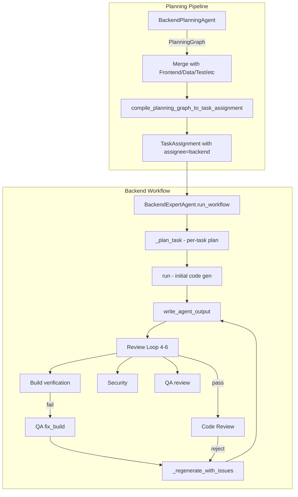

# Backend Agent Max Cycles and Erroneous Code: Root Causes and Solutions

## Executive Summary

The backend coding agent hits max cycles (20 review iterations, 6 same build failures) and errors out due to a combination of: (1) overly broad tasks from planning, (2) full regeneration on every fix attempt (no incremental patching), (3) nested pre-write loops that multiply LLM calls, (4) weak feedback quality when build fails, and (5) task_plan being dropped in the fix loop. Proposed solutions include splitting the backend planning agent, adding a Build-Fix specialist, reducing nested loops, and improving task granularity enforcement.

---

## Architecture Overview

---

## Root Cause Analysis

### 1. Task Granularity from Backend Planning Agent

**Location:** [backend_planning_agent/prompts.py](agents/software_engineering_team/planning_team/backend_planning_agent/prompts.py)

The prompt says "Split backend work into granular tasks" but enforcement is weak. The LLM can still emit monolithic tasks like:

- `backend-todo-crud-api` (models + CRUD + validation + error handling in one task)
- `backend-auth` (token hashing + store + middleware + protected routes)

**Impact:** A monolithic task requires implementing many files at once. The agent generates more code, more tests, and more surface area for errors. When build fails, the fix scope is unclear and the agent often re-generates everything, introducing new errors.

**Evidence:** [fix_backend_agent_issues_2717aae0.plan.md](agents/plans/fix_backend_agent_issues_2717aae0.plan.md) documents "tests reference non-existent endpoints" because one task tried to add tests for validation endpoints that were never implemented in the same pass.

---

### 2. task_plan Dropped in Fix Loop

**Location:** [backend_agent/agent.py](agents/software_engineering_team/backend_agent/agent.py) lines 1670-1716

`_regenerate_with_issues()` does NOT pass `task_plan` into `BackendInput`. The coding agents planning phase explicitly chose this: "planning only for initial gen" ([coding_agents_planning_phase_8cff79ab.plan.md](agents/plans/coding_agents_planning_phase_8cff79ab.plan.md)).

**Impact:** When fixing build/QA/security/code-review issues, the agent has no plan to anchor to. It sees "fix these issues" but not "the original plan was: what_changes X, tests_needed Y". The agent may:

- Remove code that was correct to "fix" an issue
- Add code that conflicts with the original plan
- Drift from the intended implementation

---

### 3. Full Regeneration on Every Fix (No Incremental Patching)

**Location:** [backend_agent/agent.py](agents/software_engineering_team/backend_agent/agent.py) `_regenerate_with_issues` (lines 1670-1716)

Each fix calls `self.run(BackendInput(...))` with the full codebase as `existing_code` and the issues to fix. The LLM re-generates the entire solution from scratch.

**Impact:**

- Context grows: existing_code can be 10K+ chars; spec + architecture + issues add more
- The agent may "fix" one issue but break another (e.g. remove `/test-generic-error` when fixing a different route)
- Same error can repeat because the agent doesn't see "you already tried X and it failed"

---

### 4. Nested Pre-write Loops Multiply LLM Calls

**Location:** [backend_agent/agent.py](agents/software_engineering_team/backend_agent/agent.py) lines 759-816, 838-906, 1106-1132, 1179-1259, 1326-1346

Inside each review iteration, there are nested loops up to `MAX_SAME_BUILD_FAILURES` (6) for:

- Pre-flight: tests reference routes missing from main.py
- After build fix
- After code review fix
- After acceptance verifier fix
- After security fix
- After QA fix

Each iteration of these loops calls `_regenerate_with_issues` and `write_agent_output`. If the agent keeps producing main.py without `/test-generic-error`, we can hit 6 regenerations per review iteration.

**Impact:** Worst case: 20 review iterations × 6 pre-write attempts = 120+ LLM calls for a single task. Even typical cases can hit 30-50 calls.

---

### 5. QA fix_build Produces Generic Recommendations

**Location:** [qa_agent/prompts.py](agents/software_engineering_team/qa_agent/prompts.py) QA_PROMPT_FIX_BUILD

The QA agent receives build_errors and produces bug reports with "recommendation". But:

- QA agent may produce vague recommendations ("Fix the compilation/test errors")
- When QA returns empty bugs_found, the backend falls back to `_build_code_review_issues_for_build_failure` which has a generic "Fix the build/test errors" suggestion
- For exception-handler failures, there is targeted logic (preserve /test-generic-error) but it's buried in code_review_issues, not always surfaced clearly

**Impact:** The backend agent gets "Fix the build/test errors" and tries again with no concrete guidance. Same error repeats.

---

### 6. Backend Prompt Complexity and Competing Rules

**Location:** [backend_agent/prompts.py](agents/software_engineering_team/backend_agent/prompts.py)

BACKEND_PROMPT is ~165 lines with many rules: file naming, SQLAlchemy UUID, Pydantic validators, exception handlers, OpenAPI, DBC, etc. When the agent is in problem-solving mode, it also gets a problem-solving header with 7 instructions.

**Impact:** Under token pressure, the model may prioritize some rules over others. Critical rules (e.g. "preserve /test-generic-error") can be lost when the prompt is long.

---

### 7. Per-task Plan Too Brief

**Location:** [backend_agent/prompts.py](agents/software_engineering_team/backend_agent/prompts.py) BACKEND_PLANNING_PROMPT

"keep each under ~200 words" for feature_intent, what_changes, algorithms_data_structures, tests_needed. For complex tasks, 200 words may not be enough to specify:

- Exact file paths for each change
- Order of implementation
- Which routes must exist for tests

---

### 8. Empty Completion and Stub Fallback

**Location:** [backend_agent/agent.py](agents/software_engineering_team/backend_agent/agent.py) lines 2152-2225

After 4 retries with empty files, the agent injects a minimal stub (app/main.py with /health only). This allows the workflow to "progress" but the task is not fulfilled. Build may pass, but the next task or acceptance verifier will fail.

---

## Proposed Solutions

### Solution A: Enforce Task Granularity in Backend Planning

**Goal:** Ensure backend tasks are small enough that the coding agent can implement them in one or two passes.

**Changes:**

1. **Backend Planning Agent prompt:** Add explicit constraints:
  - "Each TASK node must cover at most: 1 resource (e.g. tasks OR users), 3 endpoints max, OR 1 service module."
  - "If the spec describes CRUD for an entity, emit at least 3 tasks: backend-{entity}-models, backend-{entity}-crud-endpoints, backend-{entity}-validation."
2. **Post-processing validation:** In `compile_planning_graph_to_task_assignment` or a new validation step, reject/flag tasks where `details` contains "and" with 4+ items (e.g. "models and endpoints and validation and error handling").
3. **Task split at runtime:** If BackendExpertAgent receives a task and `_plan_task` produces a plan with >5 items in what_changes, set `needs_clarification=true` and ask Tech Lead to split the task.

**Files:** [backend_planning_agent/prompts.py](agents/software_engineering_team/planning_team/backend_planning_agent/prompts.py), [planning_graph.py](agents/software_engineering_team/planning_team/planning_graph.py), [backend_agent/agent.py](agents/software_engineering_team/backend_agent/agent.py)

---

### Solution B: Add Build-Fix Specialist Agent

**Goal:** When build fails repeatedly (2+ same error), delegate to a focused agent that produces minimal, targeted fixes.

**Design:**

- New agent: `BuildFixSpecialistAgent` (or mode in QA agent)
- Input: build_errors, failing test file content, current code for the affected files only
- Output: List of concrete edits (file path, line range, old text, new text) OR a minimal patch
- Backend workflow: When `consecutive_same_build_failures >= 2`, call BuildFixSpecialist instead of full `_regenerate_with_issues`
- Specialist prompt: "Produce ONLY the minimal change to fix this error. Do not refactor. Do not add features. Preserve all existing routes and handlers."

**Files:** New `agents/software_engineering_team/build_fix_specialist/` or extend [qa_agent](agents/software_engineering_team/qa_agent/)

---

### Solution C: Pass task_plan into Fix Loop (Conditional)

**Goal:** When fixing issues, keep the agent anchored to the original plan so it doesn't drift.

**Changes:**

1. Store `plan_text` from `_plan_task` in a variable before the clarification loop.
2. In `_regenerate_with_issues`, add optional `task_plan: Optional[str] = None`.
3. When calling `_regenerate_with_issues` from the review loop, pass `task_plan=plan_text` for the first 2-3 fix attempts. After that, drop it (in case the plan is wrong and causing the loop).
4. Add to BackendInput: "When fixing issues, you must still satisfy the Implementation plan. Do not remove or change code that fulfills the plan unless the issue explicitly requires it."

**Files:** [backend_agent/agent.py](agents/software_engineering_team/backend_agent/agent.py), [backend_agent/models.py](agents/software_engineering_team/backend_agent/models.py)

---

### Solution D: Cap Nested Pre-write Loops

**Goal:** Prevent 6× regeneration when pre-flight detects missing routes.

**Changes:**

1. Replace `for _ in range(MAX_SAME_BUILD_FAILURES)` in pre-write loops with `for _ in range(2)` (or new constant `MAX_PREWRITE_REGENERATIONS = 2`).
2. After 2 failed pre-write attempts, log and proceed to write (or fail the task with a clear message: "Could not generate main.py with required test routes after 2 attempts").
3. Rationale: If the agent can't add /test-generic-error after 2 targeted attempts, a 3rd-6th attempt is unlikely to help; fail fast and let Tech Lead create a follow-up task.

**Files:** [backend_agent/agent.py](agents/software_engineering_team/backend_agent/agent.py)

---

### Solution E: Improve QA fix_build Output Format

**Goal:** Give the backend agent more actionable fix instructions.

**Changes:**

1. **QA_PROMPT_FIX_BUILD:** Require each bug report to include:
  - `file_path`: exact file
  - `line_or_section`: optional line number or function name
  - `recommendation`: Must start with a verb (Add, Remove, Change, Fix) and be one concrete sentence. Example: "Add `@app.get('/test-generic-error')` route that raises an exception, and ensure the exception handler returns JSONResponse(status_code=500, content={...}) without re-raising."
2. **Backend fallback:** When `_build_code_review_issues_for_build_failure` is used, ensure the suggestion is always specific (use the existing exception-handler branch logic for /test-generic-error; for other errors, try to extract file:line from build output and include in suggestion).

**Files:** [qa_agent/prompts.py](agents/software_engineering_team/qa_agent/prompts.py), [backend_agent/agent.py](agents/software_engineering_team/backend_agent/agent.py)

---

### Solution F: Split Backend Planning into Sub-Agents (Optional, Larger Refactor)

**Goal:** Reduce variance by having specialists produce focused task graphs.

**Design:**

- **DataPlanningAgent** (may already exist): models, schema, migrations
- **APIEndpointPlanningAgent:** CRUD endpoints, validation, error handling
- **ServicePlanningAgent:** business logic, background jobs

Each produces a slice of the PlanningGraph. Tech Lead merges them. Tasks are inherently smaller.

**Trade-off:** More agents, more LLM calls in planning phase. Use only if Solution A is insufficient.

---

### Solution G: Escalation Path After 3 Same Build Failures

**Goal:** Avoid burning through all 6 same-build-failure slots with the same strategy.

**Changes:**

1. When `consecutive_same_build_failures == 3`, try BuildFixSpecialist (Solution B) if implemented.
2. When `consecutive_same_build_failures == 4`, add to the prompt: "Consider whether the failing test expectations are wrong. If the test asserts behavior that conflicts with the spec, you may need to update the test rather than the implementation. Explain your reasoning."
3. When `consecutive_same_build_failures == 5`, create a follow-up task via Tech Lead and exit early (don't wait for 6). The follow-up task can be "Fix build: [error summary]" with minimal scope.

**Files:** [backend_agent/agent.py](agents/software_engineering_team/backend_agent/agent.py)

---

## Implementation Priority

| Priority | Solution                        | Effort | Impact                                 |
| -------- | ------------------------------- | ------ | -------------------------------------- |
| 1        | D: Cap nested pre-write loops   | Low    | High (reduces LLM call multiplication) |
| 2        | A: Enforce task granularity     | Medium | High (fewer monolithic tasks)          |
| 3        | C: Pass task_plan into fix loop | Low    | Medium (reduces drift)                 |
| 4        | E: Improve QA fix_build output  | Low    | Medium (better fix instructions)       |
| 5        | B: Build-Fix Specialist         | Medium | High (targeted fixes when stuck)       |
| 6        | G: Escalation path              | Low    | Medium (fail fast, create follow-up)   |
| 7        | F: Split planning sub-agents    | High   | High (if A is insufficient)            |

---

## Key Files Reference

- Backend agent workflow: [backend_agent/agent.py](agents/software_engineering_team/backend_agent/agent.py) (run_workflow, _regenerate_with_issues, review loop)
- Backend prompts: [backend_agent/prompts.py](agents/software_engineering_team/backend_agent/prompts.py)
- Backend planning: [backend_planning_agent/agent.py](agents/software_engineering_team/planning_team/backend_planning_agent/agent.py), [backend_planning_agent/prompts.py](agents/software_engineering_team/planning_team/backend_planning_agent/prompts.py)
- Task compilation: [planning_graph.py](agents/software_engineering_team/planning_team/planning_graph.py) (compile_planning_graph_to_task_assignment)
- QA fix_build: [qa_agent/prompts.py](agents/software_engineering_team/qa_agent/prompts.py), [qa_agent/agent.py](agents/software_engineering_team/qa_agent/agent.py)
- Constants: MAX_REVIEW_ITERATIONS=20, MAX_SAME_BUILD_FAILURES=6, MAX_CLARIFICATION_ROUNDS=20

