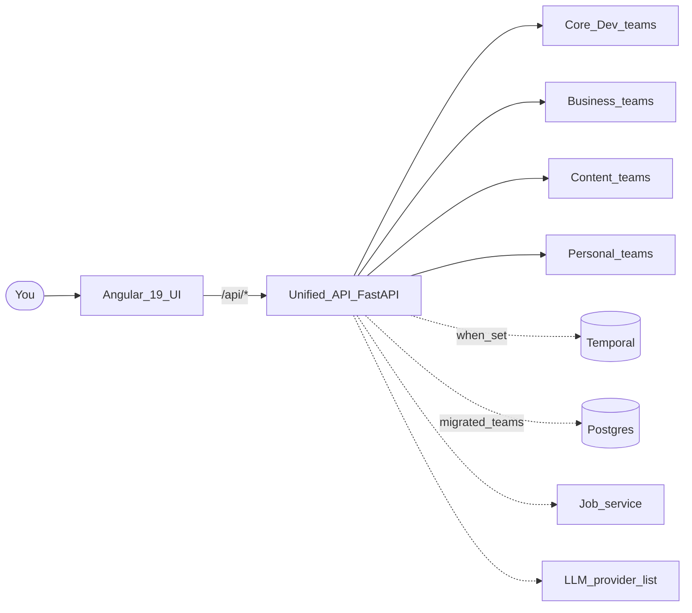

<p align="center">
  
</p>

<h1 align="center">Khala</h1>

<p align="center">
  <em>Many teams. One mind. One objective. Yours.</em><br/>
  <sub>A personal project for building agentic AI teams that actually work together — and, eventually, build themselves</sub>
</p>

<p align="center">
  <a href="https://brandonkindred.github.io/Khala-Agentic-AI-Teams/">Live site</a>
  ·
  <a href="#quickstart">Quickstart</a>
  ·
  <a href="#architecture-at-a-glance">Architecture</a>
  ·
  <a href="#meet-the-current-roster">Roster</a>
  ·
  <a href="#add-your-own-team">Add a team</a>
</p>

<p align="center">
  
  
  
  
  
  
  
</p>

---

## You don't need a team. You need a Khala.

**Khala is a set of agentic AI teams that you collaborate with.**

Khala is made up of teams of [AWS Strands](https://strandsagents.com/) agents. Each team has an assistant that collaborates with you and communicates with the team it is assigned to. Every team plugs into the same shared mind, so you can bring them in on whatever you are working on:

- **Ship a spec into code** — the Software Engineering team runs Discovery → Design → Execution → Integration alongside you: planning, code + tests + docs in parallel backend/frontend queues, merging when the quality gates pass.
- **Figure out a market** — Market Research pairs with you on user discovery and concept viability; Planning turns the conversation into a PRD the dev teams can run with.
- **Plan a launch** — Blogging (research → planning → draft → copy-edit → gates) writes with you; Social Marketing builds per-platform campaigns; the Sales team runs B2B prospecting, qualification, and close.
- **Pass an audit** — SOC2 Compliance drives the workflow; Accessibility Audit reports WCAG 2.2 / Section 508 findings for web and mobile.
- **Run a portfolio** — the Investment team pairs a Financial Advisor (IPS, proposals, memos) with a Strategy Lab (ideation, backtests) behind one API prefix.
- **Poke at something ambiguous** — Deepthought recursively spawns the specialist sub-agents it needs to decompose and answer the question with you.

The teams share infrastructure: a Unified FastAPI gateway with an optional security pre-scan, a shared Postgres schema registry for migrated teams, a central job service, a shared artifact cache, and a pluggable LLM client. Set `TEMPORAL_ADDRESS` and teams that export Temporal workflows switch from in-process threads to durable executions that survive restarts; teams without workflows keep using threads.

**And Khala is built to grow its own roster.** The real project here is not only the current teams — it is the system that *makes* agentic teams and lets them operate as one mind. Describe a new team in plain English to Agentic Team Provisioning (or author a single agent in Agent Studio), or register one yourself in [`backend/unified_api/config.py`](backend/unified_api/config.py). Every lesson learned building the current teams feeds back into how the next ones get built.

> **Many teams. One mind. One objective. Yours.**

### What exactly is Khala?

A personal project to figure out how to build agentic AI teams that work together. This started as a vibe-coded experiment and that was a disaster, so now it is being turned into a real engineered system — and from there into the thing it is really after: **an agentic AI that can look at a problem, decide what kind of team would solve it, spin up ephemeral specialist agents to do the work, learn from what landed and what did not, and keep the agents that earn their keep.** The 23 enabled teams here today are the substrate for that learning, not the destination. Follow along.

If you want to build, tinker, and help push the frontier of multi-agent systems, welcome aboard.

<sub>Named after the Protoss unifying religion from StarCraft — a psionic link joining many minds into one. Old-school nerd naming; don't judge.</sub>

---

## Why Khala?

- **One gateway, one mind.** Every team mounts under `/api/<team-slug>` behind a single FastAPI server with an optional security pre-scan. The whole roster is addressable — and collaborates — as one.
- **Crashes become replays, not restarts.** Set `TEMPORAL_ADDRESS` and workflow-enabled teams run durably on Temporal. Everyone else keeps running as background threads.
- **Bring your own LLM.** Configure an ordered provider list in the UI at `/llm-config` (Postgres-backed). Each entry carries its own provider, model, base URL, and encrypted API key; the client picks the preferred entry that is not usage-limited and fails over on 429.
- **A real dev team, not a code snippet generator.** Four phases, parallel backend/frontend queues, quality gates per task, and repair when something explodes. [See the pipeline →](docs/ARCHITECTURE.md)
- **Observability built in.** Services are auto-instrumented by `prometheus-fastapi-instrumentator`; Prometheus and a provisioned Grafana dashboard ship in the Compose file.
- **Built to grow its own roster.** New teams are not a plugin afterthought — they are the product. Describe one to Agentic Team Provisioning, author an agent in Agent Studio, or register it yourself in `TEAM_CONFIGS`.
- **One command to launch the stack.** `docker compose up --build` brings up Postgres, Temporal, the job service, every team, the Unified API, the UI, Prometheus, and Grafana.

---

> [!WARNING]
> **Khala is experimental.** The agents in this project are active research, not a production-ready product. Outputs can be incomplete, inconsistent, or just plain wrong; APIs change without notice; a team that shipped a feature yesterday may hit a wall today. Run it in isolated environments, keep humans in the loop for anything that matters, and treat every generated artifact (code, audits, trades, compliance reports) as a draft that needs review before you rely on it. If you are looking for a hardened platform with SLAs, this is not it — yet.

---

## Quickstart

### The Docker way (recommended — full stack)

```bash
cp docker/.env.example docker/.env
# Fill in any secrets you need in docker/.env (see docker/README.md)
docker compose -f docker/docker-compose.yml --env-file docker/.env up --build
```

This brings up Postgres 18, Temporal + Temporal UI, Neo4j (optional for some graph features), the central **job-service**, a per-team microservice for every enabled proxy team (ports 8090–8111), the Unified API, the Angular UI, and Prometheus + Grafana. First-run image builds and healthchecks take a few minutes; subsequent starts are much faster.

Then open:

| Surface | URL |
|---|---|
| UI | http://localhost:4201 |
| Unified API + docs | http://localhost:8888/docs |
| Temporal UI | http://localhost:8080 |
| Job service (host-mapped) | http://localhost:8585 |
| Prometheus | http://localhost:9090 |
| Grafana | http://localhost:3000 (default `admin` / `admin`) |

**Configure an LLM before expecting agent work.** After Postgres is up, open the UI at [`/llm-config`](http://localhost:4201/llm-config) (or call `/api/llm-config/providers`) and add at least one provider entry with its own API key. The Postgres provider list is the sole source of live LLM resolution for agents — env vars alone do not configure a working provider. See [LLM configuration](#llm-configuration) below.

Full stack details — ports, volumes, observability — in [`docker/README.md`](docker/README.md).

### The local way (hack on the code)

Local dev runs the Unified API as a single FastAPI process that mounts every enabled team's router in-process (no per-team containers). Migrated teams and the LLM provider list require Postgres (no SQLite fallback). Every team's `JobServiceClient` requires `JOB_SERVICE_URL`.

```bash
# 1) Infra (from repo root)
docker compose -f docker/docker-compose.yml --env-file docker/.env up -d postgres job-service

export POSTGRES_HOST=localhost
export POSTGRES_PORT=5432
export POSTGRES_USER=postgres
export POSTGRES_PASSWORD=postgres
export POSTGRES_DB=khala
# Compose maps job-service 8085 → host 8585
export JOB_SERVICE_URL=http://localhost:8585

# 2) Backend (terminal 1)
cd backend
make install-dev
make run
# → http://localhost:8080/docs

# 3) Frontend (terminal 2)
cd user-interface
nvm use                 # Node 22
npm ci
npm start
# → http://localhost:4200
```

Then add an LLM provider at http://localhost:4200/llm-config (or set `LLM_PROVIDER=dummy` for the no-LLM test harness).

Handy Makefile targets from `backend/`: `make lint`, `make lint-fix`, `make test`, `make run`.

More setup detail: [`docs/ENV_VARS.md`](docs/ENV_VARS.md), [`user-interface/README.md`](user-interface/README.md), [`CLAUDE.md`](CLAUDE.md).

---

## Architecture at a glance



**Runtime modes**

- **Local / Unified API process** (`make run` or `python run_unified_api.py`): one FastAPI process mounts every enabled team's router under `/api/<slug>`; teams execute as Python threads by default.
- **Docker**: most teams run as their own microservice (ports 8090–8111). The `khala` container on host port **8888** reverse-proxies `/api/<slug>` to the matching `*_SERVICE_URL`. Three teams mount **in-process** on the Unified API instead of a separate container: User Profile, Product Delivery, and Agent Studio.
- **Temporal mode**: when `TEMPORAL_ADDRESS` is set, teams that export `WORKFLOWS` / `ACTIVITIES` register workers and run durable workflows instead of threads.

**Shared platform pieces**

| Piece | Where | Role |
|---|---|---|
| Unified API | [`backend/unified_api/`](backend/unified_api/) | Mounts / proxies every team; security gateway; `TEAM_CONFIGS` |
| Job service | Compose `job-service` | Central async job store required by team APIs |
| Postgres schema registry | [`backend/shared/postgres/`](backend/shared/postgres/) | Pattern B: teams export `SCHEMA`; registered at FastAPI lifespan |
| Temporal workers | [`backend/shared/temporal/`](backend/shared/temporal/) | Pattern A: teams export `WORKFLOWS` / `ACTIVITIES` |
| LLM client | [`backend/agents/llm_service/`](backend/agents/llm_service/) | Ordered Postgres provider list + failover |
| Agent cache | `AGENT_CACHE` (Docker: `/data/agents`) | Per-team namespaced artifacts under `{team_name}/` |
| Agent Console / Registry | UI `/agent-console`; [`agent_platform/registry`](backend/agents/agent_platform/registry/), [`agent_console`](backend/agents/agent_console/) | Discover, inspect, and run specialist agents |

The Software Engineering deep dive (phases, task graphs, quality gates, Product Delivery loop) lives in [`docs/ARCHITECTURE.md`](docs/ARCHITECTURE.md). Repo orientation for agents and humans: [`CLAUDE.md`](CLAUDE.md).

---

## Meet the current roster

Today Khala ships with **23 enabled specialist teams** behind one gateway, grouped into Core Dev, Business, Content, and Personal. This is the current roster, not the ceiling — Khala is a system for *making* agentic teams. The authoritative source is always [`backend/unified_api/config.py`](backend/unified_api/config.py) (`TEAM_CONFIGS` / `get_enabled_teams()`). On a live instance, `GET /teams` reflects the same set.

Investment Strategy Lab is configured but **disabled** as its own mount; its HTTP routes are served under the Investment API (`/api/investment/strategy-lab/...`).

### Core Dev — build, plan, and evolve software

| Team | Route | What it does |
|---|---|---|
| **Software Engineering** | `/api/software-engineering` | Full pod — architecture, planning, coding, review, release. Hand it a spec, get merged work through quality gates. |
| **Planning** | `/api/planning` | Turns a fuzzy idea into a PRD the dev teams can build from. |
| **Coding Team** | `/api/coding-team` | Tech Lead + stack specialists with a task graph. The SE team's execution engine. |
| **AI Systems** | `/api/ai-systems` | Spec-driven factory that builds the AI agent system you describe. |
| **Agent Provisioning** | `/api/agent-provisioning` | Stands up the sandbox (database, git, docker) so a new agent can run. |
| **Agentic Team Provisioning** | `/api/agentic-team-provisioning` | Describe the team you wish you had; it designs roster and process with you. |
| **Testing Personas** | `/api/user-agent-founder` | Create personas and direct them to autonomously test other teams. |
| **Deepthought** | `/api/deepthought` | Asks itself what specialists it needs, spawns them, synthesizes the answer. |
| **Product Delivery** | `/api/product-delivery` | Persistent backlog (products → stories), WSJF/RICE grooming, feedback loop. In-process. |
| **Agent Studio** | `/api/agent-studio` | Author one agent end to end: draft, clone from registry, save and register live. In-process. |
| **User Profile** | `/api/user-profile` | Cross-team profile + registry linking you to artifacts other teams produce. In-process. |

### Business — the grown-up functions

| Team | Route | What it does |
|---|---|---|
| **Market Research** | `/api/market-research` | User discovery and concept viability. |
| **SOC2 Compliance** | `/api/soc2-compliance` | Walks an org through the audit workflow end to end. |
| **Investment** | `/api/investment` | Advisor (IPS, proposals, memos) + Strategy Lab (ideation, backtests) on one prefix. |
| **AI Sales Team** | `/api/sales` | B2B pod — prospect, qualify, nurture, close. |
| **Startup Advisor** | `/api/startup-advisor` | Persistent advisor with probing dialogue that picks up where you left off. |

### Content — ideas into words into reach

| Team | Route | What it does |
|---|---|---|
| **Blogging** | `/api/blogging` | Research → planning → draft → copy-edit → publish. |
| **Social Media Marketing** | `/api/social-marketing` | Cross-platform campaigns with per-platform specialists. |
| **Branding** | `/api/branding` | Brand strategy, moodboards, and writing/design standards. |

### Personal — life, optimized

| Team | Route | What it does |
|---|---|---|
| **Personal Assistant** | `/api/personal-assistant` | Email, calendar, tasks, deals, reservations. |
| **Accessibility Audit** | `/api/accessibility-audit` | WCAG 2.2 and Section 508 findings for web and mobile. |
| **Road Trip Planning** | `/api/road-trip-planning` | Day-by-day itineraries from where, who, and what you care about. |
| **Job Matching** | `/api/job-matching` | Scans open roles against a profile and returns a ranked shortlist. |

---

## LLM configuration

Agent calls resolve LLMs from the **Postgres-backed ordered provider list** only (`llm_provider_configs`, UI `/llm-config`, API `/api/llm-config/providers`). Each entry is self-contained: provider, model, base URL, and its own Fernet-encrypted API key.

| Behavior | Detail |
|---|---|
| Selection | `get_client` picks the most-preferred entry that is not usage-limited |
| Failover | On HTTP 429, `FailoverLLMClient` moves to the next entry |
| Empty list / no Postgres | Raises `LLMNotConfiguredError` (unless override below) |
| Hard override | `LLM_PROVIDER=dummy` — no-LLM test/dev harness |
| Env defaults only | `LLM_BASE_URL` / `LLM_MODEL` fill blank fields on a provider-list entry; they do **not** configure a live provider by themselves |
| Browse utility | `OLLAMA_API_KEY` may still appear in Compose for model-browse helpers — it is **not** agent auth for the provider list |

Deep dive: [`backend/agents/llm_service/README.md`](backend/agents/llm_service/README.md) and [`docs/ENV_VARS.md`](docs/ENV_VARS.md).

---

## Add your own team

Growing the collective is a first-class feature. Three ways in:

1. **Design it conversationally with Agentic Team Provisioning.** Describe the roster in plain English; it drafts agents, roles, and process, and can bridge to Agent Provisioning for the environment. See [`backend/agents/agent_team_studio/agentic_team_provisioning/`](backend/agents/agent_team_studio/agentic_team_provisioning/).
2. **Author a single agent in Agent Studio.** Draft, clone from the registry, then save and register into the live catalog (`/api/agent-studio`, UI Agent Console).
3. **Write it yourself.** Follow [`AGENT_ANATOMY.md`](backend/agents/agent_team_studio/agent_provisioning_team/AGENT_ANATOMY.md) (I/O, tools, memory, prompts, guardrails, sub-agents), register the team in [`backend/unified_api/config.py`](backend/unified_api/config.py) (`TEAM_CONFIGS`), and it mounts at `/api/<your-slug>` on next restart.

---

## Deep dives

<details>
<summary><strong>Per-team and platform docs (click to expand)</strong></summary>

### Core Dev

- [`backend/agents/software_engineering_team/`](backend/agents/software_engineering_team/README.md) — flagship SE pipeline; Coding Team section covers Tech Lead + Task Graph
- [`backend/agents/planning_team/`](backend/agents/planning_team/README.md)
- [`backend/agents/ai_systems_team/`](backend/agents/ai_systems_team/README.md)
- [`backend/agents/agent_team_studio/agent_provisioning_team/`](backend/agents/agent_team_studio/agent_provisioning_team/README.md)
- [`backend/agents/agent_team_studio/agentic_team_provisioning/`](backend/agents/agent_team_studio/agentic_team_provisioning/README.md)
- [`backend/agents/agent_team_studio/user_agent_founder/`](backend/agents/agent_team_studio/user_agent_founder/README.md) — Testing Personas
- [`backend/agents/deepthought/`](backend/agents/deepthought/README.md)
- [`backend/agents/product_delivery/`](backend/agents/product_delivery/README.md)
- [`backend/agents/user_profile/`](backend/agents/user_profile/README.md)
- [`backend/agents/agent_platform/studio/`](backend/agents/agent_platform/studio/README.md) — Agent Studio; `AgentDefinition` view-model ↔ `AgentManifest` SoT field mapping

### Business

- [`backend/agents/market_research_team/`](backend/agents/market_research_team/README.md)
- [`backend/agents/soc2_compliance_team/`](backend/agents/soc2_compliance_team/README.md)
- [`backend/agents/investment_team/`](backend/agents/investment_team/README.md)
- [`backend/agents/sales_team/`](backend/agents/sales_team/README.md)
- [`backend/agents/startup_advisor/`](backend/agents/startup_advisor/README.md)

### Content

- [`backend/agents/blogging/`](backend/agents/blogging/README.md)
- [`backend/agents/social_media_marketing_team/`](backend/agents/social_media_marketing_team/README.md)
- [`backend/agents/branding_team/`](backend/agents/branding_team/README.md)

### Personal

- [`backend/agents/personal_assistant_team/`](backend/agents/personal_assistant_team/README.md)
- [`backend/agents/accessibility_audit_team/`](backend/agents/accessibility_audit_team/README.md)
- [`backend/agents/road_trip_planning_team/`](backend/agents/road_trip_planning_team/README.md)
- [`backend/agents/job_matching_team/`](backend/agents/job_matching_team/README.md)

### Platform

- [`docs/ARCHITECTURE.md`](docs/ARCHITECTURE.md) — SE pipeline, Product Delivery, Mermaid diagrams
- [`docs/ENV_VARS.md`](docs/ENV_VARS.md) — full environment-variable reference
- [`backend/agents/llm_service/`](backend/agents/llm_service/README.md) — provider-list LLM client
- [`backend/agents/agent_platform/registry/`](backend/agents/agent_platform/registry/README.md) — Agent Console catalog
- [`backend/agents/agent_console/`](backend/agents/agent_console/README.md) — runs, saved inputs, diff
- [`backend/unified_api/`](backend/unified_api/README.md) — mounts, `TeamConfig`, proxy behavior
- [`backend/agents/`](backend/agents/README.md) — agent monorepo overview
- [`docker/README.md`](docker/README.md) — Compose stack
- [`user-interface/README.md`](user-interface/README.md) — Angular UI

</details>

---

## Developer guide

| Env var | Purpose |
|---|---|
| *(LLM provider list in Postgres / UI `/llm-config`)* | Sole source of live LLM config for agents |
| `LLM_PROVIDER=dummy` | Only hard override — no-LLM harness |
| `LLM_BASE_URL` / `LLM_MODEL` | Defaults for blank fields on a provider-list entry |
| `JOB_SERVICE_URL` | Required by every team's job client (Compose host map: `http://localhost:8585`) |
| `TEMPORAL_ADDRESS` / `TEMPORAL_NAMESPACE` / `TEMPORAL_TASK_QUEUE` | Enable durable workflows when address is set |
| `POSTGRES_HOST` / `POSTGRES_PORT` / `POSTGRES_USER` / `POSTGRES_PASSWORD` / `POSTGRES_DB` | Required for migrated teams and the LLM provider list |
| `SECURITY_GATEWAY_ENABLED` | Toggle request-scanning gateway (default: `true`) |
| `AGENT_CACHE` | Shared cache root; each team namespaces under `{team_name}/` |
| `UNIFIED_API_PORT` / `UNIFIED_API_HOST` | Bind address for the Unified API (default `0.0.0.0:8080`) |

More reference:

- [`docs/ARCHITECTURE.md`](docs/ARCHITECTURE.md) — deep dive with Mermaid diagrams
- [`docs/ENV_VARS.md`](docs/ENV_VARS.md) — complete env reference
- [`CONTRIBUTORS.md`](CONTRIBUTORS.md) — setup, branch conventions, standards, testing, PR process
- [`CLAUDE.md`](CLAUDE.md) — guidance for Claude Code / Cursor in this repo
- [`CHANGELOG.md`](CHANGELOG.md) — what shipped recently
- [`AGENT_ANATOMY.md`](backend/agents/agent_team_studio/agent_provisioning_team/AGENT_ANATOMY.md) — standard structure for a Khala-native agent

---

## License

See [`LICENSE`](LICENSE).
