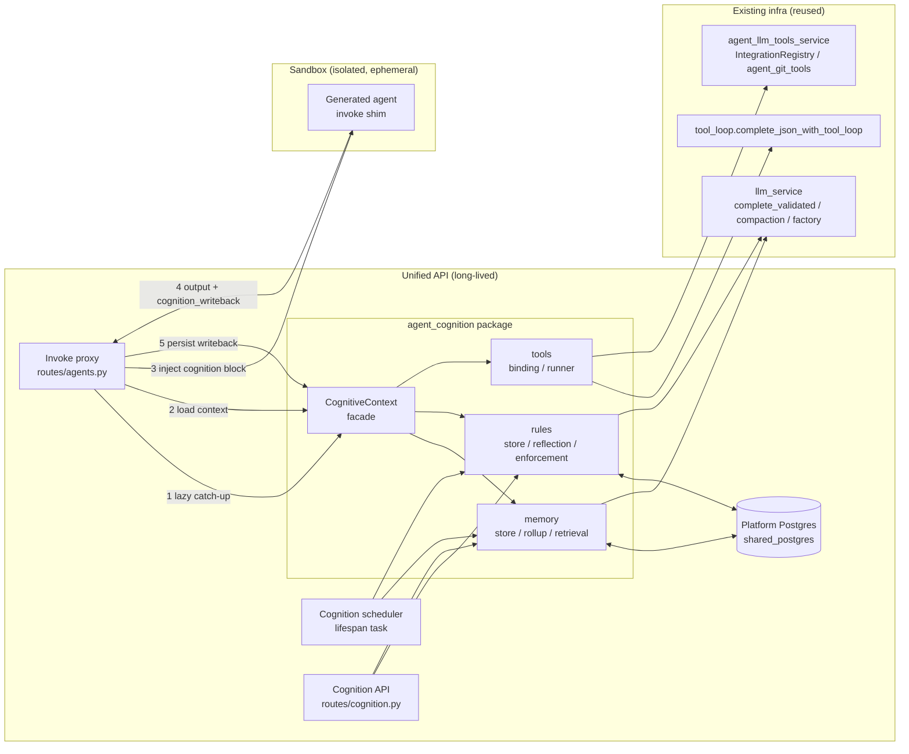
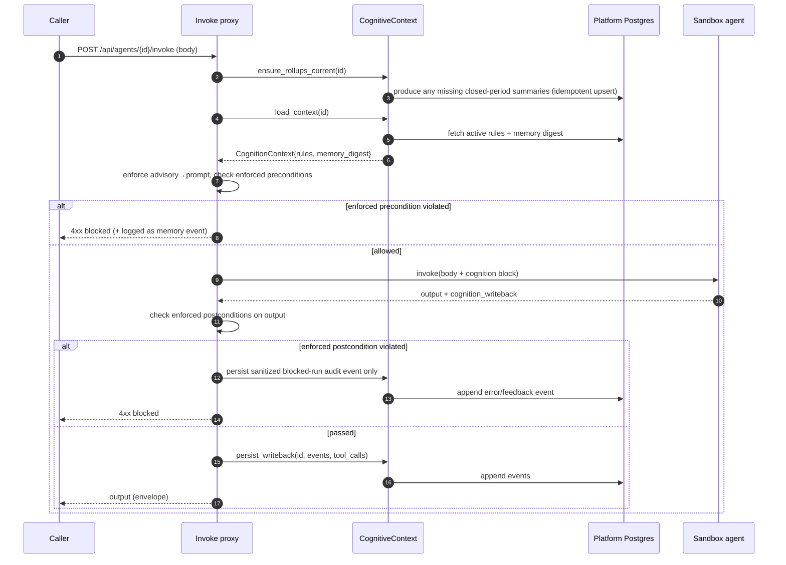
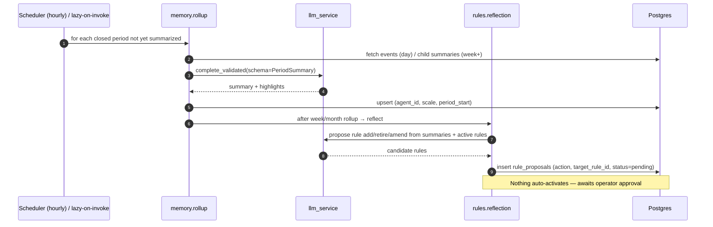
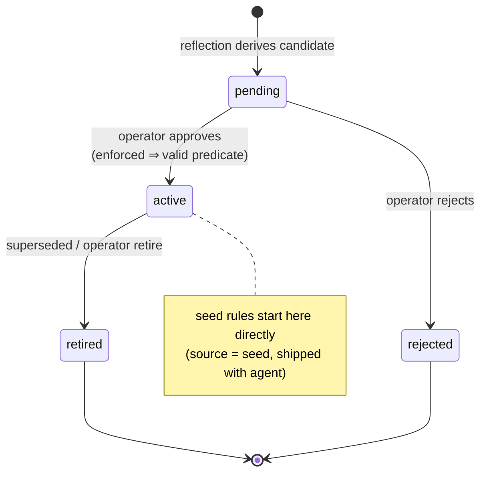
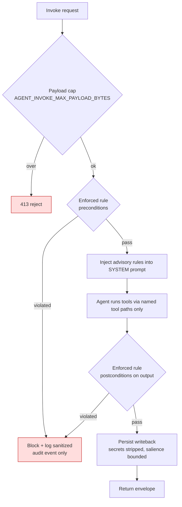

# Feature Specification: Agent Cognition Core

| Field | Value |
|---|---|
| **Feature** | Agent Cognition Core |
| **Status** | Draft — design only (no code in this effort) |
| **Affected area** | `backend/agents/` (new shared package), Unified API, Agentic-team-generated agents |

---

## 1. Summary

Give every agent generated by the **Agentic AI team** the faculties of "a reasonable
thinking person" rather than a bare LLM wrapper: a durable, time-structured **memory layer**
(day / week / month / year, with summarization at each scale), a **rules engine** that learns
behavioral rules from those memories, and a pluggable **tools layer** for connecting to
applications, services, and APIs. These are delivered as one **reusable cognition substrate**
inherited by all agents, instead of being re-implemented per agent.

## 2. Background & motivation

`AGENT_ANATOMY.md` already mandates tiered memory (§4), declared tools (§3), and guardrails
(§6) — but leaves each agent to implement them ad-hoc, so generated agents end up thin. This
feature turns those normative requirements into a batteries-included core.

**Hard constraint:** per-agent sandboxes are torn down with `docker compose down -v` (volumes
deleted) after ~5 min idle and are network-isolated from `khala-stack`. Therefore anything
that accumulates over time **must** live in the long-lived **platform Postgres**, namespaced
by `agent_id` (via `shared_postgres`), and the agent must reach it only across the invoke
boundary — never directly.

## 3. Goals & non-goals

**Goals**
- Multi-scale memory with idempotent day→week→month→year rollups and reliable retrieval.
- A hybrid rules engine: `advisory` (prompt-injected) + `enforced` (deterministic gate).
- Rules learned from memory, **proposed for human approval** before taking effect (HITL).
- A tools layer composed from existing registries/loops; tool use feeds memory.
- Zero new sandbox egress: cognitive I/O crosses the invoke boundary only.

**Non-goals (this effort)**
- Writing the modules (design only).
- Making the core a hard requirement in the generator / `AGENT_ANATOMY.md` (follow-up).
- A frontend for the HITL queue (endpoints specified; UI later).

## 4. Locked design decisions

| Decision | Choice |
|---|---|
| Deliverable | Design document only |
| Rollup scheduling | Central scheduler **+** lazy catch-up on invoke |
| Rule enforcement | Hybrid: `advisory` and `enforced` per rule |
| Rule learning | Derived rules **proposed for human approval** (HITL) |
| Persistence | Platform Postgres, namespaced by `agent_id` (forced by ephemeral sandboxes) |

## 5. Personas / stakeholders

| Persona | Interest |
|---|---|
| **Generated agent** | Consumes injected rules + memory; emits writeback; calls tools |
| **Operator** | Reviews/approves rule proposals; inspects memory; tunes retention |
| **Agentic-team generator** | Stamps the `cognition` manifest block onto new agents |
| **Platform (Unified API)** | Owns the store, runs rollups/reflection, mediates invoke |

## 6. Use cases


| UC | Actor | Outcome |
|---|---|---|
| UC1 | Agent | Receives active rules + memory digest in the invoke payload |
| UC2 | Agent | New episodic events persisted from the returned writeback |
| UC3 | Agent | Runs a registered tool; the call is logged as memory |
| UC4 | Scheduler | Closed-period summaries produced idempotently |
| UC5 | Scheduler | Candidate rules created as `pending` proposals |
| UC6 | Operator | Approves → rule becomes `active`; rejects → archived |
| UC7 | Operator | Reads memory/rules via API |
| UC8 | Operator | Adjusts retention / installs seed rule packs |

## 7. Architecture



**Two execution modes share one contract:**
- **Sandboxed agents** (Agent Console Runner): isolated, so the proxy injects context and
  persists writeback on their behalf (steps 1–5).
- **In-process teams**: call `CognitiveContext` directly (no HTTP hop), same load/writeback.

**Package layout (future build target):**
```
backend/agents/agent_cognition/
  models.py  postgres/__init__.py(SCHEMA)  context.py  scheduler.py
  memory/{store,rollup,retrieval}.py
  rules/{store,reflection,enforcement}.py
  tools/{binding,runner}.py
  DESIGN.md  README.md
```

**Tool execution topology (where the tool loop runs).** The tools layer
(`complete_json_with_tool_loop`) is an **in-process** loop, so a platform-bound tool handler
must execute where the platform's registries/secrets live. The single-shot
inject/writeback contract above only carries the *final* output, so a sandboxed agent cannot
reach a platform tool handler through it. Resolution — each agent's tools resolve to exactly
one execution site at bind time (`tools/binding.py`):

- **In-process agents:** run the loop directly in Unified API; full access to platform tool
  handlers. No change.
- **Sandboxed agents, sandbox-local tools** (declared in the manifest, bundled in the image —
  e.g. `git` on the mounted repo): the loop runs **inside the sandbox**; nothing crosses the
  boundary. This is the v1 default for sandboxed agents.
- **Sandboxed agents, platform-bound tools** (need platform registries/secrets): the **proxy
  drives the loop** — instead of one shot, it exchanges multiple turns with the sandbox over a
  defined `tool_calls`/`tool_results` protocol (sandbox emits a tool request → proxy executes
  the handler platform-side → returns the result → repeat until final output). Secrets and
  egress stay on the platform; the sandbox never holds them. This SB↔PX tool-call channel is
  specified as part of Step 10 (invoke proxy) and Step 7 (tools layer); without it, sandboxed
  agents are restricted to sandbox-local tools.

## 8. Logic flows

### 8.1 Invoke path (inject-on-invoke / writeback-on-return)



> **Postcondition ordering (writeback integrity):** enforced postconditions are evaluated
> **before** `persist_writeback`. A response that fails a postcondition must not pollute the
> agent's durable memory/tool history, so on violation only a sanitized blocked-run audit
> event is persisted — never the rejected `cognition_writeback`. The §11 security flow shows
> the same ordering.
>
> **Idempotent writeback (retry-safe):** `persist_writeback` keys every event on
> `(agent_id, source_run_id, source_seq)` where `source_run_id` is the invoke `trace_id`, and
> inserts `ON CONFLICT DO NOTHING`. A retried invoke (or a re-delivered response after a lost
> first reply) re-persisting the same writeback is therefore a no-op — no duplicated memory or
> tool history, no skewed rollups/rule learning.

### 8.2 Rollup & rule-derivation (scheduler + lazy)



> **Late-arrival handling (no stale summaries):** the rollup processes any closed period that
> is *not yet summarized* **or** is flagged `stale`. When `persist_writeback` appends an event
> whose `occurred_at` falls inside an already-summarized day/week/month, it sets that period's
> summary `stale=true` and cascades the flag up the parent scales. The next lazy/scheduled
> rollup recomputes the stale chain (upsert on the unique key) so higher-level memory and
> learned rules never sit on stale summaries. Out-of-order events are normal: a closed period
> is only summarized once it has *no pending stale flag*.

### 8.3 Rule lifecycle (state)



> **Approve semantics per proposal action:** a proposal carries an explicit `action` and (for
> retire/amend) a `target_rule_id`, so approval is deterministic — `add` inserts a new
> `active` rule from `proposed_rule`; `retire` flips `target_rule_id` to `retired`; `amend`
> retires `target_rule_id` and inserts its `proposed_rule` replacement as `active` (preserving
> lineage via `rationale`). Approval of an `enforced` add/amend still requires a valid
> `predicate`. This removes the ambiguity where retire/amend proposals would otherwise be
> mis-activated as brand-new rules.

## 9. Data model

`shared_postgres` `TeamSchema` (team=`agent_cognition`), all rows keyed by `agent_id`.

- **`agent_cognition_events`** — append-only episodic memory: `id, agent_id, kind
  (observation|action|tool_call|outcome|error|feedback), content, data JSONB, salience,
  occurred_at, source_run_id, source_seq`. Indexes `(agent_id, occurred_at DESC)`,
  `(agent_id, kind)`. **Idempotency:** unique `(agent_id, source_run_id, source_seq)` —
  `source_run_id` is the invoke's `trace_id` and `source_seq` is the event's index within
  that writeback, so a retried/duplicated `persist_writeback` is a no-op `ON CONFLICT DO
  NOTHING` rather than duplicating memory and skewing rollups (see §8.1).
- **`agent_cognition_summaries`** — rollups: `id, agent_id, scale (day|week|month|year),
  period_start, period_end, summary, highlights JSONB, source_count, covers_through, stale,
  created_at`. **Unique `(agent_id, scale, period_start)`** ⇒ idempotent rollups.
  `covers_through` records the max `occurred_at` (day) / child `created_at` (week+) folded in;
  `stale` is set when a **late event** lands in an already-summarized period so the rollup
  recomputes it and cascades the flag to parent scales (see §8.2 late-arrival handling).
- **`agent_cognition_rules`** — `id, agent_id, text, mode (advisory|enforced),
  status (active|retired), predicate JSONB, rationale, source (seed|derived|operator),
  priority, created_at, updated_at`.
- **`agent_cognition_rule_proposals`** — HITL queue: `id, agent_id, action
  (add|retire|amend), target_rule_id (NULL for add), proposed_rule JSONB (NULL for retire),
  evidence JSONB, status (pending|approved|rejected), decided_by, decided_at, created_at`.
  The explicit `action` + `target_rule_id` let the approve path apply retire/amend
  deterministically instead of mis-activating them as new rules (see §8.3).

## 10. Interfaces / API

**Manifest block** (new optional `CognitionSpec` in `agent_registry.models`):
```yaml
cognition:
  memory: { retention_days_events: 90 }
  tools: [git, http_api]            # ids from agent_llm_tools_service / IntegrationRegistry
  rule_packs: [default_guardrails]  # seed packs installed on first provision
```

**Cognition block injected into invoke body:**
```json
{ "cognition": { "rules": [], "memory_digest": "" } }
```
**Writeback returned by the agent:**
```json
{ "cognition_writeback": { "events": [], "tool_calls": [] } }
```

**Operator endpoints** (`unified_api/routes/cognition.py`):
| Method & path | Purpose |
|---|---|
| `GET /api/cognition/agents/{id}/memory` | recent events + summaries (paged) |
| `GET /api/cognition/agents/{id}/rules` | active/retired rules |
| `GET /api/cognition/agents/{id}/rule-proposals?status=pending` | review queue |
| `POST /api/cognition/agents/{id}/rule-proposals/{pid}/approve` | activate proposal |
| `POST /api/cognition/agents/{id}/rule-proposals/{pid}/reject` | archive proposal |

(Dedicated `/api/cognition` prefix — see the gateway note below.)

All carry an `author` handle (reuse `agent_console.author.resolve_author`).

> **Operator authorization (must-do, distinct from the author handle):** `resolve_author` is
> *provenance only* — it is a documented pre-auth placeholder that can return `anonymous` and
> must **not** be used as an access-control decision. The security gateway only scans request
> *content*, so it does not authorize the caller either. The HITL mutation endpoints
> (`approve`/`reject`) therefore require an explicit **operator-authorization check** before
> they act: until real auth lands, gate them behind a required operator credential
> (`COGNITION_OPERATOR_TOKEN`, constant-time compared) and bind decisions to the authenticated
> principal; when platform auth exists, replace the token with an operator-role check. Without
> this, any caller able to reach the Unified API could approve/reject learned **enforced**
> rules and defeat the human-approval gate. The `author` handle is recorded *in addition to*
> (never instead of) this check.

> **Gateway coverage (must-do):** the security gateway's `_is_team_path()`
> (`unified_api/middleware/security_gateway.py`) matches **only** the prefixes in
> `TEAM_CONFIGS` (`_get_team_prefixes()`), and `/api/agents/...` is **not** one of them — so
> these mutation routes are *not* gated by default. The implementation must close this gap by
> either (a) mounting the operator routes under a dedicated **`/api/cognition/...`** prefix
> and adding it to the gateway's matched-prefix set, or (b) extending `_get_team_prefixes()`
> to include `/api/agents`. Option (a) is preferred so gating is explicit and decoupled from
> the (currently un-gated) invoke-proxy surface. Whichever is chosen, the route prefixes
> above change accordingly.

## 11. Security & guardrails



| Control | Mechanism |
|---|---|
| **No sandbox egress** | Cognitive I/O only crosses the invoke boundary; sandbox never reaches platform Postgres |
| **Tenant isolation** | Every query filtered by `agent_id`; no cross-agent reads |
| **Enforced rules are real pre/postconditions** | Deterministic predicate DSL (non-executable JSON), satisfies DbC mandate; never prompt-only |
| **Predicate safety** | DSL is a fixed allowlist of ops (e.g. `<=`, `forbid_tool`); no arbitrary code/eval |
| **HITL gate** | Derived rules can never self-activate; operator approval required (audited via `decided_by`) |
| **Operator authorization** | `approve`/`reject` enforce an operator-auth check (operator token now, role later) — `resolve_author` is provenance only and must never be the authz decision (see §10) |
| **Idempotent writeback** | Events keyed on `(agent_id, source_run_id, source_seq)` with `ON CONFLICT DO NOTHING` — invoke retries can't duplicate memory/tool history |
| **Secrets** | Writeback strips credentials; tool secrets via env/secure store, never logged into memory |
| **Input/output caps** | Reuse `AGENT_INVOKE_MAX_PAYLOAD_BYTES` / `AGENT_INVOKE_MAX_OUTPUT_BYTES`; memory digest is token-budgeted |
| **Gateway alignment** | Operator routes must be added to the gateway's matched-prefix set — `_is_team_path()` covers only `TEAM_CONFIGS` today, so `/api/agents/...` is not gated by default (see §10 note). Preferred: a dedicated gated `/api/cognition/...` prefix |
| **Writeback integrity** | Enforced postconditions run **before** `persist_writeback`; a blocked response persists only a sanitized audit event, never the rejected writeback (see §8.1) |

## 12. Reused building blocks (do not reinvent)

| Need | Reuse | Path |
|---|---|---|
| Schema + registration (Pattern B) | `TeamSchema`, `register_team_schemas` | `shared_postgres/{schema,runner,registry}.py` |
| Time-windowed JSONB store + LLM summary | Winning Posts Bank | `social_media_marketing_team/shared/winning_posts_bank.py` |
| Periodic LLM extraction over accumulated data | Sales learning engine | `sales_team/learning_engine.py` |
| Structured LLM summaries | `complete_validated` | `llm_service/structured.py` |
| Context compaction / retry / model routing | `compact_text`, `call_llm_with_retries`, `get_client` | `llm_service/{compaction,util,factory}.py` |
| Background periodic task | `run_pruner` + lifespan task | `agent_console/prune.py`, `unified_api/main.py` |
| Tool defs / handlers / loop | `agent_git_tools`, `tool_loop` | `agent_git_tools/`, `llm_service/tool_loop.py` |
| Tool/MCP registries | `LlmToolsService`, `IntegrationRegistry` | `agent_llm_tools_service/`, `integrations/registry.py` |
| Author handle / query telemetry | `resolve_author`, `@timed_query` | `agent_console/author.py`, `shared_postgres/metrics.py` |

**Net-new:** only the rules engine (store, reflection, predicate DSL + evaluator) and the
cognition orchestration seam (`CognitiveContext`, inject/writeback contract, scheduler).

## 13. Extensibility

`CognitiveContext` is the seam for additional faculties (e.g. goals/planning, self-reflection,
identity/values). Each future module adds a table set, a contribution to the injected
`cognition` block, and an optional writeback handler — **the invoke contract never changes**.

## 14. Verification (design review, since this effort is design-only)

1. **Anatomy conformance** — every `AGENT_ANATOMY.md` §8 checklist item maps to a concrete
   element here.
2. **Isolation** — no step requires a sandboxed agent to reach platform Postgres directly.
3. **Idempotency** — scheduler and lazy catch-up share one upsert-keyed rollup function.
4. **DbC** — enforced rules expressed as pre/postconditions over a non-executable DSL.
5. **Reuse** — every architecture box maps to §12 or is justified as net-new.

When built, ships with `pytest` ≥90% line coverage: rollup idempotency, retrieval budgeting,
advisory prompt-block rendering, enforced-predicate allow/block, reflection→proposal→approval,
and the inject/writeback round-trip.

## 15. Open items / out of scope
- Building the modules (design only).
- Hard-wiring the core into the generator + `AGENT_ANATOMY.md` (follow-up once package exists).
- HITL review-queue UI (endpoints specified; frontend later).
