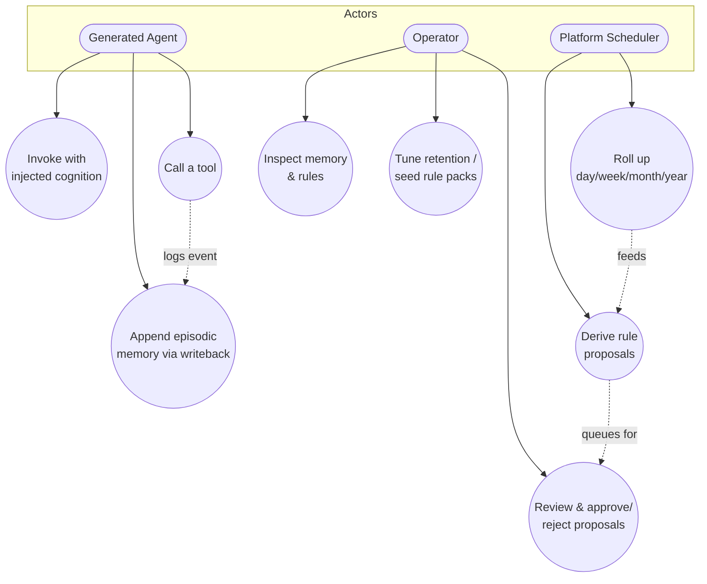
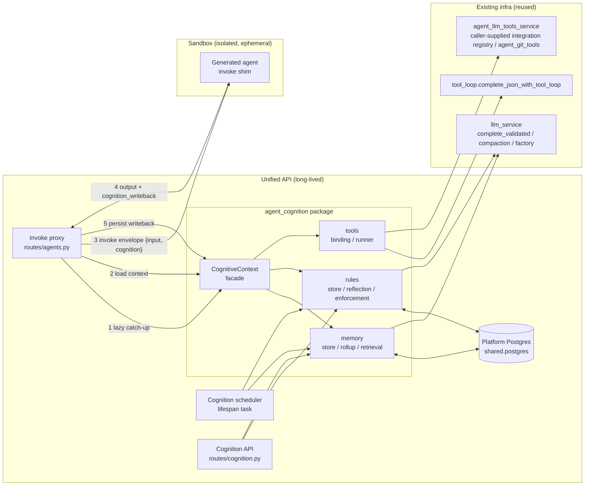
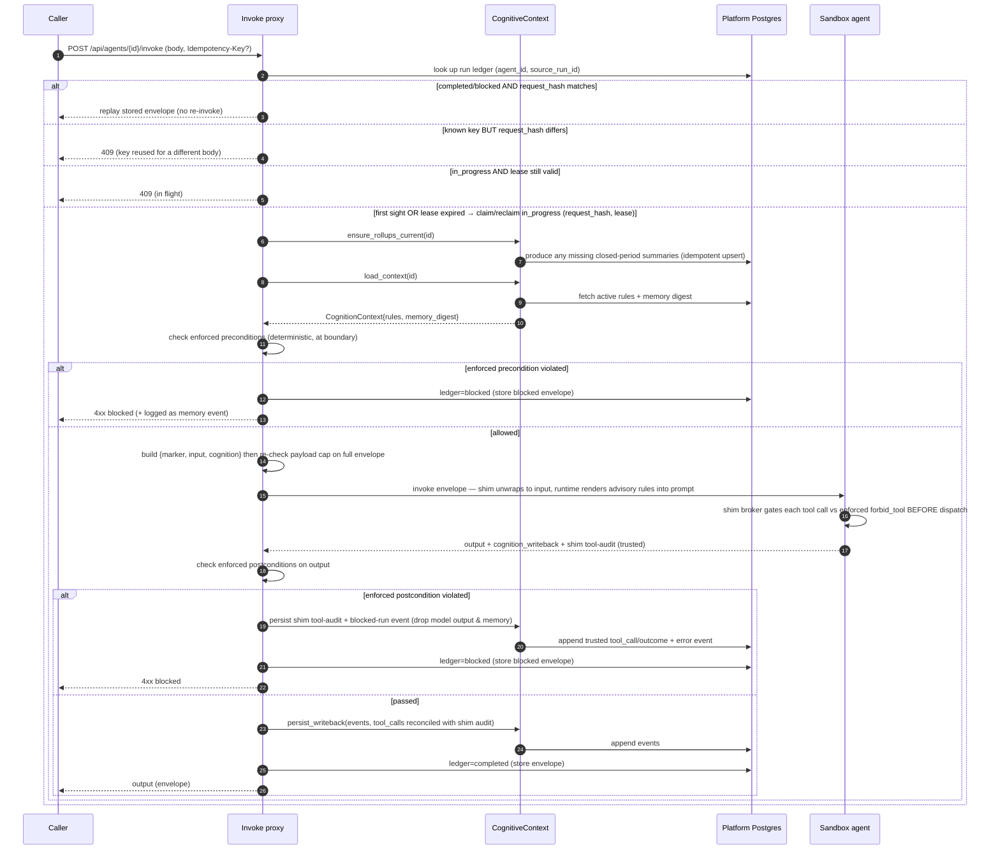
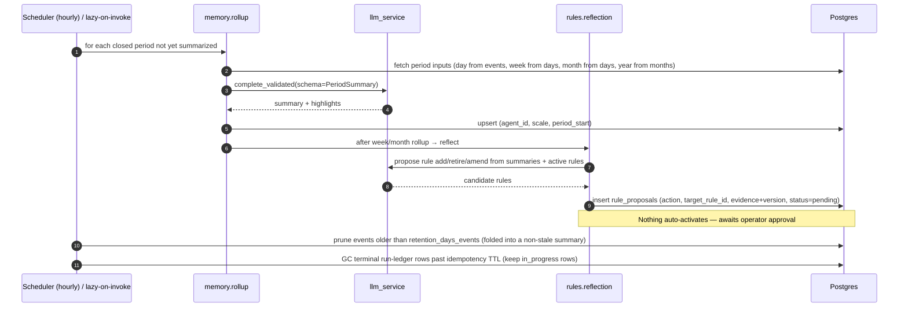
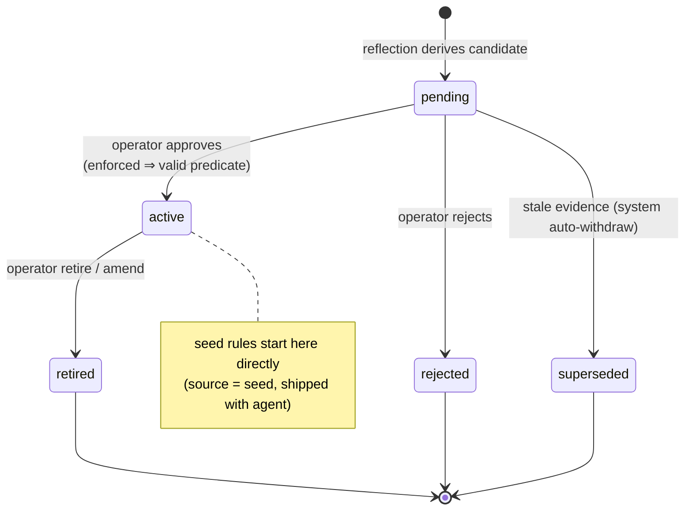
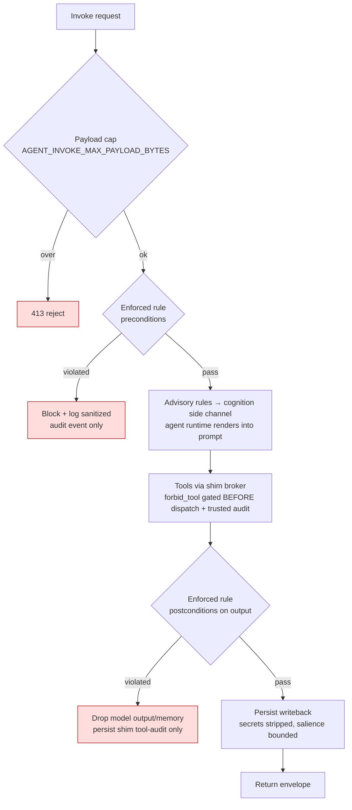

# Feature Specification: Agent Cognition Core

| Field | Value |
|---|---|
| **Feature** | Agent Cognition Core |
| **Status** | Implemented — shipped as `backend/agents/agent_cognition/` |
| **Affected area** | `backend/agents/` (new shared package), Unified API, Agentic-team-generated agents |

---

## 1. Summary

Give every agent generated by the **Agentic AI team** the faculties of "a reasonable
thinking person" rather than a bare LLM wrapper: a durable, time-structured **memory layer**
(day / week / month / year, with summarization at each scale), a **rules engine** that learns
behavioral rules from those memories, and a pluggable **tools layer** for connecting to
applications, services, and APIs. These are delivered as one **reusable cognition substrate**
inherited by all agents, instead of being re-implemented per agent.

## 2. Background & motivation

`AGENT_ANATOMY.md` already mandates tiered memory (§4), declared tools (§3), and guardrails
(§6) — but leaves each agent to implement them ad-hoc, so generated agents end up thin. This
feature turns those normative requirements into a batteries-included core.

**Hard constraint:** per-agent sandboxes are torn down with `docker compose down -v` (volumes
deleted) after ~5 min idle and are network-isolated from `khala-stack`. Therefore anything
that accumulates over time **must** live in the long-lived **platform Postgres**, namespaced
by `agent_id` (via `shared.postgres`), and the agent must reach it only across the invoke
boundary — never directly.

## 3. Goals & non-goals

**Goals**
- Multi-scale memory with idempotent day→week→month→year rollups and reliable retrieval.
- A hybrid rules engine: `advisory` (prompt-injected) + `enforced` (deterministic gate).
- Rules learned from memory, **proposed for human approval** before taking effect (HITL).
- A tools layer composed from existing registries/loops; tool use feeds memory.
- Zero new sandbox egress: cognitive I/O crosses the invoke boundary only.

**Non-goals (this effort)**
- Writing the modules (design only).
- Making the core a hard requirement in the generator / `AGENT_ANATOMY.md` (follow-up).
- A frontend for the HITL queue (endpoints specified; UI later).

## 4. Locked design decisions

| Decision | Choice |
|---|---|
| Deliverable | Design document only |
| Rollup scheduling | Central scheduler **+** lazy catch-up on invoke |
| Rule enforcement | Hybrid: `advisory` and `enforced` per rule |
| Rule learning | Derived rules **proposed for human approval** (HITL) |
| Persistence | Platform Postgres, namespaced by `agent_id` (forced by ephemeral sandboxes) |

## 5. Personas / stakeholders

| Persona | Interest |
|---|---|
| **Generated agent** | Consumes injected rules + memory; emits writeback; calls tools |
| **Operator** | Reviews/approves rule proposals; inspects memory; tunes retention |
| **Agentic-team generator** | Stamps the `cognition` manifest block onto new agents |
| **Platform (Unified API)** | Owns the store, runs rollups/reflection, mediates invoke |

## 6. Use cases



| UC | Actor | Outcome |
|---|---|---|
| UC1 | Agent | Receives active rules + memory digest in the invoke payload |
| UC2 | Agent | New episodic events persisted from the returned writeback |
| UC3 | Agent | Runs a registered tool; the call is logged as memory |
| UC4 | Scheduler | Closed-period summaries produced idempotently |
| UC5 | Scheduler | Candidate rules created as `pending` proposals |
| UC6 | Operator | Approves → rule becomes `active`; rejects → proposal `rejected` |
| UC7 | Operator | Reads memory/rules via API |
| UC8 | Operator | Adjusts retention / installs seed rule packs |

## 7. Architecture



**Two execution modes share one contract:**
- **Sandboxed agents** (Agent Console Runner): isolated, so the proxy injects context and
  persists writeback on their behalf (steps 1–5).
- **In-process teams**: call `CognitiveContext` directly (no HTTP hop), same load/writeback.

**Package layout (future build target):**
```
backend/agents/agent_cognition/
  models.py  postgres/__init__.py(SCHEMA)  context.py  scheduler.py
  memory/{store,rollup,retrieval}.py
  rules/{store,reflection,enforcement}.py
  tools/{binding,runner}.py
  DESIGN.md  README.md
```

**Tool execution topology (where the tool loop runs).** The tools layer
(`complete_json_with_tool_loop`) is an **in-process** loop, so a platform-bound tool handler
must execute where the platform's registries/secrets live. The single-shot
inject/writeback contract above only carries the *final* output, so a sandboxed agent cannot
reach a platform tool handler through it. Resolution — each agent's tools resolve to exactly
one execution site at bind time (`tools/binding.py`):

- **In-process agents:** run the loop directly in Unified API; full access to platform tool
  handlers. No change.
- **Sandboxed agents, sandbox-local tools** (declared in the manifest, bundled in the image —
  e.g. `git` on the mounted repo): the loop runs **inside the sandbox**, but the shim
  **wraps/brokers the declared tool handlers** and emits a trusted tool-call audit stream back
  across the boundary (out-of-band from the agent's self-reported writeback). This keeps the
  blocked-run audit guarantee honest: the platform records what the shim actually brokered,
  not what the model claims. (Tools a custom agent invokes without the shim broker are
  unaudited and out-of-scope — called out per agent.) This is the v1 default for sandboxed
  agents.
- **Sandboxed agents, platform-bound tools** (need platform registries/secrets): the **proxy
  drives the loop** — instead of one shot, it exchanges multiple turns with the sandbox over a
  defined `tool_calls`/`tool_results` protocol (sandbox emits a tool request → proxy executes
  the handler platform-side → returns the result → repeat until final output). Secrets and
  egress stay on the platform; the sandbox never holds them. This SB↔PX tool-call channel is
  specified as part of Step 10 (invoke proxy) and Step 7 (tools layer); without it, sandboxed
  agents are restricted to sandbox-local tools.

  **Runtime prerequisite:** the proxy-driven loop only works if the *agent runtime* can pause,
  emit a tool request, receive the result, and continue — but the current sandbox path
  (`dispatch.invoke_entrypoint`) calls an entrypoint **once** and returns a final envelope. So
  `platform_bound` tools for sandboxed agents depend on the **multi-turn runtime protocol**
  shipping in the generated scaffold (the Step 14 runtime work), and Steps 7/10 land the
  protocol + a stubbed-runtime test rather than claiming live platform-bound tools for
  generated agents. **v1 default for sandboxed agents is `sandbox_local` tools**, which need no
  turn protocol; `platform_bound` is gated on the runtime protocol being present.

## 8. Logic flows

### 8.1 Invoke path (inject-on-invoke / writeback-on-return)



> **Postcondition ordering & trusted blocked-run audit:** enforced postconditions are
> evaluated **before** persisting the rejected output/untrusted memory — a blocked response
> must not pollute durable cognition state. Tool calls already executed are real side effects,
> so the blocked path still persists `tool_call`/`outcome` records. **The trusted source for
> those records is the shim's own tool-call audit, not the model's self-reported writeback:**
> the shim brokers every tool invocation (both the proxy-driven `platform_bound` loop *and*
> `sandbox_local` tools, which it wraps) and emits an audit stream out-of-band from the agent
> output. On a block we persist the shim audit (trusted) and drop the model's claims; any tool
> a custom agent invokes *without* going through the shim broker cannot be audited and is
> documented as out-of-scope for the guarantee.
>
> **Advisory rules are rendered by the agent runtime, not the proxy:** the proxy enforces only
> the *deterministic* enforced pre/postconditions at the boundary — it has no shared
> system-prompt seam to edit (`dispatch.invoke_entrypoint` calls an arbitrary entrypoint).
> Advisory rules therefore ride the `cognition` side channel and the **generated agent runtime
> is responsible for rendering them into each LLM call's system prompt** (a generator
> responsibility — see §12 Step 14). Advisory rules are best-effort by nature; an agent that
> ignores the channel simply isn't steered. Only enforced rules are guaranteed.
>
> **Enforced tool restrictions gate *before* dispatch (not just postcondition):** an enforced
> rule that restricts tools (e.g. the `forbid_tool` op) must be evaluated by the shim's tool
> broker **before each handler runs** — a postcondition on the final output is too late, since a
> forbidden tool would already have caused irreversible side effects. The proxy therefore passes
> the active enforced tool-restriction predicates into the broker (both the proxy-driven
> `platform_bound` loop and the wrapped `sandbox_local` handlers); a disallowed call is refused
> pre-dispatch and recorded as a blocked `tool_call` audit event. Output postconditions remain
> for value/shape checks that can only be judged after the fact.
>
> **Blocked runs store their envelope for replay:** the replay contract covers `blocked` as well
> as `completed`, so the blocked transition **persists the 4xx response envelope** into the
> ledger (not just `status=blocked`). A retried precondition/postcondition-blocked request with
> the same key+hash replays the identical 4xx rather than re-running or re-blocking — the
> idempotency guarantee holds for rejections too.
>
> **Idempotent invoke (retry-safe execution, leased, body-checked):** the proxy mints a
> **stable `source_run_id`** for the logical invoke (honoring a caller `Idempotency-Key`) —
> *not* the shim's per-POST `trace_id`. The `agent_cognition_runs` ledger keyed `(agent_id,
> source_run_id)` records a **`request_hash`** (canonical body) and a **lease**: a retry whose
> hash matches a `completed`/`blocked` row **replays the stored envelope without re-invoking**;
> a retry whose hash *differs* is rejected `409` (key reused for a different request, never
> serve stale output); a retry while still `in_progress` with a **valid lease** returns `409`.
> Once the **lease expires** (proxy crashed/killed mid-flight) the row is **reclaimed in place,
> not deleted** — `claim_run` atomically resets it to a fresh `in_progress`+lease while
> **retaining the original `request_hash`**, so a post-expiry retry is still hash-checked (a
> different body → `409`, the same body → re-execute). The **scheduler never deletes
> `in_progress` rows**; it only GCs *terminal* (`completed`/`blocked`) rows after an
> idempotency-retention TTL, so the hash needed to police retries is never dropped while a run
> could still be retried. `persist_writeback` also keys events on `(agent_id, source_run_id,
> source_seq)` `ON CONFLICT DO NOTHING` as defense-in-depth. The residual lost-ack and
> lease-reclaim windows are at-least-once, covered by requiring **platform-bound tool handlers
> to be idempotent where feasible** (documented per tool).
>
> **Run-once requires a stable key (else at-least-once):** the replay/run-once guarantee holds
> **only when a stable idempotency key exists** — a caller-supplied `Idempotency-Key`, or, when
> absent, the proxy keys on the `request_hash` so byte-identical retries still dedup. A manifest
> flag (`cognition.requires_idempotency_key`) lets a **side-effecting** agent *require* a
> caller-supplied key (reject the call `400` without one), because hashing can't distinguish two
> legitimately distinct identical requests. Without a key and without that flag, the call is
> explicitly **at-least-once** (best-effort dedup on identical bodies), not run-once.
>
> **Payload cap applies to the final envelope:** `AGENT_INVOKE_MAX_PAYLOAD_BYTES` is enforced
> on the assembled `{marker, input, cognition}` **after** the digest/rules are added (not just
> the caller's `input`), and the memory digest is independently token-budgeted, so a request
> just under the cap can't become an oversized sandbox payload once cognition is attached.

### 8.2 Rollup & rule-derivation (scheduler + lazy)



> **Rollup input scoping (calendar-correct):** `month` aggregates the **days** in that
> calendar month, and `year` aggregates the **months** in that year — months are **not** rolled
> up from weeks. ISO weeks straddle month boundaries (e.g. Jan 29–Feb 4), so consuming whole
> weeks would either pull February events into January or drop them; aggregating days keeps
> each calendar period exact. `week` summaries remain a parallel reporting scale built from
> their 7 days and are not an input to `month`.

> **Late-arrival handling (no stale summaries or stale-derived rules):** the rollup processes
> any closed period that is *not yet summarized* **or** is flagged `stale`. When
> `persist_writeback` appends an event whose `occurred_at` falls inside an already-summarized
> day/week/month, it sets that period's summary `stale=true`, **bumps its `version`**, and
> cascades the flag up the parent scales. The next lazy/scheduled rollup recomputes the stale
> chain (upsert on the unique key). Recompute alone is not enough — proposals/rules already
> derived from the old summaries must also be revisited: each `rule_proposal` records its
> evidence as `(summary_id, version)` refs, so when a referenced summary's version advances,
> any **pending** proposal on stale evidence is flagged `stale_evidence` (re-evaluated on the
> next reflection, or auto-withdrawn to status `superseded`), and any **active derived rule**
> whose evidence moved is
> surfaced to the operator review queue rather than silently left in place. Out-of-order events
> are normal: a closed period is only summarized once it has *no pending stale flag*.
>
> **Recompute vs. retention (two regimes):** a from-scratch recompute needs the period's raw
> events, but retention prunes them past `retention_days_events`. So a late event is handled by
> *which regime its period is in*: **(a) within retention** (raw rows still present) → mark
> `stale` and **recompute from events** as above; **(b) already pruned** (raw rows gone) →
> **never recompute from scratch** (that would rebuild the summary from only the late row and
> destroy real history). Instead the late event is folded in by an **incremental amend**: the
> existing summary is the base and `revise_summary(base_summary, [late_event])` produces a
> revised summary (`version` bumped, `covers_through` extended), preserving everything already
> captured. The same `(summary_id, version)` bump drives stale-evidence re-evaluation either
> way. (Pruning a day's events is only permitted *after* its summary exists and is non-stale, so
> regime (b) always has a base summary to amend.)

### 8.3 Rule lifecycle (state)



> **Approve semantics per proposal action:** a proposal carries an explicit `action` and (for
> retire/amend) a `target_rule_id`, so approval is deterministic — `add` inserts a new
> `active` rule from `proposed_rule`; `retire` flips `target_rule_id` to `retired`; `amend`
> retires `target_rule_id` and inserts its `proposed_rule` replacement as `active` (preserving
> lineage via `rationale`). Approval of an `enforced` add/amend still requires a valid
> `predicate`. This removes the ambiguity where retire/amend proposals would otherwise be
> mis-activated as brand-new rules.

## 9. Data model

`shared.postgres` `TeamSchema` (team=`agent_cognition`), all rows keyed by `agent_id`.

- **`agent_cognition_events`** — append-only episodic memory: `id, agent_id, kind
  (observation|action|tool_call|outcome|error|feedback), content, data JSONB, salience,
  occurred_at, source_run_id, source_seq`. Indexes `(agent_id, occurred_at DESC)`,
  `(agent_id, kind)`. **Idempotency:** unique `(agent_id, source_run_id, source_seq)` —
  `source_run_id` is the **proxy-minted stable idempotency key for the logical invoke** (not
  the shim's per-POST `trace_id`) and `source_seq` is the event's index within that writeback,
  so a retried/duplicated `persist_writeback` is a no-op `ON CONFLICT DO NOTHING` rather than
  duplicating memory and skewing rollups (see §8.1).
- **`agent_cognition_summaries`** — rollups: `id, agent_id, scale (day|week|month|year),
  period_start, period_end, summary, highlights JSONB, source_count, covers_through, version,
  stale, created_at`. **Unique `(agent_id, scale, period_start)`** ⇒ idempotent rollups.
  `covers_through` records the max input timestamp folded in (day←events; week←days;
  month←days; year←months — see §8.2 input scoping); `version` increments on every recompute;
  `stale` is set when a **late event** lands in an already-summarized period so the rollup
  recomputes it and cascades the flag to parent scales (see §8.2 late-arrival handling).
- **`agent_cognition_rules`** — `id, agent_id, text, mode (advisory|enforced),
  status (active|retired), predicate JSONB, rationale, source (seed|derived|operator),
  evidence JSONB (`(summary_id, version)` refs for `derived` rules), needs_review, priority,
  created_at, updated_at`. `needs_review` is set when a referenced summary's `version` advances
  so a stale-evidence derived rule resurfaces in the operator queue.
- **`agent_cognition_rule_proposals`** — HITL queue: `id, agent_id, action
  (add|retire|amend), target_rule_id (NULL for add), proposed_rule JSONB (NULL for retire),
  evidence JSONB (`(summary_id, version)` refs), stale_evidence, status
  (pending|approved|rejected|**superseded**), decided_by, decided_at, created_at`. The explicit
  `action` + `target_rule_id` let the approve path apply retire/amend deterministically instead
  of mis-activating them as new rules (see §8.3). `superseded` is the **system** terminal state
  for a stale-evidence proposal auto-withdrawn on recompute — distinct from `rejected` (a human
  decision) so it neither falsely records an operator rejection nor lingers `pending` in the
  queue (see §8.2/§8.3).
- **`agent_cognition_runs`** — execution idempotency ledger: `agent_id, source_run_id,
  status (in_progress|completed|blocked), request_hash, response JSONB, lease_expires_at,
  created_at, completed_at`, **primary key `(agent_id, source_run_id)`**. The proxy claims
  `in_progress` with a lease before invoking and stores the final envelope on **both terminal
  outcomes — `completed` and `blocked`** (the 4xx body is stored too) so retries replay either
  identically. A retry replays `response` only when `request_hash` matches (mismatched body →
  `409`, never stale output); an `in_progress` row whose `lease_expires_at` has passed is
  reclaimed in place (hash retained) so a crashed proxy can't wedge the key forever (see §8.1
  retry-safe execution).

## 10. Interfaces / API

**Manifest block** (new optional `CognitionSpec` in `agent_registry.models`):
```yaml
cognition:
  memory: { retention_days_events: 90 }
  tools: [git, http_api]            # ids from agent_llm_tools_service / a caller-supplied integration registry
  rule_packs: [default_guardrails]  # seed packs installed on first provision
  requires_idempotency_key: false   # true ⇒ side-effecting; reject invokes without a caller key
```

> **Retention is enforced, not just declared:** `retention_days_events` must be backed by a
> pruning path or private memory accumulates forever. The central scheduler (§8.2 / §12 Step 11)
> runs an events pruner — alongside the rollups — that deletes raw `agent_cognition_events`
> older than each agent's `retention_days_events` (default 90), **after** they have been folded
> into a non-stale day summary so history isn't lost (rollup summaries are retained long-term;
> only raw episodic rows are pruned). Mirrors the `agent_platform.console.prune.run_pruner` pattern.

**Invoke envelope (cognition kept OUT of the user input contract):** the proxy must **not**
add `cognition` as a sibling key to the agent's input — `shared.agent_invoke.dispatch.
invoke_entrypoint` passes the POST body straight to the manifest entrypoint, so an extra field
would break agents with strict request models or non-object inputs. Instead the proxy wraps
the body with an **explicit, namespaced envelope marker** (not merely the presence of an
`input` key — a real agent's schema could legitimately have its own `input` field):
```json
{ "__khala_cognition_envelope__": 1,
  "input": { /* the agent's original, unchanged request body */ },
  "cognition": { "rules": [], "memory_digest": "" } }
```
`mount_invoke_shim` (a shim change in scope here) unwraps **only** when the
`__khala_cognition_envelope__` marker is present and well-formed (marker + `input` + `cognition`
all validated); it then invokes the entrypoint with `input` exactly as declared and exposes
`cognition` via a separate accessor (context var / optional kwarg), never merged into user
data. Any body lacking the marker — including one that happens to contain an `input` key — is
passed through to the entrypoint **unchanged**, so no existing agent contract can be
misinterpreted. (The marker key is namespaced to make collision with real user data
vanishingly unlikely; the proxy rejects a caller body that already contains it.)

**Writeback returned by the agent** (separate envelope field, not mixed into output):
```json
{ "output": { /* the agent's normal result */ },
  "cognition_writeback": { "events": [], "tool_calls": [] } }
```
> **Output cap is per-field, not on the combined response:** because `cognition_writeback`
> (and the shim tool-audit) ride the *same* sandbox response as `output`, applying a single
> `AGENT_INVOKE_MAX_OUTPUT_BYTES` to the whole body would let control data compete with user
> output — an agent whose normal `output` is near the cap could have its response rejected or
> truncated *before* the proxy persists memory. The cap is therefore applied to the user
> **`output`** field on its own; `cognition_writeback` has its **own** bound
> (`AGENT_COGNITION_WRITEBACK_MAX_BYTES`, with `events`/`tool_calls` truncated and a
> `truncated: true` flag rather than failing the whole call). Memory persistence never starves
> user output and vice-versa.

**Operator endpoints** (`unified_api/routes/cognition.py`):
| Method & path | Purpose |
|---|---|
| `GET /api/cognition/agents/{id}/memory` | recent events + summaries (paged) |
| `GET /api/cognition/agents/{id}/rules` | active/retired rules |
| `GET /api/cognition/agents/{id}/rule-proposals?status=pending` | review queue |
| `POST /api/cognition/agents/{id}/rule-proposals/{pid}/approve` | activate proposal |
| `POST /api/cognition/agents/{id}/rule-proposals/{pid}/reject` | reject proposal (status → `rejected`) |

(Dedicated `/api/cognition` prefix — see the gateway note below.)

All carry an `author` handle (reuse `agent_platform.console.author.resolve_author`).

> **Operator authorization (must-do, distinct from the author handle):** `resolve_author` is
> *provenance only* — it is a documented pre-auth placeholder that can return `anonymous` and
> must **not** be used as an access-control decision. The security gateway only scans request
> *content*, so it does not authorize the caller either. **All** cognition endpoints therefore
> require an explicit **operator-authorization check** before they act — both the
> `approve`/`reject` mutations **and the `GET` reads**, since memory, active rules, and pending
> proposal evidence are private agent state that an unauthenticated caller must not inspect.
> Until real auth lands, gate every route behind a required operator credential
> (`COGNITION_OPERATOR_TOKEN`, constant-time compared) and bind mutation decisions to the
> authenticated principal; when platform auth exists, replace the token with an operator-role
> check. Without this, any caller able to reach the Unified API could read private cognition
> state or approve/reject learned **enforced** rules and defeat the human-approval gate. The
> `author` handle is recorded *in addition to* (never instead of) this check.

> **Gateway coverage (must-do):** the security gateway's `_is_team_path()`
> (`unified_api/middleware/security_gateway.py`) matches **only** the prefixes in
> `TEAM_CONFIGS` (`_get_team_prefixes()`), and `/api/agents/...` is **not** one of them — so
> these mutation routes are *not* gated by default. The implementation must close this gap by
> either (a) mounting the operator routes under a dedicated **`/api/cognition/...`** prefix
> and adding it to the gateway's matched-prefix set, or (b) extending `_get_team_prefixes()`
> to include `/api/agents`. Option (a) is preferred so gating is explicit and decoupled from
> the (currently un-gated) invoke-proxy surface. Whichever is chosen, the route prefixes
> above change accordingly.

## 11. Security & guardrails



| Control | Mechanism |
|---|---|
| **No sandbox egress** | Cognitive I/O only crosses the invoke boundary; sandbox never reaches platform Postgres |
| **Tenant isolation** | Every query filtered by `agent_id`; no cross-agent reads |
| **Enforced rules are real pre/postconditions** | Deterministic predicate DSL (non-executable JSON), satisfies DbC mandate; never prompt-only |
| **Predicate safety** | DSL is a fixed allowlist of ops (e.g. `<=`, `forbid_tool`); no arbitrary code/eval |
| **HITL gate** | Derived rules can never self-activate; operator approval required (audited via `decided_by`) |
| **Operator authorization** | **All** cognition routes — reads *and* `approve`/`reject` — enforce an operator-auth check (operator token now, role later); `resolve_author` is provenance only and never the authz decision (see §10) |
| **Idempotent execution** | `agent_cognition_runs` ledger keyed `(agent_id, source_run_id)` — a retry **replays the stored envelope without re-invoking the sandbox** (run-once for side effects); writeback `ON CONFLICT DO NOTHING` is defense-in-depth; lost-ack window relies on tool-level idempotency (see §8.1) |
| **Ledger lease / no wedge** | `in_progress` claims carry a `lease_expires_at`; an expired lease (crashed proxy) is **reclaimed in place** (reset to a fresh lease, **`request_hash` retained**) so a logical invoke is never stuck at `409` forever and post-expiry retries are still hash-checked. Scheduler GCs only *terminal* rows (past an idempotency TTL), never `in_progress` ones |
| **Replay-safety** | Ledger stores a `request_hash`; a retry whose body differs from the original is rejected `409` rather than served the prior response. **Blocked runs store their 4xx envelope too**, so a retried rejection replays identically (replay covers `blocked`, not just `completed`) |
| **Run-once needs a key** | The run-once guarantee holds only with a stable idempotency key (caller `Idempotency-Key`, else the `request_hash` for byte-identical retries). A side-effecting agent can set `cognition.requires_idempotency_key` to *require* a caller key (else `400`); without a key it's documented **at-least-once**, not run-once |
| **Forbidden-tool pre-gate** | Enforced tool restrictions (`forbid_tool`) are evaluated by the shim broker **before each handler dispatches**, not just as an output postcondition — a forbidden call never executes its side effect |
| **Trusted tool audit** | The shim brokers all tool calls (platform-bound *and* sandbox-local) and emits an out-of-band audit; blocked runs persist the **shim** audit, not the model's self-reported writeback |
| **Advisory vs enforced** | Only enforced rules are guaranteed (deterministic gate at the proxy). Advisory rules ride the side channel and are rendered by the agent runtime — best-effort, never proxy-edited prompts |
| **Envelope marker** | The shim unwraps only on the namespaced `__khala_cognition_envelope__` marker; unmarked bodies pass through unchanged, so no existing input contract is misread |
| **Payload cap on envelope** | `AGENT_INVOKE_MAX_PAYLOAD_BYTES` is applied to the assembled `{marker, input, cognition}`, and the digest is token-budgeted, so cognition can't push a near-limit request over the cap |
| **Event retention (lossless)** | The scheduler prunes raw events past `retention_days_events` only after they're in a non-stale summary; a *later* late event for an already-pruned period is folded via **incremental amend** of the existing summary, never a from-scratch recompute that would lose pruned history (see §8.2) |
| **Input-contract isolation** | Cognition is delivered in a wrapper envelope `{input, cognition}` that the shim unwraps — the entrypoint receives only its declared `input`, never an injected `cognition` field that would break strict/non-object request models (see §10) |
| **Blocked-run tool audit** | A postcondition-blocked output still persists sanitized `tool_call`/`outcome` records (real side effects already happened) while dropping the rejected output/untrusted memory |
| **Stale-evidence re-evaluation** | Recomputed summaries bump `version`; pending proposals on stale evidence are flagged for re-eval/withdrawal and active derived rules resurface for operator review |
| **Secrets** | Writeback strips credentials; tool secrets via env/secure store, never logged into memory |
| **Per-field output cap** | `AGENT_INVOKE_MAX_OUTPUT_BYTES` is applied to the user **`output`** field alone; `cognition_writeback` has its own bound (`AGENT_COGNITION_WRITEBACK_MAX_BYTES`, truncate + flag), so control data never competes with user output and memory persistence isn't starved (see §10) |
| **Gateway alignment** | Operator routes must be added to the gateway's matched-prefix set — `_is_team_path()` covers only `TEAM_CONFIGS` today, so `/api/agents/...` is not gated by default (see §10 note). Preferred: a dedicated gated `/api/cognition/...` prefix |
| **Writeback integrity** | Enforced postconditions run **before** `persist_writeback`; a blocked response persists only a sanitized audit event, never the rejected writeback (see §8.1) |

## 12. Reused building blocks (do not reinvent)

| Need | Reuse | Path |
|---|---|---|
| Schema + registration (Pattern B) | `TeamSchema`, `register_team_schemas` | `shared.postgres/{schema,runner,registry}.py` |
| Time-windowed JSONB store + LLM summary | Winning Posts Bank | `social_media_marketing_team/shared/winning_posts_bank.py` |
| Periodic LLM extraction over accumulated data | Sales learning engine | `sales_team/learning_engine.py` |
| Structured LLM summaries | `complete_validated` | `llm_service/structured.py` |
| Context compaction / retry / model routing | `compact_text`, `call_llm_with_retries`, `get_client` | `llm_service/{compaction,util,factory}.py` |
| Background periodic task | `run_pruner` + lifespan task | `agent_console/prune.py`, `unified_api/main.py` |
| Tool defs / handlers / loop | `agent_git_tools`, `tool_loop` | `agent_git_tools/`, `llm_service/tool_loop.py` |
| Tool/MCP registries | `LlmToolsService`; integration registry is caller-supplied (duck-typed `get_provider(tool_id)`, no concrete class in this repo) | `agent_llm_tools_service/` |
| Author handle / query telemetry | `resolve_author`, `@timed_query` | `agent_console/author.py`, `shared/postgres/metrics.py` |

**Net-new:** only the rules engine (store, reflection, predicate DSL + evaluator) and the
cognition orchestration seam (`CognitiveContext`, inject/writeback contract, scheduler).

## 13. Extensibility

`CognitiveContext` is the seam for additional faculties (e.g. goals/planning, self-reflection,
identity/values). Each future module adds a table set, a contribution to the injected
`cognition` block, and an optional writeback handler — **the invoke contract never changes**.

## 14. Verification (design review, since this effort is design-only)

1. **Anatomy conformance** — every `AGENT_ANATOMY.md` §8 checklist item maps to a concrete
   element here.
2. **Isolation** — no step requires a sandboxed agent to reach platform Postgres directly.
3. **Idempotency** — scheduler and lazy catch-up share one upsert-keyed rollup function.
4. **DbC** — enforced rules expressed as pre/postconditions over a non-executable DSL.
5. **Reuse** — every architecture box maps to §12 or is justified as net-new.

When built, ships with `pytest` ≥90% line coverage: rollup idempotency, retrieval budgeting,
advisory prompt-block rendering, enforced-predicate allow/block, reflection→proposal→approval,
and the inject/writeback round-trip.

## 15. Open items / out of scope
- Building the modules (design only).
- Hard-wiring the core into the generator + `AGENT_ANATOMY.md` (follow-up once package exists).
- HITL review-queue UI (endpoints specified; frontend later).
