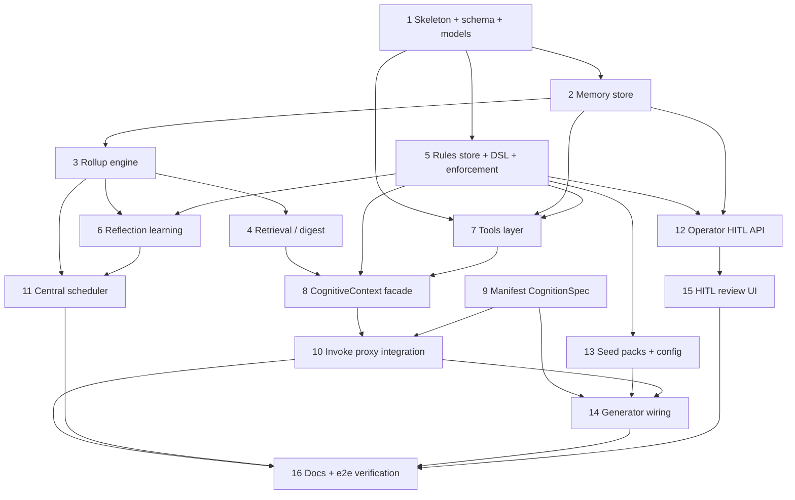

# Agent Cognition Core — Implementation Plan

This breaks [`DESIGN.md`](DESIGN.md) into sequenced, independently-mergeable deliverables.
When **all** steps are complete, the spec is 100% implemented. Each step is sized to be one
PR with its own tests (backend ≥90% line coverage, ruff clean; frontend ≥90% via vitest).

**Legend:** Depends → prerequisite steps · ✅ Acceptance = merge gate.

## Dependency overview

---

## Milestone A — Persistence & memory

### Step 1 — Package skeleton, Postgres schema, models
- **Goal:** Establish the package and durable storage.
- **Files:** `agent_cognition/__init__.py`, `models.py` (Pydantic: `MemoryEvent`,
  `PeriodSummary`, `Rule`, `RuleProposal`, `ToolCall`, `CognitionContext`,
  `CognitionWriteback`, enums — proposal `status` is `pending|approved|rejected|superseded`);
  `postgres/__init__.py` (`SCHEMA: TeamSchema` — **5 tables**: events, summaries, rules,
  rule_proposals, **runs** (idempotency ledger, PK `(agent_id, source_run_id)`, columns
  `status, request_hash, response, lease_expires_at`); indexes;
  summaries unique `(agent_id, scale, period_start)` **and events unique `(agent_id,
  source_run_id, source_seq)`** so Step 2's writeback `ON CONFLICT` target exists; summaries
  `version`/`stale` columns; proposal/rule `evidence` columns); register in
  `shared/postgres/registry.py`; call `register_team_schemas(SCHEMA)` from
  `unified_api/main.py` lifespan.
- **Depends:** —
- **✅ Acceptance:** tables created idempotently on startup; models validate/round-trip;
  schema is pure data (no import side effects); **events idempotency key, summary period key,
  and runs PK all present** so dependent steps' `ON CONFLICT`/claim clauses resolve;
  proposal-status enum includes `superseded`.

### Step 2 — Memory store (DAL)
- **Goal:** Read/write episodic events and summaries.
- **Files:** `memory/store.py` — `append_event` (idempotent: insert `ON CONFLICT
  (agent_id, source_run_id, source_seq) DO NOTHING`), `fetch_events_for_period`,
  `fetch_recent_events(top_n, by_salience)`, `upsert_summary`, `fetch_summaries(scale, …)`,
  `get_last_summary(scale)`, `mark_period_stale(agent_id, occurred_at)` (flags the containing
  summaries for recompute on late arrival; records whether the period's **raw events are still
  retained** so Step 3 can choose recompute vs. amend), and `prune_events(agent_id,
  retention_days)` (deletes raw events older than the cutoff **only** where the containing day
  summary exists and is non-stale, so nothing unsummarized is lost). Reuse `get_conn`, `Json`,
  `dict_row`, `@timed_query`. Every query filtered by `agent_id`.
- **Depends:** 1
- **✅ Acceptance:** append/fetch round-trip; `upsert_summary` idempotent on the unique key;
  **re-appending the same `(source_run_id, source_seq)` is a no-op**; a late event flags the
  right periods stale; cross-`agent_id` isolation proven; **`prune_events` deletes only
  summarized-and-non-stale rows past the cutoff** (never unsummarized history). `source_run_id`
  is supplied by the caller (proxy/facade), never minted in the store.

### Step 3 — Rollup engine
- **Goal:** Idempotent calendar-correct summarization (day/week/month/year).
- **Files:** `memory/rollup.py` — UTC closed-period detection; rollup inputs are
  **calendar-scoped**: day←events, week←that week's days, **month←that month's days** (NOT
  weeks, which straddle month boundaries), year←that year's months. `ensure_rollups_current(
  agent_id, now)` is the single idempotent entry point that processes periods **not yet
  summarized OR flagged `stale`**, bumping `version` and cascading staleness to parent scales.
  **Two stale regimes** (see §8.2): if the period's **raw events are still retained**, recompute
  from events; if they were **already pruned** (late event past retention), do an **incremental
  amend** — `revise_summary(base_summary, [late_events])` extends the existing summary rather
  than rebuilding from scratch (which would lose pruned history). Either way it flags pending
  proposals / active derived rules whose evidence references the changed `version` (handing off
  to Step 6). Uses `complete_validated(schema=PeriodSummary)`, `compact_text`,
  `get_client("cognition")`.
- **Depends:** 2
- **✅ Acceptance:** re-running produces no duplicates; a missed day is filled on next pass;
  **a month spanning a partial ISO week is summarized from days, not weeks** (no cross-month
  bleed); a late event in a **retained** period recomputes its period + parents; **a late event
  in an already-pruned period amends the existing summary (does NOT rebuild from only the late
  row)**; both flag evidence-dependent proposals/rules; hierarchical correctness + compaction
  tested with a fake LLM client.

### Step 4 — Retrieval / digest builder
- **Goal:** The compact memory block injected on invoke.
- **Files:** `memory/retrieval.py` — `build_memory_digest(agent_id, token_budget)`. Because
  rollups only exist for **closed** periods, the digest uses the most recent **closed** day /
  week / month summaries (`get_last_summary(scale)`) for stable long-range context, and
  represents the **in-progress** period directly from recent raw events (top-N by salience) —
  no dependency on a summary that doesn't exist yet mid-week/month. (A cheap on-the-fly partial
  rollup of the in-progress period is an optional future enhancement, explicitly out of v1.)
  Trimmed to `token_budget` via `compact_text`.
- **Depends:** 3
- **✅ Acceptance:** budget respected; salience/recency ordering; **mid-period invoke returns
  the latest closed week/month summary plus in-progress events (never empty solely because the
  current period isn't closed)**; empty history → empty digest.

## Milestone B — Rules engine

### Step 5 — Rules store, predicate DSL, enforcement
- **Goal:** Store rules/proposals and enforce them.
- **Files:** `rules/store.py` (CRUD rules + proposals; proposals carry `action`
  (add|retire|amend) + `target_rule_id`; `approve` applies the action deterministically —
  `add` inserts active, `retire` retires the target, `amend` retires the target and inserts
  its replacement active; **`reject` sets status `rejected`** (the modeled terminal state — not
  an undocumented `archived`); seed-pack install); `rules/enforcement.py`
  (`build_rule_prompt_block(advisory_rules)`; predicate DSL evaluator with a **fixed
  allowlist** of ops — e.g. `<= >= == in forbid_tool` — exposing `evaluate_precondition(ctx)`,
  `evaluate_postcondition(output)`, **and `evaluate_tool_call(tool_id, args)` for pre-dispatch
  `forbid_tool` gating** (consumed by the Step 7 broker) → allow/block+reason). The full
  proposal status set the store and `?status=` filter handle is
  **`pending|approved|rejected|superseded`** (Step 6 produces `superseded`).
- **Depends:** 1
- **✅ Acceptance:** prompt-block rendering; predicate allow/block matrix incl. a `forbid_tool`
  pre-dispatch case; invalid/unknown-op predicates rejected (no eval); **approving each of
  add/retire/amend lands the correct rule state** (retire/amend never mis-activate as new
  rules); **reject lands `rejected`**; **`superseded` is a valid, filterable status** (matches
  the `pending|approved|rejected|superseded` model, API filters, and §8.3 lifecycle);
  `agent_id` isolation.

### Step 6 — Reflection (rule learning)
- **Goal:** Derive rule proposals from memory (HITL).
- **Files:** `rules/reflection.py` — LLM proposes add/retire/amend from recent summaries +
  active rules; writes `pending` proposals with `action`, `target_rule_id` (for retire/amend),
  and `evidence` recorded as **`(summary_id, version)` refs** (so Step 3 can detect when the
  evidence later changes). Also exposes `reevaluate_stale(agent_id)` — moves stale-evidence
  pending proposals to the **`superseded`** terminal status (the system auto-withdraw state,
  not `rejected`, so it neither fabricates an operator decision nor lingers in the queue) and
  optionally re-derives a fresh proposal, and marks `needs_review` derived rules — invoked
  after a stale recompute. **Never activates.**
- **Depends:** 3, 5
- **✅ Acceptance:** proposals created with versioned evidence refs; nothing reaches `active`
  without explicit approval; **after a summary recompute, a stale-evidence pending proposal
  moves to `superseded` (never `rejected`, never left `pending`) and an approved derived rule
  is flagged `needs_review`** (learned rules don't silently sit on stale evidence).

## Milestone C — Tools & orchestration

### Step 7 — Tools layer
- **Goal:** Per-agent toolset, executed and logged to memory.
- **Files:** `tools/binding.py` (resolve manifest `cognition.tools` ids against
  `LlmToolsService` + a caller-supplied integration registry + `agent_git_tools` → `(definitions, handlers)`,
  tagging each tool's **execution site**: `in_process`, `sandbox_local`, or `platform_bound`);
  `tools/runner.py` (wrap `complete_json_with_tool_loop`; emit `tool_call`/`outcome` events).
  The **shim broker wraps every declared handler** (both `platform_bound` and `sandbox_local`)
  and, before dispatching each call, **evaluates the active enforced `forbid_tool` predicates
  (`evaluate_tool_call`, Step 5) and refuses a disallowed call pre-dispatch** — so a forbidden
  tool never runs its side effect — while emitting a **trusted out-of-band tool-call audit** so
  the platform has a record even when the writeback is dropped. For `platform_bound` tools the
  loop is **proxy-driven** via the SB↔PX `tool_calls`/`tool_results` protocol so secrets/egress
  stay platform-side; this requires the **multi-turn runtime protocol** (agent pauses, emits a
  tool request, resumes) — which the current single-shot entrypoint path lacks, so this step
  lands the protocol + a **stubbed-runtime** test and live `platform_bound` use for *generated*
  agents is gated on the Step 14 runtime scaffold. `sandbox_local` tools (v1 default) need no
  turn protocol. **Also extend `shared.agent_invoke` (`mount_invoke_shim`/`dispatch`)** to (a)
  unwrap only on the explicit `__khala_cognition_envelope__` marker — invoke the entrypoint with
  `input` only, expose `cognition` via a side channel, pass unmarked bodies through unchanged —
  and (b) carry the trusted tool-audit channel.
- **Depends:** 1, 2, 5
- **✅ Acceptance:** known ids resolve to the correct execution site, unknown id errors; each
  tool call writes memory events; **a `forbid_tool`-restricted call is refused before the
  handler runs** (no side effect); **a platform-bound tool round-trips through the proxy-driven
  loop** (stubbed runtime) without exposing secrets; **the shim unwraps only on the marker**
  (an agent whose own schema has a top-level `input` and no marker is passed through
  untouched); **sandbox-local tool calls appear in the shim's trusted audit** even when the
  writeback is dropped.

### Step 8 — CognitiveContext facade
- **Goal:** One seam wiring memory + rules + tools; defines the invoke contract.
- **Files:** `context.py` — `ensure_rollups_current`, `load_context` (rules + digest →
  `CognitionContext`), `persist_writeback` (append events/tool calls keyed by `source_run_id`,
  **strip secrets**, bound salience), enforced pre/postcondition hooks, and the run-ledger
  helpers `claim_run(request_hash, lease)` / `complete_run` / `replay_run`. `claim_run` is a
  single atomic statement that inserts a new row **or reclaims an expired-lease row in place
  (resetting the lease but retaining the existing `request_hash`)**, compares `request_hash`,
  and returns replay / 409 / claim. Defines the marker-wrapped envelope contract
  (`{__khala_cognition_envelope__, input, cognition}` in, `{output, cognition_writeback}` out)
  consumed by the shim (Step 7) and proxy (Step 10).
- **Depends:** 4, 5, 7
- **✅ Acceptance:** load/writeback round-trip; precondition-block path; secret-stripping on
  writeback; `claim_run`→`complete_run`→`replay_run` returns the stored envelope and a second
  `claim_run` on a completed key signals replay (no re-execution); **an expired-lease row is
  reclaimed with its original `request_hash` intact, so a post-expiry retry with a different
  body still returns 409** (reclaim never drops the hash).

### Step 9 — Manifest `CognitionSpec`
- **Goal:** Declarative per-agent cognition config.
- **Files:** add optional `CognitionSpec` to `agent_registry/models.py` (memory retention,
  tools, rule_packs, `requires_idempotency_key`); loader tolerates its absence (lazy, like
  `InvokeSpec`/`SandboxSpec`).
- **Depends:** 1
- **✅ Acceptance:** manifests with and without the block parse; sample manifest added.

### Step 10 — Invoke proxy integration
- **Goal:** Make the contract live at the boundary.
- **Files:** `unified_api/routes/agents.py` — derive a stable `source_run_id`: a caller
  `Idempotency-Key` if present, else the `request_hash` (byte-identical retries still dedup). If
  the manifest sets `requires_idempotency_key: true` (side-effecting), **reject `400` when no
  caller key is supplied** — without a key the call is documented at-least-once, not run-once.
  **Claim the leased `agent_cognition_runs` ledger** via `claim_run(request_hash, lease)`: a
  `completed`/`blocked` row with a **matching `request_hash` replays the stored envelope without
  re-invoking** (replay covers **blocked** too); a matching key with a **different**
  `request_hash` → `409`; an `in_progress` row with a **valid lease** → `409`; an **expired
  lease** is reclaimed in place (hash retained) and re-executed. Then: lazy catch-up → load
  context → enforced **precondition** gate (block → 4xx + memory event **+ store the 4xx
  envelope in the ledger as `blocked`** so a retried block replays). The proxy does **not** edit
  prompts — advisory rules travel in the `cognition` side channel for the runtime to render
  (Step 14). Build the **marker-wrapped envelope** and **re-apply `AGENT_INVOKE_MAX_PAYLOAD_BYTES`
  to the full envelope** before posting. On return → **postcondition check first, then** persist
  writeback + store the ledger envelope (`completed`); enforce the **per-field output cap**
  (`AGENT_INVOKE_MAX_OUTPUT_BYTES` on `output`, `AGENT_COGNITION_WRITEBACK_MAX_BYTES` on the
  writeback with truncate+flag). On postcondition violation, persist the **shim's trusted
  tool-audit** + a blocked-run event (drop model output/memory) and **store the 4xx envelope as
  `blocked`**. For `platform_bound` tools, drive the SB↔PX tool loop (Step 7). Helper for
  in-process teams (no HTTP hop). **Requires the `shared.agent_invoke` shim change** (Step 7).
- **Depends:** 8, 9
- **✅ Acceptance:** strict-Pydantic entrypoint receives **only** its declared input; **retry
  with same key+body replays without re-invoking** (side effects run once); **retry with same
  key but different body → 409**; **a retried precondition/postcondition block replays the same
  4xx** (blocked envelope stored); concurrent retry while leased → 409; **expired-lease retry
  re-executes**; **`requires_idempotency_key` agent rejects a keyless invoke 400**; near-cap
  request + cognition is capped at the envelope; **a near-cap `output` plus writeback does not
  drop memory** (per-field caps); postcondition violation → 4xx with model output **not**
  persisted **but the shim's tool audit recorded**.

## Milestone D — Automation & operations

### Step 11 — Central scheduler
- **Goal:** Platform-side rollups/reflection + retention + ledger hygiene for all agents.
- **Files:** `scheduler.py` — async loop (`AGENT_COGNITION_TICK_S`, default hourly) that per
  agent calls `ensure_rollups_current` + reflection, then **`prune_events` for the agent's
  `retention_days_events`** and **GCs only *terminal* (`completed`/`blocked`)
  `agent_cognition_runs` rows past an idempotency TTL**. It does **not** touch `in_progress`
  rows — expired-lease reclaim is handled lazily by `claim_run` (Step 8) so the `request_hash`
  survives for retry policing. Started/cancelled in the unified_api lifespan (mirror
  `agent_platform.console.prune.run_pruner`).
- **Depends:** 3, 6
- **✅ Acceptance:** tick rolls up due agents; clean cancel on shutdown; shares the idempotent
  function so it can't double-produce against the lazy path; **events past retention are
  pruned** (summaries kept); **only terminal ledger rows are GC'd** (an `in_progress` row with
  an expired lease is left for `claim_run` to reclaim, preserving its `request_hash`).

### Step 12 — Operator HITL API
- **Goal:** Review/inspect endpoints.
- **Files:** `unified_api/routes/cognition.py` — `GET …/memory`, `GET …/rules`,
  `GET …/rule-proposals?status=pending`, `POST …/approve`, `POST …/reject`; author via
  `resolve_author` (provenance only — server-derived "who decided", never caller-supplied,
  can return `anonymous`). Mount under a dedicated **`/api/cognition/...`** prefix and add it to
  the security gateway's matched-prefix set (`_get_team_prefixes()` / `_is_team_path()` cover only
  `TEAM_CONFIGS` today, so these routes are content-scanned otherwise only by adding the prefix).
  **No request-level authentication is applied** while the platform is single-user: system-wide
  user profiles + auth land later (a "operator role" gate) when the system is productionized, so
  the accepted interim posture is open access to the cognition surface guarded only by the security
  content gateway. The security gateway is content scanning, not auth, and `resolve_author` is
  provenance, not access control — neither establishes caller identity.
- **Depends:** 2, 5
- **✅ Acceptance:** list/approve/reject flows; author tagging; 404s for unknown ids/proposals;
  **gateway test proving the cognition prefix is intercepted** (not bypassed).

### Step 13 — Seed rule packs + config/env
- **Goal:** Sensible day-one guardrails + operability.
- **Files:** ship `default_guardrails` seed pack; document env (`AGENT_COGNITION_TICK_S`,
  event retention, digest token budget, `LLM_MODEL_cognition`,
  `AGENT_COGNITION_WRITEBACK_MAX_BYTES`, ledger idempotency TTL) in `CLAUDE.md` + package README.
- **Depends:** 5
- **✅ Acceptance:** seed pack installs on first provision of an agent; env defaults documented.

## Milestone E — Adoption & UX

### Step 14 — Generator wiring (Agentic team)
- **Goal:** Every newly generated agent gets the core automatically **and consumes it**.
- **Files:** `agentic_team_provisioning` stamps the `cognition` manifest block onto generated
  agents; the **generated agent runtime/scaffold reads the `cognition` side channel and renders
  advisory rules + `memory_digest` into each LLM call's system prompt** (the proxy can't edit
  prompts — advisory rules are only effective if the runtime renders them) and returns
  `cognition_writeback`; update `AGENT_ANATOMY.md` to point §3/§4/§6 at the batteries-included
  core and document the side-channel contract.
- **Depends:** 9, 10, 13 — the side channel a generated agent consumes is only delivered once
  Step 10 wraps/unwraps the invoke envelope, so generator wiring must not land before it.
- **✅ Acceptance:** generated manifest includes a valid `cognition` block; **the generated
  scaffold renders advisory rules into its system prompt and emits a writeback** (a generated
  agent demonstrably reflects an active advisory rule); anatomy doc updated.

### Step 15 — HITL review UI (Angular)
- **Goal:** Operator surface in the Agent Console.
- **Files:** new "Cognition" panel — memory timeline, rules list, proposal review
  (approve/reject); API client service + components.
- **Depends:** 12
- **✅ Acceptance:** approve/reject round-trips against the API; ≥90% vitest line coverage.

### Step 16 — Docs + end-to-end verification
- **Goal:** Close the loop and prove it.
- **Files:** `ARCHITECTURE.md` section; flip `DESIGN.md` status to implemented; e2e test:
  seed synthetic events → rollup → reflection → proposal → approve → next invoke reflects the
  new active rule.
- **Depends:** 10, 11, 14, 15
- **✅ Acceptance:** e2e test green; docs cross-reference the shipped package.

---

## Suggested PR sequencing

1. **A (1→4)** memory foundation · 2. **B (5→6)** rules engine · 3. **C (7→10)** tools +
   orchestration + proxy · 4. **D (11→13)** scheduler/API/config · 5. **E (14→16)** adoption,
   UI, docs/e2e.

Steps within a milestone can land as separate PRs; cross-milestone order follows the graph
above. Each PR must reference its tracker issue with `Closes #N` per repo policy.
