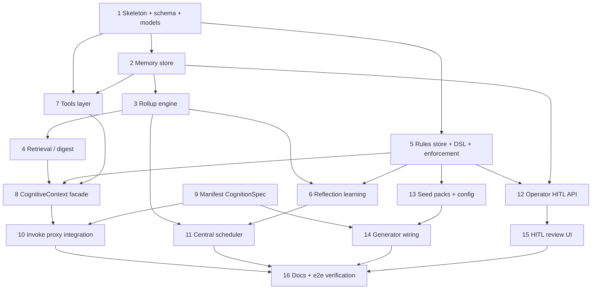

# Agent Cognition Core — Implementation Plan

This breaks [`DESIGN.md`](DESIGN.md) into sequenced, independently-mergeable deliverables.
When **all** steps are complete, the spec is 100% implemented. Each step is sized to be one
PR with its own tests (backend ≥90% line coverage, ruff clean; frontend ≥90% via vitest).

**Legend:** Depends → prerequisite steps · ✅ Acceptance = merge gate.

## Dependency overview

---

## Milestone A — Persistence & memory

### Step 1 — Package skeleton, Postgres schema, models
- **Goal:** Establish the package and durable storage.
- **Files:** `agent_cognition/__init__.py`, `models.py` (Pydantic: `MemoryEvent`,
  `PeriodSummary`, `Rule`, `RuleProposal`, `ToolCall`, `CognitionContext`,
  `CognitionWriteback`, enums for `kind`/`scale`/`mode`/`status`/`source`);
  `postgres/__init__.py` (`SCHEMA: TeamSchema` — the 4 tables, indexes, unique
  `(agent_id, scale, period_start)`); register in `shared_postgres/registry.py`; call
  `register_team_schemas(SCHEMA)` from `unified_api/main.py` lifespan.
- **Depends:** —
- **✅ Acceptance:** tables created idempotently on startup; models validate/round-trip;
  schema is pure data (no import side effects).

### Step 2 — Memory store (DAL)
- **Goal:** Read/write episodic events and summaries.
- **Files:** `memory/store.py` — `append_event` (idempotent: insert `ON CONFLICT
  (agent_id, source_run_id, source_seq) DO NOTHING`), `fetch_events_for_period`,
  `fetch_recent_events(top_n, by_salience)`, `upsert_summary`, `fetch_summaries(scale, …)`,
  `get_last_summary(scale)`, and `mark_period_stale(agent_id, occurred_at)` (flags the
  containing day/week/month/year summaries for recompute on late arrival). Reuse `get_conn`,
  `Json`, `dict_row`, `@timed_query`. Every query filtered by `agent_id`.
- **Depends:** 1
- **✅ Acceptance:** append/fetch round-trip; `upsert_summary` idempotent on the unique key;
  **re-appending the same `(source_run_id, source_seq)` is a no-op**; a late event flags the
  right periods stale; cross-`agent_id` isolation proven.

### Step 3 — Rollup engine
- **Goal:** Idempotent day→week→month→year summarization.
- **Files:** `memory/rollup.py` — UTC closed-period detection; hierarchical rollup (day from
  events, week from days, month from weeks, year from months); `ensure_rollups_current(
  agent_id, now)` as the single idempotent entry point that processes periods that are **not
  yet summarized OR flagged `stale`**, recomputing a stale period and cascading the flag to its
  parent scales; uses `complete_validated(schema=PeriodSummary)`, `compact_text`,
  `get_client("cognition")`.
- **Depends:** 2
- **✅ Acceptance:** re-running produces no duplicates; a missed day is filled on next pass;
  **a late event in an already-summarized period triggers recompute of that period and its
  parents** (not skipped forever); hierarchical correctness and compaction path tested with a
  fake LLM client.

### Step 4 — Retrieval / digest builder
- **Goal:** The compact memory block injected on invoke.
- **Files:** `memory/retrieval.py` — `build_memory_digest(agent_id, token_budget)`. Because
  rollups only exist for **closed** periods, the digest uses the most recent **closed** day /
  week / month summaries (`get_last_summary(scale)`) for stable long-range context, and
  represents the **in-progress** period directly from recent raw events (top-N by salience) —
  no dependency on a summary that doesn't exist yet mid-week/month. (A cheap on-the-fly partial
  rollup of the in-progress period is an optional future enhancement, explicitly out of v1.)
  Trimmed to `token_budget` via `compact_text`.
- **Depends:** 3
- **✅ Acceptance:** budget respected; salience/recency ordering; **mid-period invoke returns
  the latest closed week/month summary plus in-progress events (never empty solely because the
  current period isn't closed)**; empty history → empty digest.

## Milestone B — Rules engine

### Step 5 — Rules store, predicate DSL, enforcement
- **Goal:** Store rules/proposals and enforce them.
- **Files:** `rules/store.py` (CRUD rules + proposals; proposals carry `action`
  (add|retire|amend) + `target_rule_id`; `approve` applies the action deterministically —
  `add` inserts active, `retire` retires the target, `amend` retires the target and inserts
  its replacement active; `reject`→archived; seed-pack install); `rules/enforcement.py`
  (`build_rule_prompt_block(advisory_rules)`; predicate DSL evaluator with a **fixed
  allowlist** of ops — e.g. `<= >= == in forbid_tool` — exposing `evaluate_precondition(ctx)` /
  `evaluate_postcondition(output)` → allow/block+reason).
- **Depends:** 1
- **✅ Acceptance:** prompt-block rendering; predicate allow/block matrix; invalid/unknown-op
  predicates rejected (no eval); **approving each of add/retire/amend lands the correct rule
  state** (retire/amend never mis-activate as new rules); `agent_id` isolation.

### Step 6 — Reflection (rule learning)
- **Goal:** Derive rule proposals from memory (HITL).
- **Files:** `rules/reflection.py` — LLM proposes add/retire/amend from recent summaries +
  active rules; writes `pending` proposals with `action`, `target_rule_id` (for retire/amend),
  and `evidence`. **Never activates.**
- **Depends:** 3, 5
- **✅ Acceptance:** proposals created with evidence linkage; assertion that nothing reaches
  `active` without explicit approval.

## Milestone C — Tools & orchestration

### Step 7 — Tools layer
- **Goal:** Per-agent toolset, executed and logged to memory.
- **Files:** `tools/binding.py` (resolve manifest `cognition.tools` ids against
  `LlmToolsService` + `IntegrationRegistry` + `agent_git_tools` → `(definitions, handlers)`,
  tagging each tool's **execution site**: `in_process`, `sandbox_local`, or `platform_bound`);
  `tools/runner.py` (wrap `complete_json_with_tool_loop`; emit `tool_call`/`outcome` events).
  For `platform_bound` tools used by sandboxed agents, the loop is **proxy-driven** via the
  SB↔PX `tool_calls`/`tool_results` protocol (defined here, wired in Step 10) so secrets/egress
  stay platform-side; `sandbox_local` tools run inside the sandbox.
- **Depends:** 1, 2
- **✅ Acceptance:** known ids resolve to the correct execution site, unknown id errors; each
  tool call writes memory events; **a platform-bound tool for a sandboxed agent round-trips
  through the proxy-driven loop** (stubbed sandbox) without exposing secrets to the sandbox.

### Step 8 — CognitiveContext facade
- **Goal:** One seam wiring memory + rules + tools; defines the invoke contract.
- **Files:** `context.py` — `ensure_rollups_current`, `load_context` (rules + digest →
  `CognitionContext`), `persist_writeback` (append events/tool calls, **strip secrets**, bound
  salience), enforced pre/postcondition hooks.
- **Depends:** 4, 5, 7
- **✅ Acceptance:** load/writeback round-trip; precondition-block path; secret-stripping on
  writeback.

### Step 9 — Manifest `CognitionSpec`
- **Goal:** Declarative per-agent cognition config.
- **Files:** add optional `CognitionSpec` to `agent_registry/models.py` (memory retention,
  tools, rule_packs); loader tolerates its absence (lazy, like `InvokeSpec`/`SandboxSpec`).
- **Depends:** 1
- **✅ Acceptance:** manifests with and without the block parse; sample manifest added.

### Step 10 — Invoke proxy integration
- **Goal:** Make the contract live at the boundary.
- **Files:** `unified_api/routes/agents.py` — lazy catch-up → load context → advisory-into-
  system-prompt + enforced precondition gate (block → 4xx + memory event) → inject `cognition`
  block → on return **run postcondition check first, then** persist writeback (on
  postcondition violation persist only a sanitized blocked-run audit event, never the rejected
  writeback). For sandboxed agents with `platform_bound` tools, drive the multi-turn SB↔PX
  `tool_calls`/`tool_results` loop (from Step 7) instead of a single shot. Helper for
  in-process teams (no HTTP hop).
- **Depends:** 8, 9
- **✅ Acceptance:** stubbed-sandbox test shows inject + persist; precondition block → 4xx;
  postcondition violation → 4xx **with no full writeback persisted** (only the audit event);
  a platform-bound tool round-trips via the proxy-driven loop without sandbox secret exposure.

## Milestone D — Automation & operations

### Step 11 — Central scheduler
- **Goal:** Platform-side rollups/reflection for all agents.
- **Files:** `scheduler.py` — async loop (`AGENT_COGNITION_TICK_S`, default hourly) calling
  the same `ensure_rollups_current` + reflection per agent; started/cancelled in the
  unified_api lifespan (mirror `agent_console.prune.run_pruner`).
- **Depends:** 3, 6
- **✅ Acceptance:** tick rolls up due agents; clean cancel on shutdown; shares the idempotent
  function so it can't double-produce against the lazy path.

### Step 12 — Operator HITL API
- **Goal:** Review/inspect endpoints.
- **Files:** `unified_api/routes/cognition.py` — `GET …/memory`, `GET …/rules`,
  `GET …/rule-proposals?status=pending`, `POST …/approve`, `POST …/reject`; author via
  `resolve_author` (provenance only). Mount under a dedicated **`/api/cognition/...`** prefix
  and add it to the security gateway's matched-prefix set (`_get_team_prefixes()` /
  `_is_team_path()` cover only `TEAM_CONFIGS` today, so these routes are not gated otherwise).
  `approve`/`reject` additionally enforce an **operator-authorization check**
  (`COGNITION_OPERATOR_TOKEN` now, operator role when platform auth lands) — `resolve_author`
  must never be the access-control decision and can return `anonymous`.
- **Depends:** 2, 5
- **✅ Acceptance:** list/approve/reject flows; author tagging; 404s for unknown ids/proposals;
  **gateway test proving the cognition prefix is intercepted** (not bypassed); **approve/reject
  without a valid operator credential is rejected 401/403** (HITL gate cannot be defeated by an
  unauthenticated caller).

### Step 13 — Seed rule packs + config/env
- **Goal:** Sensible day-one guardrails + operability.
- **Files:** ship `default_guardrails` seed pack; document env (`AGENT_COGNITION_TICK_S`,
  event retention, digest token budget, `LLM_MODEL_cognition`, `COGNITION_OPERATOR_TOKEN`) in
  `CLAUDE.md` + package README.
- **Depends:** 5
- **✅ Acceptance:** seed pack installs on first provision of an agent; env defaults documented.

## Milestone E — Adoption & UX

### Step 14 — Generator wiring (Agentic team)
- **Goal:** Every newly generated agent gets the core automatically.
- **Files:** `agentic_team_provisioning` stamps the `cognition` manifest block onto generated
  agents; update `AGENT_ANATOMY.md` to point §3/§4/§6 at the batteries-included core.
- **Depends:** 9, 13
- **✅ Acceptance:** generated manifest includes a valid `cognition` block; anatomy doc updated.

### Step 15 — HITL review UI (Angular)
- **Goal:** Operator surface in the Agent Console.
- **Files:** new "Cognition" panel — memory timeline, rules list, proposal review
  (approve/reject); API client service + components.
- **Depends:** 12
- **✅ Acceptance:** approve/reject round-trips against the API; ≥90% vitest line coverage.

### Step 16 — Docs + end-to-end verification
- **Goal:** Close the loop and prove it.
- **Files:** `ARCHITECTURE.md` section; flip `DESIGN.md` status to implemented; e2e test:
  seed synthetic events → rollup → reflection → proposal → approve → next invoke reflects the
  new active rule.
- **Depends:** 10, 11, 14, 15
- **✅ Acceptance:** e2e test green; docs cross-reference the shipped package.

---

## Suggested PR sequencing

1. **A (1→4)** memory foundation · 2. **B (5→6)** rules engine · 3. **C (7→10)** tools +
   orchestration + proxy · 4. **D (11→13)** scheduler/API/config · 5. **E (14→16)** adoption,
   UI, docs/e2e.

Steps within a milestone can land as separate PRs; cross-milestone order follows the graph
above. Each PR must reference its tracker issue with `Closes #N` per repo policy.
