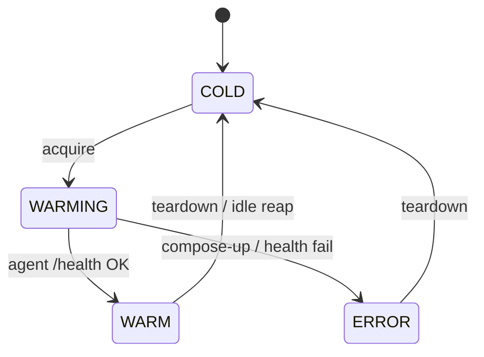

# agent_provisioning_team.sandbox

Per-agent ephemeral sandbox lifecycle used by the Agent Console **Runner**.

Each invocation of a specialist agent gets its own self-contained
**docker compose project** containing the unified
`khala-agent-sandbox` image (`backend/agent_sandbox_image/`,
`backend/agent_sandbox_runtime/`) **plus a sandbox-internal Postgres,
Temporal, Prometheus, and Grafana**. The agent runs as if it were in a
live environment, but every backing service it sees is its own — no
service in the sandbox stack joins the long-lived `khala-stack` compose
network. Sandboxes are torn down (with their volumes) after they go
idle.

The pre-#456 model launched a single hardened container on a shared
`khala-sandbox` bridge and forwarded credentials to whatever Postgres /
Temporal happened to be running on the host. That model assumed a
multi-tenant SaaS-shaped product; this project is single-operator, so we
swapped it for "one self-contained stack per sandbox" and dropped the
permission-tier ladder at the same time.

Used by `backend/unified_api/routes/sandboxes.py` (`/api/agents/sandboxes/*`)
and the invoke proxy in `routes/agents.py` (`POST /api/agents/{id}/invoke`).

## Modules

| File | Role |
|---|---|
| `lifecycle.py` | Per-process `Lifecycle` class keyed by `agent_id`: `acquire`, `status`, `teardown`, `list_active`, `note_activity`, idle reaper. |
| `provisioner.py` | `docker compose up -d` / `docker inspect` / `docker compose down -v` wrapper. Renders the per-sandbox compose template into `${AGENT_CACHE}/agent_provisioning/sandboxes/stacks/<project>/` and brings the stack up. |
| `state.py` | Pydantic models (`SandboxState`, `SandboxHandle`, `SandboxStatus`), atomic JSON checkpoint, env-var helpers, paths into the per-sandbox stack assets. |

## Stack contents

Each sandbox's compose project contains:

| Service | Image | Purpose |
|---|---|---|
| `postgres` | `postgres:16-alpine` | Application data + Temporal persistence + Temporal visibility (separate logical DBs, same instance). |
| `temporal` | `temporalio/auto-setup:1.24.2` | Workflow engine, points at the in-stack postgres. |
| `prometheus` | `prom/prometheus:v2.55.0` | Scrapes the agent shim's `/metrics`. |
| `grafana` | `grafana/grafana:10.4.7` | Pre-provisioned with the in-stack Prometheus as default datasource. Anonymous Admin so the operator can browse without login. |
| `agent` | `khala-agent-sandbox:latest` | The agent itself, pinned to one `SANDBOX_AGENT_ID`. |

The agent container's env points at sandbox-internal hosts (`postgres`,
`temporal`, `prometheus`, `grafana`); only its `8090/tcp` is published
to the host on a loopback-bound ephemeral port so the unified API can
proxy `POST /api/agents/{id}/invoke`. Postgres / Temporal / Prometheus
/ Grafana are reachable only from inside the project network.

## State machine



Transitions are serialised by a per-agent `asyncio.Lock`. State is
checkpointed after every transition and reconciled with `docker inspect`
on the next request so an API restart doesn't orphan stacks.

### Durable execution (Temporal)

When `TEMPORAL_ADDRESS` is set, the state-**mutating** transitions run as
durable Temporal workflows/activities instead of direct in-process calls
(`SandboxAcquireWorkflow` / `SandboxTeardownWorkflow`, and the idle reaper as a
single self-scheduling `SandboxReaperWorkflow`). Read-only ops (`status`,
`list_active`, `metrics`, `note_activity`) stay direct on the API loop. Dispatch
lives in `agent_provisioning_team.temporal.sandbox_dispatch`; the workflows and
activities are exported from `temporal/__init__.py` as `SANDBOX_WORKFLOWS` /
`SANDBOX_ACTIVITIES` — deliberately **not** part of the team's main
`WORKFLOWS`/`ACTIVITIES` lists. They run on their own `SANDBOX_TASK_QUEUE`
(`temporal/constants.py`), served only by a worker started explicitly from
`unified_api/main.py`'s own lifespan
(`start_agent_provisioning_sandbox_temporal_worker_thread`) — never by the
main provisioning worker that team_service boots on `TASK_QUEUE`. Sharing a
task queue between the two would let Temporal dispatch a sandbox activity into
that other process,
against a different, unsynchronized `Lifecycle` instance than the one this
API's `status`/`list`/`metrics`/`note_activity` routes read — silently
diverging state (e.g. the reaper tearing down a sandbox it wrongly believes
idle). Two invariants make the rest of this safe on the process-wide
singleton:

- **Loop affinity** — every `asyncio.Lock` taker (`acquire`, `teardown`,
  `reap_once` via `teardown`) runs on exactly one event loop: the Temporal
  worker loop when enabled, the API loop when not. It is never half-migrated
  (moving only some mutators would split the shared lock across two loops).
- **Thread safety** — a `threading.Lock` on the `Lifecycle` serialises every
  `_state` read/write and persist, since mutators now run on the worker thread
  while read-only ops run on the API loop. `state.save()` snapshots before
  serialising and writes a uniquely-named temp file so concurrent persists
  can't corrupt `state.json`.

Durability is bounded: `_state` is in-memory per process, so a sandbox activity
retried on a different worker replica sees empty state. Single-process
deployments are unaffected; the concentrated win is the durable, single-instance
reaper. Sandbox Temporal dispatch is gated only on `TEMPORAL_ADDRESS` /
`is_temporal_enabled()` — when Temporal is off, mutators run directly on the API
loop.

## SandboxSpec (manifest side)

Each agent's YAML manifest may declare a `sandbox:` block consumed by the
provisioner. Fields live on `agent_registry.models.SandboxSpec`:

| Field | Purpose |
|---|---|
| `env` | Extra env vars to forward into the agent container (beyond the default Postgres/Temporal/LLM set). |
| `extra_pip` | Additional pip packages to install at image build time. |

Note: there is no `access_tier` field. Permission tiers were removed in
#456 — every sandbox is provisioned with full access on every backing
service (its own Postgres, its own Temporal, etc.).

## Environment variables

| Variable | Default | Purpose |
|---|---|---|
| `AGENT_PROVISIONING_SANDBOX_IMAGE` | `khala-agent-sandbox:latest` | Image tag for the agent service inside each stack. |
| `AGENT_PROVISIONING_SANDBOX_STACK_TEMPLATE` | `backend/agent_sandbox_image/sandbox-stack.yml` | Override the compose template (e.g. for tests). |
| `AGENT_PROVISIONING_SANDBOX_STATE_FILE` | `$AGENT_CACHE/agent_provisioning/sandboxes/state.json` | Where to checkpoint state across restarts. |
| `AGENT_PROVISIONING_SANDBOX_IDLE_MINUTES` | `5` | Idle threshold before the reaper tears a sandbox down. |
| `AGENT_PROVISIONING_SANDBOX_BOOT_TIMEOUT_S` | `90` | How long to wait for the agent's `/health` to succeed. (Cold start is dominated by Postgres + Temporal coming up.) |
| `AGENT_PROVISIONING_SANDBOX_ACQUIRE_TIMEOUT_S` | `300` | Temporal `SandboxAcquireWorkflow` activity ceiling; must exceed the boot timeout. |
| `AGENT_PROVISIONING_SANDBOX_TEARDOWN_TIMEOUT_S` | `120` | Temporal `SandboxTeardownWorkflow` activity ceiling. |
| `AGENT_PROVISIONING_SANDBOX_REAP_TIMEOUT_S` | `300` | Temporal reap activity ceiling per tick. |
| `AGENT_PROVISIONING_SANDBOX_REAPER_INTERVAL_S` | `60` | Sleep between `SandboxReaperWorkflow` ticks (Temporal mode). |

## Local smoke test

```bash
cd backend && make run
# in another shell (blogging.writer is just an example agent id):
curl -X POST localhost:8080/api/agents/sandboxes/blogging.writer | jq
# poll until status -> warm (cold start ≈ 30s on first run; subsequent
# runs are faster as compose reuses cached images and named volumes are
# fresh per stack).
curl localhost:8080/api/agents/sandboxes/blogging.writer | jq
curl -X POST localhost:8080/api/agents/blogging.writer/invoke \
     -H 'Content-Type: application/json' \
     -d @agents/blogging/agent_console/samples/blogging.writer/default.json | jq

# Inspect the stack while it runs:
docker compose ls                  # khala-sbx-blogging-writer-<digest>
docker compose -p <project> ps     # postgres / temporal / prometheus / grafana / agent
docker exec -it <project>-agent psql -h postgres -U sandbox khala_sandbox -c '\l'

curl -X DELETE localhost:8080/api/agents/sandboxes/blogging.writer
```

`docker network ls` confirms `khala-stack` is unaffected — sandboxes
never join it.

## Tests

```bash
cd backend
python3 -m pytest agents/agent_provisioning_team/tests/test_sandbox_stack_provisioner.py \
                  agents/agent_provisioning_team/tests/test_sandbox_lifecycle.py
```

Tests patch `provisioner._exec` and `run_container`/`stop_container` so
the suite runs offline.

## Design notes

- **One self-contained stack per agent.** No shared services across
  sandboxes. The agent only sees Postgres / Temporal / Prometheus /
  Grafana running inside its own compose project.
- **Hardened agent service.** The agent service still sets
  `--cap-drop ALL`, `--read-only`, `--security-opt=no-new-privileges`,
  pid/file ulimits, and binds host ports to `127.0.0.1`. Supporting
  services have modest memory caps but aren't subject to the same drop
  set (Temporal/auto-setup needs a writable rootfs to bootstrap its
  schema, etc.).
- **Per-sandbox secrets only.** A 0400 secrets file is bind-mounted into
  the agent container with the freshly-minted Postgres password and any
  external LLM API keys (`OLLAMA_API_KEY`, `ANTHROPIC_API_KEY`) the host
  has set. The host's own `POSTGRES_*` env vars are deliberately *not*
  forwarded — each sandbox owns its database.
- **No permission tiers.** Every sandbox has full administrative access
  on every backing service. The previous `AccessTier` enum and
  `access_policy.py` module were removed in #456.
- **Restart safety.** State is reconciled with `docker inspect` on the
  next request, so an API crash doesn't orphan stacks or leak tracked
  state. Tearing down a stack also removes its named volumes via
  `docker compose down -v`, so no run inherits state from a previous one.
