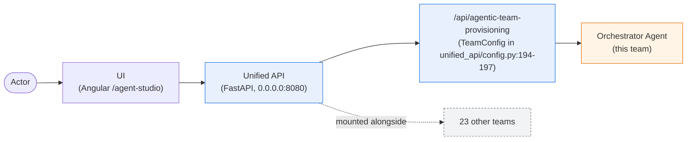
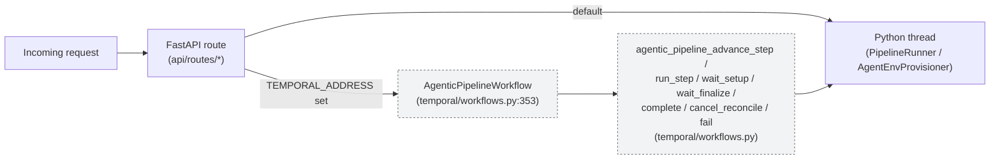

# Architecture

> **Extends [`../designs/Agentic-team-architecture.png`](../designs/Agentic-team-architecture.png).** The groupings `API Layer`, `Orchestrator Agent`, `Agents`, `Processes`, `Job Tracking`, and `Question Tracking` are reused verbatim. This diagram adds:
> 1. Concrete orchestrator internals (the PNG shows an opaque `Orchestrator Agent` box);
> 2. The two API categories `Assets` and `Form Information` that the legacy internal PNG omits but the [`AgenticTeamApiInteractionsArchitecture.png`](../designs/AgenticTeamApiInteractionsArchitecture.png) already shows;
> 3. Testing-mode and Pipeline-run endpoints (not in either legacy PNG);
> 4. External dependencies (LLM service, Agent Provisioning team, Temporal, shared.postgres, shared.observability) as dashed-outline nodes, so the additions are visually distinct from the inherited boxes.

## 1. Expanded internal architecture

```mermaid
graph TB
    %% ---- API Layer (top) ----
    subgraph APILayer["API Layer"]
        direction LR
        subgraph Legacy5["Legacy 5 API categories — from AgenticTeamApiInteractionsArchitecture.png"]
            direction LR
            UserRequests["User Requests / Chat"]
            Questions["Questions for User"]
            JobStatus["Team / Job Status"]
            Assets["Assets"]
            FormInfo["Form Information"]
        end
        subgraph Extended["New endpoints — Testing / Pipeline"]
            direction LR
            TestingChat["Testing Chat"]
            PipelineRuns["Pipeline Runs"]
            ModeToggle["Team Mode Toggle"]
        end
    end

    %% ---- Orchestrator Agent (middle) — new decomposition ----
    subgraph OrchestratorAgent["Orchestrator Agent — the service itself (api/routes, api/services, api/state, api/lifecycle)"]
        direction TB
        PDA["ProcessDesignerAgent<br/>(assistant/agent.py — LLM chat)"]
        RosterValidator["RosterValidator<br/>(roster_validation.py)"]
        AgentEnvBridge["AgentEnvProvisioner<br/>(agent_env_provisioning.py)"]
        PipelineRunner["PipelineRunner<br/>(runtime/pipeline_runner.py)"]
        AgentBuilder["AgentBuilder<br/>(runtime/agent_builder.py)"]
        Store["AgenticTeamStore<br/>(assistant/store.py)"]
        TestStore["AgenticTestStore<br/>(testing/store.py)"]
        Infra["TeamFormStore + JobServiceClient<br/>(infrastructure.py)"]
    end

    %% ---- Side trackers (same placement as legacy PNG) ----
    JobTracking["Job Tracking<br/>(JobServiceClient)"]
    QuestionTracking["Question Tracking<br/>(pending_questions on jobs)"]

    %% ---- Bottom pools (same as legacy PNG) ----
    subgraph Agents["Agents — Roster / Agents pool"]
        direction TB
        A1["Agent 1"]
        A2["Agent 2"]
        AN["Agent N"]
    end
    subgraph Processes["Processes — Processes pool"]
        direction TB
        P1["Process 1"]
        P2["Process 2"]
        PN["Process N"]
    end

    %% ---- External dependency strip (new — dashed) ----
    subgraph External["External dependencies — new in this diagram"]
        direction LR
        LLM["LLM Service<br/>(llm_service)"]
        APT["Agent Provisioning Team<br/>(sandboxed envs)"]
        Temporal["Temporal<br/>(optional)"]
        PG["shared.postgres"]
        OTEL["shared.observability"]
    end

    %% ---- API Layer → Orchestrator ----
    UserRequests --> PDA
    Questions --> Infra
    JobStatus --> Infra
    Assets --> Infra
    FormInfo --> Infra
    TestingChat --> AgentBuilder
    PipelineRuns --> PipelineRunner
    ModeToggle --> TestStore

    %% ---- Orchestrator wiring ----
    PDA --> Store
    PDA --> LLM
    Store --> RosterValidator
    Store --> AgentEnvBridge
    AgentBuilder --> LLM
    PipelineRunner --> AgentBuilder
    PipelineRunner --> TestStore

    %% ---- Orchestrator → side trackers (same shape as legacy PNG) ----
    Infra --> JobTracking
    Infra --> QuestionTracking

    %% ---- Orchestrator → pools (same shape as legacy PNG) ----
    RosterValidator --> Agents
    AgentBuilder --> Agents
    PDA --> Processes
    PipelineRunner --> Processes

    %% ---- Orchestrator → externals ----
    AgentEnvBridge -. provisions .-> APT
    Store -. when POSTGRES_HOST set .-> PG
    PipelineRunner -. optional durable mode .-> Temporal
    OrchestratorAgent -. OTel spans .-> OTEL

    classDef apiLayer fill:#e8f0fe,stroke:#1a73e8,color:#0b2a5b
    classDef orchestrator fill:#fff4e5,stroke:#e8710a,color:#3a1d00
    classDef agentsPool fill:#e6f4ea,stroke:#188038,color:#0b3a1a
    classDef processesPool fill:#fce8e6,stroke:#c5221f,color:#3a0b07
    classDef tracking fill:#f3e8fd,stroke:#8430ce,color:#2a0a4a
    classDef external fill:#f1f3f4,stroke:#5f6368,color:#202124,stroke-dasharray: 3 3

    class UserRequests,Questions,JobStatus,Assets,FormInfo,TestingChat,PipelineRuns,ModeToggle apiLayer
    class PDA,RosterValidator,AgentEnvBridge,PipelineRunner,AgentBuilder,Store,TestStore,Infra orchestrator
    class A1,A2,AN agentsPool
    class P1,P2,PN processesPool
    class JobTracking,QuestionTracking tracking
    class LLM,APT,Temporal,PG,OTEL external
```



### What this adds on top of the legacy PNG

| Element | Status vs. legacy `Agentic-team-architecture.png` |
|---|---|
| `API Layer` subgraph | **Kept** — same top-of-diagram placement |
| `Job Status`, `Questions for User`, `User Requests / Chat` | **Kept verbatim** (original 3 categories) |
| `Assets`, `Form Information` | **Added** — present in the interactions PNG but missing from the internal PNG |
| `Testing Chat`, `Pipeline Runs`, `Team Mode Toggle` | **Added** — testing-mode endpoints from `api/routes/testing.py` / `api/services/testing.py` |
| `Orchestrator Agent` | **Kept** as middle subgraph; **decomposed** into its 8 concrete internals |
| `Agents` pool (`Agent 1 … Agent N`) | **Kept verbatim** |
| `Processes` pool (`Process 1 … Process N`) | **Kept verbatim** |
| `Job Tracking`, `Question Tracking` side boxes | **Kept** (same placement, wired to `JobServiceClient`) |
| `LLM Service`, `Agent Provisioning Team`, `Temporal`, `shared.postgres`, `shared.observability` | **Added** as dashed-outline external strip |

## 2. Orchestrator Agent — why the service *is* the orchestrator

The normative contract ([`../AGENTIC_TEAM_ARCHITECTURE.md:32-39`](../AGENTIC_TEAM_ARCHITECTURE.md)) says:

> The Orchestrator Agent is the central coordinator inside every agentic team. […] The orchestrator is the **single point of control** for the team. No agent or process runs without the orchestrator's knowledge.

In this service, the orchestrator is **not** a dedicated LLM agent — it is the FastAPI application assembled by [`api/main.py`](../api/main.py) (factory + `include_router` only) together with [`api/routes/`](../api/routes/), [`api/services/`](../api/services/), [`api/state.py`](../api/state.py), and [`api/lifecycle.py`](../api/lifecycle.py). Every external call enters through a route, the route delegates to the matching service function, and all persistence, validation, and downstream dispatch happens inside that service (dereferencing shared singletons off `api.main` at call time).

| Orchestrator internal | File | Role |
|---|---|---|
| `ProcessDesignerAgent` | `assistant/agent.py` | LLM-driven chat that emits ```agents``` / ```process``` / ```suggestions``` JSON blocks |
| `AgenticTeamStore` | `assistant/store.py` | Authoritative persistence for teams, processes, roster, conversations, provisioning status |
| `RosterValidator` | `roster_validation.py` | Detects gaps: `unstaffed_step`, `unrostered_agent`, `unused_agent`, `missing_manifest`, `incomplete_profile`, `sparse_profile` (`roster_validation.py:23-179`) |
| `AgentEnvProvisioner` | `agent_env_provisioning.py` | Spawns background threads calling `agent_provisioning_team.ProvisioningOrchestrator.run_workflow` (`agent_env_provisioning.py:88-129`) |
| `PipelineRunner` | `runtime/pipeline_runner.py` | Walks a `ProcessDefinition` DAG step-by-step, pauses at `WAIT` steps, resumes on human input (`runtime/pipeline_runner.py:33-71`) |
| `AgentBuilder` | `runtime/agent_builder.py` | Builds a `strands.Agent` from join-at-read persona fields for interactive testing and pipeline steps |
| `AgenticTestStore` | `testing/store.py` | Testing-mode persistence (chat sessions, messages, pipeline runs, ratings) |
| `TeamFormStore` + `JobServiceClient` | `infrastructure.py` | Per-team SQLite (`team.db`, WAL mode) and job lifecycle tracking (`infrastructure.py:51-80`) |

## 3. Unified API mount



This team is registered in `backend/unified_api/config.py:194-197`:

```python
"agentic_team_provisioning": TeamConfig(
    name="Agentic Team Provisioning",
    prefix="/api/agentic-team-provisioning",
    description="Create agentic teams and define their processes through conversation",
)
```

The Unified API security gateway sits in front of all routes (see `backend/unified_api/config.py` and `SECURITY_GATEWAY_ENABLED`).

## 4. Execution model: threads by default, Temporal optional



- **Thread mode (default).** `PipelineRunner.start_run` (`runtime/pipeline_runner.py:41-56`) starts a daemon thread named `pipeline-{run_id[:16]}`; `AgentEnvProvisioner._spawn_provision_thread` (`agent_env_provisioning.py:88-129`) starts a daemon thread named `prov-{provisioning_agent_id[:24]}`.
- **Temporal mode (optional).** `temporal/__init__.py` stays free of import-time side effects (the temporalio sandbox replays it during workflow registration) and only exports `WORKFLOWS = [AgenticPipelineWorkflow]`, `ACTIVITIES` (the seven `agentic_pipeline_*` activities above), and `TASK_QUEUE = "agentic_team_provisioning-queue"`. The worker itself is started by `temporal/worker.py`'s `start_agentic_team_provisioning_temporal_worker_thread`, invoked from two places: the team-service entrypoint at boot (`TEAM_TEMPORAL_WORKER_MODULE`/`TEAM_TEMPORAL_WORKER_FUNC`), and — as a standalone-dev backstop — the API lifespan's `_startup` hook in `api/lifecycle.py`.

## 5. Reused shared infrastructure

| Shared module | Usage |
|---|---|
| `shared.observability` (`init_otel`, `instrument_fastapi_app`) | OpenTelemetry spans on every route, wired by `shared.app.create_team_app` (called from `api/main.py`) |
| `shared.postgres` (`register_team_schemas`, `close_pool`) | Registers `AGENTIC_POSTGRES_SCHEMA` in the FastAPI lifespan built by `shared.app.create_team_app` (`api/main.py` passes the schema in; registration itself lives in `shared/app/factory.py`) — no-op when `POSTGRES_HOST` unset |
| `shared.temporal` (`is_temporal_enabled`, `start_team_worker`) | Worker bootstrap via `temporal/worker.py`'s `start_agentic_team_provisioning_temporal_worker_thread`, called from the team-service entrypoint and, as a standalone-dev backstop, `api/lifecycle.py`'s `_startup` hook — never at `temporal/__init__.py` import time |
| `job_service_client` (`JobServiceClient`) | Per-team job lifecycle and pending question tracking via `infrastructure.py` |
| `llm_service.get_client()` | Single LLM client consumed by both `ProcessDesignerAgent` (chat) and `AgentBuilder` (test chat + starter prompts) |
