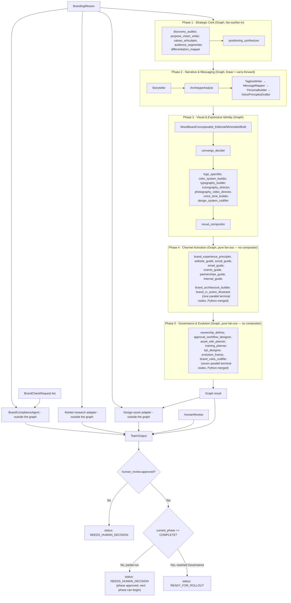
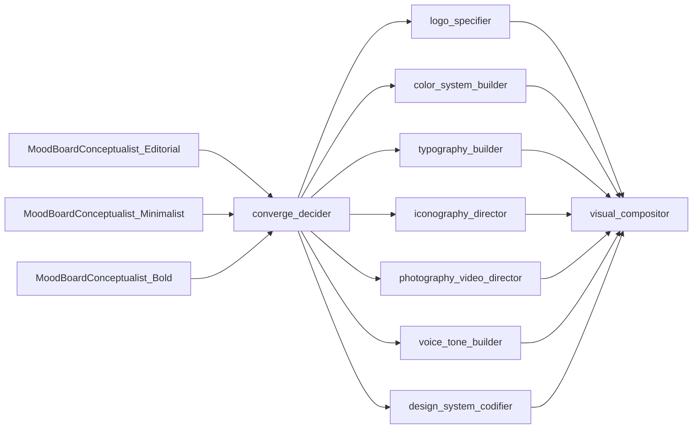
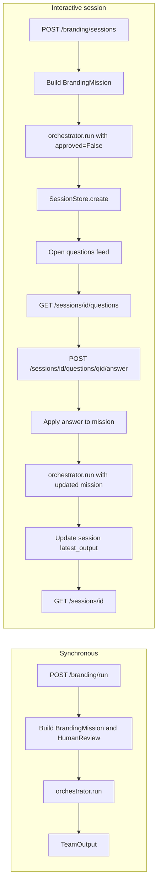

# Branding Strategy Team

This team defines and operationalizes an enterprise brand system through a coordinated group of specialist agents. It is structured as a **branding agency**: one client can own many brands, and the team assists with building, maintaining, and evolving each brand over time.

## Table of contents

- [What this team does](#what-this-team-does)
- [Agency model (clients and brands)](#agency-model-clients-and-brands)
- [Agent setup and flow](#agent-setup-and-flow)
- [LLM routing (agent_key tiers)](#llm-routing-agent_key-tiers)
- [API and session flow](#api-and-session-flow)
- [Agency API (clients, brands, run, outsourcing)](#agency-api-clients-brands-run-outsourcing)
- [Outsourcing](#outsourcing)
- [Elite deliverables](#elite-deliverables)
- [Integration with other teams](#integration-with-other-teams)
- [Notes on session behavior](#notes-on-session-behavior)

## What this team does

1. **Codifies brand identity** with positioning, promise, and narrative pillars.
2. **Ideates brand images** through multiple mood-board concepts.
3. **Guides refinement** with a structured creative workshop and decision framework.
4. **Defines writing guidelines, brand guidelines, and design system standards** for consistent delivery.
5. **Builds and maintains a brand wiki backlog** so the entire organization can work from a shared source of truth.
6. **Fields on-brand requests** by evaluating assets and returning confidence, rationale, and revision suggestions.
7. **Runs an interactive asynchronous clarification loop** where open questions are published to a feed and answered one-by-one.
8. **Manages clients and brands** so each client can have many brands, with versioned runs and evolution over time.
9. **Outsources** market research (competitive/similar brands) and design-asset requests to other teams when configured.

## Agency model (clients and brands)

- **One client, many brands.** Each client has an `id` and `name`; each brand belongs to one client and has a mission (company name, description, target audience, etc.), status (`draft` | `active` | `evolving` | `archived`), and versioned run history.
- **Lifecycle:** Create a client → create one or more brands (with mission) → **run** the orchestrator for a brand (output is stored as a new version) → **evolve** by updating the brand’s mission or status and re-running. The team can also **request market research** or **request design assets** for a brand; results are returned (and optionally attached to the brand context).
- **Persistence:** Clients, brands, and conversations are stored in the shared Khala Postgres instance via ``shared.postgres`` (no SQLite fallback). Tables: ``branding_clients``, ``branding_brands``, ``branding_sessions``, ``branding_conversations``, ``branding_conv_messages``.

## Agent setup and flow

`BrandingTeamOrchestrator.run()` (`orchestrator.py`) drives the pipeline: it resolves the mission, builds `build_branding_graph(target_phase=...)` (`graphs/top_level.py`), serializes the mission into a task string, and invokes the graph. The result is a **single top-level Strands `Graph`** whose 5 nodes are themselves phase sub-graphs, wired **strictly sequentially** — `phase1_strategic_core → phase2_narrative → phase3_visual → phase4_channel → phase5_governance`. An optional `target_phase` stops the pipeline early; gating happens at graph-build time (later phase nodes/edges are simply never added), not via runtime conditional edges. `run_single_phase()` reuses the same per-phase builders to run one phase in isolation (e.g. from a Temporal activity).

Brand-compliance checks (`BrandComplianceAgent`, a plain keyword-matching dataclass, not a graph node) and the market-research / design-asset integrations run **outside** the graph, after it completes: compliance checks run synchronously first, then the two integrations run concurrently with each other via `asyncio.gather`. The orchestrator then assembles everything into a single `TeamOutput` whose status depends on the per-phase gates and `human_review.approved`.



Phase 3 combines a diverge fan-out with a post-converge specialist fan-out, so it's worth expanding on its own:



Three style-variant `MoodBoardConceptualist_{Editorial,Minimalist,Bold}` agents run in parallel and fan directly into `converge_decider` — the same direct fan-in shape as Phase 1's five specialists into `positioning_synthesizer`, with no intermediate collector node; Strands' Graph engine assembles the three completed `mood_board_candidates` fragments into `converge_decider`'s input once the whole diverge batch finishes. Agents use `structured_output=`, which stops Strands' agent loop after the structured payload is produced, so this is a Graph (not a Swarm) — the same lesson as Phase 2.

Per-phase participating nodes. Node identifiers are the explicit `node_id` values passed to `builder.add_node(...)`:

| Phase | Construct | Nodes |
|---|---|---|
| 1 — Strategic Core | `Graph`, fan-out/fan-in | `discovery_auditor`, `purpose_vision_writer`, `values_articulator`, `audience_segmenter`, `differentiation_mapper` → `positioning_synthesizer` |
| 2 — Narrative & Messaging | `Graph`, linear + carry-forward | `Storyteller` → `ArchetypeAnalyst` → `TaglineWriter` → `MessageMapper` → `PersonaBuilder` → `VoicePrinciplesDrafter` (single-predecessor chain; each `structured_output` inherits upstream fields) |
| 3 — Visual & Expressive Identity | `Graph`, diverge fan-out + converge fan-out | `MoodBoardConceptualist_{Editorial,Minimalist,Bold}` → `converge_decider` → 7-way fan-out (`logo_specifier`, `color_system_builder`, `typography_builder`, `iconography_director`, `photography_video_director`, `voice_tone_builder`, `design_system_codifier`) → `visual_compositor` |
| 4 — Channel Activation | `Graph`, pure fan-out (no compositor) | `brand_experience_principler`, `website_guide`, `social_guide`, `email_guide`, `events_guide`, `partnerships_guide`, `internal_guide`, `brand_architecture_builder`, `brand_in_action_illustrator` (nine parallel terminal nodes; merged in Python via `_PHASE4_NODE_MERGE`) |
| 5 — Governance & Evolution | `Graph`, pure fan-out (no compositor) | `ownership_definer`, `approval_workflow_designer`, `asset_wiki_planner`, `training_planner`, `kpi_designer`, `evolution_framer`, `brand_rules_codifier` (seven parallel terminal nodes; merged in Python via `_PHASE5_NODE_MERGE`) |

## LLM routing (agent_key tiers)

Every pipeline agent (all `make_*` factories in `agents.py`, plus the one remaining phase-terminal compositor built in `graphs/phase3_visual.py`) resolves an explicit `agent_key` instead of falling through to `shared.graph.build_agent()`'s `agent_key=None` default (which falls back to the global `LLM_MODEL` / provider default with no per-agent override). `agent_key` is `build_agent()`'s pass-through to the centralized `get_strands_model(agent_key, ...)` resolver (`llm_service`), which — per agent_key — checks an `LLM_MODEL_<agent_key>` env override before falling back to the global `LLM_MODEL` / provider default. This lets each tier below be pinned to a different model via env vars alone, with no change to `build_agent()`'s resolution mechanism or to any factory's own logic.

Specialist factories pass `agent_key=` to `build_agent()` directly (a phase-scoped constant, e.g. `_PHASE1_AGENT_KEY = phase_agent_key(BrandPhase.STRATEGIC_CORE)` in `agents.py`). `visual_compositor` — the only remaining compositor — instead calls `build_compositor()` (`graphs/shared.py`) — a thin `build_agent()` wrapper that pins `agent_key=COMPOSITOR_AGENT_KEY` internally, with no `agent_key` parameter exposed to override it — keeping that routing decision at one call site instead of inlining `build_agent(..., agent_key=COMPOSITOR_AGENT_KEY)`. Phases 4 and 5 have no compositor (their fragments are merged deterministically in Python), so their specialist factories are the only users of `branding_channel_activation` and `branding_governance` respectively.

**Naming scheme:** `branding_<tier>` (underscores so `LLM_MODEL_<agent_key>` is a valid shell identifier), where `<tier>` is one of:

| `agent_key` | Covers | Why this grouping |
|---|---|---|
| `branding_strategic_core` | All 6 Phase 1 factories | `phase_agent_key(BrandPhase.STRATEGIC_CORE)` — Phase 1 mixes discovery/audience extraction with the brand-defining `positioning_synthesizer` synthesis step; one dial lets ops tune the whole "define what the brand is" phase together. |
| `branding_narrative_messaging` | All 6 Phase 2 factories | `phase_agent_key(BrandPhase.NARRATIVE_MESSAGING)` — open-ended creative writing (story, tagline, voice) that benefits from a stronger model. |
| `branding_visual_identity` | The 10 Phase 3 specialist factories (`CreativeDirector`, `MoodBoardConceptualist_*`, `converge_decider`, and the 7 post-converge specialists) — `visual_compositor` is not one of these 10 and uses `branding_compositor` instead | `phase_agent_key(BrandPhase.VISUAL_IDENTITY)`. |
| `branding_channel_activation` | The 9 Phase 4 specialist factories (including all 6 channel guides built via the shared `_make_channel_guide` helper) — Phase 4 has no compositor; its fragments are merged deterministically in Python by the orchestrator | `phase_agent_key(BrandPhase.CHANNEL_ACTIVATION)` — mostly bounded, template-driven channel-guideline generation; a natural candidate for a lighter model. |
| `branding_governance` | The 7 Phase 5 specialist factories — Phase 5 has no compositor; its fragments are merged deterministically in Python by the orchestrator | `phase_agent_key(BrandPhase.GOVERNANCE)` — largely structured list/policy generation (KPIs, wiki backlog, training plans); another candidate for a lighter model. |
| `branding_compositor` | The one remaining phase-terminal join agent: `visual_compositor` (`COMPOSITOR_AGENT_KEY`) | A distinct cross-phase role from any single phase's specialists — reads every upstream fragment from its phase and assembles them into that phase's structured `*Output`, so it gets its own dial rather than inheriting its phase's tier. Phases 4 and 5 no longer have a compositor of this kind (see above). |

`BrandComplianceAgent` (outside the graph — see [Agent roles and outputs](#agent-roles-and-outputs)) is deliberately excluded from this scheme: it's a keyword-matching `@dataclass` with no LLM call, so no `agent_key` applies to it. The `"branding_assistant"` key used by the separate conversational assistant (`assistant/agent.py`) is also out of scope here — it predates this scheme and routes the assistant, not a pipeline agent.

Assigning which physical model/provider backs each tier (e.g. a lighter model for `branding_channel_activation` and `branding_governance`, a stronger one for `branding_strategic_core` and `branding_narrative_messaging`) is an operational decision made post-deploy via `LLM_MODEL_<agent_key>` env vars (e.g. `export LLM_MODEL_branding_strategic_core=...`) — see [`docs/ENV_VARS.md`](../../../docs/ENV_VARS.md) — not part of this naming scheme itself. The full-stack Docker Compose file forwards the six tier variables into `branding-service` (`docker/docker-compose.yml`), the container that actually runs the pipeline; `unified-api` proxies to it rather than importing branding code in-process, so it has no use for them. Leave the vars blank to keep the global `LLM_MODEL`.

## API and session flow

**Synchronous:** `POST /branding/run` builds mission and human review, runs the orchestrator once, and returns `TeamOutput`.

**Interactive session:** create a session (orchestrator runs with `approved=False`), then read open questions, answer them one-by-one; each answer updates the mission and the orchestrator is re-run to refresh artifacts.



## Agent roles and outputs

Agents are grouped by phase, matching `agents.py`. Each factory function returns a
`strands.Agent` node; per-phase outputs are combined into the corresponding `*Output`
model in `models.py`, and all five phase outputs plus compliance checks roll up into
`TeamOutput`. Execution order and graph/swarm topology are documented in
[Agent setup and flow](#agent-setup-and-flow) above.

### Phase 1 — Strategic Core (Graph: fan-out / fan-in)

Output model: `StrategicCoreOutput`

| Agent | Purpose | Output field(s) |
|-------|---------|------------------|
| `discovery_auditor` | Analyses current brand perception, SWOT, and stakeholder insights | `brand_discovery` |
| `purpose_vision_writer` | Crafts brand purpose, mission statement, and vision statement | `brand_purpose`, `mission_statement`, `vision_statement` |
| `values_articulator` | Defines core values with behavioral definitions and observable behaviors | `core_values` |
| `audience_segmenter` | Segments target audience with psychographic depth | `target_audience_segments` |
| `differentiation_mapper` | Maps competitive differentiation pillars with proof points | `differentiation_pillars` |
| `positioning_synthesizer` | Synthesises the fragments above into a positioning statement and brand promise | `positioning_statement`, `brand_promise` |

### Phase 2 — Narrative & Messaging (Graph: linear + carry-forward)

Output model: `NarrativeMessagingOutput`

Phase 2 is a Graph (not a Swarm). Agents use `structured_output=`, which stops
Strands' agent loop after the structured payload is produced, so tool-based
`handoff_to_agent` cannot sequence them. Edges are a single-predecessor chain
(multi-in edges are OR-ready in Strands and would race). Upstream narrative
travels via cumulative output models: each specialist inherits prior fields and
adds its own, so the immediate predecessor already exposes the full prior
payload in `Inputs from previous nodes`.

| Agent | Purpose | Output field(s) |
|-------|---------|------------------|
| `Storyteller` | Crafts the brand story, hero narrative, and boilerplate variants | `brand_story`, `hero_narrative`, `boilerplate_variants` |
| `ArchetypeAnalyst` | Selects brand archetypes with rationale and personality traits | `brand_archetypes` |
| `TaglineWriter` | Creates tagline, tagline rationale, and tiered elevator pitches | `tagline`, `tagline_rationale`, `elevator_pitches` |
| `MessageMapper` | Builds messaging framework pillars and per-segment audience message maps | `messaging_framework`, `audience_message_maps` |
| `PersonaBuilder` | Creates rich persona profiles with psychographic depth | `persona_profiles` |
| `VoicePrinciplesDrafter` | Defines writing guidelines: voice principles, style dos/don'ts, editorial bar | `writing_guidelines` |

### Phase 3 — Visual & Expressive Identity (Graph: diverge fan-out + converge fan-out)

Output model: `VisualIdentityOutput`

Phase 3 is a Graph (not a Swarm). Agents use `structured_output=`, which stops
Strands' agent loop after the structured payload is produced, so tool-based
`handoff_to_agent` cannot sequence the diverge step. Three moodboard
conceptualists fan out in parallel directly into `converge_decider` — no
intermediate collector node; `converge_decider` then selects a winner before
the seven specialists fan out into `visual_compositor`.

`make_creative_director` still exists in `agents.py` and remains invokable
standalone via Agent Console, but it no longer runs as part of the Phase 3
pipeline.

| Agent | Purpose | Output field(s) |
|-------|---------|------------------|
| `MoodBoardConceptualist_{Editorial,Minimalist,Bold}` | Generates one visual-direction moodboard concept per variant | `mood_board_candidates` |
| `converge_decider` | Scores moodboard candidates and selects a winner | `creative_refinement` |
| `logo_specifier` | Defines the logo suite with usage rules | `logo_suite` |
| `color_system_builder` | Builds the brand color palette with psychological rationale | `color_palette` |
| `typography_builder` | Defines the typography system | `typography_system` |
| `iconography_director` | Defines iconography and illustration style | `iconography_style`, `illustration_style` |
| `photography_video_director` | Defines photography direction, video direction, and motion principles | `photography_direction`, `video_direction`, `motion_principles` |
| `voice_tone_builder` | Defines the voice/tone spectrum and language dos/don'ts | `voice_tone_spectrum`, `language_dos`, `language_donts` |
| `design_system_codifier` | Codifies the design system: principles, tokens, component standards | `design_system` |

### Phase 4 — Experience & Channel Activation (Graph: fan-out / fan-in)

Output model: `ChannelActivationOutput`

| Agent | Purpose | Output field(s) |
|-------|---------|------------------|
| `brand_experience_principler` | Defines brand experience principles, signature moments, and sensory elements | `brand_experience_principles`, `signature_moments`, `sensory_elements` |
| `website_guide`, `social_guide`, `email_guide`, `events_guide`, `partnerships_guide`, `internal_guide` | Defines brand guidelines for their respective channel (built from a shared `_make_channel_guide` helper) | `channel_guidelines` |
| `brand_architecture_builder` | Defines brand architecture rules, naming conventions, and terminology | `brand_architecture`, `naming_conventions`, `terminology_glossary` |
| `brand_in_action_illustrator` | Creates applied brand-in-action do/don't examples | `brand_in_action` |

### Phase 5 — Governance & Evolution (Graph: pure fan-out — no compositor)

Output model: `GovernanceOutput`

| Agent | Purpose | Output field(s) |
|-------|---------|------------------|
| `ownership_definer` | Defines the brand ownership model and decision authority matrix | `ownership_model`, `decision_authority` |
| `approval_workflow_designer` | Designs approval workflows and agency briefing protocols | `approval_workflows`, `agency_briefing_protocols` |
| `asset_wiki_planner` | Plans asset management guidance and the brand wiki backlog | `asset_management_guidance`, `wiki_backlog` |
| `training_planner` | Plans brand training and onboarding programmes | `training_onboarding_plan` |
| `kpi_designer` | Designs brand health KPIs with tracking methodology and review triggers | `brand_health_kpis`, `tracking_methodology`, `review_trigger_points` |
| `evolution_framer` | Defines the brand evolution framework and version control cadence | `evolution_framework`, `version_control_cadence` |
| `brand_rules_codifier` | Codifies top-level brand governance rules | `brand_guidelines` |

### Outside the graph

| Agent | Purpose | Output |
|-------|---------|--------|
| `BrandComplianceAgent` | The one non-LLM agent in the pipeline: a plain `@dataclass` that evaluates whether assets are on-brand via regex/keyword matching against the mission's values, differentiators, company name, and target audience — not a Strands graph or swarm agent | `List[BrandCheckResult]` (via `.evaluate(checks, mission)`) |

## API

Start:

```bash
uvicorn branding_team.api.main:app --reload --host 0.0.0.0 --port 8012
```

### Synchronous team run

```http
POST /branding/run
```

Use this endpoint when you already have all required information and only need the final team output.

### Interactive asynchronous workflow

This workflow is designed for human-in-the-loop clarification and progressive refinement.

1. **Create session** and generate initial outputs plus open questions:

```http
POST /branding/sessions
```

2. **Read current session state** (mission + latest output + open/answered questions):

```http
GET /branding/sessions/{session_id}
```

3. **Read open-question feed** for the session:

```http
GET /branding/sessions/{session_id}/questions
```

4. **Answer one question at a time**; the mission is updated and branding artifacts are regenerated:

```http
POST /branding/sessions/{session_id}/questions/{question_id}/answer
```

### Example session creation payload

```json
{
  "company_name": "Northstar Labs",
  "company_description": "A product and AI enablement consultancy for B2B software teams",
  "target_audience": "VP Product and Design leaders",
  "values": ["clarity", "craft", "trust"],
  "differentiators": ["hands-on operators", "speed to value"],
  "desired_voice": "clear, practical, confident",
  "brand_checks": [
    {
      "asset_name": "Q3 product launch landing page",
      "asset_description": "Highlights measurable business outcomes with proof and concise messaging"
    }
  ]
}
```

### Example answer payload

```json
{
  "answer": "Use clear, practical, and direct language for technical buyers"
}
```

## Agency API (clients, brands, run, outsourcing)

All paths are under the branding API prefix (e.g. `/branding/...`).

| Method | Path | Description |
|--------|------|-------------|
| POST | `/branding/clients` | Create client; body `{ "name": "...", "contact_info": "...", "notes": "..." }`; returns 201 and `Client`. |
| GET | `/branding/clients` | List all clients. |
| GET | `/branding/clients/{client_id}` | Get one client; 404 if not found. |
| GET | `/branding/clients/{client_id}/brands` | List brands for client; 404 if client not found. |
| POST | `/branding/clients/{client_id}/brands` | Create brand; body mission-like + optional `name`; returns 201 and `Brand`; 404 if client not found. |
| GET | `/branding/clients/{client_id}/brands/{brand_id}` | Get brand (includes `latest_output`, `history`); 404 if not found. |
| PUT | `/branding/clients/{client_id}/brands/{brand_id}` | Update brand (partial mission or `status`); 404 if not found. |
| POST | `/branding/clients/{client_id}/brands/{brand_id}/run` | Run orchestrator for this brand; persist output as new version; returns `TeamOutput`; 404 if brand not found. Body: `{ "human_approved": true, "include_market_research": false, "include_design_assets": false, "brand_checks": [] }`. |
| POST | `/branding/clients/{client_id}/brands/{brand_id}/request-market-research` | Call Market Research adapter for this brand; returns `CompetitiveSnapshot`; 503 if service unavailable; 404 if brand not found. |
| POST | `/branding/clients/{client_id}/brands/{brand_id}/request-design-assets` | Request design assets (stub or configured design service); returns `DesignAssetRequestResult`; 404 if brand not found. |

### Example: create client and brand, then run

```bash
# Create client
curl -X POST http://localhost:8012/branding/clients -H "Content-Type: application/json" -d '{"name": "Acme Corp"}'
# => {"id": "client_abc123...", "name": "Acme Corp", ...}

# Create brand (use client_id from above)
curl -X POST http://localhost:8012/branding/clients/client_abc123.../brands \
  -H "Content-Type: application/json" \
  -d '{"company_name": "Acme", "company_description": "A great company", "target_audience": "everyone"}'
# => {"id": "brand_xyz789...", "client_id": "client_abc123...", "name": "Acme", "status": "draft", ...}

# Run branding for this brand
curl -X POST http://localhost:8012/branding/clients/client_abc123.../brands/brand_xyz789.../run \
  -H "Content-Type: application/json" \
  -d '{"human_approved": true, "include_market_research": false, "include_design_assets": true}'
# => TeamOutput (codification, mood_boards, brand_guidelines, brand_book, design_asset_result, ...)
```

**API continuity:** `POST /branding/run` and `POST /branding/sessions` (and all session/question endpoints) are unchanged. Request bodies for `/branding/run` and session creation may optionally include `client_id` and `brand_id`; when both are provided, the run is associated with that brand and the result is stored as a new version.

## Outsourcing

- **Market Research:** When `include_market_research` is true on a brand run, or when calling `POST .../request-market-research`, the branding team calls the **Market Research** team API (product concept = competitive/similar brands for the company, target users = brand’s target audience, business goal = differentiate and position). The response is mapped to a **CompetitiveSnapshot** (summary, similar_brands, insights, source). Configure `UNIFIED_API_BASE_URL` or `BRANDING_MARKET_RESEARCH_URL` so the branding API can reach the market research endpoint (e.g. `http://localhost:8080` when running under the unified server).
- **Design assets:** When `include_design_assets` is true on a brand run, or when calling `POST .../request-design-assets`, the branding team calls a design-asset adapter. If a compatible design service is mounted and `BRANDING_DESIGN_SERVICE_URL` is set, the adapter can call it; otherwise it returns a structured **stub** (`DesignAssetRequestResult` with status `pending` and a placeholder message). This keeps the orchestrator agnostic of whether a design service is available.

## Elite deliverables

In addition to codification, mood boards, guidelines, design system, wiki backlog, and brand checks, the team can produce:

- **BrandBook:** A consolidated document (markdown + optional structured sections) built from positioning, promise, pillars, voice principles, brand guidelines, and design system principles. Returned in `TeamOutput.brand_book`.
- **CompetitiveSnapshot:** From the Market Research team: summary, similar_brands, insights, source. Returned in `TeamOutput.competitive_snapshot` when `include_market_research` is true, or from `POST .../request-market-research`.
- **DesignAssetRequestResult:** From the design-asset adapter: request_id, status (e.g. pending/completed), artifacts list. Returned in `TeamOutput.design_asset_result` when `include_design_assets` is true, or from `POST .../request-design-assets`.

## Integration with other teams

- **`Brand.to_consumer_context()` (in-process consumer accessor):** `Brand` (in `models.py`) exposes `to_consumer_context()`, which flattens its Phase 1 (`strategic_core`) and Phase 2 (`narrative_messaging`) outputs into a `BrandConsumerContext` — a stable, documented shape (`brand_name`, `target_audience`, `voice_and_tone`, `brand_guidelines`, `brand_objectives`, `messaging_pillars`, `brand_story`, `tagline`). Other teams holding a `Brand` can reuse this synthesis in-process instead of re-deriving it against the nested phase schemas, and it degrades safely (mission-only values plus documented fallbacks) when phase outputs are absent. Field names mirror the social-marketing branding adapter's `BrandContext`, so a consumer can build one via `model_dump()` without a remap.
- **Market Research API:** Used for competitive/similar-brands research. Set `UNIFIED_API_BASE_URL` or `BRANDING_MARKET_RESEARCH_URL` to the base URL of the server that hosts the market research API (e.g. unified API at `http://localhost:8080`). The branding team POSTs to `/api/market-research/market-research/run`.
- **Design service (design system workflow):** Not currently mounted on the unified API. When a design service is added and a “brand intake → design assets” contract is defined, set `BRANDING_DESIGN_SERVICE_URL` (or use the same base URL and path) so the design-asset adapter can call it instead of returning a stub.

## Notes on session behavior

- Sessions are currently stored **in memory** in the API process.
- Restarting the API clears active session state.
- Each answer is applied immediately to the mission context, then the orchestrator reruns to refresh output artifacts.

## Khala platform

This package is part of the [Khala](../../../README.md) monorepo (Unified API, Angular UI, and full team index).
