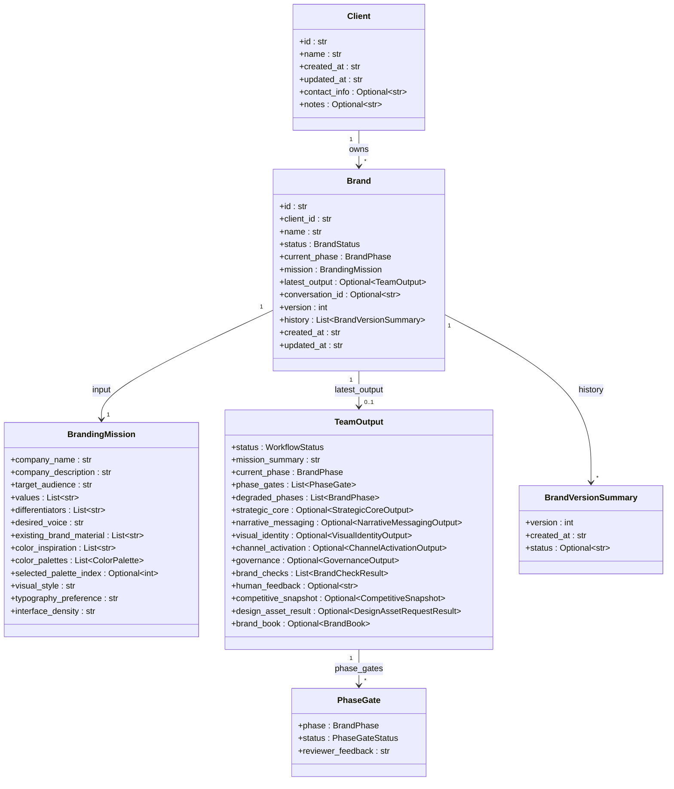
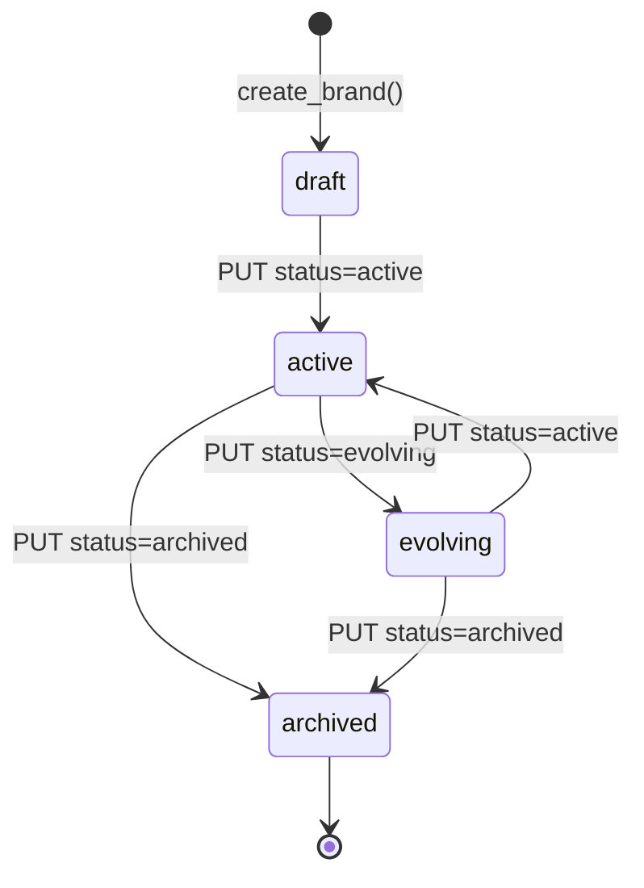
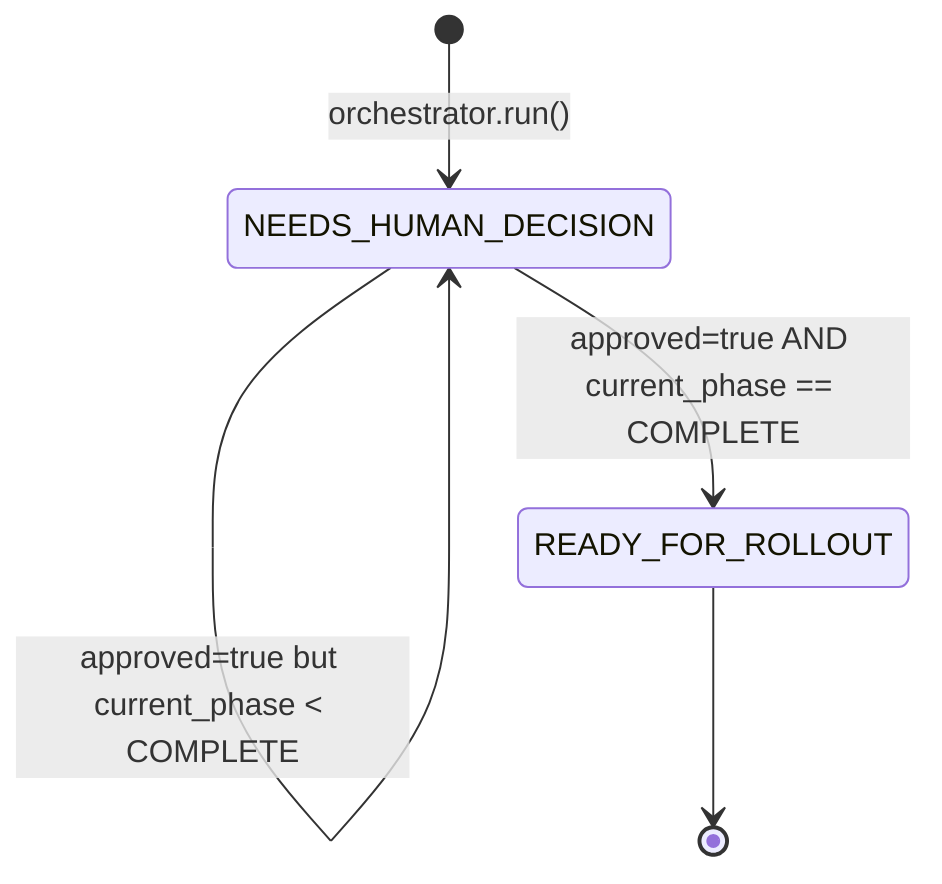
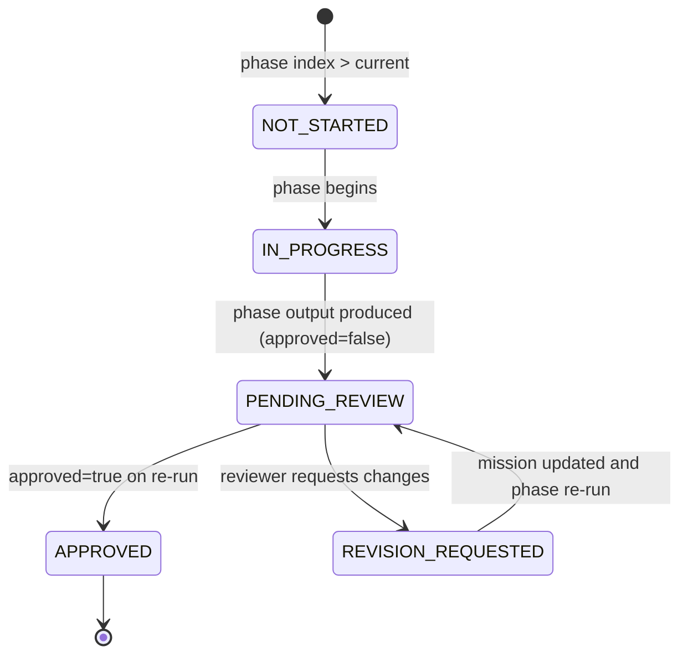

# Branding Team — System Design

This document is the technical reference for the branding team's internals.
It covers the module layout, the domain model, the runtime state machines,
the full API surface, the persistence story, LLM integration, external
adapters, runtime modes, and configuration.

## Module layout

```
backend/agents/branding_team/
├── __init__.py
├── README.md                # User-facing operational reference
├── agents.py                # 5 phase agents + compliance + 5 specialist agents
├── orchestrator.py          # BrandingTeamOrchestrator (run / run_phase / brand book builder)
├── models.py                # All Pydantic models (mission, phase outputs, TeamOutput, Client, Brand)
├── store.py                 # BrandingStore — Postgres-backed client/brand CRUD with version history
├── shared/
│   ├── __init__.py
│   ├── coro_runner.py        # run_coroutine — runs a coroutine from sync code (orchestrator, market_research adapter)
│   ├── job_store.py          # Team's JobServiceClient singleton + guarded RUNNING/COMPLETED/FAILED transition helpers
│   ├── json_recovery.py      # recover_json_object — tolerant JSON recovery; wired into orchestrator.py + assistant/agent.py
│   ├── memoization.py        # phase_input_hash — deterministic per-phase input hash; wired into orchestrator.run(phase_cache=...)
│   └── phase_output_cache.py # PhaseOutputCache — shared.cache-backed phase-output cache; wired into orchestrator.run(phase_cache=...)
├── api/
│   ├── main.py              # FastAPI app-assembly hub + re-exports
│   ├── models.py            # Request/response models
│   ├── state.py             # BrandingSessionStore + mission/question helpers
│   └── routes/              # Per-concern routers: clients, brands, runs, integrations,
│                             # sessions, conversations, health
├── assistant/
│   ├── __init__.py          # Lazy init for BrandingConversationStore singleton
│   ├── agent.py             # BrandingAssistantAgent (LLM-backed conversational flow)
│   ├── prompts.py           # SYSTEM_PROMPT + USER_TURN_TEMPLATE
│   └── store.py             # BrandingConversationStore (messages, mission, latest output)
├── adapters/
│   ├── __init__.py
│   ├── market_research.py   # HTTP adapter to Market Research team
│   └── design_assets.py     # Design service adapter (stub today)
├── postgres/
│   └── __init__.py          # SCHEMA = TeamSchema(...) for shared.postgres
├── temporal/
│   ├── __init__.py          # WORKFLOWS/ACTIVITIES exports + Pattern A auto-boot
│   ├── constants.py         # TASK_QUEUE, WORKFLOW_ID_PREFIX
│   ├── activities.py        # Decomposed Temporal activities (begin/phase/integrations/finalize/fail/cancel)
│   ├── workflows.py         # BrandingWorkflow
│   ├── worker.py            # start_branding_temporal_worker_thread
│   └── start_workflow.py    # start_branding_workflow (sync -> async dispatch)
└── tests/
    ├── _memory_stores.py
    ├── test_api.py
    ├── test_assistant.py
    ├── test_conversation_store.py
    ├── test_memoization.py
    ├── test_memoization_isolation.py
    ├── test_orchestrator.py
    ├── test_phase_output_cache.py
    ├── test_session_store.py
    └── test_store.py
```

## Domain model

The branding team manages three top-level entities and one aggregate output.



**Defined in** `models.py`: `Brand`, `Client`, `BrandingMission`, `TeamOutput`,
`BrandVersionSummary`, `PhaseGate` (class names only, to avoid line-number drift).

Each phase has its own structured output model with rich nested types —
see `models.py:100-362` for the full set of `StrategicCoreOutput`,
`NarrativeMessagingOutput`, `VisualIdentityOutput`,
`ChannelActivationOutput`, and `GovernanceOutput` definitions.

## State machines

### Brand lifecycle

`BrandStatus` is set on `Brand.status` and transitions are driven by the
caller via `PUT /clients/{client_id}/brands/{brand_id}`. Defined at
`models.py:34-38`.



### Workflow status

`WorkflowStatus` (`models.py:41-43`) is set on every `TeamOutput` by the
orchestrator's status determination logic (`orchestrator.py:302-322`).



There is no transition *out* of `READY_FOR_ROLLOUT` inside a single run —
re-running the orchestrator produces a new `TeamOutput` which gets its own
status computed from scratch.

### Phase gate status

`PhaseGateStatus` (`models.py:57-64`) tags each `PhaseGate` entry
inside `TeamOutput.phase_gates`. The orchestrator's
`_build_phase_gates()` helper (`orchestrator.py:69-81`) populates each
phase as:



In the current code path, `_build_phase_gates()` directly emits
`APPROVED` for phases before the target index, `PENDING_REVIEW` or
`APPROVED` for the target index (depending on `approved`), and
`NOT_STARTED` for phases after. `IN_PROGRESS` and
`REVISION_REQUESTED` are part of the enum surface for future use.

## API surface

Endpoints live in `api/routes/*.py` (mounted by `api/main.py`) under
`/api/branding` on the unified API. Three sets of endpoints coexist:

### Agency API — clients, brands, runs, adapters

| Method | Path | Handler | Purpose |
|---|---|---|---|
| POST | `/clients` | `create_client` (`routes/clients.py`) | Create client (201) |
| GET | `/clients` | `list_clients` (`routes/clients.py`) | List all clients |
| GET | `/clients/{client_id}` | `get_client` (`routes/clients.py`) | Get one client (404 if missing) |
| GET | `/clients/{client_id}/brands` | `list_brands` (`routes/brands.py`) | List brands for a client |
| POST | `/clients/{client_id}/brands` | `create_brand` (`routes/brands.py`) | Create brand; auto-attach or create conversation |
| GET | `/clients/{client_id}/brands/{brand_id}` | `get_brand` (`routes/brands.py`) | Get brand incl. `latest_output` and `history` |
| PUT | `/clients/{client_id}/brands/{brand_id}` | `update_brand` (`routes/brands.py`) | Partial mission update or status change |
| GET | `/clients/{client_id}/brands/{brand_id}/conversation` | `get_brand_conversation` (`routes/brands.py`) | Get the single conversation linked to a brand |
| POST | `/clients/{client_id}/brands/{brand_id}/run` | `run_brand` (`routes/runs.py`) | Run orchestrator; append new version |
| POST | `/clients/{client_id}/brands/{brand_id}/run/{phase}` | `run_brand_phase` (`routes/runs.py`) | Run up to a specific `BrandPhase` |
| POST | `/clients/{client_id}/brands/{brand_id}/request-market-research` | `request_market_research_for_brand` (`routes/integrations.py`) | Call Market Research adapter; 503 if unavailable |
| POST | `/clients/{client_id}/brands/{brand_id}/request-design-assets` | `request_design_assets_for_brand` (`routes/integrations.py`) | Call design adapter (stub today) |

### One-shot / session API

| Method | Path | Handler | Purpose |
|---|---|---|---|
| POST | `/run` | `run_branding_team` (`routes/sessions.py`) | Synchronous one-shot; body = `RunBrandingTeamRequest` |
| POST | `/sessions` | `create_branding_session` (`routes/sessions.py`) | Create session with initial run (`approved=false`) |
| GET | `/sessions/{session_id}` | `get_branding_session` (`routes/sessions.py`) | Full session state |
| GET | `/sessions/{session_id}/questions` | `get_branding_questions` (`routes/sessions.py`) | Open questions feed |
| POST | `/sessions/{session_id}/questions/{question_id}/answer` | `answer_branding_question` (`routes/sessions.py`) | Answer one question; mutate mission; re-run orchestrator |

### Conversation (chat) API

| Method | Path | Handler | Purpose |
|---|---|---|---|
| POST | `/conversations` | `create_branding_conversation` (`routes/conversations.py`) | Create conversation; optional initial message + brand_id |
| POST | `/conversations/{conversation_id}/messages` | `send_branding_conversation_message` (`routes/conversations.py`) | Send message; assistant extracts mission updates; may re-run orchestrator |
| GET | `/conversations/{conversation_id}` | `get_branding_conversation` (`routes/conversations.py`) | Get conversation state |
| GET | `/conversations` | `list_branding_conversations` (`routes/conversations.py`) | List conversations, optional `brand_id` filter |
| POST | `/conversations/{conversation_id}/brand` | `attach_conversation_to_brand` (`routes/conversations.py`) | Attach an unattached conversation to a brand |

### Health

| Method | Path | Handler | Purpose |
|---|---|---|---|
| GET | `/health` | `health` (`routes/health.py`) | Liveness probe |

## Persistence

### Why three stores

The team has three distinct persistence concerns and each has its own
Postgres-backed store, all built on `shared.postgres.PostgresHelperMixin`,
which wraps `shared.postgres.get_conn` with `_fetch_one`/`_fetch_all`/`_execute`/
`_transaction` helpers:

1. **Clients + brands + versioned history** — `BrandingStore`
   (`store.py:101`).
2. **Interactive sessions + open question feed** — `BrandingSessionStore`
   (`api/state.py:39`).
3. **Chat conversations + messages + mission + latest output** —
   `BrandingConversationStore` (`assistant/store.py:161`).

Store SQL is exercised against live Postgres via
`shared.postgres.testing.real_postgres_schema` (skip when `POSTGRES_HOST` is
unset): `BrandingStore` in `tests/test_store.py`,
`BrandingConversationStore` in `tests/test_conversation_store.py`, and
`BrandingSessionStore` in `tests/test_session_store.py`. Higher-level API,
assistant, and orchestrator suites use in-memory store doubles from
`tests/_memory_stores.py` instead of live Postgres.

### Postgres schema

`postgres/__init__.py:13-71` declares a pure-data `TeamSchema` with five
tables, all sharing the `branding_` prefix to avoid collisions in the shared
`POSTGRES_DB`:

| Table | Purpose | Columns |
|---|---|---|
| `branding_clients` | Client rows | `id TEXT PK`, `data JSONB`, `created_at` |
| `branding_brands` | Brand rows (indexed on `client_id`) | `id TEXT PK`, `client_id TEXT`, `data JSONB`, `created_at` |
| `branding_sessions` | Session rows | `session_id TEXT PK`, `session_json JSONB`, `updated_at` |
| `branding_conversations` | Conversation headers | `conversation_id TEXT PK`, `brand_id` (unique where not null), `mission_json JSONB`, `latest_output_json JSONB`, `created_at`/`updated_at TIMESTAMPTZ NOT NULL` |
| `branding_conv_messages` | Conversation messages (indexed on `conversation_id`) | `id BIGSERIAL PK`, `conversation_id`, `role`, `content`, `timestamp` |

Clients and brands are stored as JSON-serialized Pydantic models in the
`data` column (`store.py:147` `create_client`, `store.py:270` `create_brand`).
Versions are appended in place — `append_brand_version` (`store.py:399`)
reads the existing brand, increments `version`, appends a
`BrandVersionSummary` to `history`, updates `latest_output`, and re-writes
the row. Reads go through `store.py:125` (`list_clients`) and friends.

`api/main.py` passes `SCHEMA` as `postgres_schema` to `create_team_app`
(`shared/app/factory.py`), whose `_lifespan` hook calls
`register_team_schemas` on it at startup — a no-op when `POSTGRES_HOST`
is not set.

## Memoization primitives

`shared/memoization.py` and `shared/phase_output_cache.py` are a pair of
pure, side-effect-free primitives for detecting when a pipeline phase's
inputs are unchanged from a prior run. As of Story 2b Step 1,
`orchestrator.run()` consumes both (see "Wiring status" below); the
conversation layer does not yet.

### phase_input_hash

`shared/memoization.py:23` — `phase_input_hash(phase, mission,
upstream_outputs) -> str` computes a deterministic SHA-256 digest over a
canonical JSON serialization (`sort_keys=True`) of the phase name, the
full `mission`, and the completed `upstream_outputs`. It hashes the
*entire* mission rather than a per-phase field subset, because
`orchestrator._phase_task` seeds every phase's task with the full
serialized mission unconditionally — there is no per-phase mission-field
subsetting elsewhere in the codebase to mirror. Equal inputs (including
equal-but-distinct instances and different `upstream_outputs` insertion
order) always hash identically; any changed mission field, changed
upstream output field, or added/removed upstream entry changes the
digest. `phase` must be one of the five runnable phases in
`graphs/shared.py:145-151` (`PHASE_ORDER`); `BrandPhase.COMPLETE` raises
`ValueError`.

### PhaseOutputCache

`shared/phase_output_cache.py` — a thin wrapper over
`shared.cache.get_shared_cache("branding:phase:v1")` (Redis when
configured, else in-process memory; see `backend/shared/cache/`), keyed by
`f"{phase.value}:{input_hash}"`. `get(phase, input_hash)` deserializes and
returns the stored output when a live entry exists for that exact `(phase,
input_hash)` pair (a hit); otherwise it returns `None` (a miss) — including
when a stored entry's bytes fail to deserialize, which evicts the corrupt
entry and is treated as a miss rather than raising. `put(phase, input_hash,
output)` serializes `output` via `model_dump_json()` and stores it, bounded
by the shared backend's LRU (`max_entries=64`). Because keys are
content-addressed, a `put` under a new hash does not evict the same
phase's entry under a different (e.g. stale) hash — both remain
independently addressable until the LRU or `clear_phase_output_cache()`
drops them. Like `phase_input_hash`, both `get`/`put` reject
`BrandPhase.COMPLETE` with `ValueError`. Storage is a process-wide
singleton per namespace (shared by every `PhaseOutputCache` instance in
the process, not private per instance); the cache performs no LLM side
effects, and every `shared.cache` operation is fail-open (a backend outage
degrades to a miss/no-op, never an exception).

### Wiring status

`orchestrator.py` is wired: `run()` accepts an optional `phase_cache:
PhaseOutputCache` (`orchestrator.py:568`). When it's `None` (the default),
`run()` is unchanged — one monolithic `build_branding_graph` invocation
covering every phase up to `target_phase`, exactly as before this
parameter existed. When a `phase_cache` is supplied, `run()` instead calls
`_run_phases_with_cache()` (`orchestrator.py:681`), which walks
`PHASE_ORDER` one phase at a time: for each phase it computes
`phase_input_hash(phase, mission, upstream_outputs)` from the mission and
every upstream output produced so far *this call* (cache hits or fresh
runs), checks it against `phase_cache.get()`, and on a hit reuses the
cached output without invoking the phase. On a miss it runs the phase via
`run_single_phase()` (the same per-phase isolation `run_single_phase()` has
always used for Temporal activities) and, only if the result isn't
degraded, stores it with `phase_cache.put()` — a degraded output is never
cached, so a transient parse failure can't poison a later call. Because
each phase's hash always reflects the upstream outputs actually used this
call, a changed upstream phase naturally invalidates every downstream
phase's cached entry without any separate invalidation step.

The conversation layer (`api/conversation.py`,
`api/routes/conversations.py`, `assistant/agent.py`, `assistant/store.py`,
`assistant/prompts.py`) remains unwired — no caller yet constructs or
threads a `PhaseOutputCache` through a session (that's Story 2c).
`tests/test_memoization_isolation.py` still enforces this structurally for
those five files (it no longer guards `orchestrator.py`, which is
deliberately wired) — it parses each file's source with `ast` and fails if
either symbol appears, so a future change that wires the cache into the
conversation layer must update this test deliberately rather than regress
it silently. Recomputing only from the *earliest* changed phase (skipping
graph-build work for untouched trailing phases) and persisting a
`phase_cache` across interactive re-runs are separate, later steps of
Story 2b/2c — this step only establishes the per-phase hit/miss check.

## LLM integration

The conversational `BrandingAssistantAgent` and all five pipeline phase
agents are LLM-backed. Phase agents are `strands.Agent` instances built by
`graphs/shared.py:build_agent()`, which wires each one to the centralized
LLM service via `get_strands_model()`. Only `BrandComplianceAgent` is
deterministic post-processing (regex-based brand checks) and does not call
an LLM.

**Initialization** (`assistant/agent.py:129-135`) happens lazily:

```python
def __init__(self, llm=None):
    if llm is None:
        from llm_service import get_client
        self._llm = get_client("branding_assistant")
    else:
        self._llm = llm
```

The FastAPI app wraps this in a second layer of laziness
(`api/main.py:72-83`): `assistant_agent` starts as `None`, and
`_get_assistant_agent()` only imports the real agent on first
conversation request. If construction fails, the handler returns HTTP
503 `"Branding assistant is temporarily unavailable"` instead of
crashing the app — so the rest of the team's endpoints remain usable
even when `llm_service` is not configured.

**LLM call** (`assistant/agent.py:181-195`):

```python
try:
    raw = self._llm.complete(
        prompt,
        temperature=0.5,
        system_prompt=SYSTEM_PROMPT,
        think=True,
    )
except Exception:
    reply_text = "I'm here to help build your brand. Could you tell me your company name and what you do?"
    suggested_questions = [...]
    return reply_text, current_mission, suggested_questions
```

**Response parsing** (`assistant/agent.py:14-66`) extracts three things
from the raw completion:

1. The natural-language reply text shown to the user.
2. A structured `mission` JSON block (in ```` ```mission ```` or
   ```` ```json ```` ) that gets merged into `BrandingMission` via
   `_merge_mission_update` (`assistant/agent.py:69-123`).
3. A `suggestions` array (in ```` ```suggestions ```` ) that becomes
   `ConversationStateResponse.suggested_questions`.

The `SYSTEM_PROMPT` in `assistant/prompts.py:11-99` instructs the LLM
to play brand strategist, follow the 5-phase framework, and emit the
mission + suggestions blocks.

## External integration contracts

### Market research

`adapters/market_research.py:17-50` POSTs to
`{base}/api/market-research/market-research/run` where `base` is
`UNIFIED_API_BASE_URL` or `BRANDING_MARKET_RESEARCH_URL`. Request body:

```json
{
  "product_concept": "Competitive and similar brands for {company_name}: {company_description}",
  "target_users": "{target_audience}",
  "business_goal": "Differentiate and position brand. Key differentiators: {diffs}",
  "human_approved": true,
  "human_feedback": "Branding team requested competitive snapshot."
}
```

The HTTP client has a 120-second timeout
(`adapters/market_research.py:41-45`). `_map_to_competitive_snapshot`
(`adapters/market_research.py:53-74`) rolls the Market Research
`TeamOutput` into a `CompetitiveSnapshot` with:

- `summary` from `mission_summary` or `recommendation.verdict`
- `similar_brands` from `market_signals[].signal` (capped at 20)
- `insights` from `recommendation.rationale` + `insights[].pain_points`
  (capped at 30)
- `source = "market_research_team"`

Errors (HTTP / timeout / parsing) are wrapped into a `RuntimeError`
which `orchestrator.run()` swallows to `None`
(`orchestrator.py:273-280`), while the direct endpoint
`request_market_research_for_brand` converts them to HTTP 503
(`api/main.py:659-662`).

### Design assets

`adapters/design_assets.py:16-37` is a deliberate stub. It reads
`BRANDING_DESIGN_SERVICE_URL` (or falls back to `UNIFIED_API_BASE_URL`)
but never actually POSTs — instead it always returns a
`DesignAssetRequestResult` with `status="pending"` and a placeholder
`artifacts` list describing the brand direction. This lets callers wire
the feature flag today and swap in a real design service later without
changing the orchestrator or API.

## Runtime modes

### Thread mode (default)

When `TEMPORAL_ADDRESS` is not set, `BrandingTeamOrchestrator` is a
plain Python class called synchronously from the FastAPI handlers
(`api/main.py:65`). Every phase agent runs in the request thread and is
LLM-backed via Strands; wall-clock time depends on the configured provider.

### Temporal mode (optional)

When `TEMPORAL_ADDRESS` is set, the async branding-run dispatch path
(`_submit_brand_run` in `api/main.py`) routes through Temporal instead of
the in-process thread pool. The `temporal/` package defines:

- Decomposed activities in `activities.py` that the durable
  `BrandingWorkflow` drives one at a time so a worker restart re-runs only
  the unfinished unit:
  - `begin_branding_job_activity` — mark the job RUNNING (returns false if
    already cancelled)
  - `run_branding_phase_activity` — run one pipeline phase via
    `orchestrator.run_single_phase`, with checkpointing
  - `run_market_research_activity` / `run_design_assets_activity` — optional
    sibling-team integrations
  - `finalize_branding_activity` — compliance + assemble `TeamOutput` +
    persist brand version + mark COMPLETED
  - `mark_branding_failed_activity` — record a FAILED job row
  - `check_branding_cancelled_activity` — cooperative between-phase cancel
- `BrandingWorkflow` — the durable workflow (id `branding-{job_id}`) that
  sequences those activities with per-activity timeouts and cooperative
  cancel checks between phases.
- `start_branding_workflow(job_id, payload)` — the sync → async bridge the
  API handler calls to start the workflow (fire-and-forget; the client polls
  `GET /branding/status/{job_id}`).

The worker boots two idempotent ways (Pattern A): on import when
`is_temporal_enabled()` returns true
(`start_team_worker("branding", WORKFLOWS, ACTIVITIES, task_queue="branding-queue")`),
and via the `team_service` entrypoint through
`TEAM_TEMPORAL_WORKER_MODULE=branding_team.temporal.worker` /
`TEAM_TEMPORAL_WORKER_FUNC=start_branding_temporal_worker_thread`. When
`TEMPORAL_ADDRESS` is unset, the thread-pool path is used and behavior is
unchanged.

## Configuration reference

### Environment variables

| Variable | Consumer | Default | Purpose |
|---|---|---|---|
| `UNIFIED_API_BASE_URL` | `adapters/market_research.py:14`, `adapters/design_assets.py:13` | unset | Base URL for sibling team API calls |
| `BRANDING_MARKET_RESEARCH_URL` | `adapters/market_research.py:14` | unset | Explicit override for Market Research base URL |
| `BRANDING_DESIGN_SERVICE_URL` | `adapters/design_assets.py:13` | unset | Reserved for the future design service |
| `POSTGRES_HOST` / `POSTGRES_DB` / ... | `shared.postgres` via `api/main.py:48-50` | unset | When set, the Postgres schema is registered at startup |
| `TEMPORAL_ADDRESS` | `temporal/__init__.py` (via `shared.temporal.is_temporal_enabled`) | unset | When set, Temporal worker is registered on import |
| `LLM_PROVIDER`, `LLM_BASE_URL`, `LLM_MODEL` | `llm_service` via `assistant/agent.py:131` | provider-specific | Used by the conversational assistant |

### Unified API config entry

`backend/unified_api/config.py:88-95`:

```python
"branding": TeamConfig(
    name="Branding",
    prefix="/api/branding",
    description="Brand strategy, moodboards, design and writing standards",
    tags=["branding", "design"],
    cell="content",
    timeout_seconds=120.0,
),
```

The 120-second timeout matches the Market Research adapter's HTTP timeout
so a brand run that includes `include_market_research=True` can still
complete within the gateway budget.
