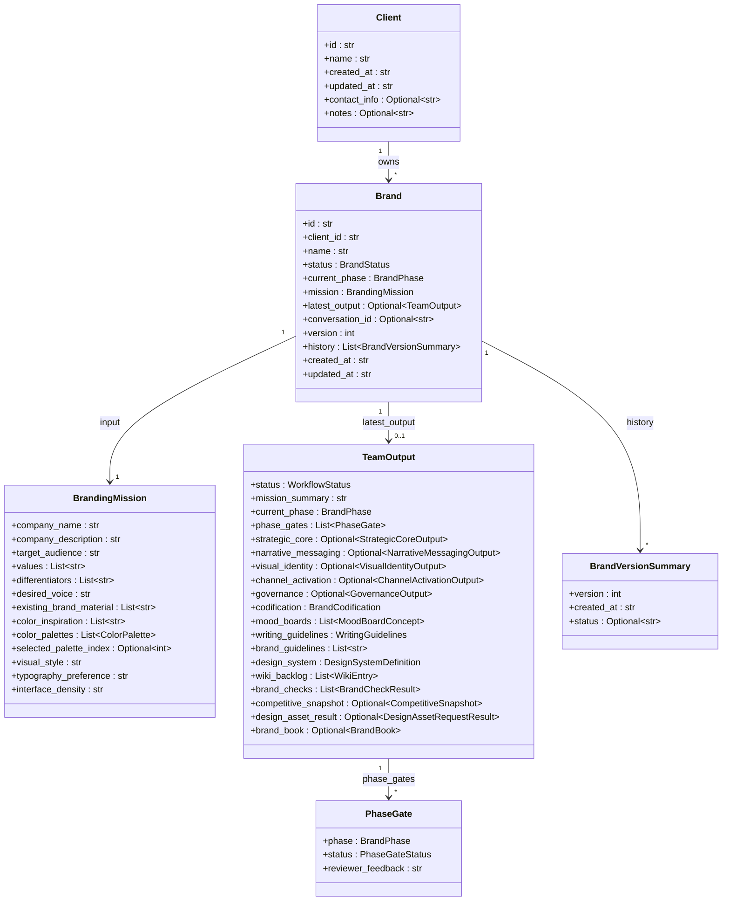
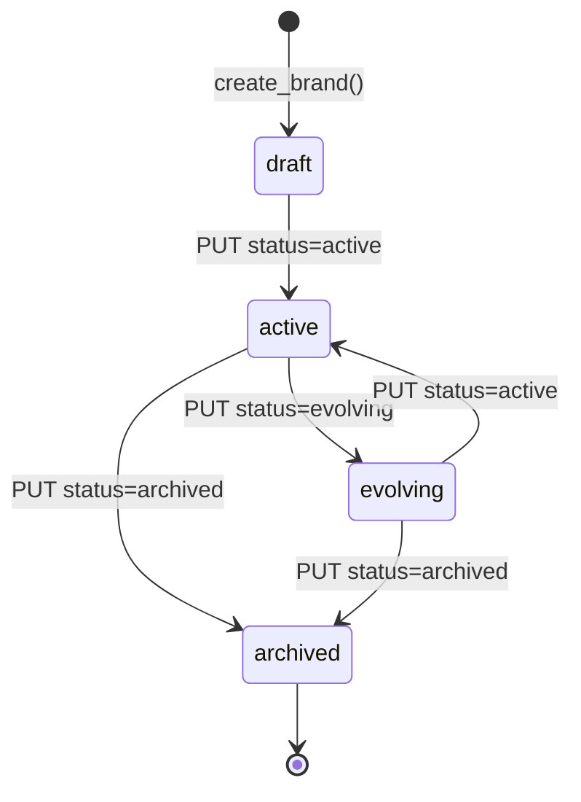
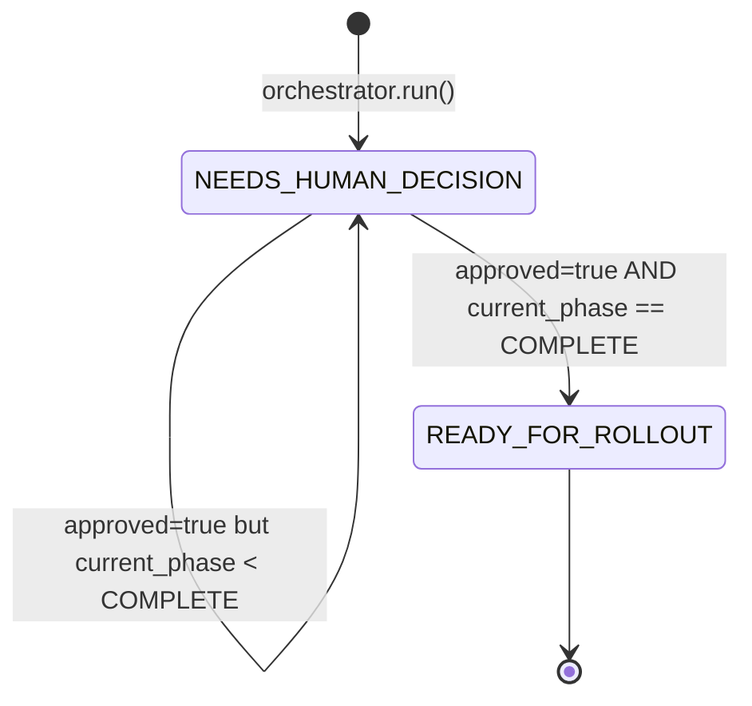
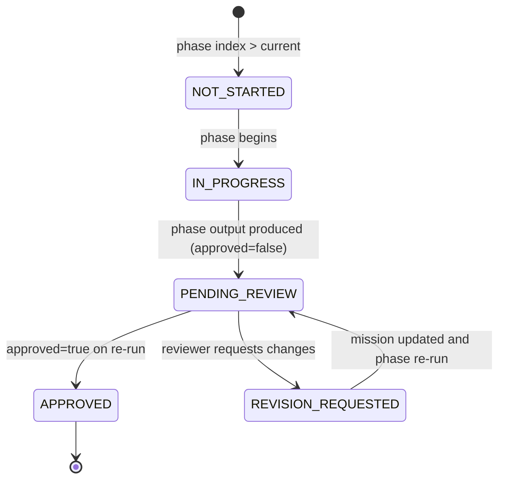

# Branding Team — System Design

This document is the technical reference for the branding team's internals.
It covers the module layout, the domain model, the runtime state machines,
the full API surface, the persistence story, LLM integration, external
adapters, runtime modes, and configuration.

## Module layout

```
backend/agents/branding_team/
├── __init__.py
├── README.md                # User-facing operational reference
├── agents.py                # 5 phase agents + compliance + 5 specialist agents
├── orchestrator.py          # BrandingTeamOrchestrator (run / run_phase / brand book builder)
├── models.py                # All Pydantic models (mission, phase outputs, TeamOutput, Client, Brand)
├── store.py                 # BrandingStore — Postgres-backed client/brand CRUD with version history
├── _db.py                   # PostgresHelperMixin — shared fetch/execute helpers over shared.postgres.get_conn
├── api/
│   └── main.py              # FastAPI app, request models, session store, route handlers
├── assistant/
│   ├── __init__.py          # Lazy init for BrandingConversationStore singleton
│   ├── agent.py             # BrandingAssistantAgent (LLM-backed conversational flow)
│   ├── prompts.py           # SYSTEM_PROMPT + USER_TURN_TEMPLATE
│   └── store.py             # BrandingConversationStore (messages, mission, latest output)
├── adapters/
│   ├── __init__.py
│   ├── market_research.py   # HTTP adapter to Market Research team
│   └── design_assets.py     # Design service adapter (stub today)
├── postgres/
│   └── __init__.py          # SCHEMA = TeamSchema(...) for shared.postgres
├── temporal/
│   ├── __init__.py          # WORKFLOWS/ACTIVITIES exports + Pattern A auto-boot
│   ├── constants.py         # TASK_QUEUE, WORKFLOW_ID_PREFIX
│   ├── activities.py        # run_branding_pipeline_activity
│   ├── workflows.py         # BrandingWorkflow
│   ├── worker.py            # start_branding_temporal_worker_thread
│   └── start_workflow.py    # start_branding_workflow (sync -> async dispatch)
└── tests/
    ├── test_api.py
    ├── test_assistant.py
    ├── test_orchestrator.py
    └── test_store.py
```

## Domain model

The branding team manages three top-level entities and one aggregate output.



**Defined in** `models.py:514-528` (Brand), `models.py:23-31` (Client),
`models.py:76-91` (BrandingMission), `models.py:471-498` (TeamOutput),
`models.py:506-511` (BrandVersionSummary), `models.py:370-375` (PhaseGate).

Each phase has its own structured output model with rich nested types —
see `models.py:100-362` for the full set of `StrategicCoreOutput`,
`NarrativeMessagingOutput`, `VisualIdentityOutput`,
`ChannelActivationOutput`, and `GovernanceOutput` definitions.

## State machines

### Brand lifecycle

`BrandStatus` is set on `Brand.status` and transitions are driven by the
caller via `PUT /clients/{client_id}/brands/{brand_id}`. Defined at
`models.py:34-38`.



### Workflow status

`WorkflowStatus` (`models.py:41-43`) is set on every `TeamOutput` by the
orchestrator's status determination logic (`orchestrator.py:302-322`).



There is no transition *out* of `READY_FOR_ROLLOUT` inside a single run —
re-running the orchestrator produces a new `TeamOutput` which gets its own
status computed from scratch.

### Phase gate status

`PhaseGateStatus` (`models.py:57-64`) tags each `PhaseGate` entry
inside `TeamOutput.phase_gates`. The orchestrator's
`_build_phase_gates()` helper (`orchestrator.py:69-81`) populates each
phase as:



In the current code path, `_build_phase_gates()` directly emits
`APPROVED` for phases before the target index, `PENDING_REVIEW` or
`APPROVED` for the target index (depending on `approved`), and
`NOT_STARTED` for phases after. `IN_PROGRESS` and
`REVISION_REQUESTED` are part of the enum surface for future use.

## API surface

All endpoints live in `api/main.py` and mount under `/api/branding` on
the unified API. Three sets of endpoints coexist:

### Agency API — clients, brands, runs, adapters

| Method | Path | Handler (`api/main.py`) | Purpose |
|---|---|---|---|
| POST | `/clients` | `create_client` (L445) | Create client (201) |
| GET | `/clients` | `list_clients` (L454) | List all clients |
| GET | `/clients/{client_id}` | `get_client` (L459) | Get one client (404 if missing) |
| GET | `/clients/{client_id}/brands` | `list_brands` (L472) | List brands for a client |
| POST | `/clients/{client_id}/brands` | `create_brand` (L479) | Create brand; auto-attach or create conversation |
| GET | `/clients/{client_id}/brands/{brand_id}` | `get_brand` (L515) | Get brand incl. `latest_output` and `history` |
| PUT | `/clients/{client_id}/brands/{brand_id}` | `update_brand` (L523) | Partial mission update or status change |
| GET | `/clients/{client_id}/brands/{brand_id}/conversation` | `get_brand_conversation` (L577) | Get the single conversation linked to a brand |
| POST | `/clients/{client_id}/brands/{brand_id}/run` | `run_brand` (L597) | Run orchestrator; append new version |
| POST | `/clients/{client_id}/brands/{brand_id}/run/{phase}` | `run_brand_phase` (L617) | Run up to a specific `BrandPhase` |
| POST | `/clients/{client_id}/brands/{brand_id}/request-market-research` | `request_market_research_for_brand` (L647) | Call Market Research adapter; 503 if unavailable |
| POST | `/clients/{client_id}/brands/{brand_id}/request-design-assets` | `request_design_assets_for_brand` (L666) | Call design adapter (stub today) |

### One-shot / session API

| Method | Path | Handler | Purpose |
|---|---|---|---|
| POST | `/run` | `run_branding_team` (L685) | Synchronous one-shot; body = `RunBrandingTeamRequest` |
| POST | `/sessions` | `create_branding_session` (L716) | Create session with initial run (`approved=false`) |
| GET | `/sessions/{session_id}` | `get_branding_session` (L739) | Full session state |
| GET | `/sessions/{session_id}/questions` | `get_branding_questions` (L747) | Open questions feed |
| POST | `/sessions/{session_id}/questions/{question_id}/answer` | `answer_branding_question` (L755) | Answer one question; mutate mission; re-run orchestrator |

### Conversation (chat) API

| Method | Path | Handler | Purpose |
|---|---|---|---|
| POST | `/conversations` | `create_branding_conversation` (L813) | Create conversation; optional initial message + brand_id |
| POST | `/conversations/{conversation_id}/messages` | `send_branding_conversation_message` (L902) | Send message; assistant extracts mission updates; may re-run orchestrator |
| GET | `/conversations/{conversation_id}` | `get_branding_conversation` (L949) | Get conversation state |
| GET | `/conversations` | `list_branding_conversations` (L961) | List conversations, optional `brand_id` filter |
| POST | `/conversations/{conversation_id}/brand` | `attach_conversation_to_brand` (L983) | Attach an unattached conversation to a brand |

### Health

| Method | Path | Handler | Purpose |
|---|---|---|---|
| GET | `/health` | `health` (L1005) | Liveness probe |

## Persistence

### Why three stores

The team has three distinct persistence concerns and each has its own
Postgres-backed store, all built on `PostgresHelperMixin` (`_db.py`), which
wraps `shared.postgres.get_conn` with `_fetch_one`/`_fetch_all`/`_execute`/
`_transaction` helpers:

1. **Clients + brands + versioned history** — `BrandingStore`
   (`store.py:101`).
2. **Interactive sessions + open question feed** — `BrandingSessionStore`
   (`api/state.py:39`).
3. **Chat conversations + messages + mission + latest output** —
   `BrandingConversationStore` (`assistant/store.py:161`).

Unit tests run against `tests/_fake_postgres.py`, an in-memory fake that
matches the SQL emitted by each store by prefix, so the test suites stay
independent without a live database. `real_postgres`-marked tests
(`tests/test_store_real_postgres.py`) exercise `BrandingStore`'s and
`BrandingConversationStore`'s SQL against a live Postgres instance in CI, so
the fake can't silently drift from what the real database accepts for those
two stores. `BrandingSessionStore`'s create/get/save queries are currently
validated only against the fake — that table is truncated for isolation but
its own queries aren't exercised live.

### Postgres schema

`postgres/__init__.py:13-71` declares a pure-data `TeamSchema` with five
tables, all sharing the `branding_` prefix to avoid collisions in the shared
`POSTGRES_DB`:

| Table | Purpose | Columns |
|---|---|---|
| `branding_clients` | Client rows | `id TEXT PK`, `data JSONB`, `created_at` |
| `branding_brands` | Brand rows (indexed on `client_id`) | `id TEXT PK`, `client_id TEXT`, `data JSONB`, `created_at` |
| `branding_sessions` | Session rows | `session_id TEXT PK`, `session_json JSONB`, `updated_at` |
| `branding_conversations` | Conversation headers | `conversation_id TEXT PK`, `brand_id` (unique where not null), `mission_json JSONB`, `latest_output_json JSONB` |
| `branding_conv_messages` | Conversation messages (indexed on `conversation_id`) | `id BIGSERIAL PK`, `conversation_id`, `role`, `content`, `timestamp` |

Clients and brands are stored as JSON-serialized Pydantic models in the
`data` column (`store.py:147` `create_client`, `store.py:270` `create_brand`).
Versions are appended in place — `append_brand_version` (`store.py:399`)
reads the existing brand, increments `version`, appends a
`BrandVersionSummary` to `history`, updates `latest_output`, and re-writes
the row. Reads go through `store.py:125` (`list_clients`) and friends.

The `_lifespan` hook in `api/main.py` calls
`register_team_schemas(SCHEMA)` at startup, which is a no-op when
`POSTGRES_HOST` is not set.

## LLM integration

Only the `BrandingAssistantAgent` touches the shared LLM client. Everything
else in the pipeline (phase agents, compliance agent, specialist agents) is
deterministic Python code — they do not call LLMs today.

**Initialization** (`assistant/agent.py:129-135`) happens lazily:

```python
def __init__(self, llm=None):
    if llm is None:
        from llm_service import get_client
        self._llm = get_client("branding_assistant")
    else:
        self._llm = llm
```

The FastAPI app wraps this in a second layer of laziness
(`api/main.py:72-83`): `assistant_agent` starts as `None`, and
`_get_assistant_agent()` only imports the real agent on first
conversation request. If construction fails, the handler returns HTTP
503 `"Branding assistant is temporarily unavailable"` instead of
crashing the app — so the rest of the team's endpoints remain usable
even when `llm_service` is not configured.

**LLM call** (`assistant/agent.py:181-195`):

```python
try:
    raw = self._llm.complete(
        prompt,
        temperature=0.5,
        system_prompt=SYSTEM_PROMPT,
        think=True,
    )
except Exception:
    reply_text = "I'm here to help build your brand. Could you tell me your company name and what you do?"
    suggested_questions = [...]
    return reply_text, current_mission, suggested_questions
```

**Response parsing** (`assistant/agent.py:14-66`) extracts three things
from the raw completion:

1. The natural-language reply text shown to the user.
2. A structured `mission` JSON block (in ```` ```mission ```` or
   ```` ```json ```` ) that gets merged into `BrandingMission` via
   `_merge_mission_update` (`assistant/agent.py:69-123`).
3. A `suggestions` array (in ```` ```suggestions ```` ) that becomes
   `ConversationStateResponse.suggested_questions`.

The `SYSTEM_PROMPT` in `assistant/prompts.py:11-99` instructs the LLM
to play brand strategist, follow the 5-phase framework, and emit the
mission + suggestions blocks.

## External integration contracts

### Market research

`adapters/market_research.py:17-50` POSTs to
`{base}/api/market-research/market-research/run` where `base` is
`UNIFIED_API_BASE_URL` or `BRANDING_MARKET_RESEARCH_URL`. Request body:

```json
{
  "product_concept": "Competitive and similar brands for {company_name}: {company_description}",
  "target_users": "{target_audience}",
  "business_goal": "Differentiate and position brand. Key differentiators: {diffs}",
  "human_approved": true,
  "human_feedback": "Branding team requested competitive snapshot."
}
```

The HTTP client has a 120-second timeout
(`adapters/market_research.py:41-45`). `_map_to_competitive_snapshot`
(`adapters/market_research.py:53-74`) rolls the Market Research
`TeamOutput` into a `CompetitiveSnapshot` with:

- `summary` from `mission_summary` or `recommendation.verdict`
- `similar_brands` from `market_signals[].signal` (capped at 20)
- `insights` from `recommendation.rationale` + `insights[].pain_points`
  (capped at 30)
- `source = "market_research_team"`

Errors (HTTP / timeout / parsing) are wrapped into a `RuntimeError`
which `orchestrator.run()` swallows to `None`
(`orchestrator.py:273-280`), while the direct endpoint
`request_market_research_for_brand` converts them to HTTP 503
(`api/main.py:659-662`).

### Design assets

`adapters/design_assets.py:16-37` is a deliberate stub. It reads
`BRANDING_DESIGN_SERVICE_URL` (or falls back to `UNIFIED_API_BASE_URL`)
but never actually POSTs — instead it always returns a
`DesignAssetRequestResult` with `status="pending"` and a placeholder
`artifacts` list describing the brand direction. This lets callers wire
the feature flag today and swap in a real design service later without
changing the orchestrator or API.

## Runtime modes

### Thread mode (default)

When `TEMPORAL_ADDRESS` is not set, `BrandingTeamOrchestrator` is a
plain Python class called synchronously from the FastAPI handlers
(`api/main.py:65`). Every phase agent runs in the request thread.
Most runs complete in seconds because the phase agents are deterministic
template expansion, not LLM calls.

### Temporal mode (optional)

When `TEMPORAL_ADDRESS` is set, the async branding-run dispatch path
(`_submit_brand_run` in `api/main.py`) routes through Temporal instead of
the in-process thread pool. The `temporal/` package defines:

- `run_branding_pipeline_activity(payload: dict)` — a Temporal activity that
  rehydrates the job's `BrandingMission` / `HumanReview` / brand checks from a
  JSON-safe payload and delegates to the existing `_run_branding_background`
  job function, so the Temporal path and the thread path run the identical
  pipeline body and share the same job-store bookkeeping.
- `BrandingWorkflow` — a single-activity Temporal workflow (id
  `branding-{job_id}`) whose `run()` forwards the payload to the activity with
  a 2-hour `start_to_close_timeout` and no app-level retries.
- `start_branding_workflow(job_id, payload)` — the sync -> async bridge the API
  handler calls to start the workflow (fire-and-forget; the client polls
  `GET /branding/status/{job_id}`).

The worker boots two idempotent ways (Pattern A): on import when
`is_temporal_enabled()` returns true
(`start_team_worker("branding", WORKFLOWS, ACTIVITIES, task_queue="branding-queue")`),
and via the `team_service` entrypoint through
`TEAM_TEMPORAL_WORKER_MODULE=branding_team.temporal.worker` /
`TEAM_TEMPORAL_WORKER_FUNC=start_branding_temporal_worker_thread`. When
`TEMPORAL_ADDRESS` is unset, the thread-pool path is used and behavior is
unchanged.

## Configuration reference

### Environment variables

| Variable | Consumer | Default | Purpose |
|---|---|---|---|
| `UNIFIED_API_BASE_URL` | `adapters/market_research.py:14`, `adapters/design_assets.py:13` | unset | Base URL for sibling team API calls |
| `BRANDING_MARKET_RESEARCH_URL` | `adapters/market_research.py:14` | unset | Explicit override for Market Research base URL |
| `BRANDING_DESIGN_SERVICE_URL` | `adapters/design_assets.py:13` | unset | Reserved for the future design service |
| `POSTGRES_HOST` / `POSTGRES_DB` / ... | `shared.postgres` via `api/main.py:48-50` | unset | When set, the Postgres schema is registered at startup |
| `TEMPORAL_ADDRESS` | `temporal/__init__.py` (via `shared.temporal.is_temporal_enabled`) | unset | When set, Temporal worker is registered on import |
| `LLM_PROVIDER`, `LLM_BASE_URL`, `LLM_MODEL` | `llm_service` via `assistant/agent.py:131` | provider-specific | Used by the conversational assistant |

### Unified API config entry

`backend/unified_api/config.py:88-95`:

```python
"branding": TeamConfig(
    name="Branding",
    prefix="/api/branding",
    description="Brand strategy, moodboards, design and writing standards",
    tags=["branding", "design"],
    cell="content",
    timeout_seconds=120.0,
),
```

The 120-second timeout matches the Market Research adapter's HTTP timeout
so a brand run that includes `include_market_research=True` can still
complete within the gateway budget.
