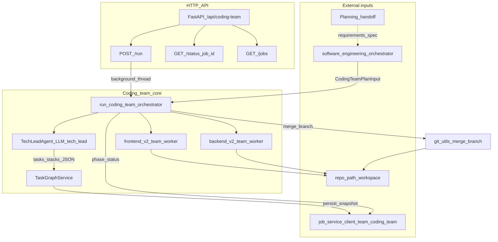
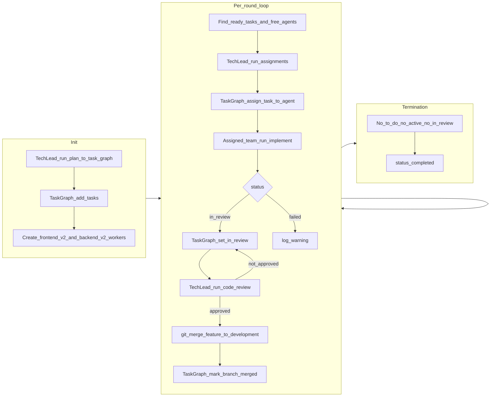

# Coding Team

The **coding_team** is a **sub-team of the Software Engineering team**. It implements the main implementation path after planning: the SE orchestrator hands off to it; it receives the adapted plan from Planning, generates a Task Graph, and executes work through a Tech Lead plus the `frontend_v2` and `backend_v2` implementation teams. The public API remains at `/api/coding-team` for direct jobs and health checks; logically it sits under Software Engineering in the platform hierarchy.

## Architecture (Mermaid)

### Components and data flow



### Execution loop inside the orchestrator

Phases: `task_graph` → `coding` → `completed`. The orchestrator runs up to many rounds until no `to_do` tasks remain, no agent holds an active task, and nothing is `in_review`.



## Structure

| Component | Role |
|-----------|------|
| **Tech Lead** | Receives plan from Planning team; generates Task Graph (tasks + dependencies); defines implementation teams/stacks; routes tasks to the best available agent/team; code review, UAT, security review; merges approved feature branches; sends rejected work back to the producing team with feedback. |
| **frontend_v2 team** | Owns front-end tasks (Angular, TypeScript, React, CSS/SCSS, HTML, UI/UX, accessibility, state management, browser clients). Runs its own v2 planning/execution/review loop, commits a feature branch, and returns that branch plus a summary to the coding Tech Lead. |
| **backend_v2 team** | Owns backend/platform tasks (Java, Python, Node.js, databases, APIs, DevOps/infrastructure-adjacent implementation, servers, containers, CI/CD). Runs its own v2 planning/execution/review loop, commits a feature branch, and returns that branch plus a summary to the coding Tech Lead. |
| **Task Graph** | Stores tasks and dependencies per job. Tech Lead adds/updates tasks and assigns; v2 implementation workers request their assigned task. Enforces one active task per worker and "next task only after merge." |

## Task Graph semantics

- **Tasks** have id, title, description, dependencies, status (e.g. To Do, in_progress, in_review, merged), assigned_agent_id, target_team, feature_branch, merged_at, acceptance_criteria, out_of_scope, priority, and optional **subtasks** (with subtask dependencies).
- **Assign** task T to agent A: allowed only if A has no current task or A's current task has status merged, and T's dependencies are satisfied (all dependency tasks merged).
- **target_team** routes implementation: `frontend_v2` tasks go to the frontend v2 team and `backend_v2` tasks go to the backend v2 team. The scheduler rejects mismatched assignments and falls back to a matching free v2 worker when the Tech Lead output already labeled the target team.
- **Get task for agent A**: returns the single task assigned to A that is not merged (in_progress or in_review).
- **Mark branch merged** for task T: set T.status = merged, T.merged_at = now; agent A is then free for next assignment.

## One task per agent / new task only after merge

- Each v2 implementation worker has at most one **active** (non-merged) task at a time.
- The Tech Lead (or orchestrator) assigns a **new** task to an agent only after that agent's current task's feature branch has been **merged** into the development branch. The Task Graph and orchestrator enforce this via state.

## Package layout

- `models.py` – Pydantic models (StackSpec, Task, CodingTeamPlanInput, job state).
- `task_graph.py` – Task Graph service (per-job; add_task, assign_task_to_agent, get_task_for_agent, mark_branch_merged, etc.).
- `tech_lead_agent/` – Tech Lead agent (prompts, agent class): plan → Task Graph + stacks; grooming; assignments; review/merge.
- `v2_team_worker.py` – Adapter that lets the coding team call the frontend/backend v2 teams and receive branch handoffs for Tech Lead review.
- `orchestrator.py` – Coordinates Tech Lead and v2 implementation workers; init (plan → Task Graph, create v2 workers), loop (assign → implement → review → merge).
- `api/main.py` – FastAPI: POST /run, GET /status/{job_id}, GET /jobs.
- Job store uses the same pattern as software_engineering_team: `JobServiceClient(team="coding_team")` from `job_service_client`.

## Process flows

- **Tech Lead**: Get next task from backlog → Groom task (acceptance criteria, out of scope, context from specs/plans, subtasks, priority, dependencies) → Update to To Do → Assign to team member → repeat until backlog groomed. See plan section 2a.
- **frontend_v2 / backend_v2 teams**: Receive one coding-team task → Run their internal v2 team workflow → Commit a feature branch without merging it → Send branch + change summary back to the coding Tech Lead. If the Tech Lead rejects the branch, the same assigned v2 team receives the rejection feedback in its next task prompt and must summarize how the feedback was addressed.

## GitHub-issue-driven runs

In addition to the planning-team handoff path (`POST /run`), the team accepts work directly from GitHub issues via `POST /run-from-github`. The endpoint reads open issues from the target repo, picks the first whose **GitHub native sub-issues** are all closed, runs the issue through the Tech Lead → v2 team pipeline on a stable per-issue branch (`khala/issue-<num>`), and reports back on the issue thread.

### Request

```http
POST /api/coding-team/run-from-github
Content-Type: application/json

{
  "owner": "your-org",
  "repo": "your-repo",
  "repo_path": "/abs/path/to/local/checkout",
  "label": "agent-ready",          // optional issue-label filter
  "issue_number": 123,              // optional: verify a specific issue
  "github_token": "...",           // optional: overrides GITHUB_TOKEN env
  "base_branch": "main",           // optional: defaults to repo default branch
  "remote": "origin"               // optional
}
```

Response:

```json
{ "job_id": "...", "issue_number": 7, "issue_url": "https://github.com/...", "status": "pending" }
```

Poll `GET /status/{job_id}` to follow progress; the response includes `github_context` and `github_pr_url` once the PR is opened.

### Dependency model

An issue is **ready** iff it has zero open sub-issues (the official GitHub sub-issues API). Repos that don't use sub-issues treat every open issue as ready. Other conventions (task lists, "depends on #N" body text) are out of scope for now.

### What the team writes back

1. A `Coding team started job <id>` comment on the issue when work begins.
2. A draft PR with `Closes #<num>` against the repo's default branch when work succeeds.
3. A `Draft PR opened: <url>` comment (or `Reusing existing draft PR: <url>` on retry).

If anything fails — branch prep, the orchestrator, fast-forward, or push — the failure is recorded on the job's `error` field and a best-effort comment is posted on the issue.

### Required configuration

| Env var | Purpose |
|---|---|
| `GITHUB_TOKEN` | Fallback when no `github_token` is in the body. Needs `Issues: read/write`, `Pull requests: read/write`, `Contents: read/write`, `Metadata: read` (or classic `repo`). |
| `GITHUB_API_URL` | Optional. Defaults to `https://api.github.com`; override for GitHub Enterprise. |

`repo_path` must be an existing local working tree of the same repo with `origin` configured for write. The team **never** clones for you, and it pushes the integration branch with `--force-with-lease` so partial-failure retries replace the prior branch tip cleanly.

### Concurrency

Only one job per `(owner, repo, issue_number)` may be running at a time; a second concurrent call returns `409 already running for ...`. Sequential retries (after a failed job is terminal) are safe.

## Khala platform

This package is part of the [Khala](../../../README.md) monorepo (Unified API, Angular UI, and full team index).
