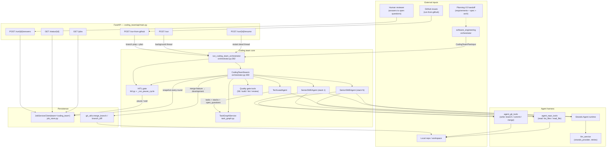
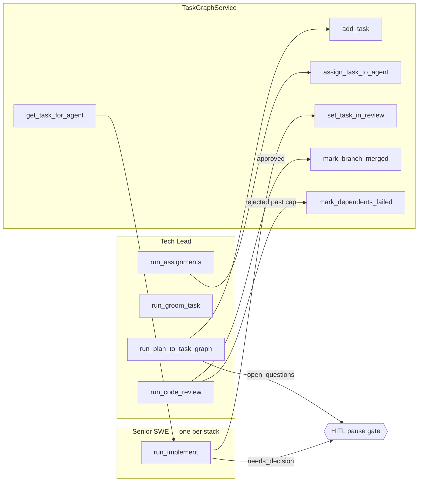
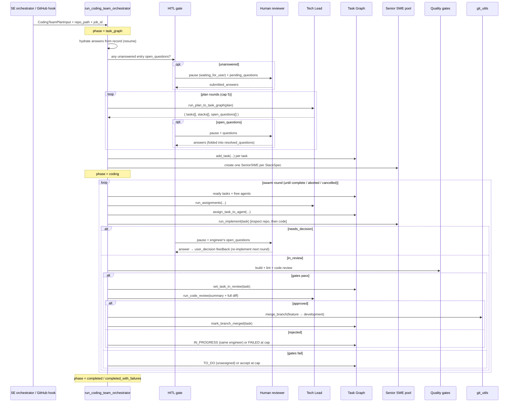
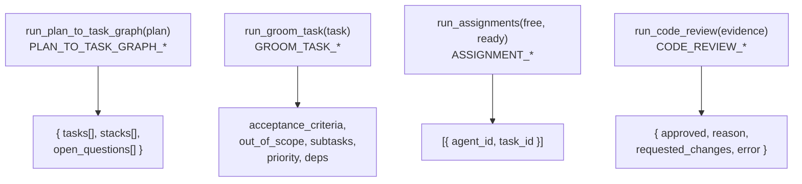
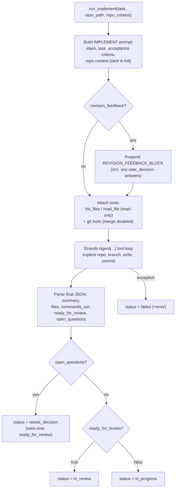
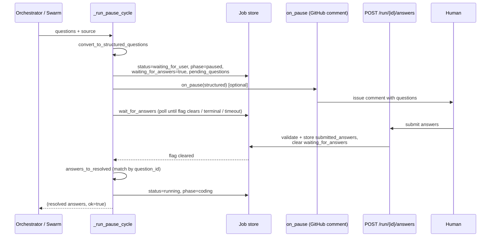
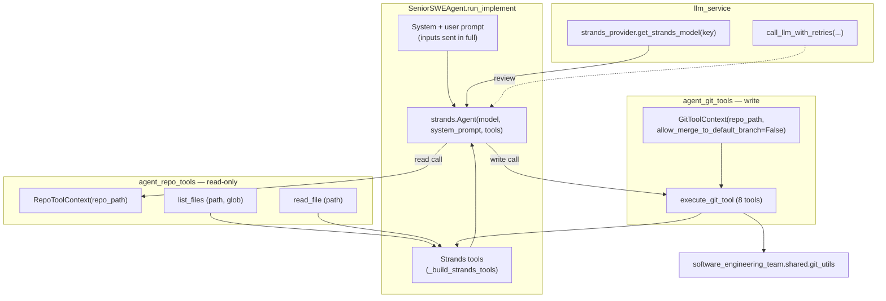

# Coding Team — Architecture

## Overview

The **coding team** is a sub-team of the Software Engineering team. It owns the
implementation path that runs *after* planning: it receives an adapted plan
(from Planning V3 via the SE orchestrator), turns it into a **Task Graph**, and
executes the work through a **Tech Lead coordinator** and one or more
**stack-specialist Senior Software Engineers** running a swarm loop until every
task is either merged or terminally failed.

The team is built around four intertwined ideas:

1. **A coordinator/worker swarm.** A single Tech Lead agent reasons about
   decomposition, assignment, and review; a pool of Senior SWE agents (one per
   tech stack) implements tasks. Neither side writes shared state directly — the
   `CodingTeamSwarm` orchestrator mediates every transition. See
   `orchestrator.py:459-465`.

2. **A Task Graph as the single source of truth.** All scheduling decisions
   (what is ready, who is free, what may merge) derive from an in-memory
   `TaskGraphService` whose state is snapshotted to the job store every round so
   a crashed run can resume deterministically. See `task_graph.py:22-26` and
   `orchestrator.py:312-325`.

3. **A deterministic human-in-the-loop (HITL) decision gate.** Neither the Tech
   Lead nor a Senior SWE may silently decide an open product, design, policy, or
   safety question. When such a question surfaces, the job **pauses**
   (`status="waiting_for_user"`), the questions are recorded, and execution
   resumes only once a human submits answers. The decision to proceed is made by
   deterministic checks over job data — never by an LLM judging whether it may
   proceed — and the gate fails *closed*: any ambiguity re-asks rather than
   guessing. See `hitl.py` and `orchestrator.py:182-279`.

4. **Two entry contracts, one engine.** The same orchestrator backs both the
   in-process handoff from Software Engineering (`POST /run` /
   `run_coding_team_orchestrator`) and the GitHub-issue-driven path
   (`POST /run-from-github`), which wraps the engine with branch preparation,
   push, and PR publication. See `api/main.py:233-262` and
   `api/main.py:1300-1345`.

Logically the team sits under Software Engineering (`parent_team_key=
"software_engineering"`); operationally it is mounted standalone at
`/api/coding-team` for direct jobs and health checks.

## Architectural principles

- **The orchestrator owns side effects; agents only reason.** Each agent
  (`TechLeadAgent`, `SeniorSWEAgent`) returns plain JSON — task lists, stack
  specs, assignment suggestions, change summaries, review verdicts, and
  *open questions*. The `CodingTeamSwarm` is the only component that mutates the
  Task Graph, applies quality gates, runs git merges, and drives the HITL pause.
  This keeps the agents stateless and pure-of-effect, so a failed or malformed
  LLM response can never corrupt scheduling state. See `tech_lead_agent/agent.py`
  ("Orchestrator will add tasks…") and `orchestrator.py:505-521`.

- **Open questions escalate; they are never decided by an agent.** Both the
  planning step and the implementation step can emit `open_questions`. The
  planning gate (`_plan_with_hitl`, `orchestrator.py:249-279`) pauses before any
  task is built; a worker that raises a decision returns
  `status="needs_decision"` and the swarm escalates it
  (`_escalate_decision`, `orchestrator.py:612-688`) — the engineer's
  `open_questions` win even if it also marked the work ready, so a model that
  both asks and answers cannot slip a guessed decision through
  (`senior_..._agent/agent.py:242-256`).

- **The gate is deterministic and fail-closed.** Coverage of an open question by
  an answer is matched strictly by normalized question *text*
  (`hitl.unanswered_questions`, `hitl.py:162-189`); N text-less answers never
  "cover" N questions by raw count. A pause that times out or whose job goes
  terminal sets a failure status and aborts — the only way forward is an explicit
  answer that clears the `waiting_for_answers` flag (`hitl.wait_for_answers`,
  `hitl.py:275-304`).

- **Scheduling invariants live in the Task Graph, not in prose.** "One active
  task per agent", "a new task only after the current one is merged", and
  "dependencies must be merged before assignment" are all enforced by
  `TaskGraphService` methods, not by convention. See
  `task_graph.py:187-213` (`assign_task_to_agent`) and
  `task_graph.py:176-185` (`_dependencies_satisfied`).

- **Every non-terminal outcome is bounded.** A task that cannot reach review, a
  quality-gate rejection, a Tech Lead rejection, an un-runnable review, and a
  decision escalation are each driven toward a terminal `MERGED`/`FAILED` state.
  Nothing is allowed to spin the swarm loop silently to `max_rounds` and then be
  reported as a clean success. The planning question-loop has its own cap
  (`MAX_TECH_LEAD_QUESTION_ROUNDS = 5`, `orchestrator.py:39`); revisions and
  escalations share `MAX_TASK_REVISIONS = 20` (`orchestrator.py:34`).

- **LLM inputs are sent whole, not silently truncated.** The Tech Lead plan
  text, the engineer's task description and repo context, and the reviewer's
  evidence (summary + full diff) are passed to the model in full. The previous
  per-field character caps were removed: a model must see the complete change to
  judge it. If evidence genuinely exceeds the model context, the *single* call
  fails and that one task is failed cleanly rather than being reviewed on partial
  evidence (`_build_review_evidence`, `orchestrator.py:47-59`;
  `_review_and_merge`, `orchestrator.py:785-790`).

- **Failure cascades, success is honest.** A `FAILED` task can never satisfy a
  dependent's preconditions, so its failure is propagated to a fixpoint
  (`mark_dependents_failed`, `task_graph.py:246-281`). A job that finishes with
  any failed task is reported as `completed_with_failures`, never `completed`.
  See `orchestrator.py:448-456`.

- **Resume-safe by construction.** The Task Graph snapshot, the agent→task map,
  *and* submitted answers are persisted through the *same* job store used for
  resume and cancel checks. On resume, in-flight tasks are demoted to unassigned
  `TO_DO` while `MERGED`/`FAILED` are preserved, and prior answers are folded
  back into the plan input so an undecided question is not re-asked
  (`_hydrate_resolved_from_record`, `orchestrator.py:147-179`;
  `reset_in_flight`, `task_graph.py:143-162`).

- **The model never chooses the repo path, the merge target, or escapes the
  workspace.** Both tool harnesses bind the working tree from orchestrator state
  via a frozen context, strip any model-supplied `repo_path`, and confine every
  path to the workspace; git merge targets are restricted to the development/base
  branch. See `agent_git_tools/context.py:9-22`, `executor.py:131-149` and
  `agent_repo_tools/context.py:9-28`, `executor.py:141-164`.

## Component diagram

---

## 1. Agent architecture

The team has **three first-class roles**. The first two are LLM-backed agents;
the third is a deterministic state machine that the agents act through.

| Role | Type | Implementation | Responsibility |
|------|------|----------------|----------------|
| **Tech Lead** | LLM agent (coordinator) | `tech_lead_agent/agent.py` | Plan → Task Graph + stacks (+ **open questions**); (optionally) groom tasks; suggest assignments; code-review feature branches. |
| **Senior Software Engineer** | LLM agent (worker) | `senior_software_engineer_agent/agent.py` | One per stack. Inspect the repo, implement a single assigned task (code + tests), summarise changes, signal ready-for-review or **raise a decision**. |
| **Task Graph** | Deterministic service | `task_graph.py` | Per-job store of tasks, dependencies, statuses, and the agent→task map. Enforces all scheduling invariants. |

The **`CodingTeamSwarm`** (`orchestrator.py:459`) is the conductor that wires
these together — a coordinator/worker swarm in which the Tech Lead assigns ready
tasks to free workers, each worker implements and is gated, and the Tech Lead
reviews and merges. It is a hand-rolled, fully deterministic loop (not an
LLM-driven handoff graph), which is what makes the scheduling auditable,
resume-safe, and the HITL gate trustworthy.

> A pure LLM-handoff variant of the same topology exists in
> `graphs/coding_swarm.py` (`tech_lead_assigner ←→ implementer ←→
> quality_gate_runner ←→ reviewer_merger`, built on `strands.multiagent.Swarm`
> with `max_handoffs=50`). It is an alternative formulation of the same
> responsibilities; the production path uses the deterministic
> `CodingTeamSwarm`.

### Agent ↔ Task Graph relationship

The Tech Lead and Senior SWEs never call Task Graph mutators directly — they
return suggestions/results and the swarm applies them. This boundary keeps a bad
LLM response from corrupting state and is what lets every open question route
through one deterministic gate.

### Data model (`models.py`)

- **`TaskStatus`** (`models.py:14-21`): `TO_DO → IN_PROGRESS → IN_REVIEW →
  MERGED`, with `FAILED` as the terminal failure state. (`needs_decision` is a
  transient `run_implement` *result* status, not a persisted task state; the job
  status `waiting_for_user` is the persisted projection of a pause.)
- **`Task`** (`models.py:51-98`): id, title, description, `dependencies`
  (task ids that must be `MERGED` first), status, `assigned_agent_id`,
  `feature_branch`, `merged_at`, `acceptance_criteria`, `out_of_scope`,
  `priority`, optional `subtasks`, `changes_summary`, and the revision-tracking
  fields `revision_count` / `revision_feedback` (the latter also carries
  `user_decision` entries from escalations).
- **`Subtask`** (`models.py:37-48`): id, title, description, intra-task
  `dependencies`, status.
- **`StackSpec`** (`models.py:24-34`): `name` + `tools_services`; one Senior SWE
  is created per stack.
- **`CodingTeamPlanInput`** (`models.py:113-149`): the handoff contract —
  requirements title/description, project overview, optional planning hierarchy,
  final spec content, architecture overview, existing-code summary,
  `resolved_questions` (answers on record), `open_questions`, assumptions, and
  `repo_path`.
- **`CodingTeamJobState`** (`models.py:157-176`): the persisted projection —
  phase, status text, `task_graph_snapshot`, `agent_task_map`, `stack_specs`.
  The HITL fields (`waiting_for_answers`, `pending_questions`,
  `submitted_answers`) are written alongside it and deliberately mirror the
  Software Engineering job-record contract so the SE answers endpoint resumes a
  coding-team pause transparently on the SE-driven path (`hitl.py:10-16`).

---

## 2. Team process

The job moves through phases tracked on the job record:
`task_graph → coding → completed`, with a `paused` phase
(`status="waiting_for_user"`) entered whenever the HITL gate fires
(`orchestrator.py:209-215`, `:423`, `:452`).

### Initialization (`orchestrator.py:327-408`)

1. Build the Task Graph with a persist callback bound to the injected job store,
   and build the Tech Lead + the bound `_pause_cycle` closure.
2. **Entry HITL gate** — fold any answers persisted from a prior attempt
   (`_hydrate_resolved_from_record`), then if the handed-in `open_questions`
   still have no matching answer, **pause for the user before doing any work**
   (`orchestrator.py:357-366`). The swarm is never entered while an unanswered
   open question exists.
3. **Resume** from a persisted snapshot if one exists — restore tasks + map,
   then `reset_in_flight()`. Otherwise **plan with HITL** (`_plan_with_hitl`):
   re-run planning, pausing whenever the Tech Lead raises an open question, until
   it emits none — or fail closed after `MAX_TECH_LEAD_QUESTION_ROUNDS`.
4. Add tasks, persist the derived stacks, and create one `SeniorSWEAgent` per
   `StackSpec` (falling back to a single `default` stack, `orchestrator.py:73`).
5. Transition to `phase = coding`, `status = running`.

### The swarm loop (`CodingTeamSwarm.run`, `orchestrator.py:895-953`)

Each round, up to `max_rounds = 50`:

1. **Cancel check** — honor a cooperative cancel flag on the job record.
2. **Repo-context refresh** — re-read the repo summary only when the merged-task
   count advanced (`orchestrator.py:925-928`).
3. **Assign** — coordinator matches ready tasks to free agents.
4. **Implement + gate** — each worker implements its assigned task; if any worker
   raises a decision and the resulting pause ends without answers, `self.aborted`
   is set and the loop returns immediately (`orchestrator.py:937-945`).
5. **Review + merge** — coordinator reviews `IN_REVIEW` tasks and merges or
   rejects.
6. **Persist** after each stage; **terminate** when no `TO_DO` remains, no agent
   is active, and nothing is `IN_REVIEW` (`_is_complete`,
   `orchestrator.py:888-893`).

### Termination & reporting (`orchestrator.py:443-456`)

If the swarm aborted on an unanswered escalation, the pause cycle already set the
failure status and the orchestrator does not overwrite it. Otherwise the job ends
`completed` when all tasks merged, or `completed_with_failures` when any task is
terminally `FAILED` — the status text always reports the merged/failed tallies.

---

## 3. Per-agent workflows

### 3a. Tech Lead

The Tech Lead is four narrowly-scoped LLM calls, each backed by its own Strands
`Agent` with a dedicated system prompt (`tech_lead_agent/agent.py:113-118`):

- **`run_plan_to_task_graph`** (`agent.py:120-171`): condense the plan into LLM
  context (`_plan_text`) and prompt for a JSON `{ tasks, stacks, open_questions }`.
  The system prompt is explicit that the Tech Lead must **never** make product,
  design, policy, or safety decisions — anything the plan does not answer goes in
  `open_questions` and planning stops; emitting an open question is always
  correct, guessing is always wrong (`tech_lead_agent/prompts.py:3-28`). The
  plan text now folds in any answers already on record under "User decisions"
  (implement exactly, do not revisit) and assumptions (`agent.py:90-97`). A
  failed LLM call degrades to an empty graph + default stack + no questions.
- **`run_groom_task`** (`agent.py:173-209`): enrich one task with acceptance
  criteria, out-of-scope, subtasks, priority, and refined dependencies.
- **`run_assignments`**: given free agents and dependency-satisfied ready tasks,
  return `{ agent_id, task_id }` pairs; entries missing either id are filtered
  out before they reach the graph.
- **`run_code_review`**: the only Tech Lead call with a hardened harness. It runs
  through the shared jittered-exponential-backoff retry envelope
  (`call_llm_with_retries`, attempts from `CODING_TEAM_REVIEW_RETRIES`,
  default 3). A response that parses but lacks an `approved` verdict is treated
  as unusable and **raised** so it retries rather than silently becoming a
  rejection. On exhaustion it returns `error=True` — distinguishing an
  *infrastructure* failure (fail the task once) from a *substantive* rejection
  (route through the revision loop).

### 3b. Senior Software Engineer

A worker implements exactly one task per call. The agent is parameterized by its
`StackSpec` and given **two** tool harnesses: read-only repo inspection and the
write-capable git tools.

`run_implement` (`senior_software_engineer_agent/agent.py:147-265`):

1. Render the implement prompt from the `StackSpec`, the task (description and
   repo context passed **in full** — no truncation), and the acceptance criteria.
2. If the task carries `revision_feedback`, prepend a `REVISION_FEEDBACK_BLOCK`
   rendered from prior Tech-Lead, quality-gate, and `user_decision` entries
   (`_render_revision_feedback`, `agent.py:35-55`) so the engineer revises the
   *existing* work and implements any user decisions exactly.
3. Build a Strands `Agent` with both the **repo-inspection tools** (`list_files`,
   `read_file`) and the **git tools** attached; the system prompt instructs the
   engineer to explore the checkout — confirm whether a file already exists
   before creating it, open related code in full rather than guessing from the
   summary — then branch, write, and commit (`agent.py:185-205`).
4. Coerce the result. **`open_questions` win unconditionally**: if the model
   raised any decision, the result is `status="needs_decision"` with the
   questions verbatim, regardless of `ready_for_review`, so a model that both
   asks and marks ready cannot slip a guessed decision through
   (`agent.py:241-256`). Otherwise `ready_for_review=true → "in_review"`,
   `false → "in_progress"`; a raised LLM call → `"failed"`.

The engineer **suggests** a change summary and (optionally) file edits and may
**raise** a decision; whether those land, get gated, escalate, and merge is
entirely the orchestrator's decision.

### 3c. The swarm's revision, escalation & failure routing

Several distinct paths keep the loop bounded. The three rejection paths append to
the task's accumulated `revision_feedback` and increment `revision_count` toward
`MAX_TASK_REVISIONS = 20`; the escalation path is counted separately.

| Path | Trigger | Effect | Code |
|------|---------|--------|------|
| **Decision escalation** | engineer returns `status="needs_decision"` | pause the job for the user; on answer, task → `IN_PROGRESS` with a `user_decision` feedback entry (same engineer, **revision count unchanged**); failed if no answer channel or after 20 cumulative escalations | `_escalate_decision`, `orchestrator.py:612-688` |
| **Quality-gate rejection** | build fails, or code review not approved | task → `TO_DO`, **unassigned** (any free agent may re-pick); accepted as-is at the cap | `_run_quality_gates` / `_return_for_revision`, `orchestrator.py:690-762` |
| **Tech Lead rejection** | `run_code_review` returns `approved=false` | task → `IN_PROGRESS`, **kept with the same engineer**; → `FAILED` (+ cascade) at the cap | `_request_revision`, `orchestrator.py:802-852` |
| **Incomplete / un-runnable** | engineer didn't reach review, or review itself errored (`error=True`) | bounded retry, then `FAILED` (+ cascade) — never re-sends the same failing prompt every round | `_handle_incomplete_implementation` (`:570-610`), `_fail_task` (`:854-875`) |

An escalation is deliberately **not** charged to the revision cap so a
late-stage question (a task already near the cap) still gets its answer
implemented; instead it has its own cumulative ceiling of `MAX_TASK_REVISIONS`
distinct escalations (`orchestrator.py:670-683`). A `FAILED` task cascades to
every transitive dependent (`_cascade_fail_dependents` → `mark_dependents_failed`,
`orchestrator.py:877-886`, `task_graph.py:246-281`).

### Task Graph invariants enforced in code

- **Assignment guard** (`task_graph.py:187-213`): assign only if the agent is
  free *or* its current task is `MERGED`, and the task's dependencies are all
  `MERGED`. Assigning sets `IN_PROGRESS` and records the agent→task map.
- **One non-merged task per agent** (`get_task_for_agent`,
  `task_graph.py:215-224`): returns the single in-flight task, lazily pruning a
  stale mapping when the task reached a terminal state.
- **Terminal transitions free the agent** through the single `_free_agent`
  chokepoint (`task_graph.py:67-83`).
- **Explicit unassign vs. leave-untouched** via the `_UNSET` sentinel
  (`task_graph.py:19`, `:84-141`).

---

## 4. Human-in-the-loop decision gate

The HITL gate (`hitl.py` + the orchestrator's `_run_pause_cycle`) is the single
deterministic channel through which *every* open question — whether raised at
plan time by the Tech Lead or mid-implementation by an engineer — reaches a human
and comes back as a decision the agents implement verbatim.

- **Question normalization** (`hitl.convert_to_structured_questions`,
  `hitl.py:88-126`): free-text or partially-structured questions become
  structured records with a stable id, text, options (the question's own, else
  the default yes / no / not-sure set, `hitl.py:39-43`), `required=True`, and a
  `source` tag (`tech_lead`, `plan_input`, or `engineer:<agent>`).
- **Pause & wait** (`_run_pause_cycle`, `orchestrator.py:182-246`): sets the
  waiting state, optionally fires `on_pause` (the GitHub path posts the questions
  as an issue comment), then blocks in `wait_for_answers` (poll interval 5s,
  timeout `CODING_TEAM_ANSWER_WAIT_TIMEOUT_S`, default 3600s). On answers it maps
  them back to resolved records and returns `(resolved, True)`; on timeout it
  fails the job; on the job going terminal while waiting it returns
  `([], False)` without relabeling.
- **Fail-closed coverage** (`hitl.unanswered_questions`, `hitl.py:162-189`): an
  open question is "answered" only when a resolved record matches it by
  normalized text. Answers are never assumed to cover questions by count, and a
  resume whose persisted answers lack question text re-asks rather than guessing.
- **Answer API** (`api/main.py:287-376`): `POST /run/{job_id}/answers` validates
  every submission against the job's `pending_questions` (required questions
  answered, no unknown ids, `other` carries non-blank text), stores them, and —
  if the orchestrator thread is alive — lets the blocked wait loop resume; if the
  thread died (e.g. a server restart), the answers are stored and the caller
  posts `POST /run/{job_id}/resume` to restart the orchestrator
  (`api/main.py:379-432`).

The pause fields match the SE job-record contract, so on the SE-driven path the
Software Engineering answers endpoint resumes a coding-team pause transparently,
while the coding team's own endpoints serve the standalone and GitHub-issue
paths (`hitl.py:10-16`).

---

## 5. Agent harness

Both agent classes run on the same lightweight harness: the **Strands `Agent`
runtime** for the LLM tool loop, the shared **`llm_service`** for model
resolution and retries, and two tool packages — **`agent_repo_tools`** (read) and
**`agent_git_tools`** (write).

### 5a. LLM provisioning (`llm_getter`)

The orchestrator is injected with a `get_llm` callable; by default it resolves a
Strands model from the shared provider
(`llm_service.strands_provider.get_strands_model`, `orchestrator.py:301-305`).
Models are requested by **role key** so per-role overrides apply: the Tech Lead
is built with `llm_getter("tech_lead")` (`orchestrator.py:333`); each Senior SWE
and every quality-gate tool uses `llm_getter("coding_team")`. Because the getter
is a parameter, the SE parent and tests can inject their own model factory.

### 5b. Strands tool wrapping (`senior_software_engineer_agent/agent.py:58-132`)

Tools are defined OpenAI-function-style. The Strands registry only registers
recognized tool types — a plain closure is silently dropped — so each definition
is wrapped in a `PythonAgentTool` carrying the definition's *exact* JSON schema
(`_make_python_agent_tool`). A handler exception becomes a `status="error"`
`ToolResult` rather than aborting the whole agent invocation. Both the git
handlers and the repo-inspect handlers are wrapped through the same
`_build_strands_tools` helper and concatenated onto the agent
(`agent.py:202-205`).

### 5c. The tool surface

**Read — `agent_repo_tools` (two tools, `definitions.py`):**

- `list_files(path, glob)` — list files/dirs under a relative path, optionally
  glob-filtered; build/VCS/dependency-cache directories are skipped.
- `read_file(path)` — return a single file's full contents.

Both are read-only and sandboxed to the job workspace by a frozen
`RepoToolContext` (`context.py:9-28`): a model-supplied `repo_path` is stripped,
and every path is resolved relative to and confined within the workspace root —
absolute paths and `..` traversal are rejected (`executor.py:33-40`,
`:141-164`). `read_file` returns the file **in full, deliberately uncapped** —
the agent must be able to read any workspace file completely to do its job;
containment, not size, is the boundary (`executor.py:117-138`). The exclude-dir
set is single-sourced (`REPO_INSPECT_EXCLUDE_DIRS`) with the orchestrator's
passive `_read_repo_context` scanner, so the active and passive views of the repo
cannot drift (`executor.py:17-19`, `orchestrator.py:90-96`).

**Write — `agent_git_tools` (eight tools, `definitions.py`):**

`git_status`, `git_diff`, `git_log`, `git_checkout_branch`,
`git_create_feature_branch`, `git_write_files_and_commit`,
`git_commit_working_tree`, `git_merge_branch` — all dispatched through
`execute_git_tool` into the shared `git_utils`. This is the team's security
boundary for repo *mutation*:

- **Repo path is host-bound, not model-chosen** — `GitToolContext` is frozen and
  resolved from orchestrator state; any model `repo_path` is stripped.
- **Branch names are validated** against an allow-list regex
  (`development|main|master|HEAD|feature/*|fix/*|refactor/*`); paths are confined
  to the repo (`executor.py:25-54`).
- **Merge is policy-gated.** Senior SWEs are constructed with
  `allow_merge_to_default_branch=False` (`agent.py:198-201`), so a worker can
  branch, write, and commit but **cannot merge** — merges are reserved for the
  orchestrator after a passing Tech Lead review (`merge_branch`,
  `orchestrator.py:793`). Even when permitted, the target must be the
  development/base branch (`executor.py:142-147`).

### 5d. JSON I/O contract & resilience

Every agent call returns JSON; the harness strips markdown fences and parses
defensively (`_agent_call_json`, `tech_lead_agent/agent.py:101-107`;
`_parse_json_response`, `senior_..._agent/agent.py:27-32`). Resilience comes from
three layers — note that input truncation is **no longer** one of them:

1. **Per-call fallbacks** — a raised plan/groom/assignment call degrades to an
   empty-but-valid result; a raised implement call returns `status="failed"`.
2. **Whole inputs, clean single-task failure** — plan text, task descriptions,
   repo context, and review evidence are sent in full. If evidence exceeds the
   model context, the review call fails and that one task is failed cleanly
   (`_fail_task`) rather than reviewed on partial evidence.
3. **Retry-with-backoff on review** — the one call whose failure is most
   expensive to mishandle uses `call_llm_with_retries` and the `error=True`
   discriminator (§3a).

### 5e. Persistence, resume & run-thread tracking

`job_store.py` wraps `JobServiceClient(team="coding_team")` and adds HITL helpers
(`add_pending_questions`, `is_waiting_for_answers`, `submit_answers`,
`get_submitted_answers`). The orchestrator's `_persist_graph` writes the task
snapshot, agent→task map, phase, and status text through the **injected**
`update_job_fn` every round — the same store used for resume and cancel checks
(`orchestrator.py:312-325`). The API tracks live orchestrator threads
(`_register/_clear/_is_run_thread_alive/_claim_run_thread`) so a `/answers`
submission can tell whether the blocked wait loop will pick up the answers or a
`/resume` is needed; `_claim_run_thread` makes the restart race-safe.

### 5f. Runtime modes

- **Thread mode (default).** `POST /run` validates the plan and runs the
  orchestrator in a daemon thread (registered in the run-thread map), marking the
  job `failed` on an unhandled exception (`api/main.py:233-262`).
- **Temporal mode.** When Temporal is enabled, `CodingTeamWorkflow` wraps the
  orchestrator in a `coding_team_run_pipeline` activity
  (`start_to_close_timeout=4h`); the worker starts on import
  (`temporal/__init__.py`). Resume-from-snapshot (plus answer hydration) is what
  makes an activity retry safe.

### 5g. The GitHub-driven harness extension (`api/main.py`)

`POST /run-from-github` wraps the same engine with the actions a human reviewer
would otherwise do, all defensively hardened:

- **Issue readiness** — an issue is ready iff all of its GitHub native
  sub-issues are closed; the plan is built from the issue body.
- **Per-issue concurrency** — only one job per `(owner, repo, issue_number)` may
  run, and branch prep refuses to run under a live sibling job on the same
  checkout.
- **Crash-safe branch prep** (`_prepare_issue_branch`) — dirty trees are
  recovered (same-issue work committed in place, foreign work preserved on
  `khala/rescue/*`), the integration branch `khala/issue-<num>` is seeded from
  the best prior-progress tip, and no reset may orphan a reachable commit.
- **Pause notifications** — the orchestrator is invoked with an `on_pause`
  callback that posts the pending questions as a formatted issue comment
  (`_on_pause` / `_format_questions_comment`, `api/main.py:598`, `:1328-1340`),
  so a reviewer watching the issue learns a decision is needed.
- **Transient credentials** — the GitHub token is injected per network op via a
  transient `http.extraHeader` and never persisted; every error/comment string
  is scrubbed of both token representations.
- **Deferred terminal status** — the orchestrator's `completed` is rewritten to
  `(running, publishing)` until fast-forward, force-with-lease push, and PR
  creation finish.
- **Honest PR semantics** — `Closes #N` only when every task merged; a partial
  result uses non-closing `Refs #N` and lists the unfinished tasks.

---

## Configuration

| Variable | Purpose | Default |
|----------|---------|---------|
| `CODING_TEAM_REVIEW_RETRIES` | Tech Lead `run_code_review` retry count (attempts = retries + 1) on transient failure. | `2` → 3 attempts |
| `CODING_TEAM_ANSWER_WAIT_TIMEOUT_S` | Wall-clock cap (seconds) for a single HITL pause before the job times out and fails. | `3600` |
| `GITHUB_TOKEN` | Fallback token for `run-from-github` (per-request `github_token` overrides). Needs Issues/PRs/Contents read-write + Metadata read. | — |
| `GITHUB_API_URL` | REST base URL for the GitHub client; set for Enterprise. | `https://api.github.com` |
| `AGENT_CACHE` | Job-store cache root (`DEFAULT_CACHE_DIR`). | `.agent_cache` |

Internal bounds: `MAX_TASK_REVISIONS = 20` (revisions **and** decision
escalations, counted separately), `MAX_TECH_LEAD_QUESTION_ROUNDS = 5`
(plan-time question loop), `max_rounds = 50` (swarm), `wait_for_answers` poll
interval 5s. LLM inputs are no longer character-capped — the previous review-
evidence and implement-description truncation knobs were removed.

## Key design decisions

- **Deterministic swarm over LLM-driven handoffs.** The production loop is a
  hand-rolled state machine so scheduling is auditable, resume-safe, and immune
  to LLM non-determinism; the LLM-handoff `Swarm` formulation is retained as an
  alternative but not on the default path.
- **Agents reason, the orchestrator acts.** Keeping all side effects out of the
  agents is what lets every malformed/failed LLM response degrade gracefully and
  every open question route through one deterministic gate.
- **No agent decides a product question.** Open questions from either the planner
  or an engineer pause the job for a human and fail closed on any ambiguity — the
  conservative failure mode is always to re-ask, never to guess.
- **Show the model everything, fail one task cleanly if it overflows.** Inputs
  are sent whole rather than truncated; an evidence overflow fails its single
  task with a diagnostic instead of silently reviewing partial work.
- **Every loop has a terminal state.** Bounded rejection/escalation paths plus
  failure cascade guarantee the swarm halts with an honest `completed` /
  `completed_with_failures` / `failed`, never a silent spin to `max_rounds`.
- **The tool harnesses are the security boundary.** Host-bound repo path,
  read/write split, validated branches/paths, workspace containment, and
  policy-gated merges mean a worker agent can inspect and implement freely without
  ever being able to merge to or escape its working tree.

## Related documents

- `../README.md` — team overview, package layout, and the GitHub-issue flow.
- `system_design.md` — module layout, domain model, API surface (companion doc).
- `../../../system_design/specs/SPEC-023-coding-team-human-in-the-loop.md` —
  the human-in-the-loop decision-gate specification.
- `../../software_engineering_team/README.md` — the parent SE pipeline that
  hands off to this team.
- `../../../ARCHITECTURE.md` — platform-wide architecture.
