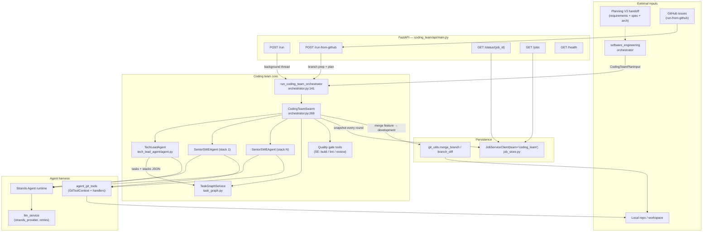
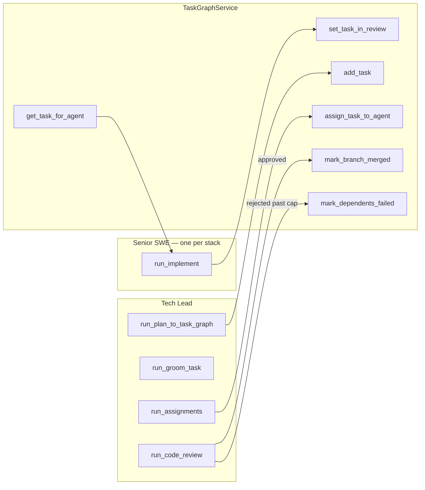
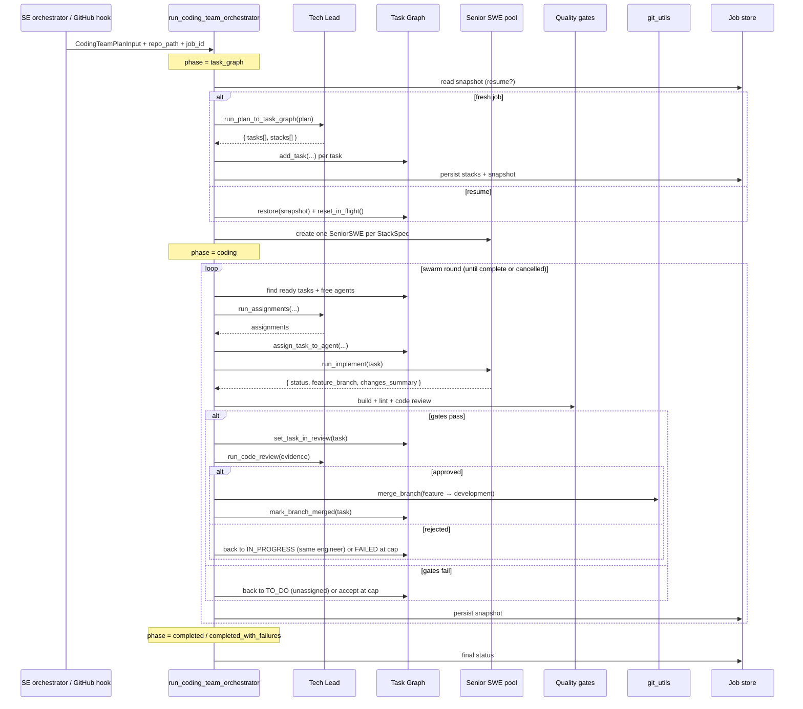
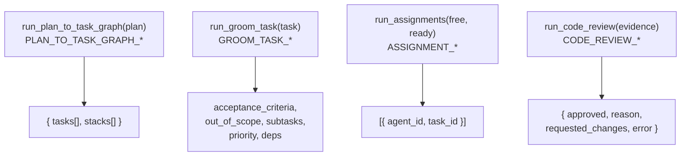
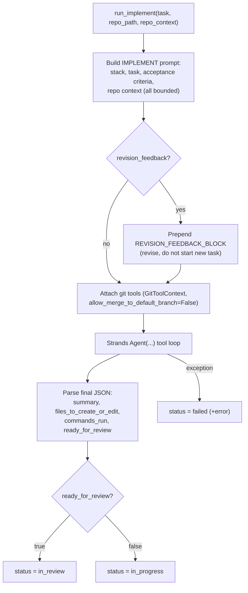
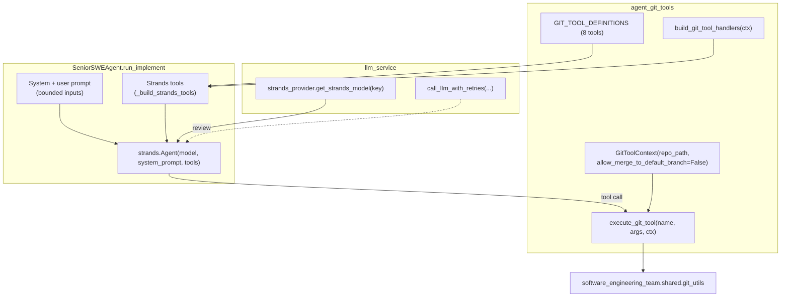

# Coding Team — Architecture

## Overview

The **coding team** is a sub-team of the Software Engineering team. It owns the
implementation path that runs *after* planning: it receives an adapted plan
(from Planning V3 via the SE orchestrator), turns it into a **Task Graph**, and
executes the work through a **Tech Lead coordinator** and one or more
**stack-specialist Senior Software Engineers** running a swarm loop until every
task is either merged or terminally failed.

The team is built around three intertwined ideas:

1. **A coordinator/worker swarm.** A single Tech Lead agent reasons about
   decomposition, assignment, and review; a pool of Senior SWE agents (one per
   tech stack) implements tasks. Neither side writes shared state directly — the
   `CodingTeamSwarm` orchestrator mediates every transition. See
   `orchestrator.py:269-275`.

2. **A Task Graph as the single source of truth.** All scheduling decisions
   (what is ready, who is free, what may merge) derive from an in-memory
   `TaskGraphService` whose state is snapshotted to the job store every round so
   a crashed run can resume deterministically. See `task_graph.py:22-26` and
   `orchestrator.py:170-209`.

3. **Two entry contracts, one engine.** The same orchestrator backs both the
   in-process handoff from Software Engineering (`POST /run` /
   `run_coding_team_orchestrator`) and the GitHub-issue-driven path
   (`POST /run-from-github`), which wraps the engine with branch preparation,
   push, and PR publication. See `api/main.py:136-162` and
   `api/main.py:998-1004`.

Logically the team sits under Software Engineering (`parent_team_key=
"software_engineering"`); operationally it is mounted standalone at
`/api/coding-team` for direct jobs and health checks.

## Architectural principles

- **The orchestrator owns side effects; agents only reason.** Each agent
  (`TechLeadAgent`, `SeniorSWEAgent`) returns plain JSON — task lists, stack
  specs, assignment suggestions, change summaries, review verdicts. The
  `CodingTeamSwarm` is the only component that mutates the Task Graph, applies
  quality gates, and runs git merges. This keeps the agents stateless and
  pure-of-effect, so a failed or malformed LLM response can never corrupt
  scheduling state. See `tech_lead_agent/agent.py:71-72` ("Orchestrator
  performs actual Task Graph updates and git merge") and
  `orchestrator.py:309-325`.

- **Scheduling invariants live in the Task Graph, not in prose.** "One active
  task per agent", "a new task only after the current one is merged", and
  "dependencies must be merged before assignment" are all enforced by
  `TaskGraphService` methods, not by convention. See
  `task_graph.py:187-213` (`assign_task_to_agent`) and
  `task_graph.py:176-185` (`_dependencies_satisfied`).

- **Every non-terminal outcome is bounded.** A task that cannot reach review,
  a quality-gate rejection, a Tech Lead rejection, and an un-runnable review are
  each counted against a shared `MAX_TASK_REVISIONS` cap (`orchestrator.py:34`)
  and ultimately driven to a terminal `MERGED` or `FAILED` state. Nothing is
  allowed to spin the swarm loop silently to `max_rounds` and then be reported
  as a clean success. See `_handle_incomplete_implementation`
  (`orchestrator.py:365-404`) and `_return_for_revision`
  (`orchestrator.py:454-474`).

- **Failure cascades, success is honest.** A `FAILED` task can never satisfy a
  dependent's preconditions, so its failure is propagated to a fixpoint
  (`mark_dependents_failed`, `task_graph.py:246-281`). A job that finishes with
  any failed task is reported as `completed_with_failures`, never `completed`,
  so downstream consumers (and the GitHub publish flow) surface the gap. See
  `orchestrator.py:258-266`.

- **Resume-safe by construction.** The Task Graph snapshot and the
  agent→task map are persisted through the *same* job store used for resume and
  cancel checks, every round. On resume, in-flight tasks are demoted to
  unassigned `TO_DO` while `MERGED`/`FAILED` are preserved, so a Temporal retry
  re-plans only the unfinished work. See `_persist_graph`
  (`orchestrator.py:170-183`) and `reset_in_flight` (`task_graph.py:143-162`).

- **The model never chooses the repo path or merge target.** The git harness
  binds the working tree and policy flags from orchestrator state via a frozen
  `GitToolContext`; a `repo_path` argument from the model is stripped, branch
  names are regex-validated, and merge targets are restricted to the
  development/base branch. See `context.py:9-22` and `executor.py:34-54`,
  `executor.py:131-149`.

## Component diagram

---

## 1. Agent architecture

The team has **three first-class roles**. The first two are LLM-backed agents;
the third is a deterministic state machine that the agents act through.

| Role | Type | Implementation | Responsibility |
|------|------|----------------|----------------|
| **Tech Lead** | LLM agent (coordinator) | `tech_lead_agent/agent.py` | Plan → Task Graph + stacks; (optionally) groom tasks; suggest assignments; code-review feature branches. |
| **Senior Software Engineer** | LLM agent (worker) | `senior_software_engineer_agent/agent.py` | One per stack. Implement a single assigned task (code + tests), summarise changes, signal ready-for-review. |
| **Task Graph** | Deterministic service | `task_graph.py` | Per-job store of tasks, dependencies, statuses, and the agent→task map. Enforces all scheduling invariants. |

The **`CodingTeamSwarm`** (`orchestrator.py:269`) is the conductor that wires
these together — a coordinator/worker swarm in which the Tech Lead assigns ready
tasks to free workers, each worker implements and is gated, and the Tech Lead
reviews and merges. It is a hand-rolled, fully deterministic loop (not an
LLM-driven handoff graph), which is what makes the scheduling auditable and
resume-safe.

> A pure LLM-handoff variant of the same topology exists in
> `graphs/coding_swarm.py` (`tech_lead_assigner ←→ implementer ←→
> quality_gate_runner ←→ reviewer_merger`, built on `strands.multiagent.Swarm`
> with `max_handoffs=50`). It is an alternative formulation of the same four
> responsibilities; the production path uses the deterministic
> `CodingTeamSwarm`.

### Agent ↔ Task Graph relationship

The Tech Lead and Senior SWEs never call Task Graph mutators directly — they
return suggestions/results and the swarm applies them. This is the boundary that
keeps a bad LLM response from corrupting state.

### Data model (`models.py`)

- **`TaskStatus`** (`models.py:14-21`): `TO_DO → IN_PROGRESS → IN_REVIEW →
  MERGED`, with `FAILED` as the terminal failure state.
- **`Task`** (`models.py:51-98`): id, title, description, `dependencies`
  (task ids that must be `MERGED` first), status, `assigned_agent_id`,
  `feature_branch`, `merged_at`, `acceptance_criteria`, `out_of_scope`,
  `priority`, optional `subtasks`, `changes_summary`, and the revision-tracking
  fields `revision_count` / `revision_feedback`.
- **`Subtask`** (`models.py:37-48`): id, title, description, intra-task
  `dependencies`, status.
- **`StackSpec`** (`models.py:24-34`): `name` + `tools_services`; one Senior SWE
  is created per stack.
- **`CodingTeamPlanInput`** (`models.py:113-149`): the handoff contract —
  requirements title/description, project overview, optional planning hierarchy,
  final spec content, architecture overview, existing-code summary, resolved /
  open questions, assumptions, and `repo_path`.
- **`CodingTeamJobState`** (`models.py:157-176`): the persisted projection —
  phase, status text, `task_graph_snapshot`, `agent_task_map`, `stack_specs`.

---

## 2. Team process

The job moves through three phases tracked on the job record:
`task_graph → coding → completed` (`orchestrator.py:186`, `:239`, `:262`).

### Initialization (`orchestrator.py:185-241`)

1. Build the Task Graph with a persist callback bound to the injected job store.
2. Build the Tech Lead unconditionally (needed as coordinator on both fresh and
   resume paths).
3. **Resume** from a persisted snapshot if one exists — restore tasks + map,
   then `reset_in_flight()` to demote half-done `IN_PROGRESS`/`IN_REVIEW` tasks
   to unassigned `TO_DO`. Otherwise **plan fresh**: call
   `run_plan_to_task_graph`, add tasks, and persist the derived stacks for a
   later retry.
4. Create one `SeniorSWEAgent` per `StackSpec` (falling back to a single
   `default` stack when none is provided, `orchestrator.py:87`).
5. Transition to `phase = coding`, `status = running`.

### The swarm loop (`CodingTeamSwarm.run`, `orchestrator.py:601-646`)

Each round, up to `max_rounds = 500`:

1. **Cancel check** — honor a cooperative cancel flag on the job record.
2. **Repo-context refresh** — re-read the repo summary only when the merged-task
   count advanced (merged work is the only thing that lands on the shared tree),
   avoiding a full repo walk on idle rounds (`orchestrator.py:624-627`).
3. **Assign** — coordinator matches ready tasks to free agents.
4. **Implement + gate** — each worker implements its assigned task and is run
   through the quality gates.
5. **Review + merge** — coordinator reviews `IN_REVIEW` tasks and merges or
   rejects.
6. **Persist** after each stage; **terminate** when no `TO_DO` remains, no agent
   is active, and nothing is `IN_REVIEW` (`_is_complete`,
   `orchestrator.py:594-599`).

### Termination & reporting (`orchestrator.py:258-266`)

The job ends `completed` when all tasks merged, or `completed_with_failures`
when any task is terminally `FAILED` — the status text always reports the
merged/failed tallies.

---

## 3. Per-agent workflows

### 3a. Tech Lead

The Tech Lead is four narrowly-scoped LLM calls, each backed by its own Strands
`Agent` with a dedicated system prompt (`tech_lead_agent/agent.py:76-79`):

- **`run_plan_to_task_graph`** (`agent.py:81-117`): condense the plan into LLM
  context (`_plan_text`, `agent.py:45-59`, bounding each section), prompt for a
  JSON `{ tasks, stacks }`, and defensively coerce the response — only tasks with
  an `id` survive, stacks default to a single `default` stack. A failed LLM call
  degrades to an empty graph + default stack rather than raising.
- **`run_groom_task`** (`agent.py:119-155`): enrich one task with acceptance
  criteria, out-of-scope, subtasks, priority, and refined dependencies. (Grooming
  is part of the agent's contract; the production swarm loop assigns directly off
  the planned graph.)
- **`run_assignments`** (`agent.py:157-182`): given free agents and
  dependency-satisfied ready tasks, return `{ agent_id, task_id }` pairs; entries
  missing either id are filtered out before they reach the graph.
- **`run_code_review`** (`agent.py:184-231`): the only Tech Lead call with a
  hardened harness. It runs through the shared jittered-exponential-backoff retry
  envelope (`call_llm_with_retries`, attempts from
  `CODING_TEAM_REVIEW_RETRIES`, default 3). A response that parses but lacks an
  `approved` verdict is treated as unusable and **raised** so it retries rather
  than silently becoming a rejection. On exhaustion it returns
  `error=True` — distinguishing an *infrastructure* failure (fail the task once)
  from a *substantive* rejection (route through the revision loop). See
  `_review_retry_attempts` (`agent.py:23-42`).

### 3b. Senior Software Engineer

A worker implements exactly one task per call. The agent is parameterized by its
`StackSpec` and given the git tools to inspect and modify the working tree.

`run_implement` (`senior_software_engineer_agent/agent.py:151-239`):

1. Resolve the repo path and render the implement prompt from the `StackSpec`,
   the task (description bounded to `_IMPLEMENT_DESCRIPTION_MAX_CHARS = 16000`,
   `agent.py:28`), the acceptance criteria, and the repo context (bounded to
   4000 chars). A pathologically large description is truncated so it cannot
   deterministically overflow the model and re-fail every revision round.
2. If the task carries `revision_feedback`, prepend a `REVISION_FEEDBACK_BLOCK`
   rendered from prior Tech-Lead and quality-gate entries
   (`_render_revision_feedback`, `agent.py:39-59`) so the engineer revises the
   *existing* work rather than starting over.
3. Build a Strands `Agent` with the git tools attached (default
   `use_git_tools=True`) and run the tool loop; on completion the model returns a
   single JSON object (no tool calls in the final message).
4. Coerce the result: `ready_for_review=true → status="in_review"`, `false →
   "in_progress"`; a raised LLM call → `status="failed"` with the error captured.
   The branch name defaults to `feature/{task.id}` when unspecified.

The engineer **suggests** a change summary and (optionally) file edits; whether
those land, get gated, and merge is entirely the orchestrator's decision.

### 3c. The swarm's revision & failure routing

Three distinct rejection paths keep the loop bounded, each appending to the
task's accumulated `revision_feedback` and incrementing `revision_count` toward
`MAX_TASK_REVISIONS = 20`:

| Path | Trigger | Effect | Code |
|------|---------|--------|------|
| **Quality-gate rejection** | build fails, or code review not approved | task → `TO_DO`, **unassigned** (any free agent may re-pick); accepted as-is at the cap | `_run_quality_gates` / `_return_for_revision`, `orchestrator.py:406-474` |
| **Tech Lead rejection** | `run_code_review` returns `approved=false` | task → `IN_PROGRESS`, **kept with the same engineer** to revise; → `FAILED` (+ cascade) at the cap | `_request_revision`, `orchestrator.py:514-560` |
| **Incomplete / un-runnable** | engineer didn't reach review, or review itself errored (`error=True`) | bounded retry, then `FAILED` (+ cascade) — never re-sends the same failing prompt every round | `_handle_incomplete_implementation` (`:365-404`), `_fail_task` (`:562-581`) |

A `FAILED` task cascades to every transitive dependent
(`_cascade_fail_dependents` → `mark_dependents_failed`,
`orchestrator.py:583-592`, `task_graph.py:246-281`) so blocked work cannot keep
the loop from completing.

### Task Graph invariants enforced in code

- **Assignment guard** (`task_graph.py:187-213`): assign only if the agent is
  free *or* its current task is `MERGED`, and the task's dependencies are all
  `MERGED`. Assigning sets `IN_PROGRESS` and records the agent→task map.
- **One non-merged task per agent** (`get_task_for_agent`,
  `task_graph.py:215-224`): returns the single in-flight task, lazily pruning a
  stale mapping when the task reached a terminal state.
- **Terminal transitions free the agent** through the single `_free_agent`
  chokepoint (`task_graph.py:67-83`), routed from `mark_branch_merged`,
  `update_task(status=FAILED)`, and `mark_dependents_failed` so no terminal path
  can forget to release the worker.
- **Explicit unassign vs. leave-untouched** via the `_UNSET` sentinel
  (`task_graph.py:19`, `:84-141`) — passing `assigned_agent_id=None` both clears
  the back-reference *and* frees the agent, closing the silent double-assignment
  bug.

---

## 4. Agent harness

Both agent classes run on the same lightweight harness: the **Strands `Agent`
runtime** for the LLM tool loop, the shared **`llm_service`** for model
resolution and retries, and **`agent_git_tools`** for sandboxed git access.

### 4a. LLM provisioning (`llm_getter`)

The orchestrator is injected with a `get_llm` callable; by default it resolves a
Strands model from the shared provider
(`llm_service.strands_provider.get_strands_model`, `orchestrator.py:159-163`).
Models are requested by **role key** so per-role overrides apply:

- the Tech Lead is built with `llm_getter("tech_lead")` (`orchestrator.py:191`);
- each Senior SWE and every quality-gate tool uses `llm_getter("coding_team")`
  (`orchestrator.py:236`, `:428`).

Because the getter is a parameter, the SE parent and tests can inject their own
model factory (e.g. to pin a model or stub the LLM).

### 4b. Strands tool wrapping (`senior_software_engineer_agent/agent.py:62-136`)

Git tools are defined OpenAI-function-style in
`agent_git_tools/definitions.py`. The Strands registry only registers
recognized tool types — a plain closure is silently dropped — so each definition
is wrapped in a `PythonAgentTool` carrying the definition's *exact* JSON schema
(`_make_python_agent_tool`). A handler exception becomes a `status="error"`
`ToolResult` rather than aborting the whole agent invocation, so one bad git call
doesn't kill the implementation pass. Only definitions that have a matching
handler are registered (`_build_strands_tools`).

### 4c. The git tool surface (`agent_git_tools`)

The harness exposes **eight** git tools (`definitions.py`):

`git_status`, `git_diff`, `git_log`, `git_checkout_branch`,
`git_create_feature_branch`, `git_write_files_and_commit`,
`git_commit_working_tree`, `git_merge_branch`.

All dispatch through `execute_git_tool` (`executor.py:57-154`) into the shared
`software_engineering_team.shared.git_utils`. The harness is the team's security
boundary for repo access:

- **Repo path is host-bound, not model-chosen.** `GitToolContext` is frozen and
  resolved from orchestrator state (`context.py:9-22`); any `repo_path` the model
  passes is stripped (`_strip_model_repo_path`, `executor.py:34-37`).
- **Branch names are validated** against an allow-list regex
  (`development|main|master|HEAD|feature/*|fix/*|refactor/*`) and feature slugs
  against `_FEATURE_SLUG_RE` (`executor.py:25-43`).
- **Paths are confined to the repo** — absolute paths and `..` traversal are
  rejected (`_validate_rel_paths`, `executor.py:46-54`).
- **Merge is policy-gated.** Senior SWEs are constructed with
  `allow_merge_to_default_branch=False` (`agent.py:191-194`), so a worker can
  branch, write, and commit but **cannot merge** — merges are reserved for the
  orchestrator after a passing Tech Lead review
  (`merge_branch`, `orchestrator.py:505`). Even when merge is permitted, the
  target must be the development/base branch (`executor.py:142-147`).

### 4d. JSON I/O contract & resilience

Every agent call returns JSON. The harness strips markdown fences and parses
defensively (`_agent_call_json`, `tech_lead_agent/agent.py:62-68`;
`_parse_json_response`, `senior_..._agent/agent.py:31-36`). Three layers keep a
malformed or failed response from breaking the run:

1. **Per-call fallbacks** — a raised plan/groom/assignment call degrades to an
   empty-but-valid result; a raised implement call returns `status="failed"`.
2. **Bounded inputs** — plan text, task descriptions, repo context, and review
   evidence are each truncated to a budget (`_build_review_evidence`,
   `orchestrator.py:54-74`; `_IMPLEMENT_DESCRIPTION_MAX_CHARS`) so a large-but-
   valid artifact can't deterministically overflow the model and fail an
   otherwise-good task.
3. **Retry-with-backoff on review** — the one call whose failure is most
   expensive to mishandle uses the shared `call_llm_with_retries` envelope and
   the `error=True` discriminator described in §3a.

### 4e. Persistence & resume harness

`job_store.py` wraps `JobServiceClient(team="coding_team")`. The orchestrator's
`_persist_graph` writes the task snapshot, agent→task map, phase, and status
text through the **injected** `update_job_fn` every round — critically the *same*
store used for the resume read and cancel checks, so on the SE path the snapshot
lands on the SE job record (and not a never-created coding_team record). See
`orchestrator.py:170-183`. The status API (`api/main.py:165-182`) and resume
both read from this snapshot.

### 4f. Runtime modes

- **Thread mode (default).** `POST /run` validates the plan and runs the
  orchestrator in a daemon thread, marking the job `failed` on an unhandled
  exception (`api/main.py:136-162`).
- **Temporal mode.** When Temporal is enabled, `CodingTeamWorkflow` wraps the
  orchestrator in a `coding_team_run_pipeline` activity
  (`start_to_close_timeout=4h`); the worker starts on import
  (`temporal/__init__.py`). Resume-from-snapshot is what makes an activity retry
  safe.

### 4g. The GitHub-driven harness extension (`api/main.py`)

`POST /run-from-github` wraps the same engine with the actions a human reviewer
would otherwise do, all defensively hardened:

- **Issue readiness** — an issue is ready iff all of its GitHub native
  sub-issues are closed (`pick_ready_issue` / `is_ready`); the plan is built from
  the issue body (`issue_to_plan_input`).
- **Per-issue concurrency** — only one job per `(owner, repo, issue_number)`
  may run (`_running_job_for_issue`, 409 otherwise), and branch prep refuses to
  run under a live sibling job on the same checkout
  (`_running_sibling_on_checkout`, `api/main.py:218-243`).
- **Crash-safe branch prep** (`_prepare_issue_branch`, `:686-940`) — dirty
  trees are recovered (same-issue work committed in place, foreign work preserved
  on `khala/rescue/*` branches; work is never deleted), the integration branch
  `khala/issue-<num>` is seeded from the best prior-progress tip for continuation,
  and a `khala.active-issue` git-config marker attributes interrupted work across
  job deletion. No reset is allowed to orphan a reachable commit.
- **Transient credentials** — the GitHub token is injected per network op via a
  transient `http.extraHeader` (`_git_auth_env`, `:384-414`) and never written to
  `.git/config`; every error/comment string is scrubbed of both URL- and
  header-form token representations (`_scrub_auth_header_values`, `:417-440`).
- **Deferred terminal status** — the orchestrator's `completed` is rewritten to
  `(running, publishing)` until fast-forward, force-with-lease push, and PR
  creation finish, so the busy-checkout guard keeps the job visible for the whole
  publish window (`_defer_terminal_success`, `:972-995`).
- **Honest PR semantics** — `Closes #N` only when every task merged; a partial
  result uses non-closing `Refs #N` and lists the unfinished tasks in the PR body
  and an issue comment (`:1096-1155`).

---

## Configuration

| Variable | Purpose | Default |
|----------|---------|---------|
| `CODING_TEAM_REVIEW_RETRIES` | Tech Lead `run_code_review` retry count (attempts = retries + 1) on transient failure. | `2` → 3 attempts |
| `CODING_TEAM_REVIEW_EVIDENCE_MAX_CHARS` | Upper bound on review evidence (summary + diff) so a large diff can't overflow the reviewer context. | `50000` |
| `GITHUB_TOKEN` | Fallback token for `run-from-github` (per-request `github_token` overrides). Needs Issues/PRs/Contents read-write + Metadata read. | — |
| `GITHUB_API_URL` | REST base URL for the GitHub client; set for Enterprise. | `https://api.github.com` |
| `AGENT_CACHE` | Job-store cache root (`DEFAULT_CACHE_DIR`). | `.agent_cache` |

Internal bounds: `MAX_TASK_REVISIONS = 20` (`orchestrator.py:34`),
`max_rounds = 500` (`orchestrator.py:603`), implement-description cap
`16000` chars, repo-context cap `4000` chars.

## Key design decisions

- **Deterministic swarm over LLM-driven handoffs.** The production loop is a
  hand-rolled state machine so scheduling is auditable, resume-safe, and immune
  to LLM non-determinism; the LLM-handoff `Swarm` formulation is retained as an
  alternative but not on the default path.
- **Agents reason, the orchestrator acts.** Keeping all side effects out of the
  agents is what lets every malformed/failed LLM response degrade gracefully
  instead of corrupting state.
- **Every loop has a terminal state.** Three bounded rejection paths plus failure
  cascade guarantee the swarm halts with an honest `completed` /
  `completed_with_failures`, never a silent spin to `max_rounds`.
- **The git harness is the security boundary.** Host-bound repo path, validated
  branches/paths, and policy-gated merges mean a worker agent can implement
  freely without ever being able to merge to or escape its working tree.

## Related documents

- `../README.md` — team overview, package layout, and the GitHub-issue flow.
- `system_design.md` — module layout, domain model, API surface (companion doc).
- `../../software_engineering_team/README.md` — the parent SE pipeline that
  hands off to this team.
- `../../../ARCHITECTURE.md` — platform-wide architecture.
