# Architecture — Investment Team

A C4-style **container view** of the investment team. It shows the major
runtime pieces, the boundaries between them, and the external services they
depend on. For the detailed component view and data model, see
[`system_design.md`](./system_design.md).

## Container diagram

```mermaid
flowchart TB
  subgraph clients[Clients]
    UI[Angular 19 UI<br/>user-interface/]
    OtherTeams[Other Khala teams<br/>e.g. SE, planning]
    CLI[External callers / CLI]
  end

  subgraph gateway[Khala Unified API — port 8080]
    UAPI[unified_api/main.py<br/>Security Gateway<br/>mounts /api/investment]
  end

  subgraph invteam[Investment Team — backend/agents/investment_team/]
    direction TB

    subgraph api_layer[API Layer — api/main.py]
      AdvisorEP[Advisor endpoints<br/>/profiles /proposals<br/>/advisor/sessions /memos]
      LabEP[Strategy Lab endpoints<br/>/strategy-lab/run<br/>/strategy-lab/runs/.../stream<br/>/strategy-lab/paper-trade]
      SharedEP[Shared endpoints<br/>/strategies /backtests<br/>/promotions/decide<br/>/workflow/status]
    end

    subgraph core_agents[Core Agents — agents.py]
      FA[FinancialAdvisorAgent<br/>L420-933]
      PG[PolicyGuardianAgent<br/>L49-103]
      VA[ValidationAgent<br/>L106-128]
      PGate[PromotionGateAgent<br/>L131-302]
      IC[InvestmentCommitteeAgent<br/>L303-407]
    end

    subgraph lab_agents[Strategy Lab Pipeline Agents — strategy_lab/agents/]
      DA[DesignAgent]
      DRA[DesignReviewAgent]
      CSA[CodeSynthesisAgent]
      RFA[RefinementAgent]
      TAA[TradeAlignmentAgent]
      ANA[AnalysisAgent]
      ZTRA[ZeroTradeRepairAgent]
    end

    subgraph lab_gates[Quality Gates — strategy_lab/quality_gates/]
      QG[SpecReadinessGate · CodeSafetyChecker<br/>CodeConformanceGate · PredicateConformanceGate<br/>PredicateReachabilityProbe · BacktestAnomalyDetector<br/>AcceptanceGate · ExitRuleConformanceGate<br/>TargetSymbolCoverageGate · 5 more realism gates<br/>DeterministicAlignmentChecker · ConvergenceTracker<br/>StrategySpecValidator]
    end

    subgraph batch_agents[Batch-level Agents — investment_team/]
      SIE[SignalIntelligenceExpert<br/>signal_intelligence_agent.py<br/>runs once per batch, not per cycle — see §7]
      PTA["PaperTradingAgent<br/>paper_trading_agent.py<br/>run_session — reached from Finalize, or via<br/>PaperTradingWorkflow for the standalone<br/>endpoint; never inside orchestrator.py"]
    end

    subgraph orch[Orchestration — orchestrator.py]
      ORCH[InvestmentTeamOrchestrator]
      WS[WorkflowState<br/>6 queues + mode + audit_log]
    end

    subgraph worker[Strategy Lab Dispatch — Temporal-only]
      BatchWF[StrategyLabBatchWorkflow<br/>strategy_lab/temporal/workflows.py<br/>wave/batch fan-out, 1 signal-brief call<br/>per batch — see §7]
      CycleWF[StrategyLabCycleWorkflow<br/>child workflow per cycle<br/>outer design-re-entry loop only]
      DesignAttempt["run_design_attempt_activity<br/>runs StrategyLabOrchestrator._run_design_attempt unmodified:<br/>design+review → synthesis → refinement/alignment →<br/>verification/analysis → record assembly — all in ONE activity"]
      Finalize[finalize_cycle_record_activity<br/>signal-brief attach + paper-trade + persist]
      EventBus[job_event_bus.py<br/>SSE fan-out + job-service reconciliation]
    end

    subgraph persistence[Persistence]
      PDict[_PersistentDict<br/>dict-like wrapper<br/>api/main.py — search for<br/>class _PersistentDict]
      Buckets[(_profiles, _proposals,<br/>_strategies, _validations,<br/>_backtests, _strategy_lab_records,<br/>_paper_trading_sessions,<br/>_advisor_sessions)]
      RunStore[(investment_strategy_lab_runs<br/>run-state store — direct JobServiceClient,<br/>bypasses _PersistentDict)]
    end

    subgraph tools[Tool Agents]
      Coord[InvestmentWebInterfaceCoordinator<br/>tool_agents/web_interfaces/coordinator.py]
      QC[QuantConnectAgent]
      TV[TradingViewAgent]
    end

    subgraph data[Market Data]
      MDS[MarketDataService<br/>multi-provider OHLCV]
      MLDP[FreeTierMarketDataProvider<br/>market_lab_data/free_tier.py]
    end
  end

  subgraph external[External Services]
    JS[(Khala Job Service<br/>Postgres khala_jobs)]
    LLM[LLM Service<br/>Ollama / Claude]
    YF[Yahoo Finance<br/>yfinance]
    TD[Twelve Data]
    CG[CoinGecko]
    AV[Alpha Vantage]
    FRED[FRED<br/>US 10Y yield]
    FRANK[Frankfurter<br/>FX]
    QCWeb[QuantConnect<br/>Playwright]
    TVWeb[TradingView<br/>Playwright]
  end

  UI --> UAPI
  OtherTeams --> UAPI
  CLI --> UAPI
  UAPI --> AdvisorEP
  UAPI --> LabEP
  UAPI --> SharedEP

  AdvisorEP --> FA
  AdvisorEP --> PG
  AdvisorEP --> IC
  SharedEP --> VA
  SharedEP --> PGate
  SharedEP --> ORCH

  LabEP --> BatchWF
  BatchWF --> SIE
  BatchWF --> CycleWF
  CycleWF --> DesignAttempt
  DesignAttempt --> DA
  DesignAttempt --> DRA
  DesignAttempt --> CSA
  DesignAttempt --> RFA
  DesignAttempt --> TAA
  DesignAttempt --> ANA
  DesignAttempt --> ZTRA
  DesignAttempt --> QG
  CycleWF -->|"assembled record"| BatchWF
  BatchWF -->|"after awaiting the wave's child workflows"| Finalize
  Finalize --> PTA
  LabEP -.->|"POST /strategy-lab/paper-trade — standalone,<br/>bypasses BatchWF/Finalize"| PTWF["PaperTradingWorkflow<br/>→ run_paper_trading_activity"]
  PTWF --> PTA

  ORCH --> PG
  ORCH --> PGate
  ORCH --> WS
  ORCH --> Coord
  Coord --> QC
  Coord --> TV
  QC --> QCWeb
  TV --> TVWeb

  FA --> LLM
  IC --> LLM
  SIE --> LLM
  DA --> LLM
  DRA --> LLM
  CSA --> LLM
  RFA --> LLM
  TAA --> LLM
  ANA --> LLM
  ZTRA --> LLM
  PTA --> LLM

  SIE --> MLDP
  DesignAttempt --> MDS
  PTA --> MDS

  MDS --> YF
  MDS --> TD
  MDS --> CG
  MDS --> AV
  MLDP --> FRANK
  MLDP --> FRED
  MLDP --> CG

  AdvisorEP --> PDict
  LabEP --> PDict
  SharedEP --> PDict
  BatchWF -->|"progress writes<br/>(persist_run_state_activity)"| RunStore
  DesignAttempt -->|"design-attempt checkpoint"| RunStore
  Finalize --> PDict
  PDict --> Buckets
  Buckets --> JS
  RunStore --> JS

  BatchWF -.->|"publish_run_event_activity<br/>(skipped/finalized/terminal events)"| EventBus
  DesignAttempt -.->|"direct job_event_bus.publish<br/>(in-process, best-effort progress)"| EventBus
  EventBus -->|"SSE /strategy-lab/runs/{id}/stream"| UI
```

## Design decisions

### 1. Two tracks behind one prefix

Advisor and Strategy Lab could have been separate teams, but they live together
because the **promotion gate is the bridge**: a Strategy Lab strategy that
passes validation is only promotable to paper/live when it is evaluated against
a specific client's IPS. Keeping both tracks in one package lets
`PromotionGateAgent` depend on both `StrategySpec` (lab side) and `IPS`
(advisor side) without cross-team imports. This framing is authoritative in
[`../README.md`](../README.md)'s "Two tracks" section.

### 2. IPS-first, hard-constraint model

`PolicyGuardianAgent` ([`agents.py`](../agents.py):49-103) treats IPS caps
(per-position, asset-class, speculative sleeve) and explicit permissions
(options, crypto) as **hard constraints** — not soft scores. Live-trading
permission is not checked here at all; it is handled later and more softly, by
`PromotionGateAgent`'s Gate 4 (`../README.md`'s "Universal promotion
checklist"), which records a `WARN` and downgrades the outcome to `paper`
rather than rejecting.
When a proposal is run through `POST /proposals/{proposal_id}/validate`
(`validate_proposal` in [`api/main.py`](../api/main.py)) the guardian returns a structured
list of violations that the caller is expected to gate on before acting.

**Scope of enforcement (today).** The guardian is only invoked by the
proposal-validation endpoint. It is **not** automatically applied by
`POST /memos` (`create_memo` in [`api/main.py`](../api/main.py)) — that endpoint calls
`InvestmentCommitteeAgent.draft_memo` directly — nor by `POST /promotions/decide`,
which consumes a `ValidationReport` rather than a `PortfolioProposal`. In
practice, enforcement is the caller's responsibility: validate the proposal
first, then decide whether to request a memo or promote a strategy. Closing
this gap (automatic PolicyGuardian pre-check on memo and promotion paths) is
tracked in [`../ARCHITECTURE_REVIEW.md`](../ARCHITECTURE_REVIEW.md) as part of
the Phase 0 foundation cleanup.

### 3. Separation of duties is structural

`PromotionGateAgent.decide` ([`agents.py`](../agents.py):131-302) refuses to
let the same agent propose and approve a strategy. This isn't a policy toggle
— it is the first gate in the six-gate checklist, and a failure short-circuits
the remaining gates to `reject`. The orchestrator does not offer an override.

### 4. Universal 6-gate promotion checklist

The same gate logic runs regardless of which track originated a strategy:

1. Separation of duties (reject on violation)
2. Risk veto (reject)
3. Required validation completeness & pass criteria (revise if incomplete)
4. IPS live-trading permission (fall back to paper if not enabled)
5. Human live-approval flag (paper if pending)
6. Live promotion only if every gate passes

Every decision is recorded as a `PromotionDecision.gate_results` list with an
`AuditContext`, so every outcome is traceable back to the inputs and gates.
See [`flow_charts.md`](./flow_charts.md) for the decision tree.

### 5. Safe-by-default workflow mode

The API module constructs a single process-wide `WorkflowState()` at
import time (`_workflow_state = WorkflowState()` in
[`api/main.py`](../api/main.py)). `WorkflowState` is a
dataclass whose `mode` field defaults to `WorkflowMode.MONITOR_ONLY`
([`orchestrator.py`](../orchestrator.py):50), so the running system always
boots in `monitor_only` regardless of any user's `IPS.default_mode`. The only
endpoints that expose the workflow state are the read-only
`GET /workflow/status` and `GET /workflow/queues`
(both in [`api/main.py`](../api/main.py) — grep the route path).

**What is designed but not wired.** `InvestmentTeamOrchestrator.bootstrap`
([`orchestrator.py`](../orchestrator.py):69-71) — which would copy
`ips.default_mode` into `WorkflowState` — and
`handle_data_integrity(False)` ([`orchestrator.py`](../orchestrator.py):77-80)
— which would degrade the mode on an integrity failure and write
`data_integrity_failed:degrade_to_monitor_only` to the audit log — exist as
methods on the orchestrator and are exercised by
[`tests/test_investment_team.py`](../tests/test_investment_team.py), but
**neither is called from the API layer today**. The current production
behavior is therefore: start in `monitor_only`, stay in `monitor_only`, and
rely on the fact that no code path mutates `_workflow_state.mode`. Wiring
these hooks into the FastAPI lifespan (and exposing an operator endpoint to
raise the mode) is tracked in
[`../ARCHITECTURE_REVIEW.md`](../ARCHITECTURE_REVIEW.md).

### 6. Persistence via the Khala job service (not a team schema)

Unlike teams that own a Postgres schema via `shared.postgres`, the investment
team persists **everything** through the job service:

- `_PersistentDict` (`api/main.py` — search for `class _PersistentDict`)
  presents a dict-like interface backed by `JobServiceClient`.
- Separate logical buckets per artifact type: `investment_profiles`,
  `investment_proposals`, `investment_strategies`, `investment_validations`,
  `investment_backtests`, `investment_strategy_lab_records`,
  `investment_paper_trading_sessions`, `investment_advisor_sessions`.
- Survives server restart; no in-memory-only state for artifacts.

Trade-off: the team does **not** publish a `shared.postgres` `SCHEMA` constant
— artifact storage is opaque to the job DB. Operators cleaning up strategy-lab
data query the `jobs` table directly (see "Clearing strategy lab data in
Postgres directly" in [`../README.md`](../README.md)) or use
`DELETE /strategy-lab/storage`.

### 7. Temporal-only dispatch (thread-based worker retired)

A strategy-lab run is a long-running, multi-cycle loop. The Phase 3 migration
tracked in [`../ARCHITECTURE_REVIEW.md`](../ARCHITECTURE_REVIEW.md) is
complete: the old in-process daemon-thread worker (`_strategy_lab_worker`) has
been removed, and `run_strategy_lab` / `resume_strategy_lab_run` /
`restart_strategy_lab_run` now dispatch exclusively through
`_dispatch_strategy_lab_run` ([`strategy_lab/orchestrator_api.py`](../strategy_lab/orchestrator_api.py),
imported into `api/main.py`), which starts
the durable `StrategyLabBatchWorkflow` — a parent workflow that refreshes a
**per-batch signal-intelligence brief** at the top of every batch iteration
(one `compute_signal_brief_activity` call via `SignalIntelligenceExpert` per
`batch_idx`, shared by every cycle within that one batch — not recomputed
per cycle). A single workflow invocation with `batch_count > 1` therefore
computes a fresh brief for each batch by design (each later batch sees every
strategy from the batches before it, per the brief's own "batch N sees
batches 1..N-1" framing) — this is normal, not a resume artifact. A mid-batch
resume via `start_cycle_offset` is a separate case where even one batch's
own brief can be recomputed mid-flight: the resumed invocation re-runs
`compute_signal_brief_activity` (which reads all currently-persisted
records) before starting that batch's remaining cycles, so cycles within
what looks like a single logical batch can still see different briefs if a
resume landed inside it. The workflow then fans that
batch's cycles out as `StrategyLabCycleWorkflow` **child workflows**,
reproducing the old thread-mode per-wave concurrency on Temporal's
`strategy-lab-queue`
([`strategy_lab/temporal/workflows.py`](../strategy_lab/temporal/workflows.py)).

`StrategyLabCycleWorkflow` itself only durability-wraps the *outer*
design-re-entry loop (retry a spec-implementability failure into a fresh
design attempt, up to `MAX_DESIGN_REENTRIES` times). The entire *inner*
per-attempt pipeline — design ↔ review, code synthesis, refinement, trade
alignment, verification, analysis, and record assembly — runs unmodified
inside a **single** activity, `run_design_attempt_activity`
([`strategy_lab/temporal/activities.py`](../strategy_lab/temporal/activities.py)),
which is a thin wrapper around `StrategyLabOrchestrator._run_design_attempt` —
"thin" meaning the pipeline logic inside that call is untouched; the wrapper
itself adds cooperative-cancellation heartbeating, checkpoint-based state
reseeding, and mapping any non-control-flow exception to Temporal's
`ApplicationError`. Temporal durability therefore applies at the *attempt* granularity, not at
each internal phase; a design-attempt checkpoint taken at the design/synthesis
boundary inside that same activity lets a crash-and-retry resume past a
completed design phase instead of re-paying for it (see
[`../strategy_lab/README.md`](../strategy_lab/README.md#design-attempt-checkpointing),
and the repo-root
[`ADR-012-strategy-lab-design-attempt-checkpoint-contract.md`](../../../../system_design/adr/ADR-012-strategy-lab-design-attempt-checkpoint-contract.md)
for the full contract).
Once a cycle produces a record, `finalize_cycle_record_activity` runs the
post-`run_cycle` tail — attaching the batch's signal brief and running
`PaperTradingAgent` for publishable winners — delegating to the same
`_finalize_strategy_lab_cycle_record` helper the (now-removed) thread-mode
path used. See
[`generation_pipeline.md`](./generation_pipeline.md) for the full inner-loop
mechanics: the design ↔ review loop, the compiled-DSL-vs-custom-code fork, the
refinement/alignment loops, and the ~20-gate quality-gates catalog.

There is **no in-process fallback**: `_require_temporal()` raises `HTTPException(503)`
for these endpoints when `TEMPORAL_ADDRESS` is unset / no worker is connected.
`_active_runs` remains the in-memory read cache the API layer serves from, but
it is now populated at dispatch time and kept in sync with the durable
job-service record — not written to directly by a worker thread — via
`_reconcile_run_progress`, which every read surface
(`list_strategy_lab_runs`, `get_strategy_lab_run_status`,
`stream_strategy_lab_run`) calls before responding so progress counters never
go stale while a run is active. A process restart still reloads in-flight runs
via `_load_run_from_job_service`.

### 8. SSE fan-out for run progress

`GET /strategy-lab/runs/{run_id}/stream` ([`api/main.py`](../api/main.py))
subscribes to a per-run topic in
[`api/job_event_bus.py`](../api/job_event_bus.py) (queue-per-subscriber
fan-out) and drains it as an HTTP SSE stream to the Angular UI. Since the
Temporal migration (§7), progress reaches this bus two ways: most of it
persists to the durable job-service record first, with the connect-time
snapshot reconciled live from that record via `_reconcile_run_progress` so
a client always sees current progress at connect time and on each
subsequent poll; separately, two call sites publish directly and
best-effort, in-process, without going through that record —
`run_design_attempt_activity`'s own progress callback (every sub-cycle
phase update it forwards through `_PROGRESS_PHASE_MAP`, which collapses the
orchestrator's internal phase names onto the UI's four-entry stepper — the
full name inventory and mapping live in
[`strategy_lab_pipeline.md`](./strategy_lab_pipeline.md)'s "Phase events"
section) and `publish_run_event_activity`
(the batch workflow's skipped/finalized/terminal events). Reconciliation
doesn't depend on either direct-publish path, so a missed one is still
caught up by the next poll. A polling fallback (`GET /strategy-lab/runs/{run_id}/status`)
exposes the same reconciled data and is what the UI relies on for updates
mid-stream.

### 9. Market data is tiered by free vs pay

Two distinct providers exist on purpose:

- **`MarketDataService`** ([`market_data_service.py`](../market_data_service.py))
  is the OHLCV fetcher the backtester uses. It prioritizes Yahoo Finance
  (`yfinance`), falls back to Twelve Data, CoinGecko for crypto, and Alpha
  Vantage only if `ALPHA_VANTAGE_API_KEY` is set.
- **`FreeTierMarketDataProvider`**
  ([`market_lab_data/free_tier.py`](../market_lab_data/free_tier.py)) is a
  narrower *snapshot* used by `SignalIntelligenceExpert` to build a brief for
  the ideation step. It pulls FX from Frankfurter, the US 10-year from FRED
  (optional `FRED_API_KEY`), and crypto from CoinGecko. Cache TTL and timeout
  are tunable via `STRATEGY_LAB_MARKET_DATA_CACHE_TTL_SEC` and
  `STRATEGY_LAB_MARKET_DATA_FETCH_TIMEOUT_SEC`.

Keeping them separate means the signal-intelligence pipeline can evolve its
prompt-side data shape without destabilizing the backtester.

### 10. LLM access goes through the shared service

Most agents take an `LLMClient` from `backend/agents/llm_service/` and call
`.complete_json(...)`. Strategy Lab's design/review/refinement agents and the
`SignalIntelligenceExpert` are the exception — they build a Strands `Model`
via `model_factory.get_strands_model` and are invoked as `Agent(prompt)`,
which is why `LLM_PROVIDER=dummy` is not safe for this team's Strands agents
(see below). Platform-wide, provider/base-URL/model resolve from the
Postgres-backed ordered provider list (`/llm-config` UI → `llm_provider_configs`)
— per the root `CLAUDE.md`, the sole source of LLM resolution, with
`LLM_PROVIDER=dummy` as the only env override.

**`LLM_PROVIDER` is load-bearing for Strategy Lab's Strands agents.**
`DesignAgent`, `DesignReviewAgent`, and the shared agent runners build their
model through `strategy_lab/agents/model_factory.py::get_strands_model`, which
branches on `resolve_provider()`:

- **`ollama` (the default)** — routes to `llm_service.strands_adapter`, which
  resolves the client through the provider list. On the normal (no explicit
  `timeout`) call, `model_factory` does not forward its own
  `resolve_model()`/`resolve_base_url()` values, but `LLM_MODEL`/`LLM_BASE_URL`
  still apply *downstream*: `llm_service.factory` falls back to them whenever
  the selected provider-list entry leaves `model` or `base_url` blank. So they
  behave exactly as the platform-wide rule says — blank-entry defaults, not a
  provider selector. One latent exception: if a caller passes an explicit
  `timeout`, `model_factory` builds its own `OllamaLLMClient` from
  `resolve_model()`/`resolve_base_url()` and hands it to the adapter, bypassing
  the provider list's model/base-URL entirely. No production caller does this
  today — but adding one would silently make `LLM_MODEL` authoritative.
- **`bedrock`** — constructs a `BedrockModel` directly from `resolve_model()`,
  bypassing the provider list entirely. `LLM_MODEL` *is* live here.
- **`dummy`** — **raises** (`"LLM_PROVIDER=dummy is not supported for Strands
  agents"`), so the platform-wide dry-run switch does not work for this team.
- anything else — raises as an unsupported provider.

Strategy Lab's own
agents route through an additional shared fault-tolerance envelope on top of
this (`strategy_lab/agents/_llm_envelope.py` — per-call timeout, retries,
backoff, total wall-time budget); see
[`../strategy_lab/README.md`](../strategy_lab/README.md) for that layer.

### 11. The per-attempt pipeline is a 5-mixin, 4-phase state machine

`StrategyLabOrchestrator` (`strategy_lab/orchestrator.py`) is deliberately
**not** a Strands `Agent` — the flow must not be skippable, so it's plain
Python control flow that calls into agents and gates, never an LLM deciding
what to call next. The class is composed from five mixins, each owning one
slice of the pipeline and resolved via MRO on the final class:

| Mixin | Owns |
|---|---|
| `DesignMixin` (`orchestrator_design.py`) | The DESIGN ↔ DESIGN_REVIEW loop and the whole-attempt sequencer (`_run_design_attempt`) |
| `SynthesisMixin` (`orchestrator_synthesis.py`) | Pre-synthesis validation and the bounded code-refinement loop |
| `AlignmentMixin` (`orchestrator_alignment.py`) | The post-backtest trade-alignment audit/fix loop |
| `VerificationMixin` (`orchestrator_verification.py`) | Walk-forward acceptance, exit-rule conformance, realism gates, publication veto |
| `RecordAssemblyMixin` (`orchestrator_record_assembly.py`) | Building the final `StrategyLabRecord`, happy-path or short-circuit |

`_orchestrator_helpers.py` is the dependency-free base every mixin builds on
— shared outcome dataclasses and the copy-on-entry/commit-on-completion
`_DriftCollector` that isolates one design attempt's spec/code drift from the
next. This split is a straight, behavior-preserving relocation of a former
~3500-line god-class; see
[`../strategy_lab/MIXIN_BOUNDARIES.md`](../strategy_lab/MIXIN_BOUNDARIES.md)
for the full boundary rationale and
[`../strategy_lab/RETRY_STATE_ISOLATION.md`](../strategy_lab/RETRY_STATE_ISOLATION.md)
for how the drift collector composes with attempt-to-attempt retry isolation.
Each attempt moves through four phases tracked by `strategy_lab/phases.py`
(`DESIGN → DESIGN_REVIEW → CODE_SYNTHESIS → BACKTEST_AND_VERIFICATION`), with
every transition carrying SHA-256 hashes of the spec and code so drift across
a phase boundary is detectable. Full mechanics — the design↔review loop,
mechanical-repair pre-flight, compiled-DSL-vs-custom-code fork, refinement and
alignment loops, and the ~20-gate `quality_gates/` catalog — are documented in
[`generation_pipeline.md`](./generation_pipeline.md), not repeated here.

## Environment variables consumed by this team

| Variable | Purpose |
|---|---|
| `ALPHA_VANTAGE_API_KEY` | Optional OHLCV fallback in `MarketDataService` |
| `FRED_API_KEY` | Optional US 10Y yield in strategy-lab snapshot |
| `STRATEGY_LAB_MARKET_DATA_FETCH_TIMEOUT_SEC` | Per-fetch timeout (default 8.0) |
| `STRATEGY_LAB_MARKET_DATA_CACHE_TTL_SEC` | Snapshot cache TTL (default 120.0) |
| `STRATEGY_LAB_MARKET_DATA_PROVIDER` | Provider key (only `free_tier` is implemented) |
| `STRATEGY_LAB_SIGNAL_EXPERT_ENABLED` | Toggles the signal-intelligence step |
| `LLM_PROVIDER` | For Strategy Lab's Strands agents: must be `ollama` or `bedrock`; `dummy` and any other value raise (see §10). Platform-wide, it is only load-bearing as an env override when set to `dummy` (all other provider/base-URL/model resolution comes from the provider list) |
| `LLM_BASE_URL` / `LLM_MODEL` | Blank-provider-list-entry defaults (applied by `llm_service.factory`). `LLM_MODEL` additionally selects the live model on the `bedrock` branch (see §10) |
| `POSTGRES_HOST` (+ friends) | Enables job-service persistence (required for non-trivial use) |

This table covers only the batch-level / market-data / platform vars this team
consumes — they are read across `api/main.py`, `market_data_service.py`,
`market_lab_data/free_tier.py`, and the shared `llm_service` / `shared.postgres`
modules, not all in one place. The much larger `STRATEGY_LAB_*`
surface tuning the design/review loop, code synthesis, refinement, alignment,
and the LLM fault-tolerance envelope is documented exhaustively — and kept
current — in [`../strategy_lab/README.md`](../strategy_lab/README.md#environment-variables),
the canonical home for those knobs.

## Known issues & roadmap

Architectural critiques and the phased migration plan (Phase 0 foundation
cleanup through Phase 3+ Temporal / Strands SDK migration) live in
[`../ARCHITECTURE_REVIEW.md`](../ARCHITECTURE_REVIEW.md). This document
describes the current design; that document describes where it is headed.
