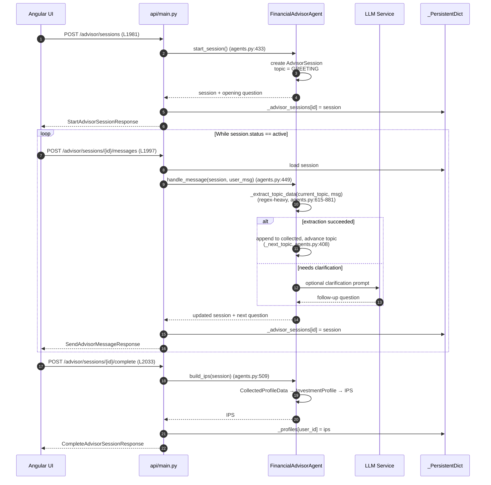
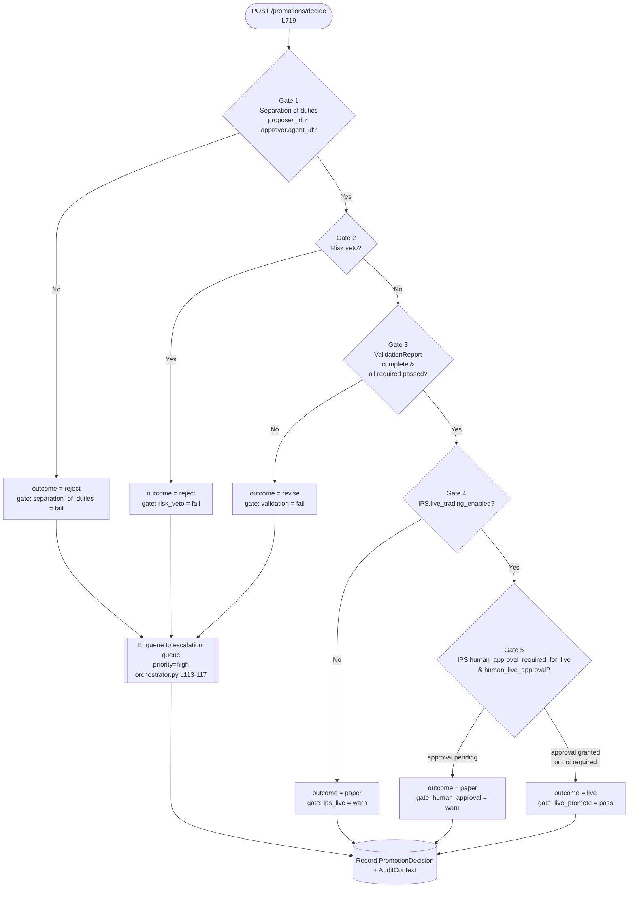
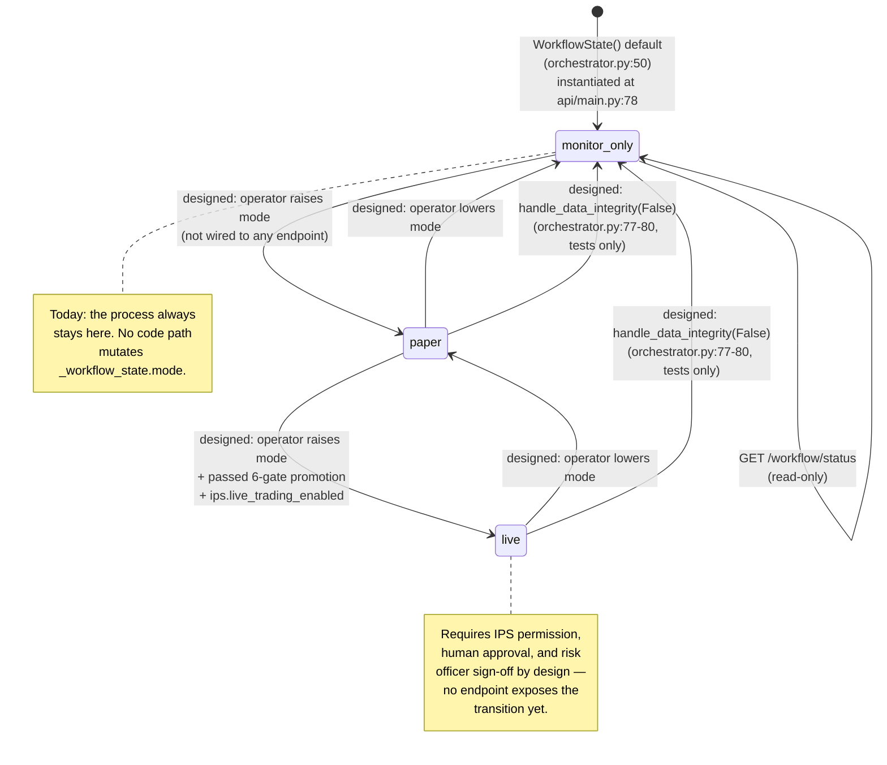

# Flow Charts — Investment Team

Four diagrams covering the most important end-to-end paths through the
investment team:

1. [Advisor session → IPS](#1-advisor-session--ips-flow) (sequence diagram)
2. [Strategy Lab batch run](#2-strategy-lab-batch-run-flow) (sequence diagram)
3. [Promotion-gate decision tree](#3-promotion-gate-decision-tree) (flowchart)
4. [Orchestrator workflow mode](#4-orchestrator-workflow-mode) (state diagram)

Line references point to [`api/main.py`](../api/main.py),
[`agents.py`](../agents.py), and [`orchestrator.py`](../orchestrator.py).

---

## 1. Advisor session → IPS flow

Conversational flow that walks a user through topics to accumulate a
`CollectedProfileData` object, converts it to an `InvestmentProfile`, and
wraps it in an `IPS`.



**Key notes**

- Regex extraction (≈266 lines in `agents.py`:615-881) is deliberately local /
  deterministic so profile data never leaves the process when building the
  IPS. This is flagged as HIGH-4 in
  [`../ARCHITECTURE_REVIEW.md`](../ARCHITECTURE_REVIEW.md) — a future local-LLM
  extractor is planned.
- Topic order is a strict DAG driven by `_next_topic`
  ([`agents.py`](../agents.py):408): `GREETING → RISK → HORIZON → INCOME →
  NET_WORTH → SAVINGS → TAX → LIQUIDITY → GOALS → PREFERENCES → CONSTRAINTS →
  REVIEW`.
- `build_ips` sets `IPS.default_mode` from collected preferences; typically
  `WorkflowMode.MONITOR_ONLY` so promotion is always opt-in.

---

## 2. Strategy Lab batch run flow

The long-running flow kicked off by `POST /strategy-lab/run`. The API returns
immediately with a `run_id`; a durable Temporal workflow runs the batch/cycle
loop and best-effort-publishes SSE events that the UI subscribes to. Strategy
Lab is **Temporal-only** — there is no thread-mode fallback (see
[`architecture.md`](./architecture.md)§7).

```mermaid
sequenceDiagram
    autonumber
    participant Client
    participant API as api/main.py
    participant BatchWF as StrategyLabBatchWorkflow
    participant CycleWF as StrategyLabCycleWorkflow<br/>(child, per cycle)
    participant SIE as SignalIntelligenceExpert
    participant Attempt as run_design_attempt_activity<br/>(runs the WHOLE per-attempt pipeline)
    participant Finalize as finalize_cycle_record_activity
    participant PTA as PaperTradingAgent
    participant LLM as LLM Service
    participant Store as _PersistentDict
    participant RunStore as investment_strategy_lab_runs<br/>(direct JobServiceClient)
    participant Bus as job_event_bus

    Client->>API: POST /strategy-lab/run (L1251)
    API->>BatchWF: start_workflow (503 if Temporal unreachable)
    API-->>Client: StrategyLabRunStartResponse (run_id)

    opt Real-time subscription
        Client->>API: GET /strategy-lab/runs/{run_id}/stream (L1550)
        API->>Bus: subscribe(run_id)
    end

    loop for each batch
        BatchWF->>SIE: compute_signal_brief_activity<br/>(once per batch-workflow invocation; a mid-batch<br/>resume re-runs it, so later cycles in that batch<br/>can see a different brief than earlier ones)
        SIE->>LLM: complete_json
        LLM-->>SIE: SignalIntelligenceBriefV1
        SIE-->>BatchWF: brief

        loop wave of cycles (bounded parallelism)
            loop start every cycle in the wave, before awaiting any
                BatchWF->>CycleWF: start_child_workflow(cycle_input incl. brief)
            end

            loop design-re-entry (bounded, on spec-implementability failure)
                CycleWF->>Attempt: run_design_attempt_activity
                Attempt->>LLM: design ↔ review → (custom code synthesis,<br/>if selected) → refinement → alignment →<br/>analysis (see generation_pipeline.md)
                LLM-->>Attempt: spec, and code/critiques/narrative<br/>from the agent stages that call it
                Attempt->>Attempt: compile_strategy() deterministically<br/>synthesizes code for the default DSL path<br/>(no LLM call)
                Attempt->>Attempt: execute strategy_code in the<br/>sandboxed TradingService — trade ledger<br/>is engine output, not an LLM response
                Attempt-->>CycleWF: record | reentry | skipped
            end

            CycleWF-->>BatchWF: cycle result (per child)
            Note over BatchWF,CycleWF: asyncio.gather() barrier — every child in the<br/>wave settles before any of them is finalized
            loop finalize each settled cycle, in cycle-index order
                BatchWF->>Finalize: finalize_cycle_record_activity
                opt publishable winner
                    Finalize->>PTA: run_session(strategy)
                    PTA-->>Finalize: PaperTradingSession
                end
                Finalize->>Store: persist StrategyLabRecord
                BatchWF->>Bus: publish_run_event_activity (best-effort)
                Bus-->>Client: SSE event
            end
        end
    end

    BatchWF->>RunStore: persist_run_state_activity<br/>(mark run complete)
    BatchWF->>Bus: publish_run_event_activity (run_complete)
    Bus-->>Client: SSE event (close)
```

**Key notes**

- `run_design_attempt_activity` runs the *entire* per-attempt pipeline
  (design ↔ review, code synthesis, refinement, trade alignment,
  verification, analysis, and record assembly) as a **single** Temporal
  activity — durability applies at attempt granularity, not per inner phase.
  See [`generation_pipeline.md`](./generation_pipeline.md) for what actually
  happens inside it, including the quality-gates catalog.
- There is no per-bar LLM call anywhere in this flow: the prior LLM-per-bar
  backtest path has been fully removed (`api/main.py::_run_real_data_backtest`
  now raises if a strategy has no compiled/synthesized `strategy_code`).
  Backtests execute deterministically through the sandboxed engine
  (`trading_service/`), the same execution path Strategy Lab and paper
  trading both use.
- `_active_runs` is an in-memory read cache kept in sync with the durable
  job-service record via `_reconcile_run_progress`, called by every read
  surface — so a restart or a stale cache never desyncs progress counters.
- `STRATEGY_LAB_SIGNAL_EXPERT_ENABLED` toggles the per-batch signal-expert
  step off for A/B comparison or cost control.
- Polling clients can use `GET /strategy-lab/runs/{run_id}/status` (L1534)
  instead of SSE — both surfaces read the same reconciled data.

---

## 3. Promotion-gate decision tree

Six-gate checklist from `PromotionGateAgent.decide`
([`agents.py`](../agents.py):131-302). Each gate either short-circuits to a
terminal outcome (`reject`), falls through to a softer outcome (`revise` /
`paper`), or continues to the next gate. Rejects and revises auto-enqueue to
the `escalation` queue in
[`orchestrator.py`](../orchestrator.py):113-117.



**Key notes**

- Every gate writes a `GateCheckResult(gate, result, details)` to
  `PromotionDecision.gate_results`, so the full trace survives in persistence
  (`investment_strategies` bucket) for audit.
- `PromotionDecision.audit: AuditContext` captures the snapshot ID,
  assumptions, and agent version that produced the decision.
- The gate is the **only** path between a validated strategy and paper/live
  execution — all tracks funnel through here.

---

## 4. Orchestrator workflow mode

`WorkflowMode` is the orchestrator's safety throttle. The diagram below
distinguishes **what is live today** (solid transitions implemented in
`api/main.py`) from **what is designed but not yet wired** (dashed
transitions defined on the orchestrator but only exercised by tests).



**Key notes**

- **Current behavior.** `_workflow_state = WorkflowState()` is created once
  at module import ([`api/main.py`](../api/main.py):78) and the dataclass
  default pins `mode = WorkflowMode.MONITOR_ONLY`
  ([`orchestrator.py`](../orchestrator.py):50). `GET /workflow/status`
  ([`api/main.py`](../api/main.py):756) and `GET /workflow/queues`
  ([`api/main.py`](../api/main.py):767) are the only endpoints that touch
  it, and both are read-only.
- **What is defined but not called.** `InvestmentTeamOrchestrator.bootstrap`
  ([`orchestrator.py`](../orchestrator.py):69-71) (which would copy
  `ips.default_mode` into the state) and `handle_data_integrity`
  ([`orchestrator.py`](../orchestrator.py):77-80) (which would degrade the
  mode and write `data_integrity_failed:degrade_to_monitor_only` to the
  audit log) are only invoked from
  [`tests/test_investment_team.py`](../tests/test_investment_team.py). No
  production path calls them, and there is no FastAPI `lifespan` wiring them
  to startup.
- **Why the dashed transitions still appear.** They document the orchestrator
  contract that downstream code is expected to adopt in Phase 0 of the
  migration roadmap in
  [`../ARCHITECTURE_REVIEW.md`](../ARCHITECTURE_REVIEW.md). Once wiring lands,
  the dashed edges become solid and the safe-degrade invariant is enforced at
  runtime rather than only in tests.
