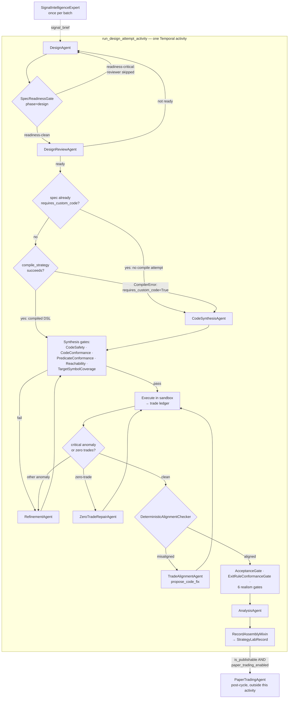

# Strategy Generation Pipeline — Inner Mechanics

This is the "how it all works together" deep dive: what actually happens
**inside** a single Strategy Lab design attempt, from a bare cycle request to
an assembled `StrategyLabRecord`. It complements, rather than duplicates,
[`strategy_lab_pipeline.md`](./strategy_lab_pipeline.md), which documents the
*outer*, SSE-facing cycle phases a UI client sees
(`ideating → fetching_data → backtest → aligning → analyzing →
paper_trading? → complete`). This document opens up what happens behind each
of those — in particular everything inside "ideating" (the design ↔ review
loop) and "backtest" (synthesis, refinement, verification) — and is the
companion to [`architecture.md`](./architecture.md)'s container view and §11
(orchestrator composition).

Everything below through "Record assembly" happens inside **one Temporal
activity**, `run_design_attempt_activity`
([`../strategy_lab/temporal/activities.py`](../strategy_lab/temporal/activities.py):935),
a thin wrapper around
`StrategyLabOrchestrator._run_design_attempt`
([`../strategy_lab/orchestrator_design.py`](../strategy_lab/orchestrator_design.py):1209-1452).
That activity's own scope ends at record assembly: it returns the assembled
`StrategyLabRecord` (JSON-dumped) to the calling `StrategyLabCycleWorkflow`
as `{"kind": "record", "record": ...}` — it does **not** persist that record
or run paper trading itself. Both of those happen one step later, in
`finalize_cycle_record_activity` (see "Batch / Temporal activity mapping"
below), which is the actual durable-write and paper-trading boundary.
Temporal's durability boundary for everything *inside* this document is the
*design attempt* itself, not any phase inside it — a worker crash mid-attempt
discards everything except a design-phase checkpoint (see "Design-attempt
checkpointing" in [`../strategy_lab/README.md`](../strategy_lab/README.md))
and the attempt restarts from the top on retry.

A file-reference note before diving in: `../strategy_lab/orchestrator.py`
defines the combined `StrategyLabOrchestrator` class itself — composed from
five mixins (see "Orchestrator composition" below) that each own one slice
of the pipeline. Most phase-specific logic below is cited to its owning
mixin file, but several top-level orchestration methods that don't belong to
any single phase — `_synthesize_initial_code` (the compiled-DSL-vs-custom-code
fork), `_run_realism_gates`, `_refine`/`_refine_or_exhaust`, `_run_alignment_audit`,
`_apply_updates` — live directly on `orchestrator.py` itself, not on a mixin.
Citations to `orchestrator.py` below mean that base class file specifically.

## The 4-phase contract

[`../strategy_lab/phases.py`](../strategy_lab/phases.py) defines the phase
enum every attempt moves through, in order:

```
DESIGN → DESIGN_REVIEW → CODE_SYNTHESIS → BACKTEST_AND_VERIFICATION
```

Each transition emits a `PhaseTransition` event (`phases.py`:148-184) carrying
`from_phase`, `to_phase`, a 64-char SHA-256 `spec_hash` (`hash_spec`,
`phases.py`:64-93 — canonical-JSON of the spec, deliberately excluding
`strategy_code`) and a 64-char SHA-256 `code_hash` (`hash_code`,
`phases.py`:96-109). This is a drift-detection mechanism: both hashes are
**boundary snapshots** taken at the moment their transition fires, not a
value pinned for the rest of the attempt. `spec_hash` is frozen post-design
apart from two carve-outs, both of which land between `DESIGN_REVIEW →
CODE_SYNTHESIS` and the following transition: `hash_spec` includes
`risk_limits`, and the refinement loop that runs before the `CODE_SYNTHESIS →
BACKTEST_AND_VERIFICATION` transition may accept a tighten-only `risk_limits`
update (`_apply_updates`); separately, `_synthesize_initial_code`
(`orchestrator.py`:810) tries `compile_strategy(spec)` first and, on a
`CompilerError` the mechanical-repair pre-flight didn't already catch, flips
`spec.requires_custom_code` to `True` before falling back to
`CodeSynthesisAgent` — and `hash_spec` excludes only `strategy_code`, not
`requires_custom_code`. Either carve-out means that next transition's
`spec_hash` can legitimately differ from the one recorded at
`DESIGN_REVIEW → CODE_SYNTHESIS`. From there the value is stable through the
terminal transition, since the trade-alignment loop's own `_apply_updates`
call never carries `risk_limits` updates (and `requires_custom_code` isn't
touched again after synthesis). `code_hash` is unchanged from `CODE_SYNTHESIS →
BACKTEST_AND_VERIFICATION` through the refinement loop that precedes that
transition, but the trade-alignment loop that follows it can still commit a
rewritten baseline (`_commit_alignment_proposal`), so the terminal
transition's `code_hash` can legitimately differ from the one recorded at
`CODE_SYNTHESIS → BACKTEST_AND_VERIFICATION` — that's an accepted, alignment-
driven rewrite, not drift. All four emission sites live in
`orchestrator_design.py`, in phase order: `DESIGN → DESIGN_REVIEW`
(642-649), `DESIGN_REVIEW → CODE_SYNTHESIS` (1960-1967),
`CODE_SYNTHESIS → BACKTEST_AND_VERIFICATION` (1577-1584), and the terminal
`BACKTEST_AND_VERIFICATION → None` (1756-1763) — the mixin that owns the
whole-attempt sequencer emits every transition, even though the phases
themselves execute across three different mixins (below).

## Design ↔ review loop (DESIGN → DESIGN_REVIEW)

Owned by `DesignMixin` (`orchestrator_design.py`). One round branches on
readiness (`_review_and_handle_critique`, `orchestrator_design.py`:1046):

```
DesignAgent.run/.revise → SpecReadinessGate (phase="design")
  → readiness-clean: DesignReviewAgent.run → (ready? done : revise)
  → readiness-critical: synthetic critique from the readiness findings
      (DesignReviewAgent is skipped — no LLM call this round) → revise
```

A critical `SpecReadinessGate` finding never reaches the reviewer: the round
synthesizes a critique from the readiness findings themselves and routes
straight to `DesignAgent.revise`, so only a readiness-clean spec ever costs
a `DesignReviewAgent` LLM call.

- **`DesignAgent`** (`../strategy_lab/agents/design.py`) authors the
  `StrategySpec` only — it never writes code. Before returning, it runs an
  internal **self-review** pass (`STRATEGY_LAB_DESIGN_SELF_REVIEW_ENABLED`,
  default on): a second LLM call audits prose ↔ predicate completeness and
  risk-math coherence, self-revises up to
  `STRATEGY_LAB_DESIGN_SELF_REVISION_ROUNDS` times, and re-audits each
  revision before returning — so a *successful* self-revision that
  introduced a fresh contradiction gets caught before the external reviewer
  ever sees it. This is best-effort, not a hard guarantee: if the final
  self-revision call or its re-audit itself fails, `_with_self_review`
  returns the current spec unchanged and explicitly defers the residual
  issue to the external `DesignReviewAgent` loop, which stays authoritative.
- **Mechanical-repair pre-flight** (`../strategy_lab/mechanical_repair.py`,
  gated by `STRATEGY_LAB_MECHANICAL_REPAIR_ENABLED`) runs before *every*
  review round — fully-determined, semantics-preserving fixes that never
  cost an LLM round. Two stages: unconditionally, coercing an intraday
  timeframe on an asset class with no intraday data and clamping
  `risk_limits.max_position_pct` to the shared ceiling; then, **only on a
  readiness-clean spec** (`orchestrator_design.py`:983-984), a trial
  `compile_strategy()` call that promotes a spec to
  `requires_custom_code=True` on `CompilerError` (or, inversely, demotes an
  over-elected custom-code spec back to the compiled path when it turns out
  to compile cleanly — `STRATEGY_LAB_DEMOTE_COMPILABLE_CUSTOM_CODE`). That
  second stage is readiness-gated because the compiler assumes structurally
  valid DSL — a readiness-defective spec can make `compile_strategy` raise a
  *non*-`CompilerError`. Only after mechanical repair exhausts its fixed
  scope does a critical fall through to `DesignAgent.revise`.
- **`SpecReadinessGate`** (`../strategy_lab/quality_gates/spec_readiness.py`) is the
  deterministic implementability check — sizing-coherence math, timeframe
  validity, DSL completeness — invoked at `phase="design"`
  (`orchestrator_design.py`:918) and re-checked at synthesis round 0.
- **`DesignReviewAgent`** (`../strategy_lab/agents/design_review.py`) reviews
  the spec plus the readiness gate's findings and emits a `SpecCritique` — it
  never revises the spec or writes code itself, only critiques.
- A `CritiqueLedger` assigns each critique a deterministic, content-derived
  `issue_id` and tracks the open blocking-issue set round over round. The
  loop is capped at `STRATEGY_LAB_DESIGN_REVIEW_ROUNDS` (default 20,
  short-circuits `status="failed: design_not_ready"` on exhaustion) and
  separately short-circuits early as `status="failed: design_stalled"` if the
  open-issue set is non-empty and unchanged for
  `STRATEGY_LAB_DESIGN_REVIEW_STALL_ROUNDS` consecutive rounds (default 3).
  The ledger also flags *regressions* — an issue resolved earlier that
  reappears — as an explicit "do not reintroduce" notice fed back into the
  next revision.
- Across cycles, a `ConvergenceTracker` (`../strategy_lab/quality_gates/convergence_tracker.py`)
  supplies stall/diversity/failure directives that get folded into the design
  prompt, and (when enabled) a once-per-cycle market-regime summary
  (`../strategy_lab/market_regime.py`, `STRATEGY_LAB_REGIME_SUMMARY_ENABLED`) helps the
  designer pick a setup archetype that fits current conditions.

Every numeric cap above is `STRATEGY_LAB_*`-tunable; the exhaustive reference
(exact defaults, worst-case LLM-call sizing, interplay between retries and
budgets) lives in
[`../strategy_lab/README.md`](../strategy_lab/README.md#environment-variables)
and is not repeated here.

## Code synthesis (CODE_SYNTHESIS)

`_synthesize_initial_code` (`orchestrator.py`:810-918) picks one of two paths
per spec:

- **Compiled DSL (default / preferred path)** — `compile_strategy(spec)`
  (`../strategy_lab/synthesis/compiler.py`:94) deterministically compiles the
  structured `entry_rules`/`exit_rules`/`sizing` DSL into a thin `on_bar`
  shim. All entry/exit decisions are made **engine-side** by
  `_EngineEntryDispatcher`/`_EngineExitDispatcher`
  (`../trading_service/service.py`), so the compiled path
  cannot drift from the spec the way hand-authored code can — it's "faithful
  by construction." Output is byte-identical for a given spec (a SHA-256
  content hash is embedded in the header; no `datetime.now()`/`uuid`/`id()`).
  `compile_strategy` raises `CompilerError` when the spec is outside the
  expressible subset (e.g. `volatility_target` sizing with no matching `atr`
  indicator), which is exactly the signal the mechanical-repair pre-flight
  above uses to promote a spec to the custom-code path *during design*,
  before synthesis ever has to discover it.
- **LLM custom code (`requires_custom_code=True`)** —
  `CodeSynthesisAgent.run(spec)` (`../strategy_lab/agents/code_synthesis.py`)
  authors the strategy's Python directly. This path is guarded by
  `CodeConformanceGate._check_custom_code_faithfulness` (indicator-source
  divergence, falsy guards on an indicator, invalid position attributes) and
  by the multi-layer look-ahead defenses documented in
  [`../strategy_lab/LOOK_AHEAD_DEFENCE.md`](../strategy_lab/LOOK_AHEAD_DEFENCE.md).

The full faithful-execution rationale for preferring the compiled path — and
exactly what guarantees the custom-code path still has to meet — is in
[`../strategy_lab/FAITHFUL_EXECUTION.md`](../strategy_lab/FAITHFUL_EXECUTION.md);
not repeated here.

## Refinement loop (still CODE_SYNTHESIS)

Owned by `SynthesisMixin` (`orchestrator_synthesis.py`), `_run_synthesis_loop`
(lines 286-590). Round 0 runs `SpecReadinessGate` at `phase="synthesis"`,
`CodeSafetyChecker`, `CodeConformanceGate`, and `PredicateConformanceGate`
against the just-synthesized code; a `PredicateReachabilityProbe` checks
whether the spec's predicates can actually fire against real market data
before a full backtest is even attempted. On a gate failure or a runtime
exception from executing the code in the sandbox, `RefinementAgent`
(`../strategy_lab/agents/refinement.py`) receives the concrete failure
(syntax error, gate finding, or anomaly) and rewrites the code — the spec
itself does not change here except for the tighten-only `risk_limits`
carve-out. The loop is capped at `STRATEGY_LAB_MAX_CODE_REFINEMENT_ROUNDS`
(default 50) with its own stall detector
(`STRATEGY_LAB_REFINEMENT_STALL_ROUNDS`); exhaustion sets
`backtest_status="failed: max_refinement_rounds"` rather than looping forever.
A **zero-trade backtest** (a strategy that compiles and runs but never
enters a position) is routed to
[`ZeroTradeRepairer`](../strategy_lab/zero_trade_repair.py)/[`ZeroTradeRepairAgent`](../strategy_lab/agents/zero_trade_repair.py)
ahead of the generic refinement path, since "why did this never fire" needs
different diagnosis than a runtime exception — the `coverage_probe/`
subsystem (static + runtime AST instrumentation) supplies the evidence for
that diagnosis.

## Trade-alignment loop (start of BACKTEST_AND_VERIFICATION)

Owned by `AlignmentMixin` (`orchestrator_alignment.py`), after the strategy
has produced a real trade ledger. Each round:

1. **`DeterministicAlignmentChecker`** (`../strategy_lab/quality_gates/alignment_checks.py`)
   evaluates the trade ledger against the structured `StrategySpec` across
   seven per-rule checks: universe, side, sizing (±1%), stop-loss compliance,
   take-profit compliance, entry-signal correlation, and — for specs with a
   `SignalExitRule` where the engine didn't attribute the close to a
   structured exit — signal-exit correlation (`_check_signal_exit`). Only
   five of the seven can actually fail: `_check_stop_loss` and
   `_check_take_profit` always record `passed=True, severity="info"` (a
   stop/take-profit is a trigger, not a price cap — a fill past the nominal
   threshold is expected market behavior, not a misalignment), so they never
   drive the `aligned`/`misaligned` verdict; engine-side stop/take-profit
   firing is instead verified deterministically by `ExitRuleConformanceGate`.
   A near-miss on the entry-signal check (within
   `STRATEGY_LAB_ALIGNMENT_NEAR_MISS_PCT`) routes to
   `TradeAlignmentAgent.adjudicate_near_miss` — a single-shot yes/no call,
   not a full re-audit.
2. If misaligned, `TradeAlignmentAgent.propose_code_fix` receives the
   structured findings (never raw trade-ledger prose) and returns a rewritten
   strategy file. The proposal is re-checked by `CodeSafetyChecker` at
   `phase="verification"` before being re-executed in the sandbox for a fresh
   backtest, and the loop repeats.

Capped at `STRATEGY_LAB_MAX_ALIGNMENT_ROUNDS` (default 10); reaching the cap
logs a warning and keeps the last-audited trades rather than failing the
cycle. The outer SSE-facing view of this loop (the `aligning` phase, its
sub-phase events) is already documented in
[`strategy_lab_pipeline.md`](./strategy_lab_pipeline.md) — this section adds
the mechanism, that doc keeps the wire-level summary.

## Verification & publication decision (rest of BACKTEST_AND_VERIFICATION)

Owned by `VerificationMixin` (`orchestrator_verification.py`):

- **Walk-forward acceptance** — `AcceptanceGate.check` (`../strategy_lab/quality_gates/acceptance_gate.py`)
  is a four-criteria check: deflated Sharpe, in-sample→out-of-sample
  degradation, minimum OOS trade count, and a regime-conditional pass
  (beats the configured benchmark in at least `min_regime_beats` of the
  regime subwindows, default 2 of 4) — across the backtest's walk-forward
  folds.
- **Exit-rule conformance** — `ExitRuleConformanceGate`
  (`../strategy_lab/quality_gates/exit_rule_conformance.py`) deterministically checks that
  engine-enforced exits actually matched `spec.exit_rules`.
- **Realism gates** run in fixed order (`orchestrator.py:685-749`,
  `_run_realism_gates`): `TargetSymbolCoverageGate` (backtest universe
  matches requested symbols), `CostStressRealismGate`, `LiquidityRealismGate`,
  `RegimeCoverageGate`, `TradeClusteringGate`, `RuleFiringRateGate`.

The **winner label** is a simple deterministic threshold —
`is_winning = execution_succeeded and trades and annualized_return_pct >= 8.0`
(`WINNING_THRESHOLD`, `../models.py`:30) — independent of every gate above. The
**publishable gate** is what actually decides paper-trading eligibility:
`is_publishable = is_winning and realism_passed and trades_aligned and
exit_rule_conformance_passed and not lookahead_violation`. Both the exact
veto-code ordering on a failed publishable gate and the full paper-trading
skip-reason table are already documented in
[`strategy_lab_pipeline.md`](./strategy_lab_pipeline.md) — see "Winner label
vs publishable gate" there rather than duplicating it here.

Analysis (`AnalysisAgent`, `../strategy_lab/agents/analysis.py`) runs last —
a single self-reviewing narrative draft describing why the strategy won or
lost, informed by every gate result above.

## Quality gates catalog

Every deterministic check in `../strategy_lab/quality_gates/` (23 of the
directory's 26 files — see the omission note below), with the phase that
invokes it:

| Gate / file | Phase | Purpose |
|---|---|---|
| `strategy_validator.py`: `StrategySpecValidator` | design (default `phase` for both the design-loop readiness check and the pre-synthesis call at `orchestrator_synthesis.py:203`) and synthesis (`zero_trade_repair.py:509` tags its re-validation of a repaired spec `phase="synthesis"`) | Deterministic field-level validation of `StrategySpec` |
| `spec_readiness.py`: `SpecReadinessGate` | design, re-checked at synthesis round 0 | The implementability gate that decides design-loop readiness (sizing coherence, timeframe validity, DSL completeness) |
| `code_safety.py` (+ `code_safety_ast.py`): `CodeSafetyChecker` | synthesis, and verification (alignment-proposal re-check) | AST + regex safety scan of generated strategy Python |
| `code_conformance/gate.py` (+ `ast_helpers.py`): `CodeConformanceGate` | synthesis | Deterministic spec→code conformance, incl. custom-code faithfulness checks |
| `predicate_conformance.py` (+ `predicate_conformance_fixtures.py`, `conformance_bars.py`): `PredicateConformanceGate` | synthesis, re-checked at verification | Pre-execution predicate-conformance shadow check against synthetic bars |
| `predicate_reachability.py`: `PredicateReachabilityProbe` | synthesis | Pre-backtest, data-driven check that spec predicates can actually fire |
| `backtest_anomaly.py`: `BacktestAnomalyDetector` | synthesis (per-round, `orchestrator_synthesis.py:938`), verification (unconditionally after every trade-alignment round, `orchestrator_alignment.py:653`; and again as the walk-forward-failure fallback recheck, `orchestrator_verification.py:357`) | Threshold-based anomaly detection over backtest results |
| `alignment_checks.py`: `DeterministicAlignmentChecker` | trade-alignment loop | The seven per-rule trade-alignment checks described above |
| `acceptance_gate.py`: `AcceptanceGate` | verification | Composite walk-forward acceptance (deflated Sharpe, IS/OOS degradation, OOS trade count, regime-conditional pass) |
| `exit_rule_conformance.py`: `ExitRuleConformanceGate` | verification | Deterministic conformance of engine-enforced exits to `spec.exit_rules` |
| `target_symbol_coverage.py`: `TargetSymbolCoverageGate` | synthesis (`check_fetch`/`check_trades`, critical failures fail the run closed before verification) and verification (`check_breadth`, softer check) | Backtest universe matches the requested target symbols |
| `cost_stress_realism.py`: `CostStressRealismGate` | verification | Realism under cost-stress multipliers |
| `realism/liquidity_realism.py`: `LiquidityRealismGate` | verification | Liquidity realism (fill participation vs volume) |
| `realism/regime_coverage.py`: `RegimeCoverageGate` | verification | Coverage across market regimes |
| `realism/trade_clustering.py`: `TradeClusteringGate` | verification | Detects unrealistic trade clustering |
| `realism/rule_firing.py`: `RuleFiringRateGate` | verification | Spec-rule firing-rate realism |
| `convergence_tracker.py`: `ConvergenceTracker` | recorded per-attempt inside `RecordAssemblyMixin` (`orchestrator_record_assembly.py:276` and `:399`, i.e. within the same `run_design_attempt_activity` activity as everything else); directives it derives are what carry *across* cycles, not the `record()` call itself | Stall/diversity/failure directives fed into design prompts |
| `universe_injection.py` | synthesis | Deterministic post-synthesis injection of the `UNIVERSE` constant |
| `models.py` | — | Shared `QualityGateResult` / `StrategyLabPhase` types (not a gate itself) |

`quality_gates/__init__.py` and its two subpackage markers
(`code_conformance/__init__.py`, `realism/__init__.py`) are omitted above.

## Record assembly (end of BACKTEST_AND_VERIFICATION)

Owned by `RecordAssemblyMixin` (`orchestrator_record_assembly.py`) — pure
assembly from already-computed state, no agent or gate calls of its own.
`_assemble_record` builds the happy-path `StrategyLabRecord`;
`_build_short_circuit_record` builds the equivalent for a cycle that never
reached a full backtest (budget exhausted, design stalled, spec
unimplementable after all re-entries). Module-level `_finalize_loop_telemetry`
merges the design-loop telemetry with whole-funnel gate pass/fail histograms
and derives the three-state `code_path`
(`"not_synthesized" | "compiled" | "custom"`) recorded on the record. The
drift ledgers (`spec_history`, `code_history`, `gate_timeline`,
`rule_implementation_map`) accumulate via the copy-on-entry/commit-on-completion
`_DriftCollector` (`_orchestrator_helpers.py`:322) — see
[`../strategy_lab/RETRY_STATE_ISOLATION.md`](../strategy_lab/RETRY_STATE_ISOLATION.md)
for exactly how that isolates one design attempt's drift from the next
attempt's, and from a Temporal activity retry of the same attempt.

## Orchestrator composition

`StrategyLabOrchestrator` composes five mixins by MRO (see
[`architecture.md`](./architecture.md)§11 for the summary table and the link
to [`../strategy_lab/MIXIN_BOUNDARIES.md`](../strategy_lab/MIXIN_BOUNDARIES.md)
for full boundary rationale). The whole-attempt sequence,
`_run_design_attempt` (`orchestrator_design.py`:1209-1452), calls across all
five in order:

```
DesignMixin (design ↔ review)
  → orchestrator._synthesize_initial_code (compiled DSL or CodeSynthesisAgent)
  → DesignMixin._orchestrate_refinement_and_alignment
      → SynthesisMixin (refinement loop)
      → AlignmentMixin (trade-alignment loop)
  → DesignMixin._orchestrate_verification_and_analysis
      → VerificationMixin (walk-forward, realism, publication veto)
      → orchestrator._run_analysis_phase (AnalysisAgent)
  → DesignMixin._extract_findings_and_assemble_record
      → RecordAssemblyMixin (final StrategyLabRecord)
```

## Batch / Temporal activity mapping

Every `@activity.defn` in
[`../strategy_lab/temporal/activities.py`](../strategy_lab/temporal/activities.py),
mapped to what it durability-wraps:

| Activity | Wraps |
|---|---|
| `compute_regime_summary_activity` | Current market-regime summary for the design prompt |
| `resolve_workflow_config_activity` | Resolves every env var the cycle-workflow control flow needs, once |
| `persist_run_state_activity` | Persists strategy-lab run/batch progress |
| `snapshot_prior_records_activity` | Reads the durable record store, sorted by creation time |
| `build_short_circuit_record_activity` | `StrategyLabOrchestrator._build_short_circuit_record` |
| **`run_design_attempt_activity`** | **The entire per-attempt pipeline above, verbatim** (`_run_design_attempt`) |
| `compute_signal_brief_activity` | Signal brief (`SignalIntelligenceExpert`), once per batch — see `architecture.md` §7 for the invocation-count nuance |
| `is_run_cancelled_activity` | Whether the run stopped for an external reason |
| `external_terminal_status_activity` | The run's persisted external stop status, if any |
| `finalize_cycle_record_activity` | Post-`run_cycle` tail: signal-brief attach + paper-trade (`PaperTradingAgent`) + persist |
| `merge_wave_results_activity` | Folds a completed wave's results into the batch-level `ConvergenceTracker` |
| `publish_run_event_activity` | Best-effort SSE publish (fire-and-forget UX side-channel) |

`StrategyLabCycleWorkflow` calls `run_design_attempt_activity` in a loop
bounded by `MAX_DESIGN_REENTRIES` (2) — the *outer* design-re-entry loop is
the only part of this pipeline actually expressed as durable workflow code;
everything from "Design ↔ review loop" through "Record assembly" above runs
inside that one activity call. `StrategyLabBatchWorkflow` calls
`compute_signal_brief_activity` once per batch (see `architecture.md` §7 —
"Temporal-only dispatch" — for the full invocation-count nuance, including
the mid-batch resume case), then fans a wave of cycles out as
`StrategyLabCycleWorkflow` child workflows before awaiting them together,
then calls `finalize_cycle_record_activity` per settled result.

## At a glance


