# Market Data & Trading Data Flow — Strategy Lab / Investment Team

How the Strategy Lab **acquires** financial data, which **providers** it uses,
what each provides, and how that data is **ingested / streamed into the trading
engine** for **backtesting** and **paper trading**.

This document is the data-layer companion to the existing system-design set:
- [`architecture.md`](./architecture.md) — container view of the whole team
- [`system_design.md`](./system_design.md) — API router + domain models
- [`pr2_live_data_and_paper_cutover.md`](./pr2_live_data_and_paper_cutover.md) — the live-feed / paper cut-over spec
- [`../strategy_lab/LOOK_AHEAD_DEFENCE.md`](../strategy_lab/LOOK_AHEAD_DEFENCE.md) — the four-layer look-ahead defence

> **Audience:** a software engineer who needs to understand where price data
> comes from and how it reaches the simulator.
>
> **Reference convention:** every claim is anchored to a `symbol` `file.py:line`
> pair — a function, method, class, or route. The **symbol name is the durable
> anchor**; line numbers drift as the code evolves, so if a `:line` no longer
> matches, grep the symbol to relocate it.

---

## TL;DR

- The team runs **three independent data planes**, each with its own providers
  and its own job:
  1. **Context plane** — `market_lab_data/` → a free macro/FX/crypto *snapshot*
     that flavours the LLM ideation prompt. **Not** price bars for trading.
  2. **Historical-OHLCV plane** — `market_data_service.py` → the multi-source
     OHLCV fetcher (Yahoo → Twelve Data → CoinGecko / Alpha Vantage) that
     feeds **backtests** and **legacy paper trading**. **This is the workhorse
     today.**
  3. **Streaming plane** — `trading_service/providers/` → a pluggable
     `ProviderAdapter` registry (Binance / Coinbase / Alpaca / OANDA free
     defaults + Polygon / Databento / Twelve Data paid) for **live paper
     trading** and provider-driven **sub-daily** backtests.
- Everything converges on **one engine contract**: an iterable of
  `StreamEvent`s (`BarEvent` ⨉ N + a terminal `EndOfStreamEvent`) consumed by
  `TradingService.run(stream)`. **Backtest and paper trade share the exact same
  engine** — only the *stream object* and its *pace* differ.
- **Look-ahead is structurally impossible**: the strategy runs in an isolated
  subprocess that is handed exactly one bar at a time and has no accessor for
  future data; the fill simulator's one-bar-forward peek lives only in the
  parent process.
- **Implementation status matters.** Plane 2 is fully wired and is what daily
  backtests/paper-trades use. Plane 3 is the newer streaming path; of its
  adapters **only Binance is wired end-to-end today**, and the live path is
  gated behind `INVESTMENT_LIVE_PAPER_ENABLED` (default **off**). See
  [§9](#9-implementation-status-and-caveats).

---

## 1. The three data planes

| Plane | Module | Providers | Produces | Consumed by | Status |
|---|---|---|---|---|---|
| **1 · Context snapshot** | `market_lab_data/` (`FreeTierMarketDataProvider`) | Frankfurter (FX), FRED `DGS10` (optional), Yahoo/`yfinance` (BTC/ETH spot) | `MarketLabContext` — a short text brief (`fx_rates`, `macro_snippets`, `crypto_snapshot`) | `SignalIntelligenceExpert` → LLM ideation prompt | ✅ wired |
| **2 · Historical OHLCV** | `market_data_service.py` (`MarketDataService`) | Yahoo Finance → Twelve Data → CoinGecko (crypto) / Alpha Vantage (non-crypto, key-gated) | `List[OHLCVBar]` per symbol (daily) | **Backtests**, **legacy paper trade** (via `HistoricalReplayStream`) | ✅ wired |
| **3 · Streaming feed** | `trading_service/providers/` (`ProviderAdapter` registry) | Binance, Coinbase (crypto) · Alpaca (equities) · OANDA (fx) · Polygon, Databento, Twelve Data (paid) | `BarEvent` (historical) / `NativeEvent` ticks+bars (live) | **Live paper trade** (`LiveStream`+`Resampler`), provider-driven **sub-daily backtest** (`CachingProviderHistoricalStream`) | ⚠️ partial — only Binance fully wired; live path flag-gated |

### Container view (data-focused)

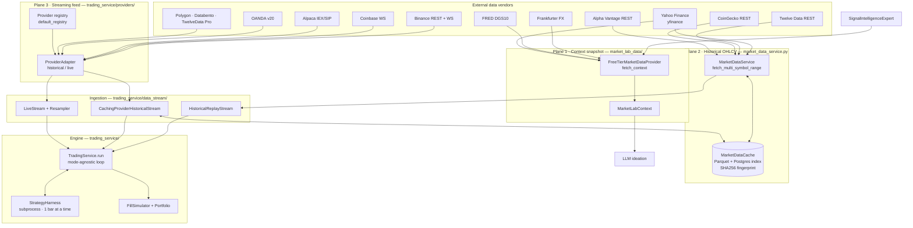

---

## 2. Provider inventory

### 2.1 Plane 1 — context snapshot (`market_lab_data/`)

`FreeTierMarketDataProvider.fetch_context()` builds one `MarketLabContext` per
ideation, degrading gracefully under a wall-clock budget. It is **not** a
trading feed — it produces a few lines of prompt context, never OHLCV bars.

| Source | Vendor / endpoint | Provides | Key | Code |
|---|---|---|---|---|
| FX rates | **Frankfurter** `api.frankfurter.dev/v1/latest` | USD→EUR/GBP/JPY/CHF/CAD/AUD → `fx_rates` | none | `fetch_context` `free_tier.py:88` |
| Macro | **FRED** `series/observations` `DGS10` | US 10Y Treasury yield → `macro_snippets` | optional `FRED_API_KEY` (skipped if unset) | `fetch_context` `free_tier.py:107` |
| Crypto spot | **Yahoo Finance** via `yfinance` (`BTC-USD`, `ETH-USD` `fast_info.last_price`) → `crypto_snapshot` | none | `fetch_context` `free_tier.py:131` |

> **Doc drift to be aware of:** the README and `architecture.md` say the crypto
> snapshot comes from *CoinGecko*; the code (`free_tier.py:131-144`,
> `sources.append("yahoo_crypto")`) uses **`yfinance`**. The code is
> authoritative.

Tuning: `STRATEGY_LAB_MARKET_DATA_PROVIDER` (only `free_tier` exists),
`STRATEGY_LAB_MARKET_DATA_FETCH_TIMEOUT_SEC` (8.0), `STRATEGY_LAB_MARKET_DATA_CACHE_TTL_SEC`
(120.0), `STRATEGY_LAB_SIGNAL_EXPERT_ENABLED`.

### 2.2 Plane 2 — historical OHLCV (`MarketDataService`)

`MarketDataService` is the OHLCV workhorse: it fetches **daily** bars with a
multi-source fallback chain, normalises/repairs them, and persists them in a
content-addressed cache. Public surface (all in `market_data_service.py`):

| Method | Line | Purpose |
|---|---|---|
| `fetch_ohlcv(symbol, asset_class, days)` | `:224` | recent N days for one symbol |
| `fetch_ohlcv_range(symbol, asset_class, start, end, *, as_of, frequency)` | `:256` | dated range; routes through the cache |
| `fetch_multi_symbol_range(symbols, asset_class, start, end, …)` | `:432` | the method `HistoricalReplayStream.from_market_data_service` calls |
| `avg_dollar_volume_20d(...)` | `:303` | ADV for liquidity realism |
| `resolve_strategy_symbols(spec)` | `:354` | universe: explicit `target_symbols` else asset-class default (capped) |

**Provider chain** — `_get_named_provider_chain(asset_class)` (`:519`):

| Asset class | Chain (first non-empty wins) | Key |
|---|---|---|
| crypto | Yahoo → Twelve Data → CoinGecko | none (CoinGecko is crypto-only) |
| everything else | Yahoo → Twelve Data → *Alpha Vantage* | Alpha Vantage only if `ALPHA_VANTAGE_API_KEY` set (`:536`) |

| Vendor | Asset classes | Retries / backoff | Code |
|---|---|---|---|
| **Yahoo Finance** (`yfinance`, `auto_adjust=True`) | all | `max_retries=3`, `2**(attempt+1)` backoff on error/empty | `_fetch_yahoo` `:544` |
| **Twelve Data** (REST, `1day`, `outputsize=5000`) | stocks/fx/crypto/commodities | `max_retries=2`, HTTP 429 backoff | `_fetch_twelve_data` `:622` |
| **CoinGecko** (`/market_chart`, daily buckets) | crypto only | `max_retries=2`, 429 backoff | `_fetch_coingecko` `:695` |
| **Alpha Vantage** (REST) | non-crypto, key-gated | single attempt | `_fetch_alphavantage` `:782` |

### 2.3 Plane 3 — streaming registry (`trading_service/providers/`)

All adapters implement one Protocol — `ProviderAdapter` (`providers/base.py:64`)
— so the stream layer treats them identically. All methods are **synchronous
iterators** (a WS or REST loop is hidden behind the generator):

```python
class ProviderAdapter(Protocol):                                # base.py:64
    capabilities: ProviderCapabilities
    def smallest_available(self, asset_class, *, live) -> Optional[str]: ...   # :74
    def historical(self, *, symbols, asset_class, start, end, timeframe) -> Iterator[BarEvent]: ...  # :83
    def live(self, *, symbols, asset_class, native_timeframe) -> Iterator[NativeEvent]: ...          # :95
```

`ProviderCapabilities` (`base.py:36`) carries `name`, `supports ⊆ {crypto,
equities, fx}`, `is_paid`, `historical_timeframes`, `live_timeframes`, and
`implemented` (paid stubs set `False` so a stray key can't route a user into a
`NotImplementedError`).

| Adapter | Vendor | Asset class | Paid? | Historical TFs | Live TFs | Auth env | Wired end-to-end? |
|---|---|---|---|---|---|---|---|
| `BinanceAdapter` `binance.py:52` | Binance public | crypto | no | 1s–1d | tick,1s,15s,1m | none (keyless) | **✅ REST klines + WS** |
| `CoinbaseAdapter` `coinbase.py:31` | Coinbase Exchange | crypto | no | 1m–1d | tick,1m | none | ⚠️ stub (geo-failover target) |
| `AlpacaAdapter` `alpaca.py:29` | Alpaca IEX/SIP | equities | no (IEX) | 1m–1d | tick,1m | `ALPACA_API_KEY_ID`,`ALPACA_API_SECRET_KEY`,`ALPACA_PAID_FEED` | ⚠️ auth-checked stub |
| `OandaAdapter` `oanda.py:28` | OANDA v20 practice | fx | no | 5s–1d | tick | `OANDA_API_TOKEN`,`OANDA_ACCOUNT_ID` | ⚠️ stub |
| `PolygonAdapter` `polygon.py:29` | Polygon.io | crypto/equities/fx | yes | 1s–1d | tick,1s,1m | `POLYGON_API_KEY` | ⚠️ `implemented=False` |
| `DatabentoAdapter` `databento.py:28` | Databento | equities | yes | 1s–1d | tick,1s,1m | `DATABENTO_API_KEY` | ⚠️ `implemented=False` |
| `TwelveDataAdapter` `twelve_data.py:30` | Twelve Data Pro | crypto/equities/fx | yes | 1m–1d | 1m | `TWELVE_DATA_API_KEY`,`TWELVE_DATA_PLAN=pro` | ⚠️ `implemented=False` |

Binance specifics: REST `GET /api/v3/klines` paginated by 1000-row windows
(`binance.py:107`); live WS combined stream `@trade` (tick) / `@kline_<tf>`
(`binance_ws.py:114`), pumped on a background thread bridged to a sync generator
via `queue.Queue` (`binance_ws.py:189`). HTTP/WS **451** raises
`ProviderRegionBlocked` to trigger the Binance→Coinbase failover.

**Symbol normalisation.** Adapters normalise inline (e.g. Binance
`symbol.upper().replace("-","")`). A standalone helper
`data_providers/symbol_maps.py` provides Twelve Data / Alpha Vantage ticker
tables (e.g. `BTC → BTC/USD`, `EURUSD=X → EUR/USD`, `ES=F → ES`) but is **not**
wired into the registry — adapters that use it call it directly.

---

## 3. Provider registry & selection (Plane 3)

The process-wide registry is a lazy singleton, `default_registry()`
(`providers/__init__.py:24`, `@lru_cache(maxsize=1)`). **Registration order is
load-bearing**: paid providers register first (so a configured key wins) but
only activate when `implemented=True`.

```
crypto    → default: binance      secondary (geo-failover): coinbase
equities  → default: alpaca
fx        → default: oanda
paid      → polygon, databento, twelve_data   (key-gated, implemented=False today)
```

### Selection precedence — `_pick(asset_class, direction)` (`registry.py:210`)

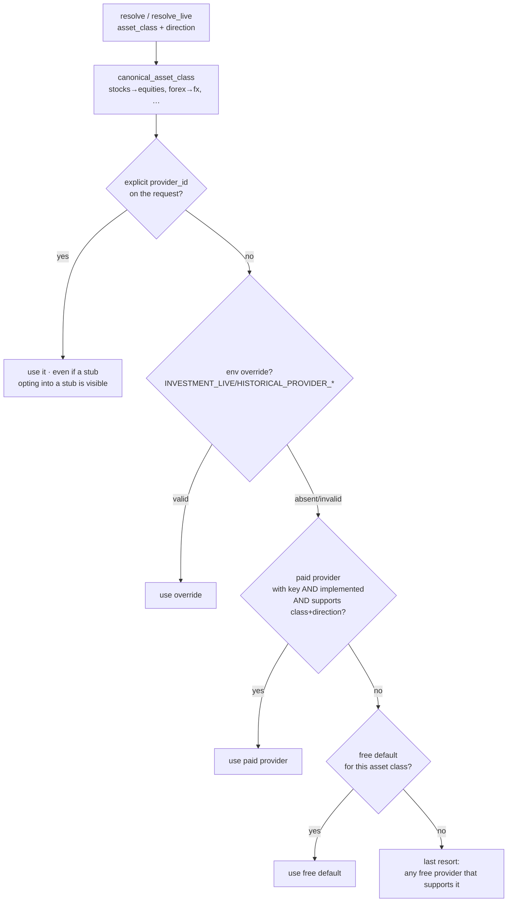

**The five precedence levels** (`_pick`, `registry.py:210-278`), highest first:

| # | Level | Condition | Code |
|---|---|---|---|
| 1 | **Explicit pin** | the request carries `provider_id` (e.g. `RunPaperTradeRequest.provider_id`) → used unconditionally, *even if it is an unimplemented stub* (so opting into a stub is visible, never silently swapped) | `_resolve_pinned` `:280` |
| 2 | **Env override** | `INVESTMENT_LIVE_PROVIDER_{CRYPTO,EQUITIES,FX}` (live) / `INVESTMENT_HISTORICAL_PROVIDER_{…}` (historical) names a registered provider; a misconfigured value logs a warning and falls through | `:222-239`, name built by `_env_var_name` `:298` |
| 3 | **Paid + key** | a provider that is `is_paid` **and** `implemented` **and** `supports` the class **and** has the direction **and** has `os.environ[api_key_env]` set | `:248-264` |
| 4 | **Free default** | the registration whose `default_for` includes the asset class | `:267-269` |
| 5 | **Last resort** | any free provider that supports the class + direction | `:272-276` |

- **Direction gating** — `_has_direction` (`:315`): *historical* requires a
  non-empty `historical_timeframes`; *live* requires a non-empty
  `live_timeframes`. A provider that can't serve the requested direction is
  skipped at every level.
- **Asset-class normalisation** — `canonical_asset_class` / `_ASSET_CLASS_ALIASES`
  (`:37-59`) maps caller labels to the canonical `{crypto, equities, fx}`
  vocabulary *before* selection: `stock/stocks/equity/equities → equities`,
  `forex/fx → fx`, `crypto/cryptocurrency/… → crypto`; unknown values pass
  through unchanged.
- Because **paid providers register first** (`__init__.py:24-77`) and are gated on
  `implemented`, today — with Polygon/Databento/Twelve Data at
  `implemented=False` — level 3 is dormant and selection falls to the free
  defaults: `binance.build` (`default_for=["crypto"]`), `coinbase.build`
  (`secondary_for=["crypto"]`), `alpaca.build` (`default_for=["equities"]`,
  `api_key_env="ALPACA_API_KEY_ID"`), `oanda.build` (`default_for=["fx"]`,
  `api_key_env="OANDA_API_TOKEN"`).
- `describe_all()` (`:125`) serialises the whole registry (name, supports,
  is_paid, has_key, implemented, is_default_for, timeframes) for
  `GET /api/investment/providers`.

### Geo-failover (crypto live, open-time only)

`resolve_live` (`:171-206`) returns a `LiveResolution` (`:321`) carrying a
`primary` plus an optional `fallback` — the registration whose `secondary_for`
includes the class (**only coinbase**, for crypto). The fallback is used **only**
when the request is unpinned and **only** if the primary raises
`ProviderRegionBlocked` *before the first bar is accepted*. After the first live
bar there is no failover — a disconnect terminates the session
("one adapter per session").

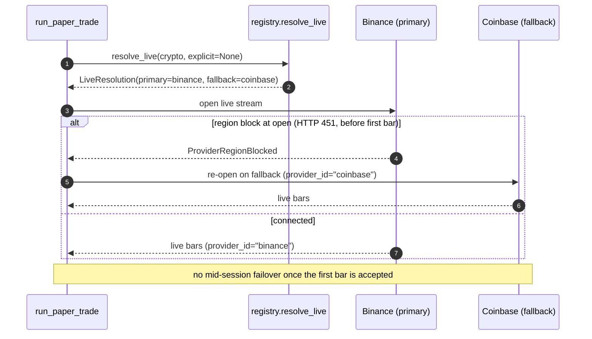

---

## 4. The engine contract — one stream, two modes

Everything funnels into a single iterator contract
(`trading_service/data_stream/protocol.py`):

```python
class BarEvent(BaseModel):      # protocol.py:18
    bar: Bar
    is_warmup: bool = False     # warm-up bars build indicators; fills suppressed

class EndOfStreamEvent(BaseModel):  # protocol.py:30  — emitted once, last
    reason: str = "end_of_data"

StreamEvent = Union[BarEvent, EndOfStreamEvent]          # :36

class MarketDataStream(Protocol):                        # :39
    def __iter__(self) -> Iterator[StreamEvent]: ...     # synchronous generator
```

`TradingService.run(stream, *, on_trade=None)` (`service.py:2351`) consumes that
iterator one event at a time. It is **mode-agnostic** — it never knows whether
the stream is historical or live. The mode layer decides which stream object to
build:

| | Backtest | Paper trade |
|---|---|---|
| Entry | `run_backtest` `modes/backtest.py:49` | `run_paper_trade` `modes/paper_trade.py:123` |
| Stream | `HistoricalReplayStream` (pre-fetched dict) **or** `CachingProviderHistoricalStream` (provider, sub-daily) | `LiveStream` + `Resampler` |
| Pace | **instant** — eager in-memory generator | **real-time** — blocks on each live event |
| Warm-up | none (`is_warmup=False`) | `warmup_bars` (default 500) tagged `is_warmup=True` |
| Termination | `EndOfStreamEvent` | ≥ `min_fills` (20) · user stop · `max_hours` (72h) |
| Unfilled policy | `REQUEUE_NEXT_BAR` (surface exposure) | `DROP` (mirror a real exchange) |
| `on_trade` | not passed | `lambda: fill_counter.increment()` drives `min_fills` |
| Engine | **identical** `FillSimulator`/`Portfolio`/`OrderBook`/subprocess | **identical** |

---

## 5. Ingestion & streaming architecture

### 5.1 Two historical routes, one contract

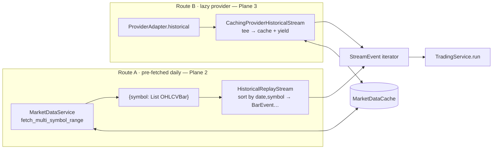

- **Route A** — `HistoricalReplayStream` (`historical_replay.py:24`) flattens
  `{symbol: [OHLCVBar]}` into one timeline **sorted by `(date, symbol)`** and
  yields one `BarEvent` per bar, then `EndOfStreamEvent` (`__iter__` `:42-67`).
  This is the single place future-vs-past sequencing is enforced for backtests.
- **Route B** — `CachingProviderHistoricalStream` (`market_data_cache/streaming.py:46`)
  wraps a provider's `historical()`: on a full cache hit it replays parquet; on
  a miss it tees each `BarEvent` into per-symbol buffers, yields them, and
  persists a snapshot at `EndOfStreamEvent`. This is what unlocks **sub-daily**
  backtests without touching `MarketDataService`.

### 5.2 Live stream + resampler (paper trade)

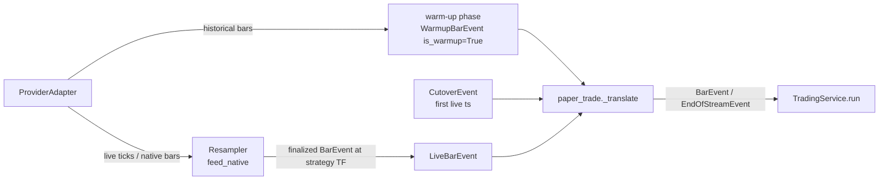

- `LiveStream.events()` (`live_stream.py:132`) runs two phases:
  `_warmup()` pulls historical bars at the strategy timeframe and tags them
  `is_warmup=True`; `_live()` captures the **cut-over timestamp** from the first
  live event, then pipes provider-native events through the `Resampler`.
- The `Resampler` (`resampler.py`) builds OHLCV at the strategy timeframe from
  ticks or smaller native bars, enforcing three invariants: **only finalized
  bars leave** (emitted only after a later native event arrives), **monotonic
  timestamps** (out-of-order prints dropped), and **no fabricated bars in gaps**.
  It only *upscales* (1m→5m→1d), never downscales.
- `paper_trade._translate` (`paper_trade.py:356`) converts `LiveStreamEvent`s
  into engine `StreamEvent`s, **dropping any warm-up/late bar with
  `ts < cutover_ts`** — the guardrail enforcing "live data only during the live
  phase". Live bars are **not** cached; the warm-up window is fingerprinted and
  snapshotted at cut-over.

#### Resampler internals — tick → candle (`resampler.py`)

The resampler turns a provider's *native* feed into clean `BarEvent`s at the
strategy's timeframe. Native events are a small union — `NativeTick` (`:39`;
carries `ts` / `price` / `size`) and `NativeBar` (`:48`; carries OHLCV) — fed in
one at a time through `feed_native(event) -> Iterator[BarEvent]` (`:174`).
Per symbol it keeps one `_partial` bar under construction (`:157`) and a
`_watermark` = the highest bar-end epoch already emitted (`:161`);
`ResamplerStats` (`:131`) counts `bars_emitted` and `out_of_order_dropped`.

**Interval alignment.** Every timestamp is snapped to a clock-aligned bucket:
`bar_start = (ts // target_seconds) · target_seconds` (`_interval_for`
`:328-337`), so a 5m bar always closes on `:00 / :05 / :10 / …`.
`target_seconds` comes from `_TIMEFRAME_SECONDS` / `timeframe_to_seconds()`
(`:69`, `:84`).

**Tick → candle** (`_feed_tick` `:197-231`) aggregates ticks into the enclosing
interval:

| Field | Rule |
|---|---|
| `open` | price of the **first** tick in `[bar_start, bar_end)` |
| `high` / `low` | running `max` / `min` of tick prices in the interval |
| `close` | price of the **last** tick in the interval |
| `volume` | `Σ size` of the ticks in the interval |

**Native bar → candle** (`_feed_native_bar` `:237-322`) only ever **upscales**:
it asserts the native timeframe is `<=` the target **and evenly divides** it
(raises otherwise, `:246-256`) — `1m → 5m → 1d` is allowed, the reverse is not
(downscaling would require intrabar data the engine refuses to fabricate). If
native `==` target it is a direct passthrough (`:272-295`); otherwise the native
bar is folded into the target partial and finalized when it lands on a target
boundary (`:298-322`).

**Finalization & the no-look-ahead guarantee** (`_finalize` `:339-362`). A bar
is emitted **only after a later native event proves its interval has closed** —
the resampler never emits a partial/in-progress candle, so neither the engine
nor the strategy can ever see an unfinished bar. On emit it advances the
`_watermark` (`:353`), clears the partial, and bumps stats. Two corollaries:

- **Out-of-order is dropped, not merged.** A native event whose interval already
  closed (`bar_end <= watermark`) is discarded and counted (`:202-205`) — a late
  print can never rewrite an emitted bar.
- **Gaps stay gaps.** An interval with no ticks yields **no bar** (not a
  zero-volume placeholder), so a halt / illiquid window surfaces as a missing
  bar rather than a fake one. And `flush_on_end()` (`:183-191`) emits nothing — a
  still-open partial at end-of-stream is discarded, preserving "only finalized
  bars leave."

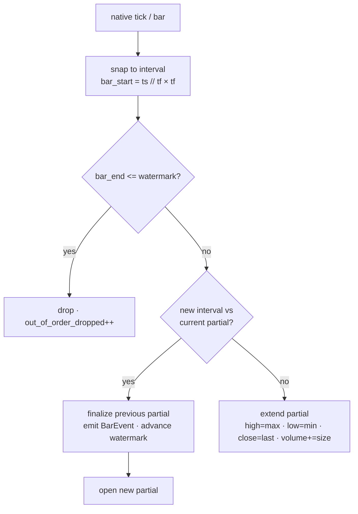

> **Worked tick example** — target `1m`; ticks `10:00:05 @100 size 3`,
> `10:00:40 @101 size 1`, `10:00:55 @99 size 2`, then `10:01:10 @100`. The first
> three share the `10:00` bucket; the `10:01:10` tick opens a new bucket and so
> **finalizes** the `10:00` bar as `open=100, high=101, low=99, close=99,
> volume=6`, advancing the watermark past `10:01:00`. The `10:00` bar is emitted
> only at that point — never before its minute is provably complete.

### 5.3 The market-data cache

`MarketDataCache` (`market_data_cache/store.py`) makes fetches durable and
backtests reproducible:

- **Format:** immutable **Parquet** snapshots on disk, one per
  `(asset_class, symbol, frequency, provider, fetch_date)` —
  `cache_root()/asset_class/symbol/frequency/provider/{fetch_date}.parquet`
  (`paths.py:46`). `cache_root()` resolves
  `INVESTMENT_MARKET_DATA_CACHE_ROOT` → `${AGENT_CACHE}/investment_team/market_data`
  → tempdir (with a "reproducibility lost" warning).
- **Index:** a Postgres table `investment_market_data_snapshots`
  (`market_data_cache/postgres/__init__.py`) with an in-memory fallback when
  `POSTGRES_HOST` is unset.
- **Key / fingerprint:** SHA-256 over chronologically sorted
  `date|open|high|low|close|volume` (`_hash_bars` `store.py:192`);
  `compute_dataset_fingerprint` (`:221`) is the symbol-order-independent
  multi-symbol hash stored on `BacktestResult.dataset_fingerprint`.
- **Retrieval (hit/miss):** `get_or_fetch` (`:612`) and the parallel
  `get_or_fetch_multi` (`:668`, `ThreadPoolExecutor` sized by
  `MARKET_DATA_FETCH_WORKERS`). It first asks `_find_covering_snapshot` (`:445`)
  for a snapshot whose `[start, end]` brackets the request and whose
  `fetch_ts <= as_of` (Postgres `SELECT … ORDER BY fetch_ts DESC LIMIT 1`, with
  the in-memory index as fallback). **Hit** → read the parquet, reconcile the
  SHA-256, trim to `[start, end]`, return. **Miss** → call `fetch_fn`
  (= `MarketDataService._fetch_with_providers`, i.e. the vendor chain) exactly
  once, skip if empty, canonicalise volumes, then write the immutable snapshot +
  index row. `as_of` makes this a point-in-time fetch (no future-dated snapshot
  can satisfy an older `as_of`).
- **Determinism detail:** non-finite volume is canonicalised to `0.0` at *every*
  boundary (fetch, replay, parquet write/read, fingerprint, streaming tee) so a
  first run and its cached replay are byte-identical.

### 5.4 Data quality & bar safety

- `execution/data_quality.py` — `validate_market_data(...)` (`:324`) is a pure
  preflight validator: duplicate timestamps, NaN/negative prices, OHLC-invariant
  violations (asset-class-aware epsilon), zero-volume (skipped for FX), volume
  z-score outliers, frequency inference, and calendar gaps. `strict` raises
  `DataIntegrityError`; backtests run it in `warn` mode and stash
  `last_quality_report`. `LiveGapMonitor` (`:827`) is the paper-trade watchdog.
- `execution/bar_safety.py` — `BarSafetyAssertion.check_fill(...)` (`:107`) is
  the parent-side belt-and-suspenders guard: it raises `LookAheadError` if a
  fill timestamp is `<=` the order's submission timestamp.

### 5.5 End-to-end: how a source is retrieved and streamed into the engine

Putting retrieval, streaming, and the engine pull together — this is the spine
of the whole document:

1. **Resolve symbols** — `MarketDataService.resolve_strategy_symbols(spec)`
   (`market_data_service.py:354`): explicit `spec.target_symbols`, else the
   asset-class default universe (capped by `STRATEGY_LAB_MAX_UNIVERSE_SYMBOLS`).
2. **Retrieve OHLCV** — `fetch_multi_symbol_range(...)` →
   `cache.get_or_fetch_multi`. Per symbol: a cache hit replays parquet; a miss
   runs the **vendor fallback chain** (`_get_named_provider_chain`, §2.2) where
   the first non-empty result wins, then the bars are normalised/repaired and
   snapshotted (§5.3).
3. **Wrap as a stream** — the mode layer builds a `MarketDataStream`:
   `HistoricalReplayStream` from the pre-fetched dict (backtest, daily),
   `CachingProviderHistoricalStream` from a provider (sub-daily backtest), or
   `LiveStream` + `Resampler` from a live adapter (paper). All three emit the
   same `BarEvent … EndOfStreamEvent` sequence.
4. **Pull into the engine** — `TradingService.run` drives a `while True` loop
   that calls `event = next(event_iter, None)`
   **once per iteration, one bar at a time**, breaking on
   `None`/`EndOfStreamEvent`. The engine never holds the whole series —
   it only ever sees the current bar (plus a parent-side `next_bar` peek used by
   fills, never by the strategy).
5. **Per bar** → submit prior-bar orders, simulate fills (§6), mark-to-market,
   deliver the bar to the strategy subprocess (§6.3).

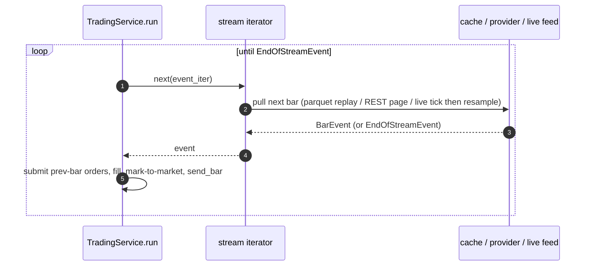

The key property: **retrieval is eager for backtests** (the whole dataset is
fetched and cached up front, then replayed from memory) but **lazy for live
paper trading** (each bar is pulled from the websocket/REST feed as it arrives
and resampled on the fly) — yet the engine loop is identical, because both sides
honour the same `StreamEvent` iterator contract.

---

## 6. How a bar drives the engine

### 6.1 The unified run loop (`TradingService.run` `service.py:2351`)

Per `BarEvent` (non-warm-up), the loop:

1. peeks the next same-symbol bar into `next_bar` (the one-bar-forward input);
2. submits orders the strategy queued on the **previous** bar against the
   **current** bar (`pending_for_prev` → `OrderBook.submit`) — *the look-ahead
   boundary*;
3. **turns the bar into fills**: `fill_sim.process_bar(cur_bar, next_bar)`;
4. pushes fills back to the strategy subprocess, extends `trades`, fires
   `on_trade` (paper-trade's fill counter);
5. marks-to-market and records the EOD equity point (no drawdown circuit-breaker
   — a research run must be free to lose up to 100%);
6. appends the bar to the per-symbol `StreamingHistoryView` (indicators);
7. **delivers the bar to the strategy**: `harness.send_bar(...)`;
8. processes the strategy's orders + runs the engine entry/exit rule dispatchers
   → queued into `pending_for_prev` for the next iteration.

### 6.2 Fill-price-from-bar (`engine/execution_model.py` + `fill_simulator.py`)

The default execution model is `RealisticExecutionModel`
(`build_execution_model` `engine/execution_model.py:407`, called as
`build_execution_model(name="realistic", participation_cap=0.10)`). Each bar, for every
working order, `compute_fill_terms(req, bar, next_bar)` returns a
`FillTerms(reference_price, qty_fraction, extra_slip_bps)` in four steps,
which the fill simulator then turns into money.

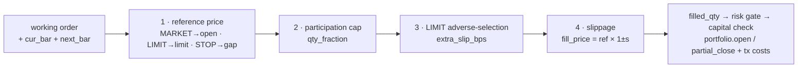

**Step 1 — reference price from the incoming bar**
(`RealisticExecutionModel` `execution_model.py:203`, `compute_fill_terms` `:235`). The price comes
from the *current* bar; the close is never used as a decision-time fill price:

| Order type | Fills on this bar when | Reference price | Code |
|---|---|---|---|
| **MARKET** | always | `bar.open` | `compute_fill_terms` `:241` |
| **LIMIT** | long: `bar.low <= limit`; short: `bar.high >= limit` | `req.limit_price` exactly (the realistic model drops the legacy `min(bar.open, limit)` "free alpha") | `_limit_reference_price` `:290` |
| **STOP** | long: `bar.high >= stop`; short: `bar.low <= stop` | long `max(bar.open, stop)`, short `min(bar.open, stop)` — gap-through honoured | `_stop_reference_price` `:305` |

**Step 2 — participation cap** (`_raw_participation` `:323`,
`_qty_fraction_from_participation` `:344`). A single bar can't absorb an
unbounded order: `raw_participation = order_notional / (bar.volume · bar.close)`;
`qty_fraction = 1.0` if within `participation_cap` (default 10%) else
`participation_cap / raw_participation` (missing volume → 0). The unfilled
remainder follows the run's `default_unfilled_policy` (backtest
`REQUEUE_NEXT_BAR`, paper `DROP`).

**Step 3 — LIMIT adverse-selection haircut** (`_adverse_selection_bps` `:365`;
LIMIT only, requires `next_bar`). Models being picked off:
`signed_move_pct = (next_bar.close − bar.close) / bar.close`, scaled by the
participation rate and capped at `adverse_selection_max_bps` (default 50).
Returned as `extra_slip_bps`.

**Step 4 — slippage → actual fill price** (`fill_simulator.py`).
`_slippage_multipliers(extra_slip_bps)` (`fill_simulator.py:567`) builds
`s = (slippage_bps + extra_slip_bps) / 10_000` and four multipliers —
`long_entry = 1+s`, `long_exit = 1−s`, `short_entry = 1−s`, `short_exit = 1+s`
(you always pay the spread). Then:

- `_fill_entry`: `filled_qty = target_qty · qty_fraction`, risk
  gate `risk.can_enter(...)` + capital check,
  `fill_price = round(ref_price · slip_entry, dp)`,
  `portfolio.open(...)`.
- `_fill_exit`: `fill_price = round(ref_price · slip_exit, dp)`,
  `filled_qty = min(target_qty, pos.qty) · qty_fraction`,
  `portfolio.partial_close(...)`; on full close it builds the
  `TradeRecord` with `tx_costs = (entry_notional + exit_notional) ·
  transaction_cost_bps/10_000`, `net = gross − tx_costs`, then
  `portfolio.record_pnl(net)`.

`FillSimulatorConfig` defaults: `slippage_bps=2.0`, `transaction_cost_bps=5.0`
(`engine/fill_simulator.py:69`).

> **Worked example** — long MARKET buy of 10 shares, `bar.open=100`,
> `slippage_bps=2`, within the participation cap, no adverse haircut:
> `s = 2/10_000 = 0.0002` → entry `fill_price = 100 × 1.0002 = 100.02`. Exiting on
> a bar that opens at 110 → `110 × 0.9998 = 109.978`. Transaction cost on the
> round trip: `(1000.20 + 1099.78) × 5/10_000 ≈ 1.05`.

> **Legacy `OptimisticExecutionModel`** (`execution_model.py:145`) keeps the old MARKET→`bar.open`,
> LIMIT-buy→`min(bar.open, limit)` "free alpha" rule for golden parity tests
> only; it warns unless `KHALA_ALLOW_OPTIMISTIC_FILLS=1`.

The parent-side `BarSafetyAssertion.check_fill(...)` (`bar_safety.py:107`)
backstops all of this — it raises `LookAheadError` if a fill timestamp is `<=`
the order's submission timestamp, so an order can never fill on the bar that
produced its signal.

### 6.3 Look-ahead boundary

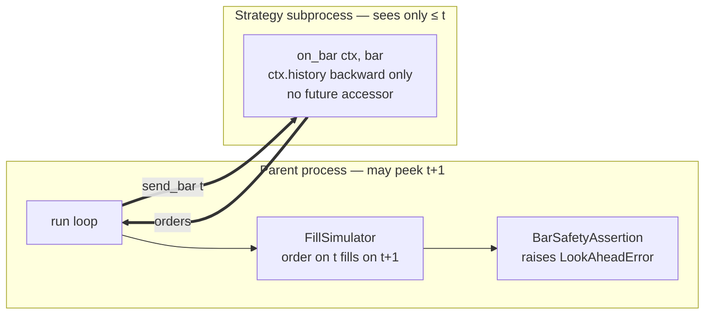

The four-layer defence (subprocess isolation → runtime trap → static AST/regex
checks → post-hoc anomaly heuristic) is detailed in
[`../strategy_lab/LOOK_AHEAD_DEFENCE.md`](../strategy_lab/LOOK_AHEAD_DEFENCE.md).

---

## 7. Use cases (data-centric)

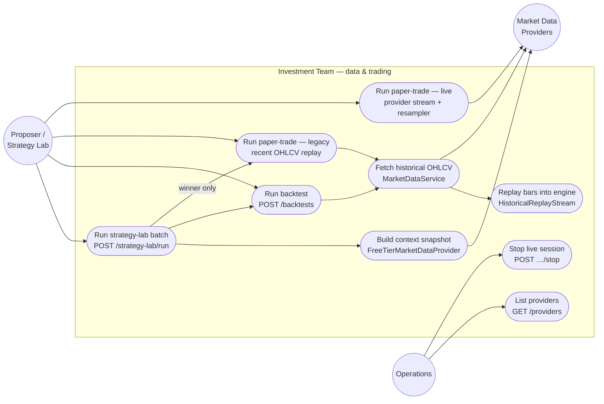

| Use case | Endpoint / entry | Data path |
|---|---|---|
| Run strategy-lab batch | `POST /strategy-lab/run` (`api/main.py:3024`) | context snapshot → ideation → backtest → (winner) paper trade |
| Run backtest | `POST /backtests` (`:1506`) → `_run_real_data_backtest` (`:1907`) | `MarketDataService.fetch_multi_symbol_range` → `HistoricalReplayStream` → engine |
| Run paper trade | `POST /strategy-lab/paper-trade` (`:4854`) | flag-off: recent OHLCV replay · flag-on: live `ProviderAdapter` stream |
| Stop live session | `POST /strategy-lab/paper-trade/{id}/stop` (`:5471`) | sets `StopController` flag the run loop polls |
| List providers | `GET /providers` (`:5638`) | `registry.describe_all()` |

---

## 8. End-to-end sequence diagrams

### 8.1 Backtest

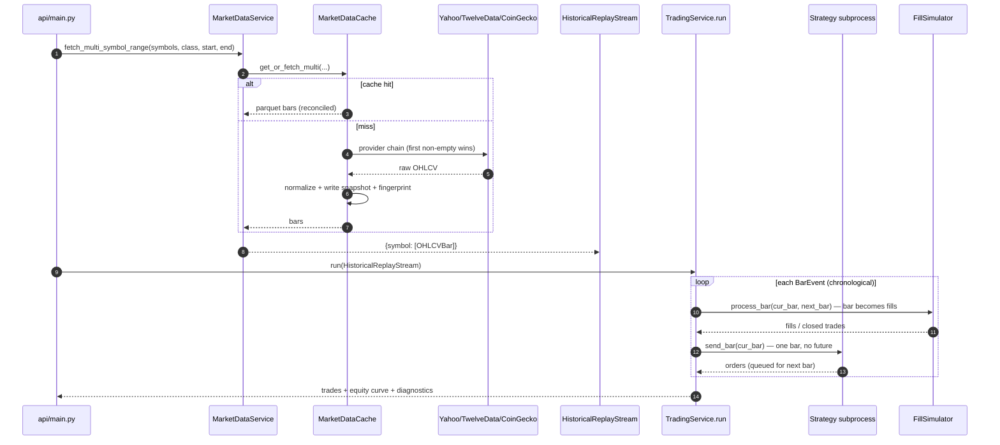

### 8.2 Paper trade (live path, `INVESTMENT_LIVE_PAPER_ENABLED=true`)

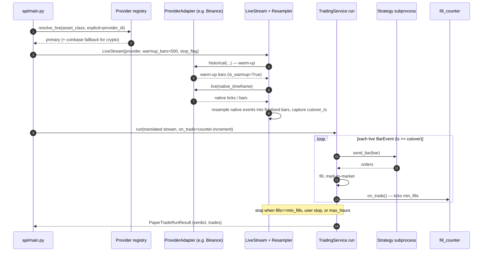

### 8.3 Paper-trade session state machine

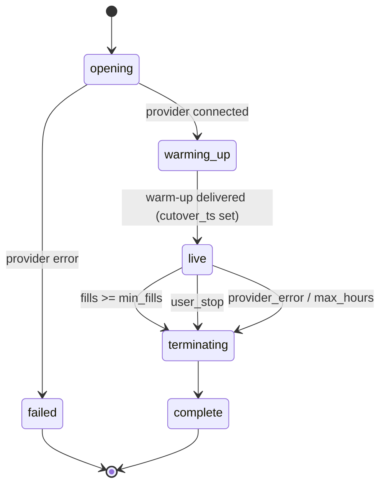

---

## 9. Implementation status and caveats

The data layer reflects a **partly-completed migration** (the "PR 1 / PR 2"
sequence in [`pr2_live_data_and_paper_cutover.md`](./pr2_live_data_and_paper_cutover.md)).
Know what is live before you rely on it:

| Capability | Status |
|---|---|
| Daily backtest via `MarketDataService` (Plane 2) | ✅ fully wired — the default path |
| LLM context snapshot (Plane 1, `FreeTierMarketDataProvider`) | ✅ fully wired |
| Streaming registry + `HistoricalReplayStream`/`LiveStream`/`Resampler` plumbing | ✅ implemented |
| **Binance** adapter (crypto) — REST historical + WS live | ✅ wired end-to-end |
| Coinbase / Alpaca / OANDA adapters | ⚠️ registered but `historical`/`live` are stubs (`NotImplementedError`) |
| Polygon / Databento / Twelve Data (paid) | ⚠️ `implemented=False` — present but dormant until pumps land |
| **Live** paper trade (`LiveStream`) | ⚠️ gated by `INVESTMENT_LIVE_PAPER_ENABLED` (default **off**) |
| Default paper trade | ✅ legacy path — recent daily OHLCV via `MarketDataService`, replayed through the backtest engine (`paper_trading_agent.py`) |
| Provider-driven **sub-daily** backtest | ⚠️ realistically crypto-only today (only Binance has a working `historical()`) |

**Practical consequence:** with the default configuration, *all* price data —
backtest and paper trade alike — flows through **Plane 2 (`MarketDataService`,
daily Yahoo→TwelveData→CoinGecko/AlphaVantage)**. The streaming providers
(Plane 3) only take over once `INVESTMENT_LIVE_PAPER_ENABLED=true` and the
relevant adapter is wired (Binance) or a paid key is configured and its pump is
implemented.

---

## 10. Configuration reference (data-relevant env vars)

| Variable | Plane | Purpose | Default |
|---|---|---|---|
| `STRATEGY_LAB_MARKET_DATA_PROVIDER` | 1 | snapshot provider (only `free_tier`) | `free_tier` |
| `STRATEGY_LAB_MARKET_DATA_FETCH_TIMEOUT_SEC` | 1 | snapshot per-fetch budget | `8.0` |
| `STRATEGY_LAB_MARKET_DATA_CACHE_TTL_SEC` | 1 | snapshot cache TTL | `120.0` |
| `STRATEGY_LAB_SIGNAL_EXPERT_ENABLED` | 1 | toggle signal-intelligence LLM step | `true` |
| `FRED_API_KEY` | 1 | enables FRED `DGS10` (also `DGS3MO` risk-free rate) | unset |
| `ALPHA_VANTAGE_API_KEY` | 2 | enables Alpha Vantage fallback (non-crypto) | unset |
| `STRATEGY_LAB_MAX_UNIVERSE_SYMBOLS` | 2 | cap on default asset-class universe | `20` (code; `.env.example` comment says 10 — stale) |
| `INVESTMENT_MARKET_DATA_CACHE_ROOT` | 2 | on-disk cache root | `${AGENT_CACHE}/investment_team/market_data` |
| `AGENT_CACHE` | 2 | cross-team cache root | unset → tempdir |
| `MARKET_DATA_FETCH_WORKERS` | 2 | multi-symbol fetch pool size | `min(symbols, 16)` |
| `POSTGRES_HOST` (+ friends) | 2 | enables the Postgres snapshot index | unset → in-memory |
| `INVESTMENT_LIVE_PAPER_ENABLED` | 3 | master opt-in for live streaming paper trade | `false` |
| `INVESTMENT_LIVE_PROVIDER_{CRYPTO,EQUITIES,FX}` | 3 | pin live provider per asset class | unset |
| `INVESTMENT_HISTORICAL_PROVIDER_{CRYPTO,EQUITIES,FX}` | 3 | pin historical provider per asset class | unset |
| `POLYGON_API_KEY` / `DATABENTO_API_KEY` / `TWELVE_DATA_API_KEY` (+`TWELVE_DATA_PLAN`) | 3 | activate paid adapters | unset |
| `ALPACA_API_KEY_ID` / `ALPACA_API_SECRET_KEY` / `ALPACA_PAID_FEED` | 3 | Alpaca (equities) | unset / `iex` |
| `OANDA_API_TOKEN` / `OANDA_ACCOUNT_ID` | 3 | OANDA (fx) | unset |
| `BINANCE_REST_URL` / `BINANCE_WS_URL` | 3 | Binance endpoints | public defaults |
| `COINBASE_REST_URL` / `COINBASE_WS_URL` | 3 | Coinbase endpoints | public defaults |
| `BAR_CHUNK_SIZE` | engine | bar chunking for the subprocess protocol (paper pins 1) | `1` |
| `KHALA_ALLOW_OPTIMISTIC_FILLS` | engine | silence optimistic-fill warning | unset |

---

## 11. File map

| Concern | Code |
|---|---|
| Context snapshot provider | `market_lab_data/{provider,free_tier,models}.py` |
| Historical OHLCV fetcher | `market_data_service.py` |
| Market-data cache | `market_data_cache/{store,streaming,paths,postgres}.py` |
| Streaming provider adapters | `trading_service/providers/{base,registry,binance,binance_ws,coinbase,alpaca,oanda,polygon,databento,twelve_data}.py` |
| Symbol maps | `data_providers/symbol_maps.py` |
| Stream contract | `trading_service/data_stream/protocol.py` |
| Historical replay | `trading_service/data_stream/historical_replay.py` |
| Live stream + resampler | `trading_service/data_stream/{live_stream,resampler,provider_stream}.py` |
| Mode-agnostic engine | `trading_service/service.py` |
| Backtest / paper modes | `trading_service/modes/{backtest,paper_trade,sandbox_compat}.py` |
| Fill simulation | `trading_service/engine/{execution_model,fill_simulator,order_book,portfolio}.py` |
| Strategy subprocess harness | `trading_service/strategy/streaming_harness.py` |
| Data quality / look-ahead | `execution/{data_quality,bar_safety}.py` |
| Backtest result cache | `strategy_lab/backtest_cache.py` |
| HTTP surface | `api/main.py` (`/backtests`, `/strategy-lab/*`, `/providers`) |
