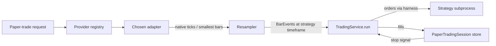
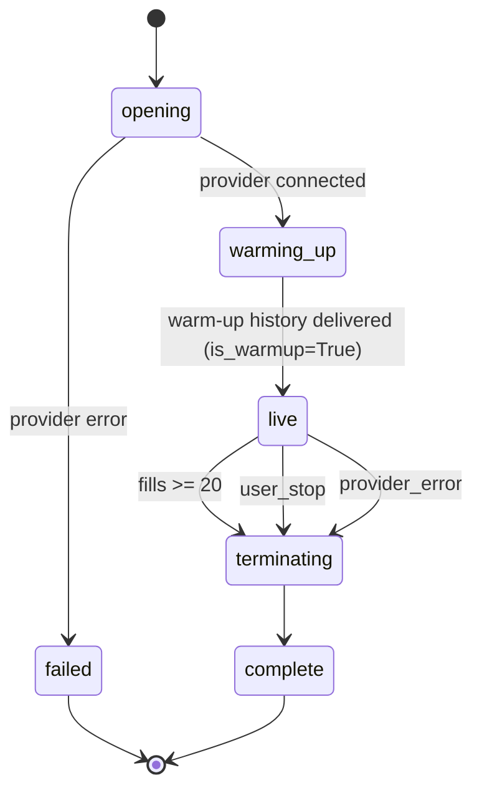

# PR 2 — Live Data Feed & Paper Trading Cut-over

**Status:** Spec (pre-implementation) · **Author:** Trading Service ·
**Target branch:** `claude/gifted-kalam` · **Depends on:** PR 1
(`8be4481 investment_team: unified streaming Trading Service`)

PR 1 landed the mode-agnostic `TradingService`, the `MarketDataStream`
protocol, and a historical replay source. **This PR finishes the "one
engine, two modes" design** by adding:

1. A **live-data stream** implementation fed from a pluggable provider
   registry (free-first defaults, paid alternatives via integrations).
2. **Candle resampling** from the smallest-bar aggregate each provider
   offers, up to the timeframe the strategy asks for.
3. A **paper-trading cut-over** path through the existing
   `TradingService` event loop: warm-up from recent history, then live
   bars only, terminating on ≥ 20 fills or user stop.
4. Sub-daily timeframes for **backtests** too (same provider registry,
   historical aggregates where the provider supports them).

PR 3 remains the cleanup: retire `TradeSimulationEngine` and the batch
`SandboxRunner`.

---

## 1. Goals and non-goals

### Goals

| # | Goal |
|---|---|
| G1 | A single `TradingService.run(stream)` call can execute either a backtest or a paper-trading session; the engine code does not branch on mode. |
| G2 | Paper trading uses **live data only** once warm-up is complete. No recent OHLCV is ever fed to the strategy during the live phase. |
| G3 | The trading service always consumes the **lowest-timeframe feed a provider exposes** for the selected symbol and asset class, and resamples up to the strategy's declared timeframe. |
| G4 | Resampling and fill simulation continue to preserve the PR 1 look-ahead invariant: the strategy subprocess can never see a bar the engine has not already finalized. |
| G5 | The **default** provider stack is free across all three asset classes (crypto, equities, FX). Paid providers plug in as optional integrations. |
| G6 | A paper-trading session runs until **≥ 20 fills** have accumulated *or* the user requests termination, whichever comes first. |
| G7 | Provider failures (rate limit, disconnect, empty stream) degrade gracefully: the session records a structured error and is safe to resume. |

### Non-goals (explicitly deferred)

| # | Non-goal |
|---|---|
| N1 | Placing live orders against a real broker. Paper only. |
| N2 | Migrating strategy execution from daemon threads to Temporal activities — tracked in the ARCHITECTURE_REVIEW Phase 3 work. |
| N3 | Partial fills, options chains, L2 order books. PR 2 trades a single price level per bar, same as PR 1. |
| N4 | Cross-provider failover mid-session. A session is bound to one provider at start; restart to switch. |
| N5 | Retiring `TradeSimulationEngine` / `SandboxRunner` — PR 3. |

---

## 2. Provider evaluation (free-first)

### 2.1 Selection criteria

A data provider is eligible for the **free default** if it satisfies
all of:

1. Genuinely free tier (no trial, no credit card on signup).
2. True real-time stream (not ≥ 1 min delayed — Yahoo/Polygon free
   tier are 15-minute delayed and **disqualified** for paper mode).
3. At least one aggregate ≤ 1 min, or a trade/quote stream from which
   the engine can build 1s candles.
4. Stable programmatic access (websocket or long-polling REST).
5. Terms of service permit automated reads for personal research.

### 2.2 Recommended defaults

| Asset class | Default provider | Live feed granularity | Notes |
|---|---|---|---|
| **Crypto** | **Binance** (spot, public market-data WS) — primary; **Coinbase Exchange WS** — secondary | Trade stream (tick) → engine builds 1s bars; Binance also exposes `kline_1s`, `kline_15s`, `kline_1m` natively; Coinbase exposes trade + 1m aggregates | Both keyless, 24/7. Binance is preferred for the broader kline menu. On a Binance region block (HTTP 451 / geo error) at session open, the registry auto-fails over to Coinbase *before the first bar is accepted* — a session is still bound to exactly one adapter after that. No mid-session failover. |
| **Equities** | **Alpaca** (free account, IEX feed via `wss://stream.data.alpaca.markets/v2/iex`) | Trades + 1-min aggregates from IEX venue only | ≈ 2–3% of national volume. Shipped as the free default to satisfy G5; the session response carries a `provider_notes` field warning that fill realism for low-IEX-volume names will be understated. Users needing full tape configure Polygon or Alpaca SIP. |
| **FX** | **OANDA v20** practice account (free) | Tick pricing stream; engine builds 1s/1m bars | Practice account is free and perpetual, but the token is **not** keyless — one-time manual signup is a documented first-run setup step. If `OANDA_API_TOKEN` is absent, `POST /strategy-lab/paper-trade` for an FX strategy returns HTTP 422 with a pointer to the setup doc. |

### 2.3 Paid alternatives (integrations)

Each paid provider is installed the same way any other Khala
integration is: an env var toggle + optional API key in settings. If
the key is present, the paid provider is **preferred** for the asset
classes it covers; otherwise the free default is used.

| Provider | Covers | Why paid | Env var |
|---|---|---|---|
| **Polygon.io** | Stocks, options, crypto, FX | Full SIP equities, lower latency, backfill depth | `POLYGON_API_KEY` |
| **Databento** | Stocks, futures, options | Institutional-grade historical + live | `DATABENTO_API_KEY` |
| **Alpaca (paid SIP)** | Stocks | Upgrades the same Alpaca code path from IEX to SIP | `ALPACA_PAID_FEED=sip` + `ALPACA_API_KEY_ID` / `ALPACA_API_SECRET_KEY` |
| **Twelve Data Pro** | Stocks, FX, crypto | Higher rate limits, more timeframes | `TWELVE_DATA_API_KEY` (+ `TWELVE_DATA_PLAN=pro`) |

### 2.4 Rejected candidates

| Provider | Rejection reason |
|---|---|
| Yahoo Finance (live) | 15-min delay on free tier → violates G2. Still used for historical daily bars. |
| IEX Cloud | Legacy platform, shutdown trajectory. |
| CoinGecko | REST-only, no sub-minute stream. |
| Finnhub free | Trades WS exists but TOS restricts redistribution + very low rate limit. Fallback only. |
| Coinbase (as primary) | Solid feed and keyless, but narrower kline menu than Binance (no native 1s / 15s klines). Used as the **secondary** crypto default for Binance-blocked regions, not primary. |
| FRED | Macro data, not trade data. Used in `market_lab_data/` for context, not here. |

---

## 3. Component architecture

### 3.1 New module layout

```
backend/agents/investment_team/trading_service/
  data_stream/
    protocol.py              (unchanged; PR 1)
    historical_replay.py     (extended — sub-daily aggregates)
    live_stream.py           (NEW — adapter-driven live feed)
    resampler.py             (NEW — provider-native → strategy-timeframe)
    providers/
      __init__.py            (provider registry)
      base.py                (NEW — ProviderAdapter Protocol)
      binance.py             (NEW — crypto primary default)
      coinbase.py            (NEW — crypto secondary default; Binance geo-block failover)
      alpaca.py              (NEW — equities default; paid SIP toggle)
      oanda.py               (NEW — FX default)
      polygon.py             (NEW — paid alt, all classes)
      databento.py           (NEW — paid alt, stocks/futures/options)
      twelve_data.py         (NEW — paid alt, all classes)
  modes/
    backtest.py              (unchanged entry point; extended to support sub-daily)
    paper_trade.py           (NEW — public entry point for live sessions)
  session/
    store.py                 (NEW — paper session persistence + resume)
```

### 3.2 Provider adapter protocol

All adapters implement the same Protocol so the live-stream builder
treats them identically.

```python
# trading_service/data_stream/providers/base.py
class ProviderAdapter(Protocol):
    name: str
    supports: set[str]            # subset of {"crypto", "equities", "fx"}
    native_timeframes: list[str]  # e.g. ["tick", "1s", "1m"]

    def historical(
        self, symbols: list[str], asset_class: str,
        start: str, end: str, timeframe: str,
    ) -> Iterator[BarEvent]: ...

    def live(
        self, symbols: list[str], asset_class: str,
        native_timeframe: str,
    ) -> Iterator[BarEvent]: ...

    def smallest_available(self, asset_class: str) -> str:
        """The shortest timeframe (or "tick") this provider offers for the class."""
```

Concrete adapters are permitted to implement only `historical` or only
`live` — the registry records which methods each supports. The
`providers/__init__.py` registry selects adapters in this order:

1. Explicit override from request (e.g. `RunPaperTradeRequest.provider_id`).
2. Paid provider with a matching API key present.
3. Free default for the asset class.

If a chosen adapter does not support the requested direction
(historical vs. live), the registry falls back to the next eligible
adapter with a structured log event. A session is still bound to **one
adapter per direction** once the stream is opened.

**Binance → Coinbase geo-failover (crypto only, open-time only).** At
session open, if the selected Binance adapter returns a region-block
signal (HTTP 451 / documented geo-error codes / resolved-DNS → blocked
IP on the WS upgrade), the registry re-selects the Coinbase adapter
**before the first bar is emitted** and records `provider_id =
"coinbase"` on the session. The failover does not apply mid-session:
a provider disconnect after the first live bar terminates the session
with `terminated_reason = "provider_error"` (§5.4). This preserves the
"one adapter per session" invariant while keeping the free-default
experience working for geo-restricted users.

### 3.3 Live stream assembly



### 3.4 Resampler

The resampler sits between the provider adapter and `TradingService`.
It consumes the provider's native stream (ticks or smallest native
bars) and emits `BarEvent`s at the strategy-requested timeframe.

Key invariants:

- **Only finalized bars are emitted.** A bar for timeframe `tf`
  closing at `t_close` is emitted strictly *after* a native bar/tick
  with timestamp `> t_close` has been observed. No partial candles
  leak to the engine, and therefore none to the strategy.
- **Monotonic timestamps.** The resampler drops out-of-order native
  events (late prints) and records a metric; a new bar never carries
  an earlier close than the previous one.
- **Session boundaries** (equities only). Day close / halts are
  surfaced as gaps — the resampler does not fabricate bars in a gap.
- **Timeframe alignment.** Bars close on clock-aligned boundaries
  (e.g. `:00` for 1m), matching standard charting conventions. The
  first bar after warm-up may be a partial period and is suppressed.

```python
# Public shape
class Resampler:
    def __init__(self, target_timeframe: str): ...
    def feed_native(self, event: NativeEvent) -> Iterator[BarEvent]: ...
    def flush_on_end(self) -> Iterator[BarEvent]: ...  # no partials — just drains
```

`NativeEvent` is a small internal union (`NativeTick | NativeBar`)
carrying `ts`, `price`, `size` (ticks) or OHLCV (bars). It is private
to the resampler; the engine only ever sees `BarEvent`.

### 3.5 Look-ahead invariants (preserved from PR 1)

| Invariant | PR 1 mechanism | PR 2 extension |
|---|---|---|
| Strategy never sees a bar it shouldn't | Subprocess isolation; only `history()` accessor | Unchanged. Live bars arrive via the same `send_bar` harness call. |
| Fill simulator's one-bar-forward peek is parent-only | `FillSimulator` runs in parent | Unchanged. Live-mode fills are applied using the *next* arriving bar, same as backtest. |
| Resampler cannot leak in-progress periods | N/A | Explicit: only emits after a later native event arrives. |
| No `ctx.future_*` accessor exists | Structural | Still no accessor. Adding any new `ctx.*` method requires a look-ahead audit in review. |

---

## 4. Candle construction rules

### 4.1 Required strategy timeframe comes from the strategy spec

`StrategySpec` already carries a `timeframe` field (e.g. `"1d"`,
`"15m"`, `"1m"`). In PR 2:

- If the provider offers the target timeframe **natively**, subscribe
  to it directly and bypass the resampler.
- Otherwise, subscribe to the **smallest** native timeframe (or tick
  stream) and resample up.

### 4.2 Precedence when multiple native timeframes exist

Given provider `P` offering `["tick", "1s", "1m", "1h"]` and strategy
asking for `"15m"`:

1. Prefer `"1m"` (smallest aggregate that evenly divides 15m, cheapest
   to stream).
2. Only fall back to `"1s"` or `"tick"` if the provider's 1m feed is
   unavailable or has a documented gap profile that would harm fill
   realism.

Rationale: tick streams are the highest fidelity but the most
expensive to consume (CPU, bandwidth, rate-limit budget). Use them
only where the realism gain is material.

### 4.3 Fill realism upgrade: intra-bar fills

In PR 1 a limit/stop order placed on bar *t* evaluates against the
high/low of bar *t+1* only. With sub-daily bars this coarseness
becomes less acceptable. For PR 2:

- When the **native** timeframe is smaller than the **strategy**
  timeframe, `FillSimulator` has the option to consult the finer
  native stream to check whether the limit/stop would have triggered
  intra-bar.
- This is **still parent-only**; the strategy never sees the sub-bar
  data.
- Off by default; toggled with `FillSimulatorConfig.intrabar_fills`
  (planned for PR 2, default `False` to preserve parity with PR 1).

### 4.4 Tick-to-candle construction

When the provider gives ticks, the resampler builds OHLCV for the
target timeframe with these rules:

- `open` = price of the first tick whose ts ∈ [bar_start, bar_end)
- `high` / `low` = max / min over that interval
- `close` = price of the last tick in the interval
- `volume` = sum of sizes in the interval
- If no ticks arrived in a fully elapsed interval, emit **no bar** (a
  gap, not a zero-volume placeholder).

---

## 5. Paper-trading cut-over

### 5.1 Session lifecycle



### 5.2 Warm-up

Before the first live bar, the service replays the last
`paper_trading_warmup_bars` (default: **500** bars of the strategy
timeframe) from the provider's historical endpoint. At the default,
this covers ≈ 5 trading days at `15m`, ≈ 8 hours at `1m`, or ≈ 2 years
at `1d` — enough headroom for chained indicators (e.g. SMA-of-RSI)
without a punitive startup cost. Requests may set `warmup_bars = 0`
to disable warm-up entirely for stateless strategies. Each is delivered
with `is_warmup=True` so the strategy can populate indicators but
**must not emit orders** — orders emitted during warm-up are dropped
with a log event `warmup_order_dropped`.

Rationale: indicator-based strategies need prior bars to compute a
first signal. Without warm-up the first N live bars would be unusable.
This is **not** a look-ahead violation: warm-up bars are strictly
older than the cut-over timestamp, and the strategy is told explicitly
via `ctx.is_warmup`.

The cut-over timestamp (`cutover_ts`) is captured at the moment the
first live bar is accepted from the provider. Any warm-up bar with
`timestamp >= cutover_ts` is rejected — this is the guardrail enforcing
"live data only during live phase".

### 5.3 Live phase

- Provider stream is consumed by the resampler.
- Each finalized bar flows through the same `TradingService` event
  loop used by backtests. Fills update `PaperTradingSession.trades`.
- Session equity curve is sampled on every bar close.
- Session state is persisted after each fill (see §7) so the process
  can crash without losing the session.

### 5.4 Termination

A session terminates when **any** of:

| Trigger | Field set |
|---|---|
| Fills count ≥ `paper_trading_min_fills` (default **20**) | `terminated_reason = "fill_target_reached"` |
| User calls `POST /strategy-lab/paper-trade/{session_id}/stop` | `terminated_reason = "user_stop"` |
| Provider emits unrecoverable error | `terminated_reason = "provider_error"` |
| Drawdown circuit-breaker fires (inherited from PR 1) | `terminated_reason = "max_drawdown"` |
| Strategy raises `lookahead_violation` | `terminated_reason = "lookahead_violation"` |

On termination the service:

1. Calls `harness.send_end()`.
2. Closes the provider connection.
3. Computes metrics via `trade_simulator.compute_metrics(...)`.
4. Runs the existing `PaperTradingAgent` divergence analysis vs the
   associated backtest (if any).
5. Writes final `PaperTradingSession` record with verdict
   (`"ready_for_live"` / `"not_performant"`).

### 5.5 Why 20 fills?

Statistically small but large enough to flag gross bugs (wrong side,
never-exit strategies, always-hit stop-loss). The number is
configurable per request (`paper_trading_min_fills`) so users can ask
for more for longer-horizon strategies. The upper bound is enforced by
a max-wall-clock guard (`paper_trading_max_hours`, default 72h) so a
session that never fills 20 times still terminates.

---

## 6. API surface

### 6.1 New & changed endpoints

| Method | Path | Purpose | Change |
|---|---|---|---|
| `POST` | `/api/investment/strategy-lab/paper-trade` | Start paper-trade session | **Extended**: new fields `provider_id`, `min_fills`, `max_hours`, `warmup_bars`. Removes `paper_trading_lookback_days` (warm-up supersedes it). |
| `GET` | `/api/investment/strategy-lab/paper-trade/{session_id}` | Fetch session | Unchanged schema; adds `status` (`opening`/`warming_up`/`live`/`complete`/`failed`), `cutover_ts`, `fill_count`, `terminated_reason`. |
| `POST` | `/api/investment/strategy-lab/paper-trade/{session_id}/stop` | **NEW** — user stop | Idempotent. Sets `terminated_reason="user_stop"`. |
| `GET` | `/api/investment/strategy-lab/paper-trade/{session_id}/stream` | **NEW** — SSE of live updates | Emits `bar`, `fill`, `status`, `error` events until session terminates. |
| `GET` | `/api/investment/providers` | **NEW** — list configured providers | Returns `[{name, supports, has_key, is_default_for}]`. Useful for UI. |
| `POST` | `/api/investment/backtests` | Existing | **Extended**: `timeframe` now honored sub-daily (e.g. `"15m"`). |

### 6.2 Request schema additions

```python
class RunPaperTradeRequest(BaseModel):
    lab_record_id: str
    # Existing:
    initial_capital: float = 100_000.0
    transaction_cost_bps: float = 5.0
    slippage_bps: float = 2.0
    # New:
    provider_id: Optional[str] = None     # override registry selection
    min_fills: int = 20                   # Field(ge=1, le=10_000)
    max_hours: float = 72.0               # wall-clock guard
    warmup_bars: int = 500                # Field(ge=0, le=5_000)
    timeframe: Optional[str] = None       # overrides strategy.timeframe if set
```

### 6.3 Validation rules

- `min_fills >= 1` is **hard-enforced** (422 if violated).
- `min_fills < 20` is **accepted with a warning**: the session's
  response body includes `warnings: ["min_fills_below_recommended"]`
  and the metric commentary flags the result as
  `sample_size = "exploratory"`. This keeps experimentation cheap
  while making small-sample caveats explicit.
- `timeframe` must be one of `{"1s", "15s", "30s", "1m", "5m", "15m",
  "30m", "1h", "4h", "1d"}`. Ticks are never exposed to the strategy —
  a strategy that declares `timeframe = "tick"` is rejected.
- If strategy timeframe is unknown, the API returns 422 — paper mode is
  not allowed without one.
- FX strategies require `OANDA_API_TOKEN` (or a paid FX provider key)
  to be configured. Absent any FX provider key, the request returns
  422 with `error_code = "fx_provider_not_configured"` and a pointer
  to the OANDA setup doc.

---

## 7. Persistence

Paper sessions outlive any single HTTP request. They must survive API
restarts (the current `_PersistentDict` approach is fine).

### 7.1 Storage

- Table / bucket: `_paper_trading_sessions` (already exists).
- **New fields** on `PaperTradingSession`:

| Field | Type | Notes |
|---|---|---|
| `status` | `str` | `opening` / `warming_up` / `live` / `complete` / `failed` |
| `provider_id` | `str` | e.g. `"binance"` |
| `cutover_ts` | `str` (ISO-8601) | first live bar timestamp |
| `fill_count` | `int` | updated after each fill |
| `terminated_reason` | `Optional[str]` | see §5.4 table |
| `user_stop_requested_at` | `Optional[str]` | set by `/stop` endpoint |
| `error` | `Optional[str]` | truncated exception text |

- Writes happen at three points: (a) session open, (b) after every
  fill, (c) on terminate. Bars themselves are **not** persisted
  individually — the strategy can reconstruct from `history()` during
  the run, and after-the-fact audit uses the trade ledger.

### 7.2 Concurrency

- Exactly **one** live paper session per `(strategy_id, user_id)` at a
  time. Attempting to start a second returns 409.
- The `/stop` endpoint writes `user_stop_requested_at` and sets a
  shared flag the service polls between bar deliveries. Stop is best-
  effort: the current bar finishes processing first.

### 7.3 Crash recovery (best-effort, not the primary design goal)

If the process exits mid-session, the session row is left in `live`
status with the last persisted fill. On startup the API does **not**
automatically resume — it marks such rows `failed` with
`error="process_exit"`. True resumability is a Temporal-activity job
and is deferred to the Phase 3 migration (ARCHITECTURE_REVIEW).

---

## 8. Configuration

### 8.1 Environment variables (additions)

| Variable | Default | Purpose |
|---|---|---|
| `INVESTMENT_LIVE_PROVIDER_CRYPTO` | `binance` | Override default crypto provider |
| `INVESTMENT_LIVE_PROVIDER_EQUITIES` | `alpaca` | Override default equities provider |
| `INVESTMENT_LIVE_PROVIDER_FX` | `oanda` | Override default FX provider |
| `INVESTMENT_PAPER_MIN_FILLS` | `20` | Default for `min_fills` if request omits |
| `INVESTMENT_PAPER_MAX_HOURS` | `72` | Wall-clock guard |
| `INVESTMENT_PAPER_WARMUP_BARS` | `500` | Default warm-up count |
| `INVESTMENT_INTRABAR_FILLS` | `false` | Toggle §4.3 sub-bar fill simulation |
| `BINANCE_WS_URL` | `wss://stream.binance.com:9443` | Overridable for regional mirrors / tests |
| `COINBASE_WS_URL` | `wss://ws-feed.exchange.coinbase.com` | Overridable for tests; Coinbase is the crypto secondary default used when Binance is geo-blocked |
| `ALPACA_API_KEY_ID` / `ALPACA_API_SECRET_KEY` | — | Required for free Alpaca feed (free key, just needs signup) |
| `ALPACA_PAID_FEED` | `iex` | Set to `sip` to upgrade to paid feed if key has entitlement |
| `OANDA_API_TOKEN` / `OANDA_ACCOUNT_ID` | — | Required for OANDA v20 (practice token is free) |
| `POLYGON_API_KEY` | — | Paid alt |
| `DATABENTO_API_KEY` | — | Paid alt |
| `TWELVE_DATA_API_KEY` | — | Paid alt |

### 8.2 CLAUDE.md additions

`backend/` root CLAUDE.md already documents
`ALPHA_VANTAGE_API_KEY` and the Strategy Lab market-data tuning knobs.
PR 2 adds rows for each of the variables above in the same table.

---

## 9. Testing strategy

### 9.1 Unit tests

- `test_resampler.py`
  - tick-stream → 1s / 15s / 1m construction
  - out-of-order tick dropped, metric incremented
  - gap preserved (no fabricated bars)
  - partial period at end of stream **not** emitted
- `test_live_stream.py`
  - provider adapter mocked; live stream yields BarEvents in order
  - warm-up bars tagged with `is_warmup=True`
  - order emitted during warm-up → dropped, log captured
- `test_paper_session_termination.py`
  - fill count ≥ min_fills → `terminated_reason="fill_target_reached"`
  - user_stop flag mid-run → `terminated_reason="user_stop"`
  - provider raises → `terminated_reason="provider_error"`
  - wall-clock exceeded → `terminated_reason="max_hours"`
- `test_lookahead_live.py`
  - strategy that attempts to access `ctx.future_bar` during live
    mode → `lookahead_violation` (same as backtest)
  - resampler does not emit a bar until a newer native event arrives

### 9.2 Provider adapter tests

Each adapter gets a **canned-replay test** that feeds a recorded
fixture of provider output (saved to `tests/fixtures/`) and asserts
the adapter produces the expected BarEvent sequence. Network calls
are never made from CI.

### 9.3 Integration tests

- `test_paper_to_backtest_parity.py` — run a deterministic strategy
  on a fixed historical window via both the backtest path and a
  paper-session path (provider mocked to replay the same data) and
  assert trade ledgers match modulo ID columns.
- `test_sub_daily_backtest.py` — end-to-end backtest at `"15m"`
  timeframe using resampled fixture data; verify fill timestamps and
  P&L.

### 9.4 What we **do not** test in CI

Live websocket connectivity to third parties. Those are tested by a
manual smoke script under `backend/agents/investment_team/scripts/`
that is run pre-release.

---

## 10. Rollout plan

1. **Merge order**: resampler → provider base + Binance → live_stream →
   paper_trade mode → Alpaca + OANDA → API wiring → paid adapters.
   Each step is a commit; each step keeps tests green.
2. **Feature flag**: `INVESTMENT_LIVE_PAPER_ENABLED` (default `false`
   in PR 2). When `false`, `POST /strategy-lab/paper-trade` falls
   back to the legacy behavior (replay recent OHLCV as in PR 1).
   Flipped to `true` in a follow-up after smoke tests.
3. **Documentation**: update `README.md`, `ARCHITECTURE_REVIEW.md`,
   and the `system_design/` index to reflect the new module layout.
   Add a one-line entry in the repo `CHANGELOG.md` at merge time.
4. **PR 3** (separate): delete `TradeSimulationEngine` + `SandboxRunner`
   once the paper/backtest paths have been soaked for at least one
   strategy-lab cycle release.

---

## 11. Resolved decisions

The open questions previously in this section have been resolved. The
decisions and their rationale are recorded here so future readers can
tell what is settled and what is not.

| # | Question | Decision | Rationale |
|---|---|---|---|
| D1 | Equities free default: ship Alpaca IEX or gate behind paid? | **Ship Alpaca IEX as the free default.** Session response includes `provider_notes` flagging the IEX-volume caveat. Users needing full-tape realism configure Polygon or Alpaca SIP. | Gating behind paid violates G5 (free default across all three asset classes). The IEX feed is real-time and adequate for plausibility checks; users who care about low-IEX-volume fillability can opt into paid. |
| D2 | Binance geo-block → auto-failover? | **Yes — register Coinbase Exchange WS as the crypto secondary default. Auto-failover only at session open**, before the first bar is accepted. No mid-session failover. | Preserves the "one adapter per session" invariant while keeping the free-default experience working in Binance-blocked regions. Mid-session failover would complicate ordering, resampler state, and reconciliation — not worth the complexity for paper mode. |
| D3 | OANDA signup as documented first-run step? | **Accept.** No keyless free FX provider exists. FX paper-trade requests without `OANDA_API_TOKEN` return 422 with a setup-doc link. | Users who want FX paper trading can reasonably spend two minutes on a free signup. Silent failure would be worse; a 422 with a direct link is the clearest developer experience. |
| D4 | `/stop` control over SSE? | **REST-only.** SSE stays strictly one-way (server → client). | SSE is designed as a one-way channel; bidirectional control over it requires out-of-band mechanisms or WebSocket. A separate `POST .../stop` is trivial for clients and keeps the transport contract clean. |
| D5 | Warm-up bar default: 200 vs 500? | **500.** Request may override `0..5000`. | 200-period SMAs are common; chained indicators (e.g. RSI-of-SMA) push retention needs higher. 500 × 15m ≈ 5 trading days, 500 × 1m ≈ 8h — acceptable startup cost. Strategies that want cold-start behavior set `warmup_bars = 0`. |
| D6 | `min_fills < 20`: warn or reject? | **Warn, don't reject.** Hard-reject only `min_fills < 1`. Response includes `warnings: ["min_fills_below_recommended"]` and the metric commentary tags the run `sample_size = "exploratory"`. | Small-sample paper trading still catches gross strategy bugs (wrong side, never-exit). Rejecting would make experimentation expensive. Explicit warning + commentary keeps the caveat visible without blocking the user. |

---

## 12. Traceability

| Requirement (user prompt) | Where addressed |
|---|---|
| Single unified trading service | §3 (architecture); reuses PR 1 `TradingService.run` |
| Data stream fed by mode | §3.3, §5; backtest = HistoricalReplayStream, paper = LiveStream via resampler |
| Backtest pulls historical data, streams it | PR 1 + §4.1 for sub-daily |
| Eliminate look-ahead from strategy | §3.5, §5.2 cut-over guard |
| Engine may look ahead for realistic fills | §4.3 intrabar_fills toggle |
| Paper trading uses live data only | §5.2 `cutover_ts` guard + warm-up tagging |
| Never use recent/historical during live phase | §5.2 reject `ts >= cutover_ts` on warm-up; live provider only after cut-over |
| Lowest-timeframe feed, provider-dependent | §4.1–4.2 precedence rules |
| Build candles from high-frequency data | §4.4 tick-to-candle rules; §3.4 resampler |
| Free default, paid via integrations | §2.2–2.3 provider tables; §8.1 env vars |
| All three asset classes at once | §2.2 crypto / equities / FX defaults |
| ≥ 20 fills or user stop | §5.4 termination table; §6.2 `min_fills`; §7.2 stop semantics |
| Spec before implementation | This document |

---

## 13. Appendix — provider coverage matrix

| Timeframe \ class | Crypto — Binance (primary) | Crypto — Coinbase (secondary) | Equities (Alpaca IEX) | FX (OANDA) |
|---|---|---|---|---|
| tick | ✅ trade stream | ✅ trade stream | ✅ trades WS | ✅ pricing stream |
| 1s | ✅ native `kline_1s` | build from ticks | build from ticks | build from ticks |
| 15s | ✅ native `kline_15s` | build from ticks | build from ticks | build from ticks |
| 1m | ✅ native | ✅ native aggregates | ✅ native aggregates | build from ticks |
| 5m / 15m / 1h / 1d | resample from 1m | resample from 1m | resample from 1m | resample from 1m |

Polygon, Databento, and Twelve Data Pro fill in the gaps when
configured (e.g. native 1s for equities via Polygon).
