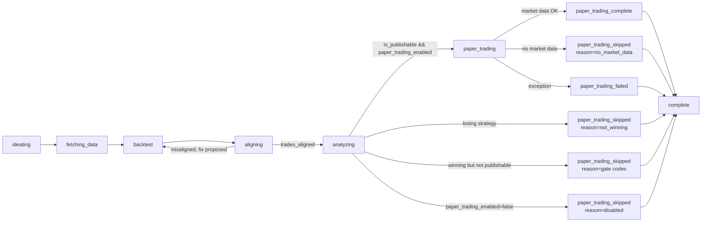

# Strategy Lab — Pipeline

The Strategy Lab runs one or more sequential research cycles. Each cycle
generates a fresh strategy, runs a historical backtest, analyzes the
result, and (when the backtest is publishable) paper-trades it on
recent market data.

## Cycle diagram



The `aligning` phase audits whether the executed trade ledger actually
implements the strategy specification. Each iteration of the alignment
loop now runs a two-step inner check:

1. `DeterministicAlignmentChecker` (in
   `strategy_lab/quality_gates/alignment_checks.py`) evaluates the
   trade ledger against the structured `StrategySpec` across seven
   per-rule checks (universe, side, sizing ±1%, stop-loss compliance,
   take-profit compliance, entry-signal correlation with optional
   near-miss adjudication, and signal-exit correlation for specs with a
   `SignalExitRule`). The stop-loss/take-profit checks are
   informational-only — every finding they emit is hardcoded
   `passed=True` (a stop/take-profit is a trigger, not a price cap, so a
   fill landing past the nominal threshold is expected, not a
   misalignment); real engine-side firing is verified separately by
   `ExitRuleConformanceGate`. The other five checks can fail and drive
   the `aligned`/`misaligned` verdict below. Output is a list of
   `AlignmentFinding` rows that ride on `BacktestRecord.alignment_findings`
   plus matching `QualityGateResult` rows on the existing
   `quality_gate_results` stream.
2. When the deterministic verdict is misaligned, `TradeAlignmentAgent.
   propose_code_fix` is invoked with the structured findings (no
   trade-ledger prose) and returns a rewritten Python file. The
   sandbox re-executes the proposal, and the loop iterates.

The re-execution loop and its cap remain intentional and unchanged:
the cap (`MAX_ALIGNMENT_ROUNDS` in `strategy_lab/orchestrator_alignment.py`,
resolved from `STRATEGY_LAB_MAX_ALIGNMENT_ROUNDS`, default 10) prevents runaway iterations while
still giving the system room to correct genuine code defects across
multiple rounds. The loop exits as soon as the gate reports aligned,
no further fix is proposed, or the cap is hit. Entry-signal predicate
misses within `STRATEGY_LAB_ALIGNMENT_NEAR_MISS_PCT` (default 1%
relative) route through `TradeAlignmentAgent.adjudicate_near_miss`, a
single-shot yes/no LLM call; tolerance `0` disables that adjudicator
entirely. See `strategy_lab/quality_gates/alignment_checks.py`,
`strategy_lab/agents/alignment.py`, and
`strategy_lab/orchestrator.py::run_cycle` (Phase 2.5).

The pipeline lives in
[`api/main.py::_run_one_strategy_lab_cycle`](../api/main.py) and
[`strategy_lab/temporal/workflows.py::StrategyLabBatchWorkflow`](../strategy_lab/temporal/workflows.py).

## Winner label vs publishable gate

The **winner label** is deterministic: a *valid* run (it executed and produced a
trade ledger) is winning iff its annualized return meets or beats the 8%
S&P-500 amortized benchmark.

```python
is_winning = execution_succeeded and trades and result.annualized_return_pct >= 8.0
```

Robustness machinery (walk-forward acceptance gate / deflated Sharpe,
IS→OOS degradation, regime beats, alignment, conformance, realism, runtime
look-ahead) still runs and records its findings on `acceptance_reason` and
the gate timeline — those findings surface as narrative caveats — but they
never flip `is_winning`.

The **publishable gate** is the paper-trading decision:

```python
is_publishable = (
    is_winning
    and realism_passed
    and trades_aligned
    and exit_rule_conformance_passed
    and not runtime_lookahead_violation
)
```

`/strategy-lab/paper-trade` (standalone endpoint) and the integrated cycle
both refuse to paper-trade a non-publishable strategy. A losing strategy is
still persisted as a `StrategyLabRecord` with `is_winning=False`,
`is_publishable=False`, and `paper_trading_status="skipped"`,
`paper_trading_skipped_reason="not_winning"`. A winning-but-not-publishable
record keeps `is_winning=True`, sets `is_publishable=False`, and skips with
the joined failing gate codes (veto order: `exit_rule_conformance_failed`,
`realism_failed`, `alignment_unresolved`, `lookahead_violation`).

## Phase events

Every cycle emits phase events via the `on_phase(phase, data)` callback. The
table below is the **`on_phase` contract** — the full set of names a callback
implementation must handle — not the set a browser receives. Two filters sit
between them under the current Temporal-only dispatch:

- `run_design_attempt_activity`'s progress callback publishes through
  `_PROGRESS_PHASE_MAP` (`temporal/activities.py`), which maps the
  orchestrator's internal names (`designing`, `design_review`,
  `design_repair`, `coding`, `backtesting`, `aligning`, `analyzing`,
  `complete`) onto the UI's four-entry stepper — `ideating`, `coding`,
  `backtesting`, `analyzing`. An unmapped phase is not published at all.
- `finalize_cycle_record_activity` calls `_finalize_strategy_lab_cycle_record`
  with `on_phase=None`, so the `paper_trading*` rows below reach no subscriber.
  (`complete` is not emitted there — it comes from `RecordAssemblyMixin` inside
  `run_design_attempt_activity`, and *is* published, relabelled `analyzing`.)

So a subscriber sees only those four names. Note also that `fetching_data` is
emitted as a `sub_phase` of `backtesting`
(`emit("backtesting", {"sub_phase": "fetching_data"})`), not as a top-level
phase, and that `telemetry` and `phase_transition` are emitted as well —
deliberately unmapped, so an `on_phase` implementation must tolerate them
rather than assert on an unknown name. The rows:

| Phase | When emitted | Data fields |
|---|---|---|
| `ideating` | Start of cycle; also on re-ideation retry. Reaches a subscriber as the `_PROGRESS_PHASE_MAP` target of `designing`/`design_review`/`design_repair` | `{ retry?, excluded? }` |
| `fetching_data` | After ideation, before backtest. Emitted as `backtesting` with `sub_phase="fetching_data"`, never as a bare phase | `{ strategy: {asset_class, hypothesis}, retry? }` |
| `aligning` | Trade-alignment audit and problem-solving loop | `{ sub_phase, alignment_round, trades_count?, issues_count?, issues_preview?, findings_count?, findings_preview?, changes_made?, predicted_aligned_after_fix? }` |
| `analyzing` | After backtest, before narrative | `{ strategy, metrics }` |
| `paper_trading` | Entering the paper-trading step (publishable winners only) | `{ strategy }` |
| `paper_trading_complete` | Paper trading finished successfully | `{ session_id, verdict, trade_count }` |
| `paper_trading_skipped` | Paper trading did not run | `{ reason, detail? }` |
| `paper_trading_failed` | Paper trading raised an exception (non-fatal) | `{ detail }` |
| `complete` | Design attempt finished and the record assembled (emitted by `RecordAssemblyMixin`, before the finalize/persist step) | `{ record_id, is_winning, is_publishable, metrics, refinement_rounds, alignment_rounds, trades_aligned, phase_back_count }` — the short-circuit variant swaps in `short_circuit` |

UI clients should treat unknown phase names as opaque and ignore them.

## Skip reasons

| `paper_trading_skipped_reason` | Meaning |
|---|---|
| `not_winning` | Backtest `annualized_return_pct < 8.0` (or the run produced no valid ledger) — paper trading never runs. |
| `exit_rule_conformance_failed` / `realism_failed` / `alignment_unresolved` / `lookahead_violation` | Winning return, but one or more publishability gates failed. Multiple failures are comma-joined in that veto order. |
| `disabled` | `RunStrategyLabRequest.paper_trading_enabled = false` — explicit opt-out. |
| `no_market_data` | `MarketDataService` could not fetch live OHLCV data for the strategy's asset class — retry later. |
| `no_strategy_code` | The orchestrator produced a publishable record but no compilable `strategy_code` (e.g. refinement loop exhausted) — nothing to execute in the sandbox. |

## Failure isolation

A paper-trading failure is **non-fatal** for the cycle. The winning
backtest still produces a valid `StrategyLabRecord`; the failure is
recorded on the record as:

- `paper_trading_status = "failed"`
- `paper_trading_error = "<stringified exception, truncated to 500 chars>"`

This lets the user retry manually via `POST /strategy-lab/paper-trade`
with the `lab_record_id` once the underlying cause is fixed.

## Re-running paper trading

The standalone `POST /strategy-lab/paper-trade` endpoint is unchanged in
shape. Use it to run (or re-run) paper trading against a specific
publishable `lab_record_id` — typical use cases:

- A cycle recorded `paper_trading_status = "failed"` or
  `paper_trading_skipped_reason = "no_market_data"` and you want to retry.
- You want a second paper-trading pass with different parameters
  (longer lookback, higher `max_evaluations`, stricter `min_trades`).

Each invocation writes a new `PaperTradingSession`; the record's
`paper_trading_session_id` continues to point at the original session
from the cycle.
