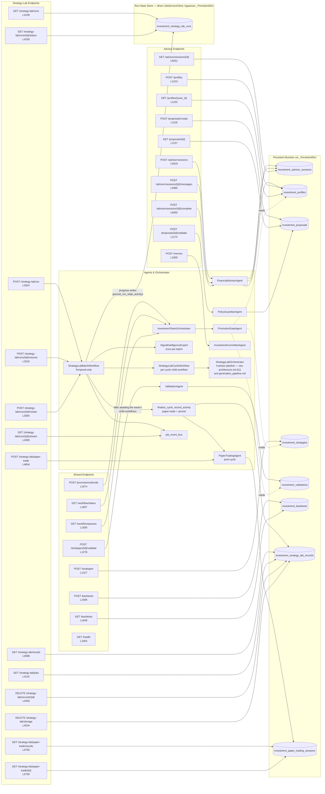
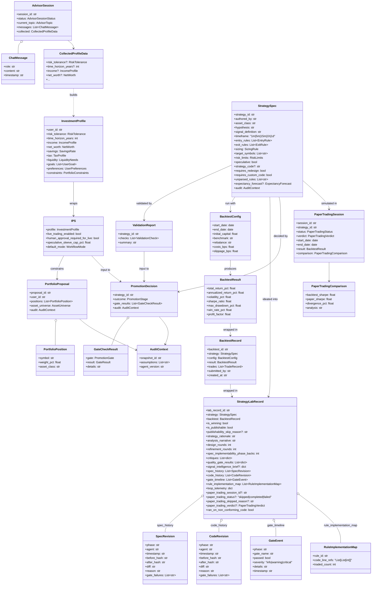

# System Design — Investment Team

Component view of the API router, detail on the orchestrator queues and
promotion gates, and a class diagram of the core Pydantic domain models.

For the container-level view of how this team fits into Khala, see
[`architecture.md`](./architecture.md).

## Component diagram — API router

How each endpoint reaches an agent or orchestrator call and which persistence
bucket it reads/writes. Every line number below is from
[`api/main.py`](../api/main.py).

## Orchestrator — six queues

Defined in [`orchestrator.py`](../orchestrator.py):38-51 as
`WorkflowState.queues`. Each queue is a FIFO of `QueueItem(queue, payload_id,
priority)`:

| Queue | Purpose | Enqueue source |
|---|---|---|
| `research` | Strategy ideation / discovery work waiting for bandwidth | Ad hoc via `orchestrator.enqueue` |
| `portfolio_design` | Proposals being assembled against an IPS | Ad hoc |
| `validation` | Strategies awaiting `ValidationAgent` checks | Ad hoc |
| `promotion` | Validated strategies awaiting promotion decision | Ad hoc |
| `execution` | Accepted strategies awaiting execution routing | Ad hoc |
| `escalation` | Rejected / revised strategies needing human review | **Automatic**: any `PromotionDecision` with outcome `reject` or `revise` is enqueued here with `priority="high"` ([`orchestrator.py`](../orchestrator.py):113-117) |

`GET /workflow/queues` ([`api/main.py`](../api/main.py):1830) exposes the
current contents of every queue; `GET /workflow/status` ([`api/main.py`](../api/main.py):1807)
returns the current `WorkflowMode` and the audit log.

## Orchestrator — promotion gates

`PromotionGateAgent.decide` ([`agents.py`](../agents.py):131-302) runs the
six gates in strict order. Short-circuit semantics: any `reject` terminates
the checklist; missing validation forces `revise`; failure to unlock a live
precondition falls back to `paper`.

| # | Gate | Fails when | Outcome on failure |
|---|---|---|---|
| 1 | Separation of duties | `proposer_agent_id == approver.agent_id` | `reject` |
| 2 | Risk veto | `risk_veto == True` | `reject` |
| 3 | Validation completeness & pass criteria | Any required check missing or failed | `revise` |
| 4 | IPS live-trading permission | `ips.live_trading_enabled == False` | fall back to `paper` |
| 5 | Human live approval | `ips.human_approval_required_for_live and not human_live_approval` | fall back to `paper` |
| 6 | Promote to live | All gates pass | `live` |

Every gate records a `GateCheckResult(gate, result, details)` in
`PromotionDecision.gate_results` and the decision carries an `AuditContext`
for traceability.

## Domain model — class diagram

Core Pydantic models from [`models.py`](../models.py) (477 lines). Only the
most important fields are shown; enums are in the lower block.

`BacktestResult` carries substantially more than the core metrics shown above
in the current model — walk-forward/deflated-Sharpe fields
(`deflated_sharpe`, `sharpe_ci_low/high`, `is_sharpe`, `oos_sharpe`,
`is_oos_degradation_pct`, `oos_trade_count`, `n_trials_when_accepted`,
`acceptance_reason`, `regime_results`, `fold_results`), a `coverage_report`
(zero/low-trade diagnostics from `coverage_probe/`), and
`execution_diagnostics`. These aren't drawn above to keep the diagram
readable; the full field list is in `models.py`:939-1003, and their role in
the verification/publication decision is documented in
[`generation_pipeline.md`](./generation_pipeline.md).

### Enums

| Enum | Values | Defined |
|---|---|---|
| `RiskTolerance` | `conservative`, `moderate_conservative`, `moderate`, `moderate_aggressive`, `aggressive` | [`models.py`](../models.py):11 |
| `WorkflowMode` | `monitor_only`, `paper`, `live` | [`models.py`](../models.py):55 |
| `PromotionStage` | `reject`, `revise`, `paper`, `live` | [`models.py`](../models.py):42 |
| `PromotionGate` | `separation_of_duties`, `risk_veto`, `validation`, `ips_live`, `human_approval`, `live_promote` | [`models.py`](../models.py):62 |
| `GateResult` | `pass`, `fail`, `warn` | [`models.py`](../models.py):70 |
| `AdvisorTopic` | `greeting`, `risk`, `horizon`, `income`, `net_worth`, `savings`, `tax`, `liquidity`, `goals`, `preferences`, `constraints`, `review` | [`models.py`](../models.py):24 |
| `AdvisorSessionStatus` | `active`, `completed`, `abandoned` | [`models.py`](../models.py):18 |
| `PaperTradingStatus` | `running`, `completed`, `failed` (legacy), plus live-mode `opening`, `warming_up`, `live` | [`models.py`](../models.py):1198 |
| `PaperTradingVerdict` | `ready_for_live`, `not_performant` | [`models.py`](../models.py):1210 |

`PaperTradingStatus` (above) and `StrategyLabRecord.paper_trading_status`
(in the class diagram) are **not** the same vocabulary despite the name and
two overlapping values — `PaperTradingStatus` is the runtime state of an
active `PaperTradingSession` (the legacy `running`/`completed`/`failed`
trio, plus `opening`/`warming_up`/`live` once live-streaming paper trading
starts), while
`StrategyLabRecord.paper_trading_status` is a plain `Optional[str]`
recording the *persisted cycle outcome* (`skipped`/`completed`/`failed`,
`None` for legacy rows) — a cycle that never started paper trading has no
`PaperTradingSession` and therefore no `running` state to report. They are
deliberately separate fields, not one enum reused inconsistently.

## Persistence strategy (recap)

Instead of owning a `shared.postgres` schema, the team pushes every artifact
through the `_PersistentDict` wrapper (`api/main.py` — search for `class
_PersistentDict`; line numbers here drift with unrelated edits elsewhere in
that file).
Reads and writes look like a normal Python dict but the backing store is the
Khala job service (`JobServiceClient`), which persists to the `khala_jobs`
Postgres database. The bucket names double as the job-service `team` field so
operators can clean up with SQL filters like
`WHERE team = 'investment_strategy_lab_records'` — see
[`../README.md`](../README.md):77-86.
