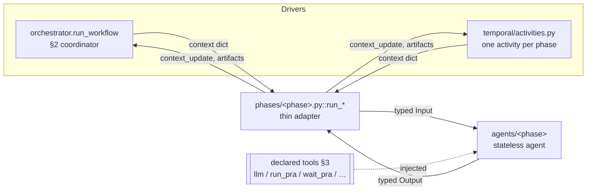
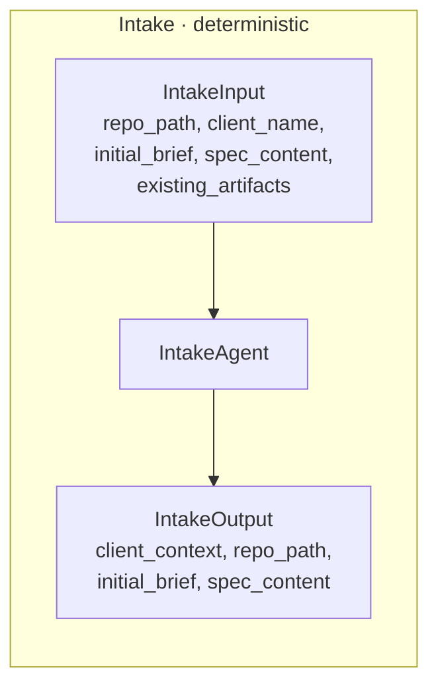
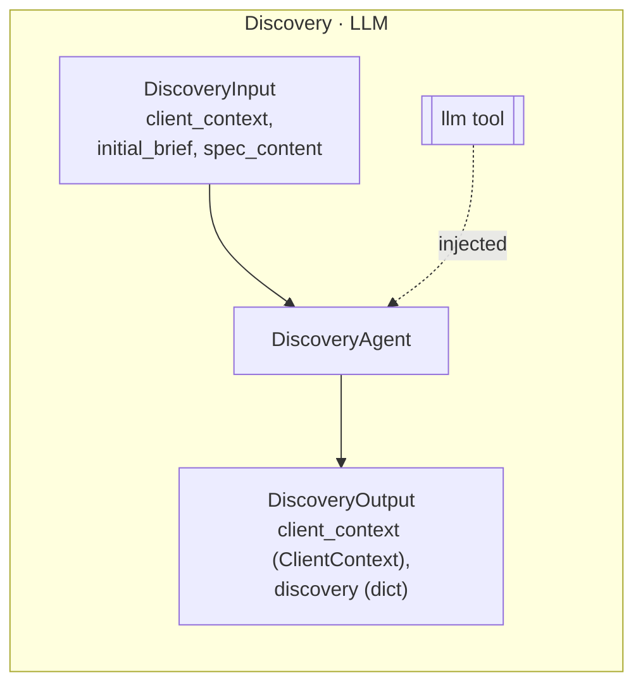
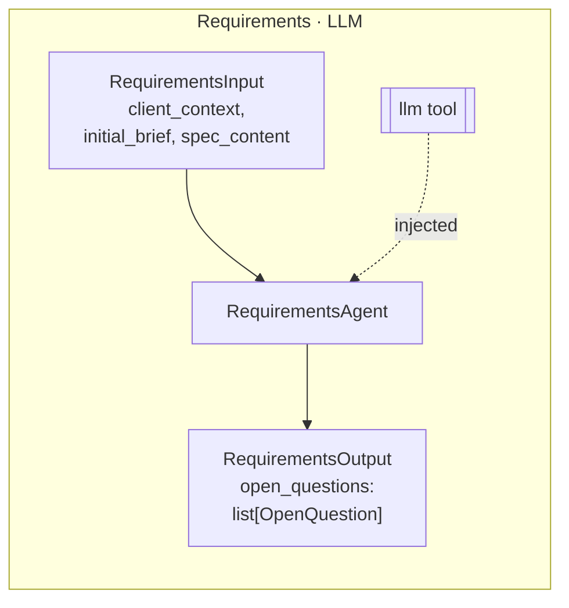
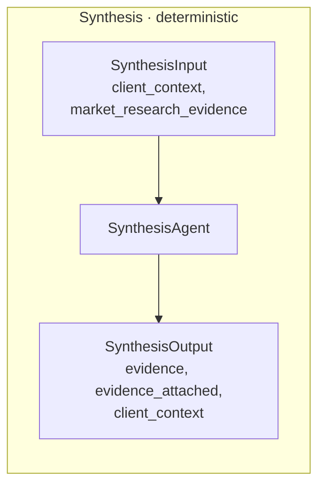
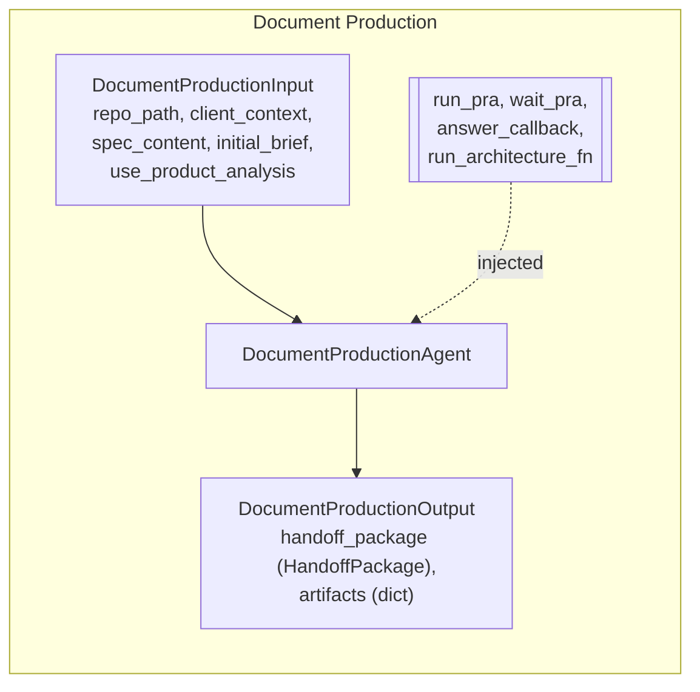
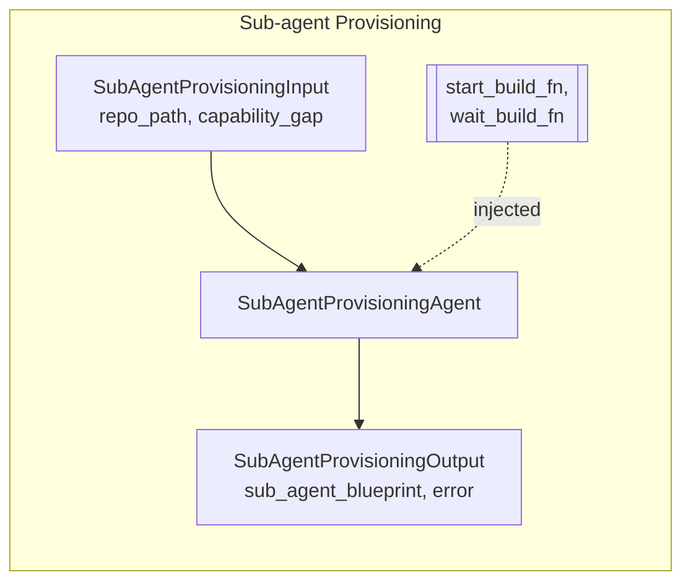
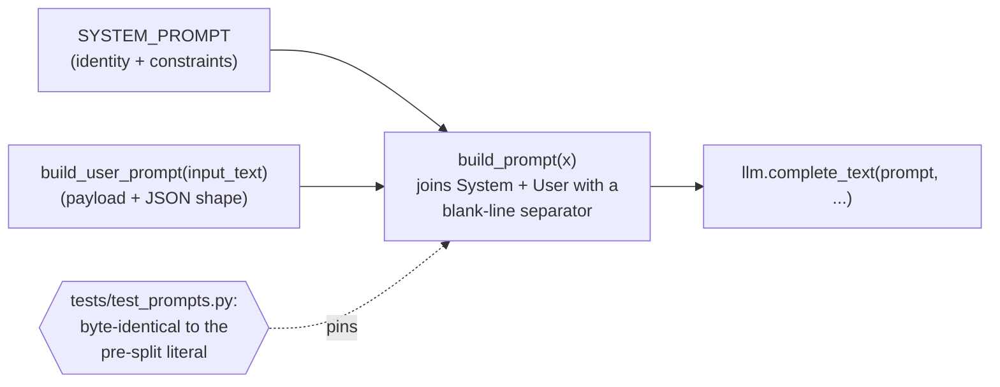

# Agent Anatomy — Input → Agent → Output

Each planning phase's logic lives in an anatomy-conformant persona-agent package under
`agents/<phase>/` (`AGENT_ANATOMY.md` §1 typed I/O, §2 coordinator, §3 tools, §5 prompt
split, §6 code-level guardrails). The matching `phases/<phase>.py::run_*` is a thin adapter
that translates the workflow `context` dict to the agent's typed **Input**, invokes the
agent (injecting its declared **tools**), and maps the typed **Output** back to the
`(context_update, artifacts)` tuple that `orchestrator.run_workflow` and the Temporal
activities consume.

## Coordinator + adapter seam

## Per-phase Input → Agent → Output

## Prompt split (§5) — discovery & requirements

The LLM runtime (`LLMClient.complete_text`) accepts a single prompt string and has no
`system_prompt` parameter, so the System/User split is documented in code and re-joined into
a byte-identical single string before the call.

