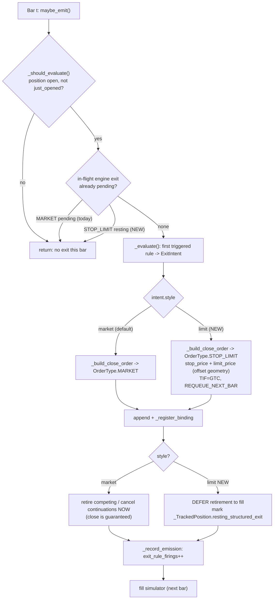
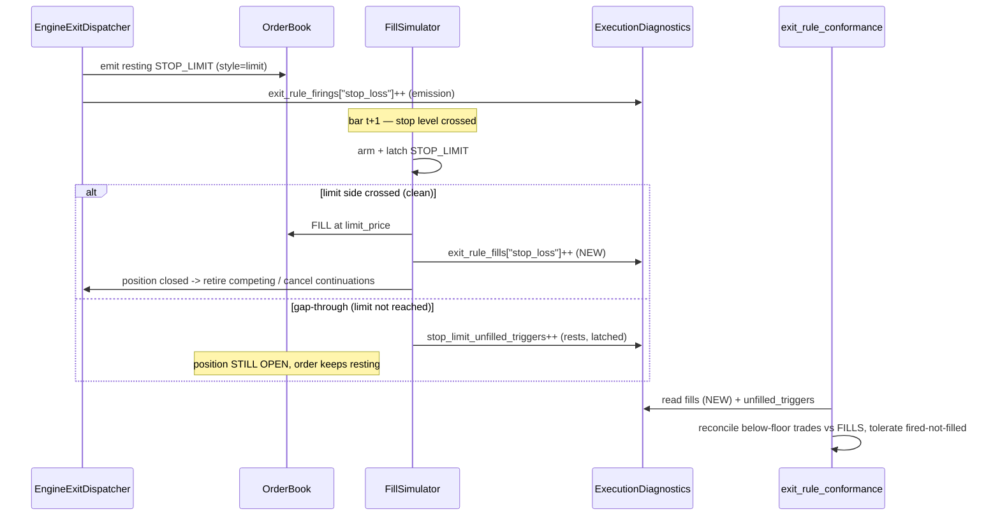
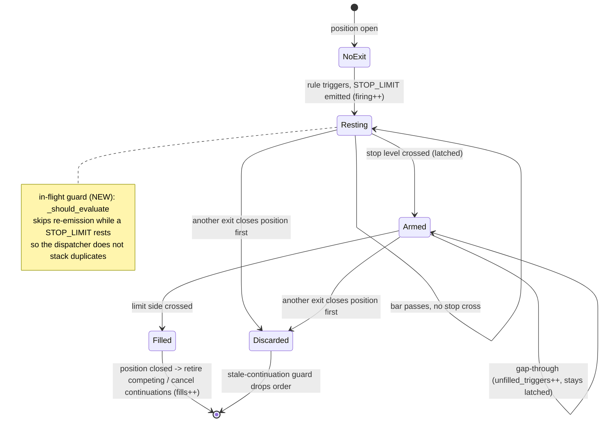

## Background

PR #921 added `STOP_LIMIT` as a real, executable order type, but only on the
**engine / bracket-attachment / custom-code** surface. The DSL *designer* still
cannot author a stop-limit exit. Today a strategy author who needs one must set
`requires_custom_code: true` or use a `StopAttachment(limit_offset=...)` bracket
leg. This plan exposes a stop-limit on the structured-exit (rule-authored) path.

The hard part is that the structured-exit path is built on a guarantee the
bracket path does not make: **a structured exit always closes the position**.
A stop-limit can legitimately *not* fill on a gap-through, which collides with
three assumptions baked into the structured-exit code:

1. `trading_service/service.py` `_build_close_order` always emits
   `OrderType.MARKET` (a guaranteed next-bar-open fill).
2. `strategy_lab/quality_gates/exit_rule_conformance.py` `_check_stop_loss`
   reconciles below-floor trades against engine *firings* (emissions) **1:1** —
   a fire with no matching closed trade reads as a leak (false critical), or
   masks a real one.
3. The position-retirement bindings (`_retire_competing_resting_orders`,
   `_cancel_pending_entry_continuations`) assume the position is closed the
   moment an engine exit emits. A non-filling DSL stop-limit would leave the
   position live while those bindings think it is gone — risking an unintended
   reverse position on a later bar.

## What already exists (reuse, don't rebuild)

The engine STOP_LIMIT machinery from PR #921 is complete and should be reused:

- `engine/execution_model.py` — `stop_limit_triggered` (trigger test) and
  `stop_limit_reference_price` (returns the limit price when filled, `None` on
  gap-through).
- `engine/fill_simulator.py` (~264–334) — arms a STOP_LIMIT on first stop cross,
  latches it into a resting limit, binds it to its position, and emits a
  `FillDiagnosticEvent(kind="stop_limit_unfilled", reason="stop_limit_gap_through")`
  when the bar gaps through.
- `engine/fill_simulator.py` (~1509–1640) — bracket-child limit-price geometry
  for `StopAttachment(limit_offset=..., limit_offset_kind=...)`; the protective
  limit sits below the stop for a long (sell) and above for a short (buy). The
  DSL `_build_close_order` branch should reuse this same geometry.
- `models.py` (~609–657) — `BacktestExecutionDiagnostics` already carries
  `exit_rule_firings`, `exit_rule_firings_by_symbol`, `exit_rule_firings_by_basis`,
  and `stop_limit_unfilled_triggers`.
- `service.py` `_apply_fill_outcome_events` already bumps
  `stop_limit_unfilled_triggers` off the diagnostic event.
- `quality_gates/exit_rule_conformance.py` already surfaces
  `stop_limit_unfilled_triggers` as additive telemetry — the new fill-based
  reconciliation builds on that framing.

So the DSL work is mostly: a new DSL surface, an emission branch that produces a
*resting* structured stop-limit (instead of a fresh market close each bar), a
fill-based counter, conformance that reconciles against fills, retirement
bindings that wait for the fill, and prompts/tests.

## Engine design impact

### Today: the structured-exit invariant

The structured-exit path runs once per bar through `_EngineExitDispatcher.maybe_emit`
(`trading_service/service.py:305`). It is built on one invariant: **an emitted
engine exit closes the position**. Three behaviors lean on it:

- `_build_close_order` (`service.py:504`) always builds `OrderType.MARKET`, which
  the fill simulator fills at the next bar's open — a guaranteed close.
- Immediately after appending the order, `maybe_emit` runs
  `_retire_competing_resting_orders` + `_cancel_pending_entry_continuations`
  (`service.py:381,383`) — it retires competing orders *now*, on the assumption
  the position is already gone.
- `_should_evaluate` (`service.py:391`) has an in-flight guard, but it only fires
  on a pending **MARKET** engine exit (`service.py:418-425`); it lets a fresh
  evaluation run otherwise. That is fine today because a market exit is
  emitted-then-immediately-filled, so it never lingers as "resting".

A limit-style stop breaks the invariant: it can be emitted, arm, and then
**gap through unfilled**, leaving the position live across bars. The diagrams
below show where the design forks.

### Per-bar dispatch (market vs limit)

The new `style` branch forks emission, retirement timing, and the in-flight
guard. The default `market` path (left) is unchanged.

**Key change — the in-flight guard.** The single most important engine change is
extending the `_should_evaluate` guard (`service.py:418-425`) to also recognize a
*resting* `STOP_LIMIT` engine exit, not just a pending `MARKET`. Without this, the
dispatcher re-evaluates the rule every bar while the stop-limit rests and stacks a
new duplicate stop-limit each bar. With it, the first emission rests and the
dispatcher stands down until that order fills or is discarded — this *is* the
"resting structured exit" concept, implemented by reusing the dispatcher's own
gate rather than a new tracking subsystem.

### Fill vs gap-through, and where the counters diverge

Today emission == fill for a market exit, so the single emission-time
`exit_rule_firings` counter is also (implicitly) a fill count. A limit-style stop
splits them: `exit_rule_firings` is bumped at emission, but a fill may never
happen. Conformance must reconcile against a *new* fill-based counter.

The fill-based counter (`exit_rule_fills` / `exit_rule_fills_by_symbol`) is bumped
in `_apply_fill_outcome_events` (`service.py:~1135`, next to the existing
`stop_limit_unfilled_triggers` bump) when an engine exit order actually fills.
`exit_rule_firings` stays emission-based so the rule-firing-rate gate is unaffected.

### Resting structured-exit lifecycle

A limit-style structured stop is a small state machine owned by the engine across
bars. The retirement of competing orders moves from emission time to fill time.

The `Armed` / `Filled` / gap-through transitions already exist in the fill
simulator (PR #921). The new work is the `Resting` state's in-flight guard and
moving retirement to the `Filled` transition. The `Discarded` path is the existing
stale-continuation guard — it already drops an armed-but-unfilled stop-limit when a
sibling exit closes the position, so the reverse-position risk is contained *as
long as retirement does not run early* (the reason for deferring it).

### The three risk sites from the issue, mapped to fixes

| Issue assumption | File / function | Fix |
|---|---|---|
| `_build_close_order` always emits MARKET | `service.py:504` | Branch on `intent.style`; emit STOP_LIMIT with limit-price geometry reused from the bracket path |
| Conformance reconciles below-floor trades vs firings 1:1 | `exit_rule_conformance.py` `_check_stop_loss` | Reconcile vs the new fill-based counter; tolerate fired-not-filled for limit-style rules |
| Retirement bindings assume position closed on emission | `service.py` `_retire_competing_resting_orders`, `_cancel_pending_entry_continuations` | Skip when the emitted exit is a non-filling resting stop-limit; defer to the fill outcome |

### Touch-point summary

- `_should_evaluate` — extend in-flight guard to resting STOP_LIMIT (anchors "resting structured exit").
- `_build_close_order` — `style` branch + STOP_LIMIT geometry; lifecycle-event `order_type` is currently hardcoded to `MARKET` (`service.py:667`) and must reflect the real type.
- `maybe_emit` — gate retirement/cancellation on `style`.
- `_apply_fill_outcome_events` — bump the new fill-based counter on fill.
- `_TrackedPosition` — carry the resting-structured-exit marker / clear it on close or discard.
- `ExitIntent` — carry `style` + `limit_offset_pct`.

## Goals

- A rule author can write a stop-limit exit:
  `StopLossRule(pct=..., style="limit", limit_offset_pct=...)`.
- `style="market"` (the default) is byte-for-byte unchanged — same DSL output,
  same MARKET emission, same conformance behavior, same retirement timing.
- A limit-style structured stop **rests and latches per position** across bars
  using the existing engine machinery, rather than being re-derived/re-emitted.
- A legitimate gap-through non-fill is **not** a conformance leak, and a real
  leak is still caught — because conformance now reconciles against *fills*.
- Retirement/cancellation of competing orders waits for the actual fill, so a
  resting unfilled stop-limit never strands a live position behind bindings that
  think it closed.
- Designer and reviewer LLMs author and validate limit-style stops correctly.

## Non-goals

- No change to the bracket-attachment or custom-code STOP_LIMIT surfaces (PR #921).
- No change to take-profit, signal-exit, or trailing-stop semantics beyond what
  is needed to keep `first_side_stop_factor` / short-safety correct.
- No new execution model; reuse `RealisticExecutionModel` / `OptimisticExecutionModel`.

## Design notes / decisions to confirm during implementation

- **Limit basis.** The issue offers `limit_offset_pct` or a "limit basis".
  Recommend `limit_offset_pct` relative to the stop price (mirrors the bracket
  `limit_offset_kind="bps"` math, just expressed as a pct), keeping a single
  mental model with the existing bracket geometry.
- **Resting vs re-emit.** The dispatcher currently re-evaluates exit rules every
  bar and emits a fresh close. For a limit-style stop we must emit/track once per
  position and let it rest. Decide where the per-position "already has a resting
  structured stop-limit" flag lives (on `_TrackedPosition`) and how it is cleared
  when the position closes or the order is discarded by the stale-continuation
  guard.
- **Effective-stop accounting.** A non-filling stop still bounds intended loss but
  not realized loss. Confirm whether `first_side_stop_factor` should keep treating
  a limit-style stop as the worst-case bound (it caps *intent*) for sizing and the
  short-safety auto-stop, and document the choice in the docstring.
- **Counter naming.** Keep emission-time `exit_rule_firings` (used by the
  rule-firing-rate gate) and add a parallel fill-based counter; do not repurpose
  the existing one, or other gates that read firings will shift.

## Affected files

- `backend/agents/investment_team/strategy_lab/spec_dsl.py` — DSL surface + `_format_rule`.
- `backend/agents/investment_team/trading_service/service.py` — `_build_close_order`,
  resting structured exit, retirement bindings, fill-based counter bump.
- `backend/agents/investment_team/trading_service/strategy/rule_compiler.py` — `ExitIntent`.
- `backend/agents/investment_team/models.py` — `BacktestExecutionDiagnostics` fill counter.
- `backend/agents/investment_team/strategy_lab/quality_gates/exit_rule_conformance.py` — `_check_stop_loss`.
- `backend/agents/investment_team/strategy_lab/prompts/design_system.md`,
  `.../prompts/_stop_order_semantics.md`, and the `design_review` reviewer prompt.
- `backend/agents/investment_team/tests/` — `test_stop_limit.py` mirror for the
  structured path, `test_exit_rule_conformance_gate.py` additions, spec_dsl tests.

## Risks

- **False conformance flips.** Getting the fire-vs-fill distinction wrong will
  either green-light real leaks or red-flag legitimate gap-throughs. The gate
  tests must cover both directions explicitly.
- **Reverse-position bug.** If retirement bindings retire competing orders while
  a stop-limit is still resting unfilled, a later bar can open an unintended
  reverse position. This is the highest-severity correctness risk; cover it with
  a dedicated engine test ("resting unfilled stop-limit does not strand the
  position / does not reverse").
- **Default-path regression.** `style="market"` must be untouched end to end.
  Keep the market branch first and assert byte-identical DSL output and MARKET
  emission in tests.

## Validation

- `cd backend && make lint && make test` (investment_team suite), coverage >= 90%
  on touched files.
- New/updated tests for: DSL validation + rendering, structured-exit fill /
  gap-through / recovery / discard, retirement-binding correctness with a resting
  unfilled stop-limit, and fill-based conformance (no false critical, real leak
  still caught).
