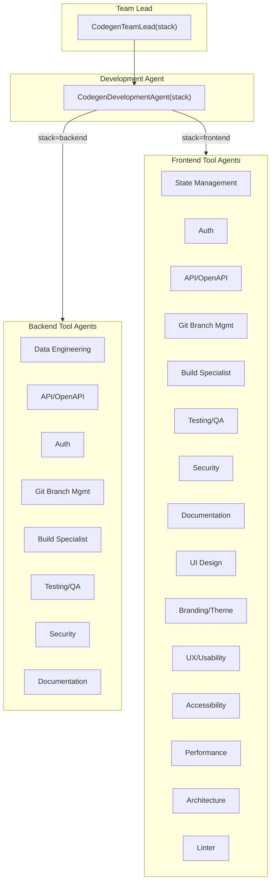
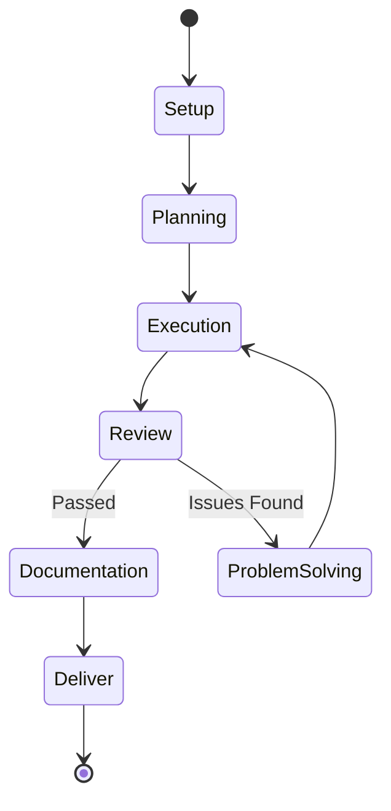

# Codegen Team

The Codegen Team is a single, configuration-driven code-generation system that produces production-ready backend (Java/Python) or frontend (Angular/React/Vue/TypeScript) code through the same 7-phase workflow with a per-stack tool-agent roster. It merges what were previously two near-identical team packages — `backend_code_v2_team` and `frontend_code_v2_team` — into one: `CodegenTeamLead`/`CodegenDevelopmentAgent` take a `stack: Literal["backend", "frontend"]` parameter at construction time instead of being two separate classes. `orchestrator.py`'s `STACK_CONFIGS`/`STACK_WIRING` compose a `StackProfile`/`V2TeamConfig` (`../shared/v2_team_config.py`) and the remaining `run_workflow`-level divergence, and bind the shared, generic phase implementations in `../shared/` — the same code runs for either stack, parameterized differently.

## Architecture



### Two-Layer Structure

| Layer | Component | Responsibility |
|-------|-----------|----------------|
| Team Lead | `CodegenTeamLead(llm, stack)` | Setup phase (repo init, branching), delegates to Development Agent |
| Development Agent | `CodegenDevelopmentAgent(llm, stack)` | A `ConfigDrivenV2DevelopmentAgent` (`../shared/v2_orchestrator.py`) bound to `STACK_CONFIGS[stack]`; executes Planning → Execution → Review → Documentation → Deliver, with Review looping back to Execution via the shared `problem_solving.py` implementation (bound per stack) when issues are found |

## Workflow Phases



### Phase Details

| Phase | Purpose | Output |
|-------|---------|--------|
| **Setup** | Initialize repo, create branches, base README | `SetupResult` |
| **Planning** | Generate microtasks from spec, detect language/stack | `PlanningResult` with microtasks |
| **Execution** | Route microtasks to tool agents, produce code | `ExecutionResult` with files |
| **Review** | Code review, QA, security, build, lint (+ accessibility/performance for frontend) | `ReviewResult` with issues |
| **Problem Solving** | Apply fixes for review issues | `ProblemSolvingResult` |
| **Documentation** | Add/update docstrings, README, API docs (Storybook for frontend) | `DocumentationPhaseResult` |
| **Deliver** | Commit, merge to main branch | `DeliverResult` |

The Review → Problem Solving → Execution cycle repeats up to `MicrotaskReviewConfig.max_retries` times (default 3) until review passes.

## Tool Agents

Each stack registers a different subset of one shared `ToolAgentKind` enum (`codegen_team/models.py`) — the roster a `CodegenDevelopmentAgent` builds and validates is enforced to match its stack's `V2TeamConfig.tool_agent_kinds` exactly.

### Backend (8)

| Agent | Execution Tasks | Review Participation |
|-------|-----------------|---------------------|
| **Data Engineering** | Database models, schemas, data integrity | Schema validation |
| **API/OpenAPI** | REST endpoints, OpenAPI specs | API contract review |
| **Auth** | Authentication, authorization, JWT/OAuth | Security review |
| **Git Branch Management** | Branch creation, commits, merges | - |
| **Build Specialist** | Runs the real build/tests; fixes failures one at a time | Build verification |
| **Testing/QA** | Unit tests, integration tests (review-only) | Test coverage review |
| **Security** | Security scanning, vulnerability checks (review-only) | Security audit |
| **Documentation** | Docstrings, README, API documentation | Documentation completeness |

### Frontend (15)

| Agent | Tasks | Review Focus |
|-------|-------|---------------|
| **State Management** | NgRx/Redux/signals/Pinia store, actions, selectors | State architecture |
| **API/OpenAPI** | Typed API client/service layer, request/response DTOs | API contract compliance |
| **Auth** | Login/logout UI, route guards, token handling | Auth flow security |
| **Architecture** | Component structure, module organization | Code organization |
| **UI Design** | Components, layouts, responsive design | Visual consistency |
| **Branding/Theme** | Theme config, colors, typography, design tokens | Brand compliance |
| **UX/Usability** | User flows, interactions, error handling | Usability best practices |
| **Accessibility** | ARIA labels, keyboard nav, screen reader support | WCAG 2.2 compliance |
| **Testing/QA** | Unit tests, component tests, E2E tests (review-only) | Test coverage |
| **Security** | XSS prevention, CSP, input sanitization (review-only) | Frontend security |
| **Performance** | Code splitting, lazy loading, bundle optimization | Core Web Vitals |
| **Linter** | Runs the real linter (ESLint, JSON output); fixes violations one at a time | Code style |
| **Build Specialist** | Runs the real build; fixes failures one at a time | Build performance |
| **Git Branch Management** | Branch creation, commits, merges | - |
| **Documentation** | Component docs, README, Storybook stories | Doc completeness |

Backend's `data_engineering` has no frontend counterpart; frontend's `state_management`/`ui_design`/`branding_theme`/`ux_usability`/`accessibility`/`performance`/`architecture`/`linter` have no backend counterpart. `auth`/`api_openapi`/`documentation`/`testing_qa`/`security`/`git_branch_management`/`build_specialist` are wired for both stacks (frontend's `auth`/`api_openapi`/`state_management`/`linter` are real generators/analyzers, not stubs — the functional gap that previously existed between the two teams has been closed).

## Microtask System

Work is broken into discrete microtasks during the Planning phase:

```python
class Microtask(BaseModel):
    id: str              # Unique kebab-case ID, e.g. "mt-create-user-model"
    title: str           # Short human-readable title
    description: str     # What needs to be done
    tool_agent: ToolAgentKind  # Which agent handles this
    status: MicrotaskStatus    # pending, in_progress, completed, failed, etc.
    depends_on: List[str]      # Prerequisite microtask IDs
    output_files: Dict[str, str]  # Files produced (path → content)
    notes: str           # Agent recommendations
```

## Usage

### Programmatic

```python
from shared.llm import LLMClient
from software_engineering_team.codegen_team.orchestrator import CodegenTeamLead
from pathlib import Path

llm = LLMClient()
lead = CodegenTeamLead(llm, stack="backend")  # or stack="frontend"

result = lead.run_workflow(
    repo_path=Path("/path/to/repo"),
    task=task,  # shared.dev_models.models.Task
)

if result.success:
    print(f"Codegen complete: {result.summary}")
    print(f"Files created: {list(result.final_files.keys())}")
else:
    print(f"Failed: {result.failure_reason}")
```

### With Job Updates

```python
def update_job(**kwargs):
    print(f"Progress: {kwargs.get('progress', 0)}%")
    print(f"Phase: {kwargs.get('current_phase', 'unknown')}")

result = lead.run_workflow(
    repo_path=repo_path,
    task=task,
    job_updater=update_job,
)
```

## Per-Microtask Review Gates

```python
from software_engineering_team.codegen_team.models import MicrotaskReviewConfig

config = MicrotaskReviewConfig(
    max_retries=3,                # Max problem-solving attempts per microtask
    on_failure="skip_continue",   # "stop" or "skip_continue"
    code_review_max_retries=3,    # Per-gate retry caps (backend's execution
    qa_max_retries=3,             # bindings read these directly; frontend's
    security_max_retries=3,       # compute their retry cap from max_retries
    documentation_max_retries=3,  # and do not read these)
)
```

## Language/Stack Support

| Stack | Detected | Build/Test |
|-------|----------|------------|
| Backend — Python | pip, poetry, `pyproject.toml`/`requirements.txt` | pytest |
| Backend — Java | Maven, Gradle | JUnit |
| Frontend — Angular | `angular.json`, `@angular/core` | `ng build` / Vitest |
| Frontend — React | `package.json` `"react"` dep | Vite/npm build / Vitest |
| Frontend — Vue/TypeScript | `tsconfig.json`, `.ts`/`.tsx` files | npm build / Vitest |

## Output Files

Backend output lands under `{repo_path}/backend/`; frontend output lands under `{repo_path}/frontend/` — each stack's `output_template_path_prefixes` (`V2TeamConfig`) strips the corresponding prefix from generated file paths.

## Configuration

Review → problem-solving cycles are capped by `MicrotaskReviewConfig` fields (see
[§ Per-Microtask Review Gates](#per-microtask-review-gates)), not an environment
variable — `max_retries` (default 3) is the overall per-microtask cap.

## Directory Structure

```
codegen_team/
├── orchestrator.py         # CodegenTeamLead, CodegenDevelopmentAgent, STACK_CONFIGS, STACK_WIRING
├── models.py                # Phase, Microtask, unified ToolAgentKind, all result models
├── stacks/
│   ├── backend/
│   │   ├── profile.py        # StackProfile + V2TeamConfig (BACKEND_CONFIG) and bindings
│   │   ├── prompts.py         # Backend LLM prompts
│   │   └── problem_solving.py # Binds the shared fix-loop + phase-fix functions
│   └── frontend/
│       ├── profile.py         # StackProfile + V2TeamConfig (FRONTEND_CONFIG) and bindings
│       ├── prompts.py         # Frontend LLM prompts
│       └── problem_solving.py # Binds the shared fix-loop + phase-fix functions
└── tool_agents/
    ├── backend/    # data_engineering, api_openapi, auth, build_specialist,
    │               # testing_qa, security, documentation
    └── frontend/   # state_management, auth, api_openapi, architecture, ui_design,
                     # branding_theme, ux_usability, accessibility, testing_qa,
                     # security, performance, linter, build_specialist, documentation
```

Git Branch Management (the sixteenth tool-agent kind, shared by both stacks) lives at `../shared/tool_agent_git_branch.py` rather than under `tool_agents/` here.

The Setup, Execution, Review, Documentation, Planning, Deliver, and Problem-solving phase implementations — including the phase-specific fix functions (`run_code_review_fixes`/`run_qa_fixes`/`run_security_fixes`/`run_documentation_fixes`) — are fully shared between both stacks and live in `../shared/` (`v2_orchestrator.py`, `v2_phase_bindings.py`, `v2_execution_bindings.py`, `v2_review_bindings.py`, `phases/{setup,execution,review,documentation,planning,deliver,problem_solving}.py`), configured per stack by `stacks/{backend,frontend}/profile.py`'s `BACKEND_CONFIG`/`FRONTEND_CONFIG`.

## Integration with SE Team

Codegen is called by the coding-team Tech Lead + Task Graph engine (`../coding_engine_provider.py`, via the `CodeEngineProvider` seam) for tasks classified backend/frontend, and is also reachable as a standalone workflow:

1. A task is classified `"backend"` or `"frontend"` (`../team_routing.py`)
2. It is delegated to `CodegenTeamLead(llm, stack=...)`
3. Codegen completes the 7-phase workflow
4. Results are returned to the caller (coding-team Tech Lead, or the standalone Temporal workflow behind `/backend-code-v2/run` / `/frontend-code-v2/run` / `/code-v2/run`)
5. On the coding-team path, the Tech Lead proceeds with review/merge, integration, DevOps, etc.

## Khala platform

This package is part of the [Khala](../../../../README.md) monorepo (Unified API, Angular UI, and full team index).
