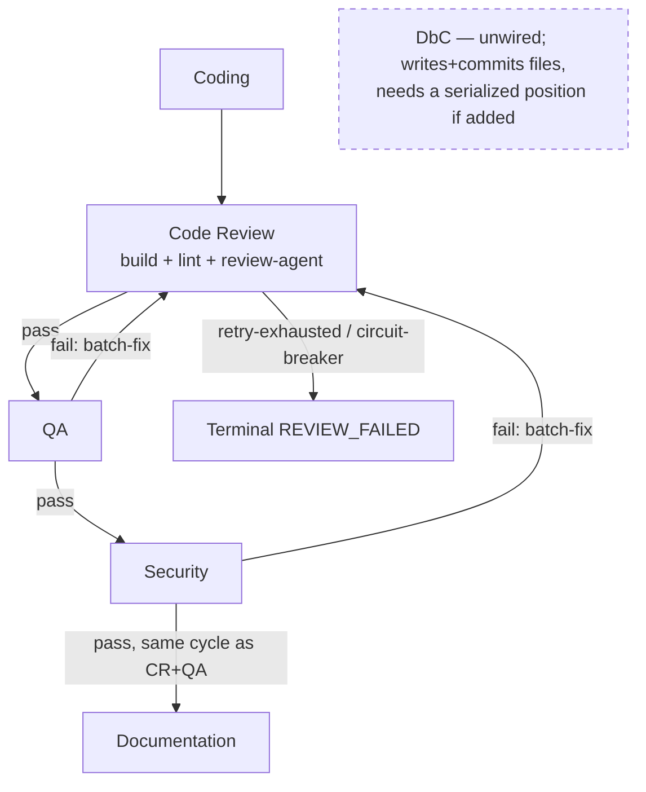

# Per-Task Gate Dependency Graph

## Purpose

Parent effort: parallelize independent gates within per-task execution. Before any
gate can safely run concurrently, this document maps the data and control-flow
dependencies between the per-task quality gates (build, code review, security, QA,
DbC) driven by `run_gated_execution_impl` in
[`shared/phases/execution.py`](../shared/phases/execution.py). It defines the safe
parallelization boundary for a follow-up implementation change — it makes no code
changes itself.

Scope: this document covers the **intra-task** gate sequence for a single microtask
(coding → review gates → documentation). Cross-microtask ordering
(`mt.depends_on` / `review_failed_ids`, and the shared `all_files` accumulator that
gives later microtasks visibility into earlier ones' output) is a separate,
coarser-grained dependency and is out of scope here.

## Current gate sequence

Per microtask, `run_gated_execution_impl` (`shared/phases/execution.py:1350-1581`)
runs five phases in strict order:

1. **Coding** — `_execute_coding_phase` (`shared/phases/execution.py:693-784`).
   Generates `mt.output_files` / `microtask_files`, writes them to disk, and updates
   the running `all_files` map. An exception or unsafe-write failure ends the
   microtask here (`FAILED` / `REVIEW_FAILED`) — phases 2-5 never run.
2. **Code Review → QA → Security cycle** — `_run_review_cycles`
   (`shared/phases/execution.py:785-1223`), an outer `while` loop bounded by
   `max_total_cycles`:
   - **Code Review** (`gate_config.run_code_review_gate` →
     `run_code_review_phase_impl`, `shared/phases/review.py:45-187`): build
     verification → lint → code-review-agent, run sequentially inside this one
     gate. Has its own inner retry loop, up to `code_review_retry_cap`, that
     batch-fixes and re-checks *before* the outer cycle advances.
   - **QA** (`gate_config.run_qa_gate` → `run_qa_testing_phase_impl`,
     `shared/phases/review.py:391-437`, sharing the parameterised
     `_run_agent_testing_phase` body at lines 213-389). On failure, batch-fixes once
     and `continue`s — which restarts the outer loop **from Code Review**, not just
     QA.
   - **Security** (`gate_config.run_security_gate` →
     `run_security_testing_phase_impl`, `shared/phases/review.py:439+`, same shared
     `_run_agent_testing_phase` body). Same restart-from-Code-Review behavior on
     failure; can force a hard stop via `config.security_failure_always_stops`.
   - The loop only `break`s to phase 5 once Code Review, then QA, then Security all
     pass **in the same outer cycle**.
   - **Frontend-only terminal edge**: the post-loop max-cycles check
     (`shared/phases/execution.py:1189-1191`) runs unconditionally after the loop
     exits, even when the exit was a clean `break` on a fully-passing cycle. It only
     skips marking the microtask `REVIEW_FAILED` when `still_failing` is false *or*
     `gate_config.max_cycles_requires_failing_gate` is true. The backend config sets
     `max_cycles_requires_failing_gate=True`, so a clean pass on the capped cycle
     still proceeds to Documentation. The frontend config sets it to `False`
     (`frontend_code_v2_team/phases/execution.py:278`), so on the frontend, passing
     every gate on the exact cycle that also happens to hit `max_total_cycles` is
     still marked `REVIEW_FAILED` and does **not** proceed to Documentation — a
     frontend-only terminal edge that any concurrency redesign must preserve or
     deliberately change.
3. **Documentation** — `_run_documentation_phase`
   (`shared/phases/execution.py:1224-1349`). Only runs `if not phase_failed`, i.e.
   only after Code Review + QA + Security all passed together.

**DbC** (`run_dbc_comments`, `backend/agents/software_engineering_team/quality_gate_tools.py`)
is not wired into this pipeline at all — no caller in `orchestrator.py` or
`shared/phases/execution.py` invokes it; it is currently only exercised from
`tests/test_quality_gate_tools.py`. It is included below as a dormant gate because
the parent effort names it, but it has no live position in the sequence today.

## Per-gate inputs / outputs

| Gate | Implementation | Reads | Writes |
|---|---|---|---|
| Coding | `_execute_coding_phase` (`execution.py:693-784`) | `mt` (id/title/description/tool_agent/depends_on), `task`, `planning_result.language`, `architecture`, `existing_code`, `repo_path`, running `all_files` | `mt.output_files`, `microtask_files`, disk writes, updates `all_files` in place |
| Build verification | inside `run_code_review_phase_impl` (`review.py:45-187`) | `microtask_files`, `repo_path` (runs build against disk), `deps.build_verifier` | `ReviewIssue(source="build")` on failure (does not short-circuit lint/code-review) |
| Lint | inside `run_code_review_phase_impl` | `microtask_files`, `deps.linting_tool_agent` | `ReviewIssue(source="lint")` |
| Code review (agent) | `_code_review_step` via `run_code_review_phase_impl` | `microtask_files`, `review_context` (architecture/spec), `config.enable_llm_review_grounding` | `ReviewIssue(source="code_review", ...)`; combined `GateOutcome(passed, issues, summary, raw_issue_count)` (`execution.py:360-377`) |
| QA (backend) | `run_qa_testing_phase_impl` → `_run_agent_testing_phase` (`review.py:391-437`, body at `213-389`) | `microtask_files` (post-CR content), `deps.qa_agent`, `agent_review_cache`, and **only** `deps.tool_agents["testing_qa"]` — the shared body filters by `spec.tool_kind` (`review.py:294-296`) before calling any tool agent | `GateOutcome` with `source="qa"` issues |
| Security (backend) | `run_security_testing_phase_impl` → `_run_agent_testing_phase` (`review.py:439+`, same shared body) | `microtask_files`, `deps.security_agent`, `agent_review_cache`, and **only** `deps.tool_agents["security"]`, filtered the same way | `GateOutcome` with `source="security"` issues |
| QA / Security (frontend) | `_qa_gate` (`frontend_code_v2_team/phases/execution.py:185-217`) / `_security_gate` (`218-244`) → `run_microtask_review` (`frontend_code_v2_team/phases/review.py:255` → `shared/v2_review.py:750-921`) | `microtask_files`, `deps.qa_agent` or `deps.security_agent`, and the **entire, unfiltered** `deps.tool_agents` mapping (see note below) | `GateOutcome`, filtered post hoc to `source="qa"` or `source="security"` |
| Documentation | `_run_documentation_phase` (`execution.py:1224-1349`) | `microtask_files` (last review-accepted write), `deps.tool_agents[DOCUMENTATION]`, `task.description` | Refined `doc_files` merged into `microtask_files`/`all_files`/`mt.output_files`; sets `mt.status = COMPLETED` |
| DbC (dormant) | `run_dbc_comments` (`quality_gate_tools.py:232-303`) | Whole repo directory tree on disk (not `microtask_files`) | Pre/postcondition comments written to disk **and committed** (`write_files_and_commit`, `quality_gate_tools.py:271-294`); not currently invoked by the pipeline |

## Dependency graph

Edge classification:

- **Hard data dependency**: Coding → {Code Review, QA, Security, Documentation}.
  Every gate reads the file content Coding (or a prior gate's fix-write) produced;
  none can run before Coding completes for that microtask.
- **Hard data dependency, both directions**: Code Review ⇄ QA and Code Review ⇄
  Security. A QA or Security failure's batch-fix output is *re-validated by Code
  Review* before either gate runs again — QA/Security fixes are not accepted
  standalone.
- **Control-flow-only dependency, no data dependency — backend only**: QA →
  Security. The two gates read/write disjoint issue namespaces (`source="qa"` vs
  `source="security"`) and, on the **backend**, call different agents/tool-agent
  kinds with no data exchange between them (`_run_agent_testing_phase` filters
  `tool_agents` down to the single `spec.tool_kind` entry, `review.py:295-297`).
  Nothing about Security's verdict depends on QA's *content* there. The only
  reason Security currently waits for QA is that the loop structure runs them
  sequentially and a QA failure `continue`s before Security is ever reached.
  **This does not hold as cleanly on the frontend**: both `_qa_gate` and
  `_security_gate` call `run_microtask_review` with the *entire* `deps.tool_agents`
  mapping (`frontend_code_v2_team/phases/execution.py:185-244`), and
  `_run_tool_agents_review` (`shared/v2_review.py:522-576`, used via
  `run_microtask_review`) invokes every tool agent in that mapping unconditionally
  (`for kind, agent in tool_agents.items()`), then each gate keeps only the issues
  matching its own `source`. So on the frontend, a naive `parallel(QA, Security)`
  would run every wired tool agent twice per microtask cycle and call the same
  agent instances concurrently — a real resource/duplication problem, not just a
  reordering. Frontend QA/Security concurrency needs the tool-agent fan-out
  scoped per gate (mirroring the backend's `spec.tool_kind` filter) before it can
  be considered safe.
- **Hard data dependency**: {Code Review, QA, Security} → Documentation.
  Documentation only runs once `phase_failed` is `False`, i.e. after all three
  gates passed together in one cycle, and reads the resulting accepted file state.
- **Currently disconnected, but not safe to run independently if wired in**: DbC.
  It re-scans the repo on disk rather than consuming any `GateOutcome`, and is not
  invoked by `run_gated_execution_impl` at all today — but `run_dbc_comments`
  itself writes and commits files back to the worktree
  (`quality_gate_tools.py:261-294`, `write_files_and_commit`). That write makes it
  unsafe to run concurrently with the other gates (a concurrent build/review could
  observe a changing worktree mid-scan), and unsafe to run *after* the loop as an
  independent pass, since its generated edits would then bypass Code Review, QA,
  and Security entirely. If wired in, DbC needs an explicit serialized position —
  either before the review cycle (so its edits get reviewed like any other code
  change) or as an additional review pass after it — not a "no dependency,
  run-whenever" classification.
- **Build verification is not a read-only check**: on failure, the production
  verifier calls `_try_build_fix_one_at_a_time` (`build_fix.py`), which writes
  LLM-generated patches directly to the worktree (`out_path.write_text`,
  `build_fix.py:539-544`) and re-runs the build in a repair loop, before returning
  pass/fail. So build verification, lint, and the code-review-agent call do
  **not** necessarily read one immutable snapshot: running them concurrently could
  have lint inspect files during or before an in-place build repair, while code
  review evaluates a stale in-memory `files` map, merging verdicts computed
  against different versions of the source. Treating these three as
  parallelizable requires first separating verification (read-only) from repair
  (mutating), or freezing/isolating the workspace for the duration of the gate —
  it is not a drop-in change as currently structured.

## Parallelization boundary conclusions

**Cannot run in parallel as currently coded** (would change observable behavior):

- Coding → Code Review → QA → Security → Documentation as a whole: strictly
  sequential by design, since each stage consumes the prior stage's file output.
- The Code-Review-must-re-validate-every-QA/Security-fix loop: this is the crux of
  why QA and Security can't simply run side by side today — a naive
  `parallel(QA, Security)` would still need Code Review to re-run on the merged fix
  set, and the current loop conflates "QA failed" with "go re-run Code Review"
  rather than "go re-run only QA".
- Documentation: hard-gated on all three review gates passing in the same cycle;
  cannot start earlier without weakening that invariant.
- DbC, if wired in: it writes and commits files directly
  (`quality_gate_tools.py:261-294`), so it cannot run concurrently with the other
  gates (worktree race) nor as an independent pass after them (its edits would
  bypass review) — see the dependency-graph note above.
- The frontend's post-loop max-cycles check: because
  `max_cycles_requires_failing_gate=False`
  (`frontend_code_v2_team/phases/execution.py:278`), a redesign that changes when
  or how the cap is evaluated must explicitly decide whether to preserve today's
  behavior (a fully-passing capped cycle is still `REVIEW_FAILED` on frontend) or
  change it — this is a behavioral edge, not a parallelization opportunity, but it
  constrains how Documentation's gating can be restructured.

**Needs restructuring before it can be parallelized (not a drop-in change):**

- Build verification, lint, and the code-review-agent call inside the Code Review
  gate (`review.py:45-187`) are not read-only against a shared immutable snapshot:
  build verification's failure path mutates the worktree in place via
  `_try_build_fix_one_at_a_time` (`build_fix.py:539-544`). Parallelizing these
  three requires first separating read-only verification from in-place repair (or
  freezing the workspace for the gate's duration) — see the dependency-graph note
  above.

**Safe to parallelize with modest restructuring:**

- QA and Security **analysis calls, on the backend** — if both gates' checks were
  run against the same immutable post-Code-Review snapshot before any fix is
  applied (collect QA's and Security's issues together, batch-fix once, then
  re-run Code Review once), the two analysis calls themselves have no data
  dependency and could run concurrently, since the backend already scopes each
  gate's tool-agent call to its own `spec.tool_kind`. This is a real pipeline
  change (today Security only starts once QA has already passed), not a drop-in
  optimization — it changes the retry/restart semantics described above and needs
  its own design before implementation.
- QA and Security analysis calls **on the frontend** are not yet in this bucket:
  concurrency is only safe once the frontend's tool-agent fan-out
  (`_run_tool_agents_review` via `run_microtask_review`) is scoped per gate the
  way the backend's `_run_agent_testing_phase` already is — otherwise concurrent
  QA/Security would duplicate every wired tool-agent call and invoke shared agent
  instances concurrently (see the dependency-graph note above).

The follow-up implementation issue should scope itself to the backend QA/Security
analysis concurrency item above (extending it to the frontend only after the
tool-agent fan-out is scoped per gate), and, only after isolating build
verification's repair path from its read-only checks, the Code-Review sub-steps
item — rather than attempting to parallelize the full sequential chain. DbC is out
of scope for parallelization — if it is wired in, it needs an explicit serialized
position in the sequence, not a concurrent or independent one. Any redesign must
also preserve (or deliberately revisit) the frontend-only terminal edge at the
cycle cap noted above.
