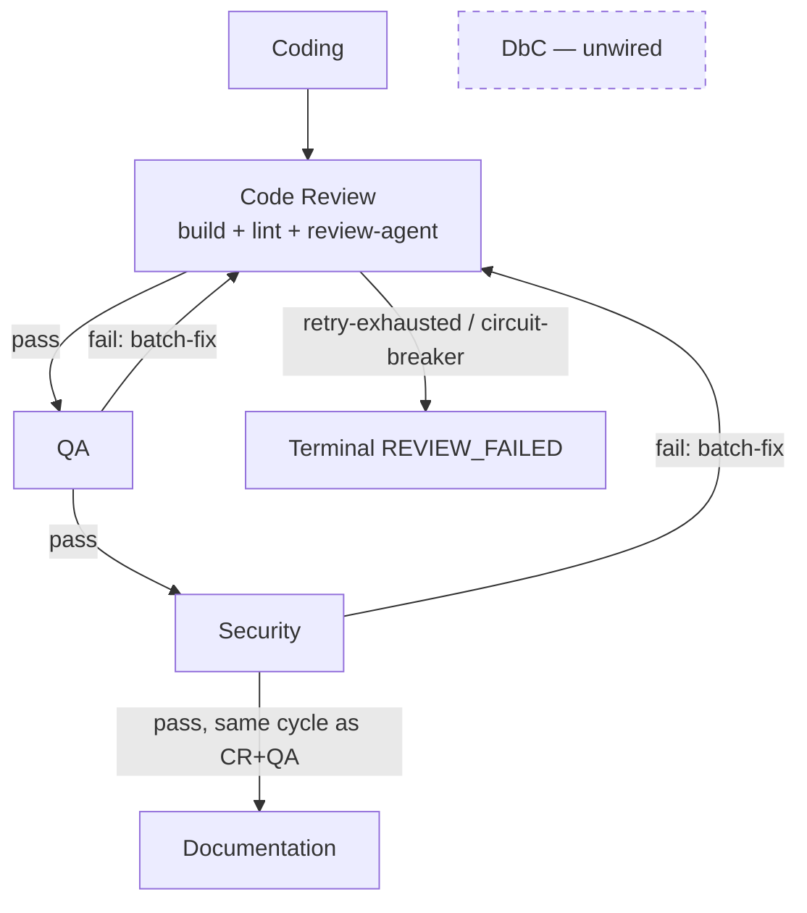

# Per-Task Gate Dependency Graph

## Purpose

Parent effort: parallelize independent gates within per-task execution. Before any
gate can safely run concurrently, this document maps the data and control-flow
dependencies between the per-task quality gates (build, code review, security, QA,
DbC) driven by `run_gated_execution_impl` in
[`shared/phases/execution.py`](../shared/phases/execution.py). It defines the safe
parallelization boundary for a follow-up implementation change — it makes no code
changes itself.

Scope: this document covers the **intra-task** gate sequence for a single microtask
(coding → review gates → documentation). Cross-microtask ordering
(`mt.depends_on` / `review_failed_ids`, and the shared `all_files` accumulator that
gives later microtasks visibility into earlier ones' output) is a separate,
coarser-grained dependency and is out of scope here.

## Current gate sequence

Per microtask, `run_gated_execution_impl` (`shared/phases/execution.py:1548-1780`)
runs five phases in strict order:

1. **Coding** — `_execute_coding_phase` (`shared/phases/execution.py:891-980`).
   Generates `mt.output_files` / `microtask_files`, writes them to disk, and updates
   the running `all_files` map. An exception or unsafe-write failure ends the
   microtask here (`FAILED` / `REVIEW_FAILED`) — phases 2-5 never run.
2. **Code Review → QA → Security cycle** — `_run_review_cycles`
   (`shared/phases/execution.py:983-1419`), an outer `while` loop bounded by
   `max_total_cycles`:
   - **Code Review** (`gate_config.run_code_review_gate` →
     `run_code_review_phase_impl`, `shared/phases/review.py:45-187`): build
     verification → lint → code-review-agent, run sequentially inside this one
     gate. Has its own inner retry loop, up to `code_review_retry_cap`, that
     batch-fixes and re-checks *before* the outer cycle advances.
   - **QA** (`gate_config.run_qa_gate` → `run_qa_testing_phase_impl`,
     `shared/phases/review.py:391-437`, sharing the parameterised
     `_run_agent_testing_phase` body at lines 213-389). On failure, batch-fixes once
     and `continue`s — which restarts the outer loop **from Code Review**, not just
     QA.
   - **Security** (`gate_config.run_security_gate` →
     `run_security_testing_phase_impl`, `shared/phases/review.py:439+`, same shared
     `_run_agent_testing_phase` body). Same restart-from-Code-Review behavior on
     failure; can force a hard stop via `config.security_failure_always_stops`.
   - The loop only `break`s to phase 5 once Code Review, then QA, then Security all
     pass **in the same outer cycle**.
3. **Documentation** — `_run_documentation_phase`
   (`shared/phases/execution.py:1422-1546`). Only runs `if not phase_failed`, i.e.
   only after Code Review + QA + Security all passed together.

**DbC** (`run_dbc_comments`, `backend/agents/software_engineering_team/quality_gate_tools.py`)
is not wired into this pipeline at all — no caller in `orchestrator.py` or
`shared/phases/execution.py` invokes it; it is currently only exercised from
`tests/test_quality_gate_tools.py`. It is included below as a dormant gate because
the parent effort names it, but it has no live position in the sequence today.

## Per-gate inputs / outputs

| Gate | Implementation | Reads | Writes |
|---|---|---|---|
| Coding | `_execute_coding_phase` (`execution.py:891-980`) | `mt` (id/title/description/tool_agent/depends_on), `task`, `planning_result.language`, `architecture`, `existing_code`, `repo_path`, running `all_files` | `mt.output_files`, `microtask_files`, disk writes, updates `all_files` in place |
| Build verification | inside `run_code_review_phase_impl` (`review.py:45-187`) | `microtask_files`, `repo_path` (runs build against disk), `deps.build_verifier` | `ReviewIssue(source="build")` on failure (does not short-circuit lint/code-review) |
| Lint | inside `run_code_review_phase_impl` | `microtask_files`, `deps.linting_tool_agent` | `ReviewIssue(source="lint")` |
| Code review (agent) | `_code_review_step` via `run_code_review_phase_impl` | `microtask_files`, `review_context` (architecture/spec), `config.enable_llm_review_grounding` | `ReviewIssue(source="code_review", ...)`; combined `GateOutcome(passed, issues, summary, raw_issue_count)` (`execution.py:558-575`) |
| QA | `run_qa_testing_phase_impl` (`review.py:391-437`) | `microtask_files` (post-CR content), `deps.qa_agent`, `deps.tool_agents[TESTING_QA]`, `agent_review_cache` | `GateOutcome` with `source="qa"` issues |
| Security | `run_security_testing_phase_impl` (`review.py:439+`) | `microtask_files`, `deps.security_agent`, `deps.tool_agents[SECURITY]`, `agent_review_cache` | `GateOutcome` with `source="security"` issues |
| Documentation | `_run_documentation_phase` (`execution.py:1422-1546`) | `microtask_files` (last review-accepted write), `deps.tool_agents[DOCUMENTATION]`, `task.description` | Refined `doc_files` merged into `microtask_files`/`all_files`/`mt.output_files`; sets `mt.status = COMPLETED` |
| DbC (dormant) | `run_dbc_comments` (`quality_gate_tools.py`) | Whole repo directory tree on disk (not `microtask_files`) | Pre/postcondition comments added to files; not currently invoked by the pipeline |

## Dependency graph

Edge classification:

- **Hard data dependency**: Coding → {Code Review, QA, Security, Documentation}.
  Every gate reads the file content Coding (or a prior gate's fix-write) produced;
  none can run before Coding completes for that microtask.
- **Hard data dependency, both directions**: Code Review ⇄ QA and Code Review ⇄
  Security. A QA or Security failure's batch-fix output is *re-validated by Code
  Review* before either gate runs again — QA/Security fixes are not accepted
  standalone.
- **Control-flow-only dependency, no data dependency**: QA → Security. The two
  gates read/write disjoint issue namespaces (`source="qa"` vs `source="security"`)
  and call different agents/tool-agent kinds with no data exchange between them.
  Nothing about Security's verdict depends on QA's *content*. The only reason
  Security currently waits for QA is that the loop structure runs them
  sequentially and a QA failure `continue`s before Security is ever reached.
- **Hard data dependency**: {Code Review, QA, Security} → Documentation.
  Documentation only runs once `phase_failed` is `False`, i.e. after all three
  gates passed together in one cycle, and reads the resulting accepted file state.
- **No dependency (currently disconnected)**: DbC. It re-scans the repo on disk
  rather than consuming any `GateOutcome`, and is not invoked by
  `run_gated_execution_impl` at all today.
- **Independent sub-steps, currently serialized**: within Code Review, build
  verification, lint, and the code-review-agent call each read the same static
  `microtask_files` snapshot and don't consume each other's output — they are run
  one after another today (`review.py:45-187`) purely as an implementation
  artifact, not because of a data dependency.

## Parallelization boundary conclusions

**Cannot run in parallel as currently coded** (would change observable behavior):

- Coding → Code Review → QA → Security → Documentation as a whole: strictly
  sequential by design, since each stage consumes the prior stage's file output.
- The Code-Review-must-re-validate-every-QA/Security-fix loop: this is the crux of
  why QA and Security can't simply run side by side today — a naive
  `parallel(QA, Security)` would still need Code Review to re-run on the merged fix
  set, and the current loop conflates "QA failed" with "go re-run Code Review"
  rather than "go re-run only QA".
- Documentation: hard-gated on all three review gates passing in the same cycle;
  cannot start earlier without weakening that invariant.

**Safe to parallelize as-is, or with modest restructuring, with no change to what
gets checked:**

- Build verification, lint, and the code-review-agent call inside the Code Review
  gate (`review.py:45-187`) — they read one immutable file snapshot and produce
  independent `ReviewIssue` lists that are already merged after the fact. Running
  them concurrently and merging results is a pure latency win with no ordering
  change.
- QA and Security **analysis calls** — if both gates' checks were run against the
  same immutable post-Code-Review snapshot before any fix is applied (collect QA's
  and Security's issues together, batch-fix once, then re-run Code Review once),
  the two analysis calls themselves have no data dependency and could run
  concurrently. This is a real pipeline change (today Security only starts once QA
  has already passed), not a drop-in optimization — it changes the retry/restart
  semantics described above and needs its own design before implementation.
- DbC, if it were wired in: since it operates on the whole repo tree rather than
  per-microtask `microtask_files` and consumes no `GateOutcome`, it could run
  independently of (or after) the whole gated loop with no data dependency on the
  other four gates.

The follow-up implementation issue should scope itself to the two "modest
restructuring" items above (Code-Review sub-steps, and QA/Security analysis
concurrency) rather than attempting to parallelize the full sequential chain.
