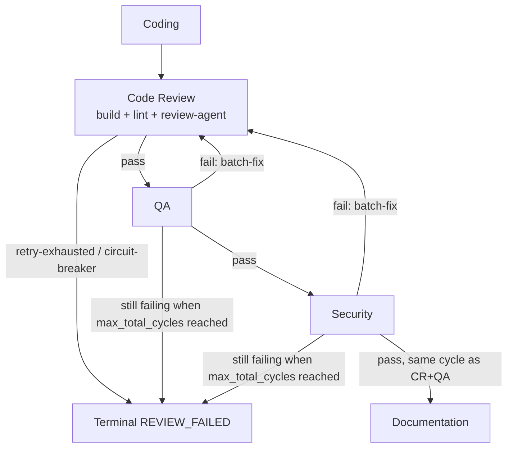

# Per-Task Gate Dependency Graph

## Purpose

Parent effort: parallelize independent gates within per-task execution. Before any
gate can safely run concurrently, this document maps the data and control-flow
dependencies between the per-task gates (coding, code review, QA, security, and
documentation) driven by `run_gated_execution_impl` in
[`shared/phases/execution.py`](../shared/phases/execution.py). It defines the safe
parallelization boundary for a follow-up implementation change — it makes no code
changes itself. ("Build" is not a standalone gate here — it's a sub-step inside
Code Review; see the per-gate table below.)

Scope: this document covers the **intra-task** gate sequence for a single microtask
(coding → review gates → documentation). Cross-microtask ordering
(`mt.depends_on` / `review_failed_ids`, and the shared `all_files` accumulator that
gives later microtasks visibility into earlier ones' output) is a separate,
coarser-grained dependency and is out of scope here.

## Current gate sequence

Per microtask, `run_gated_execution_impl` (`shared/phases/execution.py:1350-1581`)
runs five phases in strict order:

1. **Coding** — `_execute_coding_phase` (`shared/phases/execution.py:693-782`).
   Generates `mt.output_files` / `microtask_files`, writes them to disk, and updates
   the running `all_files` map. An exception or unsafe-write failure ends the
   microtask here (`FAILED` / `REVIEW_FAILED`) — phases 2-5 never run.
2. **Code Review → QA → Security cycle** — `_run_review_cycles`
   (`shared/phases/execution.py:785-1221`), an outer `while` loop bounded by
   `max_total_cycles`:
   - **Code Review** (`gate_config.run_code_review_gate` →
     `run_code_review_phase_impl`, `shared/phases/review.py:170-252`): the
     code-review-agent step (build verification and linting are not part of this
     shared impl — they run on the frontend CR gate via `run_microtask_review`,
     or on other pre-review / `run_review` paths). Has its own inner retry loop,
     up to `code_review_retry_cap`, that batch-fixes and re-checks *before* the
     outer cycle advances.
   - **QA** (`gate_config.run_qa_gate` → `run_qa_testing_phase_impl`,
     `shared/phases/review.py:458-505`, sharing the parameterised
     `_run_agent_testing_phase` body at lines 278-424). On failure, batch-fixes once
     and `continue`s — which restarts the outer loop **from Code Review**, not just
     QA.
   - **Security** (`gate_config.run_security_gate` →
     `run_security_testing_phase_impl`, `shared/phases/review.py:507-543`, same
     shared `_run_agent_testing_phase` body). Same restart-from-Code-Review behavior
     on an *ordinary* per-cycle failure — batch-fix and unconditionally `continue`;
     `security_failure_always_stops` plays no role in this per-cycle path. That flag
     only matters later, at the post-loop max-cycles check below.
   - The loop only `break`s to phase 5 once Code Review, then QA, then Security all
     pass **in the same outer cycle**.
   - **Post-loop max-cycles check** (`shared/phases/execution.py:1189-1192`) runs
     unconditionally after the loop exits, even when the exit was a clean `break` on
     a fully-passing cycle. The condition that marks `REVIEW_FAILED` is
     `still_failing or not gate_config.max_cycles_requires_failing_gate` — so it is
     **skipped** (the microtask proceeds) only when *both* `still_failing` is false
     **and** `gate_config.max_cycles_requires_failing_gate` is true; either fact
     alone is not sufficient. When it does trip, `_force_stop`
     (`execution.py:1211-1214`) additionally raises immediately — bypassing
     `config.on_failure`'s normal "continue to the next microtask" behavior — when
     `config.on_failure == "stop"`, **or** when `security_failure_always_stops` is
     true and Security was the gate still failing at the cap. This is the only place
     `security_failure_always_stops` is read.
     - **Frontend-only terminal edge**: the backend config sets
       `max_cycles_requires_failing_gate=True`, so a clean pass on the capped cycle
       still proceeds to Documentation there (both conditions hold: not
       still_failing, and the flag is true). The frontend config sets it to `False`
       (`frontend_code_v2_team/phases/execution.py:278`), so on the frontend,
       passing every gate on the exact cycle that also happens to hit
       `max_total_cycles` is still marked `REVIEW_FAILED` and does **not** proceed
       to Documentation — a frontend-only terminal edge that any concurrency
       redesign must preserve or deliberately change.
3. **Documentation** — `_run_documentation_phase`
   (`shared/phases/execution.py:1224-1347`). Only runs `if not phase_failed`, i.e.
   only after Code Review + QA + Security all passed together.

## Per-gate inputs / outputs

| Gate | Implementation | Reads | Writes |
|---|---|---|---|
| Coding | `_execute_coding_phase` (`execution.py:693-782`) | `mt` (id/title/description/tool_agent), `task`, `planning_result.language`, `architecture`, `existing_code`, `repo_path`, running `all_files` — `mt.depends_on` is read by the *caller* (`run_gated_execution_impl`) before this phase runs, not by this function itself (see Scope, above) | `mt.output_files`, `microtask_files`, disk writes, updates `all_files` in place |
| Build verification | inside `run_review` / `run_microtask_review` (`shared/v2_review.py:721-731` / `888-899`; not in `run_code_review_phase_impl`) | `repo_path` (runs build against the on-disk worktree), `deps.build_verifier` | `ReviewIssue(source="build")` on failure; **also**, on failure, `_run_build_verification` → `_try_build_fix_one_at_a_time` writes repaired files directly to the worktree (`out_path.write_text`, `build_fix.py:542-547`) before re-checking — not a read-only step (does not short-circuit lint/code-review) |
| Lint | inside `run_review` / `run_microtask_review` (`shared/v2_review.py:733-763` / `901-937`) | `repo_path` (linter runs against the on-disk worktree via `LintToolInput(repo_path=...)`, `v2_review.py:737-748`), `deps.linting_tool_agent`; `microtask_files` is used only afterward to filter which lint issues are kept | `ReviewIssue(source="lint")` |
| Code review (agent) | `_code_review_step` via `run_code_review_phase_impl` (`review.py:170-252`) | `microtask_files`, `review_context` (architecture/spec); `enable_llm_review_grounding` (a plain parameter of `run_code_review_phase_impl`, **not** a `ReviewConfig` attribute — the caller `_run_review_cycles` forwards it via `getattr(config, "enable_llm_review_grounding", True)` off the higher-level `MicrotaskReviewConfig`, `execution.py:902`/`985`) | `ReviewIssue(source="code_review", ...)`; combined `GateOutcome(passed, issues, summary, raw_issue_count)` (`execution.py:360-377`) |
| QA (backend) | `run_qa_testing_phase_impl` → `_run_agent_testing_phase` (`review.py:458-505`, body at `278-424`) | `microtask_files` (post-CR content), `deps.qa_agent`, `agent_review_cache`, and **only** `deps.tool_agents["testing_qa"]` — the shared body filters by `spec.tool_kind` (`review.py:362-364`) before calling any tool agent | `GateOutcome` with `source="qa"` issues |
| Security (backend) | `run_security_testing_phase_impl` → `_run_agent_testing_phase` (`review.py:507-543`, same shared body) | `microtask_files`, `deps.security_agent`, `agent_review_cache`, and **only** `deps.tool_agents["security"]`, filtered the same way | `GateOutcome` with `source="security"` issues |
| QA / Security (frontend) | `_qa_gate` (`frontend_code_v2_team/phases/execution.py:213-244`) / `_security_gate` (`247-278`) → `run_microtask_review` (`shared/v2_review.py:750-938`, invoked via `from ._profile import run_microtask_review` inside each gate) | `microtask_files`, `deps.qa_agent` or `deps.security_agent`, `deps.tool_agent_cache` (a content-addressed `AgentReviewCache`, reset per microtask cycle in `_run_review_cycles`, forwarded so a tool agent already run by the CR gate this cycle is reused instead of re-invoked — see the caching design below), and `_scoped_tool_agents(deps.tool_agents, kind)` — **only their own kind** (`testing_qa` / `security`), not the full mapping (see note below) | `GateOutcome`, filtered post hoc to `source="qa"` or `source="security"` |
| Documentation | `_run_documentation_phase` (`execution.py:1224-1347`) | `microtask_files` (last review-accepted write), `deps.tool_agents[DOCUMENTATION]`, `task.description` | Refined `doc_files` merged into `microtask_files`/`all_files`/`mt.output_files`; sets `mt.status = COMPLETED` |

## Dependency graph

Edge classification:

- **Hard data dependency**: Coding → {Code Review, QA, Security, Documentation}.
  Every gate reads the file content Coding (or a prior gate's fix-write) produced;
  none can run before Coding completes for that microtask.
- **Hard data dependency, both directions**: Code Review ⇄ QA and Code Review ⇄
  Security. A QA or Security failure's batch-fix output is *re-validated by Code
  Review* before either gate runs again — QA/Security fixes are not accepted
  standalone.
- **Second path to `Fail`, independent of Code Review's own retry/circuit-breaker
  path**: QA/Security → `Fail`. The diagram's `CR -->|retry-exhausted /
  circuit-breaker| Fail` edge is driven by `_apply_cr_section_exit`
  (defined `execution.py:561`, called at `999`), reachable from *inside* the Code
  Review section before QA/Security even run that cycle. The post-loop max-cycles
  check
  (`execution.py:1189-1192`, see the gate-sequence section above) is a separate,
  second path to the same terminal state: it fires whenever the cycle cap is
  reached while `still_failing` is true (QA and/or Security, not just Code Review,
  still failing), independent of whether Code Review's own retry cap or circuit
  breaker ever tripped.
- **Control-flow-only dependency, no data dependency — backend only**: QA →
  Security. The two gates read/write disjoint issue namespaces (`source="qa"` vs
  `source="security"`) and, on the **backend**, call different agents/tool-agent
  kinds with no data exchange between them (`_run_agent_testing_phase` filters
  `tool_agents` down to the single `spec.tool_kind` entry, `review.py:362-364`).
  Nothing about Security's verdict depends on QA's *content* there. The only
  reason Security currently waits for QA is that the loop structure runs them
  sequentially and a QA failure `continue`s before Security is ever reached.
  **This does not hold as cleanly on the frontend.** *(Audited for #2816 —
  this note previously described a stale pre-fix state; see below for what
  changed and what's still open.)*

  As of commit `abd5bb5` (PR #2912), `_qa_gate` and `_security_gate` each
  scope `deps.tool_agents` down to their own kind before calling
  `run_microtask_review` —
  `_scoped_tool_agents(deps.tool_agents, ToolAgentKind.TESTING_QA)`
  (`frontend_code_v2_team/phases/execution.py:239`) and
  `_scoped_tool_agents(deps.tool_agents, ToolAgentKind.SECURITY)` (line 273)
  respectively — instead of the full mapping. Build verification and lint are
  also disabled for those two gates (`build_verifier=None`,
  `linting_tool_agent=None` at lines 234/238 and 268/272), so those never ran
  more than once either. Only `_code_review_gate` still passes the *entire*
  `deps.tool_agents` mapping (line 200) — deliberately, since it's the only
  gate meant to surface `ACCESSIBILITY`/`UI_DESIGN` findings, which have no
  dedicated gate of their own.

  **Residual duplication (audited, now fixed — see below):** `deps.tool_agents`' full
  mapping also contains `TESTING_QA` and `SECURITY`
  (`frontend_code_v2_team/orchestrator.py:98-104`). So within one microtask
  review cycle: the CR gate's full fan-out calls `TESTING_QA.review()` and
  `SECURITY.review()` once each (alongside `ACCESSIBILITY`/`UI_DESIGN`), and
  then the QA gate calls `TESTING_QA.review()` **again**, and the Security
  gate calls `SECURITY.review()` **again** — each with the same
  `microtask_files` the CR gate's last (passing) call used, since Code Review
  must re-pass before QA/Security run at all. That's 2x for those two kinds,
  not the 3x originally described, and it's real: `_run_tool_agents_review`
  (`shared/v2_review.py:522-591`) builds a fresh `phase_inp`
  (lines 550-566) and calls `agent.review(phase_inp)` unconditionally
  (line 571) on every `run_microtask_review` invocation that reaches it —
  there is no cache or scope check preventing a second identical call.
  `ACCESSIBILITY`/`UI_DESIGN` are unaffected (CR-gate-only, no dedicated
  gate to duplicate against).

  **Caching design to close the residual 2x — implemented.** A per-tool-agent
  result cache is threaded through `run_microtask_review` →
  `_run_tool_agents_review` (`shared/v2_review.py`), stored on
  `ReviewDependencies.tool_agent_cache` and reset per microtask cycle in
  `_run_review_cycles` (`shared/phases/review_cycle.py`) alongside
  `agent_review_cache`. It is consulted/populated only by the frontend team's
  `_code_review_gate`/`_qa_gate`/`_security_gate`, which each forward
  `deps.tool_agent_cache` into their `run_microtask_review` call — the backend
  team never reads this attribute, so it is a no-op there (consistent with the
  backend never having had this duplication). The design below is what was
  implemented, modeled directly on the existing `AgentReviewCache`
  (`shared/agent_review.py:32-60`) that already prevents this same class of
  duplication for the QA/security *LLM* steps.
  - **Cache key**: a digest of `(kind.value, current_files content,
    task.title, task_description, microtask.id)` — i.e. exactly the fields
    that feed `phase_inp` (`shared/v2_review.py:550-566`). Any file edit
    between the CR gate's call and the QA/Security gate's call changes the
    digest, so a genuinely different input naturally busts the cache with no
    explicit invalidation logic — mirroring
    `AgentReviewCache._piece_cache_key`'s "exact LLM input" design
    (`shared/agent_review.py:62-78`).
  - **Scope/lifetime**: one cache instance per microtask review-cycle
    lifetime, constructed alongside the existing `agent_review_cache =
    AgentReviewCache()` at `shared/phases/review_cycle.py:474` (same
    "constructed here, discarded on return" scope) and threaded through as a
    new optional parameter, the same way `agent_review_cache` already
    threads into the QA/security LLM steps.
  - **Read/write point**: inside `_run_tool_agents_review`'s per-agent loop
    (`shared/v2_review.py:567-591`) — check the cache before calling
    `agent.review(phase_inp)`; on a miss, call it and store the result; reuse
    `AgentReviewCache.get`/`put`'s deep-copy-in/deep-copy-out contract so one
    gate's consumption of a cached `ToolAgentOutput` can't mutate what
    another gate reads.
  - **Edge case validated — gate retry within the same cycle**: the CR gate
    retries in place up to `code_review_retry_cap` before QA/Security ever
    run, and each retry's batch-fix rewrites only the files it touched
    (`run_batch_coding_fixes_impl` returns the full file set with just the
    fixed keys overlaid — the same fact `agent_review_cache`'s own scope
    comment at `review_cycle.py:466-473` already relies on). Walk it through:
    CR call #1 runs `TESTING_QA`/`SECURITY` on `files_v1`, populating the
    cache under keys hashed from `files_v1`. CR fails, batch-fix rewrites
    `foo.ts` only → `files_v2` (everything else byte-identical). CR retry
    #2 re-runs with `files_v2`: the hash changed (foo.ts differs), so both
    keys miss and re-run for real — no stale verdict is served across the
    retry. CR eventually passes on `files_vN`; the QA gate's call then uses
    that same `files_vN`, so its `TESTING_QA` lookup hits the entry CR's
    last (passing) call just wrote — served from cache, no redundant call.
    Same for the Security gate vs. its own kind. Because keying is by
    content equality rather than time or call count, there is no staleness
    window: a call that sees changed files always recomputes for real, and a
    call that sees unchanged files always gets an identical result to what a
    live call would have produced.

  What parallelizing QA and Security specifically would add on top of this
  is *not* more duplicate calls (the residual duplication above is
  independent of concurrency) but **concurrent, potentially racy** calls
  into the same tool-agent instances at the same time instead of
  sequentially — the cache above also serves as the seam that makes that
  safe, since a second concurrent call for an already-cached key becomes a
  cache hit rather than a second live call into a shared instance.
- **Hard data dependency**: {Code Review, QA, Security} → Documentation.
  Documentation only runs once `phase_failed` is `False`, i.e. after all three
  gates passed together in one cycle, and reads the resulting accepted file state.
- **Build verification is not a read-only check**: on failure, the production
  verifier calls `_try_build_fix_one_at_a_time` (`build_fix.py`), which writes
  LLM-generated patches directly to the worktree (`out_path.write_text`,
  `build_fix.py:542-547`) and re-runs the build in a repair loop, before returning
  pass/fail. So build verification, lint, and the code-review-agent call do
  **not** necessarily read one immutable snapshot: running them concurrently could
  have lint inspect files during or before an in-place build repair, while code
  review evaluates a stale in-memory `files` map, merging verdicts computed
  against different versions of the source. Treating these three as
  parallelizable requires first separating verification (read-only) from repair
  (mutating), or freezing/isolating the workspace for the duration of the gate —
  it is not a drop-in change as currently structured.

## Parallelization boundary conclusions

**Cannot run in parallel as currently coded** (would change observable behavior):

- Coding → Code Review → QA → Security → Documentation as a whole: strictly
  sequential by design, since each stage consumes the prior stage's file output.
- The Code-Review-must-re-validate-every-QA/Security-fix loop: this is the crux of
  why QA and Security can't simply run side by side today — a naive
  `parallel(QA, Security)` would still need Code Review to re-run on the merged fix
  set, and the current loop conflates "QA failed" with "go re-run Code Review"
  rather than "go re-run only QA".
- Documentation: hard-gated on all three review gates passing in the same cycle;
  cannot start earlier without weakening that invariant.
- The frontend's post-loop max-cycles check: because
  `max_cycles_requires_failing_gate=False`
  (`frontend_code_v2_team/phases/execution.py:278`), a redesign that changes when
  or how the cap is evaluated must explicitly decide whether to preserve today's
  behavior (a fully-passing capped cycle is still `REVIEW_FAILED` on frontend) or
  change it — this is a behavioral edge, not a parallelization opportunity, but it
  constrains how Documentation's gating can be restructured.

**Needs restructuring before it can be parallelized (not a drop-in change):**

- Build verification, lint, and the code-review-agent call inside the Code Review
  gate (frontend: `run_microtask_review` in `shared/v2_review.py`; backend CR
  agent step: `run_code_review_phase_impl` at `review.py:170-252`) are not
  read-only against a shared immutable snapshot:
  build verification's failure path mutates the worktree in place via
  `_try_build_fix_one_at_a_time` (`build_fix.py:542-547`). Parallelizing these
  three requires first separating read-only verification from in-place repair (or
  freezing the workspace for the gate's duration) — see the dependency-graph note
  above.

**Safe to parallelize with modest restructuring:**

- QA and Security **analysis calls, on the backend** — if both gates' checks were
  run against the same immutable post-Code-Review snapshot before any fix is
  applied (collect QA's and Security's issues together, batch-fix once, then
  re-run Code Review once), the two analysis calls themselves have no data
  dependency and could run concurrently, since the backend already scopes each
  gate's tool-agent call to its own `spec.tool_kind`. This is a real pipeline
  change (today Security only starts once QA has already passed), not a drop-in
  optimization — it changes the retry/restart semantics described above and needs
  its own design before implementation.
- QA and Security analysis calls **on the frontend**: the QA/Security gates'
  own tool-agent fan-out is scoped per gate (`_scoped_tool_agents`, see the
  dependency-graph note above) as of commit `abd5bb5`, matching the backend's
  `_run_agent_testing_phase` filter, and `frontend_code_v2_team`'s
  `GATE_CONFIG` now sets `parallelize_qa_security=True` (matching the
  backend), so QA and Security run concurrently by default on the frontend
  too. The CR gate's full-mapping fan-out previously called
  `TESTING_QA`/`SECURITY` a second time on top of each gate's own dedicated
  call (the residual 2x duplication documented above) — that duplication was
  a real but pre-existing cost, not a concurrency-safety issue, since Code
  Review always finishes (and re-passes) before the concurrent QA+Security
  phase begins, so there was no shared mutable state accessed at the same
  time. It is now closed by the caching design above (implemented): a second
  concurrent call for an already-cached key becomes a cache hit instead of a
  second live call into a shared tool-agent instance.

The follow-up implementation issue closed the residual CR-vs-QA/Security
tool-agent duplication via the caching design above. What remains is, only
after isolating build verification's repair path from its read-only checks,
the Code-Review sub-steps item — rather than attempting to parallelize the
full sequential chain. Any redesign must also preserve (or deliberately
revisit) the frontend-only terminal edge at the cycle cap noted above.
