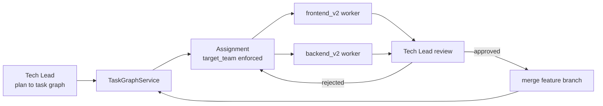

# Coding Team — Architecture

## Overview

The **coding team** is a Software Engineering sub-team that owns implementation
after planning. It receives a `CodingTeamPlanInput`, builds a Task Graph, routes
tasks through a Tech Lead, and by default executes work only through the
Software Engineering v2 implementation teams:

- `frontend_v2` for Angular, TypeScript, React, JavaScript, CSS, SCSS, HTML,
  UI, UX, accessibility, state management, and browser-facing clients.
- `backend_v2` for Java, Python, Node.js, databases, APIs, services, DevOps,
  infrastructure, containers, CI/CD, servers, and persistence.

There is no legacy implementation worker in the coding team. Unsupported stacks
fail fast during worker construction instead of falling back to a generic coder.

When the opt-in `CODING_TEAM_DEVOPS_ROUTING` flag is set, a third path is
available: `devops`-labeled tasks route to a `DevOpsTeamWorker` backed by
`DevOpsTeamLeadAgent` (`devops_team/orchestrator.py`) instead of `backend_v2`.
This worker is not a v2 team and is not built through `CodeEngineProvider` (which
only covers `frontend_v2`/`backend_v2`) — `worker_factory.py` constructs it
directly. It follows the same handoff contract (commits a feature branch via
`run_task(..., merge_to_development=False)`, never merges, returns the branch
for Tech Lead review) via `DevOpsTaskSpec`/`DevOpsCompletionPackage` instead of
v2's free-text workflow. With the flag off (the default), `devops`/`dev_ops`/
`infra`/`infrastructure`/`ci`/`ci_cd`/`cicd` labels normalize to `backend_v2`
exactly as described below, and behavior is unchanged. See
`software_engineering_team/README.md` for the full flag reference.

## Core Roles

| Role | Implementation | Responsibility |
|------|----------------|----------------|
| **Tech Lead** | `tech_lead_agent/agent.py` | Converts the plan into tasks, sets `target_team`, assigns ready tasks to free v2 (or, when opted in, DevOps) workers, reviews returned branches, and routes rejection feedback back to the producing team. |
| **frontend_v2 worker** | `v2_team_worker.py` → `frontend_code_v2_team` | Runs the frontend v2 workflow, commits a feature branch without merging it, and returns the branch plus summary for Tech Lead review. |
| **backend_v2 worker** | `v2_team_worker.py` → `backend_code_v2_team` | Runs the backend v2 workflow, commits a feature branch without merging it, and returns the branch plus summary for Tech Lead review. |
| **devops worker** (opt-in) | `devops_team_worker.py` → `devops_team.DevOpsTeamLeadAgent` | Only constructed when `CODING_TEAM_DEVOPS_ROUTING` is set. Runs the DevOps pipeline via `run_task`, commits a feature branch without merging it, and returns the branch plus summary for Tech Lead review. |
| **Task Graph** | `task_graph.py` | Stores tasks, dependencies, statuses, assignments, target teams, branches, and revision feedback. |

## Routing

The Tech Lead prompt requires every task to include `target_team`. The
orchestrator persists that field in the Task Graph and enforces it at assignment
time:

- `target_team="frontend_v2"` can only be assigned to the frontend v2 worker.
- `target_team="backend_v2"` can only be assigned to the backend v2 worker.
- `target_team="devops"` can only be assigned to the devops worker, and only
  when `CODING_TEAM_DEVOPS_ROUTING` is set.
- Mismatched Tech Lead assignments are ignored.
- If a ready task already has a target team but the assignment response omits it,
  the scheduler deterministically assigns it to a matching free worker.
- Missing v2 (or devops) stack specs are repaired from targeted tasks before
  worker creation.

Generic stack names such as `frontend`, `backend`, `devops`, `api`, or
`infrastructure` normalize into one of the two v2 teams. With
`CODING_TEAM_DEVOPS_ROUTING` set, `devops`/`dev_ops`/`infra`/`infrastructure`/
`ci`/`ci_cd`/`cicd` instead normalize to the devops worker (both the bare and
underscore-separated forms are recognized, matching the convention already
used for other multi-word stack aliases like `next_js`/`nextjs`); `frontend`/
`backend`/`api` are unaffected by the flag. Anything that cannot be classified
as frontend, backend/platform, or (when opted in) devops work fails the job
with a clear unsupported-stack error.

## Branch Handoff

The v2 teams normally merge their own delivery branch. When invoked by the
coding team, they run with `merge_to_development=False`:

1. The v2 team creates or checks out a feature branch.
2. It runs its internal planning, execution, review, documentation, and deliver
   phases.
3. Deliver commits the branch and marks `DeliverResult.branch_ready=True`.
4. The coding-team worker returns `status="in_review"`, the feature branch, and
   a summary to the Tech Lead.
5. The coding-team Tech Lead performs final review and merges approved branches.

If the Tech Lead rejects the branch, the task stays assigned to the same worker.
The rejection reason and requested changes are appended to `revision_feedback`;
the next v2-team run receives that feedback in its task description and its
handoff summary includes how the feedback was addressed.

## State Machine

Task statuses remain:

- `to_do`
- `in_progress`
- `in_review`
- `merged`
- `failed`

The Task Graph enforces one active task per worker and dependency completion
before assignment. A failed task cascades failure to dependents.

## HITL Gate

The coding team still uses the deterministic HITL gate for product, design,
policy, or safety decisions. Open questions can be raised during planning or by
an implementation worker result. The job pauses with
`status="waiting_for_user"` until answers are submitted; resolved answers are
threaded back into subsequent planning/revision context.

For the target native-Temporal (signal + `wait_condition`) pause/resume
contract, see
[`hitl_pause_resume_contract.md`](./hitl_pause_resume_contract.md).

## Persistence And Resume

The orchestrator persists:

- `task_graph_snapshot`
- `agent_task_map`
- `stack_specs`
- submitted HITL answers

On resume, terminal tasks stay terminal and in-flight tasks reset to unassigned
`to_do`, preserving `target_team` so v2 routing still applies.

## Public Entry Points

- `POST /api/coding-team/run`
- `POST /api/coding-team/run-from-github`
- `GET /api/coding-team/status/{job_id}`
- `POST /api/coding-team/run/{job_id}/answers`
- `POST /api/coding-team/run/{job_id}/resume`
