# Architecture

This document describes the architecture of the Software Engineering Team — a multi-agent system that takes a product specification and produces a fully implemented, tested, and documented codebase. The diagrams below cover system entry points, the end-to-end pipeline, every agent and its role, execution mechanics, and sub-team orchestration.

## Table of Contents

- [1. System Context and Entry Points](#1-system-context-and-entry-points)
  - [Temporal (durable execution)](#temporal-durable-execution)
- [2. End-to-End Pipeline](#2-end-to-end-pipeline)
- [3. Agent Registry and Roles](#3-agent-registry-and-roles)
- [4. Task Execution Model](#4-task-execution-model)
- [5. Backend Worker Workflow](#5-backend-worker-workflow)
- [5b. Backend-Code-V2 Team Workflow](#5b-backend-code-v2-team-workflow)
- [5c. Frontend-Code-V2 Team Workflow](#5c-frontend-code-v2-team-workflow)
- [6. Frontend Worker Workflow](#6-frontend-worker-workflow)
- [7. Frontend Team Full Pipeline](#7-frontend-team-full-pipeline)
- [8. DevOps Team Pipeline](#8-devops-team-pipeline)
- [9. Planning Loop](#9-planning-loop)
- [10. Plan Folder and Artifacts](#10-plan-folder-and-artifacts)
- [11. Product Delivery Loop](#11-product-delivery-loop)
- [12. Agent Cognition Core](#12-agent-cognition-core)
- [13. Repo Layout](#13-repo-layout)
- [14. Unified API lifespan](#14-unified-api-lifespan)

---

## 1. System Context and Entry Points

Users invoke the system through a FastAPI HTTP API — run standalone via `agent_implementations/run_api_server.py` or mounted under the Unified API. When Temporal is not configured, the API starts `run_orchestrator` in a background thread; when `TEMPORAL_ADDRESS` is set, it starts a Temporal workflow that runs the same logic via activities. The orchestrator reads `initial_spec.md` from the provided work path and writes planning artifacts to `plan/`, backend code to `backend/`, and frontend code to `frontend/`.

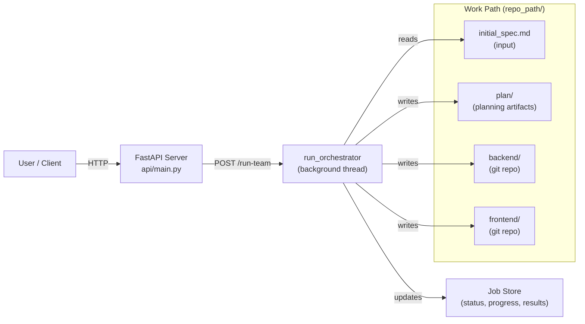

The API also exposes `GET /run-team/{job_id}` for polling job status, `POST /run-team/{job_id}/retry-failed` for retrying failed tasks, and clarification endpoints for interactive spec refinement.

### Temporal (durable execution)

When `TEMPORAL_ADDRESS` is set (e.g. in Docker), the SE team uses **Temporal** instead of background threads:

- **Workflows**: `RunTeamWorkflowV2`, `RetryFailedWorkflow`, `StandaloneJobWorkflow` (for frontend-code-v2, backend-code-v2, product-analysis).
- **Activities**: Each workflow runs activities that call the same logic as the former thread targets (`run_orchestrator`, `run_failed_tasks`, and the standalone runners). Activities update the **job store** so the API and UI continue to poll status from the store.
- **Worker**: A Temporal worker runs in-process (started from the unified API lifespan or when the SE API runs standalone), using task queue `software-engineering` (override with `TEMPORAL_TASK_QUEUE`).
- **Resilience**: Progress is durable in Temporal; after a server restart, the worker reconnects and in-progress workflows continue. **Resume** is allowed for `failed` jobs as well as `pending`, `running`, and `agent_crash`, so jobs marked failed (e.g. by the stale-heartbeat monitor) can be resumed via `POST /run-team/{job_id}/resume`.
- **Env**: `TEMPORAL_ADDRESS` (required for Temporal), optional `TEMPORAL_NAMESPACE` (default `default`), `TEMPORAL_TASK_QUEUE` (default `software-engineering`). When `TEMPORAL_ADDRESS` is unset, the API falls back to thread-based execution for local development.

---

## 2. End-to-End Pipeline

A single run goes through four major phases: Discovery, Design, Execution, and Integration. The orchestrator (`orchestrator.py`) drives this pipeline sequentially. Planning is handled by the standalone **planning_team**; its handoff is adapted by **planning_adapter** for Tech Lead and Architecture Expert.

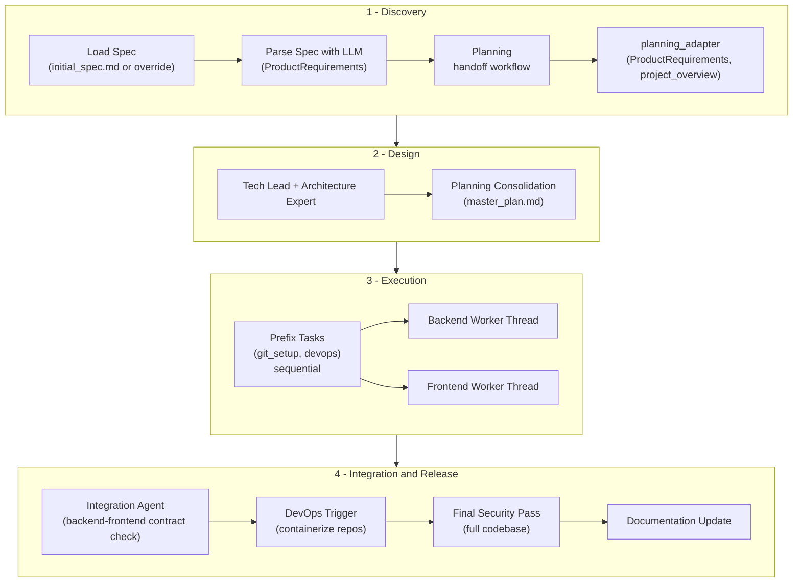

Each phase produces artifacts that feed the next. Planning artifacts are written to `plan/`. Backend and frontend workers operate on separate git repositories under the work path.

---

## 3. Agent Registry and Roles

The orchestrator instantiates agents via `_get_agents()`. The main pipeline uses the standalone **planning_team** for discovery/planning, with **planning_adapter** mapping its handoff to ProductRequirements and project_overview for Tech Lead and Architecture.

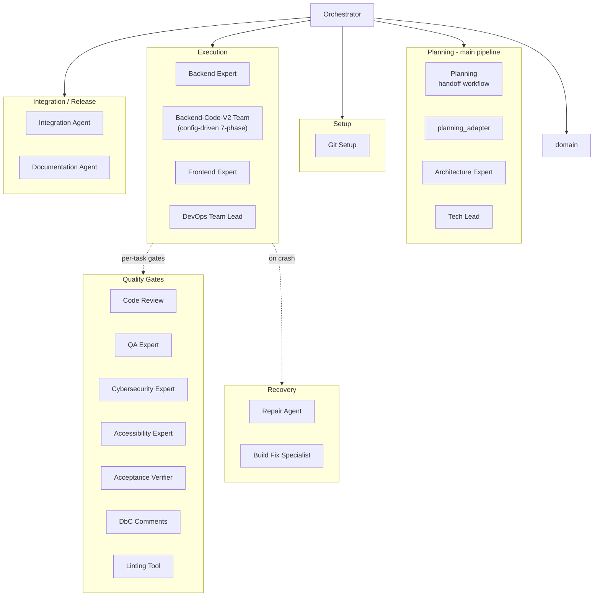

Quality gate agents (code review, QA, security, accessibility, acceptance verifier, DbC, linting) are not task assignees — they are invoked inside backend and frontend workflows for every task. The repair agent and build fix specialist handle agent crashes and persistent build failures respectively. Lint/build verification is a distinct, CI-owned gate that runs once ahead of code review (see §5, §6) — it is not re-executed as part of the code review step.

---

## 4. Task Execution Model

After planning, the Tech Lead produces a `TaskAssignment` with an ordered list of tasks. The orchestrator partitions tasks by assignee into three queues, then runs them in the sequence shown below. Tasks with dependency edges (`blocks`/`blocked_by`) are scheduled so blocked tasks wait until their prerequisites complete.

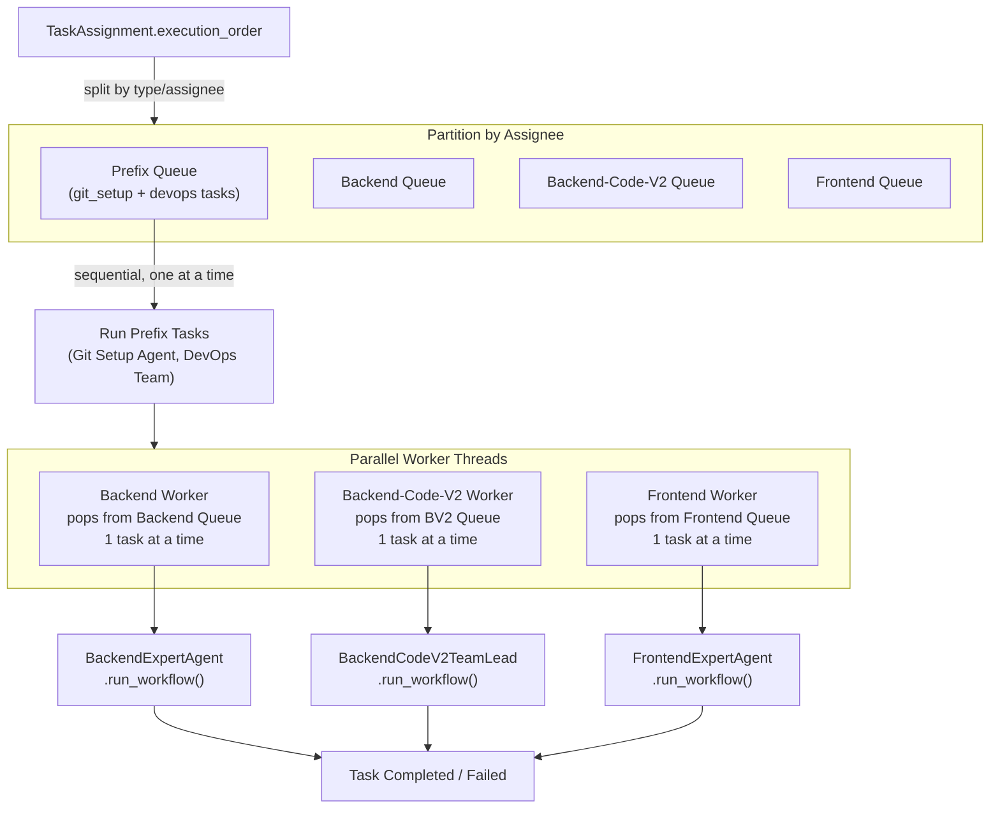

Backend and frontend workers run as concurrent threads (`threading.Thread`). Each worker processes one task at a time from its queue. On task failure, the orchestrator may attempt repair (agent crash) or contract repair (incomplete task metadata) before re-queuing.

---

## 5. Backend Worker Workflow

Each backend task follows this pipeline inside `BackendExpertAgent.run_workflow`. The orchestrator creates a feature branch, runs the workflow, and merges to `development` on success.

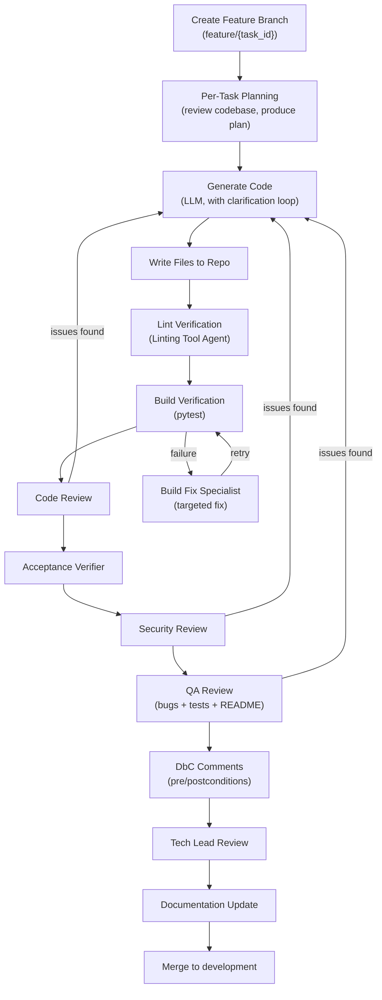

On agent crash, the Repair Agent analyzes the traceback and applies fixes. If the task contract is incomplete (missing required fields like goal, scope, constraints), the orchestrator invokes contract repair via the planning agents and `tech_lead.refine_task`, then re-queues the task.

---

## 5b. Backend-Code-V2 Team Workflow

The **backend-code-v2** agent team is a config-driven backend development team that operates independently from `BackendExpertAgent`. It uses a **three-layer architecture**: a Backend Tech Lead Agent runs Setup then delegates to a Backend Development Agent, which runs the remaining phases (7 total) and consults **tool agents in every phase**. No code from `backend_agent/` is imported or reused.

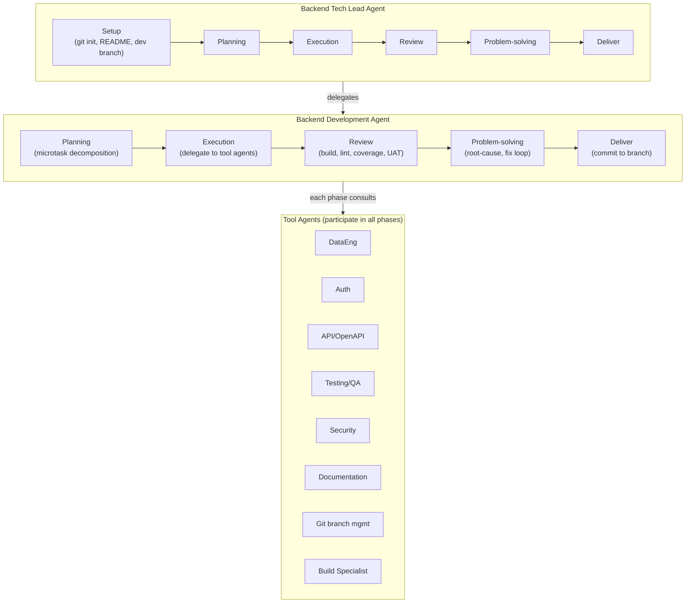

- **Layer 1 — Backend Tech Lead Agent**: Runs the **Setup** phase (git init if needed, README with project title, rename master→main, create `development` branch), then delegates the remaining 6-phase cycle to the Backend Development Agent (7 phases total).
- **Layer 2 — Backend Development Agent**: Owns Planning (microtask decomposition, language detection), Execution (tool agents + LLM fallback), Review (build, lint, QA, security, code review), Documentation (docstrings/README/API docs, self-review loop), and Deliver (feature branch, commit, merge to `development`), with Review looping back to Execution via Problem-solving (fix loop) when issues are found. The review/fix loop runs up to 5 iterations.
- **Layer 3 — Tool agents**: Data Engineering, API/OpenAPI, Auth, Testing/QA, Security, Documentation, **Git branch management**, and **Build Specialist** agents each implement `plan()`, `execute()`, `review()`, `problem_solve()`, and `deliver()`, so they participate in every phase. The **Git branch management** agent creates a feature branch off `development` at the start of Execution, commits changes after each iteration ("commit along the way"), and in Deliver merges the feature branch back into `development`. The **Build Specialist** (stub) is intended to assist when the project doesn't build; it can be wired to the existing build verifier or a dedicated build-fix flow.

The team supports both Python and Java (auto-detected). Quality gate agents (QA, Security, Code Review) are passed in by the main orchestrator and invoked during Review.

**API endpoints:**
- `POST /backend-code-v2/run` — Submit a task and repo path; starts the 7-phase workflow (Setup, Planning, Execution, Review, Documentation, Deliver, plus the conditional Problem-solving loop) in a background thread.
- `GET /backend-code-v2/status/{job_id}` — Returns current phase (including `setup`), completed phases, progress percentage, and microtask status.

---

## 5c. Frontend-Code-V2 Team Workflow

The **frontend-code-v2** agent team is a config-driven consumer of the shared v2 phase pipeline: `phases/_profile.py` composes a `StackProfile`/`V2TeamConfig` and binds the same shared, generic phase implementations (`shared/v2_orchestrator.py`, `shared/v2_phase_bindings.py`, `shared/v2_execution_bindings.py`, `shared/v2_review_bindings.py`, and `shared/phases/{setup,execution,review,documentation,planning,deliver}.py`) that backend-code-v2 also runs, parameterized differently. Only `phases/_profile.py` and a thin `phases/problem_solving.py` wrapper remain as real per-team files. It mirrors the backend-code-v2 **three-layer architecture**: a Frontend Tech Lead Agent runs Setup then delegates to a Frontend Development Agent, which runs the remaining phases (7 total) and consults **tool agents in every phase**.

- **Layer 1 — Frontend Tech Lead Agent**: Runs **Setup** (git init if needed, README, development branch), then delegates the remaining 6-phase cycle to the Frontend Development Agent.
- **Layer 2 — Frontend Development Agent**: Planning (microtask decomposition; stack inferred as Angular/React/TypeScript/JavaScript), Execution (tool agents + LLM fallback), Review (build, lint, QA, security, code review), Documentation (component docs, Storybook, README updates, self-review loop), Deliver (feature branch, commit, merge to `development`), with Review looping back to Execution via Problem-solving (fix loop) when issues are found. Review/fix loop runs up to 5 iterations.
- **Layer 3 — Tool agents**: State Management, Auth, API/OpenAPI, Architecture, Documentation, Testing/QA, Security, **Git branch management**, UI Design, Branding/Theme, UX/Usability, Accessibility, Performance, **Build Specialist**, Linter. Each participates in plan, execute, review, problem_solve, and deliver. Git branch management creates a feature branch off `development`, commits along the way, and merges in Deliver.

**API endpoints:**
- `POST /frontend-code-v2/run` — Submit a task and repo path; starts the 7-phase workflow (Setup, Planning, Execution, Review, Documentation, Deliver, plus the conditional Problem-solving loop) in a background thread.
- `GET /frontend-code-v2/status/{job_id}` — Returns current phase (including `setup`), completed phases, progress percentage, and microtask status.

The Software Engineering UI dashboard includes a **Frontend Developer (v2)** tab with a run form and job-status panel; the main orchestrator supports assignee **frontend-code-v2** (task_parsing and a dedicated frontend_code_v2_queue + worker).

---

## 6. Frontend Worker Workflow

The frontend per-task workflow is structurally similar to backend, with the addition of an accessibility gate and `ng build` for build verification.

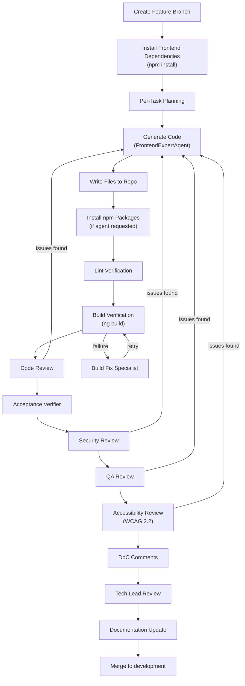

The same crash recovery (Repair Agent) and contract repair mechanisms apply as in the backend workflow.

---

## 7. Frontend Team Full Pipeline

The `FrontendOrchestratorAgent` provides an extended pipeline that wraps `FrontendExpertAgent` with a full design phase. This pipeline runs UX, UI, and design system agents before implementation. The main orchestrator currently uses `FrontendExpertAgent` directly; this diagram documents the alternative full-team pipeline available via `FrontendOrchestratorAgent`.

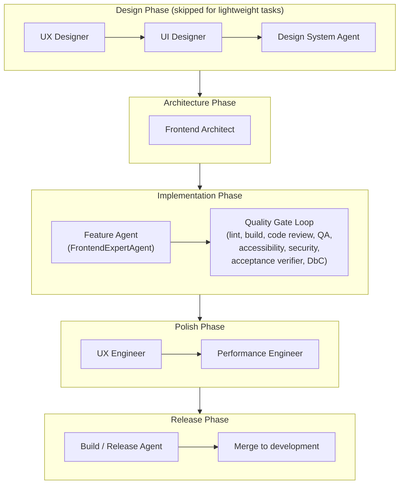

The design phase produces UX wireframes, UI specifications, and design system tokens that feed into the Frontend Architect's component structure, which in turn enriches the implementation context for the Feature Agent. Lightweight tasks (fixes, patches, small updates) skip the design phase entirely.

---

## 8. DevOps Team Pipeline

The `DevOpsTeamLeadAgent` orchestrates a contract-first, multi-agent DevOps pipeline with hard gates, using role-separated agents and independent review gates (superseding an earlier monolithic DevOps agent).

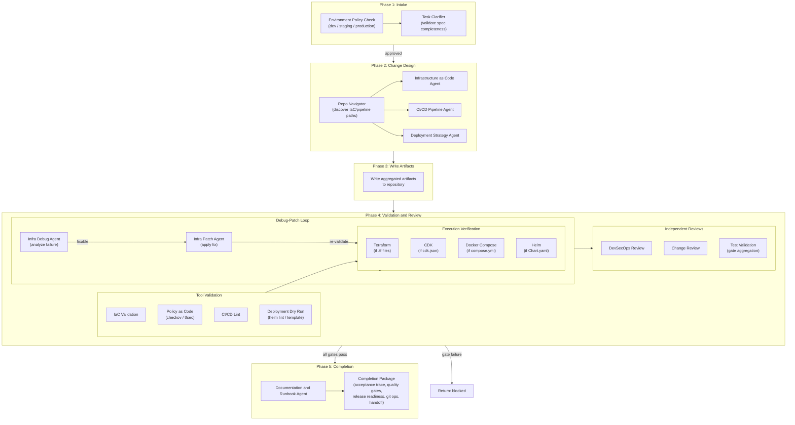

Hard gates that must pass: `iac_validate`, `iac_validate_fmt`, `policy_checks`, `pipeline_lint`, `pipeline_gate_check`, `deployment_dry_run`, `security_review`, `change_review`. The environment policy matrix enforces stricter requirements for production (approval required, rollback test required, high policy strictness) versus dev (auto-deploy allowed, no approval, low strictness).

---

## 9. Planning Loop

The Tech Lead and Architecture Expert run after **Planning** and **planning_adapter** produce ProductRequirements and project_overview.

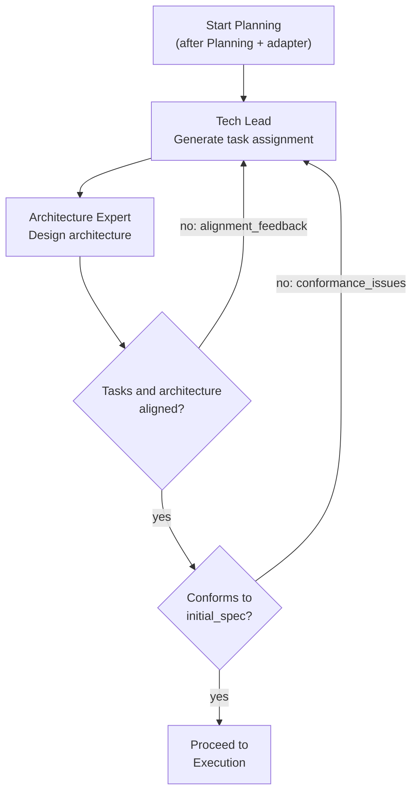

The alignment inner loop runs up to `SW_MAX_ALIGNMENT_ITERATIONS` (default 20) and the conformance outer loop runs up to `SW_MAX_CONFORMANCE_RETRIES` (default 20). Early exit thresholds allow proceeding when only minor non-critical issues remain. During alignment re-runs, both the Tech Lead and Architecture Expert are re-invoked with the feedback from the previous iteration.

---

## 10. Plan Folder and Artifacts

The Planning team writes its handoff artifacts (client context, validated spec, PRD) under `plan/`; the rest of the planning outputs are also written to `plan/` at the work path root.

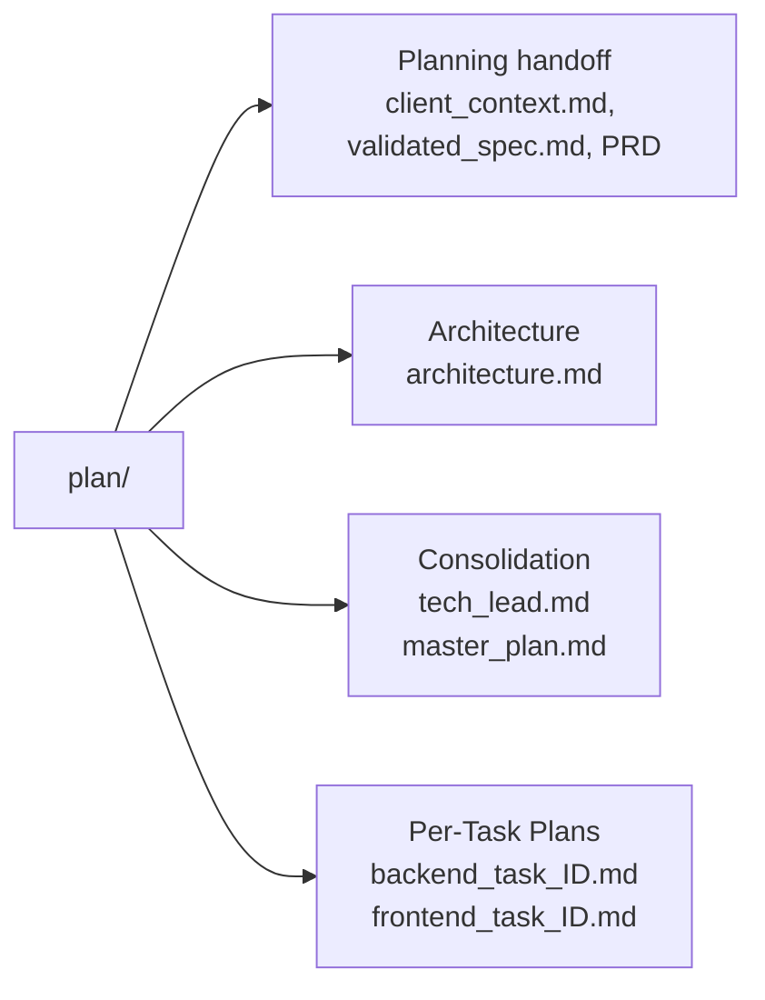

The `master_plan.md` consolidation includes a risk register and ship checklist.

---

## 11. Product Delivery Loop

The Product Delivery team (`backend/agents/product_delivery/`) wraps the SE pipeline in a persistent, repeatable loop: backlog → grooming → sprint planning → SE pipeline run → release → feedback intake → next groom. It owns the durable artifacts the SE pipeline doesn't: products, initiatives, epics, stories, sprints, releases, and feedback items. Schema, full API surface, and local smoke tests live in `backend/agents/product_delivery/README.md`; this section documents how the runtime pieces fit together.

The loop is driven by three agents and one orchestrator hook:

- **ProductOwnerAgent** (`product_delivery/product_owner_agent/agent.py`): runs `POST /api/product-delivery/groom`, scores backlog items via WSJF or RICE with per-item rationale, and (when `persist=true`) writes scores back to the store.
- **SprintPlannerAgent** (`product_delivery/sprint_planner_agent/agent.py`): runs `POST /api/product-delivery/sprints/{id}/plan`, performing capacity-aware greedy selection of scored stories into the sprint via `select_sprint_scope` (no LLM).
- **SE Orchestrator with `sprint_id`** (`software_engineering_team/orchestrator.py`, `_load_requirements_from_sprint`): when `POST /api/software-engineering/run-team` is called with `{sprint_id}`, the orchestrator skips spec parsing and the Product Requirements Analyst, hydrates `ProductRequirements` directly from the sprint's planned stories + acceptance criteria, and stores `sprint_id` + `story_ids` in job metadata.
- **ReleaseManagerAgent** (`product_delivery/release_manager_agent/agent.py`): designed to run after the Integration phase on a sprint run where every planned story has reached a terminal status — it writes `plan/releases/<version>.md` via the technical-writer release-notes agent, inserts a `product_delivery_releases` row, and promotes Integration-phase failures (`int_result.issues`) into `product_delivery_feedback_items` tagged with the sprint id. **The SE orchestrator's release-hook integration point (`_maybe_ship_sprint_release`) was dead code — it had no production callers and never fired on any runtime path — and has been removed.** ReleaseManagerAgent is therefore not currently invoked by the SE pipeline; wiring it back in (on the coding-team path) is tracked as follow-up work. See "Known limitations" below.

### The loop

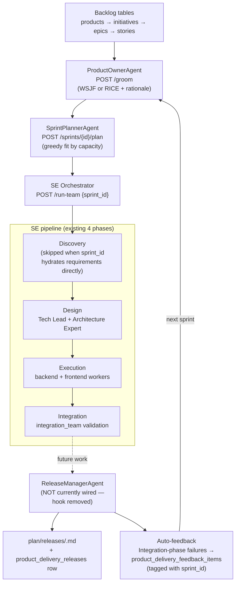

### End-to-end sequence

```mermaid
sequenceDiagram
    actor Op as Operator / Product Delivery
    participant PD as product_delivery API
    participant PO as ProductOwnerAgent
    participant SP as SprintPlannerAgent
    participant SE as SE Orchestrator
    participant Pipe as Planning / Coding / DevOps / Integration
    participant RM as ReleaseManagerAgent
    participant FB as feedback_items

    Op->>PD: POST /groom {product_id, method}
    PD->>PO: groom()
    PO-->>PD: ranked items + rationale (persisted)
    PD-->>Op: GroomResult

    Op->>PD: POST /sprints/{id}/plan
    PD->>SP: plan()
    SP-->>PD: selected stories (capacity fit)
    PD-->>Op: SprintPlanResult

    Op->>SE: POST /run-team {sprint_id}
    SE->>SE: _load_requirements_from_sprint
    SE->>Pipe: Discovery → Design → Execution → Integration
    Pipe-->>SE: phase outputs / failures

    SE->>RM: (not wired today — hook removed)
    alt all planned stories terminal
        RM->>RM: write plan/releases/<version>.md
        RM->>PD: insert product_delivery_releases
        RM->>FB: promote Integration-phase failures (sprint_id tagged)
    else open stories remain
        RM-->>SE: skip (sprint not complete)
    end

    Note over FB,Op: Failures are queryable via GET /feedback (sprint_id-tagged); operator triages them into stories before the next groom
```

### Failure and re-entry

The contracts below describe the *intended* self-healing behavior for whenever the release hook is (re)wired. The hook is not currently invoked by the SE pipeline — see "Known limitations".

1. **Non-fatal release hook** — the integration point wraps `ReleaseManagerAgent.ship()` in `try/except` so agent exceptions never fail the SE job; instead a `release-manager-error` feedback item would be opened with the exception text and `job_id`, visible to operators reviewing feedback before the next groom.
2. **Sprint-scoped feedback as queryable signal** — every Integration-phase failure promoted by the hook carries `sprint_id`, so it surfaces in `GET /api/product-delivery/feedback?product_id=…&status=open` (and the Product Delivery Feedback tab). `POST /groom` itself only reads story rows today — it does not consume feedback automatically — so triaging the new feedback into stories (e.g. via the Feedback tab's "link to story" action) is what feeds the next backlog pass.

### Known limitations

- **The release hook is not wired.** The SE orchestrator's release-hook integration point (`_maybe_ship_sprint_release`) was dead code with zero production callers and has been removed. The default coding-team runtime completes the SE job via `run_coding_team_orchestrator` and never reached the hook; the legacy path that nominally called it is no longer live either. ReleaseManagerAgent therefore does not currently run as part of the SE pipeline. Wiring it in (on the coding-team path) is tracked as follow-up work.
- **Only Integration failures auto-promote (when wired).** The hook passes only `integration_issues=int_result.issues` to `ReleaseManagerAgent.ship()`. The agent itself accepts `qa_failures` / `devops_failures` arguments, but the SE call site does not supply them today, so DevOps and QA failures are not currently turned into sprint-tagged feedback items.
- **Temporal mode unsupported for `sprint_id` runs.** `POST /run-team` raises a 400 when `sprint_id` is supplied with `TEMPORAL_ADDRESS` set (same contract as Phase 2/3 — see `product_delivery/README.md`); the in-thread runtime is the only mode wired end-to-end today.

---

## 12. Agent Cognition Core

The **Agent Cognition Core** (`backend/agents/agent_cognition/`) is a reusable substrate that gives every Agentic-team-generated agent the faculties of "a reasonable thinking person" rather than a bare LLM wrapper: a durable, time-structured **memory** layer (day → week → month → year rollups), a hybrid **rules engine** (advisory rules injected into prompts + enforced rules gated deterministically) that *learns* behavioral rules from those memories, and a per-agent **tools** layer whose calls feed memory. Because per-agent sandboxes are torn down (`docker compose down -v`) after idle and are network-isolated, all cognitive state lives in the long-lived platform Postgres, namespaced by `agent_id` (via `shared.postgres`), and the agent reaches it only across the invoke boundary — never directly. Design rationale and data model: `backend/agents/agent_cognition/DESIGN.md`.

The closed learning loop — and the invariant proven by the end-to-end test (`tests/test_e2e_pipeline.py`) — runs as follows:

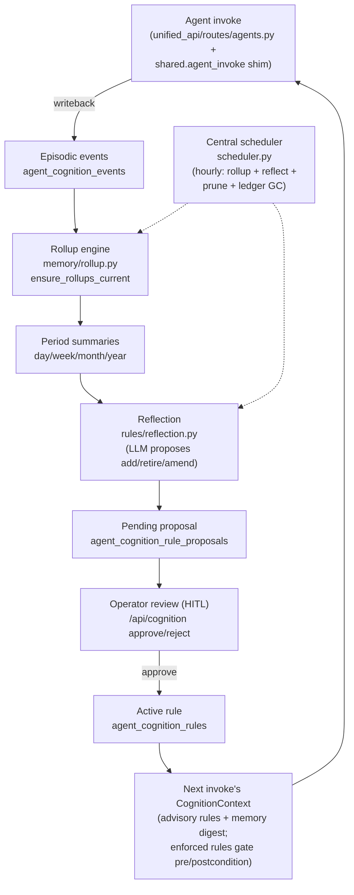

The layers, each documented in depth in `backend/agents/agent_cognition/README.md`:

- **Memory** (`memory/`): `store.py` (idempotent episodic DAL, keyed `(agent_id, source_run_id, source_seq)`), `rollup.py` (calendar-correct day→week→month→year summarization with stale-recompute and pruned-period amend regimes), `retrieval.py` (the compact `memory_digest` injected on invoke).
- **Rules** (`rules/`): `store.py` (rules + proposals CRUD; `approve` applies add/retire/amend deterministically), `enforcement.py` + `predicate.py` (fixed-allowlist DSL for precondition / postcondition / `forbid_tool` gates), `reflection.py` (LLM-derived proposals carrying versioned `(summary_id, version)` evidence — **never activates without approval**), `seed_packs.py` (day-one guardrails installed lazily on first invoke).
- **Tools** (`tools/`): `binding.py` resolves manifest `cognition.tools` ids to handlers tagged by execution site; `runner.py` brokers the tool loop, gating each call against enforced rules pre-dispatch and emitting a trusted out-of-band audit.
- **Invoke gate & facade** (`invoke_gate.py`, `context.py`, `invoke_context.py`): the run-once idempotency ledger (`claim_run`/`complete_run`/replay), lazy rollup catch-up, context load, and the marker-wrapped `{input, cognition}` ↔ `{output, cognition_writeback}` envelope consumed by the shim and the invoke proxy.
- **Operator HITL surface**: `/api/cognition/...` routes (`unified_api/routes/cognition.py`) and the Angular **Cognition** page (`/cognition`) back the approve/reject review flow.

Per-agent config travels in the manifest `CognitionSpec` block (`agent_platform/registry/models.py`); the Agentic team stamps it onto generated agents and their runtime renders the advisory rules + digest into each LLM call. Operability and tuning env vars (`AGENT_COGNITION_SCHEDULER_INTERVAL_S`, retention, digest budget, `LLM_MODEL_cognition`, writeback cap, ledger TTL) are documented under "Configuration & operability" in `backend/agents/agent_cognition/README.md` and in `docs/ENV_VARS.md`.

---

## 13. Repo Layout

The software engineering team is the primary system documented above; a separate blogging agent system exists under `agents/blogging/`. In-process platform code lives beside those teams, not inside them:

- **Platform** — `backend/agents/agent_platform/` (registry, console, sandbox, Studio). Shared cognitive substrate is `backend/agents/agent_cognition/`. Cross-cutting infra is `backend/shared/` (`shared.postgres`, `shared.temporal`, `shared.agent_invoke`).
- **Infra (not platform)** — Docker/environment provisioning stays in `backend/agents/agent_team_studio/agent_provisioning_team/`.
- **Domain apps** — `backend/agents/agent_team_studio/agentic_team_provisioning/` and `backend/agents/agent_team_studio/user_agent_founder/` consume the platform; they are not members of it.

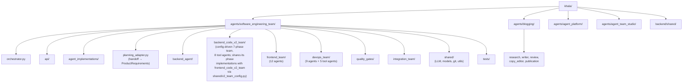

Each agent directory follows a consistent structure: `agent.py` (core logic), `models.py` (Pydantic input/output contracts), and `prompts.py` (LLM prompt templates). Shared utilities (LLM client, git operations, repo I/O, logging) live in `shared/`.

---

## 14. Unified API lifespan

The Unified API's FastAPI `lifespan` (`backend/unified_api/main.py`) is the sole
boot site for platform-core workers that share process-local state with this
process's HTTP handlers (sandbox `Lifecycle`, Studio `AgentStudioService`), and
the place that registers Postgres schemas, team-assistant mount specs, and
container-team proxy routes. In-process platform HTTP routers
(`app.include_router`) mount at import time, not inside `lifespan()`.

The numbered step catalog, import-time router table, and worker-ownership rules
live in [`UNIFIED_API_LIFESPAN.md`](UNIFIED_API_LIFESPAN.md).
