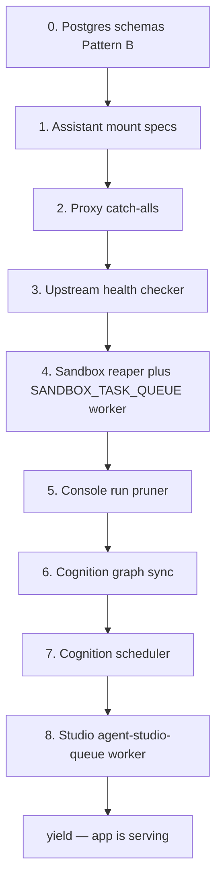

# Unified API lifespan: worker and route registration

This file is the single catalog of what `backend/unified_api/main.py`'s FastAPI
`lifespan` registers and boots. Env-var defaults and edge cases stay in
[`ENV_VARS.md`](ENV_VARS.md). Package layout and *why* sandbox/Studio workers
must stay process-affine live in
[`ADR-013`](../system_design/adr/ADR-013-agent-platform-package-layout.md) §4.

**Invariant:** container-team Temporal workers follow Pattern A (export
`WORKFLOWS`/`ACTIVITIES`, start inside that team's own process). Platform-core
workers that share process-local singletons with this API's HTTP handlers boot
**only** from this lifespan — never from package import, `team_service` worker
bootstrap, or the standalone agent-provisioning container.

## Two registration sites

| When | What | Where |
|---|---|---|
| **Module import** | In-process HTTP routers (`app.include_router`) | Bottom of `unified_api/main.py`, after `app = FastAPI(...)` |
| **Lifespan startup** | Postgres schemas, assistant mount specs, proxy catch-alls, background workers | `lifespan()` numbered steps 0–8 |

Looking only at `lifespan()` will miss platform HTTP. Looking only at
`include_router` will miss workers and proxy routes. This catalog covers both.

## Import-time routers (not lifespan)

These mount when `unified_api.main` is imported. They are **not** registered
inside `lifespan()`.

| Router | Prefix | Owner | Gate |
|---|---|---|---|
| `routes.integrations` | `/api/integrations` | unified_api | none |
| `routes.llm_config` | `/api/llm-config` | unified_api | none |
| `routes.llm_tools` | `/api/llm-tools` | unified_api | none |
| `routes.llm_usage` | `/api/llm-usage` | unified_api | none |
| `routes.analytics` | `/api/analytics` | unified_api | none |
| `routes.agents` | `/api/agents` | `agent_platform.registry` + console invoke/runs | none |
| `routes.sandboxes` | `/api/agents/sandboxes` | `agent_platform.sandbox` | none |
| `routes.agent_console_saved_inputs` | `/api/agents` | `agent_platform.console` | none |
| `routes.agent_console_diff` | `/api/agents` | `agent_platform.console` | none |
| `routes.cognition` | `/api/cognition` | `agent_cognition` | none |
| `routes.user_profile` | `/api/user-profile` | `user_profile` | `TEAM_CONFIGS["user_profile"].enabled` |
| `routes.product_delivery` | `/api/product-delivery` | `product_delivery` | `TEAM_CONFIGS["product_delivery"].enabled` |
| `agent_platform.studio.router` | `/api/agent-studio` | `agent_platform.studio` | `TEAM_CONFIGS["agent_studio"].enabled` |

Registry, console, and sandbox have **no** `TEAM_CONFIGS` entries. They are
platform libraries consumed by the routers above, not proxyable teams. Studio,
user_profile, and product_delivery are `in_process=True` teams: the security
gateway still sees their prefixes, discovery (`/`, `/teams`, `/health`) reports
them live, and `_register_proxy_routes` skips them.

## Lifespan steps

Each step self-disables or log-and-continues when its backing service is unset.
A single failed step must not abort the others.

### 0. Postgres schemas (Pattern B)

`register_team_schemas` / `ensure_team_schema`. No-op when `POSTGRES_HOST` is
unset. See [`shared.postgres/README.md`](../backend/shared/postgres/README.md).

| Schema export | Gate |
|---|---|
| `unified_api.postgres.SCHEMA` | none |
| `team_assistant.postgres.SCHEMA` | none |
| `agent_platform.console.postgres.SCHEMA` | none |
| `agent_platform.registry.postgres.SCHEMA` | none |
| `agent_platform.studio.postgres.SCHEMA` | `TEAM_CONFIGS["agent_studio"].enabled` |
| `user_profile.postgres.SCHEMA` | `TEAM_CONFIGS["user_profile"].enabled` |
| `agent_cognition.postgres.SCHEMA` | none |
| `product_delivery.postgres.SCHEMA` | `TEAM_CONFIGS["product_delivery"].enabled` (uses `ensure_team_schema` so partial DDL marks the team unhealthy; **only this team** is added to `_in_process_schema_failures` and retried by step 3) |

Immediately after `unified_api.postgres.SCHEMA` (which owns `llm_call_records`),
`register_usage_flusher()` starts the process-local LLM usage heartbeat. Log-and-continue
on failure. The observer enqueues INSERT rows with no DB I/O on the LLM call path;
the heartbeat drains to Postgres. Not registered in agent-sandbox containers
(isolated ephemeral DB, no path to platform Postgres).

### 1. Team-assistant mount specs

`_maybe_register_team_assistants()`, gated on `UNIFIED_API_TEAM_ASSISTANTS_ENABLED`.
Populates `_ASSISTANT_REGISTRY` only — no sub-app is constructed. First matching
request mounts via `AssistantLazyMountMiddleware` and reorders that `Mount` ahead
of the team's proxy catch-all.

### 2. Proxy routes

`_register_proxy_routes(app)`. For every **enabled, non-`in_process`** team whose
`*_SERVICE_URL` is set, registers `{prefix}/{path:path}` as a reverse proxy.
`in_process` teams are marked registered without a proxy.

### 3. Upstream health checker

`asyncio.create_task(_health_check_loop())`. Probes container-team `/health`.
Schema retry is Product Delivery only: `_retry_in_process_schema_registration`
re-runs `ensure_team_schema` for keys in `_in_process_schema_failures`, and
step 0 only adds `product_delivery` to that set. Other step-0 schemas are
log-and-continue with no background retry.

### 4. Platform sandbox reaper and Temporal worker

`_maybe_start_sandbox_reaper()`, gated on `UNIFIED_API_SANDBOX_TEMPORAL_WORKER`.

This lifespan is the **sole** boot site for
`start_agent_platform_sandbox_temporal_worker_thread`
(`agent_platform.sandbox.temporal.worker`). The worker polls `SANDBOX_TASK_QUEUE`
inside this process so sandbox activities share the process-local `Lifecycle`
singleton. It is never started by package import, by `team_service` worker
bootstrap, or by the standalone agent-provisioning container's main worker.

When Temporal is enabled the reaper is `SandboxReaperWorkflow` (background retry
until the client is ready). Otherwise it is `run_idle_reaper()` on the API loop.

### 5. Agent Console run pruner

`asyncio.create_task(agent_platform.console.prune.run_pruner())`. Keeps the newest
N runs per agent. Log-and-continue on import/start failure.

### 6. Agent Cognition graph sync

Gated on `shared.neo4j.is_neo4j_enabled()` (`NEO4J_BOLT_URL`) so `graphiti_core`
is never imported when unused. The worker then self-disables if `POSTGRES_HOST`
is unset.

### 7. Agent Cognition scheduler

`run_cognition_scheduler()` (rollups → reflection → pruning). Self-disables when
`POSTGRES_HOST` is unset.

### 8. Agent Studio Temporal worker

`_start_agent_studio_temporal_worker()`, gated on
`UNIFIED_API_AGENT_STUDIO_TEMPORAL_WORKER` and `TEAM_CONFIGS["agent_studio"].enabled`.

Sole worker for `agent_platform.studio.temporal.TASK_QUEUE` (`agent-studio-queue`).
Activities delegate to this process's `AgentStudioService` / `drafts_runtime`
singletons. Authoring CRUD always runs in-process (no 1-activity workflows);
this worker starter is a no-op unless workflows are restored.

## Shutdown (after yield)

Order is load-bearing so buffered `llm_call_records` are not lost:

1. Cancel cognition scheduler, graph sync, console pruner, sandbox reaper, and the health loop.
2. `close_graphiti()`.
3. `_stop_in_process_temporal_workers()` (`stop_all_team_workers`) — Studio and sandbox activities can still invoke the LLM; they must finish before the observer unregisters.
4. `shutdown_authoring_executor()` — Agent Studio in-process authoring pool. Rejects new CRUD submits; daemon workers are not joined (a stalled LLM HTTP call cannot be cancelled from another thread, and CPython `ThreadPoolExecutor` atexit would otherwise block reload for up to `resolve_timeout()` / 3600s).
5. `llm_service.usage_flusher.shutdown()` — stop the heartbeat, unregister the observer, final synchronous drain.
6. `close_pool()` — only after the drain, so the flusher still has a live pool.
7. `_shutdown_probe_executor()`.

## Worker ownership (do not relocate)

| Worker | Lifespan step | Gate | Must not start from |
|---|---|---|---|
| Sandbox Temporal (`SANDBOX_TASK_QUEUE`) | 4 | `UNIFIED_API_SANDBOX_TEMPORAL_WORKER` | `team_service`, provisioning container, package import |
| Studio Temporal (`agent-studio-queue`) | 8 | `UNIFIED_API_AGENT_STUDIO_TEMPORAL_WORKER` + team enabled | any other process |
| Console run pruner | 5 | none (log-and-continue) | n/a |
| Cognition graph sync | 6 | `NEO4J_BOLT_URL` | n/a |
| Cognition scheduler | 7 | self-disables without Postgres | n/a |

A second process polling `SANDBOX_TASK_QUEUE` would run activities against a
different in-memory `Lifecycle` than this API's status/list/metrics routes —
the reaper can then tear down a sandbox it wrongly believes idle. The same
process-affinity rule applies to Studio's in-flight authoring singletons.
