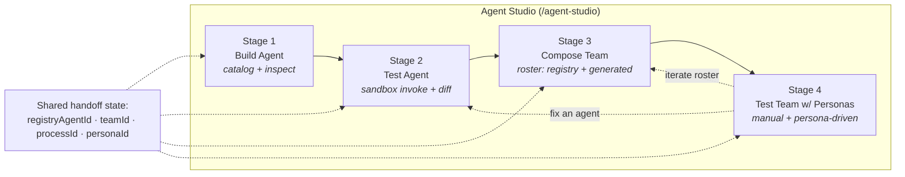
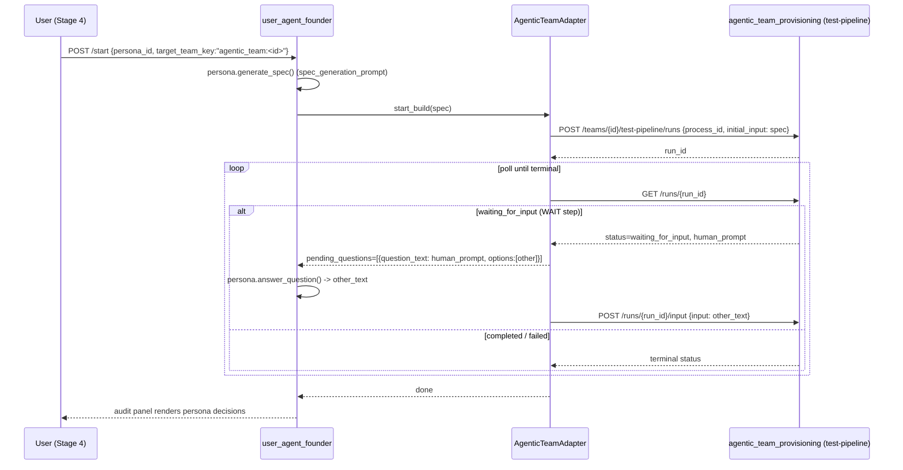

# Agent Studio — UX Redesign Spec

**Status:** Draft for review · **Author:** UX · **Scope:** `/agent-studio` (replaces Agent Console, Agentic Teams, Testing Personas)
**Deliverable type:** Design spec + mockups (no implementation). Grounded against the current codebase so it can be built as-is after approval.

---

## 1. Why this redesign

A user who wants to **build an agent → test it → add it to a team → test the team with personas** must today stitch
together three disconnected surfaces, each with its own mental model of "agent" and "test":

| Surface | Route | What it does | The gap |
|---|---|---|---|
| Agent Console | `/agent-console` | Browse / inspect / run **registry** agents (real, invokable YAML manifests). 7 heavy tabs. | No path to "team". |
| Agentic Teams | `/agentic-teams` | Assemble teams whose rosters are **LLM‑generated descriptors** (`AgenticTeamAgent`, *not* registry agents). Manual chat + pipeline testing. | Roster agents ≠ the agents you built. |
| Testing Personas | `/persona-testing` | Personas that autonomously drive **only** the Software Engineering team (`user_agent_founder`). | Can't reach the team you just assembled. |

Three problems compound: (a) there is **no journey** connecting the surfaces; (b) the **two "agent" models don't
reconcile** (registry `AgentManifest` vs. roster `AgenticTeamAgent`); (c) **personas can't reach assembled teams**.

**The redesign** is a single guided **Agent Studio** that makes the build → test → compose → persona‑test flow
obvious, lets a roster **mix curated registry agents with generated ones**, and lets **any testing persona drive any
assembled team**. It is a clean cutover — the three old surfaces are deleted, not deprecated.

### Design principles
1. **One spine, four stages.** The journey is linear by default, with explicit back‑loops for iteration.
2. **Reuse the working parts.** Catalog, runner, process designer, test panels, and persona dialogs already work — move them into the Studio, don't rebuild them.
3. **No legacy.** No redirects, no "advanced" routes, no dead wrapper shells.
4. **Make the agent identity honest.** A roster entry says where it came from (registry vs generated) and what it can do.

---

## 2. Information architecture

### 2.1 The Studio spine



The stepper carries a small **handoff state** `{registryAgentId?, teamId?, processId?, personaId?}` so each stage
pre‑seeds the next (the agent you just tested is the one offered for the roster; the team you just composed is the
default persona target). This glue is the only genuinely new interaction concept.

### 2.2 Navigation changes (`user-interface/src/app/models/navigation.model.ts`, `agentic-ai` group)

```
BEFORE                              AFTER
  AI Systems                          AI Systems
  Agent Console      ──┐              Agent Studio          ◀ single entry
  Agentic Teams      ──┼─ removed     Deepthought
  Testing Personas   ──┘              Product Delivery      ◀ relocated console tabs
  Deepthought                         Cognition             ◀ relocated console tab
```

### 2.3 Route changes (`app.routes.ts`) — clean cutover, **delete** then **add**

| Action | Route | Note |
|---|---|---|
| **delete** | `/agent-console` | container shell removed |
| **delete** | `/agent-provisioning` | legacy redirect removed |
| **delete** | `/agentic-teams` | container shell removed |
| **delete** | `/persona-testing` | container shell removed |
| **delete** | `/persona-testing/audit/:runId` | moved under Studio |
| **add** | `/agent-studio` | with nested `…/persona-run/:runId` for the live audit view |
| **add** | `/product-delivery` | new home for Backlog / Sprints / Feedback tabs |
| **add** | `/cognition` | new home for the Cognition tab |

The three container shells — `AgentConsoleComponent` (7‑tab), `AgenticTeamDashboardComponent`,
`PersonaTestingDashboardComponent` — are **deleted**. Their useful children are **moved** into the Studio (see §4).
The non‑journey console tabs (Provisioning, Backlog, Sprints, Feedback, Cognition) are **relocated to first‑class
routes**, never parked in a legacy shell. After this, nothing routes to the old surfaces.

---

## 3. Stage-by-stage screen specs

Each stage below gives: purpose · wireframe · reused vs new components · the API it calls.

### Stage 1 — Build Agent

**Purpose.** Pick (or inspect) the registry agent you want to work on. Entry point of the journey.

```
┌─ Agent Studio ───────────────────────────────────────────────────────────────┐
│  ① Build ─── ② Test ─── ③ Compose ─── ④ Personas            [ Save draft ▾ ]  │
├────────────────────────────────────────────────────────────────────────────────┤
│  Build an agent                                                                  │
│  ┌─ filters ───────┐   ┌─ catalog grid ───────────────────────────────────────┐ │
│  │ Team    ▾       │   │ ┌─────────────┐ ┌─────────────┐ ┌─────────────┐       │ │
│  │ Tag     ▾       │   │ │ blogging.   │ │ market.      │ │ soc2.        │      │ │
│  │ Search [______] │   │ │  planner    │ │  researcher  │ │  auditor     │      │ │
│  └─────────────────┘   │ │ inputs/outs │ │ inputs/outs  │ │ inputs/outs  │      │ │
│                        │ └─────────────┘ └─────────────┘ └─────────────┘       │ │
│                        └────────────────────────────────────────────────────────┘ │
│  ┌─ inspect drawer (on select) ──────────────────────────────────────────────┐  │
│  │ blogging.planner   [ Provision ▾ ]                  [ Test this agent → ]  │  │
│  │ summary · tags · inputs/outputs schema · cognition tools · anatomy.md      │  │
│  └────────────────────────────────────────────────────────────────────────────┘  │
└────────────────────────────────────────────────────────────────────────────────┘
```

- **Reuse as‑is:** `agent-console/agent-catalog` (browse, filter, inspect drawer; calls `agent-catalog-api.service.ts` → `GET /api/agents`, `/api/agents/{id}`, schema endpoints).
- **Folded in:** the **Provisioning** action (from the old console Provisioning tab) lives here as a per‑agent "Provision" affordance — provisioning is part of building/deploying an agent, so it belongs at this stage rather than a separate tab.
- **Handoff:** selecting an agent sets `registryAgentId`; **"Test this agent →"** advances to Stage 2 pre‑seeded.

### Stage 2 — Test Agent

**Purpose.** Run the selected agent in its sandbox, iterate on inputs, compare runs.

```
┌────────────────────────────────────────────────────────────────────────────────┐
│  ① Build ─── ② Test ─── ③ Compose ─── ④ Personas       agent: blogging.planner  │
├──────────────────────────────────┬─────────────────────────────────────────────┤
│  Input                            │  Run history                                 │
│  ┌─ schema form / JSON ─────────┐ │  ● 14:02  run_8f2…   ✓ 3.1s                  │
│  │ topic     [____________]     │ │  ● 13:55  run_7b1…   ✓ 2.8s   [ Compare ⇄ ] │
│  │ audience  [____________]     │ │  ● 13:40  run_5a0…   ✗ error                 │
│  │ …                            │ │                                              │
│  └──────────────────────────────┘ │  Output (run_8f2…)                           │
│  [ Saved inputs ▾ ] [ Save input ]│  ┌─────────────────────────────────────────┐ │
│  [ ▶ Run in sandbox ]             │  │ { "outline": [ … ], "keywords": [ … ] } │ │
│                                    │  └─────────────────────────────────────────┘ │
│                          sandbox: ● WARM                       [ Add to team → ] │
└──────────────────────────────────┴─────────────────────────────────────────────┘
```

- **Reuse as‑is:** `agent-console/agent-runner` (invoke‑in‑sandbox, saved inputs, run history, unified diff) — calls `agent-runner-api.service.ts` → `POST /api/agents/{id}/invoke`, `/runs`, `/saved-inputs`, `/diff`. Highest‑value reuse; near‑leaf component.
- **Handoff:** **"Add to team →"** advances to Stage 3 carrying `registryAgentId`, so the tested agent is the default candidate for the roster.

### Stage 3 — Compose Team

**Purpose.** Assemble/curate a team: design the process via chat, **and** staff the roster by mixing **registry**
agents (the ones you just built/tested) with **LLM‑generated** suggestions.

```
┌────────────────────────────────────────────────────────────────────────────────┐
│  ① Build ─── ② Test ─── ③ Compose ─── ④ Personas        team: [ Growth Pod ▾ ]  │
├──────────────────────────────────┬─────────────────────────────────────────────┤
│  Process designer (chat)          │  Roster                          [ + Add ▾ ] │
│  ┌──────────────────────────────┐ │  ┌─────────────────────────────────────────┐ │
│  │ ▸ "Design a content pod that │ │  │ ✦ blogging.planner   [registry]   🗑     │ │
│  │   plans, writes, reviews…"   │ │  │   tools: web, draft · role: planning    │ │
│  │ ← proposes steps + agents    │ │  │ ⚙ Writer Agent       [generated]  🗑     │ │
│  └──────────────────────────────┘ │  │   skills: longform, seo                  │ │
│  Process steps (DAG)              │  │ ⚙ Reviewer Agent     [generated]  🗑     │ │
│  [Plan]→[Write]→[Review]→[Publish]│  └─────────────────────────────────────────┘ │
│                                    │  Roster validation:  ✓ fully staffed         │
│         [ + Add ▾ ]  opens:  ( ⌕ Search registry agents… )  |  ( ✨ Suggest via chat )│
│                                                              [ Test this team → ] │
└──────────────────────────────────┴─────────────────────────────────────────────┘
```

- **Reuse as‑is:** `process-designer-chat` (LLM design mode, `@Input() team`); team CRUD, process/DAG editing, and roster‑validation display from `agentic-team-dashboard` (`agentic-team-api.service.ts`).
- **New (one small component): Roster panel.** Lists roster entries with a **`source` badge** (`registry` ✦ / `generated` ⚙) and a delete control. **"+ Add"** offers two paths: **search registry agents** (→ new `POST …/teams/{id}/agents/from-registry`) or **suggest via chat** (existing LLM flow). Deleting calls new `DELETE …/teams/{id}/agents/{agent_name}`.
- **Handoff:** sets `teamId` (+ `processId` when a process is selected); **"Test this team →"** advances to Stage 4.

### Stage 4 — Test Team with Personas

**Purpose.** Validate the assembled team two ways: **manually** (you chat / drive the pipeline) or
**persona‑driven** (a testing persona autonomously drives the team end‑to‑end).

```
┌────────────────────────────────────────────────────────────────────────────────┐
│  ① Build ─── ② Test ─── ③ Compose ─── ④ Personas        team: Growth Pod        │
├────────────────────────────────────────────────────────────────────────────────┤
│  [ Manual testing ]   [ Persona-driven ◀ ]                                       │
│                                                                                  │
│  Persona            ┌─ persona library ───────────────┐   [ + New persona ]      │
│  ┌────────────────┐ │ ◎ Startup Founder   (built-in)  │                          │
│  │ Startup Founder│ │ ○ Impatient PM      (custom)    │   target process:        │
│  │ system prompt… │ │ ○ Budget Buyer      (custom)    │   [ Content pipeline ▾ ] │
│  └────────────────┘ └─────────────────────────────────┘   [ ▶ Run persona test ] │
│                                                                                  │
│  Live run (run_a91…)   status: ● waiting_for_input → persona answering…          │
│  ┌─ decisions / transcript ───────────────────────────────────────────────────┐ │
│  │ Q "Which tone for the post?"   → persona: "punchy, founder-voice" (rationale)│ │
│  │ step Plan ✓ → step Write ⧖ …                                                 │ │
│  └────────────────────────────────────────────────────────────────────────────┘ │
└────────────────────────────────────────────────────────────────────────────────┘
```

- **Manual sub‑mode — reuse as‑is:** `agentic-team-test-panel` (composes `agent-test-chat` + `pipeline-test-runner`; drives `…/test-chat/*` and `…/test-pipeline/runs` + `/input`).
- **Persona sub‑mode — reuse as‑is:** `start-test-dialog`, `persona-editor-dialog`, `persona-test-audit-panel` (from the old persona dashboard). The launcher is **pre‑seeded** with the current team as `target_team_key = "agentic_team:<teamId>"`; the agentic team appears in the dropdown automatically once the backend `/testable-teams` change lands (§5). Personas are picked from the library or created inline.
- **Back‑loops:** "iterate roster" → Stage 3; "fix an agent" → Stage 2.

---

## 4. Component reuse map

| Component | Disposition in Studio |
|---|---|
| `agent-console/agent-catalog` | **Move + reuse** → Stage 1 |
| `agent-console/agent-runner` (+ `agent-schema-form`, `agent-run-history`, `agent-diff-dialog`, `save-input-dialog`) | **Move + reuse** → Stage 2 |
| `agent-provisioning-dashboard` | **Move + reuse** → Stage 1 "Provision" affordance |
| `process-designer-chat` | **Move + reuse** → Stage 3 |
| `agentic-team-dashboard` (team CRUD, DAG editor, roster validation) | **Reuse logic** → Stage 3; container shell **deleted** |
| `agentic-team-test-panel`, `agent-test-chat`, `pipeline-test-runner` | **Move + reuse** → Stage 4 manual |
| `persona-editor-dialog`, `start-test-dialog`, `persona-test-audit-panel` | **Move + reuse** → Stage 4 persona |
| `AgentConsoleComponent` (7‑tab), `AgenticTeamDashboardComponent`, `PersonaTestingDashboardComponent` | **Delete** |
| Backlog / Sprints / Feedback tabs | **Relocate** → `/product-delivery` |
| Cognition tab | **Relocate** → `/cognition` |
| **Studio shell + 4‑stage stepper + handoff state** | **New** (thin) |
| **Roster panel (registry + generated, source badges, add/delete)** | **New** (small) |

Net‑new frontend is intentionally minimal: a shell, a stepper, and one roster panel. Everything load‑bearing exists.

---

## 5. Backend touchpoints the UX depends on

The UX cannot ship without these. They are additive and grounded against the current code.



**Must‑have:**
1. **Persona → any team — `AgenticTeamAdapter`** (`backend/agents/user_agent_founder/targets/agentic_team.py`, modeled on `targets/software_engineering.py`) implementing the `TargetTeamAdapter` Protocol against the *existing* `POST …/test-pipeline/runs` + `/input` endpoints — **no new provisioning endpoints needed**. A *collapsing adapter*: persona `generate_spec()` → pipeline `initial_input`; each `waiting_for_input` WAIT step → wrapped as a single free‑text question the persona answers via `/input`. Dynamic dispatch in `targets/__init__.py` via `get_adapter("agentic_team:<id>")`.
2. **Testable‑teams enumeration** — `user_agent_founder/api/main.py:list_testable_teams` also lists agentic teams (cross‑service `GET …/agentic-team-provisioning/teams`, filtered to teams with ≥1 `complete` process). Without this the persona dropdown is empty.
3. **Registry → roster bridge** — add `source: "generated"|"registry"` + `manifest_id` to `agentic_team_provisioning/models.py:AgenticTeamAgent` (additive, defaulted). New `POST …/teams/{id}/agents/from-registry` (projects an `AgentManifest`'s tags/tools/summary into the roster fields so `roster_validation.py` needs no change) and `DELETE …/teams/{id}/agents/{agent_name}`.
4. *(Recommended cleanup)* explicit `process_id` column on `user_agent_founder_runs` instead of overloading `repo_path` to carry the chosen process id.

**Nice‑to‑have (UX works without; flag as follow‑ups):** real registry‑agent invocation inside `pipeline_runner.py` (`source=="registry"` branch — Phase 1 runs them as LLM personas, acceptable for v1); surfacing not‑yet‑rostered registry agents in `recommend_agents_for_step`; faster persona poll interval for agentic runs.

---

## 6. Risks / open questions

- **Phase‑shape impedance** — the founder Protocol assumes 3 phases (spec → analysis → build) with batched
  multiple‑choice questions; an agentic pipeline is a single linear DAG with free‑text WAIT steps. The collapsing
  adapter resolves it (analysis → no‑op pass‑through) but couples the two contracts.
- **Free‑text WAIT vs multiple‑choice persona answers** — persona answering is built for option selection; WAIT
  prompts are open‑ended. Wrapping each as a single `other` option works, but answer quality on open prompts is
  unproven.
- **In‑memory, unbounded WAIT state** in `pipeline_runner.py` (`resume_event.wait()` with no timeout, state held in
  the provisioning process) — a reliability risk for autonomous no‑human persona runs across service restarts.
- **Typed‑IO registry agents in a free‑text DAG** — deepest unknown; scope v1 to Phase‑1 LLM‑persona execution.
- **Persona run timing** — 15–30s founder poll intervals make autonomous runs feel slow; the UI must set
  expectations (progress, "persona is thinking…", elapsed time).

---

## 7. Decisions to confirm at review

1. **High‑fidelity Figma mockups** in addition to these wireframes? (Figma MCP is available.)
2. **`process_id` column vs `repo_path` overload** on `user_agent_founder_runs` (recommend the column).
3. **Relocation homes** for ex‑console tabs: Provisioning → Build stage; Backlog/Sprints/Feedback → `/product-delivery`; Cognition → `/cognition`. (No legacy routes retained.)

---

## 8. What gets deleted (explicit)

- **Routes:** `/agent-console`, `/agent-provisioning`, `/agentic-teams`, `/persona-testing`, `/persona-testing/audit/:runId`.
- **Nav items:** `Agent Console`, `Agentic Teams`, `Testing Personas`.
- **Container shells:** `AgentConsoleComponent`, `AgenticTeamDashboardComponent`, `PersonaTestingDashboardComponent`.
- **No** redirects, "advanced" aliases, or wrapper components survive the cutover.

---

## 9. Build sequence (post‑approval, for reference)

1. Backend must‑haves (§5.1–5.3) — enables the persona‑drives‑team path end‑to‑end.
2. Studio shell + stepper + handoff state; move catalog + runner into Stages 1–2.
3. Compose stage: process designer + new roster panel (registry/generated, add/delete).
4. Persona stage: manual + persona sub‑modes, pre‑seeded launcher, live audit.
5. Relocate Provisioning / Product Delivery / Cognition; **delete** old routes, nav items, and shells.
6. Verify the happy path (§ below) and the 90% coverage floor on new/changed code.

## 10. Verification (of the eventual build)

End‑to‑end happy path, covered by must‑haves only:
**build agent (Stage 1) → test in sandbox (Stage 2) → add that registry agent to a roster + design a process
(Stage 3) → launch a persona test against `agentic_team:<id>` and watch it answer WAIT steps autonomously
(Stage 4)**. Confirm no surviving route/redirect/shell points at the deleted surfaces.
