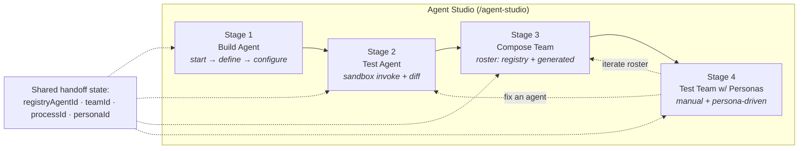
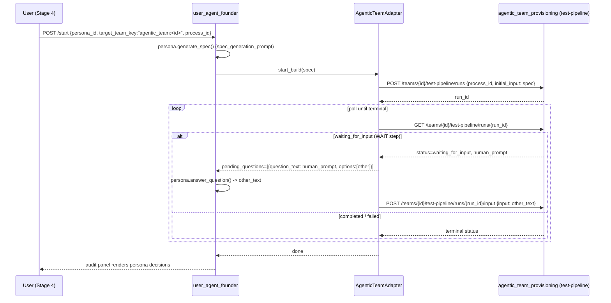

# Agent Studio — UX Redesign Spec

**Status:** Draft for review · **Author:** UX · **Scope:** `/agent-studio` (replaces Agent Console, Agentic Teams, Testing Personas)
**Deliverable type:** Design spec + mockups (no implementation). Grounded against the current codebase so it can be built as-is after approval.

---

## 1. Why this redesign

A user who wants to **build an agent → test it → add it to a team → test the team with personas** had to stitch
together three disconnected surfaces, each with its own mental model of "agent" and "test":

| Surface | Route | What it does | The gap |
|---|---|---|---|
| Agent Console | `/agent-console` | Browse / inspect / run **registry** agents (real, invokable YAML manifests). 7 heavy tabs. | No path to "team". |
| Agentic Teams | `/agentic-teams` | Assemble teams by staffing a roster. Manual chat + pipeline testing. | No unified journey into/out of this surface. |
| Testing Personas | `/persona-testing` | Personas that autonomously drive **only** the Software Engineering team (`user_agent_founder`). | Can't reach the team you just assembled. |

Three problems originally compounded: (a) there is **no journey** connecting the surfaces; (b) *(resolved)* the
registry `AgentManifest` and roster `AgenticTeamAgent` used to be two competing, unreconciled "agent" models —
that split has since been closed by the Identity unification work: `AgentManifest` is now the sole writable SoT,
and `AgenticTeamAgent` roster rows are thin refs (`agent_name`/`source`/`manifest_id`) whose persona is joined
from the linked Manifest at read time (see `agentic_team_provisioning/README.md`'s "Roster identity: thin refs,
Manifest SoT" section) — so roster agents sourced from the registry *are* the agents you built, not a second
identity; (c) **personas can't reach assembled teams**. This redesign's remaining drivers are (a) and (c).

**The redesign** is a single guided **Agent Studio** that makes the build → test → compose → persona‑test flow
obvious, lets a roster **mix curated registry agents with generated ones**, and lets **any testing persona drive any
assembled team**. It is a clean cutover — the three old surfaces are deleted, not deprecated.

### Design principles
1. **One spine, four stages.** The journey is linear by default, with explicit back‑loops for iteration.
2. **Reuse the working parts.** Catalog, runner, process designer, test panels, and persona dialogs already work — move them into the Studio, don't rebuild them.
3. **No legacy.** No redirects, no "advanced" routes, no dead wrapper shells.
4. **Make the agent identity honest.** A roster entry says where it came from (registry vs generated) and what it can do.

---

## 2. Information architecture

### 2.1 The Studio spine



The Studio maintains a small **handoff state** `{registryAgentId?, teamId?, processId?, personaId?}` via
`AgentStudioStateService` (§2.4) — which the stepper reflects and each stage reads/writes — so each stage pre‑seeds
the next (the agent you just tested is the one offered for the roster; the team you just composed is the default
persona target). This glue is the only genuinely new interaction concept.

**Stepper navigation is forward‑only.** Clicking a previous stage indicator does *not* navigate backward — the
indicators show progress, not links. Iteration happens **primarily** via the explicit Stage‑4 buttons **"fix an agent"**
(→ Stage 2) and **"iterate roster"** (→ Stage 3), and **additionally** via the per‑agent **`Test ▸`** action on
Stage‑3 roster entries (registry agents only — see below). This keeps the journey guided while still allowing controlled
back‑loops.

**Stage 1 itself is a guided build sub‑flow.** "Build Agent" is not a single screen — it is a three‑step
**sub‑stepper** (**1.1 Start → 1.2 Define → 1.3 Configure**) shown beneath the main stepper while Stage 1 is active.
It **authors** an agent (new from scratch, or by cloning an existing one to refine) rather than merely picking one,
and it follows the *same* forward‑only rule: the sub‑step indicators show progress, and the only backward move is the
explicit **`◂ back to Define`** action on the Configure step. The main‑stepper advance **`Test this agent →`**
(Stage 1 → Stage 2) is **gated** — it stays disabled until the agent being built is *defined and saved* (see Stage 1).

**Forward‑only must not trap the user on one agent.** Because the stepper never jumps back to Stage 1, picking a
*different* agent after advancing is an explicit **in‑context** action, not backward navigation:

- **Stage 2** and **Stage 3** each expose a **`[ Browse agents ]`** affordance that opens the Stage‑1 catalog
  (browse + filter + inspect drawer, the same `agent-catalog` component) in a slide‑out. (The `▾` on the wireframe
  `Browse` buttons denotes this **slide‑out catalog panel**, not a traditional dropdown menu.) Selecting another agent
  there updates `registryAgentId` in the handoff state **without** resetting later‑stage work.
  - **Adaptation caveat (same as the Stage‑1 provisioning dashboard).** `agent-catalog` renders full‑width in the
    console today, so hosting it in a narrow slide‑out may need **minor layout adjustments** (responsive grid / drawer
    width) — its core logic and API calls stay **unchanged**. If adaptation is non‑trivial, mount it via a **thin
    wrapper component** inside the slide‑out container rather than editing the catalog itself, keeping the reused
    component intact. (Stage 1 hosts the same component full‑page and needs no such wrapper.)
- **What "without resetting later‑stage work" means.** It refers to the *handoff‑state slots* — the Stage‑3 roster
  composition and Stage‑4 team/persona selection are preserved. It does **not** mean the *current* stage keeps stale
  context: when the agent changes **in Stage 2**, the runner resets to the new agent — it clears and re‑fetches that
  agent's run history and re‑warms its sandbox (the transient runner UI is per‑agent, so it must follow the new
  `registryAgentId`).
- In Stage 3, the **`+ Add → Search registry agents`** path is itself a full catalog browser with inspect, so a
  roster can be staffed with agents that were never the "current" `registryAgentId`.
- **Re‑test an agent without going forward first.** A user in Stage 3 who realizes a roster agent needs more testing
  should not have to advance to Stage 4 to reach the "fix an agent" back‑loop. Each roster entry therefore exposes a
  **`Test ▸`** action that opens **that agent in Stage 2** (setting `registryAgentId` to it) — the same back‑loop
  semantics as Stage 4's "fix an agent", available directly from Stage 3. This is still not a *stepper* back‑click;
  it's an explicit per‑agent action, and Stage‑1 remains reachable only via the `Browse agents` overlay.
  **Registry‑only:** `Test ▸` is available **only on `source: registry` entries** (they have a `registryAgentId` /
  manifest the Stage‑2 sandbox can run). On **`generated`** entries it is **hidden** (shown disabled with a tooltip
  *"Generated agents can't be individually sandbox‑tested — test the full team in Stage 4"*), since they have no
  registry manifest to open in Stage 2.

The stepper stays forward‑only (no Stage‑1 stepper click, no confirmation dialog needed); the catalog and the
"test this agent" jump are simply reachable as in‑context actions from the later stages. Mechanically, these explicit
back‑loop actions (`Test ▸`, "fix an agent", "iterate roster") call a Studio‑shell method — e.g. `navigateToStage(n)`
— that programmatically switches the active stage; this is **distinct** from clicking a stepper indicator, which
stays inert for backward moves.

### 2.2 Navigation changes (`user-interface/src/app/models/navigation.model.ts`, `agentic-ai` group)

```
BEFORE                              AFTER
  AI Systems                          AI Systems
  Agent Console      ──┐              Agent Studio          ◀ single entry
  Agentic Teams      ──┼─ removed     Deepthought
  Testing Personas   ──┘              Product Delivery      ◀ relocated console tabs
  Deepthought                         Cognition             ◀ relocated console tab
```

### 2.3 Route changes (`app.routes.ts`) — clean cutover, **delete** then **add**

| Action | Route | Note |
|---|---|---|
| **delete** | `/agent-console` | container shell removed |
| **delete** | `/agent-provisioning` | legacy redirect removed |
| **delete** | `/agentic-teams` | container shell removed |
| **delete** | `/persona-testing` | container shell removed |
| **delete** | `/persona-testing/audit/:runId` | moved under Studio |
| **add** | `/agent-studio` | with nested `…/persona-run/:runId` for the live audit view |
| **add** | `/product-delivery` | new home for Backlog / Sprints / Feedback tabs |
| **add** | `/cognition` | new home for the Cognition tab |

The three container shells — `AgentConsoleComponent` (7‑tab), `AgenticTeamDashboardComponent`,
`PersonaTestingDashboardComponent` — are **deleted**. Their useful children are **moved** into the Studio (see §4).
The non‑journey console tabs (Backlog, Sprints, Feedback, Cognition) are **relocated to first‑class routes**, never
parked in a legacy shell; **Provisioning is integrated into Stage 1** (a per‑agent slide‑out, not its own route — see
Stage 1 and §7). After this, nothing routes to the old surfaces.

**Relocated-route UIs (kept deliberately thin — no redesign):**

- **`/product-delivery`** — a minimal `ProductDeliveryComponent` with a simple tabbed layout
  (**Backlog · Sprints · Feedback**) that mounts the existing tab components directly, with no added chrome.
- **`/cognition`** — renders the existing `CognitionTabComponent` as a full-page view, no wrapper chrome.

These routes exist only so the cutover loses no functionality; their internals are unchanged from today's tabs.

### 2.4 Handoff state management

The four-stage handoff is managed by a single **`AgentStudioStateService`**, provided at the **Studio shell**
level (one instance per Studio session). It holds the current `registryAgentId`, `teamId`, `processId`, and
`personaId`, plus a Stage‑1 build slot `draftAgentId` (the agent currently being authored — see below).

- **Read/write:** each stage component injects the service; user actions (select an agent, create/select a team,
  pick a process, choose a persona) write to it. The stepper and each next stage **read** it to pre‑seed
  themselves (e.g., Stage 3 offers the Stage‑2 agent as a roster candidate; Stage 4 defaults its target to the
  Stage‑3 team).
- **Scope — journey state vs transient UI state.** The service holds two *distinct* tiers, and only one is durable:
  - **Journey‑handoff state (durable):** the four IDs above (`registryAgentId`, `teamId`, `processId`, `personaId`),
    the Stage‑1 build slot **`draftAgentId`**, **plus** the partial stage work §3.5 enumerates (Stage‑1 agent draft,
    Stage‑2 test inputs, uncommitted Stage‑3 roster composition). This is the only tier written to drafts.
  - **Transient UI state (session‑only):** ephemeral view state such as the **catalog filters** (`agent-catalog`'s
    selected‑team filter, tag filter(s), search query — see §4.1). These live on the service so the catalog re‑opens
    where the user left it within a session, but they are **never** included in the draft payload and are **not**
    restored on resume — a loaded draft re‑seeds the four IDs and partial work, not the last filter selection. (The
    selected‑*agent* id is the one exception that bridges the tiers: it *is* the handoff `registryAgentId`, so it is
    durable.) This keeps the draft schema in §3.5 limited to the four IDs + partial work, with no transient UI fields.
- **Stage‑1 build slot.** While Stage 1 authors an agent, `draftAgentId` identifies the in‑progress build and the
  `stage1AgentDraft` partial work (§3.5) carries its definition; a clone also records `clonedFrom: <sourceAgentId>`.
  On **Save** (Stage 1.3) the draft agent is registered and its registry id is written to **`registryAgentId`** — so
  the rest of the journey (Stages 2–4) reads `registryAgentId` exactly as before, whether the agent was authored here
  or picked. `draftAgentId` / `clonedFrom` are build‑time bookkeeping; they never change the Stage 2–4 contract.
- **Persistence:** the service hydrates from / syncs to the server-side **draft API** (see §3.5). The draft is the
  durable source of truth; the service may keep an in‑session `localStorage` cache for unsaved edits, but resume
  across reloads/devices comes from the API, not local storage.
- **Local‑cache vs server‑draft conflict.** When the user **loads** a server draft while the `localStorage` cache
  holds unsaved local edits, the Studio prompts: *"You have unsaved changes — save them first, or discard?"*
  **Save first** flushes the local cache to the current draft (`POST …/drafts`) before hydrating the chosen draft;
  **Discard** clears the local cache and then hydrates. The server draft is never silently overwritten and local
  edits are never silently lost — one of the two is always an explicit choice. Loading never merges the two states.

---

## 3. Stage-by-stage screen specs

Each stage below gives: purpose · wireframe · reused vs new components · the API it calls.

### Stage 1 — Build Agent

**Purpose.** *Author* the agent you want to work on — **create a new one** from a natural‑language description, or
**start from an existing agent and refine a copy of it** — then define and save it. Entry point of the journey. Build
is a forward‑only **sub‑stepper** (**1.1 Start → 1.2 Define → 1.3 Configure**) shown beneath the main stepper; the
main‑stepper advance **`Test this agent →`** is **disabled until the agent is defined and saved** (the gate below).

#### 1.1 Start — new, or from an existing agent

Choose how to begin. This is the only place Stage 1 reaches the catalog, and it never mutates a source agent.

```
┌─ Agent Studio · Build ─────────────────────────────────────────────────────────┐
│  ① Build ─ ② Test ─ ③ Compose ─ ④ Personas    [ Save draft ]  [ Load draft ▾ ] │
│  Build:  ● Start ──── ○ Define ──── ○ Configure                                 │
├────────────────────────────────────────────────────────────────────────────────┤
│  How do you want to start?                                                       │
│  ┌───────────────────────────────┐  ┌────────────────────────────────────────┐  │
│  │  ✦  Create from scratch        │  │  ⎘  Start from an existing agent        │  │
│  │  Describe what you need; the    │  │  Pick a registry agent; we duplicate    │  │
│  │  assistant drafts it with you.  │  │  it into a new draft you refine.        │  │
│  └───────────────────────────────┘  └────────────────────────────────────────┘  │
│  ┌─ catalog (when "from existing") ──────────────────────────────────────────┐  │
│  │ filters: Team ▾  Tag ▾  Search [____]   grid: blogging.planner · market.… │  │
│  │ inspect drawer:  blogging.planner            [ Duplicate & refine → ]      │  │
│  └────────────────────────────────────────────────────────────────────────────┘  │
└────────────────────────────────────────────────────────────────────────────────┘
```

- **Create from scratch** → opens **1.2 Define** with the assistant in **`new`** mode (a blank draft agent).
- **Start from an existing agent** → reuses **`agent-console/agent-catalog`** (browse / filter / inspect — the same
  component Stage 2/3 reach via `Browse agents`). **`Duplicate & refine →`** in the inspect drawer **clones** the
  selected manifest into a new draft (the source registry agent is **never mutated** — same read‑only‑source
  philosophy as the Stage‑3 `from‑registry` projection) and opens **1.2 Define** in **`refine:<sourceAgentId>`** mode,
  pre‑seeded with the clone.

#### 1.2 Define — the build assistant

The core build experience: a chat assistant that *co‑authors the agent with you*, with a live definition panel that
fills in as you talk. The assistant is **mode‑aware** — in `new` mode it elicits the agent from scratch; in `refine`
mode it opens pre‑loaded with the cloned definition and a banner ("Refining a copy of `blogging.planner`"), so it
**edits the existing definition rather than inventing a new one**.

```
┌─ Agent Studio · Build ─────────────────────────────────────────────────────────┐
│  Build:  ✓ Start ──── ● Define ──── ○ Configure        [ Test this agent → ] 🔒 │
├──────────────────────────────────┬─────────────────────────────────────────────┤
│  Assistant  (refining a copy of  │  Agent definition                   ✦ live   │
│   blogging.planner)              │  name     [ blogging.planner.v2           ]  │
│  ┌──────────────────────────────┐│  role     [ Plans SEO‑aware outlines      ]  │
│  │ ▸ "Make it target B2B and add ││  tags     [ content ] [ seo ] [ + add ]      │
│  │    a word‑count input."       ││  tools    ☑ web.search  ☑ draft  ☐ http.api  │
│  │ ← updated inputs + system     ││  inputs   { topic, audience, word_count }    │
│  │   prompt; 1 field still needed ││  outputs  { outline[], keywords[] }          │
│  └──────────────────────────────┘│  prompt   [ system prompt … ]  guardrails ▾  │
│  [ ask the assistant…        ▶ ] │  Readiness: ⚠ 1 required field missing (role)│
└──────────────────────────────────┴─────────────────────────────────────────────┘
```

- **Reuse (pattern):** the **`TeamAssistantChatComponent`** (`user-interface/src/app/components/team-assistant-chat/`)
  — already a generic **chat + live context‑form + readiness check + launch** panel — pointed at the new
  agent‑authoring assistant endpoint (§5 item 5). The **inputs/outputs schema** sub‑panel reuses
  **`AgentSchemaFormComponent`** (`.../agent-console/agent-schema-form/`), which renders JSON Schema as an editable
  form; the **tools** picker reads the existing **`GET /api/llm-tools/`**.
- **Two‑way, like the Stage‑3 roster.** Every field is editable **either** by chatting **or** by editing the panel
  directly, and the two stay in sync — the assistant proposes, you can always override.
- **Mode awareness is real state**, not just a banner: the handoff carries `draftAgentId` and, for a clone,
  `clonedFrom: <sourceAgentId>` (§2.4); the assistant's system prompt and opening message branch on `new` vs `refine`
  (§5 item 5).
- **Readiness** reuses the component's existing required‑field check; it is what the Stage‑2 gate reads (below).

#### 1.3 Configure & Review — full anatomy, then save

A final pass over the agent's complete **anatomy** (per `agent_provisioning_team/AGENT_ANATOMY.md`) before it becomes
testable: **Input/Output**, **Tools**, **Memory** (cognition retention / knowledge‑graph toggles), **Prompts**
(system / guardrails), **Security guardrails** (advisory + enforced rule packs), and **Subagents**. Advanced manifest
fields surface here (invoke `kind`, sandbox `access_tier`). **`Save agent`** persists and registers the draft.

```
┌─ Agent Studio · Build ─────────────────────────────────────────────────────────┐
│  Build:  ✓ Start ──── ✓ Define ──── ● Configure       [ ◂ back to Define ]      │
├────────────────────────────────────────────────────────────────────────────────┤
│  Review agent · blogging.planner.v2                                              │
│  Input/Output  { topic, audience, word_count }  →  { outline[], keywords[] }     │
│  Tools         web.search · draft                                                │
│  Memory        retention 90d · knowledge‑graph ✓                                 │
│  Prompts       system prompt ✓ · guardrails: default_guardrails                  │
│  Subagents     (none)                          [ Provision ▾ ]                   │
│                                  [ Save agent ]          [ Test this agent → ]    │
└────────────────────────────────────────────────────────────────────────────────┘
```

- **Save → registry.** `Save agent` persists the draft and **registers** it — reusing the generated‑agent path
  (`manifest_generation.build_agent_manifest` / `register_team_manifests`, §5 item 7) — so it becomes resolvable by
  `GET /api/agents/{id}` and invokable at `POST /api/agents/{id}/invoke`, exactly what Stage 2 needs.
- **Folded in (Provisioning):** the existing `agent-provisioning-dashboard` (`[ Provision ▾ ]`) remains available here
  to deploy the saved agent to an environment — unchanged from today's Provisioning tab (slide‑out; layout caveat and
  service contract in §4.1).

**Gate to Stage 2 (`Test this agent →`).** The main‑stepper advance is **enabled only when the agent is *defined*
(readiness satisfied — required fields present) AND *saved* (registered).** Until then it is **disabled** with a
tooltip listing what's missing (e.g. "add a role" / "save the agent first") — the same gating pattern as Stage 3's
`Test this team →`. **Handoff:** on save, the draft agent's registry id becomes the handoff **`registryAgentId`**, so
Stage 2 opens pre‑seeded and **Stages 2–4 read `registryAgentId` unchanged** whether the agent was authored here or
picked from an existing one.

### Stage 2 — Test Agent

**Purpose.** Run the selected agent in its sandbox, iterate on inputs, compare runs.

```
┌────────────────────────────────────────────────────────────────────────────────┐
│  ① Build ─ ② Test ─ ③ Compose ─ ④ Personas  agent: blogging.planner  [ Browse ▾ ] │
├──────────────────────────────────┬─────────────────────────────────────────────┤
│  Input                            │  Run history                                 │
│  ┌─ schema form / JSON ─────────┐ │  ● 14:02  run_8f2…   ✓ 3.1s                  │
│  │ topic     [____________]     │ │  ● 13:55  run_7b1…   ✓ 2.8s   [ Compare ⇄ ] │
│  │ audience  [____________]     │ │  ● 13:40  run_5a0…   ✗ error                 │
│  │ …                            │ │                                              │
│  └──────────────────────────────┘ │  Output (run_8f2…)                           │
│  [ Saved inputs ▾ ] [ Save input ]│  ┌─────────────────────────────────────────┐ │
│  [ ▶ Run in sandbox ]             │  │ { "outline": [ … ], "keywords": [ … ] } │ │
│                                    │  └─────────────────────────────────────────┘ │
│                          sandbox: ● WARM                       [ Add to team → ] │
└──────────────────────────────────┴─────────────────────────────────────────────┘
```

- **Reuse as‑is:** `agent-console/agent-runner` (invoke‑in‑sandbox, saved inputs, run history, unified diff) — calls `agent-runner-api.service.ts` → `POST /api/agents/{id}/invoke`, `/runs`, `/saved-inputs`, `/diff`. Highest‑value reuse; near‑leaf component.
- **Sandbox status indicator (`● WARM`):** reuses the **existing** sandbox management in `agent-runner` — no new behavior. States are **COLD** (not initialized), **WARM** (initialized/ready), **HOT** (recently used). The runner warms the sandbox automatically when the agent is selected; the indicator reflects the runner's reported state.
- **Handoff (`Add to team →`):** advances to Stage 3 with the current `registryAgentId` **pre‑selected as a candidate**. The agent is **NOT** automatically added to any roster — the user must add it explicitly via the Stage‑3 roster panel's "+ Add". This prevents accidental roster changes.

### Stage 3 — Compose Team

**Purpose.** Assemble/curate a team: design the process via chat, **and** staff the roster by mixing **registry**
agents (the ones you just built/tested) with **LLM‑generated** suggestions.

```
┌────────────────────────────────────────────────────────────────────────────────┐
│  ① Build ─ ② Test ─ ③ Compose ─ ④ Personas             [ Browse agents ▾ ]       │
│  team: [ Growth Pod ▾ ]   ·   process: [ Content pipeline ▾ ]                     │
├──────────────────────────────────┬─────────────────────────────────────────────┤
│  Process designer (chat)          │  Roster                          [ + Add ▾ ] │
│  ┌──────────────────────────────┐ │  ┌─────────────────────────────────────────┐ │
│  │ ▸ "Design a content pod that │ │  │ ✦ blogging.planner   [registry]   🗑     │ │
│  │   plans, writes, reviews…"   │ │  │   tools: web, draft · role: planning    │ │
│  │ ← proposes steps + agents    │ │  │ ⚙ Writer Agent       [generated]  🗑     │ │
│  └──────────────────────────────┘ │  │   skills: longform, seo                  │ │
│  Process steps (DAG)              │  │ ⚙ Reviewer Agent     [generated]  🗑     │ │
│  [Plan]→[Write]→[Review]→[Publish]│  └─────────────────────────────────────────┘ │
│                                    │  Roster validation:  ✓ fully staffed         │
│         [ + Add ▾ ]  opens:  ( ⌕ Search registry agents… )  |  ( ✨ Suggest via chat )│
│                                                              [ Test this team → ] │
└──────────────────────────────────┴─────────────────────────────────────────────┘
```

- **Reuse as‑is:** `process-designer-chat` (LLM design mode, `@Input() team`). From `agentic-team-dashboard`, reuse the **specific child components** — not the dashboard container/shell, which is deleted (§4): the **team CRUD dialog** (`TeamCreateDialogComponent`), the **process/DAG editor** (`ProcessDagEditorComponent`), and the **roster‑validation panel** (`RosterValidationPanelComponent`), all backed by `agentic-team-api.service.ts`. Where these aren't already standalone components inside the dashboard, they are **extracted from it** during the cutover (the dashboard shell is being deleted regardless).
- **New (one small component): Roster panel.** Lists roster entries with a **`source` badge** (`registry` ✦ / `generated` ⚙) and a delete control. **"+ Add"** offers two paths: **search registry agents** (→ new `POST …/teams/{id}/agents/from-registry`) or **suggest via chat** (existing LLM flow). Deleting calls new `DELETE …/teams/{id}/agents/{agent_name}`.
- **Authorization (roster mutation).** The new `from-registry` / delete / update endpoints **must enforce authorization** — only a user with the **Team Owner / Admin** role for the given team may add, remove, or edit roster agents — reusing the same authz the existing team‑mutation endpoints apply. The middleware detail lives in §5 (item 3); flagged here so the UX never exposes roster edit/delete to unauthorized users.
- **Roster persona (read-only).** Expanding a roster entry shows **role / skills / tools** chips enriched from each agent's linked **AgentManifest** (thin roster refs are persisted; persona is join-at-read). Inline persona editing and fat roster PUT are **not** supported in this cutover — re-run the process designer chat to propose roster changes, or edit the underlying manifest in Agent Studio Stage 2.
- **Roster validation — "fully staffed":** a roster is *fully staffed* when **every step in the process DAG has at least one assigned agent**, and each assigned agent has the **skills the step requires** (per the process design). This is exactly the existing logic in `roster_validation.py` (it reads the roster's `skills/capabilities/tools` list fields) — registry agents pass uniformly because the `from-registry` projection fills those fields (see §5 item 3). The `✓ fully staffed` / warning indicator surfaces that module's result; no new validation rules are introduced.
- **Switching teams with unsaved roster edits.** The team selector changes `teamId`, which would replace the in‑progress roster. If the current team has **uncommitted roster edits** (the `stage3RosterDraft` partial work, not yet persisted to the team), switching **prompts** the user — *"You have unsaved roster changes — save them to this team, or discard?"* — mirroring the §2.4 draft‑conflict prompt: **Save** persists the pending roster mutations to the current team first, **Discard** drops `stage3RosterDraft`, and only then does `teamId` change. The switch never silently loses roster edits.
- **Process selection.** A team may define more than one process, so a **process dropdown** sits in the Stage‑3 header beside the team selector (`team: [ Growth Pod ▾ ]  ·  process: [ Content pipeline ▾ ]`); choosing one sets `processId` and drives which DAG the panel renders and validates. When the team has exactly one process it is auto‑selected (the dropdown still shows it, disabled). The Stage‑3 → Stage‑4 handoff uses this currently selected `processId`.
- **"Complete" process — definition.** A process is **`complete`** per the existing provisioning `process_status` (the same status the §5 item 2 testable‑teams filter reads): its DAG is finalized and saved (not a draft), so it can be run end‑to‑end. The process dropdown badges each option with its status, and incomplete processes are shown disabled with a *"finish this process to test it"* hint.
- **Handoff (`Test this team →`):** **enabled only when the roster is fully staffed AND the selected process is `complete`.** This is stricter than "a process is selected" on purpose: §5 item 2 says Stage 4's persona dropdown lists only teams with **≥1 `complete` process**, so allowing the jump on an incomplete process would strand the user in Stage 4 with their team absent from the dropdown. Clicking sets `teamId` + `processId` and advances to Stage 4. While disabled, the button's **tooltip** lists exactly what's missing (e.g. "step *Review* has no agent" / "select a process" / "process *Content pipeline* is still a draft — finish it to test").
- **Stage‑4 safety net.** Even with the stricter gate, Stage 4 independently guards against a non‑testable team (e.g. the process's status changed after the jump): if the current `teamId` is absent from the testable‑teams list, the persona sub‑mode shows an **inline message** — *"This team has no complete process yet"* — with a **`◂ Finish in Stage 3`** link (a `navigateToStage(3)` back‑loop), rather than a silently empty dropdown.

### Stage 4 — Test Team with Personas

**Purpose.** Validate the assembled team two ways: **manually** (you chat / drive the pipeline) or
**persona‑driven** (a testing persona autonomously drives the team end‑to‑end).

```
┌────────────────────────────────────────────────────────────────────────────────┐
│  ① Build ─── ② Test ─── ③ Compose ─── ④ Personas        team: Growth Pod        │
├────────────────────────────────────────────────────────────────────────────────┤
│  [ Manual testing ]   [ Persona-driven ◀ ]      [ ◂ iterate roster ] [ ◂ fix agent ]│
│                                                                                  │
│  Persona            ┌─ persona library ───────────────┐   [ + New persona ]      │
│  ┌────────────────┐ │ ◎ Startup Founder   (built-in)  │                          │
│  │ Startup Founder│ │ ○ Impatient PM      (custom)    │   target process:        │
│  │ system prompt… │ │ ○ Budget Buyer      (custom)    │   [ Content pipeline ▾ ] │
│  └────────────────┘ └─────────────────────────────────┘   [ ▶ Run persona test ] │
│                                                                                  │
│  Live run (run_a91…)   status: ● waiting_for_input → persona answering…          │
│  ┌─ decisions / transcript ───────────────────────────────────────────────────┐ │
│  │ Q "Which tone for the post?"   → persona: "punchy, founder-voice" (rationale)│ │
│  │ step Plan ✓ → step Write ⧖ …                                                 │ │
│  └────────────────────────────────────────────────────────────────────────────┘ │
└────────────────────────────────────────────────────────────────────────────────┘
```

- **Manual sub‑mode — reuse as‑is:** `agentic-team-test-panel` (composes `agent-test-chat` + `pipeline-test-runner`; drives `…/test-chat/*` and `…/test-pipeline/runs` + `/input`).
- **Persona sub‑mode — reuse as‑is:** `start-test-dialog`, `persona-editor-dialog`, `persona-test-audit-panel` (from the old persona dashboard). The launcher is **pre‑seeded** with the current team as `target_team_key = "agentic_team:<teamId>"`; the agentic team appears in the dropdown automatically once the backend `/testable-teams` change lands (§5). Personas are picked from the library or created inline.
- **Run progress UI (sets expectations for slow autonomous runs).** Because founder poll intervals are 15–30s
  (see §6), the live‑run header shows an **elapsed‑time counter** and, during a `waiting_for_input` WAIT step, an
  animated **"persona is thinking…"** indicator. When the process DAG length is known, a **step progress bar**
  (`step 2 of 4`) renders alongside the transcript; otherwise it falls back to the indeterminate "thinking…" state.
- **Back‑loops:** "iterate roster" → Stage 3; "fix an agent" → Stage 2.

**Returning to Stage 4 after a back‑loop.** A back‑loop simply places the user in the earlier stage; because the
stepper is forward‑only, the user comes back via the **normal forward actions** — "Add to team →" (Stage 2 → 3) and
"Test this team →" (Stage 3 → 4) — not by clicking a stage indicator. This re‑advance is **seamless** because the
handoff state (§2.4) retains `teamId`, `processId`, and `personaId` across the jump: Stage 3 re‑opens on the same
team/process, and Stage 4 re‑seeds the same persona target, so the user only re‑touches what they actually came back
to change. (A "fix an agent" jump that swaps `registryAgentId` likewise leaves `teamId`/`processId`/`personaId`
intact — only the agent in focus changes.)

**"Fix an agent" when no registry agent is in focus.** A team composed entirely of *generated* agents reaches Stage 4
with `registryAgentId` **null** — there's nothing to open in the sandbox‑based Stage 2. In that case the **"fix an
agent"** button is **disabled** with a tooltip *"No registry agent in focus — use Browse agents to pick one"*;
clicking the offered `Browse agents` overlay selects a registry agent (sets `registryAgentId`) and then enters Stage 2.
It never navigates to a broken Stage 2 with a null agent.

### 3.5 Drafts & session resume (server‑side)

The Studio header carries two controls — **`[ Save draft ]`** and **`[ Load draft ▾ ]`** — that let a user **save and
resume** an in‑progress journey across reloads and devices. **Persistence is server‑side** (chosen over client‑only
so drafts survive device changes and match the persisted nature of teams/personas):

- **Save** — `[ Save draft ]` opens a small **name popover** (pre‑filled with a timestamp default, editable) and on confirm issues `POST /api/agent-studio/drafts` with the current handoff state
  (`registryAgentId`, `teamId`, `processId`, `personaId`) **plus** any partial work the stages hold (e.g. Stage‑2
  test inputs, Stage‑3 roster composition not yet committed to a team). Returns `{ draft_id, name, updated_at }`.
  Re‑saving the same draft updates it in place.
- **List** — `GET /api/agent-studio/drafts` returns **lightweight summaries** (`{ draft_id, name, updated_at }`, **not** full payloads) to populate the header dropdown — keeping the list cheap regardless of draft count. The list is **paginated and capped**: it accepts `?limit=` (server default **50**, max 100) and `?offset=`, ordered **most‑recent `updated_at` first**, so a user with many drafts gets a fast, bounded dropdown (with a "show older" affordance that pages via `offset`). Implementations may also accept an optional `?q=` name filter, but the default‑50‑most‑recent cap is the contract.
- **Load** — selecting a draft from `[ Load draft ▾ ]` fetches its full payload via **`GET /api/agent-studio/drafts/{draft_id}`** (the only endpoint that returns the complete `AgentStudioDraft`), then **triggers the conflict check in §2.4** (save‑first / discard prompt if the local cache holds unsaved edits), hydrates `AgentStudioStateService`, and jumps the stepper to the **furthest reachable stage**.
  - **Furthest reachable stage — definition.** The highest stage whose required handoff state is present and valid, computed client‑side after hydration: **Stage 4** if `teamId` and `processId` are set *and* that process is `complete` (the same gate as the Stage‑3 handoff); **Stage 3** if `teamId` is set; **Stage 2** if `registryAgentId` is set (i.e. an agent was saved — Build is complete); otherwise **Stage 1**, resumed at the Build sub‑step the `stage1AgentDraft` reached (Start if absent, Define if a draft exists, Configure if it is ready‑but‑unsaved). (Stage 4 deliberately does *not* require the roster to be re‑validated on load — the persisted `teamId`/`processId` already passed the gate when saved, and Stage 4's own safety net re‑checks testability.)
- **Name / rename / delete** — the name is set in the Save popover and editable later via a **pencil** affordance beside the loaded draft's name in the header (`PATCH /api/agent-studio/drafts/{draft_id}`); the Load dropdown offers a per‑row **⋯ → Delete** (`DELETE /api/agent-studio/drafts/{draft_id}`). Rename + delete are **in scope** for the initial release (the store supports them trivially).
- **Scope** — drafts are **scoped to the authenticated user**; one user cannot list or load another's drafts.

**Draft payload schema** (the request/response body for `POST`/`GET …/drafts`, so frontend and backend agree):

```ts
interface AgentStudioDraft {
  draft_id?: string;          // server-assigned; omitted on first create
  name?: string;              // user label; defaults to a timestamp
  updated_at?: string;        // ISO-8601; server-managed
  // ── handoff state (§2.4) ──
  registryAgentId?: string;
  teamId?: string;
  processId?: string;
  personaId?: string;
  // ── Stage-1 build (agent being authored) ──
  draftAgentId?: string;                     // in-progress build id; becomes registryAgentId on save
  stage1AgentDraft?: {
    mode: 'new' | 'refine';
    clonedFrom?: string;                     // source manifest id when mode === 'refine'
    name?: string; role?: string; tags?: string[];
    tools?: string[];                        // tool ids from GET /api/llm-tools/
    ioSchema?: { input?: unknown; output?: unknown };  // JSON Schema (rendered by AgentSchemaForm)
    prompts?: { system?: string };
    cognition?: { retentionDays?: number; knowledgeGraph?: boolean };
    savedAgentId?: string;                   // set once Save registers it (equals registryAgentId)
  };
  // ── partial per-stage work ──
  stage2Inputs?: {
    savedInputId?: string;                 // if a saved input was selected
    formValues?: Record<string, unknown>;  // unsaved schema-form values
  };
  stage3RosterDraft?: Array<{
    agentName: string;
    source: 'registry' | 'generated';
    manifestId?: string;                   // set when source === 'registry'; same id space as the
                                           // handoff registryAgentId — named to mirror backend manifest_id (§5 item 3)
    role?: string;
    skills?: string[];
  }>;
}
```

All fields except `agentName`/`source` (within a roster entry) and `mode` (within `stage1AgentDraft`) are optional —
a draft saved **mid‑Build** carries a `stage1AgentDraft` (and `draftAgentId`) but **no** `registryAgentId` yet; once
the agent is saved, `registryAgentId` is set (and equals `stage1AgentDraft.savedAgentId`). The server persists the
blob verbatim under the user id; it does not interpret stage payloads.

**No `stage4` field — intentional.** Stage 4 has no *unsaved* partial work worth persisting: the chosen persona is
already the handoff `personaId`, and the team/process targets are `teamId`/`processId`. Everything else in Stage 4 is
a **live run** (the manual test‑chat session and the persona‑driven pipeline run), which is **transient and already
durable server‑side under its own `run_id`** — a resumed draft reattaches to an in‑flight/last run by `run_id` rather
than replaying chat state into the draft blob. So drafts deliberately stop at the Stage‑3 roster; Stage‑4 run context
is owned by the run, not the draft.

**Identifier naming.** `registryAgentId` (handoff slot) and a roster entry's `manifestId` refer to the **same**
underlying registry manifest id (backend column `manifest_id`, §5 item 3); they are named differently to reflect
their distinct roles — "the agent in focus" vs. "this entry's own source link" — and to mirror the backend column.

This makes draft persistence a **must‑have backend touchpoint** (see §5, item 4 — Studio drafts). The frontend `AgentStudioStateService`
is the single client owner of draft load/save. **Saving is manual** — the `[ Save draft ]` button is the only thing
that writes to the API; there is **no background auto‑save**. The optional in‑session `localStorage` cache exists only
to guard unsaved edits against an accidental tab close/reload between manual saves; the API remains the source of truth.

### 3.6 Loading, empty, and error states

The wireframes above show the happy path; every stage also specifies the three non‑happy states. Where a stage
reuses an existing component, it inherits that component's existing handling — these are conventions, not new UI.

| State | Convention | Per‑stage specifics |
|---|---|---|
| **Loading** | Inline skeleton/spinner in the affected panel (never a full‑page block); the stepper stays interactive. | S1 catalog grid → card skeletons; S2 run → spinner on the output pane + disabled `Run`; S4 live‑run → the Stage 4 elapsed counter + "persona is thinking…". |
| **Empty** | A centered message **with the primary action**, never a bare "no data". | S1 "No agents match these filters — clear filters"; S2 "No runs yet — run the agent to see history"; S3 "Roster is empty — + Add an agent"; S4 "No personas — + New persona". |
| **Error** | A dismissible error banner scoped to the panel, with **Retry** where the action is idempotent; the underlying form/selection is preserved. | S1/S2 catalog & invoke errors reuse `agent-catalog`/`agent-runner` error surfaces (`POST …/invoke` failure → banner + Retry, inputs kept); S3 team/roster mutation failure → banner, optimistic row rolled back; S4 pipeline‑start or poll failure → banner on the run card + Retry, persona/process selection kept. |

Sandbox‑specific failures (COLD→WARM warm‑up error in Stage 2) surface through the runner's existing sandbox‑status
channel (Stage 2) rather than a new code path.

---

## 4. Component reuse map

| Component | Disposition in Studio |
|---|---|
| `agent-console/agent-catalog` | **Move + reuse** → Stage 1.1 (Start / clone source) + Stage 2/3 `Browse agents` overlay |
| `team-assistant-chat` (chat + live form + readiness) | **Reuse (pattern)** → Stage 1.2 build assistant |
| `agent-console/agent-schema-form` | **Reuse** → Stage 1.2 I/O editor (also bundled with the Stage‑2 runner) |
| `agent-console/agent-runner` (+ `agent-schema-form`, `agent-run-history`, `agent-diff-dialog`, `save-input-dialog`) | **Move + reuse** → Stage 2 |
| `agent-provisioning-dashboard` | **Move + reuse** → Stage 1 "Provision" affordance |
| `process-designer-chat` | **Move + reuse** → Stage 3 |
| `agentic-team-dashboard` child components — `TeamCreateDialogComponent` (team CRUD), `ProcessDagEditorComponent` (DAG editor), `RosterValidationPanelComponent` (validation) | **Move/extract the children → Stage 3**; the dashboard container shell is **deleted** |
| `agentic-team-test-panel`, `agent-test-chat`, `pipeline-test-runner` | **Move + reuse** → Stage 4 manual |
| `persona-editor-dialog`, `start-test-dialog`, `persona-test-audit-panel` | **Move + reuse** → Stage 4 persona |
| `AgentConsoleComponent` (7‑tab), `AgenticTeamDashboardComponent`, `PersonaTestingDashboardComponent` | **Delete** |
| Backlog / Sprints / Feedback tabs | **Relocate** → `/product-delivery` |
| Cognition tab | **Relocate** → `/cognition` |
| **Studio shell + 4‑stage stepper + handoff state** | **New** (thin) |
| **Roster panel (registry + generated, source badges, add/delete)** | **New** (small) |
| **Build sub‑stepper · Start chooser · agent‑definition panel · tools multi‑select** | **New** (small — Stage 1) |

Net‑new frontend is intentionally minimal: the shell, the stepper, one roster panel, and the Stage‑1 build sub‑flow
(sub‑stepper + Start chooser + agent‑definition panel) — all composed from existing chat / form / catalog components.
Everything load‑bearing exists.

### 4.1 Service dependencies (what the Studio shell must provide)

"Reuse as‑is" only holds if the moved components find the services they expect. Today some are provided by the old
container shells (e.g. `AgentConsoleComponent`); when those shells are deleted, the **Studio shell must re‑provide the
equivalents** (or the component is refactored to inject them directly). The contract:

| Reused component | Services it expects | Provided by |
|---|---|---|
| `agent-catalog` | `AgentCatalogApiService`; plus the catalog filter/selection state it reads from the console shell today — specifically the **selected‑team filter**, **tag filter(s)**, **search query**, and **selected‑agent id**. These move into `AgentStudioStateService` as **transient session‑only UI state** (per the two‑tier scope in §2.4) — the filters are *not* persisted in drafts; only the selected‑agent id is durable, because it *is* the handoff `registryAgentId`. | Studio shell |
| `agent-runner` (+ schema‑form, run‑history, diff, save‑input dialogs) | `AgentRunnerApiService` (invoke/runs/saved‑inputs/diff) | Studio shell |
| `team-assistant-chat` + `agent-schema-form` (Stage 1.2 build) | `TeamAssistantApiService` pointed at the agent‑authoring assistant base URL (§5 item 5); `GET /api/llm-tools/` for the tools picker | Studio shell |
| `agent-provisioning-dashboard` | its existing provisioning service(s), unchanged | Studio shell (provided directly, or via the thin slide‑out wrapper component described in the Stage 1 adaptation caveat) |
| `process-designer-chat`, extracted `agentic-team-dashboard` children | `AgenticTeamApiService` | Studio shell |
| Stage‑4 test panels & persona dialogs | `agentic-team-test` + persona/audit services | Studio shell |
| all stages | **new** `AgentStudioStateService` (handoff/draft, §2.4/§3.5) | Studio shell |

**Action for implementation:** before moving each component, confirm its actual injected services (constructor +
template) and ensure the Studio shell's providers cover them; any console‑shell‑scoped state a component relies on
is either re‑provided at the shell or folded into `AgentStudioStateService`. No reused component should depend on a
deleted container.

---

## 5. Backend touchpoints the UX depends on

The UX cannot ship without these. They are additive and grounded against the current code.



**Must‑have:**
1. **Persona → any team — `AgenticTeamAdapter`** (`backend/agents/user_agent_founder/targets/agentic_team.py`, modeled on `targets/software_engineering.py`) implementing the `TargetTeamAdapter` Protocol against the *existing* `POST …/test-pipeline/runs` + `/input` endpoints — **no new provisioning endpoints needed**. A *collapsing adapter*: persona `generate_spec()` → pipeline `initial_input`; each `waiting_for_input` WAIT step → wrapped as a single free‑text question the persona answers via `/input`. Dynamic dispatch in `targets/__init__.py` via `get_adapter("agentic_team:<id>")`. **`process_id` note:** the run‑create call sends `{process_id, initial_input}` (sequence diagram above) so the chosen process is run. If `POST …/test-pipeline/runs` does not already accept `process_id`, this is a **parameter addition to that existing endpoint** (still *not* a new endpoint) — confirm against the current handler and extend if missing. **Where `process_id` comes from is itself a required contract change:** it originates from the Stage‑3 → Stage‑4 handoff (`processId`) and must travel `Stage 4 → POST /start → run → adapter`. The current `user_agent_founder/api/main.py:StartRunRequest` carries only `persona_id` / `target_team_key` / `project_name`, so it **must be extended to accept `process_id`** and persist it on the run (item 8), or the `AgenticTeamAdapter` has no reliable source for the chosen process and persona tests would run the wrong/default process (or fail if `process_id` is required).
2. **Testable‑teams enumeration** — `user_agent_founder/api/main.py:list_testable_teams` also lists agentic teams via the cross‑service call **`GET /api/agentic-team-provisioning/teams`** (the unified‑API mount path). **The `list_testable_teams` aggregator applies the "≥1 `complete` process" filter server‑side** (it already composes the response the dropdown consumes), so the frontend receives a ready‑to‑use list and does no filtering. (If the provisioning `teams` endpoint later grows a `process_status` query param, `list_testable_teams` should pass it to avoid over‑fetching, but the filter contract stays server‑side either way.) Without this the persona dropdown is empty.
3. **Registry → roster bridge** — `AgenticTeamAgent` persists only thin refs (`agent_name`, `source`, `manifest_id`). `POST …/teams/{id}/agents/from-registry`, `DELETE …/teams/{id}/agents/{agent_name}`, and `PUT …/teams/{id}/agents/{agent_name}` (legacy: empty body is a no-op; persona-field edits return `400`). Persona is **AgentManifest SoT**: `GET …/teams/{id}/agents` returns `EnrichedRosterAgent` rows with persona joined at read time via `resolve_persona` (`manifest.tags → skills`, `manifest.cognition.tools → tools`, `manifest.summary → role`, etc.). `roster_validation.py` resolves persona the same way. Roster PUT does **not** store per-team persona overrides — edit the linked Manifest instead.
   **`from-registry` API contract** (so frontend/backend agree without a second round‑trip):
   - **Request body:** `{ manifest_id: string }`. The server persists a thin ref; `agent_name` is derived server‑side from the manifest name (the roster slot key), not sent by the client.
   - **Response:** an **`EnrichedRosterAgent`** (thin ref plus joined persona fields) so the client can render the new row without re‑fetching the roster. `409` if the manifest is a generated team agent or otherwise cannot be added from the registry.
   **Authorization:** all three endpoints (`from-registry`, `DELETE`, `PUT`) mutate a team's roster, so they **must** enforce the same authz as the existing team‑mutation routes — restricted to the team's **Owner/Admin** (reuse the provisioning service's existing team‑permission dependency/middleware; do not ship these unguarded).
4. **Studio drafts — new route group** (see §3.5): **`POST /api/agent-studio/drafts`** (create/update), **`GET /api/agent-studio/drafts`** (list **summaries** — `{draft_id,name,updated_at}`, **paginated**: `?limit=` default 50/max 100, `?offset=`, most‑recent first), **`GET /api/agent-studio/drafts/{draft_id}`** (full `AgentStudioDraft`), **`PATCH …/{draft_id}`** (rename), **`DELETE …/{draft_id}`**. User‑scoped persistence of the handoff state + partial work, for save/resume across reloads and devices, backed by an `agent_studio_drafts` store keyed by user id; no dependency on the other touchpoints. **Authorization:** drafts are **per‑user** — every read/write is scoped to the authenticated user id, and one user can never list, load, rename, or delete another's drafts. Required because the header `Save draft` / `Load draft` UX is non‑functional without it.

5. **Agent authoring assistant (Stage 1.2)** — a **per‑agent** design assistant that co‑authors a *single agent definition*, modeled on the team‑roster **`ProcessDesignerAgent`** (`backend/agents/agentic_team_provisioning/assistant/agent.py`). Conversation endpoints (`POST …/conversations`, `POST …/conversations/{id}/messages`) return a structured single‑agent definition (name, role, tags, tools, input/output schema, system prompt) **plus** suggested follow‑ups — the same "structured JSON blocks embedded in prose" contract ProcessDesigner already emits (it returns `agent_name/role/skills/tools` descriptors today). It is **mode‑aware**: the request carries `mode: "new" | "refine"` and, for `refine`, the cloned source manifest, so the system prompt and opening turn differ. **Net‑new**, but a focused adaptation of an existing agent — the LLM plumbing, conversation store, and block parsers are reused.
6. **Clone‑from‑registry → draft** — `POST /api/agent-studio/agents/from-registry/{agent_id}` returns a new **draft agent** seeded from the source manifest (projected into the editable definition the Stage‑1.2 panel renders). The **source manifest is never mutated** (read‑only source, mirroring the §5 item 3 `from-registry` roster projection). **Net‑new** — no clone/fork path exists today.
7. **Draft‑agent save + registration** — `Save agent` persists the authored draft and **registers** it into the live `AgentRegistry` by reusing **`agentic_team_provisioning/manifest_generation.py:build_agent_manifest` / `register_team_manifests`** (the existing generated‑agent path), so the saved agent is resolvable by `GET /api/agents/{id}` and invokable at `POST /api/agents/{id}/invoke` — what Stage 2 consumes. **Reuses** the registration machinery; the draft definition rides in `AgentStudioDraft.stage1AgentDraft` (§3.5), so no separate store is required. Tool discovery for the definition panel reuses the existing **`GET /api/llm-tools/`**. *Carries the same caveat as generated team agents — registration is **in‑process**; durable on‑disk manifests across restarts are a tracked follow‑up (§7).*

**Recommended (not required for the UX to ship, but should land alongside it):**

8. Explicit `process_id` column on `user_agent_founder_runs` instead of overloading `repo_path` to carry the chosen process id. **Done** — the dedicated `process_id` column landed with the Stage 4 work, and a follow‑up removed the *separate* `repo_path` overload that had carried the persona spec, so `repo_path` now denotes only a real filesystem path (software‑engineering target) and agentic runs leave it NULL. (Resolution recorded in §7.)

**Nice‑to‑have (UX works without; flag as follow‑ups):** real registry‑agent invocation inside `pipeline_runner.py` (`source=="registry"` branch — Phase 1 runs them as LLM personas, acceptable for v1; **out of scope for v1 and gated on the ADR‑008 spike** — see §6 and `system_design/adr/ADR-008-typed-io-registry-agents-in-free-text-dag.md`); surfacing not‑yet‑rostered registry agents in `recommend_agents_for_step`; faster persona poll interval for agentic runs.

---

## 6. Risks / open questions

- **Phase‑shape impedance** — the founder Protocol assumes 3 phases (spec → analysis → build) with batched
  multiple‑choice questions; an agentic pipeline is a single linear DAG with free‑text WAIT steps. The collapsing
  adapter resolves it (analysis → no‑op pass‑through) but couples the two contracts.
- **Free‑text WAIT vs multiple‑choice persona answers** — persona answering is built for option selection; WAIT
  prompts are open‑ended. Wrapping each as a single `other` option works, but answer quality on open prompts is
  unproven.
- **In‑memory, unbounded WAIT state** in `pipeline_runner.py` (`resume_event.wait()` with no timeout, state held in
  the provisioning process) — a reliability risk for autonomous no‑human persona runs across service restarts.
- **Typed‑IO registry agents in a free‑text DAG** — deepest unknown; **scope v1 to Phase‑1
  LLM‑persona execution — typed‑IO registry‑agent DAG execution is out of scope for v1.** The scope
  boundary is recorded in `system_design/adr/ADR-008-typed-io-registry-agents-in-free-text-dag.md`;
  the deferred follow‑up spike is **resolved** in
  `system_design/adr/ADR-009-typed-io-registry-agent-dag-execution.md` — typed DAG execution is scoped
  to registry agents with a custom `source.entrypoint` (LLM‑generated and Studio‑authored agents keep
  running the free‑text persona path pending a separate runtime‑binding‑caveat follow‑up).
- **Persona run timing** — 15–30s founder poll intervals make autonomous runs feel slow; the UI must set
  expectations (progress, "persona is thinking…", elapsed time).

---

## 7. Decisions

**Resolved (review round 2):**
- **Draft persistence → server‑side.** `POST/GET /api/agent-studio/drafts`, user‑scoped, cross‑device (see §3.5, §5 item 4).
- **Relocation homes confirmed:** Provisioning → Stage 1; Backlog/Sprints/Feedback → `/product-delivery`; Cognition → `/cognition`. No legacy routes retained.
- **High‑fidelity Figma mockups → produced.** A hi‑fi mockup set covering the Stage‑1 build sub‑flow (Start · Define · Configure) plus Stages 2–4 accompanies these wireframes.
- **`process_id` storage on `user_agent_founder_runs` → dedicated column, no `repo_path` overload.** The dedicated `process_id` column landed with the Stage 4 work (was Recommended item 8 / Deferred item 1). A follow‑up also removed the *separate* `repo_path` overload that had carried the persona spec through the agentic‑team analysis→build handoff: the agentic adapter threads the spec via its own `self._spec` (seeded from the persisted `spec_content` on resume) and leaves `repo_path` NULL, so `repo_path` now means only a real filesystem path (software‑engineering target). See `ADR‑007`.

**Deferred (explicitly — none block approving this design):**

| # | Question | Disposition | Owner | Resolves at |
|---|---|---|---|---|
| 1 | **Cross‑process persistence of authored agents** — registration via `manifest_generation` is **in‑process** only (same as generated team agents). Should saved Studio agents also write durable on‑disk manifests so they survive restarts and are visible cross‑process? | Deferred — in‑process registration is enough for the build → test → compose loop within a session; durable persistence is the same tracked follow‑up generated team agents already carry (§5 item 7). | Backend lead | First implementation PR that registers an authored agent |
| 2 | **Typed‑IO registry‑agent DAG execution** — the §6 "deepest unknown." Should the DAG execute a registry agent through its declared typed input/output schema instead of the free‑text persona projection? | **Out of scope for v1** — registry roster entries run as Phase‑1 LLM personas via the free‑text projection; typed IO is not marshalled through the DAG. `ADR‑008` records that decision; the deferred spike is **resolved** in `ADR‑009`, which scopes typed DAG execution to registry agents with a custom `source.entrypoint` (boundary marshalling via new `ProcessStep.input_field`/`output_field`, fail‑fast validation, `WAIT` staying free‑text‑only, no change to the ADR‑007 adapter contract). Implementation is a separate, still‑future PR gated on `ADR‑009`. | Agentic Team Provisioning | Implementation PR that adds the `source == "registry"` execution branch in `pipeline_runner.py` (per `ADR‑009`) |

Both are tracked here so approval of this spec is not gated on them; each has a named role‑owner and a concrete
point at which it must be decided.

---

## 8. What gets deleted (explicit)

- **Routes:** `/agent-console`, `/agent-provisioning`, `/agentic-teams`, `/persona-testing`, `/persona-testing/audit/:runId`.
- **Nav items:** `Agent Console`, `Agentic Teams`, `Testing Personas`.
- **Container shells:** `AgentConsoleComponent`, `AgenticTeamDashboardComponent`, `PersonaTestingDashboardComponent`.
- **No** redirects, "advanced" aliases, or wrapper components survive the cutover.

---

## 9. Build sequence (post‑approval, for reference)

1. Backend must‑haves (§5 items 1–3) — enables the persona‑drives‑team path end‑to‑end.
2. Studio drafts API (§5 item 4) + `AgentStudioStateService` (§2.4) — the persistence spine the shell builds on.
3. **Stage‑1 build sub‑flow** (§5 items 5–7): agent‑authoring assistant, clone‑from‑registry, draft save + registration; plus the Build sub‑stepper, Start chooser, and agent‑definition panel.
4. Studio shell + stepper + handoff state; move catalog + runner into Stages 1–2.
5. Compose stage: process designer + new roster panel (registry/generated, add/delete).
6. Persona stage: manual + persona sub‑modes, pre‑seeded launcher, live audit.
7. Integrate Provisioning into Stage 1; relocate Product Delivery and Cognition to new routes; **delete** old routes, nav items, and shells.
8. Verify the happy path (§10) and the 90% coverage floor on new/changed code.

## 10. Verification (of the eventual build)

End‑to‑end happy path, covered by must‑haves only:
**author a new agent (or clone‑and‑refine an existing one) with the build assistant and save it (Stage 1.1 → 1.2 →
1.3) so it registers and appears in the catalog → test that saved agent in the sandbox (Stage 2) → add it to a roster
+ design a process (Stage 3) → launch a persona test against `agentic_team:<id>` and watch it answer WAIT steps
autonomously (Stage 4)**. Confirm the **`Test this agent →` gate stays disabled until an agent is defined and saved**,
and that no surviving route/redirect/shell points at the deleted surfaces.
