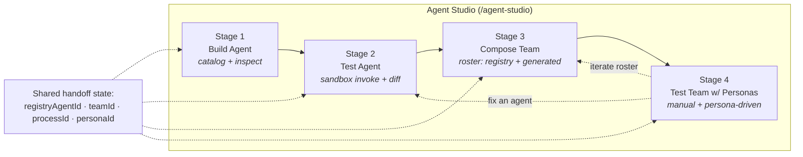
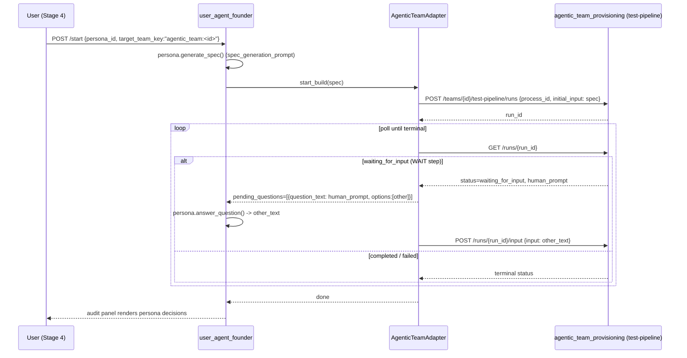

# Agent Studio — UX Redesign Spec

**Status:** Draft for review · **Author:** UX · **Scope:** `/agent-studio` (replaces Agent Console, Agentic Teams, Testing Personas)
**Deliverable type:** Design spec + mockups (no implementation). Grounded against the current codebase so it can be built as-is after approval.

---

## 1. Why this redesign

A user who wants to **build an agent → test it → add it to a team → test the team with personas** must today stitch
together three disconnected surfaces, each with its own mental model of "agent" and "test":

| Surface | Route | What it does | The gap |
|---|---|---|---|
| Agent Console | `/agent-console` | Browse / inspect / run **registry** agents (real, invokable YAML manifests). 7 heavy tabs. | No path to "team". |
| Agentic Teams | `/agentic-teams` | Assemble teams whose rosters are **LLM‑generated descriptors** (`AgenticTeamAgent`, *not* registry agents). Manual chat + pipeline testing. | Roster agents ≠ the agents you built. |
| Testing Personas | `/persona-testing` | Personas that autonomously drive **only** the Software Engineering team (`user_agent_founder`). | Can't reach the team you just assembled. |

Three problems compound: (a) there is **no journey** connecting the surfaces; (b) the **two "agent" models don't
reconcile** (registry `AgentManifest` vs. roster `AgenticTeamAgent`); (c) **personas can't reach assembled teams**.

**The redesign** is a single guided **Agent Studio** that makes the build → test → compose → persona‑test flow
obvious, lets a roster **mix curated registry agents with generated ones**, and lets **any testing persona drive any
assembled team**. It is a clean cutover — the three old surfaces are deleted, not deprecated.

### Design principles
1. **One spine, four stages.** The journey is linear by default, with explicit back‑loops for iteration.
2. **Reuse the working parts.** Catalog, runner, process designer, test panels, and persona dialogs already work — move them into the Studio, don't rebuild them.
3. **No legacy.** No redirects, no "advanced" routes, no dead wrapper shells.
4. **Make the agent identity honest.** A roster entry says where it came from (registry vs generated) and what it can do.

---

## 2. Information architecture

### 2.1 The Studio spine



The Studio maintains a small **handoff state** `{registryAgentId?, teamId?, processId?, personaId?}` via
`AgentStudioStateService` (§2.4) — which the stepper reflects and each stage reads/writes — so each stage pre‑seeds
the next (the agent you just tested is the one offered for the roster; the team you just composed is the default
persona target). This glue is the only genuinely new interaction concept.

**Stepper navigation is forward‑only.** Clicking a previous stage indicator does *not* navigate backward — the
indicators show progress, not links. Iteration happens **primarily** via the explicit Stage‑4 buttons **"fix an agent"**
(→ Stage 2) and **"iterate roster"** (→ Stage 3), and **additionally** via the per‑agent **`Test ▸`** action on
Stage‑3 roster entries (registry agents only — see below). This keeps the journey guided while still allowing controlled
back‑loops.

**Forward‑only must not trap the user on one agent.** Because the stepper never jumps back to Stage 1, picking a
*different* agent after advancing is an explicit **in‑context** action, not backward navigation:

- **Stage 2** and **Stage 3** each expose a **`[ Browse agents ]`** affordance that opens the Stage‑1 catalog
  (browse + filter + inspect drawer, the same `agent-catalog` component) in a slide‑out. Selecting another agent
  there updates `registryAgentId` in the handoff state **without** resetting later‑stage work.
- **What "without resetting later‑stage work" means.** It refers to the *handoff‑state slots* — the Stage‑3 roster
  composition and Stage‑4 team/persona selection are preserved. It does **not** mean the *current* stage keeps stale
  context: when the agent changes **in Stage 2**, the runner resets to the new agent — it clears and re‑fetches that
  agent's run history and re‑warms its sandbox (the transient runner UI is per‑agent, so it must follow the new
  `registryAgentId`).
- In Stage 3, the **`+ Add → Search registry agents`** path is itself a full catalog browser with inspect, so a
  roster can be staffed with agents that were never the "current" `registryAgentId`.
- **Re‑test an agent without going forward first.** A user in Stage 3 who realizes a roster agent needs more testing
  should not have to advance to Stage 4 to reach the "fix an agent" back‑loop. Each roster entry therefore exposes a
  **`Test ▸`** action that opens **that agent in Stage 2** (setting `registryAgentId` to it) — the same back‑loop
  semantics as Stage 4's "fix an agent", available directly from Stage 3. This is still not a *stepper* back‑click;
  it's an explicit per‑agent action, and Stage‑1 remains reachable only via the `Browse agents` overlay.
  **Registry‑only:** `Test ▸` is available **only on `source: registry` entries** (they have a `registryAgentId` /
  manifest the Stage‑2 sandbox can run). On **`generated`** entries it is **hidden** (shown disabled with a tooltip
  *"Generated agents can't be individually sandbox‑tested — test the full team in Stage 4"*), since they have no
  registry manifest to open in Stage 2.

The stepper stays forward‑only (no Stage‑1 stepper click, no confirmation dialog needed); the catalog and the
"test this agent" jump are simply reachable as in‑context actions from the later stages.

### 2.2 Navigation changes (`user-interface/src/app/models/navigation.model.ts`, `agentic-ai` group)

```
BEFORE                              AFTER
  AI Systems                          AI Systems
  Agent Console      ──┐              Agent Studio          ◀ single entry
  Agentic Teams      ──┼─ removed     Deepthought
  Testing Personas   ──┘              Product Delivery      ◀ relocated console tabs
  Deepthought                         Cognition             ◀ relocated console tab
```

### 2.3 Route changes (`app.routes.ts`) — clean cutover, **delete** then **add**

| Action | Route | Note |
|---|---|---|
| **delete** | `/agent-console` | container shell removed |
| **delete** | `/agent-provisioning` | legacy redirect removed |
| **delete** | `/agentic-teams` | container shell removed |
| **delete** | `/persona-testing` | container shell removed |
| **delete** | `/persona-testing/audit/:runId` | moved under Studio |
| **add** | `/agent-studio` | with nested `…/persona-run/:runId` for the live audit view |
| **add** | `/product-delivery` | new home for Backlog / Sprints / Feedback tabs |
| **add** | `/cognition` | new home for the Cognition tab |

The three container shells — `AgentConsoleComponent` (7‑tab), `AgenticTeamDashboardComponent`,
`PersonaTestingDashboardComponent` — are **deleted**. Their useful children are **moved** into the Studio (see §4).
The non‑journey console tabs (Backlog, Sprints, Feedback, Cognition) are **relocated to first‑class routes**, never
parked in a legacy shell; **Provisioning is integrated into Stage 1** (a per‑agent slide‑out, not its own route — see
Stage 1 and §7). After this, nothing routes to the old surfaces.

**Relocated-route UIs (kept deliberately thin — no redesign):**

- **`/product-delivery`** — a minimal `ProductDeliveryComponent` with a simple tabbed layout
  (**Backlog · Sprints · Feedback**) that mounts the existing tab components directly, with no added chrome.
- **`/cognition`** — renders the existing `CognitionTabComponent` as a full-page view, no wrapper chrome.

These routes exist only so the cutover loses no functionality; their internals are unchanged from today's tabs.

### 2.4 Handoff state management

The four-stage handoff is managed by a single **`AgentStudioStateService`**, provided at the **Studio shell**
level (one instance per Studio session). It holds the current `registryAgentId`, `teamId`, `processId`, and
`personaId`.

- **Read/write:** each stage component injects the service; user actions (select an agent, create/select a team,
  pick a process, choose a persona) write to it. The stepper and each next stage **read** it to pre‑seed
  themselves (e.g., Stage 3 offers the Stage‑2 agent as a roster candidate; Stage 4 defaults its target to the
  Stage‑3 team).
- **Persistence:** the service hydrates from / syncs to the server-side **draft API** (see §3.5). The draft is the
  durable source of truth; the service may keep an in‑session `localStorage` cache for unsaved edits, but resume
  across reloads/devices comes from the API, not local storage.
- **Local‑cache vs server‑draft conflict.** When the user **loads** a server draft while the `localStorage` cache
  holds unsaved local edits, the Studio prompts: *"You have unsaved changes — save them first, or discard?"*
  **Save first** flushes the local cache to the current draft (`POST …/drafts`) before hydrating the chosen draft;
  **Discard** clears the local cache and then hydrates. The server draft is never silently overwritten and local
  edits are never silently lost — one of the two is always an explicit choice. Loading never merges the two states.

---

## 3. Stage-by-stage screen specs

Each stage below gives: purpose · wireframe · reused vs new components · the API it calls.

### Stage 1 — Build Agent

**Purpose.** Pick (or inspect) the registry agent you want to work on. Entry point of the journey.

```
┌─ Agent Studio ───────────────────────────────────────────────────────────────┐
│  ① Build ─ ② Test ─ ③ Compose ─ ④ Personas   [ Save draft ]  [ Load draft ▾ ]  │
├────────────────────────────────────────────────────────────────────────────────┤
│  Build an agent                                                                  │
│  ┌─ filters ───────┐   ┌─ catalog grid ───────────────────────────────────────┐ │
│  │ Team    ▾       │   │ ┌─────────────┐ ┌─────────────┐ ┌─────────────┐       │ │
│  │ Tag     ▾       │   │ │ blogging.   │ │ market.      │ │ soc2.        │      │ │
│  │ Search [______] │   │ │  planner    │ │  researcher  │ │  auditor     │      │ │
│  └─────────────────┘   │ │ inputs/outs │ │ inputs/outs  │ │ inputs/outs  │      │ │
│                        │ └─────────────┘ └─────────────┘ └─────────────┘       │ │
│                        └────────────────────────────────────────────────────────┘ │
│  ┌─ inspect drawer (on select) ──────────────────────────────────────────────┐  │
│  │ blogging.planner   [ Provision ▾ ]                  [ Test this agent → ]  │  │
│  │ summary · tags · inputs/outputs schema · cognition tools · anatomy.md      │  │
│  └────────────────────────────────────────────────────────────────────────────┘  │
└────────────────────────────────────────────────────────────────────────────────┘
```

- **Reuse as‑is:** `agent-console/agent-catalog` (browse, filter, inspect drawer; calls `agent-catalog-api.service.ts` → `GET /api/agents`, `/api/agents/{id}`, schema endpoints).
- **Folded in (Provisioning):** the `[ Provision ▾ ]` button in the inspect drawer opens the existing
  `agent-provisioning-dashboard` component in a **slide‑out panel** (modal on narrow viewports), letting the user
  deploy the selected agent to a target environment. The provisioning flow itself is **unchanged** from today's
  Provisioning tab — only its entry point moves here, because provisioning is part of building/deploying an agent.
  - **Adaptation caveat:** the dashboard is a full‑page/tab surface today, so it may need **minor layout adjustments**
    to render in a narrow slide‑out (its core logic and API calls are unchanged). If adaptation is non‑trivial, host
    it via a **thin wrapper component** that mounts the dashboard inside the slide‑out container rather than editing
    the dashboard itself — keeping the reused component intact.
- **Handoff:** selecting an agent sets `registryAgentId`; **"Test this agent →"** advances to Stage 2 pre‑seeded.

### Stage 2 — Test Agent

**Purpose.** Run the selected agent in its sandbox, iterate on inputs, compare runs.

```
┌────────────────────────────────────────────────────────────────────────────────┐
│  ① Build ─ ② Test ─ ③ Compose ─ ④ Personas  agent: blogging.planner  [ Browse ▾ ] │
├──────────────────────────────────┬─────────────────────────────────────────────┤
│  Input                            │  Run history                                 │
│  ┌─ schema form / JSON ─────────┐ │  ● 14:02  run_8f2…   ✓ 3.1s                  │
│  │ topic     [____________]     │ │  ● 13:55  run_7b1…   ✓ 2.8s   [ Compare ⇄ ] │
│  │ audience  [____________]     │ │  ● 13:40  run_5a0…   ✗ error                 │
│  │ …                            │ │                                              │
│  └──────────────────────────────┘ │  Output (run_8f2…)                           │
│  [ Saved inputs ▾ ] [ Save input ]│  ┌─────────────────────────────────────────┐ │
│  [ ▶ Run in sandbox ]             │  │ { "outline": [ … ], "keywords": [ … ] } │ │
│                                    │  └─────────────────────────────────────────┘ │
│                          sandbox: ● WARM                       [ Add to team → ] │
└──────────────────────────────────┴─────────────────────────────────────────────┘
```

- **Reuse as‑is:** `agent-console/agent-runner` (invoke‑in‑sandbox, saved inputs, run history, unified diff) — calls `agent-runner-api.service.ts` → `POST /api/agents/{id}/invoke`, `/runs`, `/saved-inputs`, `/diff`. Highest‑value reuse; near‑leaf component.
- **Sandbox status indicator (`● WARM`):** reuses the **existing** sandbox management in `agent-runner` — no new behavior. States are **COLD** (not initialized), **WARM** (initialized/ready), **HOT** (recently used). The runner warms the sandbox automatically when the agent is selected; the indicator reflects the runner's reported state.
- **Handoff (`Add to team →`):** advances to Stage 3 with the current `registryAgentId` **pre‑selected as a candidate**. The agent is **NOT** automatically added to any roster — the user must add it explicitly via the Stage‑3 roster panel's "+ Add". This prevents accidental roster changes.

### Stage 3 — Compose Team

**Purpose.** Assemble/curate a team: design the process via chat, **and** staff the roster by mixing **registry**
agents (the ones you just built/tested) with **LLM‑generated** suggestions.

```
┌────────────────────────────────────────────────────────────────────────────────┐
│  ① Build ─ ② Test ─ ③ Compose ─ ④ Personas             [ Browse agents ▾ ]       │
│  team: [ Growth Pod ▾ ]   ·   process: [ Content pipeline ▾ ]                     │
├──────────────────────────────────┬─────────────────────────────────────────────┤
│  Process designer (chat)          │  Roster                          [ + Add ▾ ] │
│  ┌──────────────────────────────┐ │  ┌─────────────────────────────────────────┐ │
│  │ ▸ "Design a content pod that │ │  │ ✦ blogging.planner   [registry]   🗑     │ │
│  │   plans, writes, reviews…"   │ │  │   tools: web, draft · role: planning    │ │
│  │ ← proposes steps + agents    │ │  │ ⚙ Writer Agent       [generated]  🗑     │ │
│  └──────────────────────────────┘ │  │   skills: longform, seo                  │ │
│  Process steps (DAG)              │  │ ⚙ Reviewer Agent     [generated]  🗑     │ │
│  [Plan]→[Write]→[Review]→[Publish]│  └─────────────────────────────────────────┘ │
│                                    │  Roster validation:  ✓ fully staffed         │
│         [ + Add ▾ ]  opens:  ( ⌕ Search registry agents… )  |  ( ✨ Suggest via chat )│
│                                                              [ Test this team → ] │
└──────────────────────────────────┴─────────────────────────────────────────────┘
```

- **Reuse as‑is:** `process-designer-chat` (LLM design mode, `@Input() team`). From `agentic-team-dashboard`, reuse the **specific child components** — not the dashboard container/shell, which is deleted (§4): the **team CRUD dialog** (`TeamCreateDialogComponent`), the **process/DAG editor** (`ProcessDagEditorComponent`), and the **roster‑validation panel** (`RosterValidationPanelComponent`), all backed by `agentic-team-api.service.ts`. Where these aren't already standalone components inside the dashboard, they are **extracted from it** during the cutover (the dashboard shell is being deleted regardless).
- **New (one small component): Roster panel.** Lists roster entries with a **`source` badge** (`registry` ✦ / `generated` ⚙) and a delete control. **"+ Add"** offers two paths: **search registry agents** (→ new `POST …/teams/{id}/agents/from-registry`) or **suggest via chat** (existing LLM flow). Deleting calls new `DELETE …/teams/{id}/agents/{agent_name}`.
- **Authorization (roster mutation).** The new `from-registry` / delete endpoints **must enforce authorization** — only a user with the **Team Owner / Admin** role for the given team may add or remove roster agents — reusing the same authz the existing team‑mutation endpoints apply. The middleware detail lives in §5 (item 3); flagged here so the UX never exposes roster edit/delete to unauthorized users.
- **Editing roster entries.** Clicking a roster entry opens a small inline edit form for its **role / skills / tools** (the `AgenticTeamAgent` fields the old team dashboard exposed), persisted via the existing team‑update endpoint — so the capability the deleted `agentic-team-dashboard` shell provided is preserved, not lost in the cutover. **`generated`** entries are fully editable; **`registry`** entries show their manifest‑projected fields read‑only with an "override for this team" toggle, so edits never mutate the source manifest. Re‑running the process designer can also re‑propose roster changes (the chat flow), but inline editing is the direct path.
- **Roster validation — "fully staffed":** a roster is *fully staffed* when **every step in the process DAG has at least one assigned agent**, and each assigned agent has the **skills the step requires** (per the process design). This is exactly the existing logic in `roster_validation.py` (it reads the roster's `skills/capabilities/tools` list fields) — registry agents pass uniformly because the `from-registry` projection fills those fields (see §5 item 3). The `✓ fully staffed` / warning indicator surfaces that module's result; no new validation rules are introduced.
- **Process selection.** A team may define more than one process, so a **process dropdown** sits in the Stage‑3 header beside the team selector (`team: [ Growth Pod ▾ ]  ·  process: [ Content pipeline ▾ ]`); choosing one sets `processId` and drives which DAG the panel renders and validates. When the team has exactly one process it is auto‑selected (the dropdown still shows it, disabled). The Stage‑3 → Stage‑4 handoff uses this currently selected `processId`.
- **Handoff (`Test this team →`):** **enabled only when the roster is fully staffed AND a process is selected.** Clicking it sets `teamId` + `processId` and advances to Stage 4. While disabled, the button shows a **tooltip** listing what's missing (e.g. "step *Review* has no agent" / "select a process").

### Stage 4 — Test Team with Personas

**Purpose.** Validate the assembled team two ways: **manually** (you chat / drive the pipeline) or
**persona‑driven** (a testing persona autonomously drives the team end‑to‑end).

```
┌────────────────────────────────────────────────────────────────────────────────┐
│  ① Build ─── ② Test ─── ③ Compose ─── ④ Personas        team: Growth Pod        │
├────────────────────────────────────────────────────────────────────────────────┤
│  [ Manual testing ]   [ Persona-driven ◀ ]      [ ◂ iterate roster ] [ ◂ fix agent ]│
│                                                                                  │
│  Persona            ┌─ persona library ───────────────┐   [ + New persona ]      │
│  ┌────────────────┐ │ ◎ Startup Founder   (built-in)  │                          │
│  │ Startup Founder│ │ ○ Impatient PM      (custom)    │   target process:        │
│  │ system prompt… │ │ ○ Budget Buyer      (custom)    │   [ Content pipeline ▾ ] │
│  └────────────────┘ └─────────────────────────────────┘   [ ▶ Run persona test ] │
│                                                                                  │
│  Live run (run_a91…)   status: ● waiting_for_input → persona answering…          │
│  ┌─ decisions / transcript ───────────────────────────────────────────────────┐ │
│  │ Q "Which tone for the post?"   → persona: "punchy, founder-voice" (rationale)│ │
│  │ step Plan ✓ → step Write ⧖ …                                                 │ │
│  └────────────────────────────────────────────────────────────────────────────┘ │
└────────────────────────────────────────────────────────────────────────────────┘
```

- **Manual sub‑mode — reuse as‑is:** `agentic-team-test-panel` (composes `agent-test-chat` + `pipeline-test-runner`; drives `…/test-chat/*` and `…/test-pipeline/runs` + `/input`).
- **Persona sub‑mode — reuse as‑is:** `start-test-dialog`, `persona-editor-dialog`, `persona-test-audit-panel` (from the old persona dashboard). The launcher is **pre‑seeded** with the current team as `target_team_key = "agentic_team:<teamId>"`; the agentic team appears in the dropdown automatically once the backend `/testable-teams` change lands (§5). Personas are picked from the library or created inline.
- **Run progress UI (sets expectations for slow autonomous runs).** Because founder poll intervals are 15–30s
  (see §6), the live‑run header shows an **elapsed‑time counter** and, during a `waiting_for_input` WAIT step, an
  animated **"persona is thinking…"** indicator. When the process DAG length is known, a **step progress bar**
  (`step 2 of 4`) renders alongside the transcript; otherwise it falls back to the indeterminate "thinking…" state.
- **Back‑loops:** "iterate roster" → Stage 3; "fix an agent" → Stage 2.

**Returning to Stage 4 after a back‑loop.** A back‑loop simply places the user in the earlier stage; because the
stepper is forward‑only, the user comes back via the **normal forward actions** — "Add to team →" (Stage 2 → 3) and
"Test this team →" (Stage 3 → 4) — not by clicking a stage indicator. This re‑advance is **seamless** because the
handoff state (§2.4) retains `teamId`, `processId`, and `personaId` across the jump: Stage 3 re‑opens on the same
team/process, and Stage 4 re‑seeds the same persona target, so the user only re‑touches what they actually came back
to change. (A "fix an agent" jump that swaps `registryAgentId` likewise leaves `teamId`/`processId`/`personaId`
intact — only the agent in focus changes.)

### 3.5 Drafts & session resume (server‑side)

The Studio header carries two controls — **`[ Save draft ]`** and **`[ Load draft ▾ ]`** — that let a user **save and
resume** an in‑progress journey across reloads and devices. **Persistence is server‑side** (chosen over client‑only
so drafts survive device changes and match the persisted nature of teams/personas):

- **Save** — `[ Save draft ]` issues `POST /api/agent-studio/drafts` with the current handoff state
  (`registryAgentId`, `teamId`, `processId`, `personaId`) **plus** any partial work the stages hold (e.g. Stage‑2
  test inputs, Stage‑3 roster composition not yet committed to a team). Returns a `draft_id` (+ name/updated_at).
  Re‑saving updates in place.
- **Load** — `[ Load draft ▾ ]` opens a dropdown listing the current user's drafts via `GET /api/agent-studio/drafts`;
  selecting one **triggers the conflict check in §2.4** (save‑first / discard prompt if the local cache holds unsaved
  edits), then hydrates `AgentStudioStateService` and jumps the stepper to the furthest reachable stage. (This is the
  UI trigger for that conflict flow.)
- **Scope** — drafts are **scoped to the authenticated user**; one user cannot see another's drafts.

**Draft payload schema** (the request/response body for `POST`/`GET …/drafts`, so frontend and backend agree):

```ts
interface AgentStudioDraft {
  draft_id?: string;          // server-assigned; omitted on first create
  name?: string;              // user label; defaults to a timestamp
  updated_at?: string;        // ISO-8601; server-managed
  // ── handoff state (§2.4) ──
  registryAgentId?: string;
  teamId?: string;
  processId?: string;
  personaId?: string;
  // ── partial per-stage work ──
  stage2Inputs?: {
    savedInputId?: string;                 // if a saved input was selected
    formValues?: Record<string, unknown>;  // unsaved schema-form values
  };
  stage3RosterDraft?: Array<{
    agentName: string;
    source: 'registry' | 'generated';
    manifestId?: string;                   // set when source === 'registry'; same id space as the
                                           // handoff registryAgentId — named to mirror backend manifest_id (§5 item 3)
    role?: string;
    skills?: string[];
  }>;
}
```

All fields except `agentName`/`source` (within a roster entry) are optional — a draft saved at Stage 1 carries only
`registryAgentId`. The server persists the blob verbatim under the user id; it does not interpret stage payloads.

**No `stage4` field — intentional.** Stage 4 has no *unsaved* partial work worth persisting: the chosen persona is
already the handoff `personaId`, and the team/process targets are `teamId`/`processId`. Everything else in Stage 4 is
a **live run** (the manual test‑chat session and the persona‑driven pipeline run), which is **transient and already
durable server‑side under its own `run_id`** — a resumed draft reattaches to an in‑flight/last run by `run_id` rather
than replaying chat state into the draft blob. So drafts deliberately stop at the Stage‑3 roster; Stage‑4 run context
is owned by the run, not the draft.

**Identifier naming.** `registryAgentId` (handoff slot) and a roster entry's `manifestId` refer to the **same**
underlying registry manifest id (backend column `manifest_id`, §5 item 3); they are named differently to reflect
their distinct roles — "the agent in focus" vs. "this entry's own source link" — and to mirror the backend column.

This makes draft persistence a **must‑have backend touchpoint** (see §5, item 4 — Studio drafts). The frontend `AgentStudioStateService`
is the single client owner of draft load/save; a transient `localStorage` cache may hold unsaved edits between
auto‑syncs, but the API is the source of truth.

### 3.6 Loading, empty, and error states

The wireframes above show the happy path; every stage also specifies the three non‑happy states. Where a stage
reuses an existing component, it inherits that component's existing handling — these are conventions, not new UI.

| State | Convention | Per‑stage specifics |
|---|---|---|
| **Loading** | Inline skeleton/spinner in the affected panel (never a full‑page block); the stepper stays interactive. | S1 catalog grid → card skeletons; S2 run → spinner on the output pane + disabled `Run`; S4 live‑run → the Stage 4 elapsed counter + "persona is thinking…". |
| **Empty** | A centered message **with the primary action**, never a bare "no data". | S1 "No agents match these filters — clear filters"; S2 "No runs yet — run the agent to see history"; S3 "Roster is empty — + Add an agent"; S4 "No personas — + New persona". |
| **Error** | A dismissible error banner scoped to the panel, with **Retry** where the action is idempotent; the underlying form/selection is preserved. | S1/S2 catalog & invoke errors reuse `agent-catalog`/`agent-runner` error surfaces (`POST …/invoke` failure → banner + Retry, inputs kept); S3 team/roster mutation failure → banner, optimistic row rolled back; S4 pipeline‑start or poll failure → banner on the run card + Retry, persona/process selection kept. |

Sandbox‑specific failures (COLD→WARM warm‑up error in Stage 2) surface through the runner's existing sandbox‑status
channel (Stage 2) rather than a new code path.

---

## 4. Component reuse map

| Component | Disposition in Studio |
|---|---|
| `agent-console/agent-catalog` | **Move + reuse** → Stage 1 |
| `agent-console/agent-runner` (+ `agent-schema-form`, `agent-run-history`, `agent-diff-dialog`, `save-input-dialog`) | **Move + reuse** → Stage 2 |
| `agent-provisioning-dashboard` | **Move + reuse** → Stage 1 "Provision" affordance |
| `process-designer-chat` | **Move + reuse** → Stage 3 |
| `agentic-team-dashboard` child components — `TeamCreateDialogComponent` (team CRUD), `ProcessDagEditorComponent` (DAG editor), `RosterValidationPanelComponent` (validation) | **Move/extract the children → Stage 3**; the dashboard container shell is **deleted** |
| `agentic-team-test-panel`, `agent-test-chat`, `pipeline-test-runner` | **Move + reuse** → Stage 4 manual |
| `persona-editor-dialog`, `start-test-dialog`, `persona-test-audit-panel` | **Move + reuse** → Stage 4 persona |
| `AgentConsoleComponent` (7‑tab), `AgenticTeamDashboardComponent`, `PersonaTestingDashboardComponent` | **Delete** |
| Backlog / Sprints / Feedback tabs | **Relocate** → `/product-delivery` |
| Cognition tab | **Relocate** → `/cognition` |
| **Studio shell + 4‑stage stepper + handoff state** | **New** (thin) |
| **Roster panel (registry + generated, source badges, add/delete)** | **New** (small) |

Net‑new frontend is intentionally minimal: a shell, a stepper, and one roster panel. Everything load‑bearing exists.

### 4.1 Service dependencies (what the Studio shell must provide)

"Reuse as‑is" only holds if the moved components find the services they expect. Today some are provided by the old
container shells (e.g. `AgentConsoleComponent`); when those shells are deleted, the **Studio shell must re‑provide the
equivalents** (or the component is refactored to inject them directly). The contract:

| Reused component | Services it expects | Provided by |
|---|---|---|
| `agent-catalog` | `AgentCatalogApiService`; plus the catalog filter/selection state it reads from the console shell today — specifically the **selected‑team filter**, **tag filter(s)**, **search query**, and **selected‑agent id**. These move into `AgentStudioStateService` (the selected‑agent id *is* the handoff `registryAgentId`). | Studio shell |
| `agent-runner` (+ schema‑form, run‑history, diff, save‑input dialogs) | `AgentRunnerApiService` (invoke/runs/saved‑inputs/diff) | Studio shell |
| `agent-provisioning-dashboard` | its existing provisioning service(s), unchanged | Studio shell (provided directly, or via the thin slide‑out wrapper component described in the Stage 1 adaptation caveat) |
| `process-designer-chat`, extracted `agentic-team-dashboard` children | `AgenticTeamApiService` | Studio shell |
| Stage‑4 test panels & persona dialogs | `agentic-team-test` + persona/audit services | Studio shell |
| all stages | **new** `AgentStudioStateService` (handoff/draft, §2.4/§3.5) | Studio shell |

**Action for implementation:** before moving each component, confirm its actual injected services (constructor +
template) and ensure the Studio shell's providers cover them; any console‑shell‑scoped state a component relies on
is either re‑provided at the shell or folded into `AgentStudioStateService`. No reused component should depend on a
deleted container.

---

## 5. Backend touchpoints the UX depends on

The UX cannot ship without these. They are additive and grounded against the current code.



**Must‑have:**
1. **Persona → any team — `AgenticTeamAdapter`** (`backend/agents/user_agent_founder/targets/agentic_team.py`, modeled on `targets/software_engineering.py`) implementing the `TargetTeamAdapter` Protocol against the *existing* `POST …/test-pipeline/runs` + `/input` endpoints — **no new provisioning endpoints needed**. A *collapsing adapter*: persona `generate_spec()` → pipeline `initial_input`; each `waiting_for_input` WAIT step → wrapped as a single free‑text question the persona answers via `/input`. Dynamic dispatch in `targets/__init__.py` via `get_adapter("agentic_team:<id>")`.
2. **Testable‑teams enumeration** — `user_agent_founder/api/main.py:list_testable_teams` also lists agentic teams via the cross‑service call **`GET /api/agentic-team-provisioning/teams`** (the unified‑API mount path). **The `list_testable_teams` aggregator applies the "≥1 `complete` process" filter server‑side** (it already composes the response the dropdown consumes), so the frontend receives a ready‑to‑use list and does no filtering. (If the provisioning `teams` endpoint later grows a `process_status` query param, `list_testable_teams` should pass it to avoid over‑fetching, but the filter contract stays server‑side either way.) Without this the persona dropdown is empty.
3. **Registry → roster bridge** — add `source: "generated"|"registry"` + `manifest_id` to `agentic_team_provisioning/models.py:AgenticTeamAgent` (additive, defaulted). New `POST …/teams/{id}/agents/from-registry` (projects an `AgentManifest`'s tags/tools/summary into the roster fields so `roster_validation.py` needs no change) and `DELETE …/teams/{id}/agents/{agent_name}`. **Authorization:** both endpoints mutate a team's roster, so they **must** enforce the same authz as the existing team‑mutation routes — restricted to the team's **Owner/Admin** (reuse the provisioning service's existing team‑permission dependency/middleware; do not ship these unguarded).
4. **Studio drafts — `POST /api/agent-studio/drafts` + `GET /api/agent-studio/drafts`** (see §3.5). User‑scoped persistence of the handoff state + partial work, for save/resume across reloads and devices. New backend surface (new route group + a `agent_studio_drafts` store keyed by user id); no dependency on the other touchpoints. **Authorization:** drafts are **per‑user** — every read/write is scoped to the authenticated user id, and one user can never list or load another's drafts. Required because the header `Save draft` / `Load draft` UX is non‑functional without it.

**Recommended (not required for the UX to ship, but should land alongside it):**

5. Explicit `process_id` column on `user_agent_founder_runs` instead of overloading `repo_path` to carry the chosen process id. Purely a data‑model cleanup — the UX works either way — but doing it with this work avoids cementing the overload. (Tracked as an open decision in §7.)

**Nice‑to‑have (UX works without; flag as follow‑ups):** real registry‑agent invocation inside `pipeline_runner.py` (`source=="registry"` branch — Phase 1 runs them as LLM personas, acceptable for v1); surfacing not‑yet‑rostered registry agents in `recommend_agents_for_step`; faster persona poll interval for agentic runs.

---

## 6. Risks / open questions

- **Phase‑shape impedance** — the founder Protocol assumes 3 phases (spec → analysis → build) with batched
  multiple‑choice questions; an agentic pipeline is a single linear DAG with free‑text WAIT steps. The collapsing
  adapter resolves it (analysis → no‑op pass‑through) but couples the two contracts.
- **Free‑text WAIT vs multiple‑choice persona answers** — persona answering is built for option selection; WAIT
  prompts are open‑ended. Wrapping each as a single `other` option works, but answer quality on open prompts is
  unproven.
- **In‑memory, unbounded WAIT state** in `pipeline_runner.py` (`resume_event.wait()` with no timeout, state held in
  the provisioning process) — a reliability risk for autonomous no‑human persona runs across service restarts.
- **Typed‑IO registry agents in a free‑text DAG** — deepest unknown; scope v1 to Phase‑1 LLM‑persona execution.
- **Persona run timing** — 15–30s founder poll intervals make autonomous runs feel slow; the UI must set
  expectations (progress, "persona is thinking…", elapsed time).

---

## 7. Decisions

**Resolved (review round 2):**
- **Draft persistence → server‑side.** `POST/GET /api/agent-studio/drafts`, user‑scoped, cross‑device (see §3.5, §5 item 4).
- **Relocation homes confirmed:** Provisioning → Stage 1; Backlog/Sprints/Feedback → `/product-delivery`; Cognition → `/cognition`. No legacy routes retained.

**Deferred (explicitly — none block approving this design):**

| # | Question | Disposition | Owner | Resolves at |
|---|---|---|---|---|
| 1 | **High‑fidelity Figma mockups** in addition to these wireframes? | Deferred — these ASCII wireframes are sufficient to approve direction and start the build; Figma is a polish step, not a blocker. | UX lead | Implementation kickoff (Phase 3, §9) |
| 2 | **`process_id` column vs `repo_path` overload** on `user_agent_founder_runs` | Deferred with a standing recommendation: **add the column.** Captured as Recommended item 5 in §5. | Backend lead | The first implementation PR that touches `user_agent_founder_runs` |

Both are tracked here so approval of this spec is not gated on them; each has a named role‑owner and a concrete
point at which it must be decided.

---

## 8. What gets deleted (explicit)

- **Routes:** `/agent-console`, `/agent-provisioning`, `/agentic-teams`, `/persona-testing`, `/persona-testing/audit/:runId`.
- **Nav items:** `Agent Console`, `Agentic Teams`, `Testing Personas`.
- **Container shells:** `AgentConsoleComponent`, `AgenticTeamDashboardComponent`, `PersonaTestingDashboardComponent`.
- **No** redirects, "advanced" aliases, or wrapper components survive the cutover.

---

## 9. Build sequence (post‑approval, for reference)

1. Backend must‑haves (§5 items 1–3) — enables the persona‑drives‑team path end‑to‑end.
2. Studio drafts API (§5 item 4) + `AgentStudioStateService` (§2.4) — the persistence spine the shell builds on.
3. Studio shell + stepper + handoff state; move catalog + runner into Stages 1–2.
4. Compose stage: process designer + new roster panel (registry/generated, add/delete).
5. Persona stage: manual + persona sub‑modes, pre‑seeded launcher, live audit.
6. Integrate Provisioning into Stage 1; relocate Product Delivery and Cognition to new routes; **delete** old routes, nav items, and shells.
7. Verify the happy path (§10) and the 90% coverage floor on new/changed code.

## 10. Verification (of the eventual build)

End‑to‑end happy path, covered by must‑haves only:
**build agent (Stage 1) → test in sandbox (Stage 2) → add that registry agent to a roster + design a process
(Stage 3) → launch a persona test against `agentic_team:<id>` and watch it answer WAIT steps autonomously
(Stage 4)**. Confirm no surviving route/redirect/shell points at the deleted surfaces.
