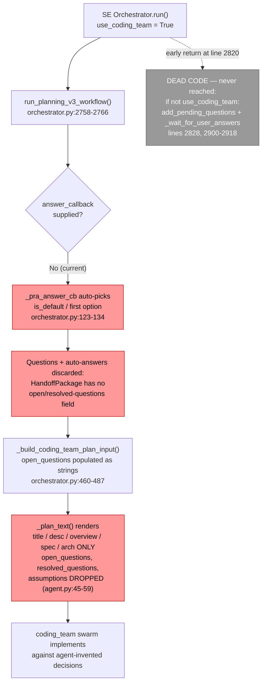
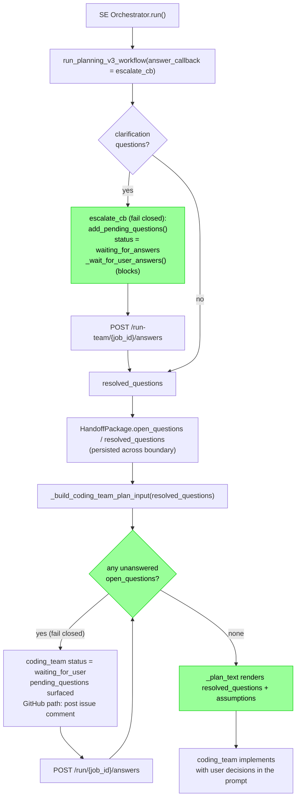
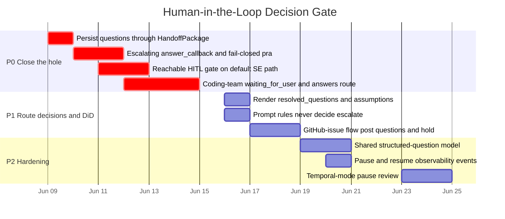

# SPEC-023: Coding Team Human-in-the-Loop Decision Gate

| Field        | Value                                                                 |
|--------------|-----------------------------------------------------------------------|
| **Status**   | Approved (implemented)                                                |
| **Author**   | Platform Engineering                                                  |
| **Created**  | 2026-06-07                                                            |
| **Priority** | P0 (correctness/safety)                                              |
| **Scope**    | Planning V3 → SE orchestrator → Coding Team handoff; SE + Coding Team APIs; agent prompts |

> **Implementation note.** Shipped per the plan with one refinement learned during build: because the SE path invokes Planning V3 with `use_product_analysis=False`, Planning V3 emits no clarification questions there today, so the *active* escalation channel is the coding-team agents (Tech Lead + Senior SWE) raising `open_questions`, plus the `run-from-github` path. The Planning V3 / handoff changes (fail-closed answer resolution via `auto_answer_questions`, `HandoffPackage` question fields) ship as correctness + defense-in-depth for when product analysis is enabled. The blocking wait is thread-mode (the default); Temporal-mode pause semantics remain the deferred item in §7.

---

## 1. Problem Statement

**Product and design decisions must be made by the user, never by an agent.** Today the platform does the opposite: when planning surfaces an open question, the question is silently auto-decided somewhere in the pipeline and implementation proceeds against a choice the user never saw.

This was observed in production: a worker resolved five open product questions on its own — including **allergen-strictness defaults** and **medication-interaction policy** — documented its own choices as if they were requirements, and shipped code against them. These are exactly the decisions that carry product, legal, and safety weight, and they were made by autocomplete.

The failure is **structural, not a prompt slip**. The decision gets auto-made at three independent layers, and the one real pause mechanism that exists is dead code on the active path:

1. **Planning V3 auto-answers its own clarification questions.** `_pra_answer_cb` (`backend/agents/planning_v3_team/orchestrator.py:123-134`) picks the `is_default` option — or the first option — for every pending question whenever no `answer_callback` is supplied. The SE orchestrator supplies none when it invokes planning (`backend/agents/software_engineering_team/orchestrator.py:2758-2766`), so every clarification is auto-answered. The questions and their auto-picked answers are then discarded: `HandoffPackage` (`backend/agents/planning_v3_team/models.py:138-160`) carries no open/resolved-questions field.

2. **The coding team is handed the questions and drops them.** SE's `_build_coding_team_plan_input` (`orchestrator.py:460-487`) does populate `open_questions` / `resolved_questions` / `assumptions` on `CodingTeamPlanInput` (`backend/agents/coding_team/models.py:113-150`). But `_plan_text` (`backend/agents/coding_team/tech_lead_agent/agent.py:45-59`) renders only title, description, overview, spec, and architecture — those three fields are read nowhere in `coding_team`. They are dead inputs.

3. **The existing human-in-the-loop gate is unreachable.** A complete pause mechanism — `add_pending_questions` + `_wait_for_user_answers` + a `waiting_for_answers` status + `POST /run-team/{job_id}/answers` (`backend/agents/software_engineering_team/api/main.py:1289-1296`) — already exists in the SE orchestrator. It lives only inside the `if not use_coding_team:` legacy branch (`orchestrator.py:2828, 2900-2918`). The default `use_coding_team = True` path returns at `orchestrator.py:2820`, before the gate is ever evaluated.

4. **No prompt forbids deciding.** Neither `coding_team/tech_lead_agent/prompts.py:3-5` nor `coding_team/senior_software_engineer_agent/prompts.py:3-13` instructs the agents to escalate decisions rather than invent them. The coding team's API (`coding_team/api/main.py`) has no paused job status and no answers endpoint, so even if an agent wanted to stop and ask, there is nowhere for the answer to come back in.

Left unaddressed, the platform will continue to make unauthorized product decisions silently, and the most consequential decisions (safety, compliance) are the ones most likely to be "filled in" by a model rather than escalated.

---

## 2. Current State

### 2.1 How a decision gets auto-made (default path)

### 2.2 Inventory of the five gaps

| # | Layer | Location | Current behaviour |
|---|-------|----------|-------------------|
| A | Planning V3 auto-answer | `planning_v3_team/orchestrator.py:123-134`, callback param at `:38`, used at `:145` | Auto-picks `is_default` / first option when `answer_callback is None` |
| B | Handoff persistence | `planning_v3_team/models.py:138-160` (`HandoffPackage`) | No `open_questions` / `resolved_questions` field — decisions are not carried across the boundary |
| C | SE → coding-team invocation | `software_engineering_team/orchestrator.py:2758-2766`, `:2801-2820` | Passes no `answer_callback`; default path returns before the HITL gate |
| D | Coding-team render | `coding_team/tech_lead_agent/agent.py:45-59` (`_plan_text`) | Ignores `open_questions`, `resolved_questions`, `assumptions` |
| E | Coding-team API + prompts | `coding_team/api/main.py:81-92` (`StatusResponse`), `:165-182` (`GET /status`); `tech_lead_agent/prompts.py:3-5`; `senior_software_engineer_agent/prompts.py:3-13` | No `waiting_for_user` status, no `pending_questions`, no answers endpoint, no prompt rule to escalate |

### 2.3 Reusable machinery (preserve, do not reinvent)

The legacy SE branch already contains the right primitives — they just need to be made reachable on the default path:

- `add_pending_questions(job_id, structured_questions)` — registers questions on the job.
- `_wait_for_user_answers(job_id)` — blocks the worker until answers arrive or the job fails.
- `waiting_for_answers` job flag + `POST /run-team/{job_id}/answers` (`api/main.py:1289-1296`) — the resume endpoint; rejects with `400` when the job is not waiting.
- `_convert_to_structured_questions(...)` — normalizes raw questions into the structured shape the answers endpoint expects.
- GitHub commenting for the coding team is already wired via `_safe_comment(...)` → `GitHubClient.add_issue_comment(...)` (`coding_team/api/main.py:337-345`); it is currently used for start/PR/failure notices but never for questions.

---

## 3. Goals and Non-Goals

### Goals

- **No agent ever decides a product or design question.** Every clarification is either answered by the user or the job pauses — deterministically, fail-closed, regardless of prompt behaviour.
- A plan containing unanswered open questions **cannot reach implementation**. Job status is visibly paused (`waiting_for_answers` at the SE level, `waiting_for_user` at the coding-team level) until every question has a user-supplied answer.
- User answers are **persisted across the planning → SE → coding-team boundary** and are **threaded into the Tech Lead planning prompt**, visible in the resulting task descriptions.
- Planning V3 **never silently auto-selects an option** on the SE/coding-team path.
- The same guarantee holds on the **standalone coding-team paths** (`POST /run`, `run-from-github`), including posting open questions to the originating GitHub issue and holding the job.
- Defense in depth: Tech Lead and Senior SWE prompts explicitly forbid making product/design decisions and instruct the agents to emit open questions and stop.

### Non-Goals

- **No general-purpose workflow-suspension engine.** We reuse the existing pending-questions/answers machinery; we do not build a new durable suspension framework.
- **No change to how Planning V3 *generates* clarification questions** — only to what happens to them once generated.
- **No new authentication/authorization.** "User-supplied answer" means the existing answers endpoint; identity is out of scope.
- **No UI redesign** beyond surfacing pending questions and accepting answers through the existing job-status surface.
- **Auto-default answering is not retained behind a flag.** The default first-option behaviour is the bug; it is removed on the SE/coding-team path, not made opt-in. (Planning V3's standalone callers that intentionally pass their own `answer_callback` are unaffected.)

---

## 4. Detailed Design

The fix is a **deterministic decision gate that fails closed**: the decision to proceed is made by code checking for unanswered questions, not by an LLM judging whether it can proceed. Work is grouped P0 (close the silent-decision hole) → P1 (route real decisions to the implementer + defense in depth) → P2 (hardening).

### 4.0 Target flow

### 4.1 P0 — Close the silent-decision hole

#### 4.1.1 Stop Planning V3 from auto-answering on the SE path

**Files**: `software_engineering_team/orchestrator.py` (invocation at `:2758-2766`), `planning_v3_team/orchestrator.py` (`_pra_answer_cb` at `:123-134`).

- SE passes an **escalating `answer_callback`** into `run_planning_v3_workflow(...)` instead of `None`. The callback does not decide — it registers the questions as pending, transitions the job to `waiting_for_answers`, blocks via `_wait_for_user_answers(job_id)`, and on resume maps each user answer to Planning V3's expected `{"question_id", "selected_option_id"}` shape (including custom "other" text).
- Harden `_pra_answer_cb` against the no-callback case so the SE/coding-team path can never silently default: when invoked without an escalating callback, it must **raise** (fail closed) rather than auto-pick. Standalone Planning V3 callers that legitimately want defaults pass an explicit auto-answer callback; the absence of a callback is treated as a programming error on a gated path, not a license to choose.

> **Contract — `escalate_cb(questions) -> answers`**
> - **Preconditions**: `questions` is a non-empty list of structured questions, each with a stable `id` and zero-or-more `options`; the owning `job_id` is in a running state with an answers endpoint reachable.
> - **Postconditions**: returns one answer per input question, each citing a user-supplied `selected_option_id` (or custom text); **never** fabricates or defaults an answer. Between call and return the job is observably `waiting_for_answers`.
> - **Invariant**: no element of the returned list originates from anything other than a user submission.

#### 4.1.2 Persist questions through the handoff

**File**: `planning_v3_team/models.py:138-160` (`HandoffPackage`).

- Add `open_questions: List[...] = Field(default_factory=list)` and `resolved_questions: List[...] = Field(default_factory=list)` to `HandoffPackage`, and populate them from the workflow so the planning result the SE adapter consumes carries both the unanswered and the user-answered set. This makes the SE adapter's existing `getattr(adapter_result, "open_questions", ...)` read (`orchestrator.py:466`) load-bearing instead of incidental, and lets `resolved_questions` flow into `_build_coding_team_plan_input`'s existing `resolved_questions` parameter.

#### 4.1.3 Make the HITL gate reachable on the default path

**File**: `software_engineering_team/orchestrator.py:2801-2820`.

- Lift the pause/answers gate out of the `if not use_coding_team:` legacy branch so it runs on the **default** `use_coding_team = True` path, **before** `run_coding_team_orchestrator(...)` is invoked. Concretely: after planning resolves, if any open question remains unanswered, `add_pending_questions(...)` → `waiting_for_answers` → `_wait_for_user_answers(...)`; only once every question is answered does SE build the plan input (passing the resolved answers via the existing `resolved_questions_override`) and start the coding team.
- The early `return` at `:2820` stays, but is now downstream of the gate.

#### 4.1.4 Coding-team hard pause (deterministic, fail-closed)

**Files**: `coding_team/orchestrator.py`, `coding_team/api/main.py:81-92` / `:165-182`, `coding_team/models.py`.

- Before the Tech Lead's first LLM call (task-graph generation), the coding-team orchestrator performs a **deterministic precondition check**: if `plan_input.open_questions` is non-empty and not covered by `resolved_questions`, it must **not** proceed. It transitions the job to a new `waiting_for_user` status, records the unanswered questions on a new `pending_questions` job field, and stops.
- Add a `waiting_for_user` status and `pending_questions: List[...]` to `StatusResponse` (`api/main.py:81-92`) and the job model, and a `POST /run/{job_id}/answers` route mirroring the SE answers endpoint (reject with `400` when the job is not waiting). On answer submission the job's `resolved_questions` are filled and execution resumes.

> **Contract — coding-team decision gate (`_require_answered_questions(plan_input)`)**
> - **Preconditions**: `plan_input` is a validated `CodingTeamPlanInput`; `open_questions` and `resolved_questions` are populated by the caller.
> - **Postconditions**: returns normally **iff** every open question has a matching resolved answer; otherwise raises/returns a pause signal and the job is left in `waiting_for_user` with `pending_questions` set. No LLM call is made on the pause path.
> - **Invariant**: the swarm loop is never entered while an unanswered open question exists.

This is the load-bearing guarantee: it is a code check on data, independent of whether any prompt told an agent to behave.

### 4.2 P1 — Route real decisions to the implementer + defense in depth

#### 4.2.1 Render user decisions into the plan text

**File**: `coding_team/tech_lead_agent/agent.py:45-59` (`_plan_text`).

- Append `resolved_questions` (each as *question → user-chosen answer*) and `assumptions` to the text block the Tech Lead LLM receives, so the user's decisions actually shape the task graph and appear in resulting task descriptions. `open_questions` are **not** rendered as something to plan around — by the time `_plan_text` runs, the gate (§4.1.4) guarantees there are no unanswered ones.

#### 4.2.2 Prompt rules: never decide, escalate instead

**Files**: `coding_team/tech_lead_agent/prompts.py:3-5`, `coding_team/senior_software_engineer_agent/prompts.py:3-13`.

- Add an explicit rule to both system prompts: **never make a product, design, policy, or safety decision; if a required decision is missing, emit it as an open question and stop — do not assume, default, or invent.** This is defense in depth layered on top of the structural gate; the gate, not the prompt, is the guarantee.

#### 4.2.3 GitHub-issue flow

**File**: `coding_team/api/main.py` (GitHub hook; commenting via `_safe_comment` at `:337-345`).

- When a job started from a GitHub issue pauses with open questions, post them as a single issue comment (reusing `_safe_comment` → `add_issue_comment`) and hold the job in `waiting_for_user`. Answers arrive through the coding-team answers endpoint (§4.1.4); the comment states how to supply them. The job does not proceed to implementation until answered.

### 4.3 P2 — Hardening

- **4.3.1 Shared structured-question model.** `CodingTeamPlanInput.open_questions` is currently `List[str]` (`models.py`), which loses the option set and IDs needed for clean round-tripping. Promote open/resolved questions to a small shared structured shape (id, prompt, options, selected answer) reused by SE and the coding team so answers map deterministically rather than by string-matching.
- **4.3.2 Observability.** Emit a structured event whenever a job pauses for a decision (team, job_id, question count) and when it resumes, so paused jobs are visible in operational dashboards rather than looking stalled.
- **4.3.3 Temporal-mode review.** In Temporal mode the planning step runs inside an activity; a long block in `escalate_cb`/`_wait_for_user_answers` must cooperate with activity heartbeating (and ideally a signal-based resume). Confirm the pause survives the existing heartbeat mechanism, or gate the blocking-wait behind the thread-mode path with a Temporal-native equivalent. (Design note; thread mode is the default and is covered by P0.)

---

## 5. Rollout Plan

### Phase P0 — Close the silent-decision hole (must land together)
- [ ] Add `open_questions` / `resolved_questions` to `HandoffPackage` and populate them from the Planning V3 workflow.
- [ ] SE passes an escalating `answer_callback` into Planning V3; `_pra_answer_cb` fails closed (raises) when no callback is supplied on a gated path.
- [ ] Lift the `add_pending_questions` / `_wait_for_user_answers` gate onto the default `use_coding_team = True` path, before the coding team is invoked.
- [ ] Coding-team deterministic gate: non-empty unanswered `open_questions` ⇒ `waiting_for_user`; add `pending_questions` field + `POST /run/{job_id}/answers`.

### Phase P1 — Route decisions to the implementer + defense in depth
- [ ] Render `resolved_questions` + `assumptions` in `_plan_text`.
- [ ] Add "never decide, emit open questions and stop" rules to Tech Lead + Senior SWE prompts.
- [ ] GitHub flow posts open questions as an issue comment and holds the job until answered.

### Phase P2 — Hardening
- [ ] Promote open/resolved questions to a shared structured model across SE and the coding team.
- [ ] Emit pause/resume observability events.
- [ ] Review and confirm pause semantics under Temporal mode.

---

## 6. Verification

Each acceptance criterion maps to a concrete check.

| Check | Method | Expected result |
|-------|--------|-----------------|
| Plan with open questions cannot reach implementation | Regression test: `CodingTeamPlanInput` with non-empty `open_questions` and no `resolved_questions`, run orchestrator with a call-counting stub LLM | Job ends in `waiting_for_user`; **zero** LLM calls made; no task graph produced |
| Pause is visible | `GET /status/{job_id}` while paused (SE and coding-team) | Status is `waiting_for_answers` (SE) / `waiting_for_user` (coding team); `pending_questions` populated |
| Answers resume and complete | Same test: submit answers via the answers endpoint | Job leaves the paused state, proceeds, and completes |
| Decisions reach the Tech Lead | Capture the Tech Lead prompt (`_plan_text` output) after answering | `resolved_questions` (question → user answer) and `assumptions` present in the prompt and in resulting task descriptions |
| Planning V3 never auto-selects on the gated path | Unit test: invoke Planning V3 via the SE path with pending questions and no user answers | No option auto-picked; job pauses (no silent default) |
| `_pra_answer_cb` fails closed | Unit test: call with no `answer_callback` on a gated path | Raises rather than returning a defaulted answer |
| Questions survive the handoff | Unit test: round-trip `HandoffPackage` → SE adapter → `CodingTeamPlanInput` | `open_questions` / `resolved_questions` preserved end-to-end |
| GitHub flow holds for answers | Integration test with a stub GitHub client | Open questions posted as one issue comment; job held in `waiting_for_user` until answered |
| Prompt rules present | Inspect `tech_lead_agent/prompts.py` and `senior_software_engineer_agent/prompts.py` | Both contain an explicit "never decide / escalate open questions" rule |
| Coverage | `pytest --cov` on changed modules | ≥ 90% line coverage on new/modified code |

---

## 7. Risks and Open Questions

- **Blocking inside Planning V3.** The escalating `answer_callback` blocks the planning worker until answers arrive. In thread mode this is acceptable; in Temporal mode it must cooperate with activity heartbeating (see §4.3.3). Decision: ship P0 for thread mode (the default), confirm Temporal behaviour before relying on it there.
- **Two gates or one.** The SE-level gate (§4.1.3) and the coding-team gate (§4.1.4) overlap for the default path. Both are retained deliberately: the coding-team gate is the fail-closed backstop that also protects the standalone `POST /run` and `run-from-github` entry points, which never pass through SE. The SE gate catches questions earlier (during planning) for a better UX.
- **Question identity / round-tripping.** Until P2.3, `open_questions` are strings and answers are matched loosely. The deterministic gate keys off "is this question answered?", so the conservative failure mode is *pausing again* (safe) rather than proceeding on a mismatch (unsafe).
- **Backlog of legacy auto-answered runs.** This spec changes behaviour going forward; it does not retroactively flag past runs whose decisions were agent-made.
