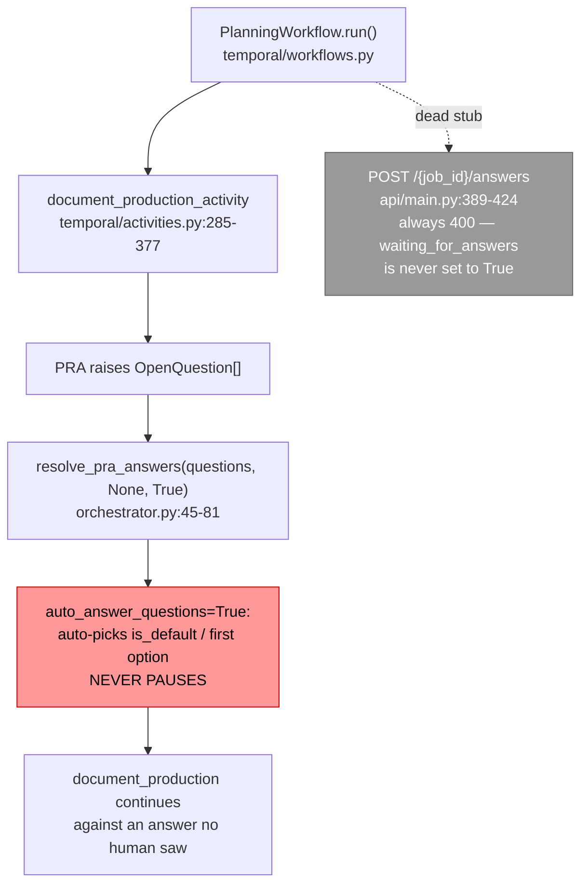

# SPEC-024: Planning Team Clarification-Question Temporal Signal/Wait Contract

| Field        | Value                                                                 |
|--------------|-----------------------------------------------------------------------|
| **Status**   | Proposed (design only — no production code in this story)             |
| **Author**   | Platform Engineering                                                  |
| **Created**  | 2026-08-29                                                            |
| **Priority** | P0 (blocks #7445-B / #7445-C)                                         |
| **Scope**    | `planning_team` Temporal workflow/activity boundary only; defines the contract, does not implement it |

> **Story note.** This spec is the output of issue #7451, the first story in the #7445 sequence
> ("Add a Temporal-durable answer-callback primitive for Planning clarification questions"). Its
> acceptance criteria require a written interface spec and explicitly forbid merging production
> code in this story. #7445-B implements the primitive this document defines; #7446 wires it into
> `temporal/activities.py`.

---

## 1. Problem Statement

`planning_team` can surface clarification questions (`OpenQuestion` /
`backend/agents/planning_team/models.py:216-244`) but has no way to actually pause a running job
and wait for a human to answer one. `resolve_pra_answers()`
(`backend/agents/planning_team/orchestrator.py:45-81`) always auto-picks the `is_default` (or
first) option whenever no `answer_callback` is supplied — and every call site, in both thread mode
(`orchestrator.py` `run_workflow`) and Temporal mode (`temporal/activities.py:320-324`,
`document_production_activity`), calls it with `auto_answer_questions=True` and no callback. A
stub answers route already exists (`api/main.py:389-424`, `POST /{job_id}/answers`) but always
returns `400`, because nothing ever sets `waiting_for_answers=True` on a Planning job record.

Temporal activities cannot natively suspend mid-execution for an arbitrary human response time —
only a *workflow* can await a signal. So before any implementation work starts, this story fixes
the shape of the solution: what the activity returns when it needs input, what the workflow waits
on, what the human's answer looks like on the wire, and how re-invocation is made idempotent.

The coding team already solved this exact problem for its own Tech-Lead clarification loop
(`SPEC-023-coding-team-human-in-the-loop.md`, `backend/agents/software_engineering_team/hitl.py`,
`pause_cycle.py`, `temporal/coding_team_workflow.py`). SPEC-023 §4.3.3 and §7 explicitly deferred
Planning's Temporal-mode pause semantics as future work. This spec is that follow-up, and its
central design decision is: **reuse that pattern verbatim rather than inventing a second one.**

---

## 2. Current State



`PlanningWorkflow` (`temporal/workflows.py`) is a plain sequential chain of
`workflow.execute_activity` calls — intake → discovery → requirements → optional market_research →
synthesis → **document_production** → sub_agent_provisioning → finalize. No `@workflow.signal`, no
`workflow.wait_condition` exists anywhere in it today.

### Reusable machinery (preserve, do not reinvent)

- `_ActivityPauseSignal` (`pause_cycle.py:36-74`) — internal exception carrying
  `{resume_token, pause_kind, pause_context, pending_questions}`, unwound at the orchestrator
  boundary into a `{"outcome": "paused", ...}` return value.
- `mint_resume_token(job_id)` (`pause_cycle.py:77-92`) — `f"{job_id}:{uuid4().hex[:12]}"`, minted
  once per pause round.
- `_check_pending_pause_reentry(job_data, acknowledged_resume_token)`
  (`pause_cycle.py:142-177`) — classifies a re-invocation as `consume=True` (token matches →
  resume) or `consume=False` (token missing/mismatched → activity retry, re-emit the same paused
  payload, do no new work).
- `submit_answers` signal (`temporal/coding_team_workflow.py:282-348`) — name, payload shape, and
  the buffering state machine (`_active_resume_token`, `_submitted_answers`,
  `_buffered_signals`) on `CodingTeamWorkflow`.
- `backend/shared/hitl/models.py` — `PendingQuestion`, `QuestionOption`, `AnswerSubmission`,
  `SubmitAnswersRequest`: the team-agnostic superset schemas, already built for exactly this kind
  of cross-team reuse.

---

## 3. Goals and Non-Goals

**Goals**
- Define the Temporal signal name and payload for delivering a human's answers to a Planning
  clarification question.
- State unambiguously which side (workflow vs. activity) owns the wait, and why.
- Define the retry/continuation shape when a clarification question is raised mid-activity.
- State explicitly how this reuses `hitl.py`/`pause_cycle.py` rather than diverging from it.
- Define Preconditions/Postconditions/Invariants the eventual primitive (#7445-B) must satisfy.

**Non-Goals** (deferred to later stories)
- Implementing the mechanism (#7445-B).
- Wiring `document_production_activity` / `resolve_pra_answers` to actually use it (#7446).
- Thread-mode (non-Temporal) pause behavior — `shared/temporal/checkpoints.py`'s `wait_for_input`/
  `submit_input` already cover that path per `shared/temporal/README.md`; this spec covers only
  the Temporal-native signal.
- UI/REST surface changes beyond noting that the existing `SubmitAnswersRequest.resume_token`
  field already accommodates this contract.

---

## 4. Detailed Design

### 4.1 Signal name and payload

Reuse the coding team's signal **verbatim** — same name, same shape:

```python
@workflow.signal(name="submit_answers")
def submit_answers(self, payload: dict[str, Any]) -> None:
    ...
```

Payload: `{"resume_token": str, "answers": list[dict]}`, where each `answers` element is
`AnswerSubmission`-shaped (`backend/shared/hitl/models.py:70-77`):
`{"question_id": str, "selected_option_id": Optional[str], "other_text": Optional[str]}`.

**Why the same name, not `planning_submit_answers` or similar:** `backend/shared/hitl/models.py`
was deliberately built as a cross-team superset so both teams share one vocabulary. A single
signal name across teams means any future workflow that hosts both a coding-team-style gate and a
planning-style gate (SPEC-023 §4.3.3 flags `RunTeamWorkflowV2` as exactly this case) needs no
signal-name disambiguation. Each `PlanningWorkflow` instance is its own Temporal workflow run, so
there is no name collision risk within one workflow's signal namespace — reuse costs nothing here.

The activity's paused-return payload, symmetric with the coding team's:

```python
{
    "outcome": "paused",
    "job_id": str,
    "resume_token": str,               # mint_resume_token(job_id)
    "pause_kind": "planning_clarification",
    "pause_context": None,             # Planning has one clarification gate per job, no per-task
                                        # sub-context analogous to coding-team worker escalation
    "pending_questions": [...],        # PendingQuestion-shaped dicts, converted from OpenQuestion
}
```

`pause_kind` is a **new** value (`"planning_clarification"`), not one of the coding team's three
(`entry` / `tech_lead_clarify` / `worker_escalation`) — Planning has exactly one clarification
gate (the `document_production_activity` phase where PRA raises questions), so one kind is
sufficient; it need not fit the coding team's per-source taxonomy. `pause_context` is `None`
because Planning has no sub-task identifier equivalent to the coding team's `task_ids` — the whole
job is what's paused.

### 4.2 Which side owns the wait

**The workflow (`PlanningWorkflow`) owns `workflow.wait_condition`.** Activities cannot pause —
`document_production_activity` must return promptly with the `outcome: "paused"` dict the moment
PRA reports unanswered questions, exactly as `run_pipeline_activity` does today
(`temporal/coding_team_workflow.py:105-247`).

`PlanningWorkflow` gains the same three instance fields as `CodingTeamWorkflow`
(`temporal/coding_team_workflow.py:277-280`):

```python
self._active_resume_token: str | None = None
self._submitted_answers: list[dict[str, Any]] | None = None
self._buffered_signals: dict[str, list[dict[str, Any]]] = {}
```

and the identical signal-handler rules (`temporal/coding_team_workflow.py:282-348`):
- No active pause yet → buffer the payload under its own `resume_token` in `_buffered_signals`
  (an early signal beat the workflow arming the wait).
- Active pause but token mismatch → ignore (stale/duplicate).
- Active pause, matching token, first submission → set `_submitted_answers` (the sole
  `wait_condition` predicate).
- Arming a new pause consumes any matching buffered entry immediately and discards every other
  buffered entry (bounds memory across pause rounds).

This is a **copy, not a redesign** — the state machine is proven (see the integration tests listed
in §6) and Planning's clarification gate has no property that would require a different one.

### 4.3 Retry/continuation shape

`PlanningWorkflow.run` wraps the `document_production_activity` call in the same loop shape as
`CodingTeamWorkflow.run` (`temporal/coding_team_workflow.py:546-579`):

```python
while result.get("outcome") == "paused":
    self._active_resume_token = resume_token
    self._submitted_answers = self._buffered_signals.pop(resume_token, None)
    self._buffered_signals.clear()
    await workflow.wait_condition(lambda: self._submitted_answers is not None)
    request["acknowledged_resume_token"] = self._active_resume_token
    self._submitted_answers = None
    self._active_resume_token = None
    result = await workflow.execute_activity(
        document_production_activity, request, start_to_close_timeout=activity_timeout
    )
    request.pop("acknowledged_resume_token", None)
```

`document_production_activity` becomes idempotent on re-entry using
`_check_pending_pause_reentry` (`pause_cycle.py:142-177`) unchanged:
- No persisted pause on the job record → proceed normally.
- `acknowledged_resume_token` matches the persisted token → genuine resume; clear the pause
  envelope, apply the now-answered questions via `resolve_pra_answers(..., answer_callback=<from
  job record>)`, and continue past the point PRA raised them.
- Token missing/mismatched but a pause is persisted → this is a pre-work activity retry (e.g.
  Temporal retried the activity after it persisted-but-not-yet-returned the pause); re-emit the
  exact same `{"outcome": "paused", ...}` payload unchanged, doing no new PRA work.

**Answers must be persisted before the signal, not carried by it.** The `submit_answers` payload
(§4.1) is the *wake-up*, not the sole record of the answer — mirroring
`coding_team_hitl.submit_pending_answers` (`api/routes/coding_team_hitl.py:20-71`) exactly: that
route calls `_main.store_append_submitted_answers(job_id, answers)` (persisting the validated
`AnswerSubmission` list to the job record) *before* it calls `signal_workflow_sync(..., "submit_answers",
{"resume_token": resume_token, "answers": answers})`. The workflow-side loop in this section
deliberately drops `self._submitted_answers` after `wait_condition` returns (it only forwards
`acknowledged_resume_token`, matching `CodingTeamWorkflow.run` field-for-field) — the resumed
activity is expected to read the answers back from the job record, not from the signal payload.
Planning's answer-submission path (whatever replaces the currently-stubbed `POST
/{job_id}/answers`, `api/main.py:389-424`) MUST perform the same "persist-then-signal" write —
appending to a `submitted_answers` job-record field — before delivering the `submit_answers`
signal; this is a required part of the contract, not an implementation detail #7445-B is free to
skip. Without it, `resolve_pra_answers(..., answer_callback=<from job record>)` on resume has
nothing to read and the resume path silently regresses to auto-answering.

**Recommended extraction (decision for #7445-B, not mandated here):** `mint_resume_token` and
`_check_pending_pause_reentry` have no coding-team-specific logic — they operate purely on a job
record dict and a resume token. #7445-B should consider extracting them from
`software_engineering_team/pause_cycle.py` into a new `backend/shared/hitl/pause_cycle.py`
(alongside the existing `shared/hitl/models.py`), so Planning **imports** the primitive rather than
duplicating it or reaching across team boundaries into `software_engineering_team`. This spec does
not mandate the extraction's exact shape — only that Planning's implementation must not diverge in
behavior from what's documented in §4.4 below, however the code ends up organized.

### 4.3.1 Checkpointing the external PRA run before pausing

The coding team's pause cycle unwinds a stack frame entirely internal to the activity's own
process — nothing external needs to be told "this is still the same run." Planning's clarification
gate is different: `document_production_activity` → `run_document_production` →
`DocumentProductionAgent.run` (`agents/document_production/agent.py:91-94`) calls
`job_id = run_pra(repo_path=..., spec_content=...)` to **submit a new external Product Requirements
Analysis job**, then `wait_pra(job_id=job_id, answer_callback=...)` polls it. If
`document_production_activity` is simply re-invoked from the top on resume — the way
`run_pipeline_activity` is for the coding team — it re-executes `run_document_production` from
scratch, which calls `run_pra(...)` again: a **second** external PRA job is submitted, the
original (already-answered) PRA job is stranded, and PRA-side side effects are duplicated. This is
a real gap the coding-team pattern does not have to solve and this contract must.

**Contract requirement:** before the activity unwinds via the pause signal (§4.1), it must persist
a checkpoint carrying the external PRA job id, in the **same atomic job-record update** as the
pause envelope — not as two sequential writes. `shared/temporal/checkpoints.py`'s `save_checkpoint`
(`shared/temporal/README.md` §"Checkpoints and human-in-the-loop") issues its own independent
`update_job` call, so calling it separately from (even immediately before) the pause-envelope write
is **not** sufficient: a process death between the two writes leaves the PRA job checkpointed but
`waiting_for_answers` still `False`, and `_check_pending_pause_reentry` reads that as "no persisted
pause → proceed normally" — the pause is silently dropped and the checkpoint stranded. The contract
therefore requires the checkpoint's `checkpoints` field to be included in the exact same
`update_job(...)` call that writes `waiting_for_answers`/`resume_token`/`pause_kind`/
`pause_context`/`pending_questions` (§5), e.g. (illustrative, not the literal call —
`save_checkpoint`'s own separate-write form must not be used here):

```python
mgr.update_job(
    planning_job_id,
    checkpoints={"document_production_pra": {"payload": {"pra_job_id": pra_job_id}, ...}},
    waiting_for_answers=True,
    resume_token=resume_token,
    pause_kind="planning_clarification",
    pause_context=None,
    pending_questions=pending_questions,
)
```

Note the two distinct ids: `planning_job_id` (the Planning job this activity/workflow is running
for — what `job_id`/`load_checkpoint`/`save_checkpoint` key on) and `pra_job_id` (the external PRA
job id returned by `run_pra(...)`, carried only inside the checkpoint payload). The checkpoint must
be read via the Planning job-store's own team namespace, `"planning_team"` — matching
`get_job_service_client(team="planning_team")` in `planning_team/shared/job_store.py:25` — **not**
`"planning"`; using the wrong team argument addresses a different job-service partition and the
checkpoint would never be visible from the Planning job record `load_checkpoint` reads on resume.

On resume, `document_production_activity` must `load_checkpoint("planning_team", planning_job_id,
"document_production_pra")` and, when a checkpoint is present, call `wait_pra(job_id=<checkpointed
pra_job_id>, answer_callback=...)` directly — **never** call `run_pra(...)` again for a resumed
run. This requires `run_document_production` / `DocumentProductionAgent.run` to accept an optional
pre-existing PRA `job_id` and skip submission when one is supplied (implementation shape for
#7445-B; the contract here is only that resubmission must not happen).

**Postcondition this adds to §5:** a resumed `document_production_activity` invocation must reuse
the checkpointed external PRA job id (read from the `"planning_team"` namespace) and must not call
`run_pra` a second time for the same clarification round; the checkpoint and the pause envelope
must land in one atomic job-record update, never two sequential ones.

### 4.4 Explicit hitl.py / pause_cycle.py reuse statement

This design reuses, unmodified in behavior:
- The `_ActivityPauseSignal`-style unwind: an internal control-flow signal raised deep inside the
  document-production call path, caught at the activity function's own boundary and translated
  into the `{"outcome": "paused", ...}` return value — never propagated further.
- `mint_resume_token`'s exact format and one-mint-per-pause-round rule.
- `_check_pending_pause_reentry`'s three-way classification (no pause / consume / re-emit
  unchanged).
- The job-record pause envelope field names: `waiting_for_answers`, `resume_token`, `pause_kind`,
  `pause_context`, `pending_questions` — Planning's job store (`job_store.py:45-46`) already seeds
  `pending_questions: []` and `waiting_for_answers: False` on every record, so no new fields are
  needed, only new writers.
- The `submit_answers` signal name and payload shape (§4.1).
- The workflow-side wait/buffer state machine (§4.2), copied field-for-field.
- The persist-then-signal answer-submission pattern from
  `coding_team_hitl.submit_pending_answers` (`api/routes/coding_team_hitl.py:20-71`): append
  validated answers to the job record, then signal — never the reverse, never signal-only (§4.3).

The only Planning-specific pieces are:
1. **Which activity calls the pause cycle** — `document_production_activity`
   (`temporal/activities.py:285-377`) instead of the coding team's planning/execution activities.
2. **The question source feeding it** — `OpenQuestion` / `resolve_pra_answers`
   (`planning_team/orchestrator.py:45-81`, `planning_team/models.py:216-244`) instead of Tech Lead
   clarify / worker escalation. `OpenQuestion` → `PendingQuestion` conversion is a straightforward
   field mapping (both already share `id`/`question_text`/`context`/`options` shapes); this is
   implementation detail for #7445-B, not a contract decision.
3. **One new `pause_kind` value** (`"planning_clarification"`) rather than reusing one of the
   coding team's three — see §4.1's rationale.
4. **An added external-job checkpoint** (§4.3.1): the coding team's pause has no equivalent,
   because its pause boundary never crosses into a separate external job. Planning's does (PRA), so
   this contract adds `save_checkpoint`/`load_checkpoint` (`shared/temporal/checkpoints.py`) around
   the PRA job id specifically to prevent resubmission on resume. This is a genuine addition to the
   coding-team pattern, not a divergence from it — it uses machinery the platform already documents
   as the sanctioned tool for exactly this ("phase boundaries inside an activity so a retried
   workflow can skip completed phases").

No divergent mechanism is introduced anywhere in this design.

---

## 5. Contract: Preconditions / Postconditions / Invariants

The primitive #7445-B builds must satisfy:

**`document_production_activity` (paused-return path)**
- *Preconditions:* Called with a `request` dict optionally carrying `acknowledged_resume_token`;
  the job record for `request["job_id"]` is readable.
- *Postconditions:* If PRA raises unanswered `OpenQuestion`s and no matching persisted pause is
  being resumed, the activity persists `{waiting_for_answers: True, resume_token, pause_kind:
  "planning_clarification", pause_context: None, pending_questions, checkpoints:
  {"document_production_pra": {"payload": {"pra_job_id": ...}}}}` to the `"planning_team"`-namespaced
  job record in **one** atomic `update_job` call (§4.3.1 — the checkpoint and the pause envelope
  are never two sequential writes), then returns (does not raise) `{"outcome": "paused", "job_id",
  "resume_token", "pause_kind", "pause_context", "pending_questions"}` — no further job-store read
  or blocking call past that point.
- *Invariants:* The activity never blocks waiting for a human answer. It is safe to call multiple
  times for the same `job_id`/pause round: a call that finds a persisted pause whose token does not
  match `acknowledged_resume_token` re-emits the same paused payload unchanged, performing no new
  PRA work and no duplicate persistence.

**`document_production_activity` (resume path)**
- *Preconditions:* `request["acknowledged_resume_token"]` equals the job record's persisted
  `resume_token`; the job record's `submitted_answers` (persisted by the answer-submission path
  *before* it signaled — §4.3) cover every question in `pending_questions`; a PRA-job-id checkpoint
  for this clarification round is present (§4.3.1).
- *Postconditions:* The pause envelope (`waiting_for_answers`, `resume_token`, `pause_kind`,
  `pause_context`, `pending_questions`) is atomically cleared from the job record; PRA continues
  past the clarification point using the job record's persisted `submitted_answers` (never the
  signal payload directly) fed through `resolve_pra_answers(..., answer_callback=<from job
  record>)`; `wait_pra` is resumed against the checkpointed external PRA job id — `run_pra` is not
  called again; the activity proceeds to its normal terminal return shape.
- *Invariants:* A resume is applied at most once per `resume_token` — re-invocation with the same
  already-consumed token must not re-apply answers or re-run already-completed work (idempotent
  resume). No resume path may submit a second external PRA job for the same clarification round.

**`PlanningWorkflow.submit_answers` (signal handler)**
- *Preconditions:* None on the caller — a signal handler must accept any payload without raising
  (Temporal signal handlers cannot reject a signal back to the sender).
- *Postconditions:* A payload whose `resume_token` matches `self._active_resume_token` and is the
  first such match sets `self._submitted_answers`; every other payload shape (no active pause, or
  mismatched, or duplicate token) is either buffered (no active pause yet) or silently ignored
  (mismatched or duplicate), never raises, never sets `_submitted_answers` a second time for one
  round.
- *Invariants:* `self._buffered_signals` holds at most one entry per distinct `resume_token` seen
  while no pause was active; every entry is discarded the moment a new pause is armed and its
  matching entry (if any) is applied — the dict cannot grow unbounded across a long-running
  workflow's many pause rounds.

**Open risk, carried over from `hitl_pause_resume_contract.md` §4 (not resolved by this spec):**
`workflow.wait_condition` here is unbounded — no timeout and no reconciliation against job-record
cancellation. #7445-B inherits this exact caveat from the coding-team implementation; it is not a
new gap introduced by Planning reuse, and remains open future work for both teams alike.

---

## 6. References

- `system_design/specs/SPEC-023-coding-team-human-in-the-loop.md` — the direct precedent this spec
  extends to Planning.
- `backend/agents/software_engineering_team/system_design/hitl_pause_resume_contract.md` — the
  detailed contract doc for the coding-team primitive being reused.
- `backend/agents/software_engineering_team/hitl.py`, `pause_cycle.py`,
  `temporal/coding_team_workflow.py`, `api/routes/coding_team_hitl.py` — the implementation being
  mirrored, including the persist-then-signal answer-submission route (§4.3).
- `backend/shared/hitl/models.py` — the shared `PendingQuestion`/`AnswerSubmission`/
  `SubmitAnswersRequest` schemas this contract reuses.
- `backend/shared/temporal/README.md` / `checkpoints.py` — `save_checkpoint`/`load_checkpoint`
  (used in §4.3.1 for the PRA-job checkpoint) and the sanctioned thread-mode equivalent
  (`wait_for_input`/`submit_input`), out of scope here but the natural companion for non-Temporal
  callers.
- `backend/agents/planning_team/orchestrator.py`, `models.py`, `temporal/workflows.py`,
  `temporal/activities.py`, `api/main.py`, `job_store.py`,
  `agents/document_production/agent.py`, `phases/document_production.py` — the Planning-side files
  this contract will be implemented against in #7445-B/#7446.
- Integration tests demonstrating the exact signal/wait pattern end-to-end (worth mirroring for
  Planning's own test suite in #7445-B):
  `backend/agents/software_engineering_team/tests/test_coding_team_temporal_workflow.py`
  (`test_workflow_pauses_then_resumes_to_completion_via_signal`,
  `test_workflow_survives_worker_restart_while_paused_with_buffered_signal`,
  `test_workflow_resumes_via_early_signal_buffered_before_pause_processed`).
