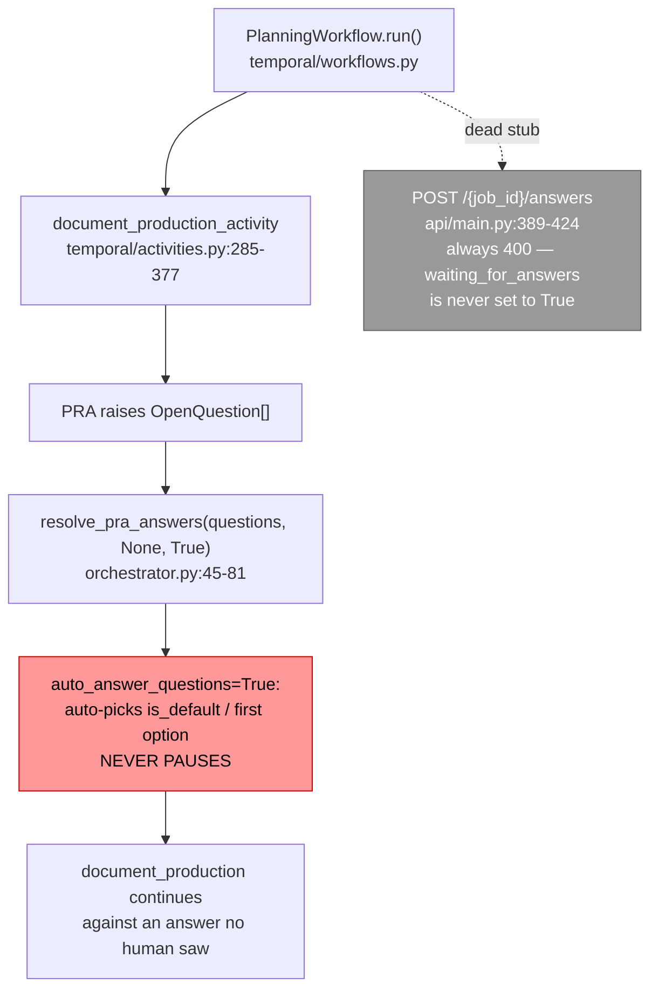

# SPEC-024: Planning Team Clarification-Question Temporal Signal/Wait Contract

| Field        | Value                                                                 |
|--------------|-----------------------------------------------------------------------|
| **Status**   | Proposed (design only — no production code in this story)             |
| **Author**   | Platform Engineering                                                  |
| **Created**  | 2026-08-29                                                            |
| **Priority** | P0 (blocks #7445-B / #7446)                                           |
| **Scope**    | `planning_team` Temporal workflow/activity boundary only; defines the contract, does not implement it |

> **Story note.** This spec is the output of issue #7451, the first story in the #7445 sequence
> ("Add a Temporal-durable answer-callback primitive for Planning clarification questions"). Its
> acceptance criteria require a written interface spec and explicitly forbid merging production
> code in this story. #7445-B implements the primitive this document defines; #7446 wires it into
> `temporal/activities.py`.

---

## 1. Problem Statement

`planning_team` can surface clarification questions (`OpenQuestion` /
`backend/agents/planning_team/models.py:216-244`) but has no way to actually pause a running job
and wait for a human to answer one. `resolve_pra_answers()`
(`backend/agents/planning_team/orchestrator.py:45-81`) always auto-picks the `is_default` (or
first) option whenever no `answer_callback` is supplied — and every call site, in both thread mode
(`orchestrator.py` `run_workflow`) and Temporal mode (`temporal/activities.py:320-324`,
`document_production_activity`), calls it with `auto_answer_questions=True` and no callback. A
stub answers route already exists (`api/main.py:389-424`, `POST /{job_id}/answers`) but always
returns `400`, because nothing ever sets `waiting_for_answers=True` on a Planning job record.

Temporal activities cannot natively suspend mid-execution for an arbitrary human response time —
only a *workflow* can await a signal. So before any implementation work starts, this story fixes
the shape of the solution: what the activity returns when it needs input, what the workflow waits
on, what the human's answer looks like on the wire, and how re-invocation is made idempotent.

The coding team already solved this exact problem for its own Tech-Lead clarification loop
(`SPEC-023-coding-team-human-in-the-loop.md`, `backend/agents/software_engineering_team/hitl.py`,
`pause_cycle.py`, `temporal/coding_team_workflow.py`). SPEC-023 §4.3.3 and §7 explicitly deferred
Planning's Temporal-mode pause semantics as future work. This spec is that follow-up, and its
central design decision is: **reuse that signal/pause-cycle workflow state-machine pattern
verbatim, extending only the payload fields Planning needs, rather than inventing a second one**
(§4.1 spells out exactly which payload fields are extended and why "verbatim" here scopes to the
state machine, not to the payload bytes).

---

## 2. Current State



`PlanningWorkflow` (`temporal/workflows.py`) is a plain sequential chain of
`workflow.execute_activity` calls — intake → discovery → requirements → optional market_research →
synthesis → **document_production** → sub_agent_provisioning → finalize. No `@workflow.signal`, no
`workflow.wait_condition` exists anywhere in it today.

### Reusable machinery (preserve, do not reinvent)

- `_ActivityPauseSignal` (`pause_cycle.py:36-74`) — internal exception carrying
  `{resume_token, pause_kind, pause_context, pending_questions}`, unwound at the orchestrator
  boundary into a `{"outcome": "paused", ...}` return value.
- `mint_resume_token(job_id)` (`pause_cycle.py:77-92`) — `f"{job_id}:{uuid4().hex[:12]}"`, minted
  once per pause round.
- `_check_pending_pause_reentry(job_data, acknowledged_resume_token)`
  (`pause_cycle.py:142-177`) — classifies a re-invocation as `consume=True` (token matches →
  resume) or `consume=False` (token missing/mismatched → activity retry, re-emit the same paused
  payload, do no new work).
- `submit_answers` signal (`temporal/coding_team_workflow.py:282-348`) — name, payload shape, and
  the buffering state machine (`_active_resume_token`, `_submitted_answers`,
  `_buffered_signals`) on `CodingTeamWorkflow`.
- `backend/shared/hitl/models.py` — `PendingQuestion`, `QuestionOption`, `AnswerSubmission`,
  `SubmitAnswersRequest`: the team-agnostic superset schemas, already built for exactly this kind
  of cross-team reuse.

---

## 3. Goals and Non-Goals

**Goals**
- Define the Temporal signal name and payload for delivering a human's answers to a Planning
  clarification question.
- State unambiguously which side (workflow vs. activity) owns the wait, and why.
- Define the retry/continuation shape when a clarification question is raised mid-activity.
- State explicitly how this reuses `hitl.py`/`pause_cycle.py` rather than diverging from it.
- Define Preconditions/Postconditions/Invariants the eventual primitive (#7445-B) must satisfy.

**Non-Goals** (deferred to later stories)
- Implementing the mechanism (#7445-B).
- Wiring `document_production_activity` / `resolve_pra_answers` to actually use it (#7446).
- Thread-mode (non-Temporal) pause behavior — `backend/shared/temporal/checkpoints.py`'s
  `wait_for_input`/`submit_input` already cover that path per `shared/temporal/README.md`; this
  spec covers only the Temporal-native signal. **Why this contract does not simply call
  `submit_input` from the `submit_answers` signal handler, reconciling with `checkpoints.py`
  directly:** `checkpoints.py`'s `waiting_for`/`inputs` job-record fields are a single-key
  prompt/value pair (`wait_for_input(team, job_id, key, prompt=...)` → one `inputs[key]`) — there is
  no batch-of-questions, no per-question option list, no `resume_token`/`pause_kind` taxonomy, and
  no multi-round scoping. Planning's clarification gate needs all of those (§4.1/§4.3), matching
  what `checkpoints.py` itself was never built to carry — its module docstring's own framing
  ("pair these with `workflow.wait_condition`... or, in thread-mode fallback, with a simple polling
  loop") describes the generic pattern this contract instantiates, not a ready-made
  multi-question envelope to call into unchanged. The mandatory extraction of
  `mint_resume_token`/`_check_pending_pause_reentry`/the workflow-side state machine into
  `backend/shared/hitl/` (§4.3, §4.2) *is* this contract's answer to "converge on one shared
  primitive rather than two team-specific ones": once extracted, `checkpoints.py` remains the
  sanctioned single-key/thread-mode primitive, and the new `shared/hitl/pause_cycle.py` +
  shared workflow-state-machine component becomes the sanctioned structured/Temporal-native one —
  two primitives for two genuinely different shapes of pause, both shared, neither team-specific.
- The full REST/UI surface (routes, request validation) beyond the one field this spec's contract
  requires exposing — see §4.1's `resume_token`-delivery requirement below; that field's existence
  is in scope precisely because without it a polling client has no way to learn the token
  `SubmitAnswersRequest.resume_token` asks it to echo back.

---

## 4. Detailed Design

### 4.1 Signal name and payload

Reuse the coding team's signal **name and destination payload shape** — not a byte-for-byte
verbatim reuse of the whole pattern (§2's "verbatim" scopes to the signal/pause-cycle workflow
state machine, not to the payload bytes), since the payload requires one extension below; "reuse"
here means the same `@workflow.signal(name="submit_answers")` name and the same core envelope,
deliberately extended rather than copied unchanged:

```python
@workflow.signal(name="submit_answers")
def submit_answers(self, payload: dict[str, Any]) -> None:
    ...
```

Payload: `{"resume_token": str, "answers": list[dict]}`, where each `answers` element is
`AnswerSubmission`-shaped (`backend/shared/hitl/models.py:70-77`):
`{"question_id": str, "selected_option_id": Optional[str], "other_text": Optional[str]}` —
**extended** with a plural field, `"selected_option_ids": List[str]` (default `[]`), required for
`allow_multiple=True` questions (below).

**Contract requirement — a polling client must be able to learn the `resume_token` in the first
place.** `SubmitAnswersRequest.resume_token` (`backend/shared/hitl/models.py:80-96`) is where the
client *sends* the token back, but Planning's current client-facing status surface —
`PlanningStatusResponse` (`backend/agents/planning_team/models.py:120-131`) and `get_status`
(`backend/agents/planning_team/api/main.py:318-329`) — exposes only
`pending_questions`/`waiting_for_answers`, with no field carrying the token itself; the paused
activity's `resume_token` (§4.1's payload above) is consumed entirely inside
`PlanningWorkflow`/the job record today. Without a client-visible field, no caller can ever
populate `SubmitAnswersRequest.resume_token` correctly. This mirrors the coding team's own
`StatusResponse.resume_token` (`backend/agents/software_engineering_team/api/coding_team_models.py:106-112`)
— required here for the same reason. **Contract requirement:** extend `PlanningStatusResponse` with
`resume_token: Optional[str] = None`, populated (from the job record's persisted `resume_token`)
whenever `waiting_for_answers` is `True`, `None` otherwise — the client-visible half of the same
pause envelope §4.3.1 already persists server-side.

**Contract requirement — carry every selection, not just one.** PRA's own `OpenQuestion`
(`product_requirements_analysis_agent/models.py:78`, mirrored in
`planning_team/models.py:224`) sets `allow_multiple=True` on some questions, and Planning's own
`AnsweredQuestion` model already has both `selected_option_id` *and* `selected_option_ids: List[str]`
(`backend/agents/planning_team/models.py:241-242`) for exactly this reason. `backend/shared/hitl/models.py`'s
`AnswerSubmission`, reused verbatim above, currently has **only** the singular field — reusing it
as-is for Planning would silently drop every selection but one on a multi-select question. This
contract requires extending `AnswerSubmission` with an optional `selected_option_ids: List[str] =
Field(default_factory=list)`, populated instead of (not in addition to, for that question)
`selected_option_id` when the source question has `allow_multiple=True`. This is not
Planning-specific scope creep: PRA's own answers-submission route
(`software_engineering_team/api/routes/product_analysis.py:283`) forwards only
`selected_option_id` today, from the same shared model — so this gap already exists for any
`allow_multiple` PRA question, coding-team or Planning. #7445-B/#7446 must land the
`AnswerSubmission` field addition *and* the corresponding pass-through at
`api/routes/product_analysis.py:283` together; shipping Planning's pause primitive without it would
build a new, correctly-plumbed pause/resume path on top of a wire format that still can't carry a
multi-select answer through to PRA.

**The client must first learn a question is multi-select at all.** Fixing the answer-submission
direction alone is not sufficient: `api/routes/product_analysis.py:194-213`, the status endpoint
that hands `pending_questions` to a polling client (Planning included), reconstructs each shared
`PendingQuestion` explicitly field-by-field and never sets `allow_multiple` — every question
serializes with the model's default, `False`, regardless of what `OpenQuestion.allow_multiple` the
question actually carries server-side. A client reading this status response has no way to know a
question allows multiple selections, so it cannot know to submit `selected_option_ids` in the first
place — the answer-side fix is unreachable without this. **Contract requirement:** the same
rollout must forward `q["allow_multiple"]` in this status conversion, alongside the
`AnswerSubmission`/validator/PRA-route changes above; all four pieces are one change, not
independently shippable.

**The same status conversion also flips `required`'s effective default.** `OpenQuestion`
(`planning_team/models.py:224-234`) has no `required` field at all — it is a
dict-key convention only, applied at the two edges independently and inconsistently.
`api/routes/product_analysis.py:210` reconstructs the shared `PendingQuestion` with
`required=q.get("required", False)`, while the answers route's own validation
(`api/routes/product_analysis.py:263`) computes `required_ids` with
`q.get("required", True)` against the same underlying dict. Every PRA question that never had
`required` set explicitly — the common case, since `OpenQuestion` has no such field to set —
therefore reports as **optional** to a polling client reading status, while PRA itself still
**requires an answer for it**. A client (Planning's mandated shared validator included) can
accept a submission omitting that question as complete, submit it, and have PRA's own answers
route reject the batch with 400 for a missing required answer; because the polling adapter
(`planning_team/adapters/product_analysis.py`'s `wait_for_product_analysis_completion`/`_on_poll`)
does not inspect the submission's result, the resumed activity then keeps polling an unresolved
job until it times out rather than surfacing the mismatch. **Contract requirement:** the same
rollout that fixes `allow_multiple` must also make the status conversion default `required` to
`True` — matching the answers route's own effective default — or, preferably, add and persist an
explicit `required` field on `OpenQuestion` so neither edge depends on an implicit default at all.
This is a fifth piece of the same one-change rollout above, not a separate, independently
shippable fix.

**The shared validator needs the same fix, not just the model.** Adding the field to
`AnswerSubmission` is necessary but not sufficient: `shared.hitl.validation.validate_answers`
(`shared/hitl/validation.py:81-118`, the coding team's own answer-validation entry point, and the
natural one for Planning's answer-submission route to reuse rather than duplicate) checks only
`a.selected_option_id`/`a.other_text` and — at line 100 — rejects any answer where both are falsy
as "not a decision," with no awareness of `selected_option_ids` at all; its returned dict
(`validation.py:110-118`) doesn't carry the plural field either, so even an answer that somehow
passed validation would have its multi-select content silently dropped before it ever reaches the
job store. **Contract requirement:** `validate_answers` must recognize a populated
`selected_option_ids` as a valid decision, validating each id against the question's own options
**while special-casing `"other"` within that list exactly as the singular-field check already does
for `selected_option_id == "other"`** (`validation.py:86-91`) — i.e., an id of `"other"` inside
`selected_option_ids` requires non-blank `other_text` rather than being checked against the
question's stored options, mirroring PRA's own `apply_answers`
(`product_requirements_analysis_agent/user_communication.py:210-219`), which already treats
`"other"` the same way inside a multi-select submission. Every non-`"other"` id in the list is
validated against the question's options exactly as the singular check does (`validation.py:92-99`).
The validator must include `selected_option_ids` in the dict it returns. Without this, every
compliant multi-select submission — through the coding team's existing route or any Planning route
that reuses this validator — is rejected with a 400, and a multi-select answer that legitimately
combines a stored option with a free-text `"other"` entry is specifically and incorrectly rejected
even after the plural-field-awareness fix alone.

**Also reject what the wire shape alone can't rule out: plural selections for a single-select
question, and both fields set at once.** Validating each id in `selected_option_ids` against the
question's own options (above) is necessary but not sufficient — it says nothing about whether the
*question itself* allows more than one selection. PRA's own `apply_answers`
(`user_communication.py:210`) treats any non-empty `selected_option_ids` as authoritative
regardless of the question's `allow_multiple`, and resolves an ambiguous submission carrying both
`selected_option_id` and a non-empty `selected_option_ids` silently in favor of the plural list —
neither behavior is validated against on the way in. **Contract requirement:** `validate_answers`
must additionally reject (400) a submission where `selected_option_ids` is non-empty for a question
whose persisted `allow_multiple` is falsy, and reject (400) a submission that sets both
`selected_option_id` (non-blank) and a non-empty `selected_option_ids` for the same answer — the
two fields are mutually exclusive per answer, selected by the question's own `allow_multiple`, not
freely combinable by the client.

**Duplicate ids within `selected_option_ids` must also be rejected, not silently accepted.**
Per-id membership validation (above) accepts `selected_option_ids=["postgres", "postgres"]` without
complaint — each id individually is a valid option — but PRA's own `apply_answers`
(`user_communication.py:210-219`) iterates the list unmodified: `postgres` appears twice in
`selected_labels`, and the joined `selected_answer` becomes a malformed
`"Postgres; Postgres"` that then flows into the persisted `AnsweredQuestion` and any generated
artifact built from it. **Contract requirement:** `validate_answers` must reject (400) a
`selected_option_ids` list containing a repeated id (`"other"` included), rather than dedupe it
silently — a client submitting the same option twice is a malformed request, not one this contract
should quietly correct into a different, unrequested answer.

**This must be enforced at PRA's own public endpoint too, not only in the shared validator.**
PRA's answers route (`api/routes/product_analysis.py:238-288`) does **not** call
`shared.hitl.validation.validate_answers` — it performs its own inline validation (pending/required/
answered-id-set checks only, `:258-278`, verified earlier in this section) and, per this contract's
own plural pass-through requirement above, would forward `selected_option_ids` straight through to
`apply_answers` at `:280-288` with no multiplicity or mutual-exclusion check of its own. A caller
that submits directly to PRA's public endpoint (bypassing Planning's route and its use of the
shared validator entirely) could therefore still submit plural choices for a single-select question
or set both fields, and `apply_answers` (§4.1, above) would accept it. **Contract requirement:**
`api/routes/product_analysis.py`'s answers route must either call `shared.hitl.validation.validate_answers`
in place of its current inline checks, or replicate **the validator's full answer-validity surface**
inline — not just the multiplicity/mutual-exclusion checks above, but every check
`validate_answers` performs: each plural id's membership in the question's own options
(`validation.py:92-99`, mirrored for `selected_option_ids`), the `"other"` special case requiring
non-blank text (`validation.py:86-91`), *and* multiplicity/mutual-exclusion. PRA's own existing
inline checks (`:258-278`) validate only question-level id membership (which question was
answered), never option-level validity (which choice within that question) — an inline replica
that covers only multiplicity would still let a direct PRA caller submit an unknown option id or an
`"other"` with no text; `apply_answers` silently drops an unknown id into an `"Unknown"` decision
rather than rejecting it, and the endpoint clears the wait regardless. The fix cannot live in the
shared validator alone while PRA's own route bypasses it, and cannot be partial when it doesn't.

**Why the same name, not `planning_submit_answers` or similar:** `backend/shared/hitl/models.py`
was deliberately built as a cross-team superset so both teams share one vocabulary. A single
signal name across teams means any future workflow that hosts both a coding-team-style gate and a
planning-style gate (SPEC-023 §4.3.3 flags `RunTeamWorkflowV2` as exactly this case) needs no
signal-name disambiguation. Each `PlanningWorkflow` instance is its own Temporal workflow run, so
there is no name collision risk within one workflow's signal namespace — reuse costs nothing here.

The activity's paused-return payload, symmetric with the coding team's:

```python
{
    "outcome": "paused",
    "job_id": str,
    "resume_token": str,               # mint_resume_token(job_id)
    "pause_kind": "planning_clarification",
    "pause_context": None,             # Planning has one clarification gate per job, no per-task
                                        # sub-context analogous to coding-team worker escalation
    "pending_questions": [...],        # PendingQuestion-shaped dicts, converted from OpenQuestion
}
```

`pause_kind` is a **new** value (`"planning_clarification"`), not one of the coding team's three
(`entry` / `tech_lead_clarify` / `worker_escalation`) — Planning has exactly one clarification
gate (the `document_production_activity` phase where PRA raises questions), so one kind is
sufficient; it need not fit the coding team's per-source taxonomy. `pause_context` is `None`
because Planning has no sub-task identifier equivalent to the coding team's `task_ids` — the whole
job is what's paused.

### 4.2 Which side owns the wait

**The workflow (`PlanningWorkflow`) owns `workflow.wait_condition`.** Activities cannot pause —
`document_production_activity` must return promptly with the `outcome: "paused"` dict the moment
PRA reports unanswered questions, exactly as `run_pipeline_activity` does today
(`temporal/coding_team_workflow.py:105-247`).

`PlanningWorkflow` gains the same three instance fields as `CodingTeamWorkflow`
(`temporal/coding_team_workflow.py:277-280`):

```python
self._active_resume_token: str | None = None
self._submitted_answers: list[dict[str, Any]] | None = None
self._buffered_signals: dict[str, list[dict[str, Any]]] = {}
```

and the identical signal-handler rules (`temporal/coding_team_workflow.py:282-348`):
- No active pause yet → buffer the payload under its own `resume_token` in `_buffered_signals`
  (an early signal beat the workflow arming the wait).
- Active pause but token mismatch → ignore (stale/duplicate).
- Active pause, matching token, first submission → set `_submitted_answers` (the sole
  `wait_condition` predicate).
- Arming a new pause consumes any matching buffered entry immediately and discards every other
  buffered entry (bounds memory across pause rounds).

This is a **copy, not a redesign** — the state machine is proven (see the integration tests listed
in §6) and Planning's clarification gate has no property that would require a different one.

**Mandatory extraction (upgraded from an earlier "recommended, not mandated" note — see the
matching upgrade in §4.3 for `mint_resume_token`/`_check_pending_pause_reentry`):** copying this
state machine field-for-field into `PlanningWorkflow` creates a second implementation of the same
capability that will diverge from `CodingTeamWorkflow`'s on any future bug fix or race-condition
improvement to either — an unacceptable maintenance cost once both exist, not a hypothetical one.
`_active_resume_token`/`_submitted_answers`/`_buffered_signals`, the `submit_answers` signal
handler, and the arm/consume/clear rules have no coding-team-specific logic — they operate purely
on workflow instance state and the signal payload, so nothing about them resists extraction.
**Contract requirement:** #7445-B MUST extract this state machine into a shared, composable HITL
primitive (a mixin or small shared component alongside the also-now-mandatory
`backend/shared/hitl/pause_cycle.py`, §4.3) that both `CodingTeamWorkflow` and `PlanningWorkflow`
compose; `CodingTeamWorkflow` must be migrated onto the shared component in the same change that
introduces `PlanningWorkflow`'s support, not left on its own bespoke copy while Planning gets the
shared one — otherwise the extraction achieves nothing (both would still exist, just with the
newer one delegating). The contract this section defines is what the shared component must behave
like; its exact shape (mixin vs. standalone composed object vs. something else) is #7445-B's
implementation decision to make, not this design story's.

### 4.3 Retry/continuation shape

`PlanningWorkflow.run` wraps the `document_production_activity` call in the same loop shape as
`CodingTeamWorkflow.run` (`temporal/coding_team_workflow.py:546-579`):

```python
# Initial call. retry_policy is required here too -- every execute_activity call is its own
# independent command; omitting it falls back to the SDK's unbounded default, which _guarded's
# finite-max_attempts contract (§4.3.1) cannot tolerate on either call. heartbeat_timeout must
# also carry over from the current call (temporal/workflows.py:189-195, paired with the
# activity's own BackgroundHeartbeat) on both calls below: this activity polls PRA for a long
# time, and without a heartbeat timeout Temporal cannot detect a dead poller until the full
# multi-hour start_to_close_timeout elapses, long after this contract's retry/reentry behavior
# should have kicked in.
result = await workflow.execute_activity(
    document_production_activity, request,
    start_to_close_timeout=activity_timeout, heartbeat_timeout=HEARTBEAT_TIMEOUT,
    retry_policy=SAFE_RETRY,
)
while result.get("outcome") == "paused":
    resume_token = result.get("resume_token")
    if not isinstance(resume_token, str) or not resume_token:
        # Mirrors CodingTeamWorkflow.run's own guard (temporal/coding_team_workflow.py:552-563):
        # a paused result is contractually guaranteed to carry a resume_token; fail fast and
        # deterministically here rather than let wait_condition's predicate become permanently
        # unsatisfiable.
        raise ValueError(f"Paused activity result missing a valid resume_token: {result!r}")
    self._active_resume_token = resume_token
    self._submitted_answers = self._buffered_signals.pop(resume_token, None)
    self._buffered_signals.clear()
    await workflow.wait_condition(lambda: self._submitted_answers is not None)
    request["acknowledged_resume_token"] = self._active_resume_token
    self._submitted_answers = None
    self._active_resume_token = None
    result = await workflow.execute_activity(
        document_production_activity, request,
        start_to_close_timeout=activity_timeout, heartbeat_timeout=HEARTBEAT_TIMEOUT,
        retry_policy=SAFE_RETRY,
    )
    request.pop("acknowledged_resume_token", None)
```

`document_production_activity` becomes idempotent on re-entry using
`_check_pending_pause_reentry` (`pause_cycle.py:142-177`) unchanged:
- No persisted pause on the job record → proceed normally.
- `acknowledged_resume_token` matches the persisted token → genuine resume; **apply the
  now-answered questions first** via `resolve_pra_answers(..., answer_callback=<from job record>)`
  and confirm PRA has durably accepted them, **then** clear the pause envelope (never the reverse —
  see the crash-safe ordering requirement below, normatively defined in §5's resume-path
  postconditions), and continue past the point PRA raised them.
- Token missing/mismatched but a pause is persisted → this is a pre-work activity retry (e.g.
  Temporal retried the activity after it persisted-but-not-yet-returned the pause); re-emit the
  exact same `{"outcome": "paused", ...}` payload unchanged, doing no new PRA work.

**Answers must be persisted before the signal, not carried by it.** The `submit_answers` payload
(§4.1) is the *wake-up*, not the sole record of the answer — mirroring
`coding_team_hitl.submit_pending_answers` (`api/routes/coding_team_hitl.py:20-71`) exactly: that
route calls `_main.store_append_submitted_answers(job_id, answers)` (persisting the validated
`AnswerSubmission` list to the job record) *before* it calls `signal_workflow_sync(..., "submit_answers",
{"resume_token": resume_token, "answers": answers})`. The workflow-side loop in this section
deliberately drops `self._submitted_answers` after `wait_condition` returns (it only forwards
`acknowledged_resume_token`, matching `CodingTeamWorkflow.run` field-for-field) — the resumed
activity is expected to read the answers back from the job record, not from the signal payload.
Planning's answer-submission path (whatever replaces the currently-stubbed `POST
/{job_id}/answers`, `api/main.py:389-424`) MUST perform the same "persist-then-signal" write —
appending to a `submitted_answers` job-record field — before delivering the `submit_answers`
signal; this is a required part of the contract, not an implementation detail #7445-B is free to
skip. Without it, `resolve_pra_answers(..., answer_callback=<from job record>)` on resume has
nothing to read and the resume path silently regresses to auto-answering.

**Reject a stale or mismatched `resume_token` before persisting, not after.** The route must also
mirror the coding team's own request-level check
(`api/routes/coding_team_hitl.py:56-62`: `if request.resume_token != resume_token: raise
HTTPException(409, ...)`), comparing the submitted `resume_token` against the job record's
*currently active* `resume_token` **before** doing the persist-then-signal write above — not merely
relying on question-id validation to catch a stale submission. A later PRA round can reuse
question ids from an earlier round (§4.3's already-flagged `q{index}` collision risk), so a client
submitting against a stale, already-resolved `resume_token` can still pass id-membership validation
against the *current* round's `pending_questions` purely by coincidence, and — without this check —
would be written under the wrong (old) token, return success to the caller, and never wake the
workflow (which is asleep waiting on the *current* token, not the stale one). **Contract
requirement:** a missing or mismatched `resume_token` must be rejected with `409` before any write,
exactly as the coding team's route already does.

**The token check and the answer write must be one atomic conditional operation, not read-then-write.**
Checking the active `resume_token` and then separately persisting the batch leaves a race: between
the read and the write, a *different*, faster submission for the same round can complete, wake the
workflow, and the activity can advance past this pause round entirely — clearing the envelope and,
per this contract's own permission to move a consumed batch into `resolved_questions` (§4.3's
round-scoped persistence requirement), leaving no populated write-once entry left for a slower
request to conflict against. The slower request's write-once check would then find "nothing
populated for this token" and succeed, silently persisting a stale batch the workflow has already
moved past, and returning success to a caller whose signal the workflow ignores. **Contract
requirement:** the active-token comparison and the write-once insertion must be a single atomic
conditional job-store operation (e.g., a compare-and-set keyed on the job record's *current*
`resume_token` value, not merely on "is this specific token's slot already populated") — never two
separate read-then-write steps, however narrow the window between them looks.

**This primitive does not exist today and must be added — it is in scope for #7445-B, not an
implementation detail left implicit.** `JobServiceClient`
(`backend/agents/job_service_client.py`) exposes only unconditional `update_job`, `atomic_update`
(blind merge/append/increment — no conditional guard), and `apply_and_get` (same, but returns the
post-write record); the job-service DB layer (`backend/job_service/db.py`) has exactly one
conditional-write primitive today, `update_job_if_not_cancelled` (`db.py:320-366`), which guards a
single hard-coded `status != 'cancelled'` check inside one server-side `UPDATE ... WHERE`
statement — there is no generic field-equality compare-and-set a caller can parameterize with an
arbitrary field/expected-value pair. Implementing the requirement above as a client-side
read-then-write (a `get_job` call followed by a separate `update_job`/`atomic_update` call) would
reintroduce the exact TOCTOU race this section exists to close, since nothing holds the row between
the two calls. **Contract requirement:** #7445-B MUST add a new job-service primitive narrowly
scoped to this guard — e.g. `update_job_if_resume_token_matches(job_id, expected_resume_token,
**fields)` — implemented as a single server-side conditional `UPDATE` exactly mirroring
`update_job_if_not_cancelled`'s existing shape and its `True`/`False`/`None` return convention
(write performed / job exists but guard failed / job does not exist), substituting a strict
`data->>'resume_token' = %s` comparison for that function's `status != 'cancelled'` one. This is
not a generic CAS API to design from scratch; it is the same proven conditional-`UPDATE` pattern
`update_job_if_not_cancelled` already establishes, applied to a second, narrowly-scoped guard
condition. A broad, arbitrary-field-equality primitive is explicitly **not** required — only this
one resume-token-guarded shape, which is all this contract needs. **The guard must be strict
equality only — no `IS NULL` branch.** This primitive's only described caller is the
answer-submission route, which always supplies a concrete `expected_resume_token` from the
client's request; a job record with no `resume_token` persisted means no pause is currently
active for a client to answer at all, and that case must be rejected with the same mismatch
outcome as a stale/wrong token — never accepted as if it were "the very first write." Accepting an
`IS NULL` match would let a request populate an answer slot while no workflow is waiting on it,
creating a stale answer record that can later collide with a genuine pause round — exactly the
silent stale-persistence failure mode this atomic guard exists to close. (The pause-creation
activity's own "no pause active yet" write, above, is a *different* guard on `waiting_for_answers`,
not this primitive, and is unaffected by this correction.)

**The `resume_token`-match guard alone is not write-once — it must also condition on the
token-scoped answer slot itself.** `resume_token` does not change when an answer batch is written
for it, so under two concurrent submissions for the *same* active token, `WHERE resume_token =
expected_resume_token` is satisfied by **both** requests: the first write does not invalidate the
guard for the second, and the second silently overwrites the first's answer content — the exact
last-write-wins outcome the first-write-wins requirement below exists to prevent, and it can leave
the resumed activity reading a different batch than the one whose signal actually woke the
workflow. **Contract requirement:** the same server-side `UPDATE` must add a second condition on
the token-scoped answer slot: succeed unconditionally when that slot is absent (`NULL`/unset —
the legitimate first write for this token), succeed as a no-op-equivalent when it is already
present with **identical** content (a client safely retrying its own prior write, per "a rejected
write must not strand the winner's own retry" below), and fail without writing when it is present
with **different** content (a genuine second, conflicting submission for the same token). This is
one extra `WHERE`-clause condition on the same `UPDATE ... WHERE resume_token = %s AND (data->
'answers'->%s IS NULL OR data->'answers'->%s = %s::jsonb)`-shaped statement, not a second
round-trip or a separate primitive — the resume-token guard and the write-once guard are enforced
by the same atomic server-side write.

**The persist step must be first-write-wins, not last-write-wins.** Two clients can race to submit
answers for the same `resume_token` (a stale UI retry, a double-click, a legitimate second
attempt). The workflow's signal handler already commits to "first submission wins, everything else
for that token is ignored" (§4.2) — but that rule lives entirely in workflow memory (`_submitted_answers`,
set once). If the job-record write is a blind overwrite, a slower client's write can land *after*
a faster client's signal already woke the workflow, so the resumed activity re-reads a batch that
does not correspond to whichever signal the workflow actually accepted — the two "first" decisions
(signal-layer, store-layer) can disagree. **Contract requirement:** the job-record write for a
given `resume_token`'s answer batch must be an atomic compare-and-set / write-once operation —
only the first successful write for that token is retained; every subsequent write attempt for an
already-populated token from *different* content must be rejected (and its signal, if the client
sends one anyway, is already a harmless no-op on the workflow side per §4.2's duplicate-token
rule). This makes "which batch does the resumed activity read" and "which submission attempt
actually won" the same question by construction, regardless of which client's `submit_answers`
signal happens to reach the workflow first — the workflow's signal-acceptance order need not (and
cannot, without this) be made to agree with the store's write order any other way.

**A rejected write must not strand the winner's own retry.** The write and the signal are two
separate operations (§4.3's persist-then-signal ordering); a client can have its write succeed and
then have `signal_workflow_sync` itself fail (a transient Temporal outage, a network blip) *before*
the signal is delivered — the answer is durable, but the workflow is still asleep. If that same
client retries its whole submission and the write-once rule above rejects it outright (because the
token is already populated — by its own prior write), a client that gives up on rejection strands
the job forever: durable answer, no signal, no further retry. **Contract requirement:** the
write-once check must compare the retry's content against what's already persisted for that token
— identical content (the winner retrying its own submission) is not a conflict and must be treated
as a no-op *on the write* that proceeds straight to (re-)delivering the signal; only genuinely
different content for an already-populated token is rejected. Practically, this means the
answer-submission route always attempts to (re-)signal after the write step, whether that write
step performed a fresh write or recognized its own prior one — never conditioning "do we signal"
on "did this specific call perform the write." Re-signaling an already-applied token is safe
regardless: §4.2's signal handler ignores a signal that doesn't match an active pause and, once
consumed, ignores a duplicate for the same token.

**Persisted answers must be scoped to the active question round, not accumulated across rounds.**
Unlike the coding team's single Tech-Lead clarify loop, a single `document_production_activity`
run can pass through PRA's `wait_pra` poll loop (`adapters/product_analysis.py:80-106`) more than
once if PRA raises more than one round of questions before completing — each `_on_poll` invocation
calls `answer_callback(pending)` again for whatever `pending_questions` PRA reports *at that
moment*. If `submit_answers` naively **appends** every batch to one flat `submitted_answers` list
and the resume-path callback naively returns the *entire* accumulated list, a later round's
callback re-submits an earlier round's already-consumed `question_id`s alongside the new ones.
PRA's own answers endpoint (`POST .../product-analysis/{job_id}/answers`) rejects a submission
containing an id outside its *current* `pending_questions`; `submit_product_analysis_answers`'s
response is not checked by `_on_poll` (`adapters/product_analysis.py:96-97`) and
`wait_for_product_analysis_completion` has no failure branch for it — it simply keeps polling,
so a rejected resubmission degrades to a silent hang until `MAX_POLL_WAIT` (3600s) expires, not a
clean error.

**Contract requirement:** the answer-submission path must tag each persisted answer batch with the
`resume_token` of the pause round it resolves (not just append to one undifferentiated list), and
`resolve_pra_answers(..., answer_callback=<from job record>)` on resume must filter to *only* the
batch whose `resume_token` matches the round currently being resumed. **Selection must be by
`resume_token` alone — never by question-id membership, not even as an "equivalent" fallback.**
The two are not equivalent when a `q{index}` fallback id (§4.3's already-established
cross-round-collision risk) repeats across rounds: filtering by id membership in that case returns
*both* the stale round's answer and the current round's answer for the same reused id, and
`shared.hitl.validation.validate_answers`'s own duplicate-answer rejection (`validation.py:56-69`,
required of PRA's route by this contract) then rejects the resulting POST outright — degrading to
the same silent-hang failure mode this section already flags for a rejected resubmission. Once a
round's batch has been consumed by a resume, it must be marked consumed (or moved into
`resolved_questions`, which `HandoffPackage` already carries — `planning_team/models.py:193-207`)
so a later round's callback never sees it again. This is the same token-scoping discipline §4.2
already requires of the workflow's signal handler, applied here to the job-record answer store the
activity reads from.

**Recommended shape (decision for #7445-B, not mandated here):** store `submitted_answers` keyed
by `resume_token` — `{"<resume_token>": [AnswerSubmission, ...]}` — rather than one flat list, so
"only this round's answers" is a single dict lookup, with no id-based filtering step to get wrong.

**Mandatory extraction:** `mint_resume_token` and `_check_pending_pause_reentry` have no
coding-team-specific logic — they operate purely on a job record dict and a resume token, so there
is no reason for Planning to duplicate them or reach across a team boundary into
`software_engineering_team` to import them directly (the latter would make `planning_team` depend
on `software_engineering_team`'s internals, which is its own layering violation). **Contract
requirement:** #7445-B MUST extract `mint_resume_token` and `_check_pending_pause_reentry` from
`backend/agents/software_engineering_team/pause_cycle.py` into a new
`backend/shared/hitl/pause_cycle.py` (alongside the existing `backend/shared/hitl/models.py`)
*before or as part of* wiring Planning's contract, and MUST migrate
`software_engineering_team/pause_cycle.py` to import from the shared location rather than leaving
its own copy in place — as with the workflow-side state machine above, extracting a shared module
that only the new consumer imports (while the original owner keeps its own copy) is not the
extraction this requirement asks for. This spec does not mandate the extraction's exact function
signatures or module layout beyond the new location — only that Planning's implementation must not
diverge in behavior from what's documented in §4.4 below, and that both teams end up calling one
shared implementation, not two.

### 4.3.1 Checkpointing the external PRA run before pausing

The coding team's pause cycle unwinds a stack frame entirely internal to the activity's own
process — nothing external needs to be told "this is still the same run." Planning's clarification
gate is different: `document_production_activity` → `run_document_production` →
`DocumentProductionAgent.run` (`agents/document_production/agent.py:91-94`) calls
`job_id = run_pra(repo_path=..., spec_content=...)` to **submit a new external Product Requirements
Analysis job**, then `wait_pra(job_id=job_id, answer_callback=...)` polls it. If
`document_production_activity` is simply re-invoked from the top on resume — the way
`run_pipeline_activity` is for the coding team — it re-executes `run_document_production` from
scratch, which calls `run_pra(...)` again: a **second** external PRA job is submitted, the
original (already-answered) PRA job is stranded, and PRA-side side effects are duplicated. This is
a real gap the coding-team pattern does not have to solve and this contract must.

**Contract requirement — checkpoint eagerly, not at the pause point.** The checkpoint must be
written the moment the external PRA job id is obtained — immediately after `run_pra(...)` returns,
**before** `wait_pra(...)` is ever called — as its own atomic `update_job` call via
`shared/temporal/checkpoints.py`'s `save_checkpoint("planning_team", planning_job_id,
"document_production_pra", {"pra_job_id": pra_job_id})` (`shared/temporal/README.md`
§"Checkpoints and human-in-the-loop"). This is a deliberate change from binding the checkpoint to
the pause envelope: PRA may run to completion **without ever pausing** (no clarification needed),
so a checkpoint written only at the pause point would never exist on the un-paused path, and a
worker crash *before* any pause is reached (activity retried, or the workflow re-invokes with no
`acknowledged_resume_token` at all) would still resubmit PRA with no checkpoint to prevent it.
Writing the checkpoint unconditionally and immediately closes that gap regardless of whether this
run ever pauses.

Symmetrically — **scoped to the patched branch with `use_product_analysis=True`, the only case
this contract's PRA pause machinery governs (§5 spells out the other two cases explicitly: a
patched `use_product_analysis=False` job never creates or expects a checkpoint at all, and the
unpatched legacy branch retains its exact pre-contract `run_pra` behavior, checkpoint-free)** —
**every entry into `document_production_pra_submit_activity`** (the activity that owns deciding
whether to call `run_pra`, §4.4's split from `document_production_activity` below) — a fresh run or
a Temporal-level retry of that `NO_RETRY` activity — must `load_checkpoint("planning_team",
planning_job_id, "document_production_pra")` *before* deciding whether to call `run_pra(...)`: a
present checkpoint means "PRA already submitted for this job," full stop, independent of whether a
pause envelope also happens to be persisted; a present checkpoint makes the call a no-op. On this
same patched-and-PRA-enabled path, `document_production_activity` itself never decides whether to
submit at all — it only ever loads the checkpoint `document_production_pra_submit_activity` already
established and calls `wait_pra(job_id=<checkpointed pra_job_id>, answer_callback=...)` — the
"never call `run_pra` again" guarantee lives entirely in the submit activity's own checkpoint-first
check, not in anything `document_production_activity` decides. This makes checkpoint-presence, not
the pause envelope, the single source of truth for "already submitted," and removes any need for
the checkpoint and pause-envelope writes to be one atomic update — the checkpoint alone is
sufficient to prevent resubmission at every re-entry, no matter which write reached durable storage
last. The pause envelope's own write (`waiting_for_answers`, `resume_token`, `pause_kind`,
`pause_context`, `pending_questions`) remains a separate atomic `update_job` call, made only once
PRA actually raises unanswered questions, and continues to be read via
`_check_pending_pause_reentry` (§5) exactly as before.

Note the two distinct ids throughout: `planning_job_id` (the Planning job this activity/workflow is
running for — what `job_id`/`load_checkpoint`/`save_checkpoint` key on) and `pra_job_id` (the
external PRA job id returned by `run_pra(...)`, carried only inside the checkpoint payload). The
checkpoint must be read/written via the Planning job-store's own team namespace, `"planning_team"`
— matching `get_job_service_client(team="planning_team")` in
`planning_team/shared/job_store.py:25` — **not** `"planning"`; using the wrong team argument
addresses a different job-service partition and the checkpoint would never be visible from the
Planning job record on any later read.

This requires `run_document_production` / `DocumentProductionAgent.run` to accept an optional
pre-existing PRA `job_id` and skip submission when one is supplied (implementation shape for
#7445-B; the contract here is only that resubmission must not happen, ever, once a checkpoint
exists).

**Residual risk this alone does not close — the crash window between `run_pra` returning and the
checkpoint write landing.** Writing the checkpoint "immediately after `run_pra` returns" narrows
the unprotected window to a single in-process gap, but does not eliminate it: a worker can still
die after `run_pra(...)` has created the external job and before `save_checkpoint(...)` durably
persists its id. `run_product_analysis` (`adapters/product_analysis.py:33-48`) is a plain POST with
no idempotency key and no reconciliation lookup, so on retry the activity finds no checkpoint and
submits a second PRA job — genuinely indistinguishable, from Planning's side, from a first
submission. **Closing this completely requires PRA's own `/product-analysis/run` endpoint to accept
a client-supplied idempotency key** (or expose a way to look up an existing job by one), which is
outside `planning_team`'s boundary and this spec's stated scope — it is software_engineering_team's
endpoint. This spec cannot mandate a fix on the other side of that boundary; it can only avoid
making the gap worse and say plainly what closes it.

**Contract requirement given that constraint:** until PRA supports an idempotency key, the PRA
*submission* itself (`run_pra(...)` through the eager `save_checkpoint` write, and nothing else)
must be its own **separately-scheduled Temporal activity**, executed via its own
`workflow.execute_activity(..., retry_policy=NO_RETRY)` call — not the bounded/default retry
policy recommended below for the rest of the activity. This must be a genuinely distinct
`execute_activity` invocation, not an in-process "do not retry past this point" guard inside the
larger `document_production_activity` function: Temporal attaches a retry policy to an entire
`execute_activity` command, not to a region of code within one activity function, so if
`document_production_activity` as a whole runs under the permissive policy §4.3.1 requires for
`wait_pra`/pause/resume, a worker crash between `run_pra()` returning and the checkpoint write is
retried under that *same* permissive policy regardless of any in-process guard — the guard cannot
stop Temporal's own retry of the whole function from the top. Only a separate `NO_RETRY` activity
for the submission step actually gets Temporal to treat that step as non-retryable. A crash in that
narrow window then fails the workflow cleanly (loud, visible, needing a human/operator to reconcile
or restart the job) rather than silently duplicating a PRA job. Everything *after* a checkpoint
exists — `wait_pra` polling, pause, resume, and the rest of `document_production_activity` — is
safe to retry freely in its own (different) activity invocation, because those steps only ever
consult the checkpoint and never resubmit. The contract fixes the retry-policy asymmetry (a
dedicated `NO_RETRY` submission activity vs. a retryable activity for everything after) and flags
PRA-side idempotency as the complete fix, tracked as an open item alongside the unbounded-
`wait_condition` risk already carried in this
section (below).

**Contract requirement — the activity must actually be retryable (past the submission step), under
a *bounded* policy specifically.** `PlanningWorkflow`'s current
`workflow.execute_activity(document_production_activity, ..., retry_policy=NO_RETRY)`
(`temporal/workflows.py:189-195`) means a worker crash mid-activity fails the whole workflow rather
than letting Temporal re-invoke the activity — unlike the coding team, whose
`workflow.execute_activity(run_pipeline_activity, request, start_to_close_timeout=activity_timeout)`
(`temporal/coding_team_workflow.py:546-551, 574-578`) passes **no** `retry_policy` override at all,
so it runs under the SDK's unbounded default retryable policy. Because this contract makes the
activity idempotent on re-entry — past the submission step above — via the eager checkpoint and
`_check_pending_pause_reentry` (§5), the rest of `document_production_activity` must adopt a
retryable posture too — but **must use `SAFE_RETRY` (`temporal/workflows.py:53-54`) specifically,
not the SDK's unbounded default**, unlike the coding team's activity. This is a deliberate
divergence, not an oversight: every `planning_team` activity, this one included, runs through the
`_guarded` wrapper (`temporal/activities.py:69-118`, thin over
`shared.temporal.activity_helpers.guarded`), whose contract requires `max_attempts` to be an
explicit finite value *matching the phase's own Temporal `RetryPolicy`* (`activities.py:87-88`) —
it uses that number to decide `is_final_attempt` and mark the job FAILED only on the truly last
attempt. An unbounded default policy has no finite `max_attempts` to hand `_guarded`: passing
`RETRYABLE_MAX_ATTEMPTS` (or any other finite guess) while Temporal itself retries without limit
would mark the job FAILED after that many attempts even though Temporal keeps trying past it — a
false-terminal failure — while no finite value can correctly represent "unlimited" to `_guarded`
either way. `SAFE_RETRY`'s existing finite `maximum_attempts` (already used, and already correctly
paired with `_guarded`, by every other retryable phase in this same workflow) is required; the
coding team's unbounded-default choice does not transfer here because
`software_engineering_team`'s activities have no equivalent `_guarded`-style finite-attempt-count
contract to violate. Blanket `NO_RETRY` must not remain on `document_production_activity` once the
pause contract lands, but the replacement must be `SAFE_RETRY`, not "no override at all."

**Naming, to keep the two activities and their retry policies straight:** this contract splits what
was one `document_production_activity` into two Temporal activities scheduled separately by
`PlanningWorkflow`: a small `document_production_pra_submit_activity` (illustrative name — #7445-B
picks the actual one) that takes the same `job_id`/`context` the current single activity does
(§5's precondition — it needs `repo_path`/`spec_content` to call `run_pra`) and does only
`run_pra(...)` + the eager checkpoint write, scheduled with `retry_policy=NO_RETRY`; and `document_production_activity` itself, which always starts by loading
the checkpoint (never calling `run_pra` directly), then runs `wait_pra`/pause/resume/finalize under
`SAFE_RETRY` (specifically — not the SDK default; see the `_guarded`-compatibility requirement
below). The workflow calls the submit activity once per job (a no-op
skip if a checkpoint already exists — safe to call again on workflow-level retry, since it just
re-checks the checkpoint) before entering the `document_production_activity` retry/continuation
loop of §4.3.

**Conditional on `use_product_analysis` — none of this pause machinery applies when PRA is
disabled.** `document_production_activity`'s existing `use_product_analysis: bool` parameter
(`temporal/activities.py:289`) already lets a caller opt out of PRA entirely; when `False`,
`run_document_production` never calls `run_pra`/`wait_pra` at all (`phases/document_production.py:147-159`
passes `run_pra=None`, and `DocumentProductionAgent.run`'s `if use_product_analysis and run_pra and
wait_pra:` guard, `agent.py:91`, is simply never true). The workflow must call
`document_production_pra_submit_activity` **only when `use_product_analysis` is `True`** for this
job — calling it unconditionally would submit an external PRA job for a caller that explicitly
opted out. Symmetrically, `document_production_activity`'s own precondition that a checkpoint
already exists (§5) applies only on the `use_product_analysis=True` path; when `False`, there is no
checkpoint to load, no `wait_pra` to resume, and no pause round ever begins — the activity runs
exactly as it does today, unaffected by this contract.

**Postcondition this adds to §5:** `document_production_pra_submit_activity` runs under
`NO_RETRY` and either finds an existing checkpoint (no-op) or performs exactly one `run_pra` call
followed immediately by the checkpoint write; `document_production_activity` never calls `run_pra`
itself, only `load_checkpoint`, and runs under a retry policy that actually permits Temporal to
re-invoke it after a worker crash (not `NO_RETRY`), since retry-then-reentry past the checkpoint is
the mechanism this contract relies on for crash recovery there.

**The pause signal must be caught inside `_guarded`'s `work` callable, never let reach `_guarded`
itself.** Every `planning_team` activity, `document_production_activity` included, runs its actual
work through `_guarded(job_id, phase, ..., work, max_attempts=...)`
(`temporal/activities.py:69-118`), which wraps `work()` in `try: ... except Exception as exc: if
is_final_attempt(max_attempts): fail_job(...); raise` (`shared/temporal/activity_helpers.py:139-146`).
`_ActivityPauseSignal` (§4.4) is itself an `Exception` subclass. If the pause is reached on this
activity's *final* `SAFE_RETRY` attempt (a genuinely reachable state — a couple of earlier attempts
failed transiently, then the next attempt hits a clarification question) and the signal is left to
propagate *out of* `work()` before being caught — e.g., caught only at the outer activity-function
level, around the `_guarded(...)` call itself — `_guarded`'s own `except Exception` intercepts it
first: `is_final_attempt` is true, so it calls `fail_job` (marking the Planning job **FAILED**,
client-visibly terminal) before re-raising. An outer catch would still convert the re-raised signal
into a normal `{"outcome": "paused", ...}` return, so the workflow proceeds as if paused — but the
job record has already been marked FAILED as a side effect, producing a client-visible
contradiction (terminal-FAILED job, workflow still actively running a pause/resume cycle).
**Contract requirement:** the `_ActivityPauseSignal` catch (or PRA's own `answer_callback`
mechanism reaching the same effect) must sit *inside* the callable passed as `work` to `_guarded` —
converting it to the `{"outcome": "paused", ...}` value there, as a normal return, so it never
becomes an `Exception` `_guarded` itself observes. This is a placement requirement on the
implementation, not a behavior change to `_guarded` itself; `_guarded` needs no modification.

**Correction — the exception cannot even survive the polling layer beneath `_guarded`, so it must
never be raised as an exception through this call path at all.** The requirement above (catch
before `_guarded` sees it) implicitly assumed `_ActivityPauseSignal` propagates as a normal Python
exception up through `wait_pra` → `DocumentProductionAgent.run` → `work()`. It does not reach that
far: `wait_pra` is `wait_for_product_analysis_completion`, which drives its poll loop through the
shared `poll_until_terminal` (`shared/http/job_polling.py:395-416`), and that helper's own
`on_poll` invocation (`:409-414`) is wrapped in `try: on_poll(status) except Exception as e: ...
return {status_key: "failed", "error": _ON_POLL_FAILURE}`. `answer_callback` is invoked from
inside `_on_poll` (`adapters/product_analysis.py:92-97`), which is `poll_until_terminal`'s
`on_poll`. So a pause signal raised from `answer_callback` — being an `Exception` — is caught and
swallowed by `poll_until_terminal` itself, logged as an `on_poll` failure, and converted into an
ordinary `{"status": "failed", ...}` terminal result **two layers before** `_guarded` or the
activity function ever gets a chance to see it. `DocumentProductionAgent` would observe what looks
like an ordinary PRA failure and (per its existing, unrelated error handling) return normally; the
workflow would advance past document production having never paused at all — the opposite of this
contract's purpose. **Contract requirement, superseding raise-and-catch for this call path
specifically:** the pause must be signaled as a **return value**, not an exception, starting at the
point closest to where it originates. `wait_for_product_analysis_completion`'s `_on_poll` must,
when a genuine pause (not auto-answering) is needed, communicate that back to
`wait_for_product_analysis_completion`'s own return value without going through
`poll_until_terminal`'s exception path (which swallows it) or its terminal-status path (which
`waiting_for_answers` isn't).

**Keep `poll_until_terminal` itself generic — do not repurpose its `on_poll` return value as a
pause-propagation channel.** An earlier version of this requirement proposed extending
`poll_until_terminal` (`shared/http/job_polling.py:361-416`) so a non-`None` `on_poll` return
stops polling and becomes the helper's own result. That couples a low-level, team-agnostic HTTP
polling utility (used well beyond this one call site) to one team's HITL pause/resume lifecycle,
and introduces a hidden control path: any other caller whose `on_poll` callback ever returns a
non-`None` value (a list, a bool, a progress dict) would silently and unexpectedly stop that
caller's polling too — the helper's current contract (`on_poll: Callable[[Dict[str, Any]], None]`)
promises no such thing. **Contract requirement instead:** implement the pause detection entirely
within `wait_for_product_analysis_completion` (a Planning-specific wrapper, `adapters/product_analysis.py`)
around its call to `poll_until_terminal`, not inside `poll_until_terminal` itself — e.g., check the
polled status for `waiting_for_answers` *before* invoking `answer_callback`/`poll_until_terminal`'s
`on_poll` at all, and short-circuit `wait_for_product_analysis_completion`'s own return without
needing `poll_until_terminal` to learn anything about pauses; or introduce a distinct,
explicitly-named helper (e.g. `poll_until_terminal_or_pause`) with its own documented pause
contract, leaving `poll_until_terminal` itself untouched for every other caller. Either shape keeps
`shared/http/job_polling.py` generic; this contract does not mandate which.

`_ActivityPauseSignal`-the-exception, and the inside-`_guarded`'s-`work`-callable catch point
above, remain correct for a pause signaled from somewhere *outside* this specific polling call
chain (should one ever exist); through `wait_pra` specifically, the mechanism is return-value
propagation the whole way, not exception unwinding at any point, and it must not be implemented by
widening the shared polling helper's contract.

### 4.3.2 Rollout compatibility for the activity signature change

`document_production_activity` is currently called with three positional args —
`args=[job_id, context, use_product_analysis]` exactly (`temporal/workflows.py:189-197`), matching
every other per-phase activity's positional-args style in this workflow (`:142-215`, e.g.
`intake_activity` at :142-146) — not the single `request`
dict this contract's retry/continuation loop (§4.3) needs in order to carry
`acknowledged_resume_token`. Changing the activity's calling signature is itself a workflow-history
compatibility hazard, independent of the pause feature: a `PlanningWorkflow` execution whose
history was recorded *before* the signature change (i.e., it already scheduled
`document_production_activity` with the old three-positional-arg shape) must replay
deterministically against a worker that has since deployed the new dict-based call — Temporal
requires the *same sequence of commands* on replay, and a changed argument shape for the same
activity name is exactly the kind of non-deterministic edit `workflow.patched` exists to guard.

**Contract requirement:** gate the *entire new command sequence* — not just the argument shape —
behind `workflow.patched(...)`, the same mechanism `PlanningWorkflow` already uses for its own
prior migration (`_PER_PHASE_PATCH`, `temporal/workflows.py:122-140` — "A `PlanningWorkflow`
execution started before the per-phase migration... replays the legacy single-activity path via
the `workflow.patched` gate"). This must cover more than the argument shape: this contract also
*inserts a brand-new command* — the `document_production_pra_submit_activity` call (§4.3.1) —
*before* the existing `document_production_activity` call. Temporal replay requires the exact same
sequence of commands a history originally recorded; a history that scheduled
`planning_document_production` directly (no submit-activity command before it) diverges from a
replay that now schedules a new activity command first, **even if `document_production_activity`
itself is called with its old argument shape** on that branch. So the single new patch marker (e.g.
`_CLARIFICATION_PAUSE_PATCH`) must gate the *whole* new sequence: on `not workflow.patched(...)`,
skip `document_production_pra_submit_activity` entirely and call `document_production_activity`
exactly as today (old args, no resume loop); on the patched branch **and only when
`use_product_analysis` is `True`** (§4.3.1's conditional-submission requirement applies here
unchanged — a patched execution with `use_product_analysis=False` must skip
`document_production_pra_submit_activity` exactly as the legacy branch does, for the same reason:
no checkpoint is expected, and scheduling the submit activity for an explicit opt-out would submit
an external PRA job the caller never asked for), schedule the submit activity first, then run the
new `request`-dict call and retry/continuation loop of §4.3. So there are three sequences, not two:
legacy (old args, no submit activity, no resume loop), patched+PRA-disabled (`request`-dict call,
no submit activity, no resume loop — PRA never engages so nothing to pause on), and
patched+PRA-enabled (submit activity, then `request`-dict call with the full retry/continuation
loop). This exactly mirrors `_PER_PHASE_PATCH`'s own legacy branch, which replays its entire old
single-activity sequence rather than cherry-picking pieces of the new one — reused a second time in
the same workflow, not invented anew.

**`workflow.patched` alone is not sufficient — the activity worker needs its own compatibility
path.** `workflow.patched` only governs what a *workflow* schedules on replay; it says nothing
about the activity *worker* process. During a rolling deploy, an activity task already enqueued
under the old three-positional-arg shape (scheduled by an old-code workflow execution before the
new worker version rolled out) can be picked up by a worker that has already registered the new
dict-only `document_production_activity` implementation — invocation fails before any workflow
code (patched or not) gets a chance to run, and under the activity's current `NO_RETRY` (§4.3.1)
that failure fails the whole workflow. **Contract requirement:** the activity function itself must
accept both call shapes — either a compatibility decoder at the top of
`document_production_activity` that detects the old three-positional-arg invocation and normalizes
it into the same `request` dict the rest of the function expects, or registering the new dict-based
behavior under a distinct `@activity.defn(name=...)` (e.g. `planning_document_production_v2`) while
the old name/signature stays registered and callable until the task queue has drained of old-shape
tasks. `workflow.patched` and this activity-level decoding are both required, addressing two
different compatibility surfaces (workflow replay vs. activity worker invocation) — neither
substitutes for the other.

**Reshaping an existing activity's call is not the only rollout hazard — `document_production_pra_submit_activity`
is a brand-new activity type, and a shape-compatibility decoder cannot help an old worker that has
never registered it at all.** During a rolling deployment, multiple worker replicas at different
code versions serve the same task queue simultaneously; Temporal does not route a given task to a
same-version replica by default. A *new*-code `PlanningWorkflow` execution (patched,
`use_product_analysis=True`) can schedule `document_production_pra_submit_activity`, and that task
can land on an *old* replica that has not yet deployed this contract's code at all — the worker has
no handler registered for that activity name, the task cannot start, and — being `NO_RETRY` — the
activity (and per the backstop above, the workflow, terminally-recorded) fails immediately on a
purely operational rollout race, not a real defect. The three-positional-arg compatibility decoder
above does not help here: there is no old-shaped call for this activity to decode, because it did
not exist before this contract. **Contract requirement:** #7445-B's rollout must use Temporal
Worker Versioning (Build ID-based task queue versioning) so tasks for the new activity route only
to workers that have it registered, or equivalently drain and fully upgrade every worker replica on
this task queue before any workflow begins scheduling `document_production_pra_submit_activity` —
accepting old call shapes in the new worker code (this section's existing requirement) addresses
the reverse direction (old task, new worker) and does not by itself close this one (new task, old
worker).

### 4.4 Explicit hitl.py / pause_cycle.py reuse statement

This design reuses, unmodified in behavior:
- The `_ActivityPauseSignal`-*style* discriminated-pause-payload shape: `{outcome, job_id,
  resume_token, pause_kind, pause_context, pending_questions}`, reused as a value shape only — via
  the `document_production_pra_submit_activity`/`document_production_activity` split (§4.3.1) and
  return-value propagation through `wait_pra`/`poll_until_terminal` all the way to `work`'s return
  (§4.3.1's `poll_until_terminal`-swallows-exceptions correction), **not** the coding team's literal
  exception-raise-and-catch mechanism, which cannot survive `poll_until_terminal`'s own
  `except Exception` on this call path (verified, not assumed — §4.3.1 above). Where the coding
  team unwinds a stack frame via a raised exception, Planning's document-production path unwinds
  via an ordinary return value threaded up through the same call chain — the *destination* shape
  (`{"outcome": "paused", ...}`) is reused verbatim; the *mechanism* that gets there is necessarily
  different, because this call path passes through a shared polling helper the coding team's
  analogous path does not.
- `mint_resume_token`'s exact format and one-mint-per-pause-round rule.
- `_check_pending_pause_reentry`'s three-way classification (no pause / consume / re-emit
  unchanged).
- The job-record pause envelope field names: `waiting_for_answers`, `resume_token`, `pause_kind`,
  `pause_context`, `pending_questions` — Planning's job store (`job_store.py:45-46`) already seeds
  `pending_questions: []` and `waiting_for_answers: False` on every record, so no new fields are
  needed, only new writers.
- The `submit_answers` signal name and payload shape (§4.1).
- The workflow-side wait/buffer state machine (§4.2), copied field-for-field.
- The persist-then-signal answer-submission pattern from
  `coding_team_hitl.submit_pending_answers` (`api/routes/coding_team_hitl.py:20-71`): append
  validated answers to the job record, then signal — never the reverse, never signal-only (§4.3).
- `workflow.patched` for rollout compatibility (§4.3.2) — `PlanningWorkflow`'s own existing
  `_PER_PHASE_PATCH` mechanism, applied a second time rather than inventing a new versioning
  approach.

The only Planning-specific pieces are:
1. **Which activity calls the pause cycle** — `document_production_activity`
   (`temporal/activities.py:285-377`) instead of the coding team's planning/execution activities.
2. **The question source feeding it** — `OpenQuestion` / `resolve_pra_answers`
   (`planning_team/orchestrator.py:45-81`, `planning_team/models.py:216-244`) instead of Tech Lead
   clarify / worker escalation. `OpenQuestion` → `PendingQuestion` conversion is a straightforward
   field mapping (both already share `id`/`question_text`/`context`/`options` shapes); this is
   implementation detail for #7445-B, not a contract decision.
3. **One new `pause_kind` value** (`"planning_clarification"`) rather than reusing one of the
   coding team's three — see §4.1's rationale.
4. **An added external-job checkpoint** (§4.3.1): the coding team's pause has no equivalent,
   because its pause boundary never crosses into a separate external job. Planning's does (PRA), so
   this contract adds `save_checkpoint`/`load_checkpoint` (`shared/temporal/checkpoints.py`) around
   the PRA job id specifically to prevent resubmission on resume. This is a genuine addition to the
   coding-team pattern, not a divergence from it — it uses machinery the platform already documents
   as the sanctioned tool for exactly this ("phase boundaries inside an activity so a retried
   workflow can skip completed phases").
5. **Round-scoped answer persistence** (§4.3): the coding team's Tech-Lead clarify loop is
   effectively single-round per pause; Planning's PRA integration can raise multiple question
   rounds within one activity run, so the persisted `submitted_answers` must be scoped per
   `resume_token` rather than accumulated into one undifferentiated list — otherwise a later
   round's callback can resubmit an earlier round's already-consumed answers.
6. **A retry-policy split, not a blanket correction** (§4.3.1): `document_production_activity`
   currently runs entirely under `NO_RETRY`. This contract splits its PRA-facing work into two
   Temporal activities — a new `document_production_pra_submit_activity` that stays `NO_RETRY`
   (submission has no idempotency key to make it safely retryable) and
   `document_production_activity` itself, which drops `NO_RETRY` in favor of `SAFE_RETRY`
   specifically (not the coding team's unbounded default — `_guarded`'s finite-`max_attempts`
   contract requires a bounded policy, §4.3.1) because it never submits, only
   polls/pauses/resumes against an already-checkpointed job. Planning's current
   blanket `NO_RETRY` is the outlier; a single blanket policy is not the fix, a split one is.

No divergent mechanism is introduced anywhere in this design.

---

## 5. Contract: Preconditions / Postconditions / Invariants

The primitive #7445-B builds must satisfy:

**`document_production_pra_submit_activity` (§4.3.1 — separately scheduled, `NO_RETRY`)**
- *Preconditions:* Called with the Planning `job_id` **and** the post-synthesis `context`
  (specifically `repo_path`, `spec_content`, **and `initial_brief`** — not `repo_path`/`spec_content`
  alone) — the same inputs `document_production_activity` receives today
  (`temporal/activities.py:286-289`). `run_pra` requires `repo_path`/`spec_content`
  (`adapters/product_analysis.py:33-48`), but the content PRA actually gets is **not** the raw
  `spec_content` field — `DocumentProductionAgent.run` derives `spec_to_use = spec_content or
  initial_brief or "# Specification\n\n(To be refined.)"` (`agent.py:70-72`) and calls
  `run_pra(repo_path=repo_path, spec_content=spec_to_use)` (`agent.py:92`) with that *derived*
  value. A brief-only request (`spec_content=None`, `initial_brief` set — a valid
  `PlanningRunRequest` shape) would submit no spec at all if the submit activity used raw
  `spec_content` instead of the same fallback. At the point this activity runs, none of this content
  is durably available anywhere the submit activity could otherwise read it from — it exists only in
  the workflow's in-memory `context` threaded from the synthesis phase (`temporal/workflows.py:176-181`);
  the job record at this point carries `repo_path` but not the synthesized spec or brief
  (`DocumentProductionAgent.run` is what writes `initial_spec.md`, and it hasn't run yet).
  **Contract requirement:** the workflow must pass `context` (or the specific
  `repo_path`/`spec_content`/`initial_brief` fields) into this activity's call, not just `job_id`
  and not `repo_path`/`spec_content` alone. **The `spec_to_use` derivation itself must not be
  reimplemented a second time inside the submit activity** — doing so creates two independently
  maintained copies of `spec_content or initial_brief or "# Specification\n\n(To be refined.)"`
  that must stay byte-for-byte identical (§4.4), and any future change to one (a new fallback
  source, a different default string) silently desyncs from the other, submitting PRA a different
  spec than the resumed `document_production_activity`/`DocumentProductionAgent.run` will later
  validate against. **Contract requirement:** extract the derivation itself into a small shared
  helper (e.g., `planning_team.phases.document_production._derive_spec_to_use(spec_content,
  initial_brief)`, or have the workflow compute the derived value once — in `context` — and pass
  that single already-derived string into both the submit activity and
  `document_production_activity`/`DocumentProductionAgent.run`, rather than each independently
  deriving it from the same raw inputs). Either shape is acceptable; two independent
  re-derivations of the same fallback logic is not. The `"planning_team"`-namespaced job record is
  readable; scheduled by the workflow with `retry_policy=NO_RETRY`.
- *Postconditions:* Checks `load_checkpoint("planning_team", job_id, "document_production_pra")`
  first. If present, returns immediately (no-op — a prior successful run already submitted). If
  absent, calls `run_pra(...)`. **`run_pra`/`run_product_analysis` returns `None` when the
  Software Engineering service is unconfigured or the submission POST fails
  (`adapters/product_analysis.py:33-48`) — this activity must treat a `None`/falsy return as a
  failure and raise, not persist a checkpoint with `pra_job_id: None` and return successfully.**
  **Contract requirement — this activity must be wrapped in `_guarded` like every other phase
  activity in this workflow, not raise a bare exception.** `PlanningWorkflow.run` itself has no
  `except` around any `execute_activity` call and never touches the job store on failure — the
  workflow docstring is explicit that "each activity owns its own job-store progress writes and
  marks the job FAILED (then re-raises) on its own error" (`temporal/workflows.py:104-111`), and
  every existing phase activity does so by routing through `_guarded`
  (`temporal/activities.py:69-119`, `mark_job_failed`/`update_job` bound in), which marks the job
  record FAILED on the final attempt before re-raising. If this new activity instead raised a bare
  exception (as "a raised exception here fails this `NO_RETRY` activity... loudly and visibly"
  could be read to imply), Temporal terminates the workflow but the job record is never updated —
  the status endpoint keeps reporting the job as running indefinitely, exactly the silent-hang
  failure mode this activity's own `None`/falsy-return handling above is trying to avoid. This
  activity must call `_guarded(job_id, "document_production_pra", ..., work, max_attempts=1)`
  (`SINGLE_ATTEMPT`, matching its `NO_RETRY` `retry_policy` — the same finite-attempts pairing
  §4.3.2 requires for `document_production_activity`) so a raised exception is both re-raised *and*
  recorded as a job-store `FAILED` before the workflow terminates. A raised exception here fails
  this `NO_RETRY` activity and the workflow loudly and visibly, which is the correct outcome:
  `document_production_activity`'s precondition requires a checkpoint carrying a *usable*
  `pra_job_id` before it will ever call `wait_pra`, and there is no defined no-PRA fallback for a
  job that requested `use_product_analysis=True` but got no PRA job — that is an operational
  failure to surface, not paper over. Only on a genuine successful `pra_job_id`, immediately persist
  `save_checkpoint("planning_team", job_id, "document_production_pra", {"pra_job_id": ...})` as its
  own atomic write, then return.
- *Invariants:* `run_pra` is called at most once per Planning `job_id`, ever, *when this activity
  itself does not crash between the two steps*; a crash in that narrow window is one residual risk
  this spec cannot close without PRA-side idempotency (§5's open risks, below) — `NO_RETRY` ensures
  that crash fails the *workflow* loudly rather than Temporal silently retrying into a duplicate
  submission. A checkpoint is never persisted with a `None`/falsy `pra_job_id`.

  **Correction — "fails the workflow loudly" is not the same as "the job record reflects
  failure," and a hard worker-process crash defeats `_guarded` entirely, not just this checkpoint
  window.** The `_guarded`-wrapping requirement above marks the job `FAILED` only when the activity
  *raises a Python exception inside `_guarded`'s own `work` callable* — that is, when the process
  is alive to run the `except` handler at all. A worker-process crash (OOM kill, pod eviction,
  segfault) between `run_pra()` returning and the checkpoint write is not a Python exception:
  `_guarded`'s `except` clause never executes, `mark_job_failed` is never called, and once
  Temporal's `NO_RETRY` policy and this activity's timeouts expire, the *workflow* execution fails —
  but `PlanningWorkflow.run` has no `except` around its `execute_activity` calls (confirmed above),
  so nothing updates the job record. The status endpoint keeps reporting the job as running
  indefinitely even though the workflow itself has already terminated — silent from the job
  record's perspective, whatever "loudly" the Temporal Web UI shows. This is not unique to this one
  checkpoint window: it is the same gap for *any* per-phase activity's hard process crash, since
  every phase relies solely on `_guarded` running to completion and none has a workflow-level
  backstop today. **Contract requirement, scoped to what this story adds:** because this activity
  runs under `NO_RETRY`/`SINGLE_ATTEMPT` — zero retry cushion, unlike the `SAFE_RETRY` phases where
  a crash on a non-final attempt still gets a further chance to run `_guarded` to completion — the
  workflow must wrap its `execute_activity(document_production_pra_submit_activity, ...)` call in
  a `try/except` that, on any exception surfacing to the workflow (including one from a crashed,
  never-`_guarded`-completed attempt), performs a best-effort terminal job-store update
  (`mark_job_failed`/`update_job(status="failed", ...)`) before re-raising to fail the workflow —
  a workflow-level backstop specifically for the one activity in this contract with no retry
  cushion at all. Extending the same backstop to the pre-existing per-phase activities is a
  legitimate follow-up but out of this story's scope; it does not block this contract, since those
  activities' existing behavior is unmodified by it.

**`document_production_activity` (entry — every invocation, paused or not)**
This contract's pause machinery (checkpoint-before-`run_pra`, the new `SAFE_RETRY` policy, the
retry/continuation loop) applies to **exactly one** of three cases: **patched branch AND
`use_product_analysis=True`**. The other two cases retain today's behavior entirely, unchanged by
this contract:

- *Preconditions (patched branch, `use_product_analysis=True` — the only case this contract's
  pause machinery governs):* Called with a `request` dict optionally carrying
  `acknowledged_resume_token` (§4.3.2's `workflow.patched(_CLARIFICATION_PAUSE_PATCH)` gate);
  `request["use_product_analysis"]` is `True`; the `"planning_team"`-namespaced job record is
  readable; `load_checkpoint(...)` for `"document_production_pra"` already returns a checkpoint
  (the workflow only enters this activity after `document_production_pra_submit_activity` has
  completed — §4.3.1); scheduled by the workflow with `retry_policy=SAFE_RETRY` specifically on
  **every** `workflow.execute_activity(document_production_activity, ...)` call this branch makes
  — the initial call and every re-invocation inside the §4.3 retry/continuation loop alike, since
  each `execute_activity` call is its own independent command and none may silently fall back to
  the SDK's unbounded default, which is incompatible with `_guarded`'s finite-`max_attempts`
  contract (§4.3.1).
- *Postconditions (same case):* Loads the checkpoint and calls `wait_pra(job_id=<checkpointed
  pra_job_id>, ...)` directly. This activity never calls `run_pra` itself in this case.
- *Invariants (same case):* Every entry (fresh call, Temporal retry, or workflow-driven resume)
  reuses the checkpointed `pra_job_id`; retrying this activity can never trigger a second PRA
  submission, because the only code path that submits lives in the other, `NO_RETRY` activity.

- **Patched branch, `use_product_analysis=False`:** no checkpoint exists or is expected (PRA never
  engages); the activity runs its ordinary non-PRA document-production work. This contract does not
  govern this case — it is unaffected, not merely relaxed.
- **Legacy branch** (`not workflow.patched(...)` — a `PlanningWorkflow` execution whose history
  predates this feature, per §4.3.2): called with the original three positional args, exactly
  `[job_id, context, use_product_analysis]` (`temporal/workflows.py:189-197`'s current shape —
  **not** `[job_id, repo_path, ...]`; the second positional argument is the full context dict, not
  a bare path, and a compatibility decoder that mistakes it for one would lose the specification/PRA
  inputs), never a `request` dict, never with `acknowledged_resume_token` — the legacy branch skips
  `document_production_pra_submit_activity` and the retry/continuation loop entirely (§4.3.2).
  **Retains its exact recorded `retry_policy=NO_RETRY`** — Temporal's replay determinism binds the
  scheduled activity's parameters, retry policy included, to what history recorded; this contract
  must not change it on the legacy branch even though it changes it on the patched branch. Because
  `retry_policy` stays `NO_RETRY` here, `_guarded`'s `max_attempts` for this call must stay
  `SINGLE_ATTEMPT` (matching, per its own precondition — `activities.py:87-88`) — never
  `RETRYABLE_MAX_ATTEMPTS`/`SAFE_RETRY`'s count, which `_guarded` would use to gate `is_final_attempt`
  against a Temporal attempt count that will never actually reach it. When `use_product_analysis`
  is `True` on this branch, `run_pra` is called exactly as it is today (no checkpoint, no submit
  activity) — the legacy branch's PRA behavior is unmodified by this contract, not merely
  compatible with it. The activity implementation must still decode/normalize the legacy
  three-positional-arg call shape into an internal representation before proceeding (§4.3.2's
  activity-level compatibility requirement), but that decoding must not route the legacy branch
  into any of the new checkpoint/pause logic above.

**`document_production_activity` (paused-return path)**
- *Preconditions:* PRA reports unanswered `OpenQuestion`s and no matching persisted pause is being
  resumed (per `_check_pending_pause_reentry`, §4.3).
- *Postconditions:* The activity persists `{waiting_for_answers: True, resume_token, pause_kind:
  "planning_clarification", pause_context: None, pending_questions}` to the job record via a
  **conditional** write — succeed only while no pause is currently active for this job (guard:
  `waiting_for_answers` is falsy/absent on the current row) — separate from, and after, the
  checkpoint write above (no longer required to be combined with it, since checkpoint-presence
  alone already prevents resubmission), then returns (does not raise) `{"outcome": "paused",
  "job_id", "resume_token", "pause_kind", "pause_context", "pending_questions"}` — no further
  job-store read or blocking call past that point. **Contract requirement — this write must not be
  the unconditional `update_job` a first draft of this contract implied.** `SAFE_RETRY` activities
  heartbeat through `BackgroundHeartbeat` (`shared/concurrency/heartbeat.py`), whose own contract
  states "a raising `beat`... never kills the loop: the exception is routed to `on_error` (default:
  swallowed)" — a lost heartbeat (worker pause, GC stall, transient RPC failure) is silently
  absorbed rather than surfaced, so the activity thread keeps running with no signal that Temporal's
  server may have already timed out the attempt and started a new one. Two attempts of the *same*
  activity invocation can therefore both observe "no persisted pause yet," each mint a distinct
  `resume_token` (`mint_resume_token`, unconditioned on anything but its own randomness), and — with
  an unconditional write — both persist successfully, one clobbering the other. Whichever attempt's
  *return value* Temporal actually delivers to the workflow may not be whichever attempt's token
  ended up durably stored last, permanently stranding the pause: the answer-submission route
  accepts only the token in the job record, while the workflow is waiting on the token from the
  attempt result it received. **Contract requirement:** persist the pause envelope with the
  conditional write described above (fails if another attempt already persisted one first); the
  losing attempt must not return its own freshly-minted, never-persisted token as if it won — it
  must reload the job record and re-emit the *winning* attempt's persisted envelope (same
  `resume_token`, `pending_questions`, etc.) as its own return value, so both attempts converge on
  one token regardless of which one Temporal ultimately delivers.

  **The `waiting_for_answers`-falsy guard alone is necessary but not sufficient — it does not fence
  a stale attempt that resurfaces after a *later* attempt has already completed an entire round.**
  Because a lost heartbeat gives no signal the attempt has been superseded (above), a delayed
  attempt can reach this same write arbitrarily later — not just concurrently with the attempt that
  replaced it, but *after* that later attempt has already published a pause, had it answered, and
  cleared the envelope (or the job has finished). At that point `waiting_for_answers` is falsy
  again — legitimately, because the real round already resolved — so the stale attempt's guard
  passes, and it publishes a brand-new pause envelope carrying its own (now-orphaned) token and
  the *original* `pending_questions` it observed long ago. Temporal discards this stale attempt's
  return value once a later attempt has already completed, so the workflow never arms a
  `wait_condition` on this orphaned token — the job record is left claiming `waiting_for_answers:
  True` for a pause nothing will ever resume, silently hanging the job (or, worse, resurrecting an
  already-answered round if a client still holds a stale status response naming it).

  **Contract requirement — fence with a durable, job-scoped `pause_generation` counter, not
  `activity.info().attempt`.** An earlier draft of this requirement proposed fencing on Temporal's
  own per-invocation attempt counter; that is wrong, because `activity.info().attempt` resets to 1
  on *every new activity invocation* — and each pass through the §4.3 retry/continuation loop
  (paused → signaled → re-invoked) is a fresh `workflow.execute_activity` call, hence a fresh
  invocation whose attempt counter restarts. A strict-greater-than-recorded-attempt guard would
  therefore reject the second, legitimate PRA question round outright (its first attempt is itself
  attempt 1, not greater than whatever attempt number round one recorded), and separate activity
  invocations can independently reuse the same attempt number regardless. The correct fence is a
  small integer field on the job record itself — `pause_generation`, starting at `0`, durable across
  every invocation of this job — read by the activity *before* it calls PRA (call this
  `observed_generation`), and used as an optimistic-concurrency version check in the same atomic
  write: **succeed only if `waiting_for_answers` is currently falsy AND the job record's current
  `pause_generation` still equals `observed_generation`** (nothing else progressed this job's pause
  state since this attempt last read it), and on success set `pause_generation =
  observed_generation + 1` together with the rest of the pause envelope. A stale attempt whose
  `observed_generation` a later attempt has since advanced past fails this guard unconditionally,
  regardless of what `waiting_for_answers` happens to read at that moment.

  **This requires a new job-store primitive — it cannot be expressed with `update_job_if_not_cancelled`
  or the `resume_token`-guarded primitive from §4.4, and implementing it as a client-side
  read-then-write reintroduces the exact TOCTOU race this section exists to close.**
  **Contract requirement:** #7445-B MUST add a second narrowly-scoped conditional-write primitive —
  e.g. `create_pause_if_generation_matches(job_id, observed_generation, **pause_fields)` —
  mirroring `update_job_if_not_cancelled`'s single server-side `UPDATE ... WHERE` shape and
  `True`/`False`/`None` return convention, with the guard `(data->>'waiting_for_answers' IS NULL OR
  data->>'waiting_for_answers' = 'false') AND COALESCE((data->>'pause_generation')::int, 0) =
  %(observed_generation)s`, and the write setting `pause_generation = observed_generation + 1`
  alongside `waiting_for_answers`/`resume_token`/`pause_kind`/`pause_context`/`pending_questions`.
  This is a third instance of the same proven conditional-`UPDATE` pattern established by
  `update_job_if_not_cancelled` and extended by `update_job_if_resume_token_matches` (§4.4) — not a
  generic optimistic-locking framework to design from scratch.

  A losing (stale-fenced) attempt follows the same reload-and-re-emit rule above, but reloads
  whatever the job record's *current* state actually is (paused on a newer round, or already
  completed) rather than assuming its own now-invalid pending-questions snapshot is still current.
- *Invariants:* The activity never blocks waiting for a human answer. It is safe to call multiple
  times for the same `job_id`/pause round: a call that finds a persisted pause whose token does not
  match `acknowledged_resume_token` re-emits the same paused payload unchanged, performing no new
  PRA work and no duplicate persistence. Exactly one pause envelope is ever durably active for a
  given job at a time, even when multiple concurrent attempts of the same activity invocation reach
  the paused-return path simultaneously.

**`document_production_activity` (resume path)**
- *Preconditions:* `request["acknowledged_resume_token"]` equals the job record's persisted
  `resume_token`; the job record's answer store (persisted by the answer-submission path *before*
  it signaled — §4.3) carries a batch tagged with that same `resume_token` covering every
  **required** question in `pending_questions` (matching `validate_answers`'s own
  `required_ids - answered_ids` check, §4.1 — optional questions may legitimately be omitted, and
  PRA's `apply_answers` supplies its own defaults for those; treating full coverage as a
  precondition would make an already-validated, already-accepted submission impossible to resume);
  a PRA-job-id checkpoint for this job is present (§4.3.1).
- *Postconditions, in this order (§4.3's ordering requirement below):* (1) the answer batch tagged
  with the resumed `resume_token` — never the full accumulated answer history, never the signal
  payload directly — is submitted to PRA via `submit_product_analysis_answers`/`answer_callback`;
  (2) only once that submission is confirmed applied does the activity atomically clear the pause
  envelope (`waiting_for_answers`, `resume_token`, `pause_kind`, `pause_context`,
  `pending_questions`) *and* mark that batch consumed (or move it into `resolved_questions`) in one
  job-record update; (3) `wait_pra` resumes polling against the checkpointed external PRA job id —
  `run_pra` is not called again; the activity proceeds to its normal terminal return shape (or
  pauses again, for the next round, per the paused-return path above).
  **Contract requirement — step (2)'s clear must itself be conditioned on the resumed token, not
  unconditional.** Overlapping attempts resuming the *same* `resume_token` A (the same heartbeat-loss
  scenario as the paused-return path above) can otherwise race past each other: one attempt clears
  A's envelope and, per the paused-return path, publishes the *next* round's pause under a new token
  B; the slower attempt, still executing step (2) for A, then performs its own unconditional
  clear-and-consume write — which clears B's freshly-published envelope and can discard an answer a
  client has already submitted and had accepted for B, stranding that submission. **The clear-and-consume
  write must be a conditional `UPDATE` guarded on `resume_token == acknowledged_resume_token`
  (the same `update_job_if_resume_token_matches` primitive from §4.4, reused for this write rather
  than a bespoke second guard) — never a blind multi-field `update_job`.** A failed match (the
  guard fires because a different round is now active) is not an error to raise: it is proof this
  attempt is stale, and the activity must treat it exactly like a losing paused-return attempt —
  reload the job record's current state and proceed from whatever round is actually active rather
  than re-attempting its own now-invalid clear.
  **Contract requirement — the consumed batch must survive this activity's own terminal write, not
  just step (2)'s job-record update.** Moving the consumed batch into the job record's
  `resolved_questions` field at step (2) is not sufficient by itself: once `wait_pra` finally
  reports `"completed"` (no more rounds), this same `document_production_activity` reaches its
  existing terminal persistence (`temporal/activities.py:335-364`), which rebuilds `merged =
  _merge_context(context, context_update)` from the **original synthesized `context`** (threaded in
  from the synthesis phase, §4.3.1's precondition) and then unconditionally writes
  `resolved_questions=list(merged.get("resolved_questions") or [])`
  (`temporal/activities.py:346,364`) — overwriting whatever step (2) already persisted for this job
  with whatever `context`/`context_update` happens to carry, which today is nothing:
  `context["resolved_questions"]` is never populated anywhere in `planning_team` (`orchestrator.py`
  only reads it, per its own "intentionally a no-op today" comment at
  `temporal/activities.py:336-342`). Left as-is, every clarification decision a human made through
  this contract's pause/resume path would be silently discarded from the handoff and the job
  record's own `resolved_questions` the moment the job completes. **This activity must hydrate the
  accumulated `AnsweredQuestion`-shaped consumed batches (across every resumed round for this job)
  into `context`/`context_update`'s `resolved_questions` before the terminal write** — e.g. by
  reading them back from the job record (the durable store step (2) already wrote them to) and
  merging into `context_update` ahead of the `_merge_context` call — so the terminal
  `update_job(..., resolved_questions=...)` preserves rather than clobbers them, and the handoff
  package built from the same `merged` dict carries the actual human decisions instead of an empty
  list.
- *Invariants:* A resume is applied at most once per `resume_token` *as reflected in this
  contract's own job record and workflow state* — re-invocation with an already-consumed token must
  not re-apply answers or re-run already-completed work there (idempotent resume from this
  contract's own perspective; see open risk 4 below for the external-delivery caveat this does not
  cover). No resume path may submit a second external PRA job for the same Planning job. A resumed
  round's answer_callback never returns an answer belonging to a different `resume_token`.
  Because this activity is retryable (§4.3.1), a retry that lands *after* step (1) but before step
  (2) must not resubmit the answers blindly — it must first reconcile against PRA's current
  `pending_questions` (a status GET). **This reconciliation must compare full question identity
  (`id` *and* `question_text` together), never `id` alone.** PRA's own question parser falls back
  to a positional `q{index}` id when a question's own `id` is missing
  (`product_requirements_analysis_agent/question_processing.py:773,805,821`), and PRA's answers
  route validates only `id` membership in the *current* `pending_questions`
  (`api/routes/product_analysis.py:262-275`) — it has no per-round or version identifier. So a
  retry that checks only "is `q0` still pending" cannot tell "PRA already applied my answer and
  moved on" apart from "PRA advanced to an unrelated later round that happens to reuse `q0` for a
  different question" — reconciling by id alone risks silently applying round *N*'s stale answer
  content to round *N+1*'s differently-scoped question, which PRA's id-only validation would
  accept without complaint. Comparing the *full* `(id, question_text)` pair against what this pause
  round persisted **narrows, but does not eliminate,** the ambiguity — and the comparison **must be
  over the complete persisted `pending_questions` set as one unit, never per-question.** A
  per-question check is unsafe for a multi-question round: if the persisted round paused on
  `[q0, q1]` and a retry's status GET finds PRA now reports `[q0 (same text), q1 (different
  text)]` — PRA has silently advanced `q1` to a new question while `q0`'s id/text pair happens to
  still match — a per-question rule would find "`q0` matches" and conclude PRA is still on the old
  round, resubmitting the *entire* persisted batch; PRA's id-only answer validation
  (`api/routes/product_analysis.py:262-275`) then accepts the stale `q1` answer against the new
  question with no error. **Contract requirement:** treat this as one set-equality check — every
  `(id, question_text)` pair PRA currently reports must equal, as a set, every pair this pause round
  persisted — before concluding "PRA is still waiting on exactly this round, safe to (re-)submit."
  Any partial difference (even a single question's id or text changed, added, or missing) must be
  treated as advancement — proceed straight to step (2), submitting nothing — never as "the
  unchanged questions are still safe to resubmit." This still leaves the residual risk below when
  the *entire* set is identical across rounds. **This is not a complete fix.** `question_text` has
  the identical fallback problem as `id`:
  `_require_string_field(q_data, "question_text", "")` (`question_processing.py:822`) defaults a
  missing `question_text` to `""`, exactly as `id` defaults to `q{index}` — so two consecutive
  rounds can in principle share the *same* `(id, question_text)` pair (e.g., both malformed-parse
  fallbacks, or coincidentally identical LLM output), and no client-side comparison over PRA's
  reported fields can distinguish that case from a genuine still-pending question. Comparing the
  full pair is strictly better than comparing `id` alone — it catches every collision where the two
  rounds' `question_text` actually differ, which is the common case — but it is a harm-reduction
  measure, not a proof. This folds into, rather than sits beside, the open risk already flagged
  below: **only a durable PRA-side round/version identifier or delivery receipt closes this
  completely**, and that is out of `planning_team`'s boundary to provide. #7445-B inherits this
  residual risk knowingly; it is not resolved by this spec.

**A failed status read is not confirmation.** `get_product_analysis_status` returns `None` on
*any* GET failure (`adapters/product_analysis.py:51-58` — "Returns `None` on failure"), not only
when the job or question is genuinely gone. Treating "no match" (§5's reconciliation rule above) as
proof PRA already applied the answer would misinterpret a transient status-read failure — after an
ambiguous prior POST — as confirmation, clearing the local pause envelope and consuming the durable
answer batch while PRA may still be sitting there waiting for it, with nothing left locally to
retry from. **Contract requirement:** reconciliation must distinguish "the status call itself
failed" from "the status call succeeded and the question is structurally absent/mismatched." Only
the latter is treated as confirmation (proceed to step (2)); a `None`/failed status response, or
any other structurally invalid response, must cause the activity to raise (so `SAFE_RETRY`
re-attempts the whole reconciliation later) rather than proceed as if confirmed.

**Ordering requirement this adds to §4.3:** clearing the local pause envelope / marking a batch
consumed must never happen *before* PRA has durably applied that batch. Because `submit_answers`
(§4.3) already establishes that the job record's answer batch — not the workflow's in-memory
`_submitted_answers` — is the durable source of truth, and because a worker crash between "PRA
applied the answer" and "the pause envelope is cleared" is recoverable (retry re-checks PRA per the
reconciliation invariant above and finds it already applied), the reverse ordering is not: clearing
the envelope first and then crashing before PRA sees the answer would leave PRA still waiting with
no persisted pause to resume from, silently hanging the job.

**`PlanningWorkflow.submit_answers` (signal handler)**
- *Preconditions:* None on the caller — a signal handler must accept any payload without raising
  (Temporal signal handlers cannot reject a signal back to the sender).
- *Postconditions:* A payload whose `resume_token` matches `self._active_resume_token` and is the
  first such match sets `self._submitted_answers`; every other payload shape (no active pause, or
  mismatched, or duplicate token) is either buffered (no active pause yet) or silently ignored
  (mismatched or duplicate), never raises, never sets `_submitted_answers` a second time for one
  round.
- *Invariants:* `self._buffered_signals` holds at most one entry per distinct `resume_token` seen
  while no pause was active; every entry is discarded the moment a new pause is armed and its
  matching entry (if any) is applied — the dict cannot grow unbounded across a long-running
  workflow's many pause rounds.

**Open risks, not resolved by this spec:**
1. *Carried over from `hitl_pause_resume_contract.md` §4:* `workflow.wait_condition` here is
   unbounded — no timeout and no reconciliation against job-record cancellation. #7445-B inherits
   this exact caveat from the coding-team implementation; it is not a new gap introduced by
   Planning reuse, and remains open future work for both teams alike.
2. *New to this spec, cross-team:* PRA submission (`run_pra`/`run_product_analysis`) has no
   idempotency key, so a worker crash in the narrow window between `run_pra` returning and the
   checkpoint write landing (§4.3.1) can still produce a duplicate external PRA job — mitigated
   here by keeping that narrow step `NO_RETRY`, but not eliminated. Full closure requires
   `software_engineering_team`'s `/product-analysis/run` endpoint to accept a client-supplied
   idempotency key or equivalent reconciliation lookup; that is outside `planning_team`'s boundary
   and this spec's stated scope, and is flagged here as a prerequisite for fully retryable PRA
   submission rather than something #7445-B can close alone.
3. *New to this spec, cross-team:* the answer-delivery reconciliation on a resumed-activity retry
   (§4.3) compares the full `(id, question_text)` pair, not `id` alone — but PRA's own question
   parser can default *both* fields identically across two separate rounds
   (`question_processing.py:821-822`), so no comparison Planning performs over PRA's reported
   fields can distinguish "this exact question is still pending" from "an unrelated later round
   coincidentally produced the same fallback pair" with full certainty. This is the same class of
   gap as risk 2: full closure requires a PRA-side round/version identifier or delivery receipt,
   which is outside `planning_team`'s boundary. The `(id, question_text)` comparison reduces the
   collision surface (it catches every case where the two rounds' text actually differs) but is not
   a complete fix, and #7445-B inherits this residual risk knowingly.
4. *New to this spec, cross-team:* the reconciliation check before step (1)'s submission (above) is
   a read (a PRA status GET) followed by a decision, not a claim — it does not itself prevent two
   overlapping attempts of the *same* resumed activity invocation (the same heartbeat-loss scenario
   as the paused-return and consume-and-clear races above: a lost heartbeat during a `SAFE_RETRY`
   resume attempt lets Temporal start a second attempt while the first keeps running, both carrying
   the same `acknowledged_resume_token`) from both observing "round still pending" and both calling
   `submit_product_analysis_answers` before either reaches the token-guarded clear in step (2). The
   job-store guards elsewhere in this contract (the write-once answer slot in §4.4, the
   resume-token-conditioned clear in this section) protect *this contract's own durable state*; they
   do not protect the external PRA POST itself, which has no compare-and-set of its own. The
   token-guarded clear happens *after* the duplicate side effect, not before it, so it cannot prevent
   it — only prevent the duplicate from being recorded twice locally. This is the same class of gap
   as risks 2 and 3: full closure requires PRA's own submission endpoint to accept an idempotency
   key (e.g. `resume_token`) and de-duplicate identical resubmissions server-side, which is outside
   `planning_team`'s boundary and this spec's stated scope. Until PRA offers that, #7445-B inherits
   the residual risk that a heartbeat-loss race can deliver an answer batch to PRA twice, even though
   this contract's own job record and workflow state stay consistent throughout.

---

## 6. References

- `system_design/specs/SPEC-023-coding-team-human-in-the-loop.md` — the direct precedent this spec
  extends to Planning.
- `backend/agents/software_engineering_team/system_design/hitl_pause_resume_contract.md` — the
  detailed contract doc for the coding-team primitive being reused.
- `backend/agents/software_engineering_team/hitl.py`, `pause_cycle.py`,
  `temporal/coding_team_workflow.py`, `api/routes/coding_team_hitl.py` — the implementation being
  mirrored, including the persist-then-signal answer-submission route (§4.3).
- `backend/shared/hitl/models.py` — the shared `PendingQuestion`/`AnswerSubmission`/
  `SubmitAnswersRequest` schemas this contract reuses.
- `backend/shared/temporal/README.md` / `checkpoints.py` — `save_checkpoint`/`load_checkpoint`
  (used in §4.3.1 for the PRA-job checkpoint) and the sanctioned thread-mode equivalent
  (`wait_for_input`/`submit_input`), out of scope here but the natural companion for non-Temporal
  callers.
- `backend/agents/planning_team/orchestrator.py`, `models.py`, `temporal/workflows.py`
  (retry policies at :53-74, `_PER_PHASE_PATCH` at :114-140, `document_production_activity` call
  at :189-197), `temporal/activities.py`, `api/main.py`, `job_store.py`,
  `agents/document_production/agent.py`, `phases/document_production.py`,
  `adapters/product_analysis.py` (`wait_for_product_analysis_completion`'s multi-round poll loop,
  §4.3) — the Planning-side files this contract will be implemented against in #7445-B/#7446.
- Integration tests demonstrating the exact signal/wait pattern end-to-end (worth mirroring for
  Planning's own test suite in #7445-B):
  `backend/agents/software_engineering_team/tests/test_coding_team_temporal_workflow.py`
  (`test_workflow_pauses_then_resumes_to_completion_via_signal`,
  `test_workflow_survives_worker_restart_while_paused_with_buffered_signal`,
  `test_workflow_resumes_via_early_signal_buffered_before_pause_processed`).
