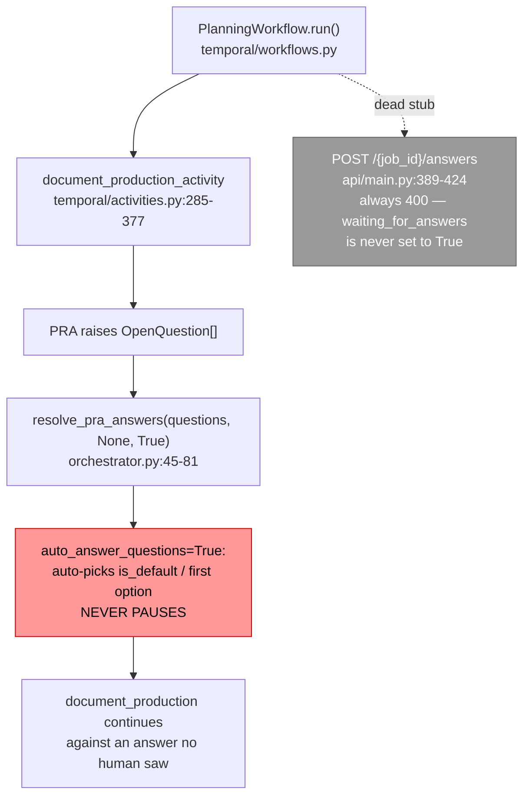

# SPEC-024: Planning Team Clarification-Question Temporal Signal/Wait Contract

| Field        | Value                                                                 |
|--------------|-----------------------------------------------------------------------|
| **Status**   | Proposed (design only — no production code in this story)             |
| **Author**   | Platform Engineering                                                  |
| **Created**  | 2026-08-29                                                            |
| **Priority** | P0 (blocks #7445-B / #7445-C)                                         |
| **Scope**    | `planning_team` Temporal workflow/activity boundary only; defines the contract, does not implement it |

> **Story note.** This spec is the output of issue #7451, the first story in the #7445 sequence
> ("Add a Temporal-durable answer-callback primitive for Planning clarification questions"). Its
> acceptance criteria require a written interface spec and explicitly forbid merging production
> code in this story. #7445-B implements the primitive this document defines; #7446 wires it into
> `temporal/activities.py`.

---

## 1. Problem Statement

`planning_team` can surface clarification questions (`OpenQuestion` /
`backend/agents/planning_team/models.py:216-244`) but has no way to actually pause a running job
and wait for a human to answer one. `resolve_pra_answers()`
(`backend/agents/planning_team/orchestrator.py:45-81`) always auto-picks the `is_default` (or
first) option whenever no `answer_callback` is supplied — and every call site, in both thread mode
(`orchestrator.py` `run_workflow`) and Temporal mode (`temporal/activities.py:320-324`,
`document_production_activity`), calls it with `auto_answer_questions=True` and no callback. A
stub answers route already exists (`api/main.py:389-424`, `POST /{job_id}/answers`) but always
returns `400`, because nothing ever sets `waiting_for_answers=True` on a Planning job record.

Temporal activities cannot natively suspend mid-execution for an arbitrary human response time —
only a *workflow* can await a signal. So before any implementation work starts, this story fixes
the shape of the solution: what the activity returns when it needs input, what the workflow waits
on, what the human's answer looks like on the wire, and how re-invocation is made idempotent.

The coding team already solved this exact problem for its own Tech-Lead clarification loop
(`SPEC-023-coding-team-human-in-the-loop.md`, `backend/agents/software_engineering_team/hitl.py`,
`pause_cycle.py`, `temporal/coding_team_workflow.py`). SPEC-023 §4.3.3 and §7 explicitly deferred
Planning's Temporal-mode pause semantics as future work. This spec is that follow-up, and its
central design decision is: **reuse that pattern verbatim rather than inventing a second one.**

---

## 2. Current State



`PlanningWorkflow` (`temporal/workflows.py`) is a plain sequential chain of
`workflow.execute_activity` calls — intake → discovery → requirements → optional market_research →
synthesis → **document_production** → sub_agent_provisioning → finalize. No `@workflow.signal`, no
`workflow.wait_condition` exists anywhere in it today.

### Reusable machinery (preserve, do not reinvent)

- `_ActivityPauseSignal` (`pause_cycle.py:36-74`) — internal exception carrying
  `{resume_token, pause_kind, pause_context, pending_questions}`, unwound at the orchestrator
  boundary into a `{"outcome": "paused", ...}` return value.
- `mint_resume_token(job_id)` (`pause_cycle.py:77-92`) — `f"{job_id}:{uuid4().hex[:12]}"`, minted
  once per pause round.
- `_check_pending_pause_reentry(job_data, acknowledged_resume_token)`
  (`pause_cycle.py:142-177`) — classifies a re-invocation as `consume=True` (token matches →
  resume) or `consume=False` (token missing/mismatched → activity retry, re-emit the same paused
  payload, do no new work).
- `submit_answers` signal (`temporal/coding_team_workflow.py:282-348`) — name, payload shape, and
  the buffering state machine (`_active_resume_token`, `_submitted_answers`,
  `_buffered_signals`) on `CodingTeamWorkflow`.
- `backend/shared/hitl/models.py` — `PendingQuestion`, `QuestionOption`, `AnswerSubmission`,
  `SubmitAnswersRequest`: the team-agnostic superset schemas, already built for exactly this kind
  of cross-team reuse.

---

## 3. Goals and Non-Goals

**Goals**
- Define the Temporal signal name and payload for delivering a human's answers to a Planning
  clarification question.
- State unambiguously which side (workflow vs. activity) owns the wait, and why.
- Define the retry/continuation shape when a clarification question is raised mid-activity.
- State explicitly how this reuses `hitl.py`/`pause_cycle.py` rather than diverging from it.
- Define Preconditions/Postconditions/Invariants the eventual primitive (#7445-B) must satisfy.

**Non-Goals** (deferred to later stories)
- Implementing the mechanism (#7445-B).
- Wiring `document_production_activity` / `resolve_pra_answers` to actually use it (#7446).
- Thread-mode (non-Temporal) pause behavior — `shared/temporal/checkpoints.py`'s `wait_for_input`/
  `submit_input` already cover that path per `shared/temporal/README.md`; this spec covers only
  the Temporal-native signal.
- UI/REST surface changes beyond noting that the existing `SubmitAnswersRequest.resume_token`
  field already accommodates this contract.

---

## 4. Detailed Design

### 4.1 Signal name and payload

Reuse the coding team's signal **verbatim** — same name, same shape:

```python
@workflow.signal(name="submit_answers")
def submit_answers(self, payload: dict[str, Any]) -> None:
    ...
```

Payload: `{"resume_token": str, "answers": list[dict]}`, where each `answers` element is
`AnswerSubmission`-shaped (`backend/shared/hitl/models.py:70-77`):
`{"question_id": str, "selected_option_id": Optional[str], "other_text": Optional[str]}` —
**extended** with a plural field, `"selected_option_ids": List[str]` (default `[]`), required for
`allow_multiple=True` questions (below).

**Contract requirement — carry every selection, not just one.** PRA's own `OpenQuestion`
(`product_requirements_analysis_agent/models.py:78`, mirrored in
`planning_team/models.py:224`) sets `allow_multiple=True` on some questions, and Planning's own
`AnsweredQuestion` model already has both `selected_option_id` *and* `selected_option_ids: List[str]`
(`planning_team/models.py:241-242`) for exactly this reason. `shared/hitl/models.py`'s
`AnswerSubmission`, reused verbatim above, currently has **only** the singular field — reusing it
as-is for Planning would silently drop every selection but one on a multi-select question. This
contract requires extending `AnswerSubmission` with an optional `selected_option_ids: List[str] =
Field(default_factory=list)`, populated instead of (not in addition to, for that question)
`selected_option_id` when the source question has `allow_multiple=True`. This is not
Planning-specific scope creep: PRA's own answers-submission route
(`software_engineering_team/api/routes/product_analysis.py:283`) forwards only
`selected_option_id` today, from the same shared model — so this gap already exists for any
`allow_multiple` PRA question, coding-team or Planning. #7445-B/#7446 must land the
`AnswerSubmission` field addition *and* the corresponding pass-through at
`api/routes/product_analysis.py:283` together; shipping Planning's pause primitive without it would
build a new, correctly-plumbed pause/resume path on top of a wire format that still can't carry a
multi-select answer through to PRA.

**Why the same name, not `planning_submit_answers` or similar:** `backend/shared/hitl/models.py`
was deliberately built as a cross-team superset so both teams share one vocabulary. A single
signal name across teams means any future workflow that hosts both a coding-team-style gate and a
planning-style gate (SPEC-023 §4.3.3 flags `RunTeamWorkflowV2` as exactly this case) needs no
signal-name disambiguation. Each `PlanningWorkflow` instance is its own Temporal workflow run, so
there is no name collision risk within one workflow's signal namespace — reuse costs nothing here.

The activity's paused-return payload, symmetric with the coding team's:

```python
{
    "outcome": "paused",
    "job_id": str,
    "resume_token": str,               # mint_resume_token(job_id)
    "pause_kind": "planning_clarification",
    "pause_context": None,             # Planning has one clarification gate per job, no per-task
                                        # sub-context analogous to coding-team worker escalation
    "pending_questions": [...],        # PendingQuestion-shaped dicts, converted from OpenQuestion
}
```

`pause_kind` is a **new** value (`"planning_clarification"`), not one of the coding team's three
(`entry` / `tech_lead_clarify` / `worker_escalation`) — Planning has exactly one clarification
gate (the `document_production_activity` phase where PRA raises questions), so one kind is
sufficient; it need not fit the coding team's per-source taxonomy. `pause_context` is `None`
because Planning has no sub-task identifier equivalent to the coding team's `task_ids` — the whole
job is what's paused.

### 4.2 Which side owns the wait

**The workflow (`PlanningWorkflow`) owns `workflow.wait_condition`.** Activities cannot pause —
`document_production_activity` must return promptly with the `outcome: "paused"` dict the moment
PRA reports unanswered questions, exactly as `run_pipeline_activity` does today
(`temporal/coding_team_workflow.py:105-247`).

`PlanningWorkflow` gains the same three instance fields as `CodingTeamWorkflow`
(`temporal/coding_team_workflow.py:277-280`):

```python
self._active_resume_token: str | None = None
self._submitted_answers: list[dict[str, Any]] | None = None
self._buffered_signals: dict[str, list[dict[str, Any]]] = {}
```

and the identical signal-handler rules (`temporal/coding_team_workflow.py:282-348`):
- No active pause yet → buffer the payload under its own `resume_token` in `_buffered_signals`
  (an early signal beat the workflow arming the wait).
- Active pause but token mismatch → ignore (stale/duplicate).
- Active pause, matching token, first submission → set `_submitted_answers` (the sole
  `wait_condition` predicate).
- Arming a new pause consumes any matching buffered entry immediately and discards every other
  buffered entry (bounds memory across pause rounds).

This is a **copy, not a redesign** — the state machine is proven (see the integration tests listed
in §6) and Planning's clarification gate has no property that would require a different one.

### 4.3 Retry/continuation shape

`PlanningWorkflow.run` wraps the `document_production_activity` call in the same loop shape as
`CodingTeamWorkflow.run` (`temporal/coding_team_workflow.py:546-579`):

```python
while result.get("outcome") == "paused":
    self._active_resume_token = resume_token
    self._submitted_answers = self._buffered_signals.pop(resume_token, None)
    self._buffered_signals.clear()
    await workflow.wait_condition(lambda: self._submitted_answers is not None)
    request["acknowledged_resume_token"] = self._active_resume_token
    self._submitted_answers = None
    self._active_resume_token = None
    result = await workflow.execute_activity(
        document_production_activity, request, start_to_close_timeout=activity_timeout
    )
    request.pop("acknowledged_resume_token", None)
```

`document_production_activity` becomes idempotent on re-entry using
`_check_pending_pause_reentry` (`pause_cycle.py:142-177`) unchanged:
- No persisted pause on the job record → proceed normally.
- `acknowledged_resume_token` matches the persisted token → genuine resume; clear the pause
  envelope, apply the now-answered questions via `resolve_pra_answers(..., answer_callback=<from
  job record>)`, and continue past the point PRA raised them.
- Token missing/mismatched but a pause is persisted → this is a pre-work activity retry (e.g.
  Temporal retried the activity after it persisted-but-not-yet-returned the pause); re-emit the
  exact same `{"outcome": "paused", ...}` payload unchanged, doing no new PRA work.

**Answers must be persisted before the signal, not carried by it.** The `submit_answers` payload
(§4.1) is the *wake-up*, not the sole record of the answer — mirroring
`coding_team_hitl.submit_pending_answers` (`api/routes/coding_team_hitl.py:20-71`) exactly: that
route calls `_main.store_append_submitted_answers(job_id, answers)` (persisting the validated
`AnswerSubmission` list to the job record) *before* it calls `signal_workflow_sync(..., "submit_answers",
{"resume_token": resume_token, "answers": answers})`. The workflow-side loop in this section
deliberately drops `self._submitted_answers` after `wait_condition` returns (it only forwards
`acknowledged_resume_token`, matching `CodingTeamWorkflow.run` field-for-field) — the resumed
activity is expected to read the answers back from the job record, not from the signal payload.
Planning's answer-submission path (whatever replaces the currently-stubbed `POST
/{job_id}/answers`, `api/main.py:389-424`) MUST perform the same "persist-then-signal" write —
appending to a `submitted_answers` job-record field — before delivering the `submit_answers`
signal; this is a required part of the contract, not an implementation detail #7445-B is free to
skip. Without it, `resolve_pra_answers(..., answer_callback=<from job record>)` on resume has
nothing to read and the resume path silently regresses to auto-answering.

**Persisted answers must be scoped to the active question round, not accumulated across rounds.**
Unlike the coding team's single Tech-Lead clarify loop, a single `document_production_activity`
run can pass through PRA's `wait_pra` poll loop (`adapters/product_analysis.py:80-106`) more than
once if PRA raises more than one round of questions before completing — each `_on_poll` invocation
calls `answer_callback(pending)` again for whatever `pending_questions` PRA reports *at that
moment*. If `submit_answers` naively **appends** every batch to one flat `submitted_answers` list
and the resume-path callback naively returns the *entire* accumulated list, a later round's
callback re-submits an earlier round's already-consumed `question_id`s alongside the new ones.
PRA's own answers endpoint (`POST .../product-analysis/{job_id}/answers`) rejects a submission
containing an id outside its *current* `pending_questions`; `submit_product_analysis_answers`'s
response is not checked by `_on_poll` (`adapters/product_analysis.py:96-97`) and
`wait_for_product_analysis_completion` has no failure branch for it — it simply keeps polling,
so a rejected resubmission degrades to a silent hang until `MAX_POLL_WAIT` (3600s) expires, not a
clean error.

**Contract requirement:** the answer-submission path must tag each persisted answer batch with the
`resume_token` of the pause round it resolves (not just append to one undifferentiated list), and
`resolve_pra_answers(..., answer_callback=<from job record>)` on resume must filter to *only* the
batch whose `resume_token` matches the round currently being resumed — equivalently, only answers
whose `question_id` is a member of that round's persisted `pending_questions`. Once a round's
batch has been consumed by a resume, it must be marked consumed (or moved into
`resolved_questions`, which `HandoffPackage` already carries — `planning_team/models.py:193-207`)
so a later round's callback never sees it again. This is the same token-scoping discipline §4.2
already requires of the workflow's signal handler, applied here to the job-record answer store the
activity reads from.

**Recommended shape (decision for #7445-B, not mandated here):** store `submitted_answers` keyed
by `resume_token` — `{"<resume_token>": [AnswerSubmission, ...]}` — rather than one flat list, so
"only this round's answers" is a single dict lookup rather than a filter over question ids that
could theoretically collide across rounds.

**Recommended extraction (decision for #7445-B, not mandated here):** `mint_resume_token` and
`_check_pending_pause_reentry` have no coding-team-specific logic — they operate purely on a job
record dict and a resume token. #7445-B should consider extracting them from
`software_engineering_team/pause_cycle.py` into a new `backend/shared/hitl/pause_cycle.py`
(alongside the existing `shared/hitl/models.py`), so Planning **imports** the primitive rather than
duplicating it or reaching across team boundaries into `software_engineering_team`. This spec does
not mandate the extraction's exact shape — only that Planning's implementation must not diverge in
behavior from what's documented in §4.4 below, however the code ends up organized.

### 4.3.1 Checkpointing the external PRA run before pausing

The coding team's pause cycle unwinds a stack frame entirely internal to the activity's own
process — nothing external needs to be told "this is still the same run." Planning's clarification
gate is different: `document_production_activity` → `run_document_production` →
`DocumentProductionAgent.run` (`agents/document_production/agent.py:91-94`) calls
`job_id = run_pra(repo_path=..., spec_content=...)` to **submit a new external Product Requirements
Analysis job**, then `wait_pra(job_id=job_id, answer_callback=...)` polls it. If
`document_production_activity` is simply re-invoked from the top on resume — the way
`run_pipeline_activity` is for the coding team — it re-executes `run_document_production` from
scratch, which calls `run_pra(...)` again: a **second** external PRA job is submitted, the
original (already-answered) PRA job is stranded, and PRA-side side effects are duplicated. This is
a real gap the coding-team pattern does not have to solve and this contract must.

**Contract requirement — checkpoint eagerly, not at the pause point.** The checkpoint must be
written the moment the external PRA job id is obtained — immediately after `run_pra(...)` returns,
**before** `wait_pra(...)` is ever called — as its own atomic `update_job` call via
`shared/temporal/checkpoints.py`'s `save_checkpoint("planning_team", planning_job_id,
"document_production_pra", {"pra_job_id": pra_job_id})` (`shared/temporal/README.md`
§"Checkpoints and human-in-the-loop"). This is a deliberate change from binding the checkpoint to
the pause envelope: PRA may run to completion **without ever pausing** (no clarification needed),
so a checkpoint written only at the pause point would never exist on the un-paused path, and a
worker crash *before* any pause is reached (activity retried, or the workflow re-invokes with no
`acknowledged_resume_token` at all) would still resubmit PRA with no checkpoint to prevent it.
Writing the checkpoint unconditionally and immediately closes that gap regardless of whether this
run ever pauses.

Symmetrically, **every entry into `document_production_activity`** — a fresh run, a Temporal-level
activity retry, or a workflow-driven resume — must `load_checkpoint("planning_team",
planning_job_id, "document_production_pra")` *before* deciding whether to call `run_pra(...)`: a
present checkpoint means "PRA already submitted for this job," full stop, independent of whether a
pause envelope also happens to be persisted. When present, call `wait_pra(job_id=<checkpointed
pra_job_id>, answer_callback=...)` directly — **never** call `run_pra(...)` again for this job. This
makes checkpoint-presence, not the pause envelope, the single source of truth for "already
submitted," and removes any need for the checkpoint and pause-envelope writes to be one atomic
update — the checkpoint alone is sufficient to prevent resubmission at every re-entry, no matter
which write reached durable storage last. The pause envelope's own write (`waiting_for_answers`,
`resume_token`, `pause_kind`, `pause_context`, `pending_questions`) remains a separate atomic
`update_job` call, made only once PRA actually raises unanswered questions, and continues to be
read via `_check_pending_pause_reentry` (§5) exactly as before.

Note the two distinct ids throughout: `planning_job_id` (the Planning job this activity/workflow is
running for — what `job_id`/`load_checkpoint`/`save_checkpoint` key on) and `pra_job_id` (the
external PRA job id returned by `run_pra(...)`, carried only inside the checkpoint payload). The
checkpoint must be read/written via the Planning job-store's own team namespace, `"planning_team"`
— matching `get_job_service_client(team="planning_team")` in
`planning_team/shared/job_store.py:25` — **not** `"planning"`; using the wrong team argument
addresses a different job-service partition and the checkpoint would never be visible from the
Planning job record on any later read.

This requires `run_document_production` / `DocumentProductionAgent.run` to accept an optional
pre-existing PRA `job_id` and skip submission when one is supplied (implementation shape for
#7445-B; the contract here is only that resubmission must not happen, ever, once a checkpoint
exists).

**Residual risk this alone does not close — the crash window between `run_pra` returning and the
checkpoint write landing.** Writing the checkpoint "immediately after `run_pra` returns" narrows
the unprotected window to a single in-process gap, but does not eliminate it: a worker can still
die after `run_pra(...)` has created the external job and before `save_checkpoint(...)` durably
persists its id. `run_product_analysis` (`adapters/product_analysis.py:33-48`) is a plain POST with
no idempotency key and no reconciliation lookup, so on retry the activity finds no checkpoint and
submits a second PRA job — genuinely indistinguishable, from Planning's side, from a first
submission. **Closing this completely requires PRA's own `/product-analysis/run` endpoint to accept
a client-supplied idempotency key** (or expose a way to look up an existing job by one), which is
outside `planning_team`'s boundary and this spec's stated scope — it is software_engineering_team's
endpoint. This spec cannot mandate a fix on the other side of that boundary; it can only avoid
making the gap worse and say plainly what closes it.

**Contract requirement given that constraint:** until PRA supports an idempotency key, the PRA
*submission* itself (`run_pra(...)` through the eager `save_checkpoint` write, and nothing else)
must run as its own narrowly-scoped step under **`NO_RETRY`** — not the bounded/default retry
policy recommended below for the rest of the activity. A crash in that narrow window fails the
workflow cleanly (loud, visible, needing a human/operator to reconcile or restart the job) rather
than silently duplicating a PRA job. Everything *after* a checkpoint exists — `wait_pra` polling,
pause, resume, and the rest of `document_production_activity` — is safe to retry freely, because
those steps only ever consult the checkpoint and never resubmit. Whether this narrow step is its
own separately-scheduled Temporal activity (cleanest: its `NO_RETRY` failure surfaces as a distinct,
diagnosable workflow-task error) or an in-process code path inside the same activity function
guarded by application-level "do not retry past this point" logic is an implementation choice for
#7445-B; the contract only fixes the retry-policy asymmetry (retryable after the checkpoint exists,
not retryable for the submission step itself) and flags PRA-side idempotency as the complete fix,
tracked as an open item alongside the unbounded-`wait_condition` risk already carried in this
section (below).

**Contract requirement — the activity must actually be retryable (past the submission step).**
`PlanningWorkflow`'s current
`workflow.execute_activity(document_production_activity, ..., retry_policy=NO_RETRY)`
(`temporal/workflows.py:189-195`) means a worker crash mid-activity fails the whole workflow rather
than letting Temporal re-invoke the activity — unlike the coding team, whose
`workflow.execute_activity(run_pipeline_activity, request, start_to_close_timeout=activity_timeout)`
(`temporal/coding_team_workflow.py:546-551, 574-578`) passes **no** `retry_policy` override at all,
so it runs under the SDK's default retryable policy. Because this contract makes the activity
idempotent on re-entry — past the submission step above — via the eager checkpoint and
`_check_pending_pause_reentry` (§5), the rest of `document_production_activity` must adopt the same
posture: #7445-B must either drop the `NO_RETRY` override for this activity (matching the coding
team default) or apply an explicit bounded retry policy no more restrictive than `SAFE_RETRY`
(`temporal/workflows.py:53-54`, already used by every other retryable phase in this same workflow).
Blanket `NO_RETRY` for the whole activity must not remain once the pause contract lands —
otherwise Temporal never exercises the "pre-work activity retry" reentry path this spec (§5)
requires the activity to handle correctly — but the narrow PRA-submission step above is the one
deliberate exception, kept at `NO_RETRY` until PRA supports an idempotency key.

**Postcondition this adds to §5:** every entry into `document_production_activity` — fresh run,
Temporal-driven retry, or workflow-driven resume — must consult the PRA checkpoint before calling
`run_pra`, and must never call it a second time once a checkpoint for this job exists; the PRA
submission step itself (through the checkpoint write) runs under `NO_RETRY`; everything after a
checkpoint exists runs under a retry policy that actually permits Temporal to re-invoke it after a
worker crash (not `NO_RETRY`), since retry-then-reentry is the mechanism this contract relies on
for crash recovery there.

### 4.3.2 Rollout compatibility for the activity signature change

`document_production_activity` is currently called with three positional args —
`args=[job_id, repo_path, ...]`-style, matching every other per-phase activity in this workflow
(`temporal/workflows.py:142-215`, e.g. `intake_activity` at :142-146) — not the single `request`
dict this contract's retry/continuation loop (§4.3) needs in order to carry
`acknowledged_resume_token`. Changing the activity's calling signature is itself a workflow-history
compatibility hazard, independent of the pause feature: a `PlanningWorkflow` execution whose
history was recorded *before* the signature change (i.e., it already scheduled
`document_production_activity` with the old three-positional-arg shape) must replay
deterministically against a worker that has since deployed the new dict-based call — Temporal
requires the *same sequence of commands* on replay, and a changed argument shape for the same
activity name is exactly the kind of non-deterministic edit `workflow.patched` exists to guard.

**Contract requirement:** gate the signature change behind `workflow.patched(...)`, the same
mechanism `PlanningWorkflow` already uses for its own prior migration (`_PER_PHASE_PATCH`,
`temporal/workflows.py:122-140` — "A `PlanningWorkflow` execution started before the per-phase
migration... replays the legacy single-activity path via the `workflow.patched` gate"). A new
patch marker (e.g. `_CLARIFICATION_PAUSE_PATCH`) selects between the old call shape (for histories
recorded before this feature ships) and the new `request`-dict call (for new/patched executions),
exactly mirroring how `_PER_PHASE_PATCH` already lets old and new histories coexist during a
rollout. This is not a new mechanism to invent — it is the existing rollout tool for this exact
class of problem, reused a second time in the same workflow.

**`workflow.patched` alone is not sufficient — the activity worker needs its own compatibility
path.** `workflow.patched` only governs what a *workflow* schedules on replay; it says nothing
about the activity *worker* process. During a rolling deploy, an activity task already enqueued
under the old three-positional-arg shape (scheduled by an old-code workflow execution before the
new worker version rolled out) can be picked up by a worker that has already registered the new
dict-only `document_production_activity` implementation — invocation fails before any workflow
code (patched or not) gets a chance to run, and under the activity's current `NO_RETRY` (§4.3.1)
that failure fails the whole workflow. **Contract requirement:** the activity function itself must
accept both call shapes — either a compatibility decoder at the top of
`document_production_activity` that detects the old three-positional-arg invocation and normalizes
it into the same `request` dict the rest of the function expects, or registering the new dict-based
behavior under a distinct `@activity.defn(name=...)` (e.g. `planning_document_production_v2`) while
the old name/signature stays registered and callable until the task queue has drained of old-shape
tasks. `workflow.patched` and this activity-level decoding are both required, addressing two
different compatibility surfaces (workflow replay vs. activity worker invocation) — neither
substitutes for the other.

### 4.4 Explicit hitl.py / pause_cycle.py reuse statement

This design reuses, unmodified in behavior:
- The `_ActivityPauseSignal`-style unwind: an internal control-flow signal raised deep inside the
  document-production call path, caught at the activity function's own boundary and translated
  into the `{"outcome": "paused", ...}` return value — never propagated further.
- `mint_resume_token`'s exact format and one-mint-per-pause-round rule.
- `_check_pending_pause_reentry`'s three-way classification (no pause / consume / re-emit
  unchanged).
- The job-record pause envelope field names: `waiting_for_answers`, `resume_token`, `pause_kind`,
  `pause_context`, `pending_questions` — Planning's job store (`job_store.py:45-46`) already seeds
  `pending_questions: []` and `waiting_for_answers: False` on every record, so no new fields are
  needed, only new writers.
- The `submit_answers` signal name and payload shape (§4.1).
- The workflow-side wait/buffer state machine (§4.2), copied field-for-field.
- The persist-then-signal answer-submission pattern from
  `coding_team_hitl.submit_pending_answers` (`api/routes/coding_team_hitl.py:20-71`): append
  validated answers to the job record, then signal — never the reverse, never signal-only (§4.3).
- `workflow.patched` for rollout compatibility (§4.3.2) — `PlanningWorkflow`'s own existing
  `_PER_PHASE_PATCH` mechanism, applied a second time rather than inventing a new versioning
  approach.

The only Planning-specific pieces are:
1. **Which activity calls the pause cycle** — `document_production_activity`
   (`temporal/activities.py:285-377`) instead of the coding team's planning/execution activities.
2. **The question source feeding it** — `OpenQuestion` / `resolve_pra_answers`
   (`planning_team/orchestrator.py:45-81`, `planning_team/models.py:216-244`) instead of Tech Lead
   clarify / worker escalation. `OpenQuestion` → `PendingQuestion` conversion is a straightforward
   field mapping (both already share `id`/`question_text`/`context`/`options` shapes); this is
   implementation detail for #7445-B, not a contract decision.
3. **One new `pause_kind` value** (`"planning_clarification"`) rather than reusing one of the
   coding team's three — see §4.1's rationale.
4. **An added external-job checkpoint** (§4.3.1): the coding team's pause has no equivalent,
   because its pause boundary never crosses into a separate external job. Planning's does (PRA), so
   this contract adds `save_checkpoint`/`load_checkpoint` (`shared/temporal/checkpoints.py`) around
   the PRA job id specifically to prevent resubmission on resume. This is a genuine addition to the
   coding-team pattern, not a divergence from it — it uses machinery the platform already documents
   as the sanctioned tool for exactly this ("phase boundaries inside an activity so a retried
   workflow can skip completed phases").
5. **Round-scoped answer persistence** (§4.3): the coding team's Tech-Lead clarify loop is
   effectively single-round per pause; Planning's PRA integration can raise multiple question
   rounds within one activity run, so the persisted `submitted_answers` must be scoped per
   `resume_token` rather than accumulated into one undifferentiated list — otherwise a later
   round's callback can resubmit an earlier round's already-consumed answers.
6. **A retry-policy correction, not an addition** (§4.3.1): `document_production_activity`
   currently runs under `NO_RETRY`; this contract requires dropping that override (or replacing it
   with `SAFE_RETRY`) so it matches the coding team's own default-retryable posture for
   `run_pipeline_activity` — Planning's current setting is the outlier, not the coding-team
   pattern.

No divergent mechanism is introduced anywhere in this design.

---

## 5. Contract: Preconditions / Postconditions / Invariants

The primitive #7445-B builds must satisfy:

**`document_production_activity` (entry — every invocation, paused or not)**
- *Preconditions:* Called with a `request` dict optionally carrying `acknowledged_resume_token`
  (subject to the `workflow.patched` rollout gate, §4.3.2); the `"planning_team"`-namespaced job
  record for `request["job_id"]` is readable; runs under a retry policy other than `NO_RETRY`
  (§4.3.1 — `SAFE_RETRY` or the SDK default).
- *Postconditions:* Before ever calling `run_pra(...)`, the activity checks
  `load_checkpoint("planning_team", job_id, "document_production_pra")`. If present, it calls
  `wait_pra(job_id=<checkpointed pra_job_id>, ...)` directly. If absent, it calls `run_pra(...)`
  and, immediately upon receiving the external `pra_job_id` — before `wait_pra` is invoked —
  persists `save_checkpoint("planning_team", job_id, "document_production_pra", {"pra_job_id":
  ...})` as its own atomic write.
- *Invariants:* `run_pra` is called at most once per Planning `job_id`, ever — every subsequent
  entry (fresh call, Temporal retry, or workflow-driven resume) is required to find the checkpoint
  and reuse it.

**`document_production_activity` (paused-return path)**
- *Preconditions:* PRA reports unanswered `OpenQuestion`s and no matching persisted pause is being
  resumed (per `_check_pending_pause_reentry`, §4.3).
- *Postconditions:* The activity persists `{waiting_for_answers: True, resume_token, pause_kind:
  "planning_clarification", pause_context: None, pending_questions}` to the job record as its own
  atomic `update_job` call (separate from, and after, the checkpoint write above — no longer
  required to be combined with it, since checkpoint-presence alone already prevents resubmission),
  then returns (does not raise) `{"outcome": "paused", "job_id", "resume_token", "pause_kind",
  "pause_context", "pending_questions"}` — no further job-store read or blocking call past that
  point.
- *Invariants:* The activity never blocks waiting for a human answer. It is safe to call multiple
  times for the same `job_id`/pause round: a call that finds a persisted pause whose token does not
  match `acknowledged_resume_token` re-emits the same paused payload unchanged, performing no new
  PRA work and no duplicate persistence.

**`document_production_activity` (resume path)**
- *Preconditions:* `request["acknowledged_resume_token"]` equals the job record's persisted
  `resume_token`; the job record's answer store (persisted by the answer-submission path *before*
  it signaled — §4.3) carries a batch tagged with that same `resume_token` covering every question
  in `pending_questions`; a PRA-job-id checkpoint for this job is present (§4.3.1).
- *Postconditions:* The pause envelope (`waiting_for_answers`, `resume_token`, `pause_kind`,
  `pause_context`, `pending_questions`) is atomically cleared from the job record; PRA continues
  past the clarification point using **only** the answer batch tagged with the resumed
  `resume_token` (never the full accumulated answer history, never the signal payload directly)
  fed through `resolve_pra_answers(..., answer_callback=<from job record, filtered to this
  round>)`; that consumed batch is marked consumed (or moved into `resolved_questions`) so a later
  round's callback never sees it again; `wait_pra` is resumed against the checkpointed external PRA
  job id — `run_pra` is not called again; the activity proceeds to its normal terminal return
  shape (or pauses again, for the next round, per the paused-return path above).
- *Invariants:* A resume is applied at most once per `resume_token` — re-invocation with the same
  already-consumed token must not re-apply answers or re-run already-completed work (idempotent
  resume). No resume path may submit a second external PRA job for the same Planning job. A
  resumed round's answer_callback never returns an answer belonging to a different `resume_token`.

**`PlanningWorkflow.submit_answers` (signal handler)**
- *Preconditions:* None on the caller — a signal handler must accept any payload without raising
  (Temporal signal handlers cannot reject a signal back to the sender).
- *Postconditions:* A payload whose `resume_token` matches `self._active_resume_token` and is the
  first such match sets `self._submitted_answers`; every other payload shape (no active pause, or
  mismatched, or duplicate token) is either buffered (no active pause yet) or silently ignored
  (mismatched or duplicate), never raises, never sets `_submitted_answers` a second time for one
  round.
- *Invariants:* `self._buffered_signals` holds at most one entry per distinct `resume_token` seen
  while no pause was active; every entry is discarded the moment a new pause is armed and its
  matching entry (if any) is applied — the dict cannot grow unbounded across a long-running
  workflow's many pause rounds.

**Open risks, not resolved by this spec:**
1. *Carried over from `hitl_pause_resume_contract.md` §4:* `workflow.wait_condition` here is
   unbounded — no timeout and no reconciliation against job-record cancellation. #7445-B inherits
   this exact caveat from the coding-team implementation; it is not a new gap introduced by
   Planning reuse, and remains open future work for both teams alike.
2. *New to this spec, cross-team:* PRA submission (`run_pra`/`run_product_analysis`) has no
   idempotency key, so a worker crash in the narrow window between `run_pra` returning and the
   checkpoint write landing (§4.3.1) can still produce a duplicate external PRA job — mitigated
   here by keeping that narrow step `NO_RETRY`, but not eliminated. Full closure requires
   `software_engineering_team`'s `/product-analysis/run` endpoint to accept a client-supplied
   idempotency key or equivalent reconciliation lookup; that is outside `planning_team`'s boundary
   and this spec's stated scope, and is flagged here as a prerequisite for fully retryable PRA
   submission rather than something #7445-B can close alone.

---

## 6. References

- `system_design/specs/SPEC-023-coding-team-human-in-the-loop.md` — the direct precedent this spec
  extends to Planning.
- `backend/agents/software_engineering_team/system_design/hitl_pause_resume_contract.md` — the
  detailed contract doc for the coding-team primitive being reused.
- `backend/agents/software_engineering_team/hitl.py`, `pause_cycle.py`,
  `temporal/coding_team_workflow.py`, `api/routes/coding_team_hitl.py` — the implementation being
  mirrored, including the persist-then-signal answer-submission route (§4.3).
- `backend/shared/hitl/models.py` — the shared `PendingQuestion`/`AnswerSubmission`/
  `SubmitAnswersRequest` schemas this contract reuses.
- `backend/shared/temporal/README.md` / `checkpoints.py` — `save_checkpoint`/`load_checkpoint`
  (used in §4.3.1 for the PRA-job checkpoint) and the sanctioned thread-mode equivalent
  (`wait_for_input`/`submit_input`), out of scope here but the natural companion for non-Temporal
  callers.
- `backend/agents/planning_team/orchestrator.py`, `models.py`, `temporal/workflows.py`
  (retry policies at :53-74, `_PER_PHASE_PATCH` at :114-140, `document_production_activity` call
  at :189-197), `temporal/activities.py`, `api/main.py`, `job_store.py`,
  `agents/document_production/agent.py`, `phases/document_production.py`,
  `adapters/product_analysis.py` (`wait_for_product_analysis_completion`'s multi-round poll loop,
  §4.3) — the Planning-side files this contract will be implemented against in #7445-B/#7446.
- Integration tests demonstrating the exact signal/wait pattern end-to-end (worth mirroring for
  Planning's own test suite in #7445-B):
  `backend/agents/software_engineering_team/tests/test_coding_team_temporal_workflow.py`
  (`test_workflow_pauses_then_resumes_to_completion_via_signal`,
  `test_workflow_survives_worker_restart_while_paused_with_buffered_signal`,
  `test_workflow_resumes_via_early_signal_buffered_before_pause_processed`).
