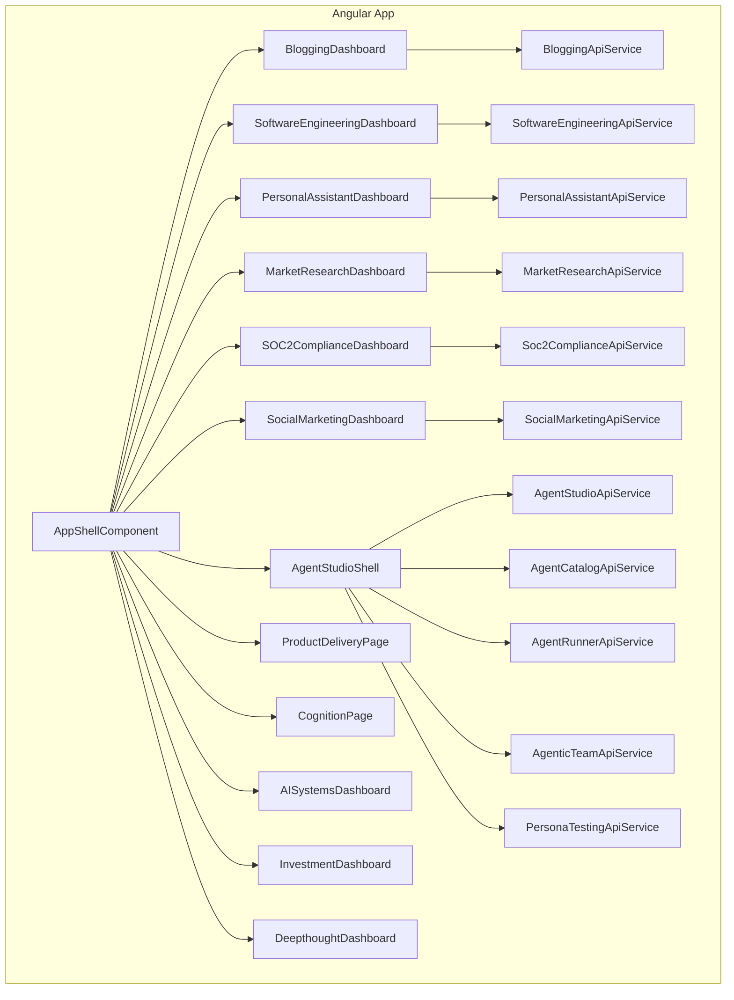
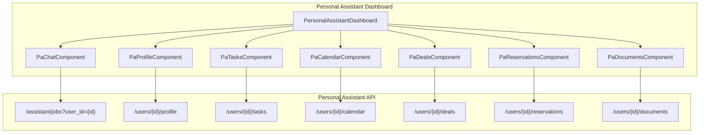

# Architecture

## Overview

The user interface is an Angular 19 standalone application that connects to multiple agent APIs. Each API has a dedicated feature area with forms, results display, and health indicators. The sidebar navigation is data-driven via `NAV_GROUPS` in `models/navigation.model.ts`.

**Agent Studio** (`/agent-studio`) is the single Agentic AI product entry point. All agent authoring, testing, team composition, and persona-driven validation flows are accessed exclusively through Agent Studio's 4-stage workflow. The legacy standalone routes (`/agent-console`, `/agentic-teams`, `/persona-testing`) have been removed and their components consolidated into Agent Studio's stages — catalog and runner components are reused in Build/Test, team composition in Compose, and persona testing in Persona.

## High-Level Structure

## Routing

- `/` redirects to `/dashboard` (Jobs Dashboard)
- `/dashboard` – Jobs Dashboard
- `/blogging` – Blogging landing; `/blogging/dashboard` – Pipeline Dashboard
- `/software-engineering` – Software Engineering overview
- `/software-engineering/planning` – Planning
- `/software-engineering/coding-team` – Coding Team
- `/software-engineering/code-review` – Code Review
- `/market-research` – Market Research
- `/soc2-compliance` – SOC2 Compliance
- `/social-marketing` – Social Marketing
- `/branding` – Branding
- `/personal-assistant` – Personal Assistant (chat, profile, tasks, calendar, deals, reservations, documents)
- `/accessibility` – Accessibility Audit
- `/agent-studio` – Agent Studio (4-stage build/test/compose/persona workflow)
- `/agent-studio/provisioning` – Provisioning & Environments
- `/agent-studio/metrics` – Metrics
- `/product-delivery` – Product Delivery (Backlog, Sprints, Feedback)
- `/cognition` – Cognition
- `/ai-systems` – AI Systems
- `/investment` – Investment; `/investment/advisor` – Advisor & IPS; `/investment/strategy-lab` – Strategy Lab
- `/startup-advisor` – Startup Advisor
- `/sales` – Sales
- `/deepthought` – Deepthought
- `/road-trip-planning` – Road Trip Planning
- `/job-matching` – Job Matching
- `/integrations` – Integrations
- `/user-profile` – User Profile
- `/llm-config` – LLM Provider configuration
- `/llm-usage` – LLM Usage

All feature routes are lazily loaded; the initial bundle ships only the app shell.

### Deleted routes (cutover complete)

The following legacy routes and their container shells have been removed:

- `/agent-console` – shell deleted; child components reused within Agent Studio
- `/agentic-teams` – shell deleted; replaced by Agent Studio Stage 3 (Compose)
- `/persona-testing` – shell deleted; replaced by Agent Studio Stage 4 (Persona)
- `/agent-provisioning` – route removed; the `AgentProvisioningDashboardComponent` was moved (not deleted) to `/agent-studio/provisioning`

### UX cutover checklist

All cutover items are complete. Agent Studio is the single Agentic AI product entry.

- [x] Legacy route shells removed (`/agent-console`, `/agentic-teams`, `/persona-testing`)
- [x] Provisioning moved under `/agent-studio/provisioning`
- [x] Sidebar nav updated — `NAV_GROUPS` lists Agent Studio as the top-level Agentic AI entry
- [x] Docs and nav copy describe Agent Studio as the single product entry
- [x] No stale references to removed surfaces remain in docs

## Core Modules

### `core/`

- **error-handler.interceptor.ts** – Catches HTTP errors, shows MatSnackBar, rethrows for caller handling

### `shared/`

- **loading-spinner** – Reusable loading indicator
- **error-message** – Inline error display

### `models/`

TypeScript interfaces mirroring backend Pydantic models for type-safe API calls.

### `services/`

One service per API domain. Key services include:

- `BloggingApiService`
- `SoftwareEngineeringApiService`, `CodingTeamApiService`, `PlanningApiService`
- `PersonalAssistantApiService`
- `MarketResearchApiService`
- `Soc2ComplianceApiService`
- `SocialMarketingApiService`
- `AgentStudioApiService`, `AgentCatalogApiService`, `AgentRunnerApiService`
- `AgenticTeamApiService`, `PersonaTestingApiService`, `TeamAssistantApiService`
- `AgentProvisioningApiService`
- `AISystemsApiService`, `CognitionApiService`, `DeepthoughtApiService`
- `InvestmentApiService`, `StartupAdvisorApiService`, `SalesApiService`
- `AccessibilityApiService`, `BrandingApiService`
- `JobMatchingApiService`, `RoadTripPlanningApiService`
- `IntegrationsApiService`, `LlmConfigApiService`, `LlmUsageApiService`, `UserProfileApiService`

## Feature Structure

Each feature follows the same pattern:

1. **Dashboard component** – Container with tabs or sections
2. **Form component(s)** – Collect request payload, emit on submit
3. **Results/status component(s)** – Display response, poll when needed
4. **Health indicator** – Calls `GET /health` for the API

## Agent Studio

The Agent Studio (`/agent-studio`) is a 4-stage workflow shell that replaced the legacy `AgentConsoleComponent`, `AgenticTeamDashboardComponent`, and `PersonaTestingDashboardComponent`:

1. **Build** – Author or clone an agent (catalog, build assistant, save/register)
2. **Test** – Run the agent in a sandbox (agent-runner, schema-form, run-history)
3. **Compose** – Design a team roster and process DAG
4. **Persona** – Launch manual or persona-driven test runs against the team

State is managed by `AgentStudioStateService` (provided at the shell level). Child components from the former dashboards are reused within the Studio stages.

## Data Flow

1. User fills form → component emits request
2. Dashboard calls service method with request
3. Service uses `HttpClient` to call API
4. On success: dashboard stores result, passes to results component
5. On error: interceptor shows snackbar; dashboard may set inline error

## Polling

Job-based APIs (SOC2, Social Marketing, Software Engineering) use `timer(0, 60000).pipe(switchMap(...))` to poll status every 60 seconds until completed or failed.

## SSE

Software Engineering execution stream uses `EventSource` to subscribe to `GET /execution/stream` for real-time events.

## Personal Assistant Dashboard

The Personal Assistant dashboard (`/personal-assistant`) is a tabbed interface with the following sections:

### Tab Components

| Tab | Component | Features |
|-----|-----------|----------|
| **Chat** | `PaChatComponent` | Conversational interface, message history, quick actions |
| **Profile** | `PaProfileComponent` | User preferences, goals, identity, professional info |
| **Tasks** | `PaTasksComponent` | Natural language task input, task lists, completion tracking |
| **Calendar** | `PaCalendarComponent` | Event parsing from text, date/time validation |
| **Deals** | `PaDealsComponent` | Wishlist management, deal search |
| **Reservations** | `PaReservationsComponent` | Restaurant/service reservations, natural language input |
| **Documents** | `PaDocumentsComponent` | Document generation (cover letters, emails, reports) |

### Real-Time Features

- Chat uses standard request/response (not streaming)
- Profile, tasks, and other data refresh on tab activation
- Loading states with Material spinners
- Error handling via MatSnackBar
