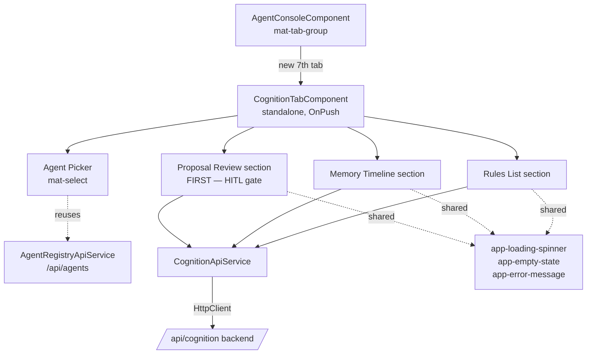
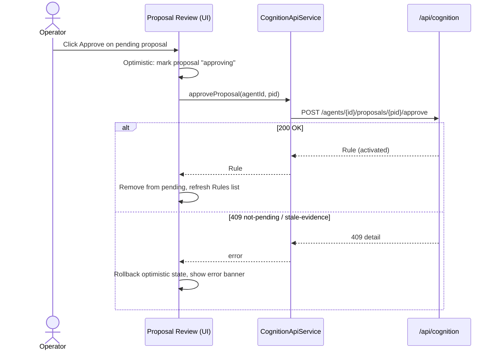

# Cognition HITL Review Panel — Design Spec

Operator surface in the Agent Console for acting on an agent's **rule proposals**
(human-in-the-loop approve / reject), and inspecting its learned **memory** and
active **rules**. This document is the design contract for the new
`CognitionTabComponent` and its sub-sections; the Figma mockups linked at the
bottom are the visual companion to the wireframes below.

## 1. Placement

A new 7th tab in the existing `AgentConsoleComponent` `mat-tab-group`, after
**Feedback**. Icon `psychology`, label **Cognition**. Tab switching stays
client-side (no new route) — identical to the Backlog / Sprints / Feedback tabs.

```
[ Catalog ] [ Runner ] [ Provisioning ] [ Backlog ] [ Sprints ] [ Feedback ] [ ⊙ Cognition ]
```

## 2. Component hierarchy



The panel is a single standalone component with three visually distinct
sections stacked vertically under one shared agent picker. **Proposal Review
leads** — it is the actionable HITL surface and the first thing an operator
sees — followed by Memory and Rules as supporting context. All cognition
endpoints are keyed by `agent_id`, so nothing renders until an agent is chosen.

## 3. Agent picker (reuses the existing catalogue)

The picker is **not** a new endpoint. It reuses the Agent Console catalogue
(`AgentRegistryApiService` → `GET /api/agents`) to list selectable agents, then
scopes every cognition request to the chosen `agent_id`.

```
┌──────────────────────────────────────────────────────────────────────┐
│  ⊙ Cognition                                                          │
│  Review an agent's pending rule proposals; inspect its memory & rules. │
│                                                                        │
│  Agent  [ ▼  backend-dev-agent (software_engineering)        ]  ⟳     │
└──────────────────────────────────────────────────────────────────────┘
```

- On first render: load catalogue, auto-select the first agent (matches the
  Backlog tab's "auto-select first product" behaviour).
- On selection change: clear section state and refetch proposals + memory +
  rules for the new `agent_id`.
- The `⟳` refresh control re-runs all three section loads for the current agent.

## 4. Proposal Review section (the HITL gate — first on the page)

The actionable core, placed first: pending `RuleProposal`s with **Approve** /
**Reject**.

```
┌─ Proposals ──────────────────────────────────────── [ Pending ▾ ]──────────┐
│                                                                             │
│ ┌─────────────────────────────────────────────────────────────────────────┐│
│ │ ADD   ● pending                                   2026-06-12 09:14       ││
│ │ Proposed rule (enforced):                                               ││
│ │   "Run `make lint-fix` before opening a PR."                            ││
│ │ Evidence: 3 refs · week rollup #2026-W24                                ││
│ │                                          [ Reject ]   [ Approve ]        ││
│ └─────────────────────────────────────────────────────────────────────────┘│
│                                                                             │
│ ┌─────────────────────────────────────────────────────────────────────────┐│
│ │ AMEND  ● pending   ⚠ stale evidence                2026-06-12 08:02      ││
│ │ Target: rule r-4821  →  replace with:                                    ││
│ │   "Cap writeback at 16 KB (was 8 KB)."                                   ││
│ │ Evidence is stale — approval is blocked until reflection refreshes it.  ││
│ │                                          [ Reject ]   [ Approve 🚫 ]      ││
│ └─────────────────────────────────────────────────────────────────────────┘│
└─────────────────────────────────────────────────────────────────────────────┘
```

Per-proposal card:
- **Action** — `ADD` / `RETIRE` / `AMEND` badge.
  - `ADD` → shows `proposed_rule` (text + mode).
  - `RETIRE` → shows `target_rule_id` (links/scrolls to the Rules section).
  - `AMEND` → shows `target_rule_id` → `proposed_rule`.
- **Status** — `pending` / `approved` / `rejected` / `superseded` chip.
- **Evidence** — count of `(summary_id, version)` refs; `stale_evidence`
  surfaces a warning chip and **disables Approve** (the backend returns `409`).
- **Decision provenance** — once decided, show `decided_by` + `decided_at`
  (both server-derived; the UI never sends an author).
- **Actions** — `Approve` (primary) and `Reject` (stroked), shown only while
  `status === 'pending'`. Approve is disabled when `stale_evidence` is true.

Filter: status `pending / approved / rejected / superseded` (default
`pending`).

### Approve / reject round-trip



- **Approve** returns the activated `Rule` → the proposal leaves the pending
  list and the Rules section refetches so the new/updated rule appears.
- **Reject** returns the updated `RuleProposal` (`status=rejected`,
  `decided_by`, `decided_at`) → the card moves to the rejected filter.
- A confirm dialog (`app-confirm-dialog`) guards both actions, since each
  deterministically mutates the agent's rule set.
- Optimistic update with rollback on error (the Backlog tab pattern); the error
  banner renders `err.error.detail` for `409` (stale evidence / not pending).

## 5. Memory Timeline section

A reverse-chronological / salience-ranked feed of `MemoryEvent`s, with a small
toolbar. Optional period **summaries** (day/week/month/year rollups) are shown
behind a scale selector when present.

```
┌─ Memory ──────────────────────────────────── [ By salience ▾ ] [ Last 50 ▾ ]─┐
│                                                                              │
│  ● tool_call   salience 0.82                          2026-06-12 14:03:11    │
│    Ran build → exit 0; 1 warning suppressed                                  │
│                                                                              │
│  ▲ error       salience 0.74                          2026-06-12 13:58:40    │
│    Lint failed on src/app/foo.ts (no-unused-vars)                            │
│                                                                              │
│  ◆ outcome     salience 0.40                          2026-06-12 13:51:02    │
│    Task merged to main after Tech Lead review                                │
│                                                                              │
│  … (scrolls)                                                                 │
└──────────────────────────────────────────────────────────────────────────────┘
```

Per-event row:
- **Kind badge** — colour-coded chip per `EventKind`
  (`observation` neutral · `action` info-blue · `tool_call` accent · `outcome`
  success-green · `error` error-red · `feedback` accent-subtle).
- **Salience** — numeric, right-aligned next to the kind; muted text.
- **Timestamp** — `occurred_at`, mono font, right-aligned.
- **Content** — `content` (one line, truncates with title tooltip); `data`
  available on row expand (collapsed by default).

Toolbar:
- **Order** — `By salience` (`by_salience=true`) vs `Most recent`
  (`by_salience=false`).
- **Count** — `top_n` selector (25 / 50 / 100).
- (Optional) **Summaries** disclosure — a `mat-expansion-panel` with a
  day/week/month/year `scale` selector that lists `PeriodSummary` cards
  (`summary`, `period_start–period_end`, `source_count`, a `stale` flag chip).

## 6. Rules List section

Active/retired `Rule`s for the agent, highest priority first.

```
┌─ Rules ───────────────────────────────────────────── [ Active ▾ ]──────────┐
│                                                                             │
│  ⚖ enforced   ▮ active   prio 90   src derived            ⚠ needs review    │
│    Never merge with failing CI.                                             │
│    rationale: derived from 6 outcome events in week rollup                  │
│                                                                             │
│  💬 advisory   ▮ active   prio 40   src operator                            │
│    Prefer signals over RxJS subjects in new components.                     │
│                                                                             │
│  💬 advisory   ▯ retired  prio 10   src seed                                │
│    (struck-through) Use NgModules for feature areas.                        │
└─────────────────────────────────────────────────────────────────────────────┘
```

Per-rule row:
- **Mode** — `enforced` (⚖, accent) vs `advisory` (💬, info) chip.
- **Status** — `active` (filled) vs `retired` (outlined, row dimmed +
  strike-through on text).
- **Priority** — `priority` numeric chip.
- **Source** — `seed` / `derived` / `operator` muted chip.
- **`needs_review`** — warning chip when true (stale evidence from a
  recomputed summary).
- **Text** — `text`; **rationale** as a secondary muted line when present.

Filter: status `all / active / retired`. Read-only section (rules are mutated
only via the proposal flow, never edited directly here).

## 7. Shared states

Every section renders one of: **loading** (`app-loading-spinner`), **empty**
(`app-empty-state`, e.g. "No pending proposals for this agent"), **error**
(`app-error-message`, mapping `400 / 404 / 409 / 503`), or **content**. `503`
(storage unavailable, e.g. `POSTGRES_HOST` unset) is surfaced panel-wide as
"Cognition storage is unavailable."

## 8. Visual language

Reuses the Agent Console dark theme tokens — no new palette:

| Token | Use |
|---|---|
| `--kh-surface-1/2/3` | card backgrounds, borders |
| `--kh-text-primary/secondary/muted` | event/rule text, metadata |
| `--kh-accent` | enforced/tool-call chips, primary actions |
| `--kh-info` | advisory/action chips |
| `--kh-success` | outcome/active chips |
| `--kh-error` | error events, error banners |
| `--kh-mono-font` | timestamps, rule/proposal IDs |

BEM naming: `.cognition-tab`, `.cognition-tab__header`, `.proposal-card`,
`.memory-event`, `.rule-row`, with state modifiers (`.is-pending`,
`.is-stale`, `.is-retired`).

## 9. Accessibility

- Each section is an `aria-labelled` region; the agent picker has an explicit
  label.
- Kind/mode/status are conveyed by **icon + text**, never colour alone.
- Approve/Reject are real `<button>`s with `aria-label` including the action
  and proposal summary; disabled-Approve carries an `aria-describedby` pointing
  at the stale-evidence note.
- Confirm dialogs trap focus (Material default).

## 10. Data model → UI mapping

| Backend model | UI surface |
|---|---|
| `RuleProposal` (`action`, `target_rule_id`, `proposed_rule`, `evidence`, `stale_evidence`, `status`, `decided_by`, `decided_at`) | Proposal cards |
| `MemoryEvent` (`kind`, `salience`, `content`, `data`, `occurred_at`) | Memory Timeline rows |
| `PeriodSummary` (`scale`, `period_start/end`, `summary`, `stale`) | Summaries disclosure cards |
| `Rule` (`mode`, `status`, `priority`, `source`, `text`, `rationale`, `needs_review`) | Rules List rows |

## 11. Figma mockups

High-fidelity visual mockup (dark `--kh-*` theme) covering the full panel —
header, agent picker, the two proposal-card states (a normal `ADD` and a
stale-evidence `AMEND` with Approve disabled), the memory timeline, and the
rules list, in page order (Proposals first):

- **File:** [Khala — Cognition HITL Review Panel](https://www.figma.com/design/KGRhpAA1PzL3LjNgEhdlIP)
- **Frame:** [Cognition Tab — Agent Console](https://www.figma.com/design/KGRhpAA1PzL3LjNgEhdlIP?node-id=4-2)

The wireframes above remain the source of truth for structure and behaviour;
Figma is the visual reference for spacing, type scale, and chip styling.
