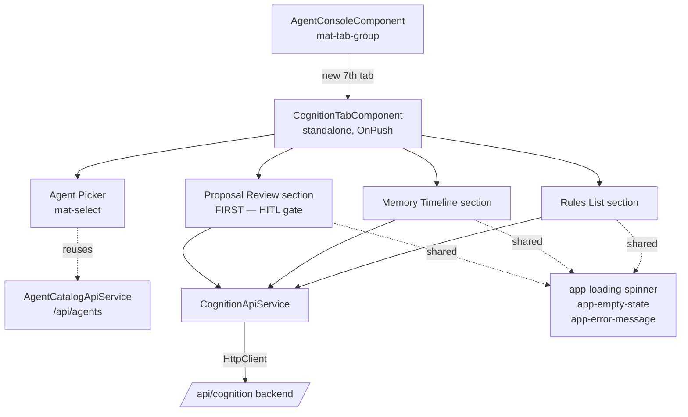
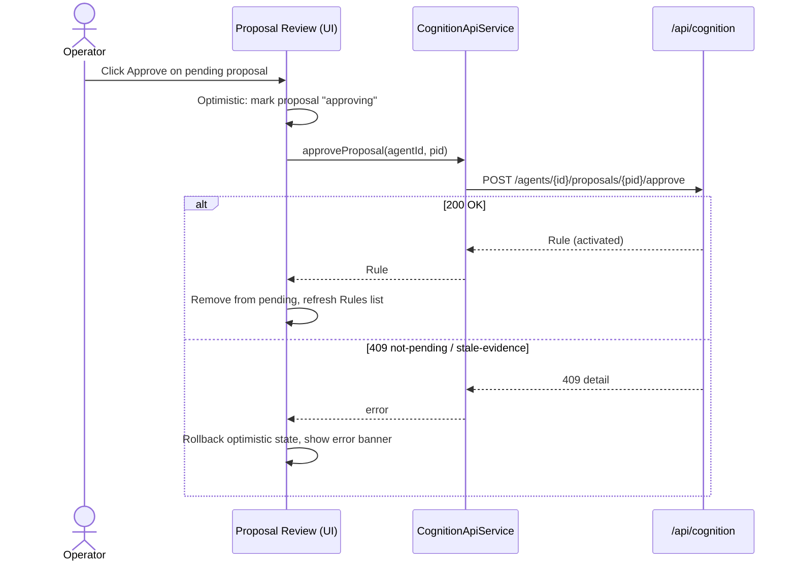

# Cognition HITL Review Panel — Design Spec

> **Note:** This spec was written when Cognition was planned as a tab inside
> the Agent Console. The Agent Console shell has since been deleted; Cognition
> now lives at its own route (`/cognition`) as a standalone page. References to
> `AgentConsoleComponent` and tab placement below are historical only.

Operator surface for acting on an agent's **rule proposals**
(human-in-the-loop approve / reject), and inspecting its learned **memory** and
active **rules**. This document is the design contract for the new
`CognitionTabComponent` and its sub-sections; the Figma mockups linked at the
bottom are the visual companion to the wireframes below.

## 1. Placement

A new 7th tab in the existing `AgentConsoleComponent` `mat-tab-group`, after
**Feedback**. Icon `psychology`, label **Cognition**. Tab switching stays
client-side (no new route) — identical to the Backlog / Sprints / Feedback tabs.

```
[ Catalog ] [ Runner ] [ Provisioning ] [ Backlog ] [ Sprints ] [ Feedback ] [ ⊙ Cognition ]
```

## 2. Component hierarchy



The panel is a single standalone component with three visually distinct
sections stacked vertically under one shared agent picker. **Proposal Review
leads** — it is the actionable HITL surface and the first thing an operator
sees — followed by Memory and Rules as supporting context. All cognition
endpoints are keyed by `agent_id`, so nothing renders until an agent is chosen.

## 3. Agent picker (reuses the existing catalogue)

The picker is **not** a new endpoint. It reuses the Agent Studio catalogue
(`AgentCatalogApiService` → `GET /api/agents`) to list selectable agents, then
scopes every cognition request to the chosen `agent_id`.

```
┌──────────────────────────────────────────────────────────────────────┐
│  ⊙ Cognition                                                          │
│  Decide which rules this agent adopts. Review the memory and rules    │
│  behind each proposal.                                                 │
│                                                                        │
│  Agent  [ ▼  backend-dev-agent (software_engineering)        ]  ⟳     │
└──────────────────────────────────────────────────────────────────────┘
```

- On first render: load catalogue, auto-select the first agent (matches the
  Backlog tab's "auto-select first product" behaviour).
- On selection change: clear section state and refetch proposals + memory +
  rules for the new `agent_id`.
- The `⟳` refresh control re-runs all three section loads for the current agent.

## 4. Proposal Review section (the HITL gate — first on the page)

The actionable core, placed first: pending `RuleProposal`s with **Approve** /
**Reject**.

```
┌─ Rule proposals ─────────────────────────────────── [ Pending ▾ ]──────────┐
│                                                                             │
│ ┌─────────────────────────────────────────────────────────────────────────┐│
│ │ new rule   ● pending                              2026-06-12 09:14       ││
│ │ New enforced rule:                                                      ││
│ │   "Run `make lint-fix` before opening a PR."                            ││
│ │ Evidence: 3 observations · week of Jun 9                                ││
│ │                                          [ Reject ]   [ Approve ]        ││
│ └─────────────────────────────────────────────────────────────────────────┘│
│                                                                             │
│ ┌─────────────────────────────────────────────────────────────────────────┐│
│ │ amend rule  ● pending   ⚠ evidence outdated        2026-06-12 08:02      ││
│ │ Replaces: "Cap writeback at 8 KB."                                      ││
│ │ With:     "Cap writeback at 16 KB."                                     ││
│ │ Evidence is out of date. Approval is paused until the agent re-checks   ││
│ │ it.                                                                     ││
│ │                                          [ Reject ]   [ Approve ]        ││
│ └─────────────────────────────────────────────────────────────────────────┘│
└─────────────────────────────────────────────────────────────────────────────┘
```

Per-proposal card:
- **Action** — chip reading **`new rule`** / **`amend rule`** / **`retire rule`**
  (plain-language labels for the backend `add` / `amend` / `retire` actions).
  - `new rule` → shows `proposed_rule` as **"New &lt;mode&gt; rule:"** + the text.
  - `retire rule` → shows the target rule's text (not its raw id), linking to
    the Rules section.
  - `amend rule` → shows **"Replaces:"** &lt;old rule text&gt; then **"With:"**
    &lt;new rule text&gt; — never a bare `target_rule_id`.
- **Status** — `pending` / `approved` / `rejected` / `superseded` chip.
- **Evidence** — phrased as **"Evidence: N observations"** (the count of
  `(summary_id, version)` refs; never "refs"/"rollup"). A `· <period>` suffix is
  shown only when the backend supplies one — the proposal payload does not carry
  a period today, so it is omitted. When `stale_evidence` is true, an **`⚠
  evidence outdated`** chip appears and **Approve is disabled**; the body reads
  **"Evidence is out of date. Approval is paused until the agent re-checks
  it."** (the backend returns `409`).
- **Decision provenance** — once decided, show `decided_by` + `decided_at`
  (both server-derived; the UI never sends an author).
- **Actions** — `Approve` (primary) and `Reject` (stroked), shown only while
  `status === 'pending'`. Approve is **disabled** (greyed, no icon — the
  wireframe above intentionally shows no marker on it) when `stale_evidence` is
  true, with tooltip **"Can't approve while evidence is outdated."**

Filter: status `pending / approved / rejected / superseded` (default
`pending`).

### Approve / reject round-trip



- **Approve** returns the activated `Rule` → the proposal leaves the pending
  list and the Rules section refetches so the new/updated rule appears.
- **Reject** returns the updated `RuleProposal` (`status=rejected`,
  `decided_by`, `decided_at`) → the card moves to the rejected filter.
- A confirm dialog (`app-confirm-dialog`) guards both actions, since each
  deterministically mutates the agent's rule set.
- Optimistic update with rollback on error (the Backlog tab pattern); the error
  banner renders `err.error.detail` for `409` (evidence outdated / not pending).

## 5. Memory Timeline section

A reverse-chronological / relevance-ranked feed of `MemoryEvent`s, with a small
toolbar. Optional period **summaries** (day/week/month/year rollups) are shown
behind a scale selector when present.

```
┌─ Memory ──────────────────────────────────── [ Most relevant ▾ ] [ 50 ▾ ]──┐
│                                                                              │
│  tool call   relevance 0.82                           2026-06-12 14:03:11    │
│    Ran build → exit 0; 1 warning suppressed                                  │
│                                                                              │
│  error       relevance 0.74                           2026-06-12 13:58:40    │
│    Lint failed on src/app/foo.ts (no-unused-vars)                            │
│                                                                              │
│  outcome     relevance 0.40                           2026-06-12 13:51:02    │
│    Task merged to main after Tech Lead review                                │
│                                                                              │
│  … (scrolls)                                                                 │
└──────────────────────────────────────────────────────────────────────────────┘
```

Per-event row:
- **Kind chip** — colour-coded, **lowercase**, plain-language label per
  `EventKind` (`observation` neutral · `action` info-blue · `tool call` accent
  · `outcome` success-green · `error` error-red · `feedback` accent-subtle).
  Never the raw snake_case enum.
- **Relevance** — `salience` surfaced as **"relevance N.NN"**, muted, beside the
  kind.
- **Timestamp** — `occurred_at`, mono font, right-aligned.
- **Content** — `content` (one line, truncates with title tooltip); `data`
  available on row expand (collapsed by default).

Toolbar:
- **Order** — **"Most relevant"** (`by_salience=true`) vs **"Most recent"**
  (`by_salience=false`).
- **Count** — `top_n` selector (25 / 50 / 100).
- (Optional) **Summaries** disclosure — a `mat-expansion-panel` with a
  day/week/month/year `scale` selector that lists `PeriodSummary` cards
  (`summary`, `period_start–period_end`, `source_count`, a `stale` flag chip).

## 6. Rules List section

Active/retired `Rule`s for the agent, highest priority first.

```
┌─ Rules ───────────────────────────────────────────── [ Active ▾ ]──────────┐
│                                                                             │
│  ⚖ enforced   active   priority 90   learned          ⚠ evidence outdated   │
│    Never merge with failing CI.                                             │
│    why: learned from 6 outcomes this week                                   │
│                                                                             │
│  💬 advisory   active   priority 40   added by you                          │
│    Prefer signals over RxJS subjects in new components.                     │
│                                                                             │
│  💬 advisory   retired  priority 10   built-in                              │
│    (retired) Use NgModules for feature areas.                               │
└─────────────────────────────────────────────────────────────────────────────┘
```

Per-rule row (all chips **lowercase**):
- **Mode** — `enforced` (⚖, accent) vs `advisory` (💬, info) chip, each with a
  tooltip — *enforced: blocks the agent · advisory: guidance only*.
- **Status** — `active` (filled) vs `retired` (outlined, row dimmed +
  strike-through on text).
- **Priority** — **"priority N"** (spelled out, not `prio`).
- **Source** — `Rule.source` shown in plain language: **`built-in`** (seed) ·
  **`learned`** (derived) · **`added by you`** (operator).
- **Needs review** — **`⚠ evidence outdated`** chip when `needs_review` is true
  (the same phrase used on stale proposals).
- **Text** — `text`; **why** (`rationale`) as a secondary muted line prefixed
  **"why:"** when present.

Filter: status `all / active / retired`. Read-only section (rules are mutated
only via the proposal flow, never edited directly here).

## 7. Shared states

Every section renders one of: **loading** (`app-loading-spinner`), **empty**
(`app-empty-state`), **error** (`app-error-message`, mapping
`400 / 404 / 409 / 503`), or **content**. Microcopy:

- **Empty — Proposals** (the lead section, so often the first thing seen):
  *"Nothing to review — this agent hasn't proposed any rule changes yet."*
- **Empty — Memory:** *"No activity recorded for this agent yet."*
- **Empty — Rules:** *"This agent has no rules yet."*
- **Error — `503` storage unavailable** (e.g. `POSTGRES_HOST` unset), surfaced
  panel-wide: *"Cognition data is temporarily unavailable. Try again shortly."*

## 8. Voice, casing & terminology

- **Plain language over enums.** The UI never shows backend identifiers
  (snake_case enums, raw ids, internal subsystem names like "reflection",
  "rollup", "salience"). Each backend value maps to operator-facing copy — see
  the glossary below.
- **Chips are lowercase.** Every inline status / kind / mode / action chip uses
  lowercase (`new rule`, `pending`, `tool call`, `enforced`, `evidence
  outdated`). Section headers and buttons keep their normal casing
  (`Rule proposals`, `Approve`).
- **One term per concept.** Stale evidence is always **"evidence outdated"** —
  on proposal chips, rule chips, and in body copy — never "stale" or "needs
  review" in the UI.

### Copy glossary (backend value → UI label)

| Backend field / value | UI copy |
|---|---|
| `EventKind` `tool_call` | `tool call` |
| `EventKind` `observation` / `action` / `outcome` / `error` / `feedback` | same words, lowercase |
| `MemoryEvent.salience` (e.g. `0.82`) | `relevance 0.82` |
| memory order `by_salience=true` / `false` | `Most relevant` / `Most recent` |
| `ProposalAction` `add` / `amend` / `retire` | `new rule` / `amend rule` / `retire rule` |
| `RuleProposal.stale_evidence` / `Rule.needs_review` | `⚠ evidence outdated` |
| `Rule.source` `seed` / `derived` / `operator` | `built-in` / `learned` / `added by you` |
| `Rule.priority` (e.g. `90`) | `priority 90` |
| `Rule.mode` `enforced` / `advisory` | `enforced` / `advisory` (+ tooltip) |
| `Rule.rationale` | `why: …` |
| evidence refs / rollup id | `Evidence: N observations` (period suffix only when the backend supplies it) |

## 9. Visual language

Reuses the Agent Studio dark theme tokens — no new palette:

| Token | Use |
|---|---|
| `--kh-surface-1/2/3` | card backgrounds, borders |
| `--kh-text-primary/secondary/muted` | event/rule text, metadata |
| `--kh-accent` | enforced/tool-call chips, primary actions |
| `--kh-info` | advisory/action chips |
| `--kh-success` | outcome/active chips |
| `--kh-error` | error events, error banners |
| `--kh-mono-font` | timestamps, rule/proposal ids |

BEM naming: `.cognition-tab`, `.cognition-tab__header`, `.proposal-card`,
`.memory-event`, `.rule-row`, with state modifiers (`.is-pending`,
`.is-stale`, `.is-retired`).

## 10. Accessibility

- Each section is an `aria-labelled` region; the agent picker has an explicit
  label.
- Kind/mode/status are conveyed by **icon + text**, never colour alone.
- Approve/Reject are real `<button>`s with `aria-label` including the action
  and proposal summary; the disabled Approve carries an `aria-describedby`
  pointing at the *"Can't approve while evidence is outdated."* note.
- `enforced` / `advisory` chips expose their tooltip text to screen readers
  (*enforced: blocks the agent · advisory: guidance only*).
- Confirm dialogs trap focus (Material default).

## 11. Data model → UI mapping

| Backend model | UI surface |
|---|---|
| `RuleProposal` (`action`, `target_rule_id`, `proposed_rule`, `evidence`, `stale_evidence`, `status`, `decided_by`, `decided_at`) | Proposal cards |
| `MemoryEvent` (`kind`, `salience`, `content`, `data`, `occurred_at`) | Memory Timeline rows |
| `PeriodSummary` (`scale`, `period_start/end`, `summary`, `stale`) | Summaries disclosure cards |
| `Rule` (`mode`, `status`, `priority`, `source`, `text`, `rationale`, `needs_review`) | Rules List rows |

All enum-valued fields render through the §8 copy glossary, never as raw
identifiers.

## 12. Figma mockups

High-fidelity visual mockup (dark `--kh-*` theme) covering the full panel —
header, agent picker, the two proposal-card states (a normal `new rule` and an
`amend rule` with outdated evidence and Approve disabled), the memory timeline,
and the rules list, in page order (proposals first):

- **File:** [Khala — Cognition HITL Review Panel](https://www.figma.com/design/KGRhpAA1PzL3LjNgEhdlIP)
- **Frame:** [Cognition Tab — Agent Console](https://www.figma.com/design/KGRhpAA1PzL3LjNgEhdlIP?node-id=13-2)

The wireframes above remain the source of truth for structure and behaviour;
Figma is the visual reference for spacing, type scale, and chip styling.
